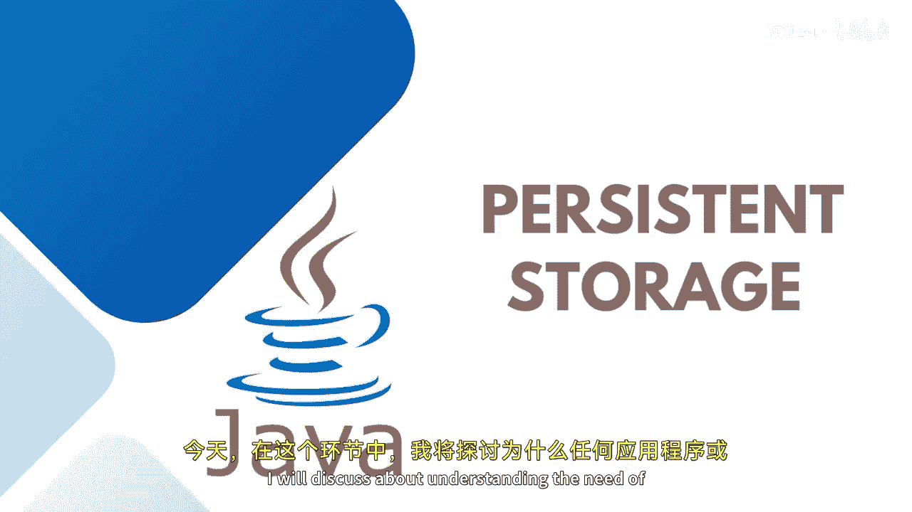
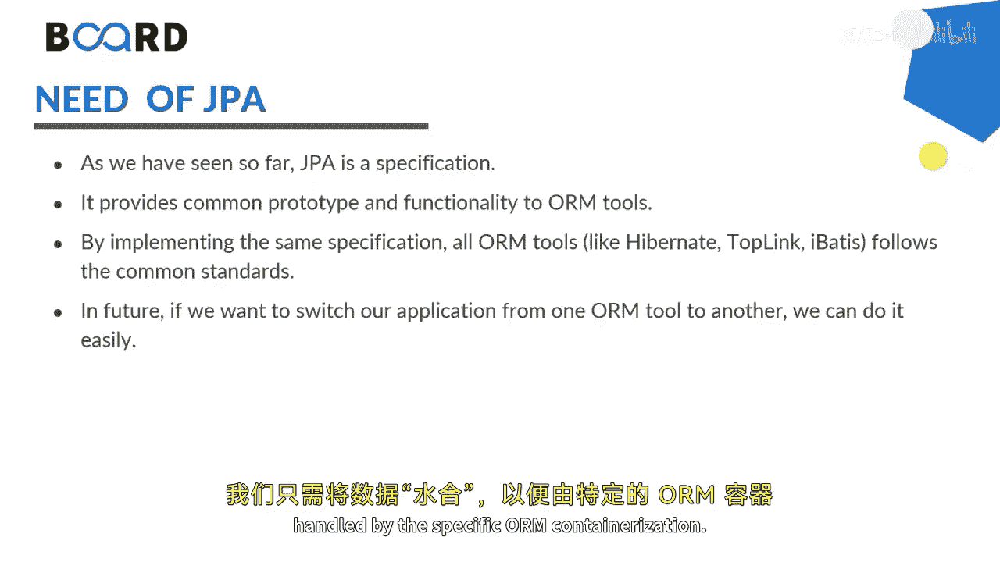
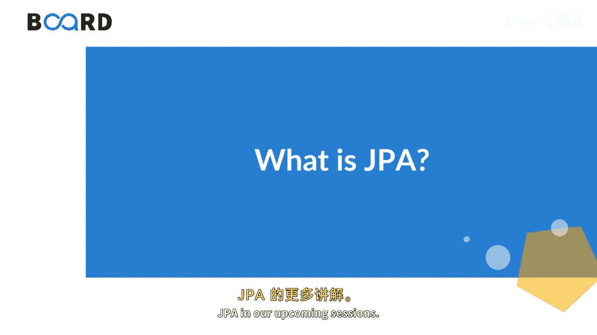

# Java全栈开发：63：理解持久化存储的必要性 💾

在本节课中，我们将探讨为什么在现代应用程序开发中，持久化存储是一个不可或缺的概念。我们将了解其定义、优势以及Java中用于实现持久化的关键技术。

---

持久化存储是指任何在设备断电后仍能保留数据的存储设备。它通常也被称为非易失性存储介质。常见的类型包括DVD等光学介质，以及硬盘驱动器和磁带等磁性介质。这就是持久化存储的基本概念。

## 持久化存储的优势

理解了持久化存储是什么之后，我们来看看它能为应用程序带来哪些具体的好处。以下是持久化存储的几个关键优势：

*   **数据易于维护**：数据被系统地存储，便于管理和维护。
*   **提供安全层**：可以对存储的数据实施访问控制和加密等安全措施。
*   **处理大型容器的灵活性**：能够高效地存储和处理海量数据。
*   **强大的可移植性**：数据可以相对容易地迁移到不同的系统或环境中。
*   **成本效益**：长期来看，使用专门的存储方案比依赖临时存储更经济。

## Java持久化API（JPA）

为了在Java应用程序中实现上述优势，我们需要一个标准化的方式来处理持久化。这就是Java持久化API（JPA）的作用。JPA，全称Java Persistence API，它提供了一套通用的规范和功能给对象关系映射（ORM）工具。

本质上，JPA是一个**规范**，它促进了对象关系映射，帮助我们在Java应用程序中管理关系型数据。它允许开发者直接操作对象，而不是编写复杂的SQL语句。其核心价值在于**可移植性**：未来如果我们想将应用程序从一个ORM框架（如Hibernate）切换到另一个，可以相对容易地实现，因为底层的持久化API（JPA）保持不变，我们只需要更改由特定ORM框架实现的配置即可。

---

**总结**：本节课我们一起学习了持久化存储的必要性。我们明确了持久化存储是一种断电后数据不丢失的存储方式，并列举了它的主要优势，如易于维护、安全性高和可移植性强。最后，我们介绍了Java Persistence API（JPA），它作为一套标准规范，允许我们通过操作对象来管理关系型数据，并保证了应用程序在不同ORM实现间的可移植性。在接下来的课程中，我们将继续深入学习JPA的更多细节。