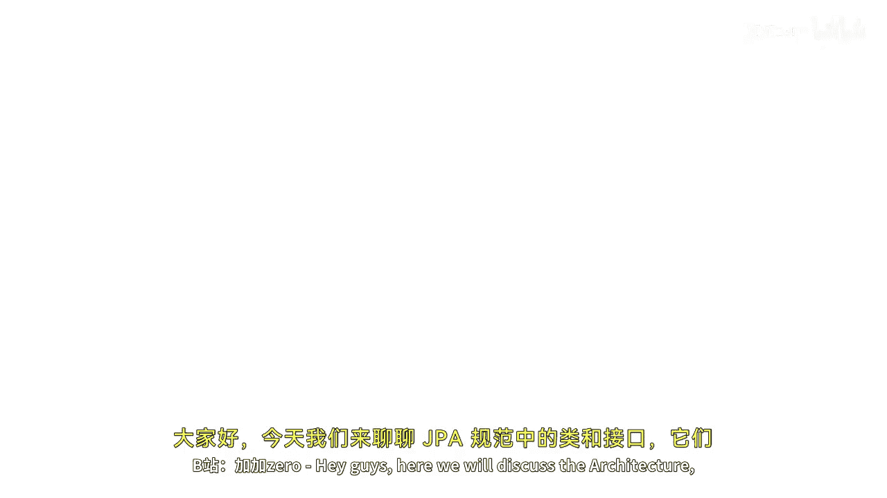
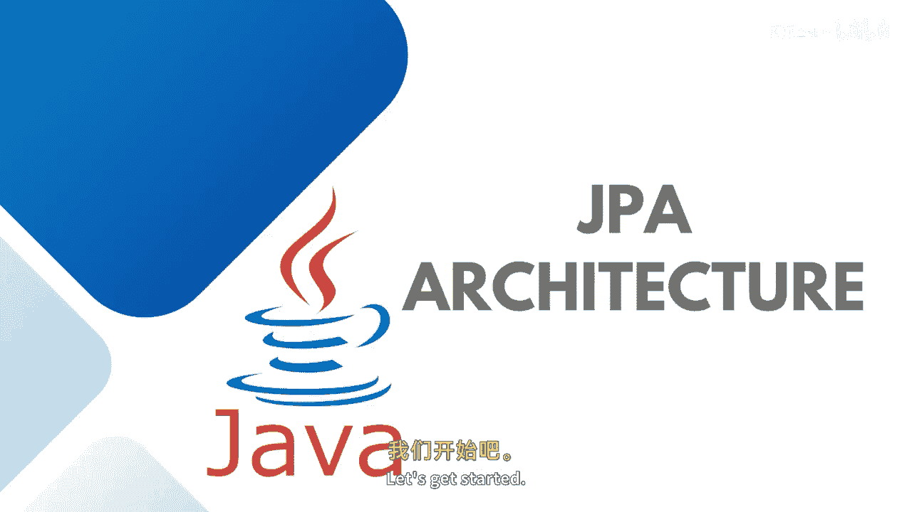
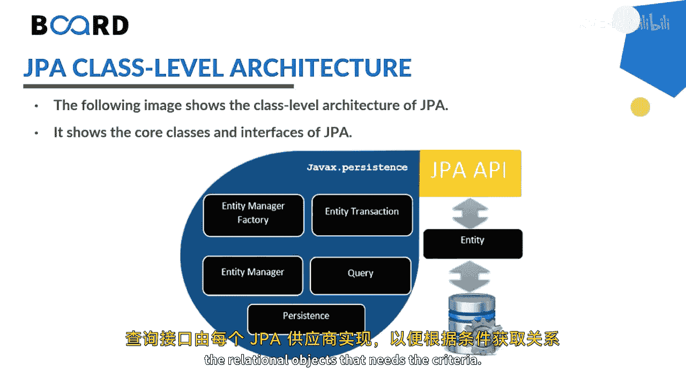

# Java全栈开发：专项课程（下）：04：JPA架构详解 🏗️

在本节课中，我们将学习Java持久化API的架构，包括其核心类、接口以及它们之间的关系。理解这些组件是掌握JPA如何将Java对象映射到关系型数据库的基础。

---

上一节我们介绍了JPA的基本概念，本节中我们来看看JPA规范中定义的核心类和接口架构。

Java持久化API是用于将Java对象映射到关系型数据库的Java标准。这种将Java对象与数据库表相互映射的过程，被称为对象关系映射。JPA是实现ORM的一种可能途径，开发者可以通过它来映射、存储、更新和检索数据库与Java对象之间的数据。

一个重要的点是，JPA规范既可用于Java企业版应用，也可用于标准版应用。JPA规范有多个实现，例如流行的Hibernate、EclipseLink和Apache OpenJPA等。JPA旨在将业务实体作为关系实体存储，并展示了如何将普通的旧Java对象定义为实体，以及如何管理实体之间的关系。

下图展示了JPA的类级别架构：

以下是架构中涉及的核心组件：

*   **EntityManagerFactory**：这是一个工厂类，用于创建和管理多个EntityManager实例。
*   **EntityManager**：这是一个接口，负责管理对象的持久化操作。它本身也充当查询实例的工厂。
*   **Entity**：实体是持久化对象，在数据库中存储为记录。
*   **EntityTransaction**：它与EntityManager是一对一的关系。每个EntityManager的操作都由EntityTransaction类来维护。
*   **Persistence**：这个类包含一些静态方法，用于获取EntityManagerFactory实例。
*   **Query**：此接口由每个JPA供应商实现，用于获取符合特定条件的关系对象。

---

了解了各个组件后，我们来看看它们在这个架构中的相互关系。

*   **EntityManagerFactory 与 EntityManager** 的关系是**一对多**。EntityManagerFactory是EntityManager实例的工厂类。
*   **EntityManager 与 EntityTransaction** 的关系是**一对一**。每个EntityManager的操作都对应一个EntityTransaction。
*   **EntityManager 与 Query** 的关系是**一对多**。因为一个EntityManager实例可以执行多个查询。
*   **EntityManager 与 Entity** 的关系是**一对多**。因为一个EntityManager实例可以管理多个实体。

如何创建EntityManager实例，以及如何与事务和查询进行交互，在你进入实际实现阶段时会变得更加清晰。

---

本节课中我们一起学习了JPA的核心架构，包括EntityManagerFactory、EntityManager、Entity、EntityTransaction等关键组件及其相互关系。下一节，我们将通过实践来更深入地理解这些概念和架构。