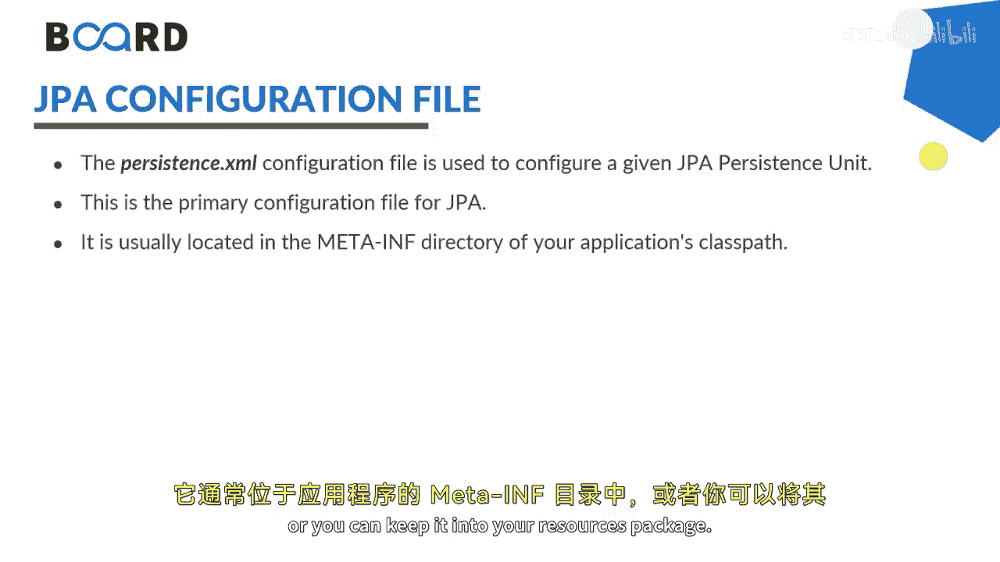
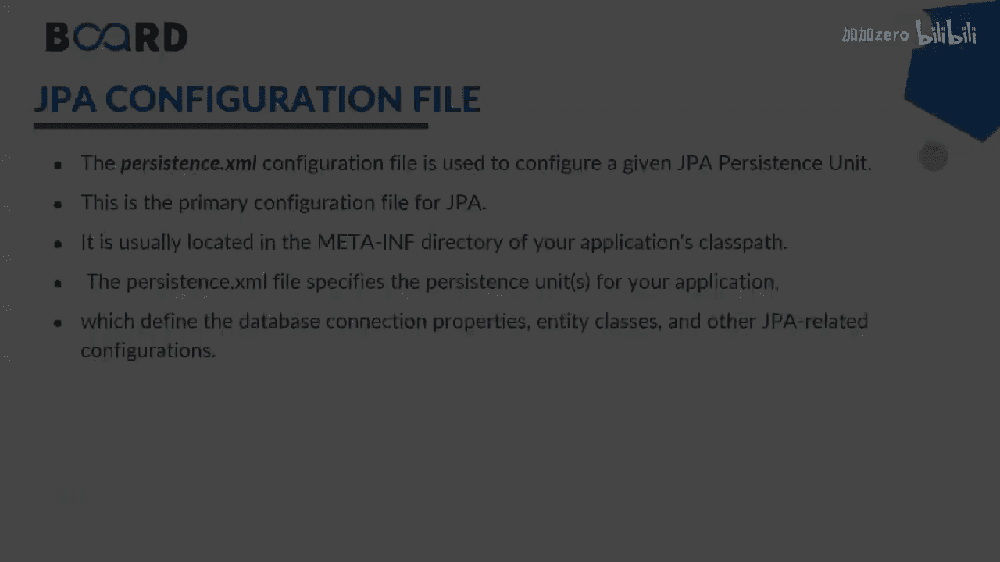

# Java全栈开发：06：JPA配置文件详解 📄

在本节课中，我们将学习Java持久化API中的一个核心配置文件——`persistence.xml`。这个文件在JPA应用中扮演着至关重要的角色，它负责管理所有的持久化配置。我们将了解它的作用、标准位置以及如何在一个Spring Boot项目中正确配置它。

上一节我们介绍了JPA的基本概念，本节中我们来看看如何通过配置文件来具体管理这些持久化设置。

## 配置文件的位置与作用

`persistence.xml`文件是JPA的核心配置文件。它定义了持久化上下文，而持久化上下文是一组实体实例的集合。在这个上下文中，每个持久化实体都有一个唯一的标识和对应的实体实例，并由实体管理器（Entity Manager）进行管理。

该文件通常位于应用程序的 `META-INF` 目录下。在基于Maven或Gradle的现代项目中，你也可以将其放在 `src/main/resources` 资源包中。

## 项目结构示例

为了更好地理解，让我们来看一个Spring Boot集成JPA的项目示例。这个项目名为`springboot-mysql-jpa`。

以下是该项目的主要目录结构：

*   **`application.java`**： 包含主方法的应用程序入口类。
*   **`controller` 文件夹**： 存放控制器类。
*   **`exceptions` 文件夹**： 存放自定义异常类。
*   **`models` 文件夹**： 存放实体模型类。
*   **`repository` 文件夹**： 存放数据仓库接口。
*   **`services` 文件夹**： 存放服务层类。

> 注意：本课程重点在于Spring Boot与JPA的基础集成，因此不会深入讲解Spring MVC等Web层细节。

## 创建JPA实体模型

在`models`文件夹中，我们创建了一个名为`Employee.java`的实体类。这个类使用了Jakarta Persistence API（JPA）的注解。

以下是创建实体类的关键步骤和注解说明：

1.  **`@Entity` 注解**： 将这个Java类标记为一个JPA实体。
2.  **`@Table` 注解**： 指定该实体映射到数据库中的表名。例如：`@Table(name = “employees”)`。
3.  **`@Id` 注解**： 标记该字段为实体的唯一标识符（主键）。
4.  **`@GeneratedValue` 注解**： 定义主键的生成策略。例如，`strategy = GenerationType.IDENTITY` 表示使用数据库的自增字段。
5.  **`@Column` 注解**： 可选。用于指定字段映射到数据库表的列名。如果省略，则默认使用字段名作为列名。

一个完整的实体类除了上述注解，还应遵循Java Bean的规范：

*   将属性（字段）声明为 `private`。
*   为所有属性生成公共的 `getter` 和 `setter` 方法。
*   提供一个无参数的默认构造函数。
*   提供一个包含所有必要字段的构造函数。
*   重写 `toString()` 方法，便于调试和打印对象信息。

> 提示：在大多数集成开发环境（IDE）中，你可以通过生成代码的功能自动创建`getter`、`setter`、构造函数和`toString()`方法。

## 总结

本节课中我们一起学习了JPA配置文件`persistence.xml`的基础知识，包括其作用和标准存放位置。同时，我们通过一个Spring Boot项目示例，了解了如何构建项目结构以及如何使用JPA注解来定义一个完整的实体类（`Entity`）。我们重点讲解了 `@Entity`、`@Table`、`@Id`、`@GeneratedValue` 和 `@Column` 这几个核心注解的用法。

在接下来的课程中，我们将进一步探讨如何使用`Repository`和`Service`层来实现基于JPA的数据操作。

敬请关注，谢谢。