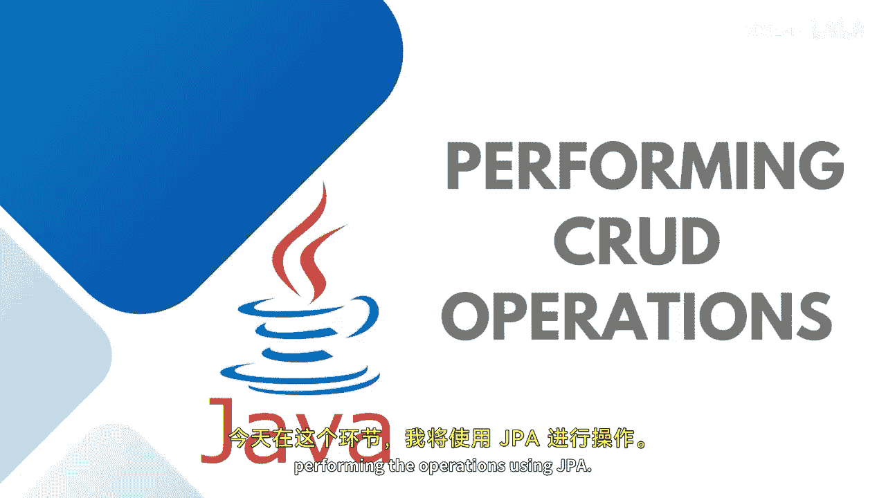

# Java全栈开发：07：使用JPA执行操作 🛠️


在本节课中，我们将学习如何使用JPA（Java Persistence API）来执行数据库的增删改查（CRUD）操作。我们将通过一个具体的例子，了解如何创建Repository、Service和Controller层，并利用JPA的便捷功能来操作数据库，而无需编写复杂的SQL语句。



---

## 创建Repository接口

上一节我们介绍了JPA的基本概念，本节中我们来看看如何创建一个Repository接口。Repository是数据访问层，它直接与数据库交互。

首先，我们创建一个名为 `EmployRepository` 的接口，它继承自 `JpaRepository`。`JpaRepository` 是一个泛型接口，需要指定两个类型参数：实体类（Entity）和该实体主键（ID）的类型。

```java
public interface EmployRepository extends JpaRepository<Employee, Long> {
}
```

通过继承 `JpaRepository`，我们的 `EmployRepository` 接口自动获得了许多用于数据操作的方法，例如 `save()`, `findAll()`, `findById()`, `deleteById()` 等。这些方法由JPA框架隐式实现，我们无需编写任何SQL代码。

---

## 定义Service层

Repository负责数据访问，而Service层则包含业务逻辑。接下来，我们定义一个Service接口，声明需要实现的操作。

以下是 `EmployeeService` 接口中定义的五个核心方法：

```java
public interface EmployeeService {
    Employee saveEmploy(Employee employee);
    List<Employee> getAllEmployees();
    Employee getEmployById(Long id);
    Employee updateEmploy(Long id, Employee employeeDetails);
    void deleteEmploy(Long id);
}
```

这些方法分别对应创建、读取、更新和删除（CRUD）操作。

---

## 实现Service层

定义好接口后，我们需要实现它。在实现类中，我们将注入之前创建的 `EmployRepository`。

```java
@Service
public class EmployeeServiceImpl implements EmployeeService {

    private final EmployRepository employRepository;

    // 通过构造函数注入依赖
    public EmployeeServiceImpl(EmployRepository employRepository) {
        this.employRepository = employRepository;
    }

    @Override
    public Employee saveEmploy(Employee employee) {
        return employRepository.save(employee);
    }

    @Override
    public List<Employee> getAllEmployees() {
        return employRepository.findAll();
    }

    @Override
    public Employee getEmployById(Long id) {
        return employRepository.findById(id)
                .orElseThrow(() -> new ResourceNotFoundException("Employee", "id", id));
    }

    @Override
    public Employee updateEmploy(Long id, Employee employeeDetails) {
        Employee employee = getEmployById(id);
        // 更新employee对象的属性
        employee.setName(employeeDetails.getName());
        // ... 更新其他属性
        return employRepository.save(employee);
    }

    @Override
    public void deleteEmploy(Long id) {
        Employee employee = getEmployById(id);
        employRepository.delete(employee);
    }
}
```

请注意 `getEmployById` 方法中使用的 `orElseThrow`。这是为了处理当根据ID找不到对应记录时的情况。我们抛出一个自定义的 `ResourceNotFoundException`。

自定义异常 `ResourceNotFoundException` 的结构如下：

```java
public class ResourceNotFoundException extends RuntimeException {
    private String resourceName;
    private String fieldName;
    private Object fieldValue;

    public ResourceNotFoundException(String resourceName, String fieldName, Object fieldValue) {
        super(String.format("%s not found with %s : '%s'", resourceName, fieldName, fieldValue));
        this.resourceName = resourceName;
        this.fieldName = fieldName;
        this.fieldValue = fieldValue;
    }
    // Getter 方法
}
```

---

## 配置数据库连接

要让JPA知道如何连接到数据库，我们需要在 `application.properties` 文件中进行配置。

以下是配置示例：

```properties
# 数据库连接配置
spring.datasource.url=jdbc:mysql://localhost:3306/training_db
spring.datasource.username=root
spring.datasource.password=root123456

# JPA & Hibernate 配置
spring.jpa.properties.hibernate.dialect=org.hibernate.dialect.MySQL5Dialect
spring.jpa.hibernate.ddl-auto=create
```

配置项说明：
*   `spring.datasource.url`： 指定数据库的JDBC连接URL。
*   `spring.datasource.username` 和 `password`： 数据库登录凭证。
*   `spring.jpa.properties.hibernate.dialect`： 指定Hibernate使用的数据库方言，确保SQL语句的兼容性。
*   `spring.jpa.hibernate.ddl-auto`： 设置Hibernate的DDL（数据定义语言）自动更新策略。`create` 表示每次启动应用都会删除旧表并创建新表，仅用于初次演示。在实际开发中，应改为 `update` 以保留数据。

---

## 创建Controller层

Service层实现了业务逻辑，现在我们需要通过Controller层来暴露REST API，以便客户端可以调用这些功能。

我们创建一个 `EmployeeController` 类，并使用 `@RestController` 注解标记它。

```java
@RestController
@RequestMapping("/api/employees")
public class EmployeeController {

    private final EmployeeService employeeService;

    // 通过构造函数注入EmployeeService
    public EmployeeController(EmployeeService employeeService) {
        this.employeeService = employeeService;
    }

    // 创建新员工
    @PostMapping
    public ResponseEntity<Employee> createEmployee(@RequestBody Employee employee) {
        Employee savedEmployee = employeeService.saveEmploy(employee);
        return new ResponseEntity<>(savedEmployee, HttpStatus.CREATED);
    }

    // 获取所有员工
    @GetMapping
    public List<Employee> getAllEmployees() {
        return employeeService.getAllEmployees();
    }

    // 根据ID获取员工
    @GetMapping("/{id}")
    public ResponseEntity<Employee> getEmployeeById(@PathVariable Long id) {
        Employee employee = employeeService.getEmployById(id);
        return ResponseEntity.ok(employee);
    }

    // 根据ID更新员工信息
    @PutMapping("/{id}")
    public ResponseEntity<Employee> updateEmployee(@PathVariable Long id, @RequestBody Employee employeeDetails) {
        Employee updatedEmployee = employeeService.updateEmploy(id, employeeDetails);
        return ResponseEntity.ok(updatedEmployee);
    }

    // 根据ID删除员工
    @DeleteMapping("/{id}")
    public ResponseEntity<?> deleteEmployee(@PathVariable Long id) {
        employeeService.deleteEmploy(id);
        return ResponseEntity.ok("Employee deleted successfully.");
    }
}
```

这个Controller定义了五个端点（Endpoint），分别映射到HTTP的POST、GET、PUT、DELETE方法，从而实现了完整的CRUD API。

---

## 总结

本节课中我们一起学习了如何使用JPA来执行数据库操作。我们构建了一个完整的三层架构（Repository, Service, Controller），并实现了以下功能：

1.  **创建Repository**：通过继承 `JpaRepository`，无需编写SQL即可获得基础的数据访问方法。
2.  **定义和实现Service**：在Service层封装业务逻辑，并处理自定义异常（如 `ResourceNotFoundException`）。
3.  **配置数据库**：通过 `application.properties` 文件连接MySQL数据库，并配置Hibernate行为。
4.  **暴露REST API**：在Controller层创建端点，将Service方法暴露为HTTP接口。


JPA的强大之处在于其对象关系映射（ORM）能力，它允许我们以操作Java对象的方式来操作数据库表，极大地简化了数据持久化代码的编写。在下一个会话中，我们将探讨更复杂的JPA查询和关系映射。