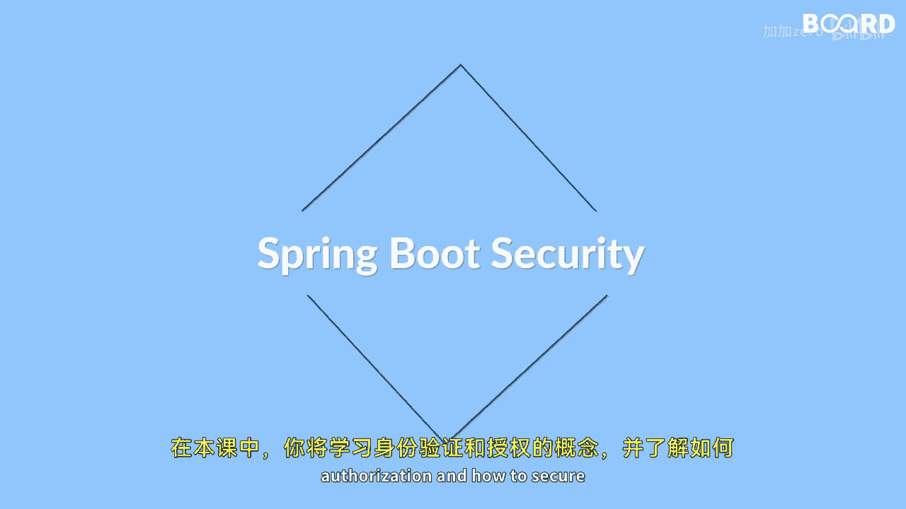

# 【Java全栈开发 专项课程（下）】Board Infinity—中英字幕 p69 p68_01_what-you-will-learn-in-this-lesson -BV1fryaYgEqb_p69-

🎼Hi there In this lesson you will learn about authentication and authorization and how to secure your spring boot applications using spring security you will start by understanding the basics of spring security and its features such as sessions。

 cookies， form login and logout。😊。

🎼Then you will learn how to implement security using JWT token based authentication。

🎼By the end of this lesson you will have a strong foundation in spring Bo security and be able to apply these so see you in the next video。

