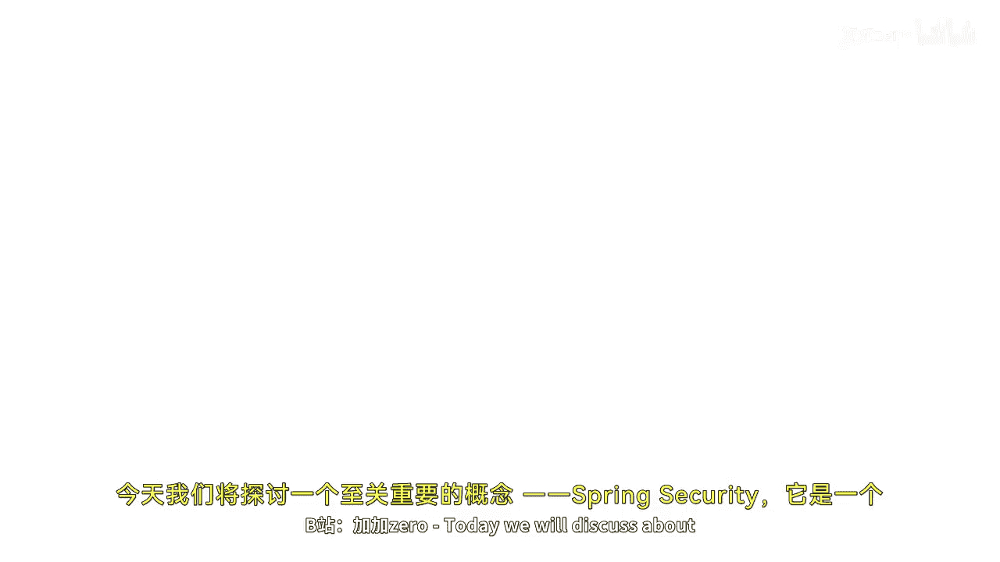
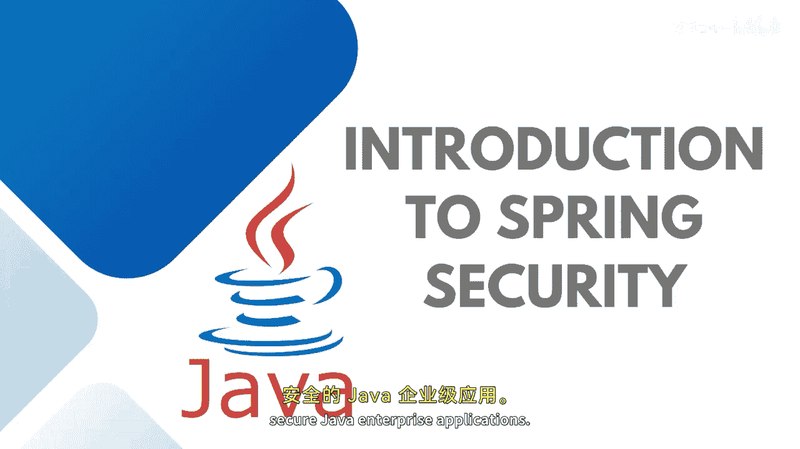
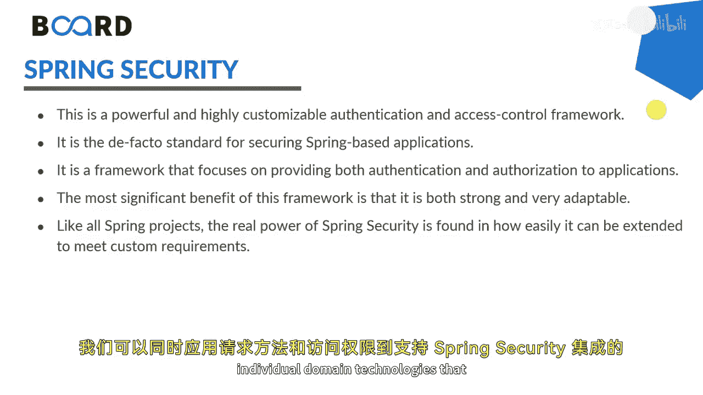
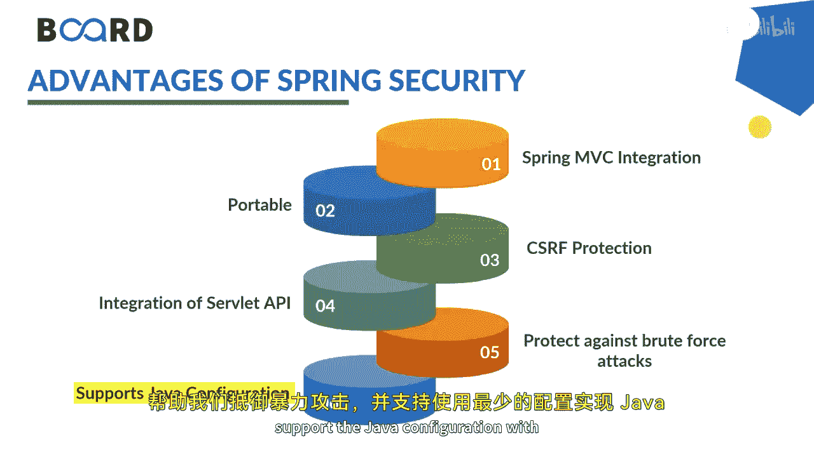

# 【Java全栈开发 专项课程（下）】Board Infinity—中英字幕 p71 p70_03_introduction-to-spring-security -BV1fryaYgEqb_p71-

Today， we will discuss about the most important concept that is spring security。

 which is a framework provides various security features like authentication and authorization to create secure Java enterprise applications。

 So let's get started。

Spring security is a powerful and highly customizable authentication and access control framework。😊。

That targets major areas such as authentication and authorization。

 where authentication is the process of knowing and identifying the user that wants to access。

And author is to understand the process to allow authority to perform actions in the applications。

 We can apply both Web request methods and access to individual domain technologies that support spring security integration with a spring security integration。

 We have various benefits。 First of all， we can easily integrate spring security with spring emsC integration。

 as well as spring spring boat。

The packages are portable CSRF protection safe integration of Ser API can be used。

 help us to protect against brute force attack and support the Java configuration with the bare minimum configurations。

This is how the spring security architecture works。First of all， request comes from the user。

 it comes to the authentication filter， authentication filter gives the request to authentication token or a filter request where the username and password needs to be checked。

If that request checks and comes through by this step 3， it goes to the authentication manager。

Authentation manager gives a request to the authentication provider。

 and user detailed service would be accessible。 Use detailed service will take up the authentication provider by true or false。

 whether the request is validated or not。This authentication provider can be checked checking your authentication by data access。

 object， authentication， CS， authentication or LDAPP authentication。

User detail service can further take the custom user details in memory user details that completely your choice I will be discussing cursing about in memory user detail service and whenever the request comes back by the line step number9 and comes back to the authentication filter security context will check the protocols and next check for the authorization to allow the user to access with the receiver and your response gets close to the。

Client， that's how your spring security architecture works。

Stay tuned to learn more about spring security in memory database integration in my upcoming demo。

 See you in the next session。

。

