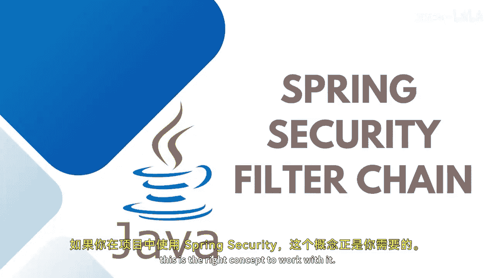
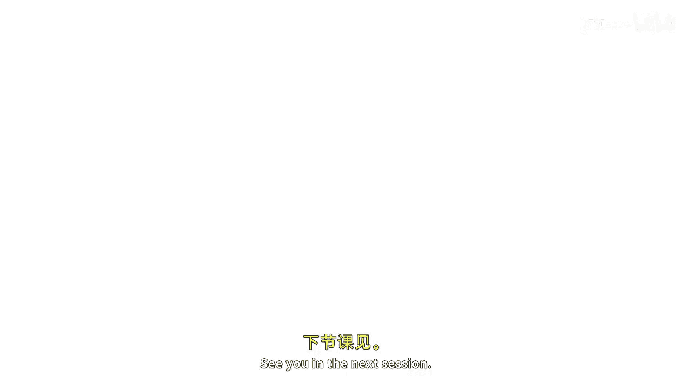

# 【Java全栈开发 专项课程（下）】Board Infinity—中英字幕 p72 p71_04_spring-security-filter-chain -BV1fryaYgEqb_p72-

If you are using spring security in your project， this is the right concept to work with it。

That is a filtered chain。Basically the filter chain works with a spring security spring security uses this chain of filters to execute security features if you want to customize or add your own logic for any security feature you can write your own filter and call that during the chain execution。

 each filter in the chain performs a specific security task such as authentication authorization session management persistent cookies authorizing the right user allowing them for the specific resource and whatnot。

So the filter chain is responsible for enforcing the security rules and protecting receiverrs based on the configuration defined in the application。

 This is how the filter works。 The client ends the request for a receiverrs。

 Let's say emC controller or the controller over a spring boot。

Application container creates the filter chain to process incoming request request goes to each HtTP survey request and passes through each filter and whatever logic you write it up there that validates by the specific execution。

Filter performs the following logic and on the most of the web applications such as change the HB Ser request or response before it reached to our spring MVC controller。

Can stop the processing of the request and sensor a response to the client。

 And this is how the filter chain works in a real time。

So Harris user accesses the application that is through security。

 spring security usually this will be through a web browser and the application will send a request to the web browser web browser passes the incoming request through all these filters。

 incoming request passes through each and every filter by performing the logics that you write inside that it will also check the filter chain proxy if you have configured if everything goes well。

If everything goes well， the request will eventually come to Embassy controller。

 which holds the backend for the application。Filters can create HTTP s response and return to the client without even reaching out the controller。

 That's how the filter chain works。Stay tuned to learn more about the practical implementation See you in the next session。

