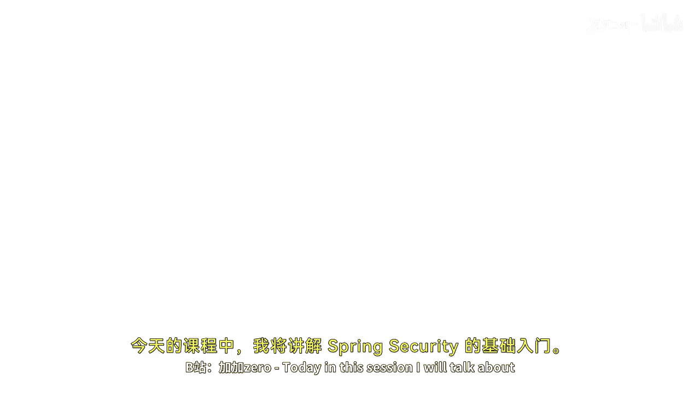
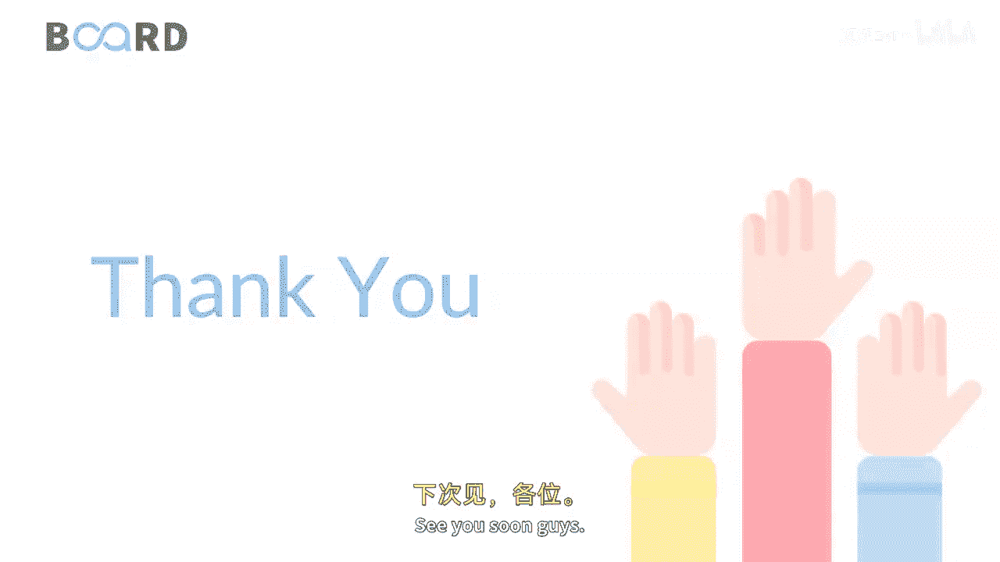

# 【Java全栈开发 专项课程（下）】Board Infinity—中英字幕 p73 p72_05_spring-security-hello-world-demonstration -BV1fryaYgEqb_p73-

Today in this session I will talk about spring security Hollo word。

 first of all I will show you how the spring security works and what Im expecting from my practical implementation and then I will tell you how did I implement it's thoroughly not possible to execute write each and every statement by over on in the session its becoming long and typical so I will be demonstrating you each and everything attaching the code below you can check that So basically what Im trying to do is the moment I run my spring security application just have a look this is my spring security application and here I write spring security application that's named as hollowlo word by default when I make this request it comes to the Hol pose that I would like to check with different domains which I have created by keeping the different URL practically。

😊。

ment where I say that if I write public pages， it would be asking for only the basic details such as name and age。

 I just write King 23 and summit， it will just display that。

 but rather than public if I start from secured。And pages。

 you can see that it is asking that hi user great welcome to the secured page because I am already logged in that's what it is asking me that I am logged in I haven't logged out because logout feature is not as of there in the session。

So you can just see that I refresh with this security。

Secure pages and you can see that it' is asking me to log in with the username and password if I do not enter any details it ask me to attempt the login its saying bad credential otherwise I just enter KB and KB12。

3，4 those are the credentials and just log in and you can see that the user is successfully logged in。

That's how your application will work。 Now， let me tell you how and what are the things I implemented in this project。

 so stay tuned I'll tell you the next session。 See you soon guys。

。

