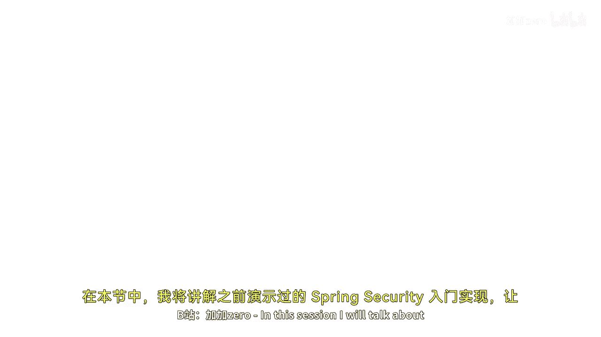
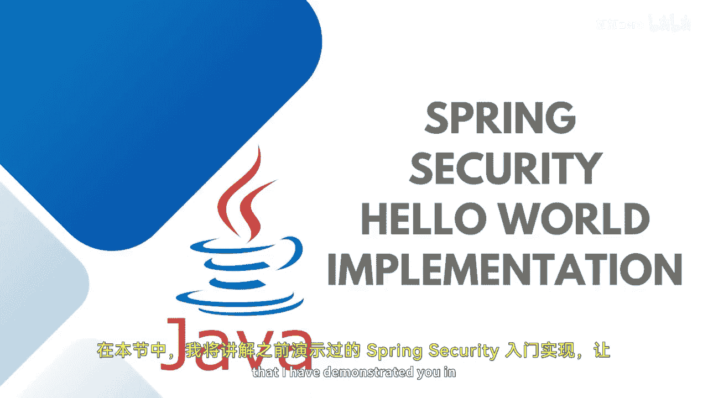
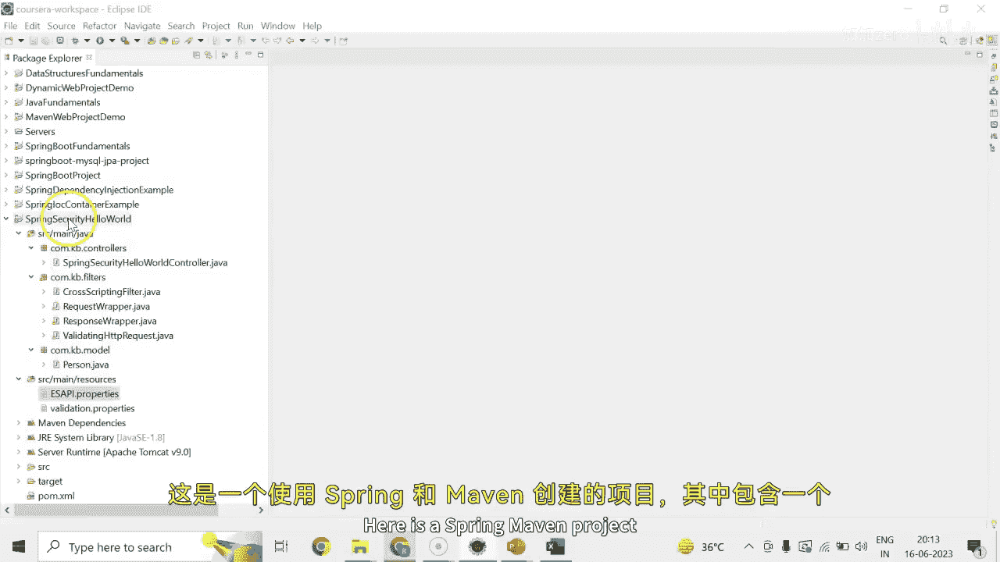

# Java全栈开发：专项课程（下）：P74 Spring Security Hello World 实现 🛡️

在本节课中，我们将学习如何实现一个简单的 Spring Security “Hello World” 应用。我们将创建一个包含公共页面和受保护页面的项目，并了解 Spring Security 的基本配置和工作流程。

## 概述

在上节课中，我们演示了 Spring Security 的基本概念。本节我们将动手实现一个具体的项目。这个项目是一个 Spring Maven 项目，包含一个控制器、公共页面和受保护页面，用于展示 Spring Security 如何拦截请求并引导用户登录。

## 项目结构

首先，我们来看一下项目的核心结构。项目中有一个控制器，用于处理不同的页面请求。

在控制器中，我们定义了公共页面和受保护页面的端点。公共页面会检查一个包含新用户信息的属性。这里我们有一个 `Person` 类，它具有私有的 `name` 和 `age` 属性，并通过 getter 和 setter 方法进行访问。

## 页面功能

以下是项目中各个页面的功能描述：

*   **公共页面**：当用户发起一个公共请求时，页面会简单地返回一条欢迎信息：“Hi user, great welcome to the secured homepage”。
*   **受保护页面**：默认情况下，在登录后会跳转到受保护的主页。这是一个安全的页面。当用户请求受保护页面时，系统会展示登录页面。
*   **页面存放位置**：所有的网页文件都存放在 `src` 目录下。具体路径是：`src/main/webapp/`。例如，`index.jsp` 文件就位于此。所有集成了安全代码的页面都放在这里。

## 安全配置

接下来，我们看看安全相关的配置。目前，我们允许任何具有“USER”角色的用户访问受保护资源。

Spring Security 会拦截每一个请求，并将其传递给 `DispatcherServlet`。`DispatcherServlet` 会扫描项目包。当你发送请求时，请求的路径必须与控制器中定义的路径匹配，这样请求才能被正确处理。

## 过滤器链

在请求处理过程中，会经过一系列过滤器。我们在 `com.xxx.filters` 包中添加了几个过滤器：

*   `CrossScriptingFilter`
*   `RequestWrapper`
*   `ResponseWrapper`
*   `ValidatingHttpRequestWrapper`

这些过滤器来自特定的包，我们通常不需要修改其内部逻辑，因此这里不展开详述。

## 验证属性

在 `validation.properties` 文件中，定义了一些验证规则。例如，未来如果你需要使用邮箱、IP地址、URL、信用卡或其他评估细节的验证，可以在这里配置。目前，在这个演示项目中，我们暂时没有使用这些验证功能。

## 核心依赖与页面

要实现这个项目，你需要添加 Spring Security 的核心依赖包。同时，你需要在 `webapp` 目录下创建相应的页面。

例如，我创建了一个受保护的 `home.jsp` 页面。它会打印从后端 `HelloWorld` 控制器返回的消息。而 `helloworld.jsp` 页面则负责接收输入的 `name` 和 `age` 信息，并将其打印出来。

## 运行与输出

按照上述步骤配置和编写代码后，你就可以运行这个项目了。运行结果将与我们上节课演示的效果一致。

为了方便你的学习和参考，我将提供这个项目的完整内容。你可以直接查看和使用它。

## 总结

本节课我们一起实现了一个 Spring Security 的入门示例。我们创建了一个 Maven 项目，配置了安全规则，区分了公共页面和受保护页面，并了解了请求如何经过过滤器链和 `DispatcherServlet` 进行处理。通过这个简单的“Hello World”项目，你应该对 Spring Security 的基本集成方式有了初步的认识。我们下节课再见。