# 【从零开始用C语言制作游戏】 p25 Steam Game： Source Code Walkthrough -Break Arcade Games Out- -BV18i421a7DD_p25-

Hello everybody， welcome to the source code walkthrough of the Break Art Games Out game they were built entirely on a live stream and released on steam so this is kind of a live stream where I'm just going to explain how the source code turned out。

呃。Im knit what I'm watching I'm watching you now， okay， thanks man。

We're going to do a source code walkthrough， so I'm going to show you guys what the end result was in terms of source code。

 how you guys can get it， how you can compile， how you can modify。

And to help you over sensorens source code， if you're not up to watching the whole series。

Because in case you're not familiar with what we did， we started out like two months ago。

To create a game in see from scratch entirely on live stream。And we did the whole thing， I mean。

 we did software renderry for the game， then we did like a lot of gameplay， a lot of cool animations。

 juice net and all that stuff。All the way to the steam release， which was last stream。

 we finally finished the game。It was a total of like 81 hours of live streams。

Wwhich is a lot of videos， but in terms of like creating a game from scratch and the engine and showing every system。

 it's lot's a lot in terms of information， a lot of cool information， right？

So in this is same page as you guys can download the game for free。

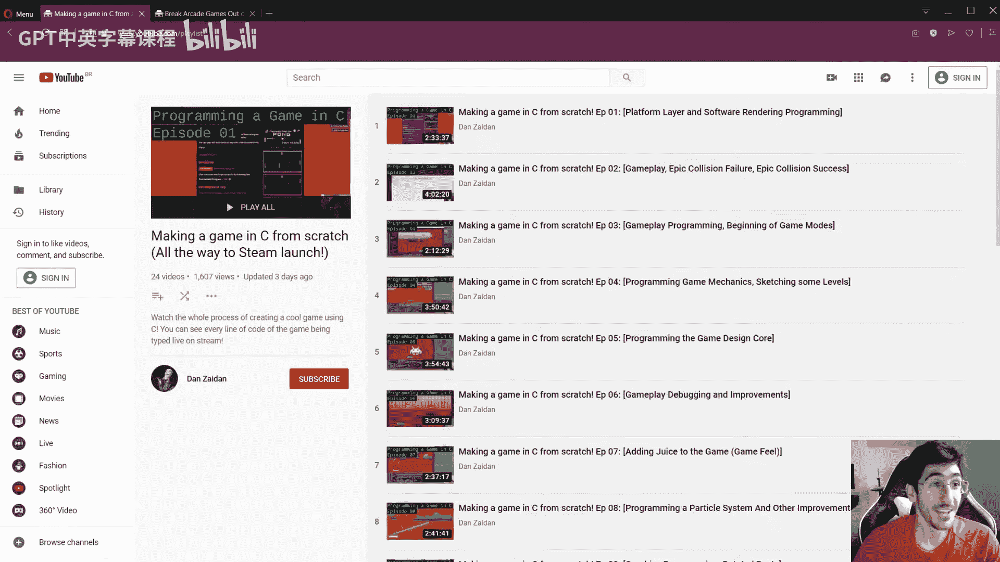

And also the source code， so the source code is here is a free DLC。

 you can click here and download the source code。

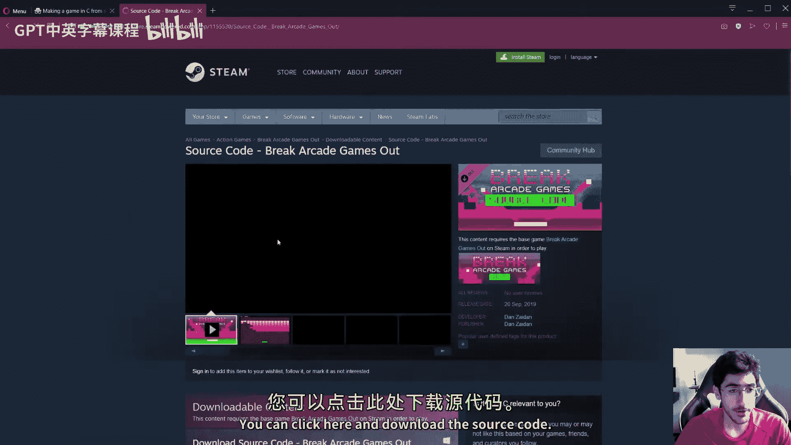

And once you do that with the source code， you will have this folder right here。

Inside the game folder in your sting install directory。Steam steamax common breakar aim out。

 you get this code folder， this is what the source code is。

And this is the game just going to show you guys really quickly。

In a case you guys don't know having seen， right？

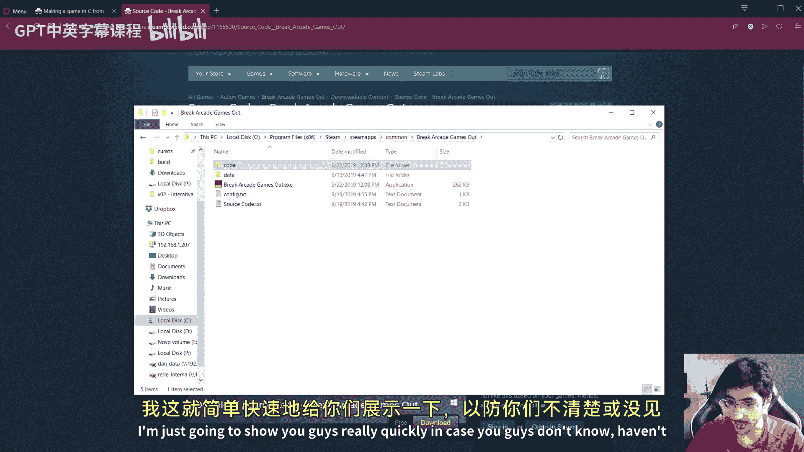

And turn our volume up a bit。

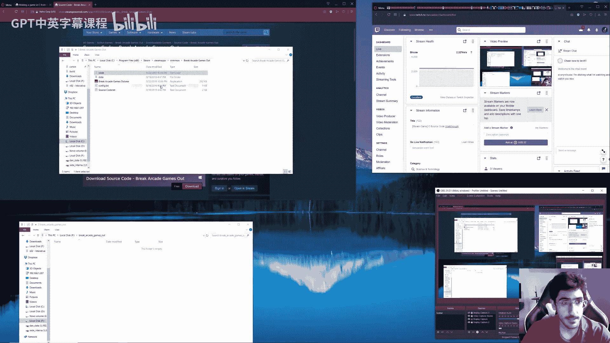

So this is the game you created on the live。It starts out as a breakout clone。With。

nice animations if we look that part of our systems， everything we did， neo and side effects。

 everything we created on live that was great cool you can watch the whole thing。

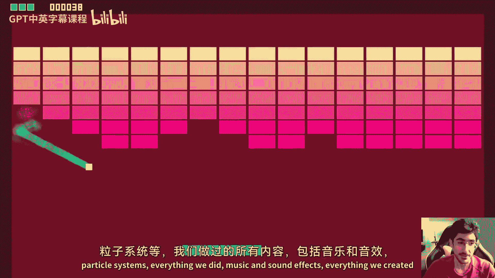

And then we added like hour ups to the breakout game。🎼须样。🎼う。🎼。I near building。

This is like it's pretty， the comments are of and these are par down not。

You to have a like negative consequences。快点。

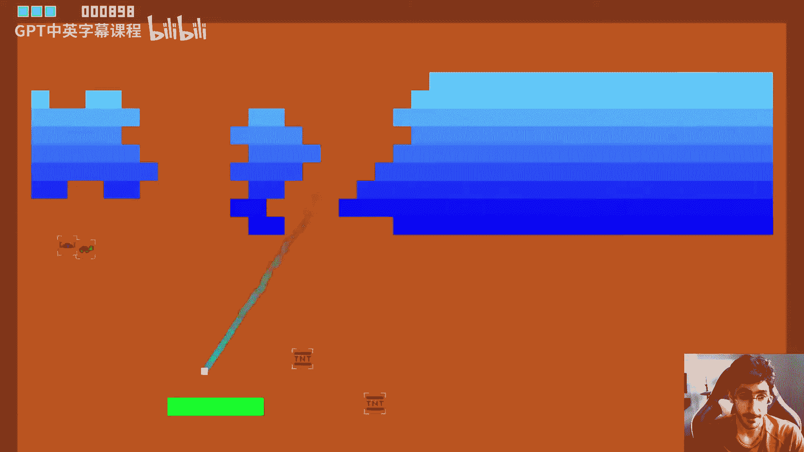

And then。Well the cool thing about the games that it's like all normal。

 not all of them like a lot of arcade games， as if the mall were breakout。

 so this is like breakout harm。And I have to， I still have to destroy like you breakout rules。

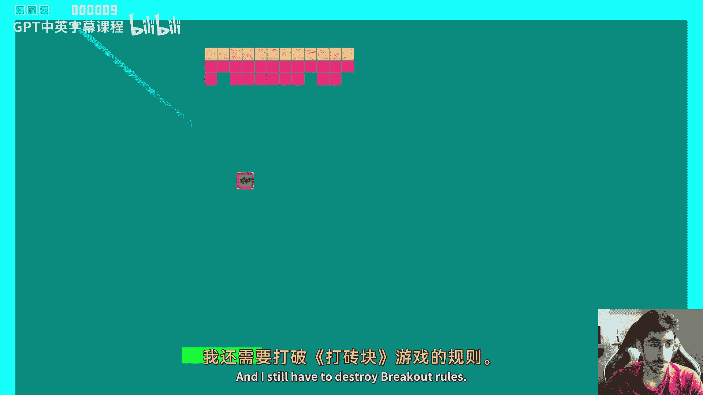

And this is like quickout address。And this is Rick space invades。そすね。🎼ハルキー。

So this is the game you created on life。两人一。

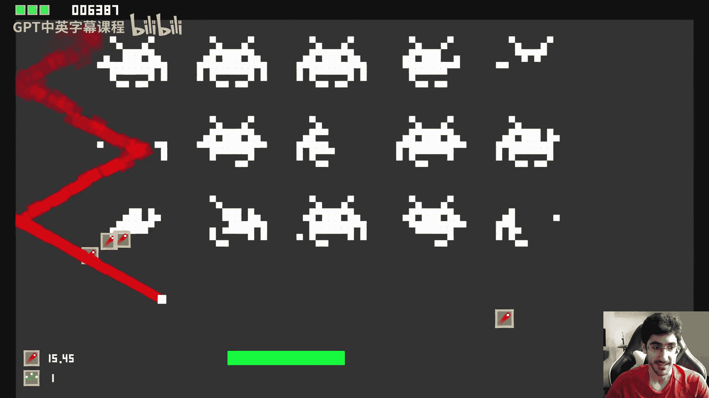

Okay， so in order to build a game， what I'm going to do is I'm going to copy both the code and the data folder。

I think I like the Comp as well。To an empty directory so I create an empty director called BreakoutK Games outm going to copy the code。

 the date Ni the source code text file is just like the tutorial but I'm going to show you guys here now and the license the license is like public domain and you can do whatever you want with it。

 so let me show you。So yeah， it's pretty much you can do what everyone want with the sort of like learn。

 modify， make your own commercial games， copy， whatever。呃ok。Now that I have the game here。

I can build a game by running this build dot bat。But here's the thing， good about that。

I can't just run that through a command prompt like this。呃。扣。

About that because it uses the C command， which from Visual Studio， right。

 so I have to go through Viual Studio command prompt I'm going type here。

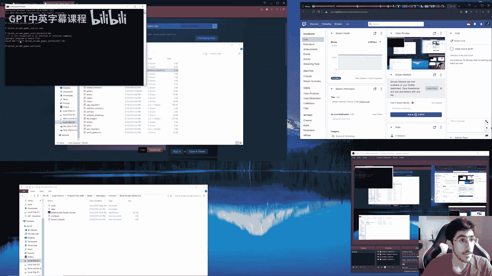

Oh guys， let me just zoom in。 So yeah so guys guys couldn't read right。

 they had a comment from that's okay， if I go。So like the visual studio developer。

 see what is it called？Develop developer command prompt for VS。

So if I make one of these command prompts， then I can build a game。Make I get games out， code， build。

There you go， but there are a ton of warnings and stuff。Yeah that's weird。 what I can do。

 but I think it pretty much built the game see。didn't go the game， let's take a look at that。

 but oh because that was 32 bits， Okay， so the developer command prompt for Vi studio。64 bits。

 let me see if I can get。Just see if I can open that file directory here。Now what I am going to do。

 which I advise you guys to do， is to open the DCVs Aldot that file。Okay。

 so making by opening this on any command prompt， pretty much make this command prompt if you just studio。

 and you can pass the x64 argument。As a。Augmented this shell right so then the C command will work in the 64 bit version。

 which is the one we want， so there'll be no warning。

So'm going to go through code and then build up that。

Yeah perfect so this is how I was supposed to build the game and now there's like this do folder with the with the executable here。

 but if I try to run the executable from this folder it's going to crash which is like we should' have made that little bit more I don't know safe in the sense。

Because you should have run through the base folder。Not the code or the build folder。

 so from the base folder I'm going to run the。

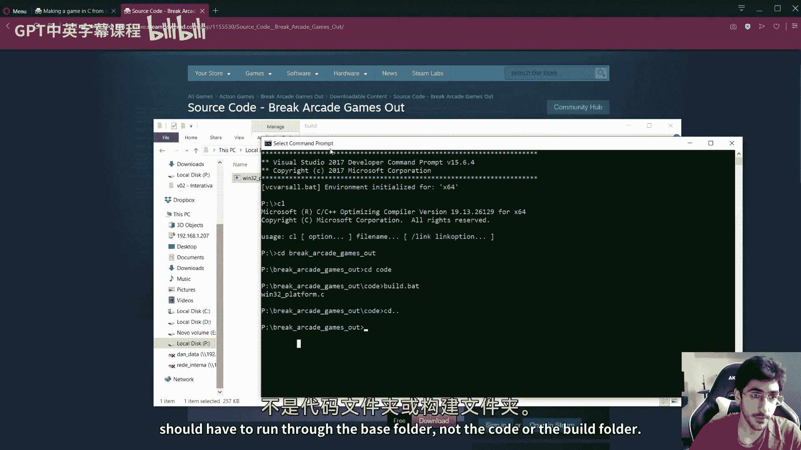

Executable。It runs perfectly。Or I can just copy that and put it out here， and then it also runs。

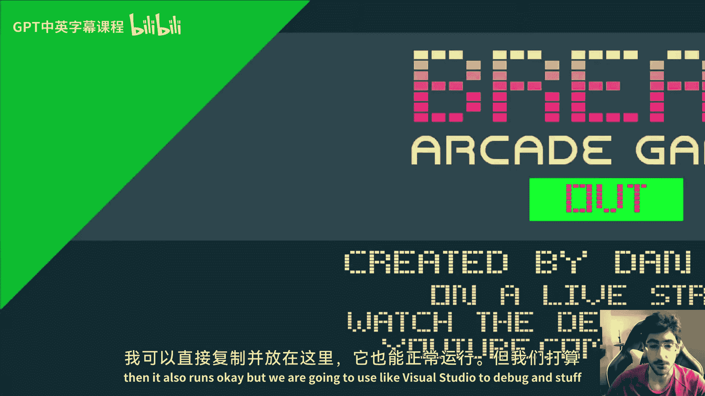

Okay， but we are going to use like Vi Studio to debuggging stuff。

 and then we can set the working directory to the base folder， so that's what we're going to do。Okay。

 but so so that's how you build the game， so we have to make sure that you are on a command from for Viual Studio。

Set to 64 bits， okay， so that's the first thing， let me show you guys the script for the。

For this comment prompt。

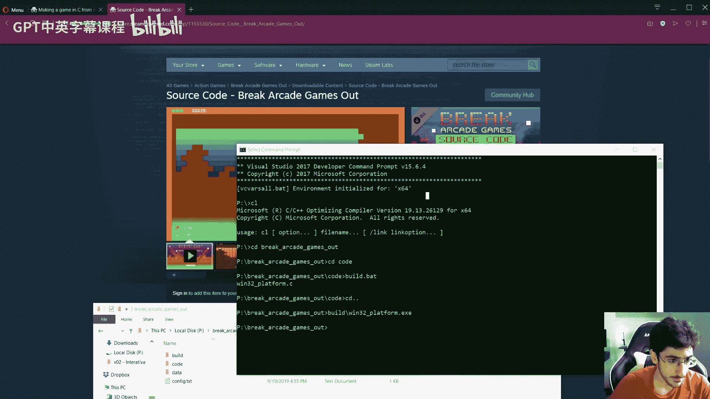

Just one second。So so this the script I run。I call。My visual Studio install folder。

So at s VC artuxillery， build VCs or do that， and I pass x64 as an argument。So when I call this guy。

Any shell， any command prompt？

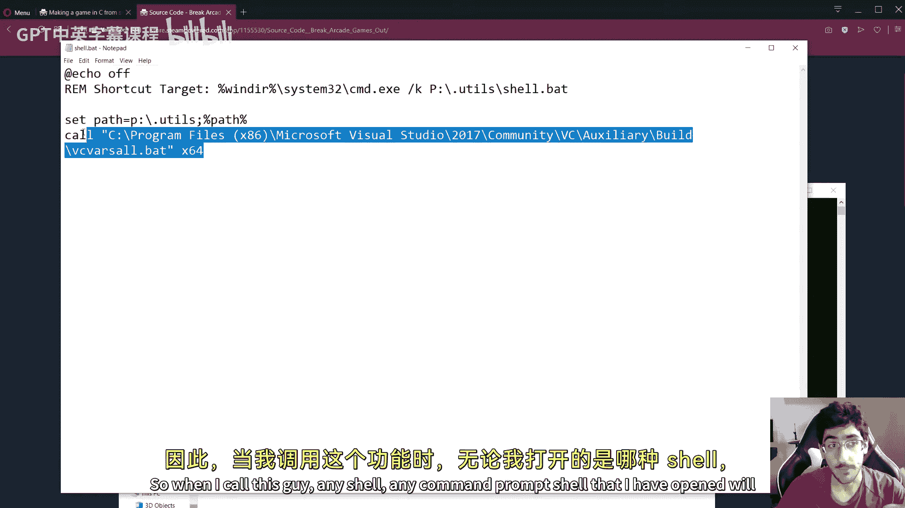

Shell that I have opened will be initialized to。Be able to compile using the CL。

The compiler right for 64 bit so that's what we want so now you know how to build a game so let's start playing around with it now right so I'm going to open four code to my editor of choice you can do whatever editor you want。

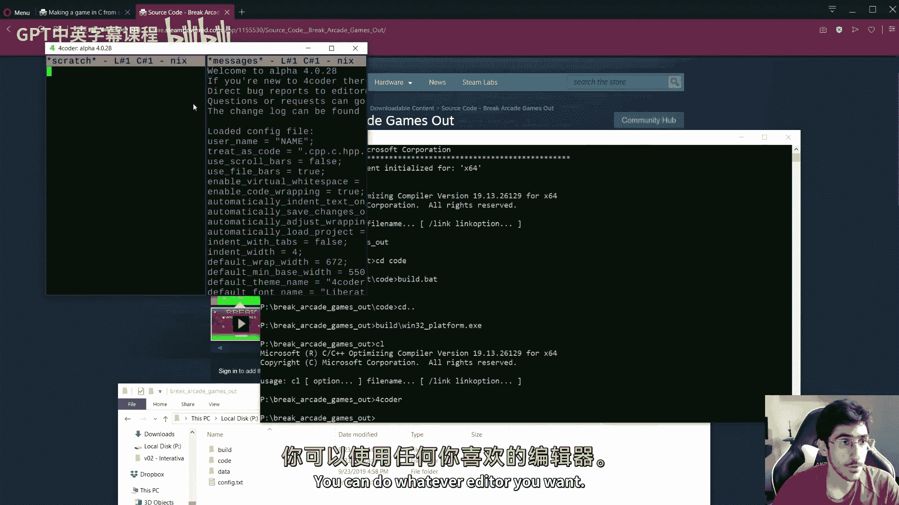

All right Viual Studio if you want that as well。Let me show you the build file。

 which is like the base file， right， so this is our CL command to。

To compile and we're compiling just one file， we're compiling just the W 32 platform do C。

 This is a very cool way to do a unity build。And by compiling the platform file。

 this file pretty much。Pretty much includes all others， like it includes like utilities， math。

 string， the game， the audio， the console， the software rendering profile or the assets。

 all the files， all the files that we can see here in the source code。

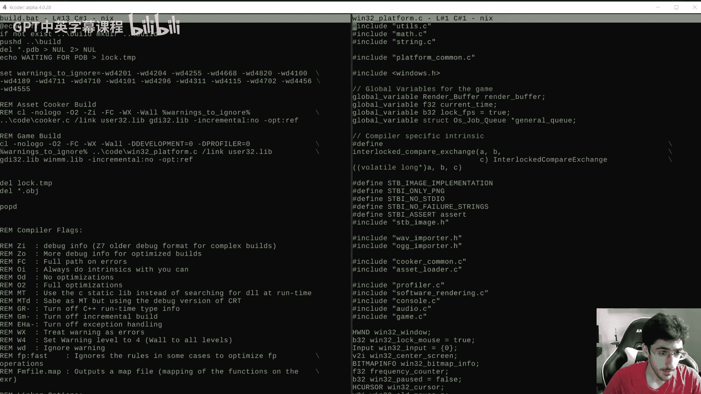

Here。And I have pretty much like one file from each major thing that we created to sort out just like the bathroom file。

But then we had to like the game， which is another important one the game and the levels are pretty important。

And then we have like the cooker for cooking our assets and the console for helping us print and stuff。

And I have audio， which is another pretty cool one and our asset loader and in every major system you can watch the series here。

 so I'm just going to give you an overall idea。

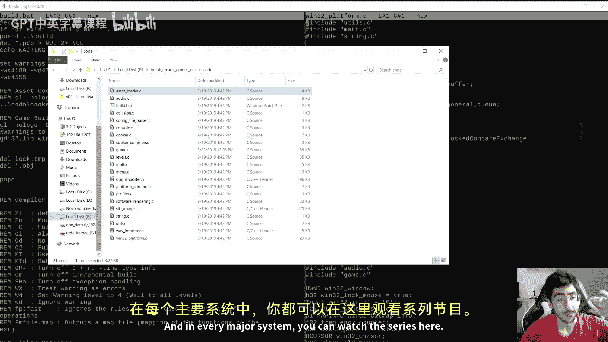

For the the。For that code， and if you want to watch a specific system like I don't know a profiler。

And then you can watch where we build the profiler right so that's the basic idea Okay。

 so we have a to of like helper like helper of file functions and multi threadreading stuff。

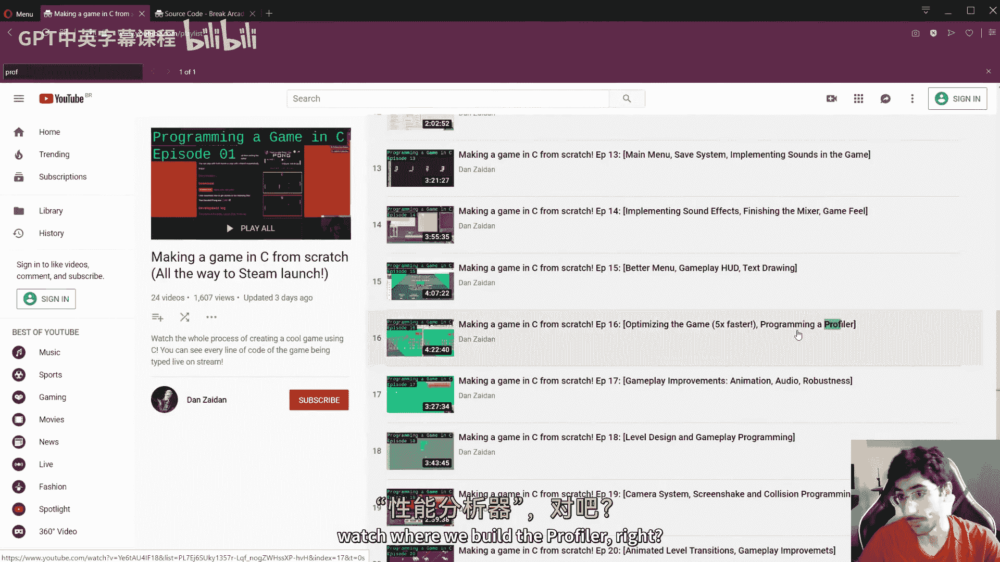

And dealing with time， dealing with audio， we use like directx sound for the library。

And like more audio stuff。And like the full screen thing。

 and here's the here's our main so the first thing we do， like load the cursor and set the。

The period to one minuteise second so we can get like a good sleep。Gandularity。

And then we pretty much just create our window， we create a window class， we register it。

 and then we pop the window， and then if we're not in developer mode， we make that full screen。

Then we get the frame rate that we should be running on and set up some some of my timing stuff and here's the audio stuff and the audio we create a job queue and run that on parallel so that motorread stuff that we just see went past this file。

This is where we use it， we create the audio queue。And then run update audio on that。

 and you can watch the whole episodes on audio， especially like the last episode that we fixed and made that 100% that was pretty cool。

Okay。And then we create another thread。Another key that will be used for mostly our asset system。

 I think。And that's it， and then we initialize our randoms， this like the main game loop。

 this while' running。So we set up the profiling for this for this guy and then we run the input to which is the first step right。

 first of all， we're going to set the。Chaed to false。

 which is the way we did the input you can watch that on the first live stream that was pretty cool and then we'm going run through all the windows messages and get like Windows buttons like mouse left mouse right and then we're going to process each button that we care about which like。

This is mostly for debug， the right left up and down arrows， but they only have the ask。

The escape key， right？And so like developer things and like that one man。

Did we recommend all lot of four A， we did， here's a lot of four。Okay， and okay， so the mouse inputs。

 now we're going to get the cursor position。Then we're going to change that to the right unit that we need。

 which is inverting the Y。And then we're just going to get the deelta。

And if you remember we had a hard time doing that in the first couple live streams and then implemented this pretty cool system where we're going to lock the mouse in the center of the screen。

 right by setting that to the center of every frame。But before we do that。

 let subtract and get the mouse DP so the mouse doesn't get stuck here。

 we just get the delta and then the game is going to use that， we're going to see that in a while。

Okay， and after that， I'm going to update the game is the most important thing。

 we're going to see that。Here's game's going to run everything that it needs and since we're using software rendering。

 were also going to render here like calculate the actual pixels and stuff。

And then we're going to render the profiler if we have the profiler enabled。If you don't。

 I can just open the like profile to see oops。Profilr。

 we just have like these functions doing nothing if if we don't have profiling enabled in our build。

Like developer and profiler。Okay， and then we。After like render the profiler， we that to the screen。

 so we have our buffer， which we filled in our update game function。

So this is the point where we actually send that to Windows。

And ask it to copy the pixels to this screen， okay， and the very last moment we sleep。

Through well if we should sleep， like if we're locked。

 we sleep to that amount that we should sleep now too to have a constant frame。

 which is good for animations。These are our main look， okay， which is pretty pretty straightforward。

 nothing too fancy now let's see how the game is structured， right？啊。So the thing about the game。

 let me just go through the update beginning， then I'm going to see the oppositeary functions。

If the game starts out with a initialized like this if here， this is like the start game function。

 this if initialized here， if not initialized right。

 so this is where we set up the like default valuess like game mode to the menu and then we load the tech file so we can go like to the assets folder。

😊，And see what happens when we load back file， we get that from the OS。

They will make sure that the diversion is correct， the number of assets is correct。

 that we have our like magic word here and stuff。啊。GA for gay assets， I don't remember。Okay。

 and then we load。Every sound and every bitmap， so like we have like load。Load sound from pack。

 is that correct？There you go， so if you're like wave， we just load wave for memory。

 if we're like OGG， we load AGG a syncnc， we implemented that after we did jobs and that was pretty cool implementing that asInc。

You can watch that on YouTube。Okay， now we play the sounds like the music and then like the background sounds。

 so some of them we set to zero， but we want them to be playing already because。

Those are like the basic looking sounds， okay， like the ball sounds， the power block sounds。Okay。

 everything is good here。And this immutable sound is pretty cool if you go to like the audio system。

The immutable sound is something that sets like the sounds that when we try to reutilize the plain sound array。

We're not going to go all the way from zero like it's not going to be like a full circular buffer。

We're going to go from the immutable sound count to the last one because we don't want to overwride like the music and stuff。

 but we can override like a small explosion that's pretty much done already， right？Okay。

 and then we load the save game， which is pretty simple like save。5。

The load game pretty much just read the same file from that it's on the platform layer。

Just read that pretty easily， then make sure the version is correct， and if it is。

 we just save that we just copy that directly to our global structure。

 which has like our level states。If it's locked in the high score， it's pretty easy。

 we did that pretty quickly， same thing save， the load in' safe。Pretty easy。He soo， games， go back。

Okay， and then the cong that's pretty cool we did that pretty much I think on the the。

Not the last one， but the one before the last one。The last developing actual developing streams。

They are this complete file， which parses。And looks for like mouse sensitivity settings。

 window settings， locked FPS， maybe mean parts like bulls and floats。

 we search for like true values or we actually read floats so that's pretty cool for to watch。

How we do like a small text file parser that reads the floats and bulls。

And you can do this to read ins pretty easily as well。

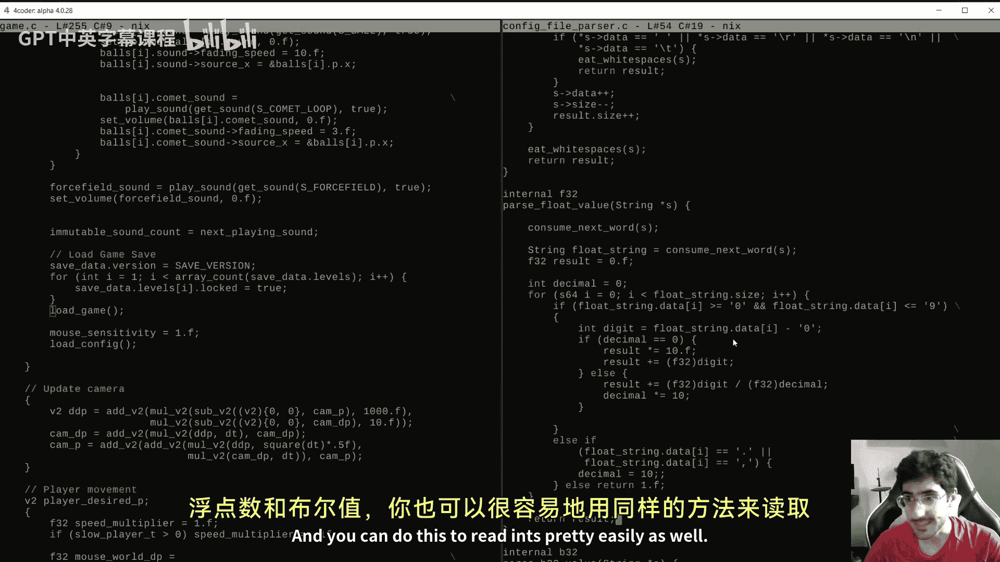

That was pretty cool。 That's in the。Con file。

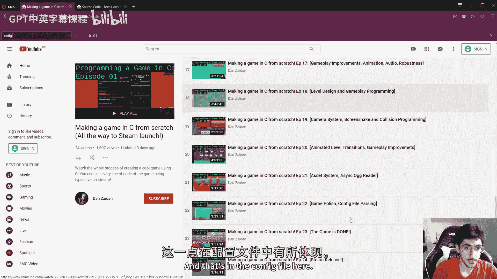

Confi。Yeah， here it is。Okay， so that's the game in it so this is like the actual loop so we first update the camera because the camera only moves through like screen shake。

 it doesn't follow anything so you can't update that right off the bat there's no problem。

Then we do it like a play movement and a play movement is based on a mouse。

 so first of all we have the mouse T， remember that we got from the platform layer to the inputstruct and thesestructs are defined in platform common file。

So it finds like what the input should look like， what buttons we need。

Have some like macro helpers to like see if it's pressed or released or it's down stuff。

And also have like the basic audio and services， so like whatever the game wants from platform layer。

 it's specified here as like the function prototype just like callback stuff。And a re file。O。

That's basically it in terms of the communications in platform layer and the game。And at this point。

 we update that， we change that from pixels to world， and that's on the rainry。

World in the world so we calculate that through this I expect multiplier that's pretty cool do that in the very first day we this pretty cool system there we can change the size of the window and again will keep like the basic 16 by9 play area always on screen that' was pretty cool。

So after we have the mouse in world units。Were pretty much just incr on that。

Our target P right so the target P is where the player wants to go。

 but we don't actually just say that because if you play the game you actually see that we have like a wobbing movement on the that that was pretty cool on the like a pretty cool animation and that is this spring thing。

To calculate the desired。P， right， for like the。Based on the targets that we just open that。

And then we do like this print function and you can see all that in the power movement stream。

 but it's basically like we want to go to this to this velocity zero and we have this velocity and we want to go to this position。

 which is the play desired key， which is we did a collision on the wall so we don't go all the wall up。

Go all the way。To the other side of the wall， right？And we are here in this position。

 and each one has a factor， right a。In fact that we multiply that by and these factors we have like the movement fuel。

 so if want to play around with that， those are the guys that were want to look for。

And then we did like the basic equations of motion to calculate the acceleration， which was the DDP。

 the derivative or the derivative of the position， as well as the DP。😊。

The derivative of the position which is the velocity and the position if you want to know more about this movement thing you can watch。

 I have a tutorial on YouTube， which is pretty cool。

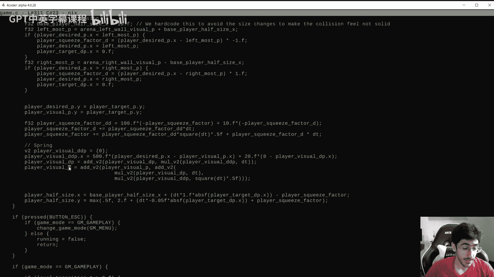

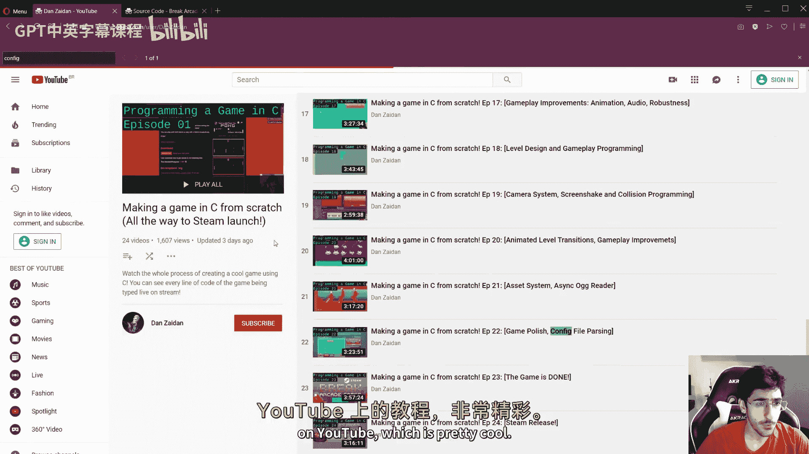

呃。Like making our games feel awesome， the equations of motion。

 so you can learn about all about the deep the DP， which is the velocity and the DDP。

 the acceleration， and how you can make that at friction and stuff。

Which makes your game a lot better to play around with again and the half size is also also gives it like a a squash in stretch field。

 so these are the equations those are pretty much。Ptty much hacked in these guys just to have a cool thing and if you press the ask we go we go back well if you're on the game gameplay we go back to the menu and if you're on the menu' head running into false and then return。

Okay， and okay， so now if you are on the gameplay， if you are on a lab transition。Then we would run。

 we have like the menu dot see and the menu not only have like the update menu。

 which draws whatever the menu wants like the texts。See where the user clicked and stuff。

But also has the transitions like the transition from level to the gameplay as well as the gameplay to the menu。

啊。Those could probably be like compressed into a single function。But well。

 it worked pretty well and the idea was just have cool animations。

 not to have like the cleanest cold ever itself。Okay， so that's the basic。Idea for the transition。

And then we have the simulate level， so the way the game communicates， we have a base game。

 which is the game do C file， and this game do C pretty much deals with things that's common on all game modes like we have the player。

 we have the ball， we have the blocks， the basic block movements。RightAnd that's on the game dotc。

 and we have a levels dotc。Which deals in terms of the specific levels。

 because we have like the normal level， the wall， which has like the power ups。

 pun tattoos and invaders。Okay， so if want add your levels， you can pretty much。

prettyty much just add another one here。And then if you change the menu as well。Like， the menu is。

Here when we set like the left mouse button。You we something change current level to the hot level。

ok。😊，And in this current level。We reset this email here。And if you want to play around with that。

 if you just add one more and set the current line to another in， you're going to see like a， hey。

 how are you doing， bro， all good， I'll get around here。

How are you doing So if you just set a current level to another one。

 you're going to see a assert that you don't have like you don't have like forry and you don't have specific things so you can go like one by one and add your level as well。

Okay， it's take transition。Okay。So this， the simulateim La is one of the hooks。That are。

That the game has for the specific lab， so if the specific lab wants to simulate something here。

 like simulate some timing to make like the space invades move。

 and this is where it's going to do it。Okay。呃。Yes after that。

 we're going to simulate the blocks and we're also going to call simulate block for level because maybe the level wants to do specific things for the blocks this or。

The lever has this hook here， and I'm going to update the balls。This is a pretty simple thing。

 but we actually improved that a lot like we were doing AABB versus AVB for the player with the ball and then it does fly like we had screen shake and increase the ball size。

And this testized bonus which is a pretty bad variable name is basically to reset the score because we have like small multiplier。

Whenever we hit and you can see all that in the level。And down here as well。

Well one of the greatest just to set like you you want to know what touchuchla bonus does。

 just see where it's used like here is set to zero so that's the only thing in this file。

 so it's on the levels file。Okay， then we reset have in about P is also on the levels file and stuff。

Okay， then we're going to decrease the number of super shotss if you do have， then replace sound。

Okay， and then we see the collision with the ball in the walls。Both left and right and the top wall。

 okay， and if the ball reached the end of thena， it came over， then we call the lose life。

And this false is basically it's everything on the level。Those life？If it's instaill or not。

 then we add screen shake， then see if it should instaill or if you just should utilize life at the end of the frame。

Okay， and this is the more interesting part that we spend a lot of time on。

 which is the ball block collision， right？So for every ball， we run for every block。Vald block。

And then we have a two。V block collision。And。I don't think that's in the collision， to be honest。No。

 it's not just the A B B， probably on the level2， Bob luck， yeah， and this is the。

This is pretty cool。Sweet， we did， so we got the difference and we basically find out theyverted alert。

To see where exactly we are in terms of the line， so let me just draw that for you really quickly if we are here and we want to go here and we have a block here。

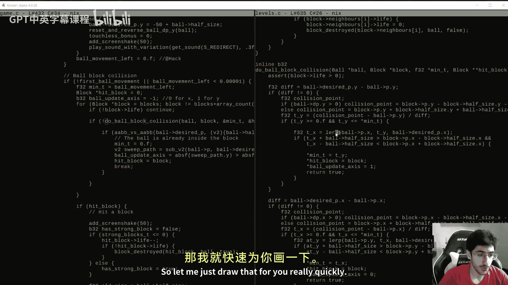

We find out this point。Which is diverted alert right， I mean this is like where we want to go。

These are our beginning， right so we final out T based on the beginning and the end。

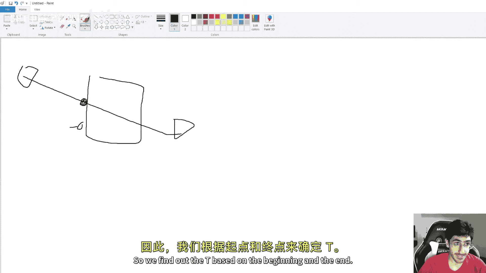

Then you can calculate the actual value in this point。

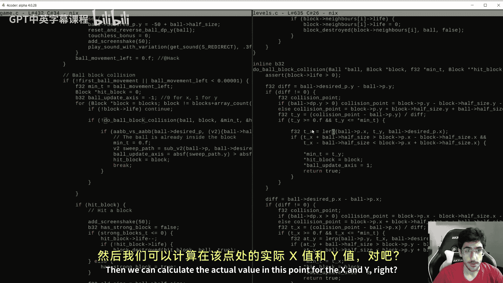

For the X and Y， right if you want to know more about that， you can watch the。Proros the playlist。

Well， you have the collision。So we start acc collision episodeO2。

And we finish that while I can't can see that。Beful， famous collision。So start collision episode2。

 then when we finish that on episode 19， we have a review on the collision system。

 why aren't you coding this in JI dude？Dude， don't tease me， man。Don teach me。

 I really want to code that on JI。 I'm going do tons of JI stuff like tutorials for beginners as well as cool live streams or we do all sorts of crazy meta programming stuff that would be pretty good。

😊。

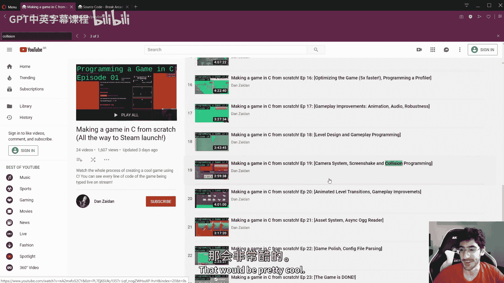

Okay， yeah， but in the meantime， we're going to do like C and C plus+ and have to deal with that。

 So that's the sweep collision that we do。😊，And。And that's that's basically， so if we hit a block。

 this is our what we do like we add screen shakeake， we see if we having like strong blocks。

And review all this inversion of the aion stuff， so that's the collision。

And then this like the beginning of the renderery， you clear the screen， so you go to the renderery。

We have a clear arena screen。 And this is pretty much like。

This is pretty much our brainry in terms of like what it actually does。

 but I could temporarily trying out JI， but I won't be lying。Dude， he's sticking his time。

 which is good， I suppose， but come on。Let us play around with it already， right？

This directed pixels shows like the basic idea for the for the。For the system right。

 so the basic idea is we convert the units from our world units to pixels。

 so we have like draw and draw in pixels。And then we just iterate through every picture that we want to draw。

Just change the color that and we have like more advanced brainry， like transparent brainry。

 which is pretty cool like we do a lub on the alpha。We have rotated rectangles。See you rotate it。

And transparent so we do like a matrix multiplication and we could like we could do more stuff like we could do like skewing and stuff pretty easily because we're just multiplying the matrix。

And then we do the actual then convert that to pixels， then we do the actual collision tests。

 so to speak to see whether or not we should and we actually test on different things here。

That was a pretty cool live stream we did， the rotate colleaguess。

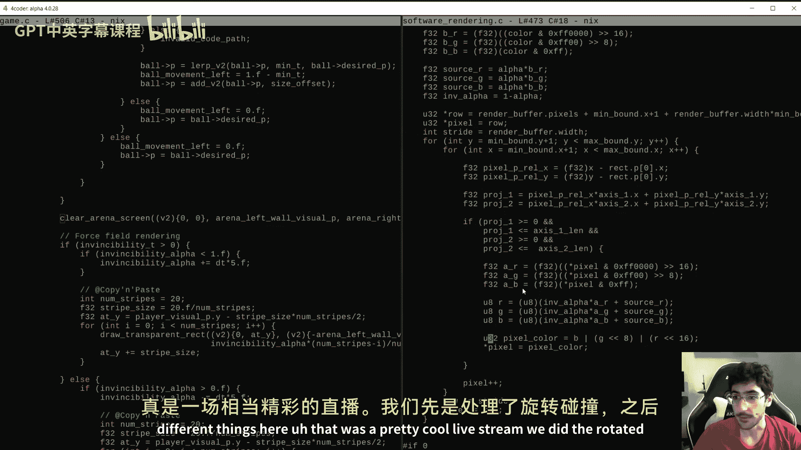

And then we did a bit appss after that， hey， I was just wondering why you have such specific function names。

Are they my specific versions？

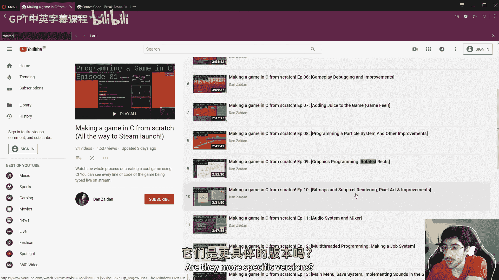

Yeah， you know what？This thing wasn't the best call in terms of like design because we should probably have a more generic well。

 the good thing about having such specific functioning for the rendering。

 I only have that for the rendering。It's because it's more optimize。

 so the drug is very rotated right。It's the one that's the， but I'm not sure if it's the heaviest。

Or if the drop bitmps， the one that's he， but since we don't need to drop bitmps。

 draw rotated bitmaps， we don't do like well， we do， no， this is rotated right。We do like， yeah。

 this is the drop in maps since we don't have to draw rotated rectangles。

We don't have to do like the matrix multiplication here or the transparent things here。

 So this is more of like an optimization optimization thing， but it's not a very good call。

 It makes really hard to port the stranges like open G later on have tons of specific things in the next game that we're going to do on live stream we're going make。

A more like suitable renderer API， No I mean in the other file I mean here。呃。

Like you bought blood collision？Who wrote this code a younger Casey， Well。

 I think that is the biggest compliment you could ever give me， right？😊，Yeah， well。

 the thing about this file is that like， let me take A AB B versus ZBB。

That's pretty much the only collision thing we need we could have call that that like is colliding stuff we changed that a couple times during the flash but do block ball collision it's only used in this case we could inline that but since it's like really complex。

 I mean not really complex but kind of complex。You separate that into another function that was mostly optimization。

 but like place sound with variation， we have like play sound。And place down the variation。

 those are the two ones we have。So the play sound with variations， just a helper around。

Around play sound。P on the one that actually does the work and place on variation just kind of sets some values。

So， yeah， it was kind of a。Aesthetic choice， I do like most of this thing like Ed screen shakeakes。

 pretty nice thing the play sound I really liked having the two of them these like just optimization。

In terms of like cold structure， but the， the Rary is not the best structure ever。

We're going to fix that in the next game， it's going to be better。Okay， and okay。

 so we did this okay， so after we start doing our raining， right， the Raer like the force field。

Which is basically a series of transparent rectangles。啊。Okay。

 and then we draw the blocks for every block we just draw that。

 we have like subpixel see because since we we didn't add subdixel to every draw call。

 every draw call so to speak， right， we have specific draw for a subpixel。

If we want to like rotate it with sub pixelixel then we would have a like a heart attack。

 that's why this range is not very nice to port because it has a ton of specific functions right so you are correct in this sense。

 I would agree on that。So the renderry should have like less specific thing。

 but since it's soft the renderry and we didn't want to spend like a lot of time optimizing that。

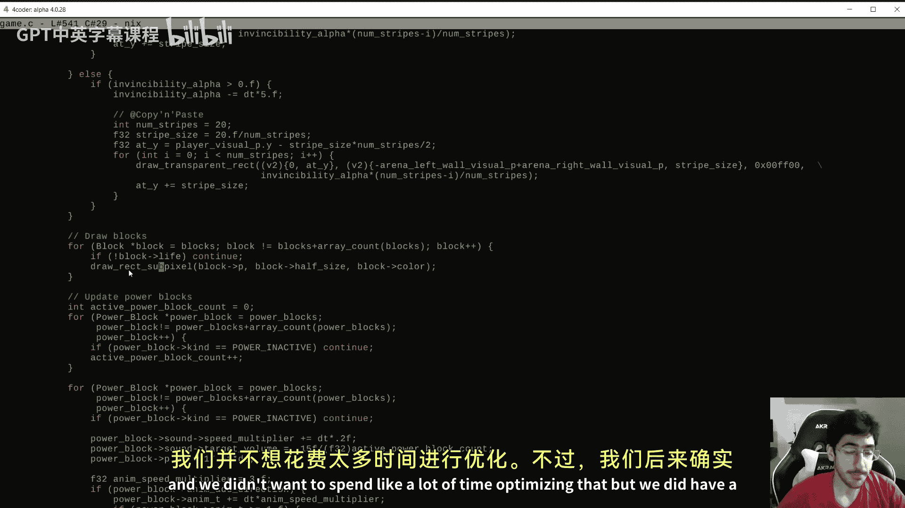

But we did have a pretty cool optimization tree later don't like。This live stream was pretty funny。

 the one that we ran the profiler， but we did go all in in terms of optimizations。

 we just did like the very basics of stuff。

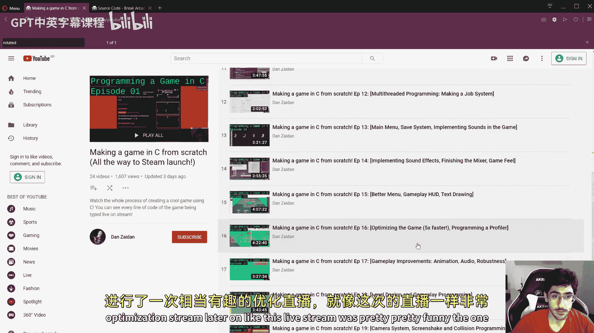

Theyavi implement the power blocks and see that if they're colliding。Okay， hello。

 how are you doing these swaales？啊。So yeah we changed the size so we have like size animation to make it grow and that's one of the things that I did as a post launch update to make that more evident that was pretty cool as well。

And then we test it we colliding if you are colliding we just do a switch a switch statement on the sides and that on the kind and that's the great structure of like doing switch statements it's pretty clean I think。

 so like based on on the switch we do like implement like the number of triple shots on invisibility or the comment so we set the comment and stuff we play sounds that's pretty cool。

And then， well， this is like if we collectll it right， and in any case， we're going to do like。

The drawing for each kind Okay， so that's the power blocks and the particles is really simple we just have a ton of particles in our aesthetic array。

has the released， Thanks， man。 it was great releasing the greatest thing about releasing the game on steam was that I did that on live stream。

 That was a lot of fun。 Oh， let me see。 Yeah， here。

 So you guys can download the game in the source called。 He own steam。 It was awesome。

 I did that on live stream。 That was super fun， man。 And it's funny。

 I'm gonna I'm gonna post the clip on YouTube。 moment that I actually click the button and nothing happens。

 That was pretty funny。 It's already on YouTube though the entire live stream。 That was pretty cool。

 So yeah， we just decrease the particle life and draw that as a transparent rotated rack。

 Another specific call， right。😊。

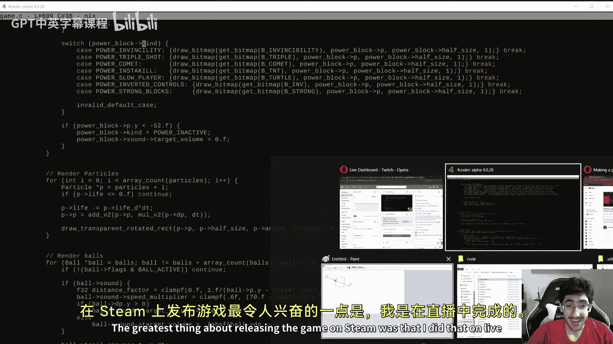

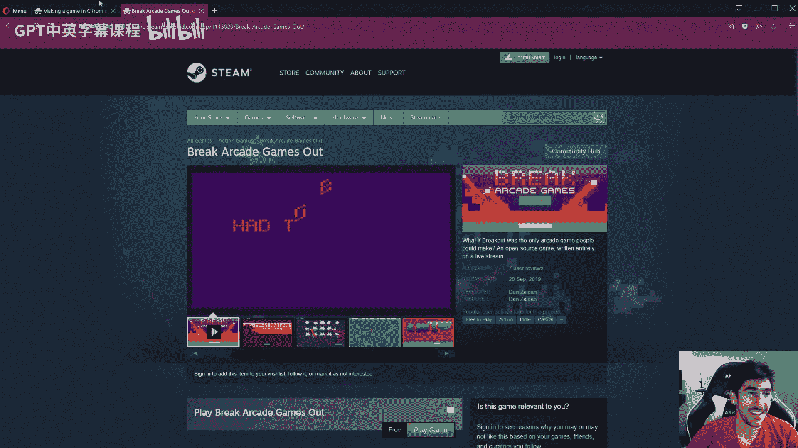

And yeah， the ball rendering in this point， so we see if we need to play the sound based on the position to the player。

 our sound system was pretty cool if you want to watch our audio systems。

 especially the beginning ones which we a ton of features and then later on and start a deepbu in that to make it more robust。

But we did like it was a hack but we did a stereo pan。

 which was also based on the player position and we also have like。Most of the sounds。

Increase their volume based on the y position and the pain is based on the x position。Pretty cool。

 so then we see have a trail twin end respond like the trail particles and stuff。Yeah。

 see spunwned the show particles， then we have more sounds and here's the actual bottle rectangle drawing okay。

In the wall。Jo so the wall has the same basic spring thing as the player same thing you have that for the player。

 the wall and so my transitions and stuff and the camera shake I believe as well so yeah this is like incrementing our variables like the comments front blocks our times so this is our time we could have commented that。

There are timers increment that， so if we want to lose the life， this is actually where we do it。

It lives alive， right？I would play the sound and reset everything after the frames done。

RightSo I suppose to have like one delay for dying， which one f delay， which is pretty much ugly。

Okay， and。Yeah， so this is like the actual hut drawing。For the life。

And this is the actual h for like。Do I have like triple shot stuff， this was， yeah。

 was kind of weird。Then have a post simulateim level。

 so we have the simulateim level at the beginning of the frame and at the end of the frame。

 we need a effort attaches to implement that。Okay， and it's dislike like the menu stuff so if you're not on the gateway we're going to either update the menu or draw the menu transition and like I showed you the menu is pretty simple we have all we do is like we draw a ton of text here。

 the draw text builds another pretty bad thing in software engineering。

Since we didn't want to implement the whole font rationalization and stuff。We just like。

Jreew Square is the based of each character。😊，The was pretty dumb， but it worked。

 and it also had a cool effect because if play if you play the game。

 you just play the game once again。

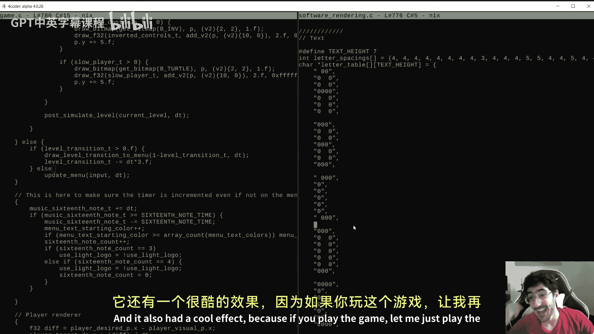

Well， just try to open。If you play the game， you see that have a critical same thing。

 I have to hold that out of here。there's a cool animation of the text see it would have been a little harder to achieve if we didn't have control over the individual rectangle on the text。

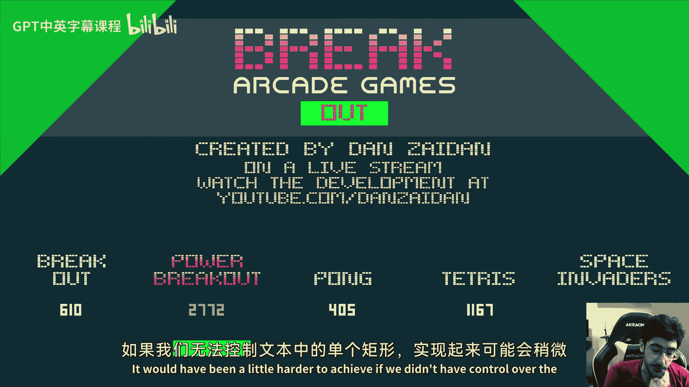

So that's pretty cool。啊 okay。So。Yeah， so here's a timer based music to synchronize our menu stuff。

Whi is pretty cool every 16th node to have like a manual animation， the player entry。

 pretty much where we actually update that is the DP based on the calculation we did earlier right。

 then we do the sound。For for the player and the actual player drawing here。Okay。

 and this like these are deeppot hacks and stuff like these are for fire rainry。

But this is actually our cheats like we have like more invincibility or to destroy a block and stuff this draw message is the is the console thing。

 which is our print， just perhaps it was great doing that and why do structure like verb objects like draw map versus objects where like did that draw。

Well， if I want to draw a bitmap。I think I should call like the draw bit that function， should I not？

I mean， sounds intuitive to me。Like as a series of commands， right？Like I'm doing。

 I'm here and I draw a float， draw a message and like it's down。Is pressed？Well。

 block the stride is a pretty bad name because this is a past sense and stuff it's actually supposed to be called if the block was destroyed。

 that was a pretty weird thing。But yeah， I kind of like to structure that because I think the update menu。

 update menu， you pretty much know what the function does， right。

 the function updates the menu right you're asking to update the menu， right？Yeah。

 Binap draw doesn't make much sense to me unless you're thinking more of like object or thing like Binap dot draw in this case。

 that'll make more sense， I suppose probably that's what you're thinking。I wasn't very used to that。

 I did program a little bit in object oriented land。

 but I wasn't very good programmer back then so I pretty much just deleted that my brain started focusing on。

Thiss more like low level programming stuff， so let me just take a quick look on the levels。

Just to show you guys how it's structured so the basic idea we have like a level state which is a union between the specific level has a state so the space emit has to keep track of the enemy P。

 the movement， whatever whatever needs right the tas is the one that has the most things。

And so remember the simulate。A level。😊，So pretty much just a sweet statement。And in this case。

We just we do whatever we need and we have to watch the specific game modes to actually see how this gameplay code is structured because some of them pretty pretty messy some of them pretty well structured。

 we did that in a couple of first days like the beginning of game modes。

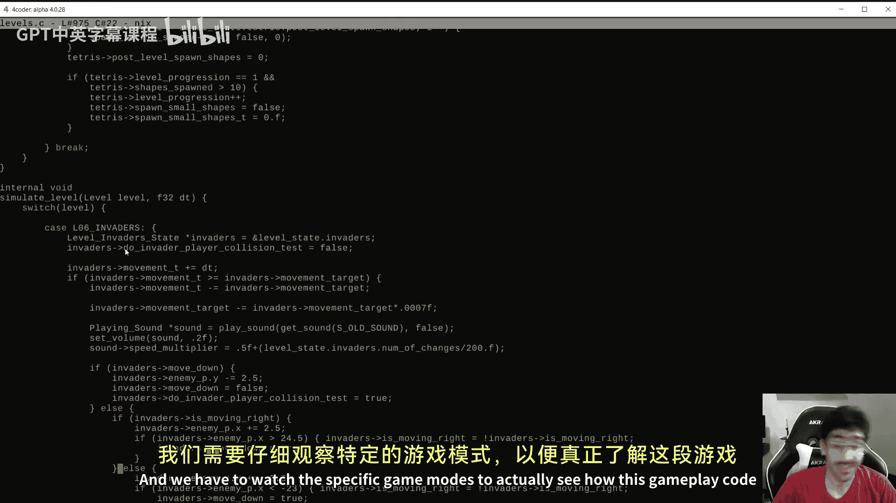

And catching some levels， that's where we did most of them， and then have the t one。

 I don't know whats yeah I level design。

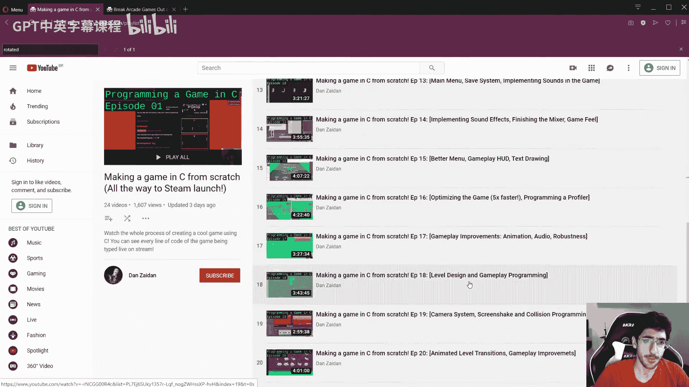

And gameplay programming so this is where we actually implemented that so if wanted to learn more about the gameplay expert but how do you add a new level。

 these are the live stream that want to take a quick quoation on but that's the basic thing we have these hook。

 we have the simulate the post simulate。😊，And the block。Like simulate black for level。Okay。

 which is like maybe the tris block can do like crazy stuff like rotate this frameing stuff Binap in Binap draw can be it as the object and then draws the action kind of like all yeah。

 exactly。Yeah， so you're if you're thinking about object oriented bitmap draw makes more sense。

 right， but I'm not， I'm more thinking about commands in this case like draw bitmap， draw this。

 this bitmap for me and stuff。Do it like object work makes it more clear where the code is coming from。

 because you could subdivide it in modules。As well as doing a module object verb。Yeah。

 I suppose if you have like a pretty big code base。

 you would probably have to structure module object ver。

But render drop bitmap also makes sense to me， render bitmap drop。It kind of sounds inverted。

 but I don't know if you're more used to object oriented programming， yeah。

 a bitmap draw makes a lot more sense， I suppose in this sense。I don't know。

 but it' more of my style thing。Yeah a lot of people questioned some of my style choices like having struck typeF the name of the end I really don't care about that when JI comes out that we were teasing a while back I going to have to change my entire style to make it more like JI focused so I don't really care much about that I care about like the high level structure right I mean having switch statements like this and the hooks and where I add those more like naming and stuff but yeah mostly it's just like doing。

3e statement for4 each game mode。And I suppose that's it I think I'm going to end the formal stream and I'm gonna stay a while for more questions。

 but I'm not going record that because I want the YouTube reader to be a little bit short like 40 minutes pretty much coming to 40 minutes now so I'm just going to say goodbye okay so if you want to if you want to learn more about the game you can go to my YouTube channel and watch the entire development here we have the playlist which is making a gaming see from scratch。

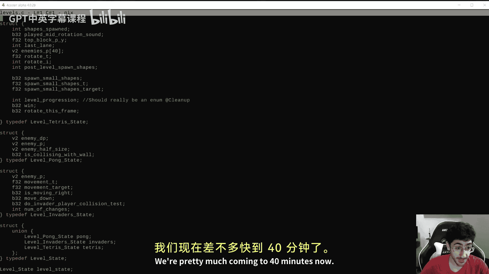

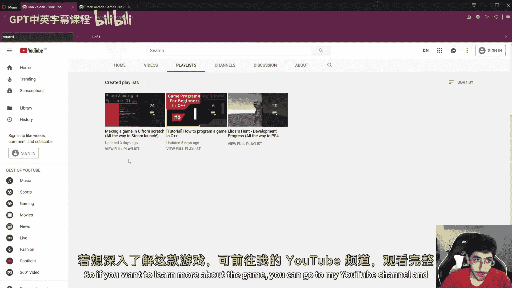

And we also have the game on Steam， which you can download for free， as well as the free source code。

I also liked doing the typey F at the end， it was something to introduce me to， oh。

 that's awesome man。I don't actually know where I learned that I think I switched from C++ to C and that was like a compile error for not having the property thing set up and I kind of see well if I do this way it's gonna to work for a C and C++ and it's gonna work and then I just basically whatever let me just do that I didn't actually think about that before I was doing type abstractstruct name obstruct yeah at the end yeah。

😊，That's what people ask me you're like why don't you do this way I said I don't know man could I could do it this way I don't I really don't get a too attached to these kind of things but hopefully you can now download the source to understand and play around and have some fun with it right I'd love to see what you do with it you can even make your own games based on that just use the engine just do the rainry or whatever and even release them commercial like doing parts right that would be pretty cool to see。

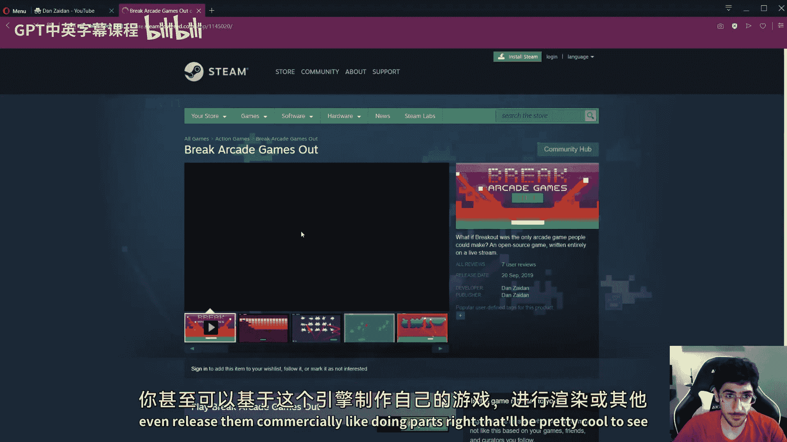

And if subscribe subscribe to my YouTube channel， you'll be able to see my new projects。

 which involve more complex games， probably more complex tutorials and live streams。

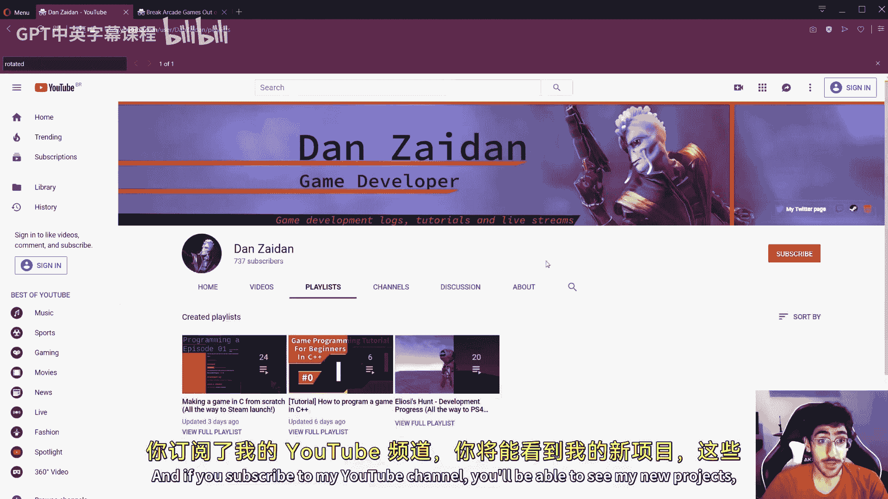

I also have some pretty cool stuff like I have like the。

How to make a program have to program a game C++ for beginners。

 which is pretty cool right and now that the game is the on same when I have to think about a harder thing to tackle Okay。

 so that's it thanks for watching。😊。

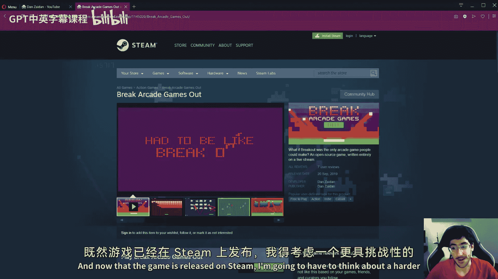

I hope you enjoyed this video， I'll see you next time。

