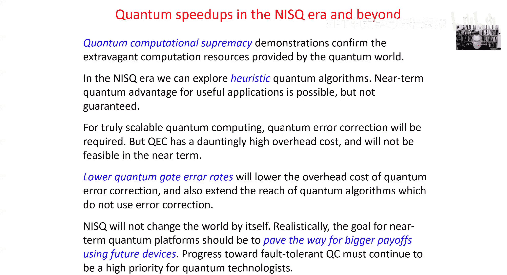
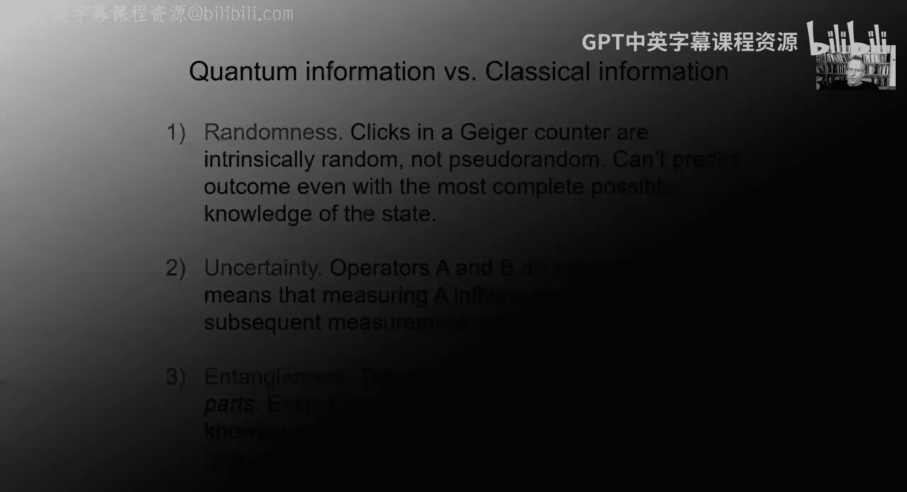
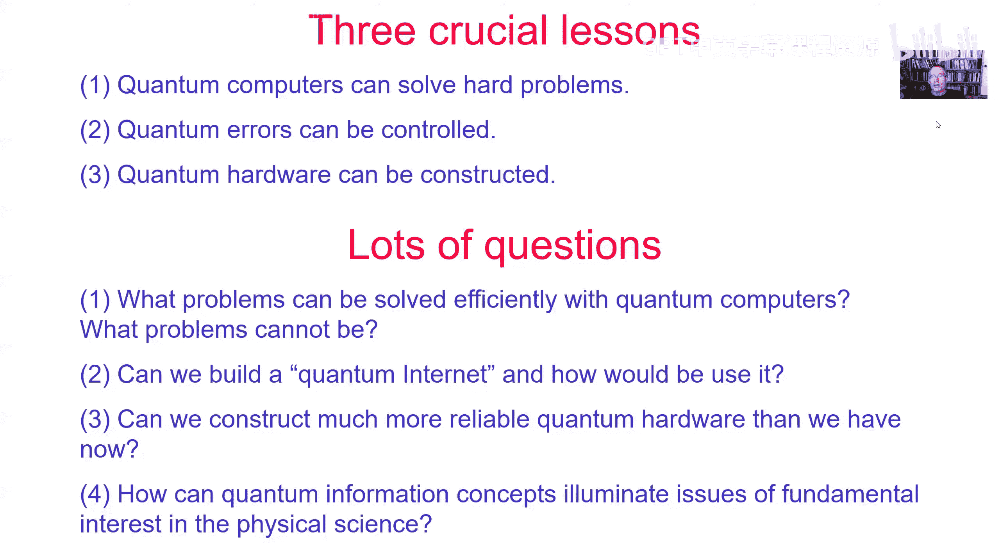

# 001：导论

在本节课中，我们将学习量子计算的基本概念、其重要性、当前技术状态以及面临的挑战。我们将从宏观视角了解这门学科，为后续深入的技术学习奠定基础。

大家好，我是约翰·普雷斯基尔。在接下来的十周里，我们将一起学习物理/计算机科学219A课程。无论你是正式选课还是对课程内容感兴趣，我都欢迎你的加入。

这是我第一次进行在线教学，对此我感到有些忐忑。我决定预先录制讲座视频，并将它们和幻灯片一起上传到课程Google Drive上供大家学习。虽然我习惯于使用黑板教学，但为了适应在线环境，我选择了制作幻灯片。我们还将使用Piazza论坛进行讨论和答疑，以弥补缺乏实时互动的不足。

课程将由助教汤姆和查尔斯负责定期的Zoom答疑。219A课程将涵盖密度算子、量子操作、退相干、量子纠缠、量子电路、量子算法与复杂性等概念。冬季学期的219B课程将由卡塔耶夫教授主讲，重点讨论量子纠错等专题。

课程的主要学习资料是我的讲义笔记，其他建议材料可在课程网站上找到。课程默认采用通过/不通过评分制，会有定期的作业通过Canvas系统提交。

## 量子信息科学概览

上一节我们介绍了课程的基本安排，本节中我们来看看量子信息科学这一更广阔的领域。

量子信息科学融合了20世纪科学的三大主题：量子理论、计算机科学和信息理论。它可能为未来的革命性技术奠定基础，也为我们思考和探索物理世界提供了新方式。

量子信息科学包含多个分支，以下是其中一些关键领域：
*   **量子传感**：利用量子策略提高测量精度或实现更精细尺度的测量。
*   **量子密码学**：利用量子态通信来保护隐私，其基础是窃听量子通信的行为可以被检测到。
*   **量子网络**：在多方之间分发量子态，可用于量子密码学或构建分布式精密测量网络。
*   **量子模拟**：使用量子设备来研究多粒子量子系统的特殊物理性质。
*   **量子计算**：利用基于量子物理的新型计算机，解决经典计算机难以处理的问题。

此外，量子信息的概念也深刻影响着基础物理等其他科学领域。

## 量子计算的核心：纠缠与复杂性

上一节我们概述了量子信息科学的范畴，本节中我们将聚焦于量子计算的两个核心概念：量子复杂性和量子纠缠。

从物理学家的视角看，量子信息科学让我们得以探索一个被称为“复杂性前沿”或“纠缠前沿”的新领域。我们正在开发工具，以创建并精确控制经典计算机无法模拟的复杂多粒子系统。

量子计算的力量主要基于两个思想：
1.  **量子复杂性**：量子设备可以高效完成对经典数字计算机而言过于复杂的任务。
2.  **量子纠错**：这是我们相信能够将量子计算机扩展到大型设备的基础，以应对不可避免的噪声和错误。

这两个概念都建立在**量子纠缠**这一更深层的理念之上。量子纠缠描述了量子系统各部分之间特有的、不同于经典世界的关联。其本质在于，对于一个量子系统，即使你完全了解其各个部分，也可能对整体知之甚少。

想象一本100页的“量子书”，其页面高度纠缠。如果你一页一页地阅读，每页看起来都是随机的乱码，无法揭示书中的信息。因为信息并非存储在单个页面上，而是编码在页面之间的关联中。要读取信息，必须同时对多页进行集体观测。这就是量子纠缠：信息存在于整体之中，无法通过单独观察部分来获取。

## 量子计算机为何强大？

上一节我们了解了纠缠的概念，本节中我们来看看为什么量子计算机被认为具有超越经典计算机的潜力。

我们有理由相信量子计算是一项强大的技术：
1.  **解决经典难题**：我们已经知道一些问题（如大整数质因数分解）在经典计算中非常困难，但量子计算机理论上可以高效解决。彼得·肖尔在1994年发现的量子质因数分解算法就是一个里程碑。
2.  **难以模拟**：我们不知道如何用经典计算机高效模拟量子计算机。尽管经过数十年的努力，模拟多粒子量子系统的最佳算法在最坏情况下的运行时间仍随系统规模（量子比特数）指数增长。
3.  **采样优势**：运行一个中等规模的量子计算并测量所有量子比特，其输出的概率分布是经典计算机无法高效采样的。

这些观察表明，量子计算机和经典计算机的能力存在差异。这种“易”与“难”的界限因世界由量子物理而非经典物理描述而不同，这是一个非常根本且有趣的观点。

## 量子模拟：费曼的愿景

上一节我们讨论了量子计算机的潜在优势，本节中我们来看看一个特别有前景的应用方向：量子模拟。

对于物理学家而言，一个天然属于“经典困难但量子容易”的问题就是模拟量子系统本身。正如物理学家劳克林和派恩斯指出的，描述日常化学、生物和材料的“万物理论”方程（薛定谔方程）我们早已知晓，但无法在粒子数很多、系统高度纠缠时求解。

对此，加州理工学院的理查德·费曼早在约40年前就提出了反驳：“自然不是经典的，如果你想模拟自然，你最好让它是量子力学的……我们应该建造一台按照量子力学定律处理信息的计算机——一台量子计算机。”

物理学家期望，量子计算机能够高效模拟自然界中任何可以发生的过程，而经典的图灵机似乎无法高效模拟高度纠缠的多粒子系统。因此，强大的量子计算机将使我们能够更深入地研究复杂分子、新型材料的性质，甚至模拟高能粒子对撞、黑洞或早期宇宙的量子行为。

## 构建量子计算机的挑战

上一节我们展望了量子模拟的美好前景，本节中我们来看看实现这些愿景所面临的实际挑战。

自费曼提出量子计算机构想已过去40年，我们才刚刚达到量子计算机可能开始做有趣事情的阶段。这说明建造量子计算机非常困难。

困难在于，量子计算机需要在同一平台上结合几近互斥的条件：量子比特（量子信息的基本载体）之间需要强相互作用以高效处理信息；但它们又不能与外部世界相互作用，否则会导致**退相干**，引发错误；然而，我们又需要能从外部控制计算机以运行算法并读取结果。

在实验室中同时满足所有这些要求极具挑战性。经过数十年在制造、量子比特设计、控制协议和材料方面的进步，我们才取得了今天的进展。

## 退相干与量子纠错

上一节我们提到了退相干是主要挑战，本节中我们来深入理解这个概念及其解决方案。

为什么防止量子计算机与外界相互作用如此重要？原因就在于退相干现象。以著名的“薛定谔的猫”思想实验为例，宏观物体（如猫）不会处于“既死又活”的叠加态，因为它会立即与环境相互作用，导致叠加态坍缩为明确的死或活状态。这就是退相干，它解释了为何经典物理足以描述日常生活，尽管微观世界由量子物理主宰。

对于量子计算机，退相干同样是个大问题。环境持续地“观察”量子计算机，任何关于量子态的信息泄露都会导致退相干和计算失败。根本区别在于，**你无法在不改变、不破坏量子态的情况下观察它**。

这听起来几乎无法克服，但我们认为答案在于**量子纠错**。其核心思想是，要保护一个复杂的量子系统，应将其编码成一种非常非局域的形式，信息由许多量子比特共同承载。这样，通常与量子计算机发生局部相互作用的环境，通过一次观察一个量子比特，无法获得关于那个非局域编码态的任何信息。这就像那本100页的量子书，单独看每一页读不出内容。这防止了信息泄露，使我们能够保护量子态，并且我们也理解了如何高效处理以这种非局域形式编码的量子信息。

## 量子比特与当前技术状态

上一节我们探讨了对抗错误的理论方案，本节中我们来看看信息的基本载体——量子比特，以及当前的技术发展到了什么阶段。

要构建高度纠缠的系统，我们使用**量子比特**，即比特的量子类比。量子比特可以有多种物理实现，例如：
*   单个原子（处于基态或激发态）
*   单个电子的自旋
*   单个光子的偏振态
*   极低温下运行的超导电路（尽管涉及数十亿电子，但可像单个原子一样控制）

持续开发不同的硬件方案非常重要，因为我们尚不确定哪种方案最具扩展到大型设备的潜力。其中，由卡塔耶夫教授提出的**拓扑量子计算**概念特别优美，它旨在通过特殊材料编码量子信息，从而获得内在的抗退相干能力。

当前，我们已经达到了一个里程碑：**量子计算优越性**。约一年前，谷歌量子计算团队宣布，其名为“悬铃木”的53量子比特处理器，在完成一项特定计算任务时，超越了当时最强大的经典超级计算机。虽然这项任务本身没有实际应用价值，但它证明了量子处理器可以进入经典计算机难以模拟的领域。

## NISQ时代与未来展望

上一节我们看到了量子硬件的进展，本节中我们来定义当前所处的阶段并展望未来。

我们正处于**NISQ**时代，即“嘈杂中型量子”时代。“中型”意味着量子设备已经达到经典计算机无法暴力模拟的规模；“嘈杂”则意味着这些设备尚未实现纠错，噪声限制了它们的计算能力。

NISQ设备令人兴奋，它们使物理学家能够研究前所未有的多粒子相互作用物理区域。它们也可能通过**混合量子-经典方法**找到近期的实用价值，例如用量子协处理器辅助经典计算机解决优化问题。然而，由于经典算法经过数十年打磨，而NISQ处理器刚刚出现，它们能否在实用问题上超越最佳经典算法尚不确定。

从长远看，由于退相干带来的根本限制，要构建能解决真正难题的大型设备，**量子纠错是必需的**。理论上可行，但开销巨大。例如，有估计指出，要用超导量子计算机在一天内破解基于因数分解的密码，需要约2000万个物理量子比特来保护几千个逻辑量子比特。从目前的数百量子比特跨越到数百万，需要时间。

因此，量子计算是一个长期项目。当前是一个激动人心的阶段，但我们需要对产生重大社会影响的时间尺度抱有现实预期。近期的目标应该是为未来基于可扩展容错量子计算的设备铺平道路。

## 量子信息与经典信息的区别

在课程概述之后，我们现在回到一些核心概念，为其增加一些数学背景。首先，我们来谈谈量子信息与经典信息的区别。

从物理学角度看，信息是我们能在物理系统中编码、存储和处理的东西。既然物理本质是量子的，量子信息就应被视为存储在量子态中、并在量子态中处理的东西。实践中，由于退相干，我们常常可以忽略信息的量子特性，用经典方式描述它。

但重要的是，量子信息具有经典信息所没有的特征：
1.  **内在随机性**：例如，一个即将发生α衰变的放射性原子核，即使在最完整的物理描述下，我们也只能给出下一秒衰变的概率，而无法确定预言。这与源于无知的经典随机性不同。
2.  **不确定性（非对易性）**：量子理论中，可观测量（算符）不一定对易。这意味着不同的观测会相互干扰。测量算符A会影响后续对算符B的测量结果。
3.  **纠缠**：即使你知道整个系统的全部信息（纯态），你也可能对其中各部分的状态 largely ignorant（很大程度上无知）。测量部分A的结果无法完全确定。

## 量子比特与状态区分

上一节我们列出了量子信息的特征，本节中我们具体看看量子比特以及由此引出的状态区分问题。

量子比特是量子信息的基本不可分单元。数学上，一个量子比特的状态是二维复希尔伯特空间中的一个向量，由两个相互正交的基态（如 |0⟩ 和 |1⟩）张成。实际上，一个量子比特仅由两个实参数完全描述（忽略整体归一化和相位）。

比特是量子比特的特例，即确定处于 |0⟩ 或 |1⟩ 的状态。如果爱丽丝制备并发送一个量子比特给鲍勃，且约定状态只能是 |0⟩ 或 |1⟩，那么鲍勃可以通过测量完美区分它们。

但如果爱丽丝可能制备两个非正交的状态，例如 |1⟩ 和 |+⟩ = (|0⟩+|1⟩)/√2，那么鲍勃无法以100%的成功率区分。他最优的策略是进行一个测量，其基态对称地偏离 |1⟩ 和 |+⟩，从而获得约85%的成功率。**非正交的量子态无法被完美区分**，这是量子密码学安全性的基础。

## 复合系统与纠缠

上一节我们讨论了对单个量子比特的操作，本节中我们来看看如何描述由多个子系统构成的复合系统。

假设有两个量子系统A和B，其希尔伯特空间维度分别为 d_A 和 d_B。复合系统AB的希尔伯特空间是这两个空间的张量积，维度为 d_A × d_B。其正交基可以选为 {|i⟩_A ⊗ |a⟩_B}，对于两个量子比特，自然基就是 {|00⟩, |01⟩, |10⟩, |11⟩}。

推广到n个量子比特，其希尔伯特空间是2^n维的。描述一个典型的n量子比特态需要指定这个巨大空间中的一个向量，这需要指数级多的信息，无法简洁描述。

从物理角度看，将大系统分解为小系统（如量子比特）的方式通常由**空间局域性**决定。我们可以轻松地在各个局域位置制备**直积态**，这类态的参数随量子比特数线性增长，可以简洁描述。

而那些不能写成直积形式的态就是**纠缠态**。它们无法仅通过在各局域点独立制备来产生，必须通过量子比特之间的相互作用或量子通信来创建。尽管通过两量子比特门的序列原则上可以产生任何纠缠态，但通常需要指数多的门才能到达整个指数大的希尔伯特空间中的任意一点，因此并非所有态都能高效制备。

## 量子计算模型

上一节我们建立了多量子比特系统的数学框架，本节中我们在此基础上形式化量子计算模型。

一个量子计算模型包含以下要素：
1.  **舞台（希尔伯特空间）**：一个具有巨大状态空间，并能自然地按量子比特进行张量积分解的系统。这种分解通常基于空间局域性，以便定义复杂性。
2.  **初始态**：通常约定为简单的直积态，例如所有量子比特处于 |0⟩，这样初始制备不隐藏复杂性。
3.  **操作集（量子门）**：一组有限的、作用在常数个（如一两个）量子比特上的酉变换（量子门）。例如，一个通用的两量子比特门集合足以构建任何酉操作。
4.  **电路描述**：计算过程由这些量子门构成的电路描述。我们假设有一个高效的经典计算机（如图灵机）来生成这个电路描述，从而不将复杂性隐藏在电路设计中。
5.  **最终测量**：计算结束时，我们对每个量子比特在一个标准基（如 {|0⟩, |1⟩}）下进行测量，得到一串经典比特作为输出。

在这个模型下，任何量子计算原则上都可以被一台拥有随机数生成器的经典计算机模拟。区别在于**效率**：经典模拟需要处理指数大的向量和矩阵，资源消耗随量子比特数指数增长。因此，量子计算模型关注的是在**高效**（多项式时间）内能解决哪些经典计算机难以解决的问题。

从物理或计算机科学基础的角度，一个有趣的假设是**强量子丘奇-图灵论题**，即这个量子电路模型确实抓住了真实物理系统中所有可以高效完成的计算。这是物理学家的一个信念，如果成立，意味着我们能用量子计算机深入探索基础物理；如果不成立，则意味着自然能实现更强大的计算模型，这将更加激动人心。

## 总结

本节课中我们一起学习了量子计算的导论。我们了解到：
1.  量子计算机被认为能够解决经典计算机难以处理的难题，这驱动了该领域的巨大兴趣。
2.  量子计算机面临噪声和退相干的根本性挑战，但理论上我们已通过量子纠错找到了使其可扩展的途径。
3.  量子硬件真实存在且不断进步，理论构想正逐步转化为实验室中可实现的技术。

关于这个学科，仍有许多问题有待探索：哪些问题能被量子计算机显著加速？我们能否构建全球量子互联网？如何建造更精确、更可靠的量子硬件？量子信息概念（如计算复杂性）能告诉我们关于自然的哪些奥秘？

我希望这次讲座激发了你的兴趣。在下一讲中，我们将以更具体和技术性的方式，探讨量子态和量子信息的数学基础。

下次再见。