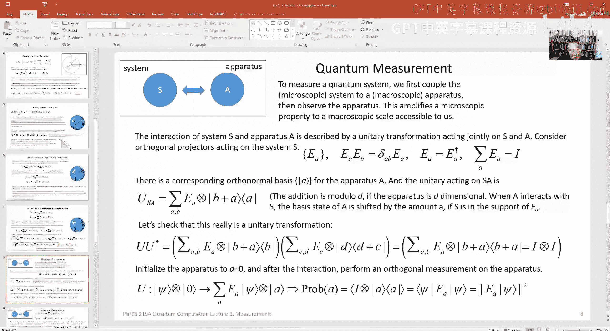

# 003：广义测量与密度算符进阶


在本节课中，我们将继续学习密度算符的相关概念，并探讨一种比封闭系统测量公理所描述的更广义的测量概念。这种测量可以通过系统与辅助系统的相互作用来实现。

## 密度算符回顾

上一节我们介绍了开放量子系统的状态描述工具——密度算符。本节中，我们来看看密度算符的一些几何性质和其他重要概念。

密度算符可以被视为存在于一个线性空间中。我们可以考虑密度算符的线性组合，对于某个指定有限维度的系统，其所有可能的密度算符（或密度矩阵）的集合构成一个凸空间。

这意味着，如果我有两个密度算符 ρ₁ 和 ρ₂，那么对于任意介于0和1之间的实数 λ，其线性组合 ρ(λ) = λρ₁ + (1-λ)ρ₂ 也是一个密度算符。因为：
*   ρ₁ 和 ρ₂ 是厄米的，所以 ρ(λ) 也是厄米的。
*   ρ₁ 和 ρ₂ 的迹为1，所以 ρ(λ) 的迹也为1。
*   ρ₁ 和 ρ₂ 是非负算子，所以 ρ(λ) 也是非负算子。

从几何上看，我们可以将密度算符的空间想象成一个凸集：任意两个允许的密度算符 ρ₁ 和 ρ₂ 之间的连线上的所有点（包括端点）都是该系统可能的密度算符。

### 纯态与混合态

然而，存在一个例外：纯态不具备上述性质。纯态是所谓的“极值点”，这意味着一个纯态密度算符不能表示为两个其他密度算符的凸组合。

假设一个纯态 ρ = |ψ⟩⟨ψ| 可以写成 ρ = λρ₁ + (1-λ)ρ₂ 的形式。考虑任意与 |ψ⟩ 正交的向量 |ψ^⊥⟩。计算 ⟨ψ^⊥|ρ|ψ^⊥⟩，结果显然为0。如果 ρ 是凸组合，那么这个0也必须等于 λ⟨ψ^⊥|ρ₁|ψ^⊥⟩ + (1-λ)⟨ψ^⊥|ρ₂|ψ^⊥⟩。由于 λ 和 (1-λ) 非零，这意味着 ⟨ψ^⊥|ρ₁|ψ^⊥⟩ 和 ⟨ψ^⊥|ρ₂|ψ^⊥⟩ 都必须为0。由于 |ψ^⊥⟩ 可以是任意与 |ψ⟩ 正交的向量，这迫使 ρ₁ 和 ρ₂ 都必须是同一个纯态 |ψ⟩⟨ψ|。因此，用凸组合表示纯态的尝试失败了。这就是我们称纯态为极值态的原因。

### 量子比特的混合态

现在我们来讨论量子比特（二维量子系统）的混合态。一个量子比特最一般的密度算符是一个2x2的厄米矩阵，具有非负特征值且迹为1。它可以写成以下形式：

```
ρ = (1/2)(I + P⃗ · σ⃗)
```

其中 I 是单位矩阵，σ⃗ = (σ₁, σ₂, σ₃) 是泡利矩阵向量，P⃗ = (P₁, P₂, P₃) 是一个实三维向量。为了保证 ρ 是非负的，向量 P⃗ 的长度必须满足 |P⃗| ≤ 1。

从几何上看，量子比特的所有可能密度算符对应于一个三维实空间中的球体（称为布洛赫球）：
*   球体表面（|P⃗| = 1）的点对应纯态。
*   球体内部（|P⃗| < 1）的点对应混合态。
*   球心（P⃗ = 0⃗）对应最大混合态 ρ = I/2。

在这个图像中，任何混合态都可以表示为两个纯态的凸组合，并且通常有无数种表示方法。例如，球内一点可以位于连接球面上任意两点的许多不同弦上。唯一的例外是最大混合态（球心），如果要求用两个相互正交的纯态（即球面上一条直径的两个端点）来表示，那么表示方式是唯一的。

### 高维情况与极值点

在更高维度（例如三维或以上）的希尔伯特空间中，情况有所不同。密度算符空间边界上的点不一定是纯态。

考虑一个三维系统的密度算符，在其对角化基下表示为：
ρ = p₀|0⟩⟨0| + p₁|1⟩⟨1| + p₂|2⟩⟨2|，其中 p₀ + p₁ + p₂ = 1。
如果其中一个概率（例如 p₀）为零，那么 ρ 就位于非负厄米算子空间的边界上。然而，此时的 ρ 通常是一个混合态（除非 p₁ 或 p₂ 也为零），它是 |1⟩ 和 |2⟩ 的凸组合。

这与经典概率分布的空间形成对比。对于三个结果的经典概率分布 (p₀, p₁, p₂)，其空间是一个三角形（单纯形）。极值点只有三个，即 (1,0,0), (0,1,0), (0,0,1)，每个点对应一个确定性结果。所有其他概率分布都可以表示为这三个极值点的凸组合。

而在量子情况下，即使对于二维系统（量子比特），极值点（纯态）也有无限多个（整个球面）。这体现了量子概率与经典概率在几何结构上的根本差异。

## 系综表示与纯化

给定一个混合态密度算符，存在多种方式将其表示为纯态系综的凸组合。也就是说，可以通过咨询不同的随机源并以相应概率制备不同的纯态，来得到同一个密度算符。

假设一个密度算符 ρ 有两种系综表示：
*   以概率 pₐ 制备纯态 |φₐ⟩。
*   以概率 qᵤ 制备纯态 |ψᵤ⟩。

那么，这两个表示之间必定存在联系。我们可以通过“纯化”的概念来理解这种联系。

对于任意密度算符 ρ_A（系统A），我们总可以构造一个更大的复合系统AB的纯态 |Φ⟩_{AB}，使得通过对系统B取部分迹可以得到 ρ_A：ρ_A = Tr_B(|Φ⟩⟨Φ|)。这种纯态 |Φ⟩ 称为 ρ_A 的一个纯化。

现在，对于上述两个系综，我们可以分别构造两个纯化 |Φ₁⟩ 和 |Φ₂⟩。关键在于，由于它们部分迹后得到同一个 ρ_A，根据施密特分解，这两个纯化可以通过仅作用于辅助系统B的一个幺正变换相互转换：|Φ₁⟩ = (I_A ⊗ U_B) |Φ₂⟩。

这意味着，存在一个单一的纯态 |Φ⟩，使得如果Bob（控制B系统）进行两种不同的正交测量：
1.  在一种基下测量，会以概率 pₐ 为Alice（A系统）制备出 |φₐ⟩。
2.  在另一种基下测量，会以概率 qᵤ 为Alice制备出 |ψᵤ⟩。

这个结论被称为 **HJW定理**（或纯化定理）。它表明，同一个密度算符的不同系综表示，可以通过对同一个纯化态进行辅助系统上的不同测量来实现。具体地，两个系综的系数和态通过一个幺正矩阵 V 相联系：√pₐ |φₐ⟩ = Σᵤ V_{aᵤ} √qᵤ |ψᵤ⟩。

## 广义测量

现在让我们转向测量。在实验室中，我们通常不直接对微小的量子系统（如电子自旋）进行测量，而是将其耦合到一个更容易读取的“仪器”或“指针”系统上，然后测量这个仪器。

因此，测量过程可以看作两步：
1.  **相互作用**：让待测系统 S 与仪器 A 发生相互作用，由一个联合幺正演化 U 描述。
2.  **读取**：对仪器 A 进行一个正交测量，其结果被视为系统 S 的测量结果。

假设我们希望实现对系统 S 的一个正交测量，其投影算符为 {E_a}，满足 E_a† = E_a, E_a E_b = δ_{ab} E_a, 且 Σ_a E_a = I_S。但我们只知道如何在仪器 A 上做正交测量，其基矢为 {|a⟩_A}。

为了通过测量 A 来实现对 S 的测量 {E_a}，我们可以设计如下形式的幺正相互作用 U：

```
U (|ψ⟩_S ⊗ |0⟩_A) = Σ_a (E_a |ψ⟩_S) ⊗ |a⟩_A
```

这里 |0⟩_A 是仪器的初始态。幺正演化后，系统 S 和仪器 A 的状态发生纠缠。随后，我们对仪器 A 在 {|a⟩_A} 基上进行正交测量。

*   **得到结果 a 的概率**：等于测量后仪器处于 |a⟩_A 的概率。可以证明，这个概率等于 ⟨ψ| E_a† E_a |ψ⟩ = ⟨ψ| E_a |ψ⟩，因为 E_a 是投影算子。这正是我们期望的对系统 S 进行测量 {E_a} 时得到结果 a 的概率。
*   **测量后系统 S 的状态**：如果测得仪器结果为 a，那么系统 S 的态会坍缩到 (E_a |ψ⟩_S) / √(⟨ψ| E_a |ψ⟩)。这也与直接对 S 进行投影测量 {E_a} 后的状态一致。

因此，通过系统与仪器的耦合以及对仪器的正交测量，我们确实实现了对原系统的期望正交测量。这种构造揭示了，更复杂的测量过程（POVM，下一讲内容）可以通过类似的“系统+辅助系统+正交测量”框架来实现，从而推广了我们在封闭系统公理中定义的测量概念。

## 总结



本节课中我们一起学习了：
1.  **密度算符的几何性质**：密度算符空间是一个凸集，纯态是其极值点。
2.  **量子比特的布洛赫球表示**：纯态在球面，混合态在球内。
3.  **系综表示的非唯一性**：同一个混合态可以用多种纯态系综来表示。
4.  **HJW定理**：同一个密度算符的不同系综表示，源于对同一个纯化态进行辅助系统上的不同测量。
5.  **广义测量的实现**：通过对“系统+仪器”进行联合幺正演化，然后对仪器进行正交测量，可以实现对原系统的各种测量，这为理解更一般的测量概念奠定了基础。