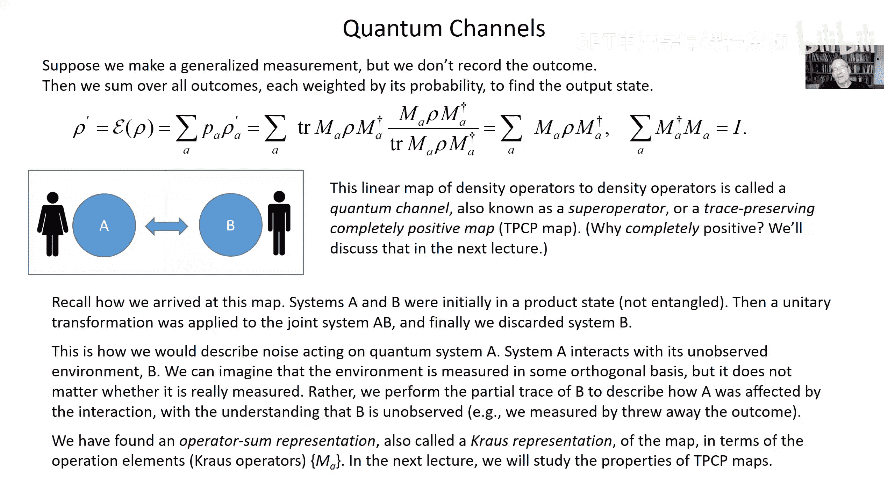

# 004：测量

## 概述

在本节课中，我们将学习量子测量。我们将从一个系统与测量仪器相互作用的场景开始，探讨如何通过仪器上的正交测量来实现对系统的测量。接着，我们将分析当测量仪器的测量基改变时会发生什么，从而引出广义测量的概念。最后，我们将讨论当测量结果不被获知时，系统状态的演化如何描述为量子信道。

## 系统与仪器的相互作用

上一节我们讨论了封闭系统中的测量公理。本节中，我们来看看如何通过一个系统与测量仪器的相互作用来实现测量。

我们考虑一个系统和一个测量仪器。它们之间发生一个酉相互作用，随后对仪器进行正交测量。这种酉相互作用的形式如下：

\[
U = \sum_a E_a \otimes S_a
\]

其中，\( E_a \) 是作用在系统上的正交投影算符，对应于我们想要测量的系统结果。\( S_a \) 是作用在仪器上的“移位算符”。对于仪器的每个基态 \( |b\rangle \)，该算符将其移动 \( a \) 个单位：\( S_a |b\rangle = |b + a \ (\text{mod } D)\rangle \)，这里 \( D \) 是仪器系统的维度。

这个算符是酉的，因为 \( U U^\dagger = I \)。我们可以将仪器初始化为某个特定的基态，例如 \( |0\rangle \)。相互作用后，系统与仪器处于纠缠态。然后，我们对仪器进行正交测量。

以下是测量过程的步骤：
1.  系统初始态为 \( |\psi\rangle \)，仪器初始态为 \( |0\rangle \)。
2.  经过酉相互作用 \( U \) 后，联合态变为 \( |\Psi'\rangle = \sum_a (E_a |\psi\rangle) \otimes |a\rangle \)。
3.  对仪器进行正交测量（投影到基态 \( |a\rangle \)）。
4.  得到结果 \( a \) 的概率是 \( \| E_a |\psi\rangle \|^2 \)，系统后测量态为 \( E_a |\psi\rangle / \| E_a |\psi\rangle \| \)。

这样，我们就通过仪器上的测量，实现了对系统的一个正交测量。

## 改变仪器的测量基

上一节我们假设对仪器进行特定的正交测量。但如果我们对仪器使用不同的正交基进行测量，会发生什么？

考虑一个具体的例子：系统是一个量子比特，仪器也是一个量子比特。输入系统态为 \( |\psi\rangle = \alpha |0\rangle + \beta |1\rangle \)。经过特定的酉相互作用后，联合态变为 \( |\Psi'\rangle = \alpha |00\rangle + \beta |11\rangle \)。

如果我们对仪器在计算基 \( \{|0\rangle, |1\rangle\} \) 下测量，结果与之前描述的一致。

但假设我们改为在基 \( \{|+\rangle, |-\rangle\} \) 下测量仪器，其中 \( |\pm\rangle = (|0\rangle \pm |1\rangle)/\sqrt{2} \)。

为了找到后测量态，我们将联合态投影到仪器的测量结果上。例如，对于结果“+”，后测量态（未归一化）为 \( (\langle +| \otimes I) |\Psi'\rangle = (\alpha |0\rangle + \beta |1\rangle)/\sqrt{2} \)。归一化后，系统态变回 \( \alpha |0\rangle + \beta |1\rangle \)，与输入态相同。

对于结果“-”，后测量态（未归一化）为 \( (\langle -| \otimes I) |\Psi'\rangle = (\alpha |0\rangle - \beta |1\rangle)/\sqrt{2} \)。归一化后，系统态变为 \( \alpha |0\rangle - \beta |1\rangle \)。

这两个后测量态 \( \alpha |0\rangle + \beta |1\rangle \) 和 \( \alpha |0\rangle - \beta |1\rangle \) 并不正交。两个结果的概率都是 \( 1/2 \)。如果我们立即重复这个测量，不会以概率1得到相同的结果。这与我们之前讨论的正交测量的性质不同。

## 广义测量与POVM

现在让我们更一般地分析这种情况。考虑两个系统，Alice的系统（A）和Bob的系统（B）。Alice只能观测系统A，Bob可以对系统B做任何操作。

过程如下：
1.  Alice的系统初始为纯态 \( |\psi\rangle_A \)，与Bob的系统不相关。Bob的系统初始化为标准基态 \( |0\rangle_B \)。
2.  A和B之间发生一个酉相互作用 \( U \)，产生纠缠态 \( |\Psi'\rangle_{AB} \)。
3.  Bob对他的系统B进行一个正交测量，并将结果告诉Alice。

我们可以将相互作用后的态用Bob测量基展开：
\[
|\Psi'\rangle_{AB} = \sum_\mu M_\mu |\psi\rangle_A \otimes |\mu\rangle_B
\]
其中 \( M_\mu \) 是作用在Alice系统上的线性算符。由于 \( U \) 是酉算符，它必须保持内积。这要求：
\[
\sum_\mu M_\mu^\dagger M_\mu = I_A
\]

Bob进行测量后，对于结果 \( \mu \)，其概率为 \( \| M_\mu |\psi\rangle \|^2 \)。Alice的后测量态为 \( M_\mu |\psi\rangle / \| M_\mu |\psi\rangle \| \)。

如果Bob不告诉Alice测量结果，或者结果记录永久丢失，那么Alice必须考虑所有可能输出密度算符的凸组合，并按相应概率加权。

在这种情况下，Alice的初始密度算符 \( \rho \) 演变为：
\[
\rho' = \sum_a M_a \rho M_a^\dagger
\]
其中算符 \( M_a \) 满足 \( \sum_a M_a^\dagger M_a = I \)。这种线性映射被称为**量子信道**，或**超算符**，也称为**保迹完全正映射**。

这种由一组算符 \( \{E_a\} \) 定义的测量，其中 \( E_a = M_a^\dagger M_a \)，被称为**正算子值测度**（POVM）。POVM元素 \( E_a \) 是厄米、半正定的，并且满足 \( \sum_a E_a = I \)。任何POVM都可以通过系统与仪器的酉相互作用，随后对仪器进行正交测量来实现。

## 量子信道

量子信道描述了系统与环境发生不可控相互作用，且环境不被观测时的系统演化。它对应于对环境的偏迹。

以下是量子信道的关键点：
*   **表示**：\( \rho' = \sum_a M_a \rho M_a^\dagger \)，其中 \( \sum_a M_a^\dagger M_a = I \)。
*   **性质**：保迹、完全正性。
*   **应用**：描述量子噪声、不完美的量子存储或通信。
*   **重要性**：噪声是量子计算的主要敌人。为了对抗噪声，需要使用量子纠错。理解量子信道是为学习量子纠错奠定基础。

## 总结

本节课中我们一起学习了量子测量的扩展概念。我们从系统与仪器相互作用的模型出发，看到了如何实现正交测量。通过改变仪器的测量基，我们发现了非正交的广义测量（POVM）。最后，我们探讨了当测量结果未知时，系统状态的演化由量子信道描述，这为理解量子噪声和未来的量子纠错主题做好了准备。