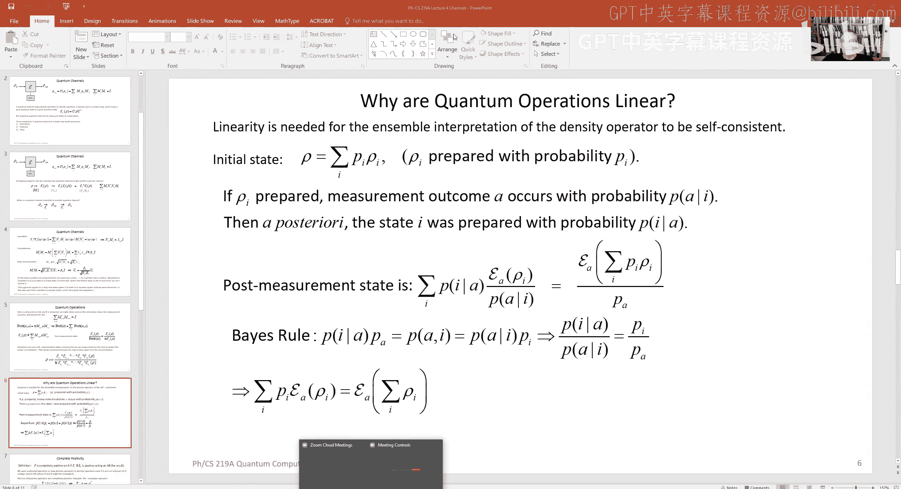

# 005：量子信道与量子操作


在本节课中，我们将学习量子信道和量子操作的核心概念。我们将探讨量子系统如何与其环境相互作用，以及如何用数学工具描述这种相互作用。我们将看到，量子信道是描述开放量子系统演化的基本工具，而量子操作则是一个更广泛的概念，涵盖了测量后获取部分信息的情况。

---

## 量子信道回顾

上一节我们介绍了广义测量的概念。本节中，我们来看看量子信道，它可以看作是广义测量的一个特例。

量子信道描述了一个量子系统与其环境发生相互作用，但我们最终只观测系统本身，而忽略（或丢弃）环境信息的过程。这个过程可以建模为：系统与环境作为一个整体经历一个幺正演化，然后我们对环境部分取迹（即忽略它）。

数学上，一个量子信道 **E** 作用于输入密度算符 **ρ_in**，产生输出密度算符 **ρ_out**，其形式为：
```
ρ_out = E(ρ_in) = Σ_a M_a ρ_in M_a†
```
其中，算符 **M_a** 被称为克劳斯算符，它们满足完备性关系：
```
Σ_a M_a† M_a = I
```
这个条件保证了信道的保迹性，即如果 **Tr(ρ_in) = 1**，那么 **Tr(ρ_out) = 1**。

量子信道具有以下基本性质：
*   **线性**：**E(aρ_1 + bρ_2) = aE(ρ_1) + bE(ρ_2)**
*   **保厄米性**：如果 **ρ_in** 是厄米的，那么 **ρ_out** 也是厄米的。
*   **保正性**：如果 **ρ_in** 是半正定的，那么 **ρ_out** 也是半正定的。
*   **保迹性**：如上所述。

---

## 信道的可逆性

我们已知幺正演化是可逆的。那么，一个一般的量子信道是否可逆呢？也就是说，是否存在另一个信道，可以完全抵消原信道的作用？

结论是：**只有幺正信道才是可逆的**。对于一个非幺正的信道，不存在另一个量子信道能使其对任意输入都恢复原状。

其根本原因在于，信道建模了系统与环境不可控的相互作用。当我们“丢弃”环境时，信息就流失到了环境中。后续的操作（即使引入新的环境）也无法恢复这些丢失的信息，因为我们无法访问最初的那个环境。这正体现了量子退相干的核心机制。

---

## 从信道到量子操作

之前我们讨论了两种极端情况：
1.  环境被测量，且结果完全告知系统观测者（广义测量）。
2.  环境被完全忽略（量子信道）。

现在，我们考虑中间情况：环境被测量，但观测者只被告知部分测量结果。这个过程称为**量子操作**。

假设环境测量结果由两个指标 **(a, μ)** 标记。指标 **a** 被报告给观测者 Alice，而指标 **μ** 则对她保密。对于 Alice 观察到的每个特定结果 **a**，她系统的状态更新为：
```
ρ_a = (1 / p(a)) * Σ_μ M_{a,μ} ρ_in M_{a,μ}†
```
其中，**p(a) = Tr( Σ_μ M_{a,μ} ρ_in M_{a,μ}† )** 是观察到结果 **a** 的概率。算符 **M_{a,μ}** 满足完备性关系 **Σ_{a,μ} M_{a,μ}† M_{a,μ} = I**。

注意，在重新归一化（除以 **p(a)**）之前，映射 **ρ_in → Σ_μ M_{a,μ} ρ_in M_{a,μ}†** 是一个线性映射，但其迹小于等于1（等于 **p(a)**）。这种未归一化的描述在处理一系列连续测量时非常方便，我们可以最后再进行一次性归一化。

---



## 线性性的重要性

量子力学中的动力学，无论是薛定谔方程、量子信道还是量子操作（忽略最后的归一化），都是线性的。为什么线性如此重要？

关键在于概率解释的一致性。考虑一个由态 **ρ_i** 以概率 **p_i** 构成的混合态系综：**ρ = Σ_i p_i ρ_i**。当我们对这个混合态进行一个量子操作时，从两个视角计算输出态必须得到相同的结果：
1.  **系综视角**：考虑每个可能的初始纯态 **ρ_i**，应用操作，然后按后验概率加权平均。
2.  **密度算符视角**：直接对总密度算符 **ρ** 应用操作。

为了保证这两种视角等价，操作必须是线性的。线性确保了 **E(Σ_i p_i ρ_i) = Σ_i p_i E(ρ_i)**，从而使得基于系综的概率解释与基于密度算符的描述自洽。

---

## 完全正性

一个合理的物理映射不仅需要是正的（将正算符映射为正算符），还需要是**完全正的**。

**完全正性** 要求：即使我们将原系统 **A** 与一个任意大的辅助系统 **R** 耦合，然后只对 **A** 部分施加该映射（对 **R** 部分做恒等操作），这个扩展后的映射仍然将 **A+R** 的联合密度算符映射为另一个合法的联合密度算符。

并非所有正映射都是完全正的。一个著名的反例是**转置映射**。虽然转置一个单系统的密度算符会得到另一个密度算符（因此是正的），但当它对一个纠缠态的部分子系统进行转置（部分转置）时，可能会产生一个具有负本征值的算符，从而不再是物理的密度算符。因此，转置是正的，但不是完全正的。

物理上可实现的量子操作和信道必须是**完全正且保迹的线性映射**。

---

## 信道-态对偶性

一个强大而优美的概念是**信道-态对偶性**（也称为 Choi-Jamiołkowski 同构）。它建立了量子信道（或操作）与量子态之间的一一对应关系。

构造方法如下：
1.  引入一个与输入系统 **A** 维度相同的参考系统 **R**。
2.  考虑 **R** 和 **A** 之间的一个最大纠缠态 **|Φ>**（为方便起见，通常不归一化）。
3.  将信道 **E** 作用于系统 **A**，同时对参考系统 **R** 做恒等操作。这产生一个 **R** 和输出系统 **A'** 上的联合态：
    ```
    σ = (I_R ⊗ E_A) ( |Φ><Φ| )
    ```
4.  这个联合态 **σ** 唯一地确定了信道 **E**。反之，给定一个 **R** 和 **A'** 上的合法密度算符 **σ**，我们可以通过“相对态”方法重构出一个完全正映射 **E**。

这个对偶性非常有用。例如，它直接给出了信道算符和表示的证明：因为 **σ** 是一个密度算符，它可以表示为纯态的系综。这个系综中的每个纯态，通过上述对偶性，恰好对应信道算符和表示中的一个克劳斯算符。

---

## 克劳斯表示的不唯一性与参数计数

由于一个密度算符的纯态系综表示不唯一（Hughston-Jozsa-Wootters 定理），通过信道-态对偶性，一个量子信道的克劳斯算符表示也不唯一。两组不同的克劳斯算符 **{M_a}** 和 **{N_μ}** 描述同一个信道，当且仅当它们通过一个幺正矩阵相联系：**N_μ = Σ_a U_{μa} M_a**。

对于一个将 **d** 维系统映射到 **d'** 维系统的量子信道，我们总是可以找到一个克劳斯表示，其中算符的个数不超过 **d × d'**。

描述这样一个信道所需的实参数数量是多少？它作用于 **d×d** 厄米矩阵空间（维度 **d²**），映射到 **d'×d'** 厄米矩阵空间（维度 **d'²**），并且受到保迹条件（**d²** 个约束）的限制。因此，参数空间的总实维度为：
```
d² * d'² - d² = d² (d'² - 1)
```
例如，对于一个单量子比特到单量子比特的信道 (**d = d' = 2**)，需要 **12** 个实参数。这远多于描述一个单量子比特幺正操作所需的 **3** 个参数，说明了退相干过程的复杂性。

---

## 总结

本节课中我们一起学习了量子信息理论中的核心工具：量子信道与量子操作。
*   量子信道描述了系统与环境相互作用后被观测的演化，具有算符和表示，且只有幺正信道可逆。
*   量子操作是更一般的概念，包含了测量后获取部分信息的情况。
*   物理上可实现的映射必须是完全正且保迹的线性映射。
*   信道-态对偶性在信道和纠缠态之间建立了深刻的联系，是分析和表征信道的有力工具。
*   信道的克劳斯表示不唯一，且描述一般信道需要相当多的参数。

下一讲，我们将通过具体的例子来深化对这些抽象概念的理解。