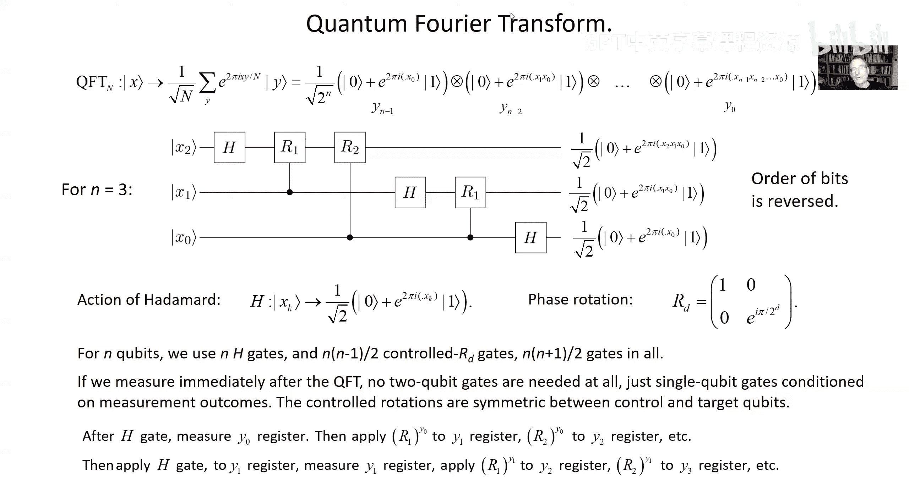

# 016：周期寻找算法 🧮

在本节课中，我们将学习如何利用量子计算来寻找一个函数的周期。我们将看到，通过使用量子叠加查询和量子傅里叶变换，我们可以比任何经典方法都更高效地解决这个问题。这个算法是理解肖尔大数分解算法的关键。

上一讲我们讨论了西蒙问题，并看到了量子查询相对于经典查询的指数级优势。本节中，我们将探讨一个结构类似但具有实际应用的问题：周期寻找。

## 问题定义

我们有一个黑盒函数 **f**，它将整数映射到比特串。我们被告知该函数是周期性的，即存在一个未知的周期 **r**，使得对于任意整数 **x** 和 **j**，有：
`f(x) = f(x + j * r)`
我们只知道周期 **r** 的一个上界 **M**（即 `r ≤ M`）。我们的目标是找到这个周期 **r**。

在经典计算中，即使使用随机查询，也需要指数级数量的查询才能找到周期。接下来我们将看到，量子算法可以仅用常数次查询就解决这个问题。

## 量子周期寻找算法

该算法的思路与西蒙算法相似，但使用量子傅里叶变换（QFT）来揭示周期结构。

### 算法步骤

以下是算法的核心步骤：

1.  **初始化叠加态**：准备一个输入寄存器，使其处于所有可能输入值的均匀叠加态。如果输入范围是 0 到 N-1（N 足够大），则初始态为：
    `|ψ₁⟩ = (1/√N) Σ_{x=0}^{N-1} |x⟩ |0⟩`

2.  **量子查询**：将黑盒函数 **f** 应用于叠加态。这会在输入和输出寄存器之间创建纠缠态：
    `|ψ₂⟩ = (1/√N) Σ_{x=0}^{N-1} |x⟩ |f(x)⟩`

3.  **测量输出寄存器**：测量输出寄存器。假设我们得到结果 `f(x₀)`。那么输入寄存器会坍缩到所有映射到 `f(x₀)` 的输入值的均匀叠加态。由于函数的周期性，这些值是等间距的，间隔为周期 **r**：
    `|ψ₃⟩ ≈ (1/√A) Σ_{j=0}^{A-1} |x₀ + j*r⟩`
    其中 A 是 0 到 N-1 范围内满足条件的 j 的数量。

4.  **应用量子傅里叶变换**：对输入寄存器应用量子傅里叶变换（QFT）。QFT 将基态 |x⟩ 映射为：
    `QFT|x⟩ = (1/√N) Σ_{y=0}^{N-1} e^{2πi x y / N} |y⟩`
    应用 QFT 后，状态变为：
    `|ψ₄⟩ = QFT|ψ₃⟩`

5.  **测量输入寄存器**：测量输入寄存器，得到一个结果 **y**。我们将以高概率得到一个 **y**，使得比值 **y/N** 非常接近某个有理数 **k/r**（其中 k 是整数）。

6.  **经典后处理**：利用测量得到的 **y** 和已知的 **N**，我们可以使用连分数展开等经典方法，找到分母不超过 M 的有理数 **k/r**。通过几次运行，我们就能以高概率确定真正的周期 **r**。

### 为何有效：相长干涉

算法的关键在于量子傅里叶变换后的相长干涉。对于使得 **y/N ≈ k/r** 的那些 **y** 值，量子态中不同项的相位几乎对齐，导致测量到这些 **y** 的概率显著增大。而对于其他 **y** 值，相位会相消干涉，使得概率很小。

通过精心选择 **N**（例如 `N ≥ M²`），我们可以确保测量结果 **y/N** 足够精确，从而唯一地确定有理数 **k/r**。

## 量子傅里叶变换的高效实现

对于查询复杂度分析，我们只需知道 QFT 是一个酉变换。但对于实际应用，我们需要高效实现它。幸运的是，QFT 可以在量子计算机上高效实现。

量子傅里叶变换作用于 n 个量子比特（`N = 2^n`）的电路可以由 O(n²) 个基本量子门构成。更妙的是，如果紧接着进行测量，我们甚至可以用仅包含哈达玛门和单量子比特受控旋转的电路来实现等效效果，从而进一步简化。

## 总结

本节课中我们一起学习了量子周期寻找算法。我们了解到：

*   通过利用量子叠加进行查询，我们可以创建揭示函数周期性的量子态。
*   量子傅里叶变换能够将周期信息编码到测量结果的概率分布中，通过相长干涉放大“正确”的答案。
*   该算法仅需常数次量子查询即可解决周期寻找问题，相比经典方法实现了指数级加速。
*   量子傅里叶变换可以高效实现，这使得整个算法具有实用性。

这个算法是量子计算强大能力的一个关键例证，它直接引向了下一讲将要讨论的著名应用——肖尔的大数分解算法。