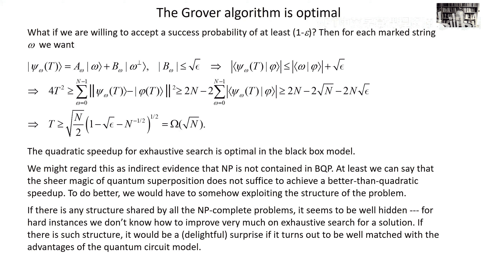

# 018：量子搜索 🎯

在本节课中，我们将要学习量子计算机如何加速对问题解的穷举搜索。我们将探讨一种称为Grover算法的技术，它能实现平方级的加速，即量子查询次数约为经典查询次数的平方根。我们将从算法原理开始，逐步分析其工作机制，并讨论其最优性证明。

## 概述 📖

在之前的课程中，我们讨论了黑盒模型下的查询复杂度，并看到了量子查询相对于经典查询可以实现指数级加速。今天，我们将讨论一种不同的加速——平方级加速。虽然不如指数加速那样引人注目，但它在原理上具有广泛的适用性。我们将重点介绍Grover算法，它展示了如何利用量子叠加态，仅用大约√N次查询，就能在N个候选解中找到目标解。

## Grover算法原理 🔍

上一节我们介绍了量子查询可以加速问题求解。本节中，我们来看看如何具体实现这种加速。

我们考虑一个黑盒函数 f_w(x)。该函数在除一个特定字符串W（即“标记状态”）外的所有输入上输出0，仅在x = W时输出1。我们的目标是找到这个W。经典情况下，在最坏情况下需要检查大约N/2个候选解才能以大于1/2的概率找到W，因此查询复杂度为Ω(N)。量子情况下，我们将看到仅需大约√N次查询。

我们实现这一奇迹的方法称为Grover算法。其核心思想是利用量子叠加态进行查询。

### 查询的几何解释

首先，我们形式化查询操作。我们使用一个可以计算函数f_w(x)的黑盒。为了使其成为酉操作，它需要保留输入寄存器。具体操作如下：
\[ U_w |x\rangle |y\rangle = |x\rangle |y \oplus f_w(x)\rangle \]
如果我们把输出寄存器初始化为态(|0\rangle - |1\rangle)/√2，那么查询操作的效果是：当f_w(x)=1时翻转输入寄存器中对应基态的相位，否则什么都不做。因此，我们可以忽略输出寄存器，将查询酉操作U_w视为：
\[ U_w = I - 2|w\rangle\langle w| \]
这个操作的作用是：对于任何正交于|w⟩的状态，它像恒等算子一样作用；对于标记状态|w⟩，它将其相位乘以-1。从几何上看，这相当于在垂直于|w⟩的超平面上的反射。

### 算法步骤

Grover算法从一个均匀叠加态开始，这个态平等地对待所有候选解：
\[ |s\rangle = \frac{1}{\sqrt{N}} \sum_{x=0}^{N-1} |x\rangle \]
这个态很容易制备，例如通过对|0⟩态施加N个量子比特的哈达玛门变换。

算法由多次重复一个称为“Grover迭代”的酉操作组成。每次迭代包含两个步骤：
1.  **查询黑盒**：应用酉操作U_w。
2.  **应用扩散算子**：应用酉操作U_s = 2|s\rangle\langle s| - I。

U_s操作的作用是：对于态|s⟩，它保持不变；对于任何正交于|s⟩的状态，它翻转其相位。从几何上看，这相当于在由|s⟩定义的轴上的反射。

### 算法的工作机制

关键在于，Grover迭代U_Grover = U_s U_w始终将系统状态保持在由|s⟩和标记状态|w⟩张成的二维平面内。

*   初始态|s⟩与垂直于|w⟩的方向（记为|w_perp⟩）夹角很小，记为θ，其中sin θ ≈ 1/√N。
*   应用U_w（查询）：在|w_perp⟩超平面上反射状态，使其转到平面的另一侧。
*   接着应用U_s（扩散算子）：在|s⟩轴上反射状态。

两次反射的净效果是使状态向量在平面内绕原点旋转一个角度2θ，更靠近标记状态|w⟩。每次迭代都使状态向量更接近|w⟩，从而增大了测量时得到标记状态的概率。

### 迭代次数与成功率

我们希望经过T次迭代后，状态向量与|w⟩对齐，这样测量时就能以接近1的概率得到目标解。初始夹角为θ，我们需要旋转的总角度约为π/2。每次迭代旋转2θ，因此所需的迭代次数T满足：
\[ (2T+1)\theta \approx \pi/2 \]
由于θ ≈ 1/√N，我们得到：
\[ T \approx \frac{\pi}{4} \sqrt{N} \]
因此，仅需大约√N次查询，我们就能以高概率找到标记状态。经典概率随查询次数T线性增长，而量子概率由于振幅的平方关系随T^2增长，这正是实现平方加速的原因。

## 多个解与未知解数量 🔢

上一节我们分析了单一标记状态的情况。本节中我们来看看当存在多个解，或者解的数量未知时，算法如何工作。

### 存在多个标记状态

假设有R个标记状态（即函数输出1的输入）。经典情况下，找到任意一个解所需的查询次数约为N/R。量子情况下，我们可以类似地定义标记状态的均匀叠加态：
\[ |\text{marked}\rangle = \frac{1}{\sqrt{R}} \sum_{i=1}^{R} |w_i\rangle \]
初始态|s⟩与该标记态的夹角θ满足 sin θ ≈ √(R/N)。算法过程完全相同，所需迭代次数变为：
\[ T \approx \frac{\pi}{4} \sqrt{\frac{N}{R}} \]
查询复杂度仍然是经典复杂度（N/R）的平方根。

### 解数量未知的情况

在实际问题中，我们可能不知道R的具体值。如果迭代次数选择不当（例如，对于R较大的情况，使用为R=1设计的迭代次数），状态向量可能会“旋转过度”，导致成功率下降。

解决方法是使用“固定点”量子搜索或随机化技术。一个简单策略是：随机选择迭代次数t，均匀地从1到T_max中采样，其中T_max是针对R=1情况设计的最大迭代次数（≈ (π/4)√N）。这样，平均成功率至少为1/2。如果一次运行没有找到解，可以重复尝试。经过M次尝试，失败的概率最多为(1/2)^M。

## 算法的最优性证明 ⚖️

我们已经看到Grover算法可以实现√N的查询复杂度。一个自然的问题是：这是最好的结果吗？能否实现比平方加速更快的速度？本节将证明，对于黑盒搜索问题，平方加速是最优的。

我们考虑最一般的情况：从某个初始态开始，进行T次查询，在每次查询之间可以任意选择酉操作。最终，我们得到一个依赖于标记状态w的态|ψ_w(T)⟩。为了能够通过测量区分不同的w，这些态应该尽可能正交。

为了分析区分度随查询次数T的增长，我们引入一个参考态|φ(t)⟩，它由相同的中间酉操作序列生成，但不包含任何查询操作。定义偏差向量：
\[ |e_w(t)\rangle = |\psi_w(t)\rangle - |\phi(t)\rangle \]
通过分析一次查询如何改变这个偏差，并利用三角不等式和柯西-施瓦茨不等式，我们可以推导出经过T次查询后，所有可能标记状态对应的偏差向量范数平方之和的一个上界：
\[ \sum_{w} ||e_w(T)||^2 \leq 4T^2 \]

另一方面，如果算法要以高概率（例如 ≥ 1-ε）成功识别标记状态，那么最终态|ψ_w(T)⟩必须非常接近对应的基态|w⟩。这意味着所有|ψ_w(T)⟩彼此接近正交。通过计算所有|ψ_w(T)⟩与参考态|φ(T)⟩的距离平方和，我们可以得到一个下界，该下界正比于N。

结合上下界，我们得到：
\[ 4T^2 \gtrsim 2N(1 - \sqrt{\epsilon}) \]
因此：
\[ T \gtrsim \sqrt{\frac{N}{2}} \cdot \sqrt{1 - \sqrt{\epsilon}} \]
对于小的失败概率ε，所需的查询次数T仍然必须与√N成正比。这表明，即使允许一定的失败概率，量子搜索的查询复杂度下界仍然是Ω(√N)。Grover算法的O(√N)复杂度因此是最优的。

这个证明的一个重要推论是：仅通过量子叠加来加速穷举搜索，我们无法获得超越平方级的加速。这意味着，如果希望用量子计算机指数加速解决NP完全问题，必须利用问题本身的结构，而不能仅仅依赖于更快的搜索。

## 总结与展望 🏁

本节课中我们一起学习了量子搜索的核心算法——Grover算法。

*   **算法核心**：通过反复应用查询操作和扩散算子（Grover迭代），使系统状态在由均匀叠加态和标记态张成的平面内旋转，逐步增大标记态的振幅。
*   **查询复杂度**：对于在N个候选解中寻找一个或多个解的问题，Grover算法仅需O(√N)次查询，相比经典算法的Ω(N)次查询，实现了平方级加速。
*   **最优性**：我们证明了对于黑盒搜索问题，平方加速是最优的，无法通过量子计算实现指数加速。
*   **意义与局限**：Grover算法展示了量子计算在搜索问题上的优势，其原理具有广泛适用性。然而，平方加速可能不足以在近期实际应用中带来革命性变化，特别是考虑到量子纠错带来的开销。要指数加速解决NP难问题，可能需要利用问题本身更深层的结构。

在接下来的课程中，我们将转向一个量子计算机可能产生更大影响的领域：使用量子计算机来模拟和解决其他量子系统的问题。