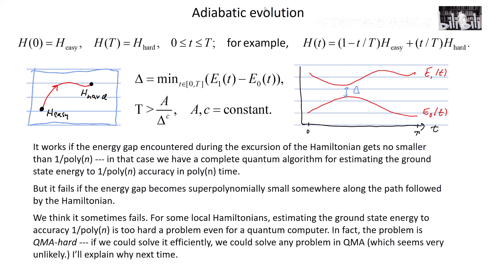

# 019：量子模拟

在本节课中，我们将学习如何使用量子计算机来模拟量子系统的行为。我们将探讨两个核心任务：模拟量子系统的动力学演化，以及估算量子系统的能量本征值。我们将看到，对于一类称为“局域哈密顿量”的系统，量子计算机可以高效地完成这些任务。

---

## 局域哈密顿量

首先，我们需要理解什么是局域哈密顿量。一个哈密顿量可以写成许多项的和，其中每一项都只非平凡地作用在恒定数量的量子比特上，这个数量与系统总大小无关。此外，每一项的算符范数都是有界的。

在几何局域的情况下，量子比特被排列在某个维度的晶格上，哈密顿量中的每一项只作用在空间上相邻的量子比特上。这种描述被认为足以刻画自然界中观察到的许多现象。

---

## 模拟时间演化

上一节我们介绍了局域哈密顿量的概念。本节中，我们来看看如何模拟由这种哈密顿量支配的时间演化。

我们希望求解含时薛定谔方程，它描述了系统状态随时间的演化。演化算符 \( U(T) \) 满足方程：
\[
\frac{dU(t)}{dt} = -i H(t) U(t)
\]
其中 \( H(t) \) 是哈密顿量，初始条件为 \( U(0) = I \)。我们的目标是在量子计算机上制备一个近似于理想演化末态 \( |\psi(T)\rangle \) 的量子态。

由于哈密顿量是许多非对易项的和，直接计算 \( e^{-iHt} \) 是困难的。我们采用的方法是：将总时间 \( T \) 划分为许多小的时间步长 \( \Delta \)。对于每个小步长，我们近似地认为哈密顿量是常数，并利用**Trotter-Suzuki分解**来近似演化算符。

具体来说，我们将 \( e^{-iH \Delta} \) 近似为各个局域项指数算符的乘积：
\[
e^{-iH \Delta} \approx \prod_a e^{-i H_a \Delta}
\]
其中 \( H = \sum_a H_a \)。当 \( H_a \) 之间不对易时，这个近似会引入误差。通过分析，可以证明每一步的误差上界正比于 \( M h^2 \Delta^2 \)，其中 \( M \) 是哈密顿量中的项数，\( h \) 是每项范数的上界。

为了在总时间 \( T \) 内将总误差控制在 \( \delta \) 以内，我们需要选择足够小的时间步长 \( \Delta \)，并且所需的总门操作数量（电路规模）将正比于：
\[
\frac{M T h^2}{\delta}
\]
在几何局域的情况下，\( M \) 与量子比特数 \( N \) 成正比，因此电路规模是 \( N \) 和 \( T \) 的多项式函数。通过使用更高阶的分解方法，我们甚至可以将标度改进到接近线性。

这个结果表明，量子计算机可以以多项式资源成本模拟局域量子系统的演化，而经典计算机则通常需要指数级资源。

---

## 估算能量本征值

上一节我们学习了如何模拟时间演化。本节中，我们来看看如何利用这一能力来估算量子系统的能量本征值。

我们希望测量一个局域哈密顿量 \( H \) 的能量。思路是使用**量子相位估计算法**。我们考虑演化算符 \( U = e^{-i H T} \)，其中 \( T \) 是一个固定的时间参数。相位估计算法可以估算 \( U \) 的本征值，其形式为 \( e^{-i E T} \)，从而我们可以反推出能量 \( E \)。

以下是实现相位估计的电路步骤概述：
1.  准备一个包含 \( m \) 个量子比特的“时间寄存器”，将其初始化为所有计算基态的叠加态。
2.  根据时间寄存器中量子比特的值，条件性地应用受控 \( U^{2^j} \) 操作（\( j \) 是比特位置）。
3.  对时间寄存器执行逆量子傅里叶变换。
4.  测量时间寄存器。测量结果 \( k \) 给出了能量 \( E \) 的近似值：\( E \approx 2\pi k / (T \cdot 2^m) \)。

通过重复此过程，我们可以绘制出测量结果的直方图，其峰值对应于系统的能量本征值，峰高则正比于初始态与对应本征态重叠的平方。

现在我们来分析这个过程的资源消耗。电路中最耗时的部分是模拟时间演化 \( U^{2^j} \)，其中最大的演化时间为 \( T \cdot 2^m \)。为了获得 \( m \) 比特的精度（即误差 ~ \( 2^{-m} \)），我们需要模拟的电路规模是 \( N \)（量子比特数）和 \( m \) 的多项式函数。因此，以多项式资源实现多项式精度的能量估算是可行的。

---

## 制备初始态与绝热定理

上一节我们介绍了能量估算的方法，但该方法要求初始态与目标能量本征态有足够大的重叠。本节中，我们来看看如何利用**绝热定理**来制备这样的初始态，特别是基态。

如果我们想估算基态能量，就需要一个与基态有非指数小重叠的初始态。一个通用的策略是：
1.  从一个易于制备其基态的简单哈密顿量 \( H_{\text{easy}} \) 开始（例如，无相互作用的系统）。
2.  在量子计算机上，模拟一个从 \( H_{\text{easy}} \) 缓慢变化到目标哈密顿量 \( H_{\text{hard}} \) 的演化过程。
3.  根据绝热定理，如果变化足够慢，并且整个路径上的基态与第一激发态之间的能隙 \( \Delta \) 始终不小于 \( 1/\text{poly}(N) \)，那么初始的基态将演化为目标哈密顿量的一个良好近似的基态。

“足够慢”意味着总演化时间 \( T \) 需要满足 \( T \gtrsim 1/\Delta^2 \)（或类似的标度关系）。只要能隙是多项式小的，所需的演化时间就是多项式长的，因此整个态制备过程可以在量子计算机上高效完成。

然而，如果路径上的最小能隙是指数级小的，那么绝热演化将需要指数级长的时间，这使得制备过程变得低效。事实上，人们相信对于某些局域哈密顿量，精确计算其基态能量是一个QMA难问题，这意味着即使对于量子计算机，在一般情况下也是困难的。这反过来说明，对于这些困难的哈密顿量，通过绝热演化高效制备其基态很可能也是不可行的。

---

## 总结

本节课中我们一起学习了量子模拟的两个核心应用。
1.  **模拟时间演化**：对于局域哈密顿量，量子计算机可以使用Trotter分解等方法，以多项式资源模拟系统的动力学。
2.  **估算能量本征值**：结合量子相位估计算法和时间演化模拟，可以多项式资源估算系统的能量。成功的关键在于制备与目标本征态有足够重叠的初始态，这可以通过绝热演化来实现，前提是演化路径上的能隙不是指数级小的。

这些结果展示了量子计算机在模拟自然量子系统方面的潜在优势，同时也揭示了其计算能力的边界：一些问题是即使量子计算机也难以高效解决的。