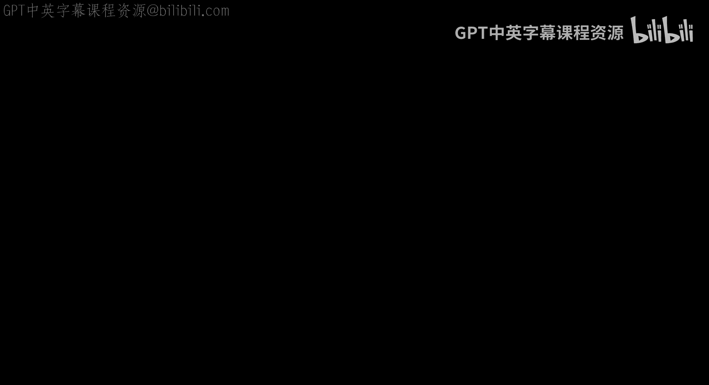
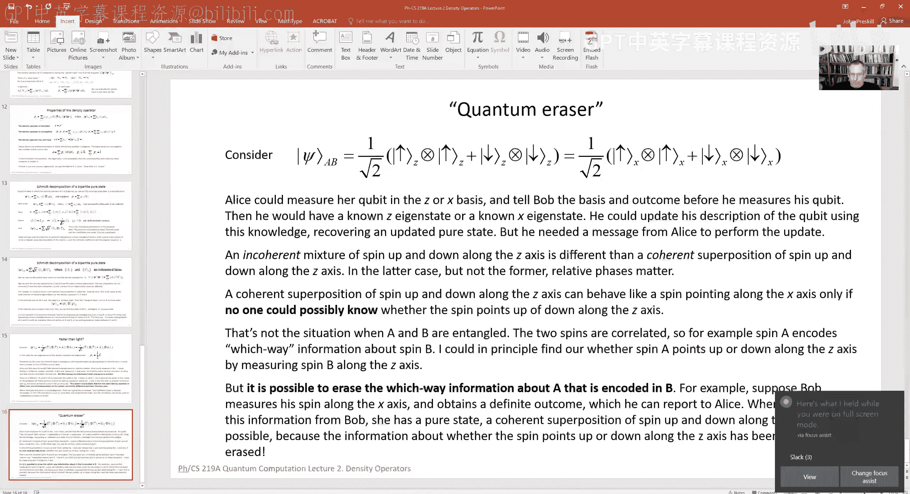

# 加州理工学院《量子计算｜Ph219⧸CS219 Quantum Computation Fall 2020》中英字幕 p02 -02-Ph CS 219A Lecture 2 Density Operator.zh_en -BV1KgffBoEUc_p2-

Hello， welcome back to Physics Comp Science 219 A。I hope you're bearing up well with the advent of a new academic year in our first lecture。

 I gave a broad overview of the subject of quantum computing and quantum information。

To provide some background， I hope that was fun， but it's probably not going to help you do the homework。

So now in lecture two， we'll roll up our sleeves and start talking about the technical material in the class。

And。The topic of this lecture， lecture two。Will be the density operator。

And this is really the first of several lectures in which we will develop the theory of open quantum systems and when we say in a quantum system is open。

 what that means is that it's not perfectly isolated from the rest of the world in particular。

 it can exchange information， energy， perhaps other things with its environment and why do we want to study this topic it's because all real quantum systems。

 all the quantum systems that we will encounter in the laboratory。

Are always open now there's a matter of degree， some are more open than others。

 but we can never completely perfectly isolate our quantum system of interest。

From its environment and that's important to us。When we're studying quantum computing。

 because it does result in imperfect operation of a quantum computer。

The interactions between our quantum system， a quantum computer and in particular。

 with its environment drives the phenomenon of decocoherence。

 which we talked about a little bit in the first lecture。

 and that's a source of error when we execute quantum gates。

And it's important to understand that process。Especially when we just we study the way in which we hope to。

Opposed to overcome the limitations imposed by decocoherence through quantum error correction。

 and that will be a topic studied in the winter term in 219B。

 we won't really be talking about quantum error correction in this term。

 but we will discuss the general concept of decocoherence to pave the way for that discussion of quantum error correction later on。

Now the way we study open quantum systems is。We conveniently imagine。That。

The open system is part of a closed system， some system we can imagine its whole universe。

Obeys the rules for closed quantum systems， which we'll review in a moment。

 and we're interested in studying just a part of that universe。Which we'll call the system。

And we're not able to observe or manipulate the rest of the universe。

 which we'll call the environment Now this topic is discussed in chapter two of our lecture notes and in the lectures。

 I will amplify some of those points which are also covered in the notes after all they're called lecture notes for a reason but I won't be able to cover everything that's in the notes。

 so listening to the lectures doesn't necessarily relieve you of the obligation to read the lecture notes。

Now。Let's remember。The aximatic formulation of。Quantum mechanics， now you may have seen this before。

 in which case it's worthwhile taking a moment to review and even if you haven't。

 the rules are easy to understand if you're comfortable with general notions from linear algebra。

And what these axioms do is they formulate a model。

 a mathematical model that we're going to use to describe the world。And to define what that model is。

 we need to explain how mathematically we will describe the states of a system， the observables。

 meaning the things that we can measure to acquire information about the system。

 exactly how we do these measurements and how they can be described mathematically。

 the dynamics which characterizes how quantum systems can change as time advances and also rules for composing quantum systems to build composite systems out of smaller subsystems。

So to begin with。How do we describe states？The axiom states。

That a state is what's called array in a Hilbert space， in fact， in a complex Hilbert space。

 a Hilbert space is a vector space， a complex vector space with an inner product。And actually。

 in functional analysis， there's a great deal to say about Hilbert spaces that are infinite dimensional and the observables。

That act on such systems， the operators that act on them。

And there's some physics motivation for studying the theory of infinite dimensional spaces。

 but we won't need that in this class， we can always imagine that any quantum system will considered。

Is。Described by a finite dimensional vector space， even though the dimension may be very large。

 it's finite。And so。Inter product is a complex inner product。

 It has the property of being cesqui linear and linear in its。

Second argument and antiline in its first， in other words。

 if I reverse the order of two vectors in the inner product that has the effects of complexs conjugating the inner product now here I'm using a notation which physicists like called direct notation it may take a little getting used to if you haven't seen it before。

 but what I've written here is called。A cat， it's just a way of representing a vector。

In our vector space。 And when I turn it around so that the。Cararrot points the other way。

 we call it a bra， this is a joke that directak。Started because the two together。

 he called a bracket and he broke it up into the cat on the right and the bra on the left。

 but this is really just a notation for an inner product of two vectors and a complex vector space。

And when I say array， what does that mean， it means if I take that vector and I multiply it by a nonzero complex number。

 any complex number other than zero， that that doesn't change the properties of the state。

 that the physical consequences， the physical properties are completely unmodified。

For that reason and also for other reasons， which we'll discuss。

 it's convenient to choose a standard normalization for the vector。

 we can choose it to have an inner product with itself of one norm of one and then this statement becomes that if I modify the overall phase of that vector。

 if I multiply it by a complex number of modulus one， that doesn't change what。

The physical properties of the state are now we have to be a little bit careful because this is a vector space and that means that can take linear combinations of vectors when we do take linear combinations then we care about the relative phases so if I take a linear combination of two vectors the complex coefficients and I change the phase of one of those coefficients。

That is a change that has physical consequences， that's not changing the overall phase of this vector when we take the superposition。

 we care about the relative phase。In this notation。

 there's a handy way of thinking about these bras in which the。The carrot points to the left。

 you can think about that as a linear functional， a linear map。

 which takes vectors to complex numbers， namely when I write the bra phi。

 what I mean is given an input vector psi， it maps it to a complex number。

 which is an inner product of these two vectors p and psi。

Now how do we model observables well the observables are just linear operators what could be simpler and in fact they're self ajo linear operators also called hermeian the distinction between self a joint and hermeian。

Doesn't really matter， doesn't exist when we。Consider only finite dimensional vector spaces as we will。

 so it has the property of being equal to its Hermeian ad jointt， the Hermeian ad jointint。

Is defined so that the Hermeian ad joint acting on psi in a product with Phi well sorry the。

Result of applying a to the vector psi and taking the inner product with phi is the same as if we took the a joint of a。

Acing on Phi and then took the inner product withsi。

 we won't have to worry about the distinction between a。

Operator and information and joint when we're talking about these observables because they're self a joint。

Now self ajo operators。In our Hilbert space can be diagonalized。

 that means we can choose an orthonormal basis such that the operator has a nice spectral decomposition。

 it can be written in this form， a sum over numbers which are actually real numbers because the eigenvalues of hermeian operators are real numbers。

 times orthogonal projectors， the orthogonal projectors projecting onto the space of eigenvectors。

With that given eigenvalue， which here I've called a subn real number because this is a Hermeian operator and a orthogonal projector means that these。

Objects E sub n are Permeian operators， they also have the property that for different eigenvalues they're mutually orthogonal。

 so when I apply e sub n after applying e sub n， I get zero。

 but for any n e sub n squared is equal to E sub n。

That's what we mean by our orthogonal projector and the words mean just what you think it means it projects out some subspace of the vector space。

Now。What happens when we make a measurement of such an observable？Well。

 there are rules for assigning probabilities to the various outcomes of the measurement that can occur。

The rule is called the Bour rule that's named after a guy， Max Bourne。

And what it says is that if I measure the observable a， which has this spectral decomposition。

 getting the outcome that corresponds to the eigenvalue a sub N of that observable。

Occurs with some probability， which is just the。Yes。嗯。

The norm squared of the result of projecting the vector onto the corresponding eigenspace。

 it's the length squared to the vector we get by projecting out its component along the eigenspace of the observable a。

And because of the property that these are orthogonal projectors。

 that the E is equal to E adjot and e squared is equal to E。

 that's the same as saying that when we measure in some state psi， the observable a。

 the probability of getting the outcome a sub n is just the inner product of the result of applying the projector to psi with itself。

The rules also tell us what the state will be after the measurement。So if I perform a measurement。

 the result is the projected state projected onto the eigen space of the eigenvalue that was observed in the measurement。

 but because we by convention normalize our vectors。

 we then divide by its norm to get a vector which has norm one。

 we don't have to worry about dividing by zero because E acting on psi will always be non-zero for any outcome that occurs with a probability that's not zero。

So as you see， the rules for describing measurements are non deterministic。

 one an observable is measured， there is not， in general some definite outcome。But rather。

 some probability distribution of possible outcomes。

Now notice that this rule for the postmeasure state says that if after doing a measurement。

 I immediately measure again， I will get the same outcome the second time as I got the first time when I say immediately after what I mean is before the state has had a chance to change to evolve it all。

 I do the measurement immediately after the first one and the post-measure state has the property that I'll get this same outcome the second time I measure it's often convenient to talk about the expectation value of the outcome of the measurement that is we sum over all the possible outcomes weighted by their probabilities and using this spectral representation of the operator a there's a nice expression for that its just the inner product of the result of applying a to the input state psi with the state Psi。

Now we also are interested in how quantum states change as time。Advances。

And that's described by the time dependent Schchrodinger equation。 It's a very simple equation。

 It's a linear equation。 It says that the time derivative of the state。Is given by an operator H。

 which is called the Hamiltonian of the system of interest times minus I I meaning the square root of minus1 times the state。

And this Hamiltonian is itself a self a joint operator in general it could depend on time in physics sometimes we consider fundamental laws in which the Hamiltonian is a time independent operator but when we're in the lab。

 we often have the ability by turning knobs to change the Hamiltonian for some system that we wish to manipulate like a quantum computer。

 a quantum computer wouldn't be that interesting if it didn't change in time。

 and by manipulating knobs like for example， the intensity or the phase of a laser shining on an atom or a magnetic field。

Applied to an electron， we can make the state change with time and the way it changes can vary from one moment to the next。

 depending on how we adjust the knobs that are controlling the system。

This equation is so simple that at least for short times。

 it's very easy to solve if I consider the time advancing by an infinitesimal amount in DT。

That can be described by an operator acting on the state side。

 which is just the identity minus I times H， the Hamiltonian at that time。

 times that small increment。And in fact， the operator I minus IHDT。

 if we consider it expanded only to linear order in Dt。Is a unitary operator。

 it can be written as e to the minus Ih times Dt。Ignoring terms that are higher order and Dt and that has the property of just being a unitary change of basis in the Hilbert space。

 So as the state evolved， it is undergoing some rotation in the Hilbert space， just some。

Change in ortho theormal basis and the way it's changing with time could be varying as time advances if the Hamiltonian is in fact time dependent。

So dynamics in quantum mechanics is really simple compared to classical mechanics， for example。

 where all the hard problems involve nonlinear differential equations。

 the complexity comes in because the Hilbert space can be extremely large and the Hamiltonian could be a very。

 very large matrix。Now there's just one more axiom that we'll need to talk about and that is。

The rule for putting together systems to build bigger systems and what that axiom says is that if I have a quantum system A and another quantum system B。

 and I want to consider the composition of the two to give a system which I'll call AB。

 the Hilbert space that describes that composite system is just the tensor product of the Hilbert space for system A and the Hilbert space for system B。

 I talked a little bit about the tensor product in the first lecture。

An important property is that if the dimension of system A is D sub A and of。System B is D sub B。

 then the dimension of the composite system is the product of the two dimensions。

 D sub a times d sub B。And the tensor product Hilbert space is。

Just the span of orthonormal basis vectors where the elements at the orthonormal basis are constructed by taking a tensor product of one of the basis states for system a and one of the basis states for system b so that's it those are the axioms they tell us how quantum system behaves when it doesn't interact with the outside world that's what I mean by a closed system and a very。

Distinctive。Property of these axioms is that they make a distinction， which seems。

Fundamental between how systems evolve with time described by the Schrodinger equation during which they evolve Uniarily。

So there's a deterministic rule for evolution， determined by that time dependent Schchrodinger equation。

 but measurement is a different story， measurement is nondeterministic。

 it's described by probabilities， and that distinction is found to be troubling to many people。

 it is the core of what people sometimes call the measurement problem in quantum mechanics。Well。

 we're going to kind of leave that beside and not worry about it。

 I do think though the quantum information concepts we'll be talking about help to clarify the issues regarding the distinction between measurement and evolution and we will from time to time come back to that point。

 but we aren't going to delve into it。With great depth。Well， the simplest thing we can consider。

 well the simplest thing is too trivial to consider， it's a one dimensional Hilbert space。

 but since we don't care about the overall phase and we set the normalization to one。

 that's not a very interesting state space to talk about。The case of two dimensions is。

Somewhat interesting， that's what we call a qubit。 It is the quantum analog of a bit the simplest unit of information in the classical world physicists might call it a。

Two level system or a。Spin one half object。But they're all words for the same thing and because of our emphasis on information and computing。

 we will call。System described by a two dimensional Hilbert space， a qubit。

 and you can think of that as the span of two basis states and in keeping with the notation we routinely used for describing bits。

We may call those orthonormal basis states zero and1。

 I've drawn them as ks to remind you that they are vectors， not just classical bits。

 there's another popular notation， which is to draw the two basis states as an arrow pointing up and an arrow pointing down and to call them spin up and spin down that's a rather natural way to describe the basis states if I'm thinking for example。

 of the spin of an electron， but it's really all the same thing at least from our point of view in this class。

Now the operators， the linear operators。Acting on that two dimensional Hilbert space。

Have a dimension which is the square the dimension of the Hilbert space four dimensional we can choose a basis for the linear operators two by two matrices and there's a standard basis which we're often going to find convenient they're called the poly operators poly is somebody's name both gang poly interestingly。

He invented， wait didn't invent， he pointed out that these matrices are useful for the purpose of describing a the spin of an electron。

What was a little bit ironic is that Polly， when he first became acquainted with the idea that electrons have intrinsic spin。

 he was horrified by the idea and thought it was completely off base。

 but to his credit he eventually came around and provided some helpful mathematical formalism for describing。

The spin of an electron。Sometimes I'm going to prefer a different notation than what I've shown here。

 but before we get to that， I'll just point out that these four matrices have certain properties。

 they're all hermeian because I've chosen them to be that way。

 they also have the property that if you take the square of any one of these matrices。

 you get the unit matrix， the first one is of course just the unit matrix。

The other three are called Sigma 1， Sigma 2， Sigma 3 or Sigma x， Sigma y， Sigma Z。

And sometimes I'll just call the x， Y and Z because what's the point of writing all the sigmas all the time。

 but that's just another notation for the same thing。And so let's imagine a qubit general qubit。

 I can write as a linear combination of the two basis states。

 which here I'm going to call0 and1 with coefficients complex numbers A and B remember we're going to set the normalization equal to1 so that means that absolute value of a squared plus absolute value of B squared is equal to1。

 that's the norm squared of that vector we don't care about the overall phase either because it's only raised in Hilbert space that describe states of physical systems。

 so now let's suppose we apply our rules to the measurement of one of these observables。

 let's make it sigma3 so it has two eigenvalues actually sigma 1 sigma  two and sigma 3 all have the eigenvalues plus1 and minus1 that's why when we square them we get the identity。

That's particularly manifest in the case of Sigma 3， which I've written in diagonal form。

And the plus one。Eigenvalue corresponds to the eigenstate which I've called the basis state zero。

 the minus1 eigenvalue to the basis state called1 so if we measure sigma 3 we'll get two possible outcomes which I can describe using two different types of language I can say the outcome was the state0 or the state1 or I could say the outcome was the eigenvalue plus one or the eigenvalue minus1 that's just two ways of saying the same thing。

 so what does our rule say it says that to find the probability of getting the outcome0 from the measurement of this diagonal operator sigma3 we take the magnitude squared of the projection of the vector onto the eigenspace zero and that's just the absolute value squared to a。

And。Likewise getting the outcome cat1 or eigenvalue minus1。

 the probability of that is the absolute value of b squared and you can see now why I like normalizing the vectors so that the norm is one and then those amplitude squared it'll just add up to one otherwise I'd have to divide by that quantity to make sure I get a normalized probability distribution Now you might say what's the big deal about a qubit。

Isn't it really the same thing as if I had a coin and I flipped it and it came up either heads or tails。

 And at first， maybe we don't know which So we assign some probability to the outcome。

Heads into the outcome tails， just like I've done here for the outcome 0。 And one。

 is there any difference between that and aqubit？ And， in fact。

 there is a difference and the difference。Arises because。When you flip a coin。

 there's just one way to look at it and okay， it's either heads or tails。But with the qubit。

 there are a lot of different ways of looking at it because there are a lot of different observables we can consider measuring in this two dimensional Hilbert space。

Now in fact， there's a nice way to parameterize。A general state of a qubit that is a general vector。

 which is normalized to have norm1 in our two dimensional vector space when we don't care about the overall phase and the different states correspond to points on a two dimensional unit sphere。

It's two dimensional because we really only need two real parameters to describe a linear combination of0 and1 with complex coefficients if we don't care about the overall phase。

 that gets rid of one parameter， we don't care about the normalization。

 or rather we fix it to one that gets rid of the other parameter， two real parameter left。

 and I can think of those as being angles。Which I denoted here by theta and phi。嗯。

You can think of the different possible states of the qubit as corresponding to points on the sphere which are parameterized by a polar angle。

 that's theta， and as a muyl angle phi and the interpretation of theta and phi in terms of angles is nicely elaborated by the theory of angleular momentum in quantum mechanics that you can think of the qubit as providing a so-called spin one half irreducible representation of the three dimensionmensal rotation group。

 I'm not going to go through that here there is some discussion of it in the node。

But let's just become accustomed to this parameterization。

 supposed to be fixed by2 zero for the moment， so this phase。

Is trivial and then as theta rotates from zero to pi。

 the state rotates from zero when theta is equal to zero to the state1 when theta is equal to pi because that's when sine theta over two is one。

 so you can think of those two basis states in this representation as being the north pole and the south pole on this two sphere。

It's a little bit confusing sometimes because the states zero and one。

 which we're representing as the North Pole and the South Pole are actually orthogonal states in the Hilbert space。

 what if you look at the。2 sphere representation， we call this two dimensional sphere。

 the block sphere they're oriented along the same axis， the z axis。

 what that's telling us is the outcome of a measurement of sigma 3 in the two cases that will get the outcome plus one when we're at the North Po and minus one when we're at the South Po that's how we're distinguishing the basis states zero and1。

Now， as we change phi， now there's a relative phase between the two states in superposition and when phi ranges all the way from0 to two pi。

 then we get back to where we started， well it may not look like it at first because then e to the I phi over two is actually minus1。

 but so is e to the minus I phi over two when phi is equal to two pi， so when phi reaches two pi。

 we really have the same array again， even though we've multiplied it by minus1。

 and that property that a rotation by two pi actually modifies the state by a sign is the characteristic properties of what are called the spinner representations of the rotation group but onem not going to have to worry about that too much。

Now I said that we can consider measuring different observables and in fact， send Sigma 1。

 Sigma 2 and Sigma 3。Are all Hermeian operators， and I want an observable to be a Hermeian operator。

I can consider taking real linear combinations of sigma 1 Sigma 2 and sigma 3 and those are also observables and actually if I want to keep the property that this observables square is equal to the identity or in other words that it's eigenvalues are plus1 and minus one then I can choose the three component vector corresponding to this linear combination with components n1 and2 and n3 to be a unit vector3 vector which has length1 and eigenparametize that by the same angles。

 theta n phi a polar angle and as a euthhal angle and the reason I want to do that is because one can make the observation and you can check this easily yourself using trigoometric addition formulas。

 that if I define and hat this way and I consider psi depending on theta。

N phi as written here in the top line for psi of theta phi。

 then the statesi of theta phi is actually an eigen state with eigenvalue1 of the observable n hat dot sigma that is of n1 sigma1 plus n2 sigma 2 plus n3 sigma 3。

So you see that's different than a coin which has some probability of being up and some probability of being down。

 that might be what happens。When I quote unquote， measuresure along the z axis。

 that is when I measure the observable sigma 3， I call it measuring along the z axis because it corresponds to the case where the vector n hat points along the z axis。

 but there's another direction on which I can measure that corresponds to measuring this observable nhe do sigma n hat picking out a direction on the two sphere。

 and if I choose that observable appropriately as I have here。

 that in fact the state is an eigenstate with eigenvalue1 of that observable so there's some axis along which I can measure and I'll get the outcome plus one for the eigenvalue every time with probability1。

Now， if I have just a single copy of a qubit， maybe I prepare that state and I hand it to you。

 I don't tell you what it is。With is that one copy you can't for sure tell me what theta and P are。

 you don't know what access to measure law。And even if you did。

 you would just get a sample from some probability distribution if you just had one copy。

But I can make life easier for you by preparing many identical copies of my state all with the same value of theta and phi。

 and I can hand them all to you， I can give you a million copies and you can make measurements on each copy individually and if you do that you'll be able to find theta and phi with very high statistical accuracy because you can measure many times。

 and by measuring many times you can get an estimate with a small statistical error of the expectation value of the observables。

 Sigma1， Sigma2 and Sigma3 and that information is enough。To tell you both theta and phi， in fact。

 the expectation value of sigma 3， you can easily compute it is just given by cosine theta。

And you well let's just do it for a second， the probability of getting the outcome plus one for the eigenvalue or in other words the state basiss state zero is going to be cosine squared theta over two the probability of getting the outcome minus one for the eigenvalue in other words projecting onto the state one that sine squared theta over two when I take the expectation value I take the probability of getting plus one and then。

Add to that minus1 times the probability of getting minus1 for the eigenvalue。

 that's cosine squared theta over 2， minus sine squared theta over  two， which is just cosine theta。

And likewise， you can figure out the expectation value of Sigma 1 and Sigma  two。And they， in effect。

 point out a unique。Point on the two sphere， which is enough to tell us both theta and phi unambiguously if I just measured sigma 3 that wouldn't be enough it would tell me once I know the expectation value accurately what cosine theta is it would tell me the polar angle it wouldn't tell me anything about the as a muyl angle and if I measured sigma1 as well well now I'd know a lot about the as authhal angle I would know its s sorry I wouldn know its cosine。

The cosine of phi。As well as the cosine of theta， but there would still be an ambiguity in phi because there are two different points on the two sphere or two different values of phi that have the same cosine and to distinguish between them I'd need to measure the third observable sigma 2。

But once I measured all three， now I can completely characterize the state of thequbit。Now。

 let's give it a specific example just to make sure it's all clear。Well。

 suppose I did have the state which。Is aligned with the Z axis is pointing at the North pole now I'm going to use the spin up notation and spin down notation because it's so natural when we're thinking about points on a two sphere。

 spin up means pointing at the North pole， spin down means pointing at the south pole。

Now there's a state which I've called here spin up。Sub x。

 that means the state that points along the positive X direction so that if I measure sigma1。

 which is like measuring the spin along the X direction。

 that's the case in which n1 is equal to1 and n2 and n3 are equal to zero。

 this is an eigen state of thatable observable with eigenvalue 1。

And that's what I meant when I said expectation value sigma1 in this state is equal to one。

 so for this particular cell， if we measure along the x axis， we get the plus one outcome every time。

But it depends on the relative phase， if I combine together。

 spin up along the z axis and spin down along the Z axis。

 it makes a difference whether I combine them with a plus sign or a minus sign。

When I have the minus sign， that actually means that when I measure along the positive x axis。

 I get minus one every time， okay， I get the other orthogonal basis state orthogonal to the spin up along the X axis。

 which we could call spin down along the X axis。Now。

When you have one of these eigenstates of the spin along the x axis and you measure in the z basis。

 so the spin in this block sphere representation is pointing along the X axis and we measure along the north and south pole axis then we just get a uniformly random outcome according to our rules。

 the probability of spin up along the z axis or spin down along the z axis is one half so it's just a uniform distribution we just generate a random bit。

By doing that measurement。Now， likewise。嗯。If we had。A。Z Eigen State。And we measured in the X basis。

 It would be the same story because the inner product of the。Eigen State of eilon。

Spin up along the X axis with spin up or spin down along the C axis it's just one over the square root of two。

 if you square that you get one half so if you have spin up along the X axis。Sorry。

 if you have the spin up state along the z axis and you measure along the x axis。

 you just generate a random bit。Now， you see the relative phases in the superpositions of basis vectors really do make a difference because if you were naive。

You might say that if I have。A。Spin up state along the Xx if I just thought of that as being like a coin。

 which could come up either heads or tails with probability one half with uniform。

Distributed probability could be either spin up along the Z axis or spin down along the Z axis。

And the same thing is true when it's been down along the x axis if I measure that along the z axis。

 then I just get a uniform probability distribution for that measurement。

 and then I take this superposition of spin up and spin down along the x axis， well。

 look if you measure the first state in the superposition you get a uniform distribution for the outcome of a z measurement。

 if you measure the second state in the superposition along the z axis。

 you get a uniform superposition， so if you put them together。

 if you think of this as being with probability one half spin up along the x axis probability one half。

 spin down along the X axis， then of course you would have to get a uniform distribution for measuring this linear combination along the z axis because it's just a superposition of two states which have that property occurring equal probably。

 but that's not。What happens the phases add up in a so-called constructive matter when we measure along the z axis so in fact。

 this linear combination of spin up and spend time along the X axis just gives us back the eigenstate of spin up along the z axis so for the purpose of obtaining that outcome spin up。

The two states we say interfere constructively for the purpose of getting the orthogonal states spin down along the Z axis。

 they add up destructively and so that outcome occurs with zero probability and that's what people call。

Interference of amplitudes in quantum mechanics。Now。

We've talked about the rules for closed quantum systems so far。

 but remember what we're trying to get at is what happens when we have an open quantum system。

 one that interacts with its environment， where we don't observe the environment。

 we only see the system， not the environment it's interacting with。And then the rules are different。

 Then it's no longer true that we describe a state as a ray in Hilbert space。

It's no longer true that a measurement in general can be described as an orthogonal projection in Hilbert space。

It's no longer true that evolution is described by some unitary map by just a rotation of the basis in Hilbert space。

 there are new rules for open systems and we'd like to understand what they are。

And to make the discussion a little bit more colorful。

 instead of thinking of a system and its environment， I'll imagine two parties。

 I'm going to call them Alice and Bob the systems that they have access to are system A and Alice's case system B in Bob's case。

 and we imagine some quantum state of the joint system A and B。

 but then we ask what if Alice has access only system A and she can't touch or get any information about what's going on in system B。

 how does she describe？The system she does have access to system A so let's start with an example。

 let's remember our rule about how to describe composite systems。

We take a tensor product of the two Hilbert spaces。

 so let's just consider a particular possible state in that tensor product。

It'll be a linear combination of two of the basis states for the Tensor product Hilbert space。

 I've chosen those to be the zero zero state of A and B。And the 11 state of A and B so by zero0。

 I mean the tensor product of basis state zero for a and basis state0 for Bob， similarly for 11。

 and to say writing sometimes I won't write the tensor product and the subscripts。

 I'll just write  zero zero， meaning system A is in the basis state0 and system B is in the basis state0 and then plus coefficient times 11 for the other basis state for the composite system。

And now we could ask。Suppose that Bob makes a measurement。He makes a measurement in the Z basis。

So what does that mean in the case of the composite system， he doesn't have any access to system a。

 so the observable that he's measuring is just the identity acting on system A and acting on system B。

 he's measuring Sigma 3， what I've also called Z Z acting only on his system。Okay。Now。The state zero。

 Bob's basis state zero has eigenvalue plus one。His basis state1 has eigenvalue minus1 for the observable z。

 and so the projection onto bo's0 occurs with a probability which is just the coefficient of00 squared。

Absolute value of a squared and similarly。The outcome giving Bob's projection onto one is given by the coefficient of 11。

Absute value square and so the post measurement state will be either in the first case when Bob's outcome is zero now Alice's state is zero and so is Bob's and if on the other hand Bob's outcome is one then Alice has one and Bob also has one so after Bob measures the post measurement state according to our rules is going to be a perfectly。

Correlatedated state for Alice and Bob， so another way of saying it is Bob makes his measurement and he's going to prepare for Alice。

The state zero with probability absolute value of a squared and is's going to prepare for Alice the state one with probability of b squared。

 that's what our measurement axiom has told us。Well， no。

 let's see what happens if we let AliceS measure some more general observable。Now， in fact。

 I'm going to consider Alice measuring now instead of Bob。

So there's some nontri observable which Alice is able to apply to or measure in system A Alice doesn't have access to system B so now we're talking about an observable which is a tempor product of identity for B and some hermeian operator acting on a。

And I'm going to consider this same state， which is a superposition of00 and 11。

 and I can ask what is the expectation value of the observable that Alice is measuring in this state so according to the rule for calculating an expectation value I want to take the inner product of the observable acting on the input state with the input state。

That input state is just a time state zero0 plus B time state 11。

Here's the operator acting on that state and then here I have the corresponding bra for this cat。

 which I get by replacing the bras by ks and taking complex conjugates because I'm evaluating our products in a complex hilbert space and now。

On Bob system we just have the identity， so if we have one for Bob system on the right and zero on the left of this expectation value or we have zero for Bob system on the right and one on the left。

Because there're in one orthogonal that's not going to contribute and so there's sum is just going to collapse to the expectation value。

Of the observable that Alice is measuring in the state zero that's occurring with。

The coefficient absolute value of a squared and the matrix element between one on the right and one on the left of Alice is observable weighted by the absolute value of b squared that's just because0 and one are orthogonal states on Bob's side and we just have the identity acting on Bob's system in the observable because it's something that Alice can measure now there's another way of writing this this expectation value which I've shown you here。

Can be written as the trace of the observable that Alice is measuring times a Hermeian operator。

 That Hermeian operator is just the absolute value of a squared times the projector onto Alice's basis state 0 plus the absolute value of B squared times the projector on Alice's basis state1。

😊，And I think you should be able to see that when I take that trace， the effect is just to take the。

The cat on on the left and move it over to the right， so i'm calculating this。

The same quantity as I've shown where I'm pointing now。In the upper right。

This operator is called the density operator of the system for the expectation value of the observable that Alice is measured。

We have a rule that I just take the trace of that observable times this operator。

 we call it the density operator， it's a characterization of a' system when that system is part of the composite system shared by Alice and Bob in this particular state the density operator that I've written down here this linear combination of projector on zero and projector onto one is the density operator that describes alysis system when the joint system of Alice and Bob is in this linear combination of the zero zero state。

And the one one state sometimes we call it the density matrix is just another word for the same thing as density operator。

Now there's a nice interpretation of this density operator。

Because the trace is a sum of two terms and namely these two terms here。And we might imagine。

That those terms arise because Bob really did measure his。sideide of the system in the z basis。

 in other words， in the orthoormal basis，0 and1 and so as we already noted。

 that would prepare for AliceS， the state zero with probability absolute value of a squared and it would prepare for AliceS the state one with probability equal to absolute value of b squared。

And so this trace is really just giving us the。Expectation value for Alice is observable if the state zero had been prepared weighted by the appropriate probability that if Bob had measured。

He would have gotten the outcome that prepared zero for Alice and the second term is the expectation value in the state one weighted by the probability that Bob if he had measured would have prepared the state one in Alice's system so we call that the ensemble interpretation of the density operator there isn't any way to tell the difference between it doesn't really matter whether Bob really does this measurement or not it's a true mathematical statement that。

Alice， when she measures her system， has no way of making a distinction。

 no measurement can tell the difference between two cases。

 one case is she is sharing with Bob this joint state， a00 plus B11。

 the other case is that someone maybe it was Bob， maybe it was somebody else。

 flipped some coins and either prepared in Alice's world。

 the state zero and did that with probability absolute value of a squared or prepared in Alice world。

 the state1 and did so with the complementary probability， absolute value of B squared。Now。

 the density operator actually gives us a complete。😊。

Description of any measurement that Alice chooses to do so as far as Alice is concerned。

 she doesn't need to know anything else except the density operator to predict or to say exactly what will happen when she makes any measurement on our system in that sense。

 it really gives a complete description of Alice's system for the purpose of any measurement that Alice does on system A alone。

 what the density operator is missing is describing all the information about how A and B are correlated with one another。

 but if Alice doesn't care about that because she's never going to communicate with Bob。

 remember we're imagining Bob is really standing in for an environment which she's never going to directly observe。

 then she might as well use the ensemble description or the density operator in other words tells us everything Alice is ever going to want to know about how our system behaves。

And I guess here I just have a simple example。Particular value of A and B。

 namely A and B are both equal to1 over the square root of two。

So let's say the state is a uniform superposition that is with the same amplitude we can have either zero zero or 11。

 then when we calculate the density operator。呃。It's just the identity operator。It's。

 if we imagine Bob measured， he would have gotten the outcome zero with probably one half or the outcome one with probability one half。

And the sum of the projector onto zero and the projector onto one。

 that's just the identity operator or the identity matrix。So in this case。If Alice measures system A。

And the joint state of A and B has been prepared as this 00 plus 11 state。

Then she can measure her spin along any axis。Perform a measurement of sigma dot n hat for any unit vector N hat。

 and remember all the sigmas are traceless matrices or these Sigma 1， Sigma 2 and Sigma 3。

And so when we take the trace of。Row， the identity times Sigma 1， Sigma 2 or Sigma 3， we get zero。

So that means that the expectation value when she measures her spin along any axis is zero。

 or in other words， since the eigenvalues are plus one and minus one。

 no matter what axis she measures along， she gets a uniform distribution of outcomes。

 she just generates a random bit。She gets the spin up outcome with probability1 half or the spin down outcome with probability1 half。

So now let's make it a little bit more general。Let's consider an arbitrary state shared by Alice and Bob。

 I won't necessarily assume that they have qubits now。

They could have systems of any finite dimension， and so the basis states in our Tensor product Hilbert space can be written as some orthoormal basis state for Alice。

 I've labeled those by eye。Tensored with an orthoormal basis state for Bob。

 I've denoted those by mu and a general state is just a superposition of these basis states with complex coefficients。

 which I've called a subbi mu and if we normalize the state that means the sum of the absolute value squared。

Of all of those coefficients is equal to1 and now we'll do the same thing that we did before。

 but now in this more general state， I'll consider what happens when Alice measures observable length of a。

 or in other words， the quantity that's being measured for the joint system is M for Alice' system tensored with the identity on Bob's system so I take the state psi I write it on the right and I take its Formmeian a joint on the left that changes the ks into bras。

 it complex conjugates a， but we can again use the property that because we have the identity。

Here acting on system B。We'll get zero if mu is not equal to new because those are mutually orthogonal states。

 and so there's sum。Is going to collapse to a sum over Alice's basis state for the。

si on the right and Alice's basis state for the psi on the left， but the basis state。

 oh I think I made a mistake here， sorry this should be J mu I mu because now only the terms with mu equals nu have survived here。

And so we wind up with a sum of matrix elements with I on the right。

 that's Alice's basis state and J on the left， another one of Alice's basis state of the observable M weighted by these numbers。

And this too， I can write as the trace。Oh， look， I did it again here， and that's too bad。

 I'll fix that later。That can be written as the trace。Of。A density operator。

 Rosa A times the observable that Alice is measuring M sub A。

And now that density operator is going to be a。Some of operators。

 each of which consists of a braG corresponding to one of Alice's basis elements and a cat。

 and then weighted by these numbers， sorry here， I should have replaced new by mu。

And this is something that we call a partial trace for the state side， in other words， I take。

An operator， which is just the projector onto the vector psi， I can write that as。A。

A brasi times a k psi why is that a projector well the bra will annihilate anything that's orthogonal to psi and for P psi itself the inner product of psi with Psi will give1 so psi will just get map back to psi okay that's just a way of writing a projector I take that operator and I evaluated so-called partial trace tracing over the boB side the system B side in order to get an operator which acts on a and that gives me the density operator which is from the typo I can write in this form。

So in thinking about these partial traces， it may be helpful to interpret the。

The bra is in a somewhat more general way。 You know。

 I said before we can think of the bra as a dual vector， which takes vectors to complex numbers。

 and that's true。 But you can also think about it in a somewhat more general way， for example， a。

B for system B， when it acts on a state in the Hilbert space for the composite system。

 AB maps it to a vector in system A。And likewise， you can think of the cat。For system B。

As an operator which acts on the dual vectors and takes the dual vectors for system AB to the dual vectors for a。

The rule for how these。Dual vectors Act on the Jo Hilbert spaces just this。

If I consider the bra labeled by mu acting on a basis state for AB。

 labeled by I for Aliceis and nu for Bob， it will annihilate it unless mu is equal to nu when mu is equal to mu it just gives me Alice's basis state I and likewise。

 if I think about the cat。Labeled by Mu for Bob system。

 acting now to the left on the bra for the joint system。

The cat will annihilate that bra unless mu is equal to new， and when mu is equal to new。

 we just get Alice's bra labeled by I。So。You can think about in general the partial trace and in this way。

 you have some operator acting on the joint system AB。

 and I want to trace out B that's going to give me an operator acting on a and you can think about that as choosing a basis for system B and then putting a cat。

On the right labeled by mu and a bra on the left， labeled by mu and summing over mu。

 and then using this action to see what the resulting operator is that you get。And in particular。

 if I take my projector onto the state ps and I perform that partial trace operation。

 that gives me the density operator and you can just think of it this way， I take the joint state。

And consider the well let's do it here first I look at the cat for system psi and I let the bra for system B act on it and that's going to give me。

A vector for system A。 and then I can take the。Brara for the joint system，si in this case。

 act on it with the k， that's going to give me a bra for system A and so altogether this is an operator。

 and that's how the density operator rises as a partial trace。

Now let's look at some of the properties of the density operator， which is a very fundamental object。

 will be talking about a lot。Well， first of all， it's a Hermeian operator。And we can see that。

Easily enough， if we just look at our expression。For row。

 if we take its hermeian conjugate what happens well that has the effect of interchanging the bra and the cat interchanging I and J。

 but it also complex conjugates these coefficients and if I then swap I andJ I just get the expression that I started with so taking the hermeian conjugate doesn't change row it's a hermeian operator in other words a selfajoin operator。

The self thejo operator also has the property of being non negative。Being hermeian。

We know it has the property that if I take its expectation value for any vector its matrix element between a vector phi on the right and phi on the left we'll get a real number。

 but in fact we get a non negative real number sometimes we say the operator is positive but we don't really mean it what we mean is it's non negative it。

The expectation value could be zero， but it can be negative。

And we can see that just by considering any file you like。And evaluating the。

Matrix element of row between Phi on the right and P on the left。

Using this expression for Ro that means I got this expression and I can reorganize this as boy there's another another typo here。

 I'm sorry about that。that。I sum over mu and then I have a sum over I and what I meant here was the absolute value squared of AI mu inner product of I with phi because when you expand out that inner product squared。

嗯。Or in other words that's just some complex number and when you expand out at square。

 you get exactly this expression and because it's a sum over mu of absolute values squared。

 which are non negative real numbers， then the sum can't be negative towards。A non negative operator。

 its expectation values are non negative real numbers。The density operator also has unit trace。

 if we take its trace， then that just amounts to setting i equal to J here and summing over I。

 and then this becomes the complex conjugate of AI mu times AI mu that's just the absolute value of AI mu squared。

And when we sum that over I and mu， well， that's just the same thing as the sum of all the amplitudes squared in the joint statesAB。

 which we normalizedize to one， so the trace is one。So in fact。Any operator。

Wwhich has these three properties， which is hermeian and non negative and has unit trace。

 we will honor by calling it a density operator if you like that's the definition of a density operator。

It's an operator that has a linear operator with these three properties。Now， because it's hermeian。

 it can be diagonalized， there's an orthoormal basis in which this density operator is diagonal。

And furthermore， since it's an non negative operator。

 we know that its eigenvalues have to be non negative real numbers。

So that means the density operator when expanded in the basis in which it's diagonal。

 is some nonnegative real number piece of a times projection onto eigenstate A and then summed over all the eigenstates and we know that the PAs a nonne numbers because we know rh is a nonne operator。

And we know that those non negative real numbers have to sum to one because the trace of the density operator is one okay。

 so in other words， the eigenvalues of the density operator we can think of as probability distribution theyre non negative real numbers and they sum to one。

And that has an interpretation in terms of our ensemble。哦。Way of describing a density operator。

The density operator is really equivalent。Can't be distinguished by any measurement from。

A situation in which。By flipping some coins， we sampled from a probability distribution and with probability B sub A。

 a piece sub A prepared in Alice's world the state A。Okay。When there's just one non zero eigenvalue。

 then we say the state is pure， otherwise we say it's a mixed state。Okay。Okay。Now。

Making use of that special basis in which the density operator for system A is diagonal。

We can put the pure state of the bipartid system consisting of A and B in a convenient standard form。

So let's suppose that I choose my basis state such that for the basis states for the tensor product。

 the basis that I choose for Alice is the basis in which the density operator is diagonal， okay？And。

Let's just write the state this way that it's summed over an index I。And associated with basis state。

 I for Alice， there's some corresponding vector for Bob， I've called it I tilde here。

 don't be misled by the notation， I don't mean to indicate that these are elements necessarily of a north and normal basis state。

 I just mean by I tilde， the corresponding vector in this sum for Bobs system corresponding to Alice's basis state I so in other words it's just the sum of AI mu times Bob's basis state mu。

And now we know because we chose the basis in which Alice says density operator is diagonal。

That the density operator for Alice can be written in this form where the PIs are the eigenvalues and here I have projectors onto the eigenSps。

Now let's starting with this form for sAB evaluate the partial trace over system B。

 so what the partial trace does is it just takes the trace of Bob's part of this operator and when I take the trace of this operator with J Tilda。

Bra on the right and ITilda k on the left well in fact。

 that's just the same thing as taking the inner product in Bob Hilbert's space of J Tilda and I Tilda if you like you can think about it this way we choose some basis。

 remember for traces and for partial traces we can choose any orthoormal basis we want for the purpose of evaluating it。

So we could think about summing over mu， some basis for Bob putting a mu on the right and a mu on the left。

 but then just by reorganizing that the sum over projections onto the state mu by the completeness relation that's just equal to the identity。

 so I kind of reassemble that into this inner product of J Tilda with I tilda so now let's look at these two expressions for row。

 the one I have on the left here， the sum of P projection onto to I and the sum I have the one I have on the right here。

 and in order for these to match up。I have to have only the diagonal terms here。Projections onto I。

 I can't have terms in which I is not equal to J。And furthermore。

 I know what these inner products have to be of J Tilda with I tilda。

 they have to be zero when I tell a。When I is not equal to J， when I tde is not equal to J telde。

 in order to match up with this expression， and also in order to match up that inner product has to be PI。

 the eigenvalue of the density operator associated with the eigenstate I， the density operator。

So that means that in fact， although we didn't assume it to begin with。

 these states I Tilde and J Tilde are mutually orthogonal。

 and I can rescale them to get orthoormal states， I can define I prime for boB system as this I tilde and divide it by the squared root of P。

And those will be ortho the normal states。I don't have to worry about dividing by zero because I'm only going to do this for the terms occurring in the sum with non zero coefficients that is for PI positive。

And now I can write the state psi for the joint system。

 All and Bob in terms of these two ortho andor basis states。One for Alice's system and one's for Bob。

 I'm calling the basis states the I and I prime basis for Alice and Bob system respectively。

And what we get is the sum over I of the square root of P times I for Alice I prime for Bob summed over all values of I and that's called the Schchmidt decomposition of the bipartid state in order to get this simple form for the bipartidite state。

 we had to choose the right basis for Alice's system and Bob' system the system in which Alice's density operator is diagonal and while I'll say this on the next slide。

 it's also for Bob， the system in which his density operator is diagonal。

 so there's actually a unique way of doing this， if all the eigenvalues are non-degenerate。

 and I don't have to if you have to degenerate eigenvalues there may be more than one way of choosing the eigenvectors but not at their nondegenerate。

So really， we taken an advantage of our freedom to make a unitary change of basis on Aliceisville Hilbert space and Bob's Hilbert space to simplify our expression for the state。

It doesn't have this form in a general basis， but only if we choose the right special basis now there's another way of describing in more conventional linear algebra language what we've just done。

Expression a sub I mu you can think of as a matrix。

 it's not in general a square matrix because it's not necessarily the case that system A and system B have the same dimension and might be a rectangular matrix。

But that's okay for a rectangular matrix， it's always possible by making a unitary change of basis on the left and another different unitary change of basis on the right to put it in the form of a singular value decomposition and that's in fact what we've done here。

 we've taken the matrix A and using our freedom to choose a basis for system A and system B。

 we performed at singular value decomposition and the singular valuess are just these square roots of Pi whose squares are the eigenvalues of the density operator。

And I already said this， but it's worth emphasizing again。Now that we have this expression。

 the schmidt form of the bipartid state， we can trace out alysis system。

 do a partial trace over a to see what the density operator is for B。

 and that's very simple to do when we have the schmidt form and what we see。Is that。

Bob's density operator。Is just the sum of projectors onto the basis states I'm prime awaited by probabilities PI。

So in other words。Alice is density operator and Bob's density operator。

Have the same non zero eigenvalues。Now they don't necessarily have the same number of zero eigenvalues because Alice's system and bo system won't in general have the same dimension。

 but the nonzero eigenvalues of the density operator are the same for Alice and Bob if they have a shared pure state for their composite system AB。

 The number of non-zero terms in the Schmidt decomposition is called the Schmidt rank。

Or just the rank， while we don't really need another name。

 it's the same thing as the rank that is the number of nonzero eigenvalues for the density operator。

 either A or B， since they both have the same rank。

 they both have the same number of nonzero eigenvalues。

Now when the Schmidt rank for a composite system， AB is one when there's just a single term in the sum。

 then we say we have a product state， we have some state vector for Alice and some corresponding state vector for Bob and that's it。

 there are no other terms in the sum。And that's something that Alice and Bob could prepare separately。

 Alice could make the state p and Bob could make the state C each and her or his own laboratory and that would prepare this joint state。

If the Schmidt rank is greater than one， if there's more than one term in the sum。

 or if Alice's or and Bob system has a number of non zeroro eigenvalues， which is greater than one。

 then we say the state of A and B is entangled， sometimes we say nonseparable but。

Just two words for the same thing。Now， let's suppose Alice and Bob have a state which has Schmidt rank one。

And they'd like to be able to create some entanglement to begin with they don't share any entanglement。

 they'd like to have some shared entanglement， it's fun to share entanglement。Well。

 how can they do it， Let's suppose they're far apart from one another， Alice says。In Pasadena。

 Bob is in New York， they each have their own lab and they'd like to have shared entanglement between the labs。

 what can they do？Well， if Alice does anything to her system in Pasadena。

 that's not going to increase the Schmidt rank because it's not going to change what Bob has in New York and likewise if Bob does anything he wants。

 he can do a unitary， he can do a measurement， whatever。

 that's not going to affect Alice's system in Pasadena and that won't increase the Schmidt rank either。

They could send messages to back and forth to one another， which are classical messages。

 they could call each other up on the phone and they could talk and they could say。

 well let's coordinate， you know， I'm going to do this to system A and you do that to system B。

 well fine， but none of that is going to increase the s Schmidt rank either。

So we say that local operations， what Alice and Bob can each separately do in their labs and classical communication。

 just sending bits back and forth between Alice and Bob， that cannot create entanglement。

 in fact it can't increase the Schmidt rank。So if they don't have entanglement to begin with。

 they can't create entanglement that they share just with local operations and classical communication。

 what can they do well they could get together somehow Bob could put his quantum system in his pocket and catch a flight and go into Alice's lab in Pasadena and then some joint operation could be performed on Alice's system and Bob's。

Or they could use quantum communication， let's suppose they were fortunate enough and we don't have the technology for this yet but someday we probably will to have a quantum channel that they can use to send quantum states between Pasadena and New York。

 well then Alice could make an entangle sat in her lab in Pasadena and she could divide that state into two parts and send half of it over to Bob and now they share entanglement。

But local operations and classical communication are not enough。

 we need either quantum communication or collective operations on the two systems at once to create entanglement。

Now these correlations between what's happening in analysis lab and Bob's lab are really different from classical correlations and what makes them different is that we can measure qubits in more than one basis so let's illustrate that with an example。

We could have an entangled state shared by Alice and Bob。

 which when I write it in terms of the Z basis， is spin up for Alice。

 tensored with spin up for Bob plus spin down for Alice。

 tensored with spin down for Bob occurring with equal amplitude。

Uniform superposition of those two possibilities that's a state which is entangled as Schmidt number two。

 but in this case the density operator is actually a multiple of the identity。

 so it has two degenerate eigenvalues and that means we can choose the Schchmidt basis in a lot of different ways in fact。

 Alice could choose any basis she wants and there will be some corresponding basis for Bob such that。

The states are still perfectly correlated， still have Schchmidt coefficients。

 which are both one over the square root of two。For one particular example is Alice could choose the spin up along the X axis basis。

 and then it turns out that Bob's corresponding states are also spin up for spin down along the X basis。

 so in other words the same state， and you can check this by doing little algebra can also be written as spin up along the X axis for Alice tensored with spin up along the X axis for Bob plus spin down for Alice。

 tensored spin down for Bob along the X axis。So they have correlated states and they're correlated in more than one basis。

 they're correlated in the z basis， they're correlated in the x basis。

 they're correlated in other bases as well。Now what they'd like to do is communicate with one another they've got this really cool shared entanglements between them maybe now to make it even more exciting they're on different planets or in different galaxies Alice is on earth Bob is at the Andromeda galaxy it's along。

😊，Distance away， but they have shared entanglement and Alice doesn't have to want to wait。

The time it takes for light to travel from the Milky Way to Andromeda to send Bobba message。

 you'd like to send him an instantaneous message using their shared entanglement。

 So what could she do， Well， she can measure in the Z basis and she'd either get spin up or spin down。

 and then she knows。That when she got spin up along the Z axis。

 then Bob has spin up too and when she got spin down along the Z axis。

 then Bob has spin down too so can she use that to send any classical information from Alice to Bob no。

 she really can't because when she measures it doesn't affect Bob's density operator Bob's density operator is still。

Multiple of the identity， it's the so-called maximally mixed state。

 it's just like a completely random quantum state， Bob can measure it along any axis he wants and he gets a random bit with the two outcomes each having probability one half now there's an interesting correlation between the measurements that Alice and Bob can make of their qubits and what makes this quantum and set of classical。

 is that their outcomes are correlated not just when they measure along the x axis。

 but they're correlated when they measure along the Z axis as well or a lot of other aes as well。

 whereas if they just had correlated coins， we're guaranteed that they both had heads or both at tu tales well that would be correlated bits but it will only be correlated in one basis。

 there's only one way to look at the coin， but we have lots of ways to look at the qubits。

Now they might try to do something a little bit more exotic。

 Alice decides she's going to either measure in the Z basis or she's going to measure in the x basis and that's going to do something different isn't it because if she measures in the Z basis then depending on what outcome she gets she knows she's prepared for Bob either spin up along the z axis or spin down along the Z axis if she measured in the x basis instead depending on her outcome she'lla prepared for Bob spin up along the x axis or spin down along the X axis it sounds like Bob's situation will be different in those two cases and he'll be able to tell the difference no no doesn't work he won't be able to tell because that density operator for Bob which is just one half the identity can be expressed in either one of the two ways it can be expressed as it can be expressed as a sum of two orthogonal projectors with equal weight in。

And Bob is still going to find that when he measures his qubit along some axis。

 he just generates a random bit no matter what Alice did。

So they do have a very interesting correlation， it's different from a classical correlation they can communicate after the fact to check that these correlations really occurred if they both measure in the Z basis or both measure in the X basis。

 so that's cool。But they can't use the correlation to send an instantaneous message。

So one more thing I want to mention before we wind up。For today。

 and that's a concept which is sometimes called a quantum eraser。

I want to make sure that the distinction is clear。Between a mixture of two quantum states and a coherent superposition of two quantum states。

It's a distinction which we've already made several times。But what do the words mean first of all。

 when we say incoherent， basically what we mean is。

Phases don't matter when we say coherent phases matter。

 an incoherent mixture of spin up and spin down means that with some probability。

 the system has spin up， let's say along the Z axis and with some probability it has spin down。

A coherent superposition means a state vector describing the system。

 which is a linear combination of， let's say， spin up and spin down along the Z axis。

In the latter case， the phases matter， it matters whether it's spin up plus spin down or spin up minus spin down in the former case where we just have the states prepared with assigned probabilities。

There's no question of phases adding up constructively or deepstructly。

 there are no phases to talk about。Well。Let's consider the case in which systems A and B are entangled。

 Now we do have a coherent superposition here， don't we we have a superposition in between let's say up up。

Along the C axis and down down along the sea axis。And we have a different state。

 depending on whether we superposedse them with say a plus sign or a minus sign。

 those are actually mutually orthogonal states， so they're surely different states of the composite system。

But let's suppose we're only interested in what Alice can measure。

And now if we took a superposition of spin up along the Z axis and spin down along the Z axis when there's no entanglement with another system like Bob's。

 well we talked about that before and we said， a， that's the same thing as spin up along the X axis。

And so if in that superposition of up and down along the Z axis， Alice measured along the X axis。

 she gets spin up every time。Or if there were a minus sign instead of a plus sign。

 she could spin down every time。 So the phases would matter there。 Why don't they matter here。Well。

 that notion of interference， whether the amplitudes add up constructively or destructively。

That notion only applies when we're combining alternatives where nobody could possibly know which of the alternatives applies。

If I have a superposition of spin up and spin down。

That can actually be the same thing if it's spin up and down along the z axises spin up along the X axis。

But suppose someone somehow acquired some information about whether it's spin up or spin down a well then it's no longer a coherent superposition then we really have to describe it in terms of probabilities for the two alternatives and so it's not going to behave like spin up along the X axis you see that's the situation here because Alice and Bob are entangled。

In principle， Bob could measure his qubit and get information about whether Alice's qubit is pointing up or pointing down。

 and because that information is available outside Alice's world。

 even if Bob doesn't really do the measurement in principle he could。

 so the alternatives in Alice's lab of spin up along the Z axis and spin down along the Z axis。

 they cannot interfere， they can't be added coherently because somebody。

 if they wanted to could find out whether it's spin up or it's spin down。Now。

 the same situation is sometimes described in the physics textbooks in a somewhat different physical setting。

I can do a stern Gerlock。Measurement。Of the spin of an electron， for example。

 that's an experiment you can really do in the lab。You have an electron。 It's got a spin。

 The spin has a magnetic moment associated with it。 so it responds to a magnetic field。

And if you put that electron in a inhogeneous magnetic field。

 the spin will either want to move up vertically or down vertically if the field is oriented in the vertical direction。

 and that means a correlation is established， there is entanglement between the spin of the electron and the position of the electron。

And that means that you can't have the two alternatives spin up and spin down along the vertical axis interfere with one another。

 because in principle， somebody could look to see whether the position of the electron is displaced upward or displaced downward and know which of those alternatives applies。

If I coherently combine together spin up and spin down along the vertical direction that becomes spin up along the horizontal direction。

 but that's only going to work if we somehow erase all possible information that could reveal whether it's spin up or spin down along the Z axis so we'd have to very carefully reverse the magnetic field and bring the two positions for spin up and spin down together so there's no no longer any possibility of knowing whether it's spin up or spin down in the vertical direction and then I could apply another in homogeneous magnetic field to separate the。

States spin up and spin down along the X axis to separate them horizontally。

And I could observe if I wanted to the position of the electron then and then I would know whether it's spin up or spin down and it could be that it's definitely spin up and comes up spin up every time when I measure along the X axis。

 but that can only work if there's no record left behind anywhere in the world of whether it was spin up or spin down along the C axis earlier when I。

Created the correlation between the spin along the Z axis and the position of the electron。

So we have a similar situation here。That in this entangled state。

because Bob couldn't measure his spin along the Z axis。

 we can't have any coherent superposition of spin up and spin down in Alice's lap， but suppose。

That Bob measures his spin and he measures it along the X axis， okay。

 when he measures it along the X axis， he might get spin up or he might get spin down。

 let's say he gets spin up。Well then he wax will have created in Alice's lab the spin up state along the X axis。

 so it'll become a pure state for Alice and in fact Bob could say hey。

 I measured spin along the X axis and I got the plus one outcome and he could send a message to Alice and she could then put that spin on the shelf and be assured that it actually is spin up along the X axis and she doesn't have to measure it it's pure state and she knows。

Exactly what it is。 And the only thing that made that work is that when Bob measured in the x basis。

 he erased all possible。Information， any possible record that might have existed concerning whether it' spin up or spin down along the C axis。

 That's called a quantum eraser。 What made it possible to combine the two alternatives coherently。

So I have a superposition of spin up and spin down along the Z axis is that by measuring in the X axis。

 Bob destroyed any possible record that would distinguish spin up and spin down。

 and so now the two alternatives can be combined coherently。All right。

 so that concludes what I want to talk about in this lecture。

 we learned about the concept of a density operator， the properties of a density operator。

 and we learned about the schmidt decomposition of a composite state and next time I want to say a little bit more about the Schchmidt form of a composite system。

And after that discuss the next feature of open quantum systems。

 which is different from the properties of closed quantum systems namely how measurements work。

 we'll see there's an notion of generalized measurement in an open system which is not the same as the orthogonal measurements which our axioms describe in a closed system。

 so until then take care of yourselves， be well， see you next time。

Yeah。Yeah。