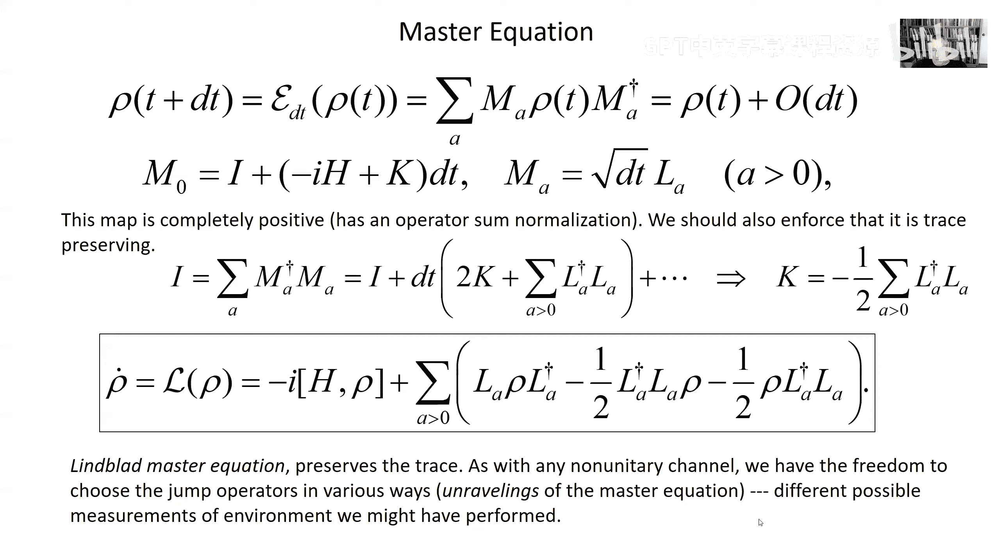

# 量子计算：第5讲：量子比特信道与开放系统

在本节课中，我们将深入学习开放量子系统的理论，特别是量子信道（也称为量子通道）的具体例子。我们将重点讨论几种作用于单个量子比特（qubit）的信道，包括去极化信道、退相位信道和振幅阻尼信道，并通过这些例子来加深对量子信道一般理论的理解。课程最后，我们将介绍描述开放系统马尔可夫演化的主方程。

---

## 去极化信道 🌀

上一节我们介绍了量子信道的一般概念和算子和表示。本节中，我们来看一个具体且对称的信道例子——作用于量子比特的**去极化信道**。

我们可以这样理解去极化信道：存在一个错误概率 \( p \)。以概率 \( 1-p \)，量子比特不发生任何变化。以概率 \( p \)，会发生三种可能的错误之一，每种错误对应一个泡利算符，且每种错误发生的概率均为 \( p/3 \)。

这三种错误是：
*   **X错误（比特翻转）**：将基态 |0⟩ 翻转为 |1⟩，反之亦然。
*   **Z错误（相位翻转）**：改变基态 |0⟩ 和 |1⟩ 的相对相位。
*   **Y错误**：可视为同时发生比特翻转和相位翻转，因为 \( Y = iXZ \)。

该信道的算子和表示可以用四个克劳斯算符来描述：
\[
\begin{aligned}
M_0 &= \sqrt{1-p} \, I \\
M_1 &= \sqrt{p/3} \, X \\
M_2 &= \sqrt{p/3} \, Y \\
M_3 &= \sqrt{p/3} \, Z
\end{aligned}
\]
信道作用于输入密度算符 \( \rho \) 的效果为：
\[
\mathcal{E}(\rho) = (1-p)\rho + \frac{p}{3}(X\rho X + Y\rho Y + Z\rho Z)
\]
可以验证，这些克劳斯算符满足保迹条件 \( \sum_i M_i^\dagger M_i = I \)。

利用信道-态对偶性，我们可以考虑信道作用在系统与参考系统最大纠缠态的一个子系统上。当总错误概率 \( p = 3/4 \) 时，输出态变为两量子比特的最大混合态 \( I/4 \)。这意味着，任何输入态（尤其是纯态）都会被映射到最大混合态 \( I/2 \)。此时信道被称为**完全去极化**。

在布洛赫球表示中，量子比特的密度算符可写为 \( \rho = \frac{1}{2}(I + \vec{p} \cdot \vec{\sigma}) \)，其中 \( \vec{p} \) 是极化矢量。去极化信道的作用是将极化矢量各向同性地缩放一个因子 \( (1 - 4p/3) \)：
\[
\vec{p} \ \rightarrow \ \vec{p}\,' = \left(1 - \frac{4p}{3}\right) \vec{p}
\]
这相当于布洛赫球均匀地“收缩”。值得注意的是，除了幺正映射，完全正映射一般不可逆。例如，试图通过放大极化矢量来逆转去极化效应，可能会得到非物理的（非正定的）密度算符。

---

## 退相位信道 ⏳

接下来，我们讨论另一个重要的量子比特信道——**退相位信道**。这个信道具有明显的基矢依赖性。

考虑一个简化的物理图像：一个尘埃颗粒处于两个空间位置的叠加态（|0⟩ 和 |1⟩）。环境中存在光子，当光子被尘埃散射时，散射后的光子状态取决于尘埃的位置。这种相互作用在系统（尘埃）和环境（光子）之间产生了纠缠。

通过对环境（光子）进行测量，我们可以得到描述系统演化的克劳斯算符。一个方便的表示包含三个算符：
\[
\begin{aligned}
M_0 &= \sqrt{1-p} \, I \\
M_1 &= \sqrt{p} \, |0\rangle\langle 0| \\
M_2 &= \sqrt{p} \, |1\rangle\langle 1|
\end{aligned}
\]
在此表示下，信道对密度算符 \( \rho \) 的作用是：对角元 \( \rho_{00}, \rho_{11} \) 保持不变，而非对角元（相干项） \( \rho_{01}, \rho_{10} \) 被乘以因子 \( (1-p) \)：
\[
\mathcal{E}(\rho) = \begin{pmatrix}
\rho_{00} & (1-p)\rho_{01} \\
(1-p)\rho_{10} & \rho_{11}
\end{pmatrix}
\]
我们可以将 \( p \) 解释为单位时间内发生退相位事件的概率 \( \gamma \Delta t \)。经过时间 \( t \) 和多次散射事件后，非对角元将呈指数衰减：
\[
\rho_{01}(t) = \rho_{01}(0) \, e^{-\gamma t}
\]
特征衰减时间 \( T_2 = 1/\gamma \) 被称为退相干时间。经过远长于 \( T_2 \) 的时间后，初始的相干叠加态会演化为一个经典混合态 \( \rho_{00}|0\rangle\langle 0| + \rho_{11}|1\rangle\langle 1| \)。

在布洛赫球图像中，退相位信道沿 Z 轴（能量本征态方向）的极化分量 \( p_z \) 保持不变，而 \( p_x \) 和 \( p_y \) 分量则以因子 \( (1-p) \) 衰减：
\[
(p_x, p_y, p_z) \ \rightarrow \ ((1-p)p_x, (1-p)p_y, p_z)
\]
这使得布洛赫球收缩成一个沿 Z 轴拉长的“橄榄球”形状。值得注意的是，布洛赫球不会收缩成一个位于赤道上的“薄饼”形状，因为那对应着非完全正的映射（如转置映射）。

---

## 振幅阻尼信道 📉

现在，我们来看最后一个例子——**振幅阻尼信道**，它模拟了量子系统能量耗散的过程，例如原子从激发态自发辐射跃迁到基态。

考虑一个两能级原子（基态 |0⟩，激发态 |1⟩）与电磁场真空态相互作用。在一段短时间 \( \Delta t \) 内，存在一个概率 \( p = \gamma \Delta t \) 使得原子从激发态跃迁到基态并发射一个光子。

该信道的两个克劳斯算符为：
\[
\begin{aligned}
M_0 &= |0\rangle\langle 0| + \sqrt{1-p} \, |1\rangle\langle 1| \\
M_1 &= \sqrt{p} \, |0\rangle\langle 1|
\end{aligned}
\]
信道作用为：
\[
\mathcal{E}(\rho) = M_0 \rho M_0^\dagger + M_1 \rho M_1^\dagger = \begin{pmatrix}
\rho_{00} + p\rho_{11} & \sqrt{1-p} \, \rho_{01} \\
\sqrt{1-p} \, \rho_{10} & (1-p)\rho_{11}
\end{pmatrix}
\]
激发态的概率 \( \rho_{11} \) 以因子 \( (1-p) \) 衰减，而非对角元以因子 \( \sqrt{1-p} \) 衰减。经过时间 \( t \) 后：
\[
\begin{aligned}
\rho_{11}(t) &= \rho_{11}(0) \, e^{-\gamma t} \\
\rho_{01}(t) &= \rho_{01}(0) \, e^{-\gamma t / 2}
\end{aligned}
\]
这里，激发态寿命 \( T_1 = 1/\gamma \)，而退相干时间 \( T_2 = 2T_1 \)。在这种情况下，退相干是由能量耗散（自发辐射）本身所限定的。

一个有趣的情形是，如果我们用探测器监测是否发射了光子（即测量环境）。如果探测到光子，我们就知道原子一定衰变到了基态。如果经过很长时间都未探测到光子，那么即使没有发生跃迁，我们对原子状态的描述也会更新——激发态的振幅会指数衰减到零，这相当于一个“无形”的测量，将原子投影到基态。

---

## 马尔可夫主方程 📈

在介绍了几个具体信道的例子后，我们回到一般性讨论：如何描述开放量子系统密度算符随时间的变化？当演化是**马尔可夫**的（即下一时刻的状态仅由当前时刻的状态决定，系统与环境没有持久关联）时，我们可以推导出一个微分方程——**林德布拉德主方程**。

考虑一个无穷小时间间隔 \( dt \) 内的演化，它可以由一个完全正映射描述。该映射的算子和表示包含一个主导项（近似幺正演化）和若干代表量子跳跃的项：
\[
\begin{aligned}
M_0 &= I - (iH + K)dt \\
M_a &= \sqrt{dt} \, L_a \quad (a \geq 1)
\end{aligned}
\]
其中 \( H \) 是哈密顿量，\( L_a \) 是跳跃算符。为保证映射保迹，\( K \) 必须满足 \( K = -\frac{1}{2} \sum_{a \geq 1} L_a^\dagger L_a \)。

由此推导出的密度算符随时间演化的主方程为：
\[
\frac{d\rho}{dt} = -i[H, \rho] + \sum_{a} \left( L_a \rho L_a^\dagger - \frac{1}{2} L_a^\dagger L_a \rho - \frac{1}{2} \rho L_a^\dagger L_a \right)
\]
这个方程是马尔可夫近似下开放系统动力学的一般形式。右边第一项是标准的刘维尔项，描述幺正演化；求和项代表耗散和退相干效应。不同的跳跃算符集合 \( \{L_a\} \) 对应于对环境监测方式的不同选择（即信道的不同克劳斯表示），这被称为主方程的不同“ unraveling ”。

---

## 总结

本节课中，我们一起学习了开放量子系统理论的具体应用。我们深入分析了三种重要的量子比特信道：
1.  **去极化信道**：对称地收缩布洛赫球，是所有方向平等的噪声模型。
2.  **退相位信道**：在特定基矢下破坏量子相干性，保持对角元不变，使非对角元指数衰减。
3.  **振幅阻尼信道**：模拟能量耗散过程，同时衰减激发态概率和非对角相干项。

最后，我们介绍了描述开放系统马尔可夫演化的林德布拉德主方程的一般形式。这些概念和工具对于理解和描述现实世界中不可避免受到环境影响的量子系统至关重要。从下一讲开始，我们将进入一个新的主题：量子纠缠的本质及其与经典关联的根本区别。