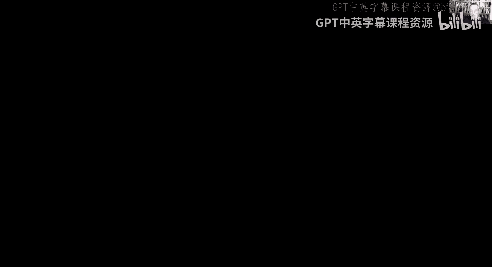
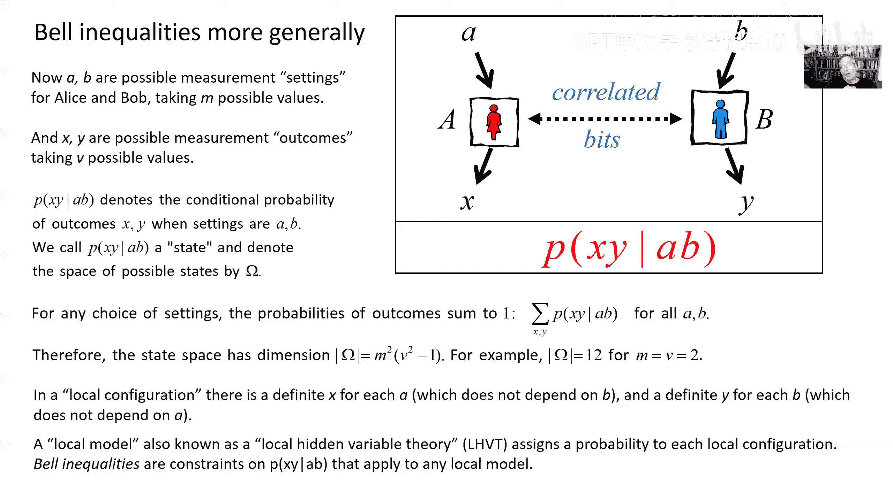

# 加州理工学院《量子计算｜Ph219⧸CS219 Quantum Computation Fall 2020》中英字幕 p07 -07-Ph CS 219A Lecture 6 Bell Inequalities.zh_en -BV1KgffBoEUc_p7-

Okay， let's go Wee back to physics， Comp Science。2，19， quantum computing。

I hope you're all in a quantum mood today。 I know I am。

Because this is going to be a pretty special lecture。In fact， if an hour from now。

 you're not feeling deeply disturbed and unsettled。

And feel like your grasp of reality has been forever altered。 Then I haven't done my job very well。

Because what we want to talk about now。Is。

What happened am I sharing， I hope so。系几岁啊。What we want to talk about today are Bell inequalities。

 a new topic for us。And it means we're going to explore more deeply。T in the previous lectures。

 what's so special about quantum entanglement， how quantum correlations are really fundamentally different from the classical correlations that we。

Normally encounter in everyday life。We're going to see that if two parties。

 perhaps in different laboratories or even in different cities。Share quantum entanglement。

 but are not able to communicate。 They can use that shared entanglement to perform certain tasks that would be impossible if they didn't share quantum entanglement。

 they can use quantum entanglement as a resource that enables them to do something。

That they couldn't do otherwise。And we all see that this discussion is going to clarify the claim that I've made several times。

That in quantum physics， we assign probabilities to the outcomes of measurements。

 not because we are ignorant of a deeper description of our physical system。

 but rather because the measurement process is intrinsically random。

 even if we have the most complete knowledge that nature will allow us to have of our physical system。

 we are still powerless to predict with certainty the outcome of a measurement that we're about to perform。

 So I think this lecture more than any other in this term should remind you of a statement that's attributed to Nlls Bor。

 anyone who is not shocked by quantum theory has not understood it。And to introduce our topic。

 I want to tell you about two friends of mine， both experimental physicists。Alice and Bob。

Now Aliceice and Bob are good experimentalists。They have conducted。

Quite a few experiments with a certain physical system they're really the world's expert on this system。

And let's say we're in Alice's lab， Alice has。Many copies of a system which。Consists of three coins。

Each one of these coins is either heads or tails。 There are two possibilities for each coin。

But the coins are covered up。Alice， though， has the technical skills to uncover one of these coins。

 It's up to her to choose which one it could be coin number one， coin number two or coin number 3。

 When she uncovers the coin of her choice， she will see whether that particular coin is heads or tails like this。

Now， in this case， Alice uncovered coin number one， and she saw that that coin is heads。

 But you notice that when she uncovered coin number one， the other two coins。

 Co 2 and Co 3 disappeared， and they are no longer accessible to Alice。

 She will never get an opportunity to see what would have happened if she had uncovered coin number two or coin number 3。

 She might have chosen to do so， but in this particular run of the experiment， She didn't。

 She chose to uncovered coin number one， and she was able to see that it was heads， and Cos 2 and 3。

 poof have disappeared forever， and Alice can never know what she might have found if she had uncovered Co 2 or Co 3 instead。

Is to make sure it's clear。Here， Alice conducts another run of the experiment。In this case。

 she chose to uncover coin number two， and she saw that that coin comes up。 Tas。

 Coins 1 and 3 disappeared， and she'll never know what she might have seen if she had uncovered coin number one。

Or coin number three， because she chose to uncover coin2 instead。Now。

 Bob has a similar setup in his lab。And they are at universities that are far apart from one another。

 Alice is a physicist right here at Caltech in Pasadena， California。

Bob's laboratory is located in Waterloo， Ontario， another capital of quantum science。

 and he can do similar experiments in his lab， where。

He gets many opportunities and many runs of his experiments。To take one of the sets of three coins。

 uncover one， see whether that one is heads or tails。

 but then forever lose access to the other two coins。Now。

 Alice and Bob have a collaborator who prepares systems for them to measure。

 The collaborator is named Donald。 He's located in Denver。

 and Donald never does experiments on these coin sets himself。

 He just does the preparation of the system that Alice and Bob then characterize in their experiments。

 But what Donald does is that millions and millions of times， he prepares pairs of coin sets。

 where in each pair， he sends one。Member of the pair， one set of three coins to Alice in Pasadena。

 and he sends the other set of three coins to Bob in Waterloo。

 And then Alice and Bob can carry out those experiments like the ones that I just described。

And after conducting many experiments， Alice and Bob discover certain things about these coin sets that Donald prepares and sends to Alice and Bob respectively。

For Alice。In Pasadena。Whenever she uncovers。Any one of the three coins， coin 1， coin 2 or coin 3。

 She finds that the probability that she sees heads is one half。

 and the probability that she sees tails is one half。

 She knows this with very high statistical confidence because she's done millions of experiments and nearly half of the runs have come up heads and nearly half of come up tails。

 And it's the same for Bob and Waterloo。 Every time Donald sends to him one of these coin sets。

 which is paired with one that Donald sends to Alice。

 Bob finds when he uncovers any one of the three coins。

 he can find either heads or tails with the two outcomes occurring。Equ probably。

 and he knows that with high statistical confidence because he's conducting millions of experiments。

But there's more that Alice and Bob have discovered about these paired sets of coins that Donald prepares and distributes to them。

Namely， if Alice and Bob both uncover the same coin， then they see that their outcomes。

 whether heads or tails， are correlated with one another。And， in fact。

If Alice and Bob uncover the same coin， they get the same outcome。They might find heads。

 or they might find tails。 But if they both uncover coin number one。

 say they're guaranteed to fine the same thing。 So in this particular run of the experiment。

 Donald prepared two of these sets of coins。Sent one said to Alice， sent one to Bob。

Alice and Bob both chose to uncover coin number one。They might have found tales， but in fact。

 in this room。They did found tails。 They did find tails， and they both found tails。

 And let's do it again to make it clear what the procedure is。

Donald prepares another paired set of coins， sends one set to Alice， one set goes to Bob。

 and in this case。They both chose to uncover coin number2， and they both found heads。 Now。

 we know they had a one half chance of finding heads and probability。

 one half chance of finding tails。 and this particular round Bob found heads and Alice。

 who uncovered the same coin as Bob。 They both uncovered coin number two， found the same thing。

 heads。And they've conducted millions of experiments like this。 And in every single trial。

 they found the same thing if they both uncover the same coin。Then they find the same result here。

 Let's do it again。 This time， Alice and Bob both uncovered coin number 3。 And in this run。

 they both found heads。Let's see， I think I'm going to do it one more time。Yep， this time。

 they both uncovered coin number two for one of these paired coin sets prepared by Donald and distributed Pasadena and Waterloo。

 And in this particular run， they both found tales。

 and we know it works this way every time we checked it millions and millions of times。

 and it never fails。Now， one day。Alice and Bob are chatting on the phone， as you can see。

 they do that a lot because they like to compare their experimental outcomes to see if their results are correlated。

And this particular day， Alice is in a reflective mood， and she says， you know， Bob。

 sometimes I just get so frustrated because I wish that just once， just once。

I could uncover two of my coins instead of just one and see the outcome for both of those coins。

 whether they're heads or tails。 But I've tried， and I tried， and I tried and it's just impossible。

 Whenever I uncover one of the coins， the other one poof disappears。

 and I never get a chance to uncover it。And see whether it's heads or tails。

 And it just makes me so mad。And then Bob says， wait， wait a minute， Alice。I've got an idea。

I think there is a way to find out what would happen if you uncovered two of your coins。

 And Alice says， but how I've tried and tried。 and Bob says， well， listen to me， Alice。

Let's say I uncover in my lab in Waterloo coin number two， and I find heads。

Now we know because we've checked it a million times that if you uncover coin number two in your lab。

 you're going to find the same thing that I did Alice said I know about that we've done that a million times。

Bob says， yeah， but wait a minute， wait a minute， what if this time。

 instead of uncovering coin number two， like I did， you uncover coin number one。

Then we'll know what you would have found if you had uncovered coin number two because it's going to be the same as one I found in Waterlo。

 but now you uncovered coin number one instead， so in effect。

 we know what would have happened if you had uncovered coin number two and what would have happened if you had uncovered coin number one。

And Alice。He's a little skeptical and she said， well， I'm not sure Bob。

 I don't really know because look， in this case。I didn't uncover coin number two。

 just coin number one and coin number two went poof。

So I won't really ever know what would have happened for that particular set of coins if I had uncovered coin number two instead because I uncovered coin number one。

And Bob said， oh， Alice， you're being so stubborn。 Look。

 you don't seriously think that something that I do here in Waterloo is going to have any effect on your coins in Pasadena。

That can't be what's happening。 It's just that we don't know at first what's underneath the covers。

 whether the coins are heads or tails。 But when I uncover coin number two in Waterloo。

 then we get some extra information about your coins in Pasadena and using that extra information we know we can make a prediction about what you'll find if you uncover coin number two。

 and we know that works because we've checked it millions of times。

 So you might as well just go ahead and uncover coin number one。

 and then we'll know the result of uncovering two of your three coins。And Alice says， well。

 I guess that sounds right， Bob， I guess that sounds right。 But maybe we should do an experiment。

 Why don't we do an experiment and see what happens when you uncover coin number two and I uncover coin number one。

 And Bob says， oh， I don't know， Alice， we've done so many millions of experiments with these coins already。

 I'm getting sick of it。 What's the point of doing another experiment。

 who's going to care if you and I uncover different coins。 What happens， I mean。

 nobody's going to be interested。 Nobody's going to fund us。 We won't be able to publish it。

And Alice says， well， you might be right。I heard about a theorist。

 Alice and Po are a little skeptical of theorists， but。And this theorist。

 his name is Bell and everyone says。That he's really smart， and he knows a lot about coins。

 He's been thinking very deeply about these coins， and he might have some ideas if he could make a prediction about what we'll find when we do the experiment。

 Well， that'll make it more interesting。 And then maybe we'll be able to get funding to do our experiment and publish the results。

 And Bob said， great idea。 Alice， it doesn't matter if his theory is dope。

 we can just do an experiment and show that he's wrong。 and that'll make a great paper。

 we can write together。 And so Alice and Bob decide。😊，To do the experiment。But first。

 they want to go and talk to Bell to find out what his prediction is， so they take a long trip。

 they have to go to Switzerland。And they find Bell there。 See this。

 I guess I forgot to say this is what they're going to do。 You see， Bob uncovers coin number two。

 and in this case， he found tails and then Alice can uncover coin number one and get heads。😊。

And I think maybe we're going to try it again， you see this time Bob was able to uncover coin number three and Alice uncovered coin number two。

 so in effect， they find out what happens if Alice had uncovered both Co2 and three in Pasadena。Okay。

So they go and find Bell。Across the ocean。And they tell Bell what they know about the coins。

 And Bell listens very attentively。And attentively。And he says， okay， okay， so I think I understand。

 I think what what I understand what Alice is saying。So she's saying that you know。

 because you've tested millions of times that if you both uncover the same coin。

 then you're going to find the same thing。And I guess it was actually Bob who made this suggestion and here he's giving the credit to At。

 but that's okay。And what he's saying is。That。Well， look， it can't be。

That anything I do in my lab in Waterloo is going to have any effect on Alice's lab in Pasadena。

 It's just that I'm getting some information about what will be found when Alice uncovers one of her coins in Pasadena。

 namely， if she uncovers the same coin， we know she'll get the same result。And， you know。

 Aliison Bob is that when we get this set of coins and they're all covered up。

It must be that each one of those coins， if I knew complete information about this set of coins。

 each one is definitely heads or definitely tails。And I just don't know which one yet。

And I'm gaining some information about that particular set of coins when I uncover one of them。

 And if Alice uncovers， say coin 1 and Bob uncovers Co 2。

 then I'm getting more information about that unknown set of coins that arrived in the lab。

 But really， it should be that。I can simultaneously assign some probability to what I would find if I uncovered coin1。

 coin 2 and Co 3， let's call those X Y and Z where x is either heads or tails。

 it's just that because of experimental technical limitations。

 I can't really uncover all three of the coins。I can really only uncover one， but with Bob's help。

 I can effectively uncover two， and so we can learn something about this probability distribution that governs the outcomes of uncovering each one of the three coins。

So we know there are eight possibilities， there are three coins and each one is either heads or tails。

And there's a probability assigned to each one of those possibilities。

 So for a particular set of coins， I can assign a probability to coin 1 being X coin 2 being Y and coin 3 being Z。

 whereas Z is either heads or tails。 And then when I sum over X， Y and z。

 those probabilities have to sum up to one， right， because in each。

Each particular instance of the set of coins。it's either x， Y or Z。

 and so when I sum up over all the possible values of x， Y， and z。

 that has to account for all the probability。And Alice and Bob are kind of getting bored。You know。

 they're and distracted because Bell is doing all the abstract math stuff。But then Bell says， well。

 look。I guess we can say this。What you can do， in effect， is uncover two of the coins。

 like Bob was saying he could uncover Co 2， and Alice could uncover Co 1。

 And it's just as though we were uncovering both Co 1 and Co 2 in Pasadena。 And I can ask。

 what's the probability that。Coin1 and coin 2， when uncovered have the same value。

 They're either both heads or they're both tails。And I can write that probability in terms of the probability of what I would find if I were able somehow to uncover all three coins。

And what I see is that the probability of getting the same outcome， either heads， heads or tails。

 tails for coins one and two is the sum of three。Or sorry， four of these eight probabilities。

Because they come out the same if the three coins have the values， heads heads， heads， heads， heads。

 tails， one and two are both heads in those two cases， or tails， tails， heads and tails， tails。

 tails， and in those two cases。1 and two are both tails。 And likewise。

 I can do the same thing for the probability that if I uncover corn 2 and corn 3。

 I see the same outcome。 There are four possibilities for which。

The outcome of uncovering Co 2 and Co 3 are both the same。The three coins could be headsheads。

 heads or tails， heads heads， coins 2 and three are both heads in that case， or could be heads tails。

 tails or tails tails tails。 since in those two cases， coins 2 and three are both tails。

And similarly， I could say the probability of getting the same outcome if I uncovered coins 1 and3 is the sum of the probabilities of heads heads heads。

 heads， tails， heads， Tas， head tails and tails， tails， tails。

 since for all those four configurations。 Cos 1 and three are both the same。

 They're either both heads are the both tails。And now Bob is getting really bored。 And he says， oh。

 come on。 What are you wasting our time for， Bell。 And Bell says， well， wait a minute。 Wait a minute。

 Bob， now let's notice something interesting。😊，And what Bell does。Is he says。

 let's suppose we sum up these three probabilities of getting the same outcome for coins1 and 2 or two and three or one and three。

 So I take the sum of these three expressions。 and then all eight of the configurations appear。

Heads heads， heads， heads heads， tails and so on。 And those eight have probabilities to sum that sum to one。

 But actually two of the configurations occur three times heads heads heads occurs in all three sums and tails。

 tails， Tas appears in all three sums。 So when we add them up。

 we get one because that's the sum of the probabilities of all eight configurations。

 plus two for the probability of headsheads heads。 and two for the probability of tails， tails， Tas。

 two times the probability of tails， tails Tas。 And one thing we know for sure is these probabilitybabilities don't just sum up to one。

 They're nonne numbers。 So this is one plus something non negative。

 And that's got to be greater than or equal to one。So that's my prediction。

 if you do your experiment。Millions of times you uncover two of the coins。

 You'll determine the probability of getting the same outcome for the pair of coins 1，2 or 2，3 or 1。

3。 And when you sum up all those probabilities， it's got to be greater than or equal to one。

And Bob says， well， okay， I guess the math works， but I just don't see how it works。

And everyone's silent for a while。 And then Alice says， you know， I think I see what it is， Bob。

Here's what Belle's saying。 He's saying that if they're three coins on the table and they're all uncovered。

 If you were able to uncover all three of them， then at least two of them would have to be the same。

 They can't all three be different because there are only two outcomes， heads， heads or tails， tails。

 So if you could uncover all three， then at least two。Would have to either be heads heads or tails。

 tails。 at least two would have to be the same。 And that's what Belle's inequality is saying。

 Isn't that right， Belle， She asked， And Belle seems a little startled。

 And he looks up for a while and thinks very deeply。 And finally， he says， yes。

So bells inequality is really pretty simple in this case。

 it's just capturing the idea that if we have three coins on the table and each one is either heads or tails。

 then at least two of them have to be the same， either heads， heads or tails， tails。

So now Alice and Bob are ready to do the experiment and they're very good experimentalist so it doesn't take them long to run millions of trials in which Bob uncovers one of the coins。

 Alice uncovers a different coin， they talk on the phone， they compare their results。

 they've been them， according to the cases where they're the same or different for each one of the ways of uncovering of pairs of coins and so they get with high statistical confidence。

 good estimates for the probability that one and two are the same。

 the probability the two and three are the same and the probability that one in three are the same。

Now， remember what Bellll's inequality said， it said that those three numbers。

 which have been accurately determined in this experiment by Alice and Bob have to have the property that when you add them all up。

 you get at least one and here's what they find。After doing the experiment millions and millions of times。

 they know with high accuracy that the probability of getting the same outcome。

 either headsheads or tails， Tas is about the same for all three possible choices of two out of the three coins。

 and it's always about one quarter。 So if you uncover  one and2。

 the probability that both outcomes are the same。 It's very close to a quarter。

 Sam thing if you uncover two and three， or if you uncover coins 1 and coin 3。And wait a minute。

If I'm doing the math， right？1 quarter plus one quarter plus 1 quarter is 34。

 and that is not greater than or equal to one。Alice and Bob are very good experimenters。

 but just to be sure they check everything in the lab。

 they do the experiment again and they get the same result。They found a result from their experiment。

 which does not agree with Bell's inequality。But Belle's reasoning seemed unassailable。

 who could disagree with any of the things that Bell said。 Where did Bell go wrong。Well。

 notice Bell assumed。That really there's a probability distribution that describes our ignorance about the actual state of the coins under those black covers。

That in each run， each coin really is either heads or tails and we don't know which run to run。

 and we get some partial information about that when Alice uncovers one of her coins and Bob uncovers one of his coins。

 a different choice than Alice made。He also assumed that there isn't any action at a distance between Pastna and Waterloo that what Bob decides to uncover in his lab doesn't have any effect on Alice's set of coins and Pasadena and vice versa。

 and those are really the only assumptions that he made。Seems pretty reasonable。

 but we seem to have learned an important lesson that somehow this thinking that we can assign。

A probability to all three outcomes that we can think。

Run by run of each one of the coins is definitely being heads or tails。

 at least with some probability， that kind of reasoning just doesn't work in this case。

We've learned that we have to be careful reasoning about counterfactuals about things that might have happened。

 but didn't actually happen。 Like when we say， O， I uncovered coin number one， and I found heads。

 Now， if I had uncovered coin number 2， I would have found heads or tails。

But I just don't know which。 And with Bob's help， Alice can find out whether it would have been heads or tails。

 even though she didn't really uncover coin number2。 That's the kind of reasoning that they used。

 But these experiments。Where you uncover coin1， Co 2， or Co 3。

And it's up to you to choose which of the three you uncover。 Those experiments are incompatible。

 as Alice and Bob found。 You can't uncover two of the coins。 You can always only uncover one。

 and then the other two disappear for sure。 And you'll never know what really would have happened if you had uncovered a different coin instead。

So we really shouldn't speak about what would have happened if we had uncovered coin number two when in fact we actually uncovered coin number one。

 now of this type of counterfactual reasoning， we use it all the time and it normally serves us well in everyday life。

 but at least for predicting the outcome of these quantum experiments in Alice and Bob's lab。

 it leads to results which are inconsistent with the experimental findings。

So this is another indicator that quantum randomness is not due to ignorance。

 it's not that each one of the coins， if I could uncover it would definitely be heads or definitely tails and I just don't know which yet。

 no the randomness of the quantum measurement procedure is deeper than that。

 even if we have the most complete description that is possible。

 then we still can't assign some deterministic outcome to the result of uncovering one of the coins。

The probability is really intrinsic， not resulting from ignorance。One thing I should remark on。

 lest there be any confusion about it， is that， as we discussed previously。

In the case of quantum entanglement， and as we'll see in a moment。

 it is quantum entanglement that underlies the experiment that Alice and Bob have just done。

The strange correlations between Allison coins and Bob's coins。

 although they violate Bell's inequality and therefore do not obey the assumptions that。

Bellews to derive his inequality， nevertheless。These correlations between Alice' coins and Bob's coins cannot be used for instantaneous communication between Pasadena and Waterloo。

 because no matter what Bob does in his lab， if he uncovers。Any one of the three coins。

When Alice uncovers her coin in Pasadena， she always finds either heads or tails equal probably has probably one half of finding heads。

 probably one half of finding tails and nothing that Bob did in Waterloo affects that after they've uncovered their coins they can talk on the phone and see how the results were correlated。

 But until they talk on the phone。 there isn't any information conveyed from Waterloo to Pasadena when Bob uncovers a coin in his lap。

Now， in fact， these。Results that Alice and Bob reported have been confirmed by other experimentalists。

Violations of Bellll's inequality are seen in a number of experimental settings。

I'll come back and say a little bit more about that later in the lecture。

 but by now we found that beinalities are violated in experiments conducted where qubits are encoded in the number of different physical ways carried by photons。

 by atoms， by spins of electrons， by superconducting circuits。And for a long time。

 there was controversy。For some decades， actually， there was controversy about whether these experiments demonstrating violations of the Bell inequality were really completely convincing。

 but most doubts about that have been resolved quite recently in experiments which have only been done within the last five years。

Now。Let's try to understand what's really going on here。Up till now， we haven't asked。

 what is Donald doing in Denver and what exactly is he sending to Alice and P。

I'm ready to reveal that now， and so we can check that the results that Alice and Bob found in their experiment actually do agree with predictions from quantum theory。

So here's what was happening。Donald makes entangled pairs of cubits in Denver。

 And he sends one member of that pair of cubits to Pasadena， where Alice measures it。

 and one member of that pair of cubits to Bob in Waterloo， where Bob measures it。

What do the three coins correspond to， Well， for Alice or Bob， when Alice A receives a qubit。

 she can choose to measure any one of three possible observables。

 Those observables have two possible eigenvalues。 So the measurement is a binary measurement that is。

There are two possible outcomes。And I called those two possible outcomes heads and tails。

 I could have called them zero and one， one and minus one， whatever。There are two possible outcomes。

 but there are three possible measurements that Alice could make。

 And once she makes one of those measurements， you see these three observables that Alice potentially can measure。

 don't commute with one another。 And that means by measuring one of the observables in effect。

 uncovering coin number one， Alice disturbs the other observables that she might have measured。

 And so after measuring observable one。She'll never know what she might have found if she had measured observable 2 or observable 3 instead。

 And the same thing is going on in Bob's lab。There are three possible observables he might measure。

 They are non commuting on the qubit that he receives。

 so he can really only perform one of those measurements。 And after doing so。

 he'll never know for sure what he might have found if he had measured one of the other two observables instead。

So the heads and tails represented the two possible outcomes of this two outcome measurement。In fact。

 I'm going to suppose that the observables measured by Alice and Bob are the。Measuring a spin。

 measuring a polyopator along one of the axes in the Bphere。

 where the outcomes are either plus one or minus one， or in other words。

 the observable that measured is measured by Alice。

I'll express in the form sigma to A hat Sigma is the three poly matrices。

Sigma 1 Sigma 2 Sigma 3 a is a unit3 vector and similar for Bob。

 his observable is specified by a unit3 vector B hat， he's measuring sigma。

 B hat and you'll recall that these observables do have the property of having two eigenvalues plus one and minus1 those are the two possible outcomes that All and Bob find when they make their measurement。

Now， the state that Donald prepared and then distributed to Alice and Bob is the state I callsi minus。

 and this state has an interesting property。Namely。

 if you consider any one of the three poly matrices， Sigma 1， Sigma 2 or Sigma 3。

That Sigma1 acting on Alice's qubit， for example， Sigma 1 plus Sigma 1 acting on Bob's qubit。

 the result when acting on this state is always zero and the same thing is true for Sigma 2 and Sigma 3 Sigma 2 Alice plus Sigma 2 Bob is equal to0 Sigma 3 Alice plus Sigma 3 Bob is equal to zero as well Now。

 if you know the theory of addition of angular momentum， this won't surprise you。

It's really just the statement that if you think of the two qubits as being spin one half representations of the rotation group。

 the state I call si minus is a spin zero state invariant under rotations and the generator of rotations is just the sum of。

Sigma， acting on。Alice is Cupid plus Sigma acting on Bob'squbit。For components  one， two， and 3。

 so the statesi minus being a spin zero state is equivalent to what I said here。And this identity。

 which you can easily check directly just by doing a little matrix arithmetic。Um。Tells us。

The following thing that if I have， let's say， one of Bob's observables Sigma dot B hat acting on the state sign minus。

 I can take that sigma acting on Bob's qubit and move it over to Alice's qubit and pick up a minus sign in the process。

 So the identity for Alice tensored with。Sigma dot B for Bob acting on Psi minus。

 that's the same thing as minus sigma dot。B， acting on Alice' qubit tenses her identity。

 acting on Bob's qubit。So now if I consider。Alice is observable sigma dot a tensored with Bob's observable sigma dot B。

Acting on psi minus， well， using this observation， I can take that sigma dot B acting on Bob's qubit and move it over to Alice's qubit。

 So this is equivalent to minus sigma dot a sigma dot B acting on Alice' qubit tensored identity acting on Bob's qubit。

 So let's say I want to know the expectation value in this state si minus that Donald likes to prepare。

Of this product of observables， this tensor product of Alice's observable Sigma dot A with Bob's observable Sigma dot B。

 Well， I can use what I derived here to move that sigma dot B over to Alice's side。

 So now I had the identity acting on Bob's cubit。😊，So I might as well just trace out Bob'squbit。

And say that this expectation value is the expectation value of Alice's observable sigma dot a times sigma dot B。

Except for a minus sign in the density operator for Alice。

 which is the reduced density operator when I trace Bob in the state s minus。

Well we've done that calculation before or you can do it quickly in your head。

 the density operator when we trace out Alice in this maximally entangled state is maximally mixed is's just one half times the identity so in order to evaluate this trace I can replace Alice's density operator row by minus one half times the identity so now I have minus1 half times the trace of the product sigma dot a times sigma dot B or let's write it that out in terms of its components I'm summing here over repeated indices without explicitly indicating the summation symbol so I have AI sigma I Bj sigma J summed over I and j the repeated indices take the trace of that the A's and b's are just numbers so I can take that out of the trace the trace of sigma I sigma J well I think we。

Discussed previously that when you compute that， you find that it's zero， when I is not equal to J。

 when I is equal to j， then sigma squared is just the identity， so the trace is2。

 and so I get two deelta I J2 when I is equal to J0 when I is not equal to J。And so again。

 taking that sum over I and J， this is just the same thing the two cancels the one half。

 I still have the minus sign as the dot product of unit vector a and unit vector B。

 or minus the cosine of theta where theta is the angle between those two unit vectors A and B。

 so we found that that is the expectation value in the state si minus that Bob prepares of this product of observable sigma dot a for Alice。

 sigma dot B for Bob。Now， let's come back to the question when Alice and Bob measured their observables。

 do they get the same result or different results？When they get the same result。

 that means remember the eigenvalues are plus one or minus one for both Alice is observable and bo's observable same result means they both get plus one or they both get minus1 and in those cases。

 the product of the eigenvalue found by Alice and the one found by Bob is one。

It's either one times1 or minus1 times minus1。When the outcomes are different。

 that means one of them gets the eigenvalue  one and the other gets the eigenvalue minus1。

 and so the product of the two is minus1。So。I take the expectation value in the state si minus of。

The product of Alice is observable and bo's observable。

 we just computed that that's minus cosine theta where theta is the angle between the two unit vectors。

 A and B。And let's write that in terms of the probability that they get the same result and the probability that they get different results。

Well。It's the probability that they get the same result， and in that case the product is plus one。

So it's p same times plus one， and then plus the probability that they get different results。

 and in that case the product is minus one so that becomes plus minus1 times p difference。

Now the probability that they're the same plus the probability that they're different is equal to one。

So I can write minus P differ different， minus the probability that the outcomes are different。

As one minus the probability that they're the same and so this becomes。

Two times the probability of the outcomes are the same minus1。And then taking the minus one。

And putting it over on the other side here， I've concluded that the probability in this state si minus that when Alice and Bob make their measurements。

 they get the same outcome is one half。Times1 minus cosine theta。

 where theta is the angle between a measurement axis， a hat and bo's measurement axis B hat。Okay。😊。

Now， what was going on when All and Bob phoned that when they uncover the same coin。

 they always get the same result， P same should be equal to one in that case。Well。

 that's the case in which cosine theta is minus1， then we get p same equals1。

 so when they were uncovering the same coin， what was happening was that Alice and Bob were measuring along opposite axes so in the case of Alice measuring observable defined by unit vector a1 Bob was measuring along an axis which was opposite B1 and in the case where Alice was measuring a long direction。

A2， Bob was measuring B2， which was the opposite direction on the B sphere。

 and when Alice was measuring the A3 direction for her qubit。

 Bob was measuring the opposite direction B3。In fact， in this experiment。

 there are three outcomes corresponded to axes a1， a2， a3， which are。

Symsymmetrically distributed around the circle。 So the angle between Alice's。

Directions a1 and a2 is 120 degrees same for the angle between a1 and a3 or a2 and a3 and likewise for Bob the。

An between Alice's measurement directions B1 and B2 is 120 degrees。

 or his directions B2 and B3 or B1 and B3。But as we can see。😊。

Let's suppose that Alice uncovers coin number one。 So that means she's measuring the observable sigma dot a1。

 and let's say Bob uncovers a different coin。 That means he's either measuring along axis B2 or axis B3 both axis B2 and axis B3 make an angle theta of 60 degrees with respect to Alice's measurement axis。

 So that's the case in which cosine theta is equal to1 half and the probability of getting the same outcome becomes1 half times1 minus1 half1 quarter and that's what Alice and Bob found in the experiment and likewise for any choice in which Alice and Bob uncover different coins the angle is going to be 60 degrees So if Alice measures along axis A2 and Bob doesn't measure along axis B2 he's measuring either the B3 axis or the B1 axis both making an angle。

Equals 60 degrees with a2 or if Alice uncovers coin 3。

 she's measuring along the axis A3 and that makes a angle 60 degrees with the two possible axes that Bob might have chosen which were different from B3 namely B1 and B2 so whenever Alice and Bob are measuring different choices uncovering different coins。

 the probability they get the same result is a quarter and when they uncover the same coin in which case they're measuring along opposite axes they get the same result with probability one。

 that's exactly what Alice and Bob found in their millions of experimental trials。

So Bell was wrong in making his predictions because he incorrectly assumed that he could assign probabilities to the outcomes of measurements that were never performed。

Now， I really like that version of the Bell inequality。

 which I just presented with Alice and Bob having three possible observables they could measure。

Corresponding to three possible coins they could uncover， just because it seems so visceral。

 the idea that when you uncover three coins on the table that at least two of them have to be the same seems so unquestionable that it really hits home that the quantum experiment doesn't agree with that expectation。

But the most studied of the Bell inequalities is in a way， a simpler one because in this case。

 Alice and Bob are just choosing between two possible observables they could measure。

Which I'm now going to for the moment， denote by A and A prime for Alice and B and B prime for Bob。

And so we're imagining a world， we don't know exactly what's going on here， but Alice and Bob。

 each have laboratories， Alice has a device。On which she can push a button， one button is labeled A。

 the other is labeled a prime， she can't push both buttons， she has to push one or the other。

 and each time she pushes a button the display in her laboratory indicates either plus one or minus one。

 one of two possible outcomes for the observable she chose to measure by pushing the button either the button A or the button A prime and it's the same for Bob。

Bob pushes either button B or button B prime and then his display in his laboratory shows either plus one or minus one。

There are two possible outcomes for his measurement。

 and we're going to suppose that Alice and Bob have some correlated bits。That they might have。

Had distributed to them before the experiment was done， which they can make use of in the experiment。

But we're going to also suppose that the probabilities that they assign to their outcomes。

Arise because of ignorance of a more complete description。

 That's the setting in which we can derive bellinequalities。

 And we want to see what we can say about this case。

 So we have observables where the outcomes take values plus1 or -1。

 There are two possible choices for Alice， A and A prime， two possible choices for Bob B And B prime。

ok。And now I want to consider a particular combination of Alice's observables and Bob's observables。

 namely this one， which I called C， which is the sum of a plus a prime。

Times B plus a minus a prime times b prime。 So what I want you to imagine is that if we had the complete description。

shot by shot in each run of the experiment， then we would assign a value to a。

 which is definitely plus one or definitely minus one and the same thing for a prime。

And on Bob's side。In each one of the experiment， there's some initially not known。

 but definite value assigned to Bob's observable B。

 either plus or minus1 and to Bob's observable B prime either plus or minus1。

 So let's consider any one of those configurations。

 and I'm going to use here A and A prime now to indicate that number plus1 or minus1。

 which is the outcome of measuring a or a prime on analysis side and likewise B and B prime take the value plus1 or minus1。

 those are the values of Bob's measurement outcomes when he measures observable B or B prime Now we just notice the following thing about this quantity C。

Well， it could be that A and A prime are the same that for the two observables that Alice might have measured。

 A& A prime， they're either both plus one or both minus one。嗯。And in that case。

 the sum a plus a prime is going to have to either be plus2 or minus2。

 It's either one plus1 or minus1。Plus minus1。And but then B is either plus one or。-1 as well。

 So if a equals B， a minus a prime is 0。 So here we have a plus a prime and then B is either plus or minus1。

 So no matter what the assignments are to A， A prime B and B prime， if a is equal to a prime。

 then C has to be either plus2 or -2， right。Well， the other possibility is that A and A prime are assigned different values。

 different outcomes， if one is plus one， the other one is minus one。But then the sum of the two。

 a plus a prime is equal to 0。 So this term is 0。 and a minus a prime is either going to be plus 2 or-2。

 I multiply that by B prime， which is plus or -1。 That means in that case， the quantity C is， again。

 either plus 2 or -2。 So for each one of those configurations in which a， A prime and B。

 B prime are fixed to be either plus1 or -1， C is equal to either plus 2 or -2。

 So now let's suppose there's some joint probability distribution that governs all those possible configurations assigning plus1 or -1 to each of A。

 A prime B and B prime。And then。If I consider the expectation value of the。

Take the absolute value in fact， of the expectation value of c as determined by that probability distribution well the C can take either positive or negative value。

 so one thing we know for sure is that the absolute value of the expectation。

Is going to be less than or equal to the expectation of the absolute value。

But the absolute value is always two， so no matter what the probability distribution is。

 the expectation of the absolute value is  two。So now let me just expand out the expectation value of C here and take its absolute value。

 so it's four terms， it's the expectation value of a times B， a prime times B。

 a times b prime and then with a minus sign expectation value of a prime times B prime。

That linear combination of these four expectation values for product of。

One of Alice's observable and one of Bobs， according to the inequality that we just arrived here。

Its absolute value has to be less than or equal to two。That's it， that's our inequality。It's。

 if you like in the same spirit as the inequalities that Bell derod。

 it was first arrived by Claerhororn Shimonian Alt and in their honor is called the CHSH inequality that was in 1969。

 Bell's original work was in 1964。Klausser incidentally had been a Caltech undergraduate of physics major。

 got his degree in 64， so this was five years later。

When he led this group that derived the so called CHSH inequality。

 and Kuser right away was quite interested in testing it experimentally and a few years later did announce the results of an experiment to test whether the CHSH equality is really experimentally true in quantum experiments or not。

I'm going to have to take a quick break here， I'm sorry。So I am going to。

Stop sharing and pause for a moment， and I'll be right back。Okay， we're back。And I'm sharing again。

Well， I just derived for you the CHSH inequality。Here it is again。

 Alice and Bob choose to measure either one of two observables for which the outcomes are either plus one or minus1 Alice can measure A or A prime Bob can measure B or B prime the expectation values of the products of Alice and Bob observables obey this inequality。

 absolute value of expectation value of AB plus expectation value of a prime B plus expectation value of A B prime minus expectation value of a prime B prime。

 absolute value of that whole thing is less than or equal to two that is the CHSH inequality。Now。

Let's consider an experiment again， using the shared entangled state sine minus the same state that we considered a moment ago in the earlier。

Bell inequality experiment so now。Alice and Bob are permitted to share not just correlated bits。

 but quantum entangle entanglement， and they can perform。Quantum measurements on their systems。

Each of which is a qubit， half of the entangled state， si minus。 and as we just computed。

 the expectation value in that entangled state of the product of a's observable Sigma dot a。

 which has eigenvalues plus or minus-1 and bo's sigma dot B， which has eigenvalues plus or minus-1。

 is minus A hat dot B hat or minus the cosine of the angle between Alice's measurement axis and bo's measurement axis。

 Now， I'm going to choose the measurement aes to B as shown over here。Where when Alice。

Is measuring observable A， she's measuring sigma out a with a， let's say， oriented。

Vertically upward when she measures a prime， she's measuring along the axis， which is horizontal so。

In effect， she's measuring the。Sigma Z or sigma X for her qubit。

 but Bob's measurement axes are rotated，45 degrees compared to a。 So this is Bob's B axis。

 this is Bob's B prime axis。 And you see I've also chosen the axes。

 So that the angle between A and B is 45 degrees。 The angle between a prime and B is 45 degrees。

 The angle between A and B prime is 45 degrees， but the angle between a prime and B prime is 135 degrees。

So the cosines of these angles are always going to be one over the square root of  two or minus one over the square root of  two。

And in fact， the absolute value of C in this case is going to be the absolute value of well in the three cases。

 remember we have this minus sign， but in the three cases where the angle of theta is 45 degrees cosine theta is equal to one over the square root of2。

 so I get minus3 times1 over the square root of 2 in the case where we're looking at the expectation value of a prime times b prime now the cosine is equal to minus1 over the square root of three。

That cancels this minus sign， but we also have a minus sign here in the CHSH inequality。

 so that becomes another minus one over the square root of two。

So I add it all up and I got four over the square root of two for the absolute value or in other words。

 two square root two。That's an actual quantum experiment that in principle we could carry out。

 and indeed it has been done in many experimental laboratories， and sure enough。

2 square root of2 is greater than two， so that violates the CH， SH inequality。As a matter of fact。

 the violation that we just found were the expectation value of the quantity C。

In absolute value is equal to two root two， that's the maximal violation of the CHSH inequality that we can obtain from quantum observables which have eigenvalues plus one and minus1 that's all I'll have to assume in the derivation I'm about to show you let's now consider A A prime and B and B prime to B observables with the property that the square set observable is equal to the identity So a squared a prime squared B squared and B prime squared all are equal to the identity A and a prime in other words。

 must have eigenvalues theyre hermeian operators must have eigenvalues which are plus one or minus1。

AN A Prime are observables acting on Alice's system。

Bn B prime are observables acting on Bob's system and because those are separate systems。

Those commute with one another。An observable acting on Alice's part of an entangled state always commutes with an observable acting on Bob's part。

So now let's look at C again。And let's。Think of it now as an operator because AA Prime B and B prime are now to be thought of as her missionian observables for Alice's and Bob system respectively。

So C remember is the quantity now in regard as an operator， a plus a prime。

Times b plus a minus a prime times B prime。That C， I want to square it for reasons which will become apparent。

 So let's take the square of C。And then expand it out。So when I square this first term。

 I get a plus a prime squared B squared is equal to1， and of course。

 B commutes with A and a prime so that first term。When I expand the squares。

 just a plus a prime squared。Likewise， I can square a minus a prime。

That gives me a minus a prime squared and B prime squared commutes with a and a prime。

 and it's equal to1。 So squaring the second term just gives me a minus a prime。 implicitly， I mean。

 you know， tensored with the identity acting on Bob system。 But there are also cross terms。

 So there will be a cross term。 and let's be careful about operator ordering here because remember。

 A doesn't necessarily commute with a prime and B doesn't necessarily commute with B prime。Well。

 there are two cross terms and one of them we have the factor on the left is a plus a prime times B。

 The factor on the right is a minus a prime times B prime。 Of course， the A' is commute with the B。

 So I can write that as a plus a prime times a minus a prime on Alice's side。

And B times B prime on Bobs side。 And in the other cross term。

 I have a minus a prime times b prime on the left a plus a prime times B on the right。

 So remember the a's commute with the B。 So that's a minus a prime。

Times a plus a prime analysis side， B prime times B on Bob's side。

Now let's look at these first two terms。Remember， a squared is the identity。

 A prime squared is the identity。 So I get four times the identity。

 and then I got these cross terms A， A prime plus a prime a here。

 and then minus A A prime minus a prime a here and those cancel。

So the sum of this term in this term is just four times the identity。

And now let's expand out what's multiplying BB prime here。Well， I'm going to get a。Remember。

 a squared is equal to the identity。A prime times a prime is equal to the identity。

 but it comes with a minus sign。 So that's identity， minus identity， those cancel。

 And then in addition， I'm going to have a prime times a。

Plus a times a prime so that's what I have here a oh wait a minute， sorry minus。

A times a primen a times minus a primen。 So that gives me a primen times a minus a a primen。

Times BB prime from this term， and likewise here。When I。Multiply these out。

 I got a squared which is identity minus a prime squared and minus identity that cancels。

And then in addition， I have the cross terms， a times a prime minus a prime times a all acting on analysis system while B prime B X on BobB system。

So notice a prime a minus a a prime that's just the same as what I have here except for a minus sign furthermore。

 that's a commutator of two operators。Whi isn't so essential to note for what I'm about to do。

 but I'll point it out anyway， this is the commutator of a prime with A if you don't know what that means。

 it's just that's just the definition of this notation。

Brackt a prime comm A means a prime a minus Aa prime。And so I have minus that quantity here。

 so I actually have the commutator of a prime with a multiplied by B b prime minus b prime b。

 in other words， times the commutator of B with B prime。

Now I want to remind you something about norms， I'm going to consider the operator norm or soup norm。

Of an operator， that is defined as the maximum value over all possible state vectors in the case of the operator a of the square root。

Of the expectation value of AI joint A in the state side。So in particular， if a is hermeian。

 that's just the same thing as the absolute value of the largest eigenvalue or。

The largest absolute value of an eigenvalue of the Hermeian operator A。

And there are some properties of this norm which you can easily verify。

 one is that it really is a norm， it obeys a triangle inequality。

 so the norm of a plus b is less than or equal to the norm of a plus the norm of B。

 it's also submplicative， so if I take the norm of a product a times B。

 that's less than or equal to the product of norms norm of a times norm of B when I take the norm of a commutator well I can bound that by in the case of the commutator of a with B。

By the norm of a times the norm of B plus the norm of B times the norm of a or in other words。

 twice the product of the norm of a with the norm of B。

 And so now let's come back here we can make a statement about the norm of C squared。 actually。

 the norm of the operator C squared because C is hermeian is the same thing as the square of the norm of C。

 That's just because C is hermeian and the norm just means the largest。

Absolute value of an eigenvalue。And so what can we say about the norm of C squared， well。

 we can use our expression here。And。Bounded by the normal4I times the norm of this product of commutators。

 but A and A prime both have norm one， right， because the Hermeian operators with eigenvalues plus one and minus1。

So the norm of four times the identity is just four。

The norm of the product of commutators is just bounded by two times 2 or4 so what I get is the norm of c squared is less than or equal to8 and then if I take the square root of that it means that the absolute value of the norm of c is less than or equal to2 square root of 2 So for any choice of quantum observables with eigenvalues plus1 and minus1 for the quantity C we can't get an expectation value in any state。

Which is larger than。Two or two and in fact two row two is just what we got for this particular choice of the measurement axes A a prime B and B prime acting on qubits in a two qubit entangled state okay。

 so that's the maximal chHSH inequality realized very simply。The maximum violation， I should say。

 realize very simply with a pair of qubits and simple single qubit measurements。

So now let me come back and say a little bit more about the experiments that have been done and like I said。

 Kuser。Was the first to do a fairly convincing demonstration。Of violationols of the CHSH inequality。

 he was the C of the CHSH inequality， they did that experiment in '72。

But there were concerns about so called loopholes in the early experiments in particular。

Two loopholes that experimentalists wanted to close。

One is the so called detection efficiency loophole Now the early experiments were done with photons and photon detectors。

 particularly back in the early days a few decades ago。We're not perfectly efficient。

 so you could make an entangled pair of photons in a state like si minus that part was good。

And you can measure the polarization of the photon along some chosen axis。

But the photo detector that detected the photon after it went through the polarization analyzer didn't always fire。

 even if a photon actually entered the photo detector。

 the photo detector might not click and might not notice the photon。And that raised the possibility。

 the at least mathematical possibility that when you do the experiment。

 Alice and Bob are not getting a fair sample of all the entangled pairs。

 it could be that there's some kind of correlation between whether the measurement outcome is plus one or minus1 and whether the photon detector fails to fire or not。

And that's the socal detection efficiency loophole and I'll give you a homework problem in which you can work out how high the efficiency has to be to close this loophole and see that you really are violating the assumptions underlying the CHSH inequality。

In the experiment。Another concern was the so called causality loophole。That is。One could worry that。

Alice's measurement and Bob's measurements are not exactly simultaneous。

 So perhaps Alice does her measurement first。 And by the time Bob does his measurement。

 there has been time for a light signal to travel from Alice's apparatus to Bobs。

 So it might be that that information about what Alice chose to measure A or A prime is actually made use of by Bob system when it decides what the outcome should be when B or B prime are measured。

 And in that case， the CHSH inequality doesn't hold。

 So a lot of effort went into doing experiments to close this causality loophole。

 The first convincing experiment of that type。😊，Was done by Olena Spy in the early 1980s。

 He did an experiment in which Alice's detector and Bob's detector were about 12 m apart。

 which corresponded to about 40 nanoseconds in light travel time。 and in the experiment。

 there was a switch that could flip to send a photon when it arrived in the detector to either one of two polarization analyzers。

 So the polarization of the photon。Would be measured along either one of two possible axes。

 And that switching was very fast compared to that light travel time of 40 nanoseconds。

 So it was possible to at least argue that the choice of whether to measure A or A prime and the choice of whether to measure B or B prime。

 that was being made on the fly after the entangled pair was created And with Alice and Bob making choices on which observable to measure。

 which were space like separated from one another。 So there was no possibility of a signal limited to light speed traveling from Alice's lab to Bob or Bob's lab to Alice's。

In the case where the experiments were not perfectly simultaneous。Now。

There were a number of experiments that close the detection efficiency loophole and a number that closed the causality loophole。

 but until recently no experiments that simultaneously closed both of them。For example。

 there were early experiments with ion traps。Where the qubits were atoms in either one of two states。

Or the detection efficiency is extremely close to one。

But the two entangledqubits were two ion sitting in a trap， which were just tens of microns apart。

And so。It wasn't possible to do the measurements of the internal state of the atom。

Fast enough on compared to the time scale for a light signal to travel。From one ion to the other。

 actually tens of microns is an exaggeration， just a few microns。But starting in 2015。

 so-called loophole free experiments were done in a variety of systems。

 the first one was done actually with electron spins which could be measured with high efficiency in the experiment they were over a kilometer apart and somewhat later experiments were done with atoms where entangled pairs of atoms。

 roughly a kilometer apart， were prepared and then the atoms could be measured with high efficiency。

 without any worry that a light signal could travel from the detector for Alice's atom and the detector for bos。

Now there's a third loophole that is sometimes spoken of。

 sometimes called the free will or super deterterminism loophole。

It's conceivable that there are hidden variables that if we had the most complete description of our physical system that we have to include the observers。

 Alice and Bob in that physical system as well， and there's a correlation between what Alice and Bob choose to measure and the outcomes that they find。

 in other words， it might be that when you have a complete description that determines not only what the outcomes of the measurements are。

 but what Alice and Bob choose to measure and the CHSH inequality does not apply in that situation。

It's called the so called Free will loophole because it's as though Alice and Bob do not have the freedom to decide what measurements they're going to make。

Well that's not a loophole we can close， I mean that's not really something that we can rule out in an experiment if what we're trying to rule out is that we ourselves do not have the freedom to choose what we measure in an experiment so philosophically maybe that doesn't worry you because if it's true then we have to reconsider many of the laws of nature that have been discovered in experiments if there's some kind of conspiracy between what we choose to measure and the underlying state of the physical system that's going to be a hard thing for us to discover。

There have been attempts to address this， for example， there was an experiment a few years ago。

In which Bell inequality violation was seen， CHSH inequality violation was seen。

In an experiment in which Alice's choice of observable and Bob's choice of observable were conducted by monitoring the fluctuations in brightness of two different stars。

 stars in different directions on the sky， So Alice was looking off this way at a star hundreds of light years away。

 and Bob was looking in the opposite direction of a star hundreds of light years away。

 and based on the fluctuations in brightness of the starlight they decided to measure A and A prime in Alice's case or B and B prime in Bob's case。

 So if superdeterminism is the source of C H S H。Inequality violation that we would have to believe that the conspiracy extends to astronomical distances with those two stars on knowing exactly what to tell All and Bob to measure so that they'll see CHSH inequality of violation。

Now there's another way of looking at the CHSH inequality， which is good to know。

We can regard it as a kind of gain。That's played by two players。 All and Bob are the players。

 It's a cooperative game， meaning that Alice and Bob are on the same side。

 They're trying to help one another win。And the way the game is played is All and Bob both receive bits inputs。

Here I'm denoting them by A and B， you can think of A and B now as being bits taking values either zero or one and by some means or other。

Alice and Bob， when they receive their inputs are to produce outputs。

 we consider the output that Alice produces to be X。

 the output that Bob produces is supposed to be Y and under the rules of the game。

 Alice and Bob are not allowed to communicate between when Alice and Bob received their inputs and when they produce their outputs they are allowed to make use of correlated pairs of bits that might have been distributed to Alice and Bob before the game began。

And their objective， in order to win the game together。

 they want to produce outputs that are correlated in a way which depends on the inputs that they received。

 And in particular， here's what it takes to win the game。 You win if。

The Xor of Alice's and Bob's outputs is equal to the and of their inputs。 So what does that mean。

 It means that。If。The inputs to Alice and Bob are any one of 0，0，01 or 10。

 the three cases in which the and is zero。Then x and y should be the same bit。

 so it should either be 0，0 or 1，1， but in the case where the inputs are one for a and1 for B when the and is one。

 then x and y should be opposite bits in order to win the game okay。

So in order to relate this to what we just discussed instead of thinking of the outputs as bits。

 let's just consider minus1 to a power which is a bit。 So remember the x is either zero or one。

So minus1 to the x is plus or minus1， it's equal to1 if x is 0 and minus1， if x is 1。

 likewise is minus1 to the y is plus or minus11 if y is 0 minus1 if y is 1 and let meote by x sub0。

 the output that l is produces if the input that she receives is a equals 0。

And Xome1 is the output that Alice produces If her input is a equals  one and likewise， for Bob。

And let me call P of A and B。The probability that Alice and Bob win the game when they receive the inputs A for Alice and B for Bob。

So now let's suppose I consider the expectation value。

 so Alice and Bob have some way of playing this game。

 which is described by some conditional probability of producing the outputs X and Y。

 given the inputs A and B。Um。And so I call P of a comma B。

 the probability that they win for the inputs A and B。

So I can say that this way then let's consider the expectation value。

Governed by that probability distribution of the product of minus1 to the x0 times minus1 to the y0。

Okay well we want that to have the value plus one if they win when the inputs are 0， zero。

 because when A and B are both zero， then we want x and y to be the same。So。

I can write this expectation value as its value when they win。

 namely plus  one times the probability that they win， namely p of 0，0。

 And then I can write plus its value when they don't win。

 which is -1 times the probability that they don't win， which is 1 the probability that they win。

 So the expectation value of -1 to the x 0-1 to the y 0。

 I can write as twice the probability of winning-1。And by just the same reasoning。

The expectation value， I guess I lost one of my brackets here on the expectation value。 Sorry。

 I'll fix that later。 The expectation value of -1 to the x here or -1 to the y 1。

 that's twice the probability of winning for。Input0 and1 minus1 expectation value of minus1 to the x1 minus1 to the y0。

Is twice the probability of winning when the inputs are 10 minus-1 Now the expectation value of minus1 to the x1 times minus1 to the y1 now for them to win。

 we want that to be minus1 instead of plus one right because this is the case where the inputs are both one and then we want x and y to actually have opposite values。

 So to win， this is minus1。 And so this becomes minus1 times the probability of winning a plus oh1 minus the probability of winning。

Times plus one， so it gets flipped it's minus the probability of winning for inputs 11 plus one。

And now。What does the CHSH inequality tell us about this case well it told us about you know the expectation values of products of observables that take the values plus1 and minus1。

 which is what I've got here now， so what I call the expectation value of AB before now becomes2 p00 minus1。

And similarly， for what I called before， the expectation value of。A， B prime and B prime A。

 I got two times probability of winning for input 01 minus1 plus2 times the probability。

Of winning for input 1，0 minus1。 And then remember。

 we had minus the expectation value of a prime B prime the way we had written the CHSH inequality previously。

 so that minus sign flips this to become twice the probability of winning when the inputs are one comma 1。

us1。 So put together those four terms， and I got twice times this probability of winning for the four possible inputs。

P 0，0 plus p 01 plus p1，0 plus p11-4 because there was a -1 in all three cases。

 And what the CHSH inequality says is that that's less than or equal to 2。And so just putting the。

The four。Over on the other side。 So this becomes 6 dividing by 2。And then dividing by four。

It becomes one quarter。Probability p00 plus p01 plus p10 plus p11 is less than or equal to 6 over8 or3 over quarter。

So what's this saying， it's saying， suppose we average uniformly over the inputs that Alice and Bob could receive。

Let's say the four possibilities inputs 0，0，0，1，1，0， and 1，1。 Suppose they're all equally probable。

So if I average over that。Distribution on the possible inputs。

 The probability of winning is just this expression。

 one quarter times probability of winning for input 0，0，0，1，1，0 and 1，1。

 And it says that's less or equal to  three quarters。

 So it says for any strategy that you can play what I'll call a classical strategy where Alice and Bob are using shared。

Randomness， they could have correlated bits， but they don't have entanglement。

 so the CHSH inequality derivation applies to this situation。For any strategy。

 if we average uniformly over the possible inputs， they can't win with a success probability better than three/ quarters。

And incidentally it's very easy to achieve three quarters， they could always just output zero。

And then they'll be right for three of the possible inputs and only wrong when the inputs are a equals one and b equals one。

 so three out of four cases， they win for sure， one case they lose for sure and that gives them that probability of three quarters averaged over the possible inputs。

But that's actually the best you can do， that's the best strategy。But quantum strategies are better。

 If Alice and Bob share entanglement instead of correlated bits。

 and they choose their outputs by measuring their qubits。Then they can win with higher probability。

 Then if we put in the numbers we had for the。I guess I forgot to say it's called the Cyilcin inequality。

That bound on the violation of the CHSH inequality， called the Cyilin inequality。

 It's saturated by that two or two。 So if I play the game， according to that。Oh。

Maximal violation of CHSH。Then the derivation is the same。

 except instead of having two on the right hand side here， I have less than or equal to two root2。

That's the silcin inequality。And then again， I put the four over on the other side。

 I divide by eight， and that tells me that the probability of winning averaged uniformly over the four possible inputs is one/ eighth of four plus two root two。

 and instead of being one half plus one quarter， what we had before， three quarters。

 it will now be one half plus one over two root two， which is better。It's about 0。853。

 so for the best possible classical strategy， we win with success probability 0。75。

 but for quantum strategies we can win with a higher probability， about 0。853 better than 85%。

By using the entanglement， we were able to do something we just could not have done without entanglement to win this game with a higher probability of success than would have been possible if All and Bob shared only classical correlations instead of quantum entanglement。

😊，All right。 Just one more thing before we wind up for the day。

So I've talked about some specific examples。Of bein inequalities。

But what I want to do next time in which I'll just set up now to conclude this lecture is talk about be inequalities in a more general setting。

 Now it's not always pedagogically an effective way to communicate ideas to talk about very general settings。

 I often find it easier to understand things when I hear about examples instead。

 but in this particular case。Bellinequalities， I think it is helpful to think about beinequalities in a more general setting。

 I think that gives us a deeper grasp of what beinequalities are all about。

 So that's the next thing I want to discuss。 Now I want to consider a game or if you like a situation similar to the one we just described。

😊，Where。Alice and Bob receive inputs A and B， but now they're not necessarily binary inputs。

 in other words a is a variable which doesn't have to take only two values。

 it can take some finite number of values， let's say M possible values for A and M possible values for B。

And Alice and Bob are to produce outputs， X and Y， these are if you like the outcomes of their measurements。

But they're not necessarily binary measurements to outcome measurements。

 X and Y can take some larger but finite number of possible values I'll call V。

 the number of possible outcomes for a measurement。

 remember M is the number of possible settings or measurements that we can choose to perform。

And then what I want to consider。Is a quantity， which I'll call。P of X， Y， given A， B。

 It's the probability that Alice outputs X and Bob outputs Y when the settings。

The inputs that Alice and Bob received are A for Alice and B for Bob。

And I'm going to just as a language， speak of this conditional probability， P of X。

 Y given a B as a state for our two party system。And I'll use capital omega to denote the space of all possible states。

 all possible conditional probability distributions。Of this time。

And one thing we know is that they are probabilities。 They are。For each X， Y。

 A and B on negative numbers and probability sum up to one。For each choice of the settings。

 for each input A and B， when I sum over all X Y， all possible outcomes with fixed AB。

 those probabilities have to sum to1， I forgot to write equals one here。

 but I' meant to say that sum is equal to one。So that tells us what the dimension is of the state space remember there are M choices for A and M choices for B。

 I could have had the number of choices for A and D be different。

 but here they're the same they're both M so they're M squared possible choices for this pair of variables A and B。

I remember the outcomes take b possible value， so they're altogether v squared possible values for x and y。

 but there's the constraint that for each a and B， the probability sum up to1。

 so we actually have v squared minus1。Independent。Parameterters characterizing the probability distribution for each fixed A and B。

So the number of real parameters that I need to describe the state is the number of possible settings m squared times the number of possible outcomes v squared minus1 so for example。

 in just about the simplest setting。Where there are two possible measurements。

 two possible inputs for Alice and for Bob and two possible outcomes。

 that's just what we described in the CHSH case。 So M is equal to 2 and V is equal to 2。

 And so M squared B squared minus-1 is 4 times 3， which is 12 in that case are。

State space has dimension 12， it's already a pretty big space。

Now I'm going to consider local configurations。Which is a way of describing。

Situations in which the we have complete knowledge， so for you know given A and B。

 we know for sure what the outcome X will be for Alice and what the outcome Y will be for Bob。嗯。

And then a general probability distribution is going to be some convex combination of those extremeal distributions。

But I also want to make a locality assumption， no communication between Alice and Baum and the way that works。

Is that in these local configurations， for each A， there's a definite outcome X。

And it doesn't depend on what Bob chooses to measure be。And for each B， there's a definite outcome y。

 and that doesn't depend on what Alice decides to measure A。So it's a configuration。

 meaning the outcomes are deterministic and it's local in the sense that what Alice finds as her outcome。

Depends on her setting， but not on Bob's setting。And a so called local model。

 which is also called a local hidden variable theory or LHVT。

 is just an assignment of a probability to each of the local configurations。

And Bellll inequalities are all about constraints on these probability distributions that are applicable to any local model。

And what I want to do next time is speak more about this general way of looking at be inequalities and then come back to the CHSH inequality and so we can see how it fits into that more general discussion and that will help us to understand the general discussion better and might also help us to understand better what the CHSH inequality is all about。

So that we will be doing next time。And so that gives you something to look forward to。

And I hope everything's going well with you and that you're enjoying the course。

 and I'll see you again real soon。Bye bye， be well。

