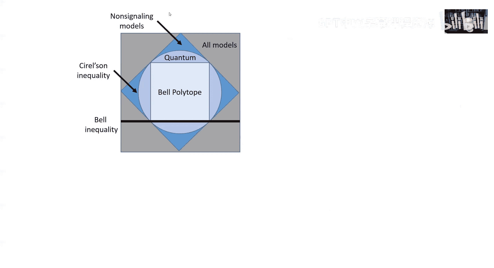

# 量子计算：第7讲：贝尔多胞体与量子关联 🔬

在本节课中，我们将继续探索量子纠缠的奇妙世界，这是量子计算的核心要素。我们将从更一般的视角重新审视贝尔不等式，特别是CHSH不等式，并理解经典模型与量子模型在关联性上的根本区别。我们将学习如何用几何方法（多胞体）来描述和区分经典关联与量子关联。

---

上一节我们介绍了CHSH不等式，它揭示了经典关联的局限性。本节中，我们将在一个更广泛的框架下重新审视贝尔不等式，通过几何视角来理解经典关联、量子关联以及无信号关联之间的关系。

## 一般化设定与局部模型

我们考虑一个比CHSH更一般的场景。有两个参与方（Alice和Bob）。Alice收到一个输入 \( a \)，有 \( M \) 种可能取值。Bob收到一个输入 \( b \)，同样有 \( M \) 种可能取值。收到输入后，他们分别产生输出 \( x \) 和 \( y \)，各有 \( V \) 种可能结果。

整个系统可以由一组条件概率 \( P(x, y | a, b) \) 来描述。这些概率函数构成了一个“状态空间”。对于固定的 \( a \) 和 \( b \)，概率之和为1，因此状态空间的实维度为 \( M^2 (V^2 - 1) \)。在CHSH例子中（\( M=2, V=2 \)），维度为12。

我们引入“局部性”概念。一个**局部确定性构型**是指：对于Alice的每一个可能输入 \( a \)，都有一个确定的输出 \( x \)，且该输出**不依赖于**Bob的输入 \( b \)。Bob的情况同理。这意味着，如果系统是完全确定的（即“隐变量”完全已知），那么Alice和Bob的行为是独立且确定的。

一个**局部模型**（或局部隐变量理论）则是这些局部确定性构型的凸组合（即赋予每个构型一个非负的概率权重，权重之和为1）。所有可能的局部模型构成了状态空间中的一个凸集，我们称之为**经典区域**或**贝尔多胞体**。

## 贝尔多胞体与其对偶（极集）

经典区域是一个**多胞体**，即由有限个顶点（局部确定性构型）构成的凸包。例如，一个八面体就是一个多胞体。

描述一个多胞体有两种等价方式：
1.  **顶点描述**：给出所有顶点，然后取它们的凸包。
2.  **面描述**：给出所有界定该多胞体的超平面（即“面”），点位于所有超平面的“正确一侧”当且仅当它在多胞体内部。

**贝尔不等式**就对应于这些界定经典区域的超平面。如果一个概率分布 \( P(x, y | a, b) \) 违反了任何一个贝尔不等式，那么它一定**不属于**经典区域，即无法用任何局部模型来解释。

与多胞体（经典区域）紧密相关的是其**极集**。极集中的每个向量 \( \beta \) 定义了一个超平面和一个不等式 \( \beta \cdot P \leq 1 \)。极集的**极值点**正好对应那些“紧贴”经典区域表面的超平面，即非平凡的贝尔不等式。

## 回到CHSH：关联子空间

在CHSH设定中（Alice和Bob各有两个输入和两个输出），完整的状态空间是12维的。但我们可以只关注四个关键的关联量（期望值）：
\[
\langle AB \rangle, \langle AB' \rangle, \langle A'B \rangle, \langle A'B' \rangle
\]
这定义了一个4维的“关联子空间”。在局部确定性构型中，每个变量 \( A, A', B, B' \) 取值 ±1，因此每个关联量也取值 ±1，并且它们的乘积为1（具有偶宇称）。这导致了8个极值点（例如 (+,+,+,+), (+,+,-,-) 等）。

通过计算这个4维关联多胞体的极集，我们可以找到所有界定它的超平面（贝尔不等式）。以下是结果：

*   **平凡不等式（8个）**：每个关联量自身介于 -1 和 1 之间。
    \[
    -1 \leq \langle AB \rangle \leq 1, \quad -1 \leq \langle AB' \rangle \leq 1, \quad \text{等等。}
    \]
*   **非平凡不等式（8个）**：即CHSH型不等式及其变体。例如：
    \[
    \langle AB \rangle + \langle AB' \rangle + \langle A'B \rangle - \langle A'B' \rangle \leq 2
    \]
    其他不等式可通过交换变量（\(A \leftrightarrow A'\)， \(B \leftrightarrow B'\)）或改变符号得到。

**关键结论**：在CHSH设定中，这组CHSH型不等式构成了一个**完备集**。如果一个概率分布满足所有这些不等式，那么它一定位于经典区域内（即可用局部模型描述）。反之，违反其中任何一个，则必然是非经典的。

## 量子区域与无信号区域

现在考虑**量子模型**。Alice和Bob共享一个量子态 \( \rho_{AB} \)（可能是纠缠态）。对于每个输入 \( a \)，Alice进行一个POVM测量 \(\{E_{x|a}\}\)；对于每个输入 \( b \)，Bob进行一个POVM测量 \(\{F_{y|b}\}\)。他们的联合概率为：
\[
P(x, y | a, b) = \text{Tr}(\rho_{AB} \cdot (E_{x|a} \otimes F_{y|b}))
\]

所有量子模型构成的集合称为**量子区域** \( Q \)。它具有以下性质：
*   \( C \subset Q \)：经典区域是量子区域的子集。任何经典关联都可以用量子态和测量实现。
*   \( Q \) 是凸集，但**不是**多胞体（它有无限多个极值点）。
*   量子关联遵守**无信号条件**：Alice的结果分布不依赖于Bob的输入选择，反之亦然。这是因为对Bob的结果求和后，得到的是Alice的局部测量结果，与Bob的测量选择无关。
    \[
    \sum_y P(x, y | a, b) = \text{Tr}_A(E_{x|a} \rho_A) \quad \text{(与 } b \text{ 无关)}
    \]

所有满足无信号条件的概率分布构成**无信号区域** \( NS \)。显然，\( Q \subset NS \)。重要的是，\( NS \) 严格大于 \( Q \)，并且 \( NS \) 本身也是一个多胞体。

**示例**：存在一种无信号策略，可以在CHSH游戏中以概率1获胜（对于任何输入组合）。然而，根据Cirel‘son不等式，量子策略的最大获胜概率约为0.853。因此，这个完美获胜的无信号策略无法用量子力学实现，它位于 \( NS \) 内但在 \( Q \) 外。

## 关键要点总结

以下是关于量子模型和贝尔不等式的一些关键事实：

*   **纠缠的必要性**：如果Alice和Bob共享的量子态是可分离态（非纠缠态），则产生的关联必定属于经典区域 \( C \)，无法违反任何贝尔不等式。
*   **非对易测量的必要性**：为了违反贝尔不等式，参与方必须在**非对易**的测量之间进行选择。在CHSH例子中，Alice和Bob的测量方向在布洛赫球上是不共线的。
*   **多体推广**：可以将上述框架推广到多于两方的系统，但状态空间维度和局部构型数量会急剧增长，使得寻找完备的贝尔不等式集合在计算上非常困难。

---

本节课中，我们一起学习了用几何语言（多胞体）来理解贝尔不等式。我们看到了经典关联区域如何被描述为一个凸多胞体，其面由贝尔不等式定义。量子关联区域则更大，包含了经典区域，但又被无信号区域所包含。违反贝尔不等式是量子纠缠与非对易测量共同作用的鲜明特征，也是量子信息处理能力超越经典极限的根源之一。下一讲，我们将开始探讨如何利用量子纠缠实现诸如量子隐形传态等奇妙任务。