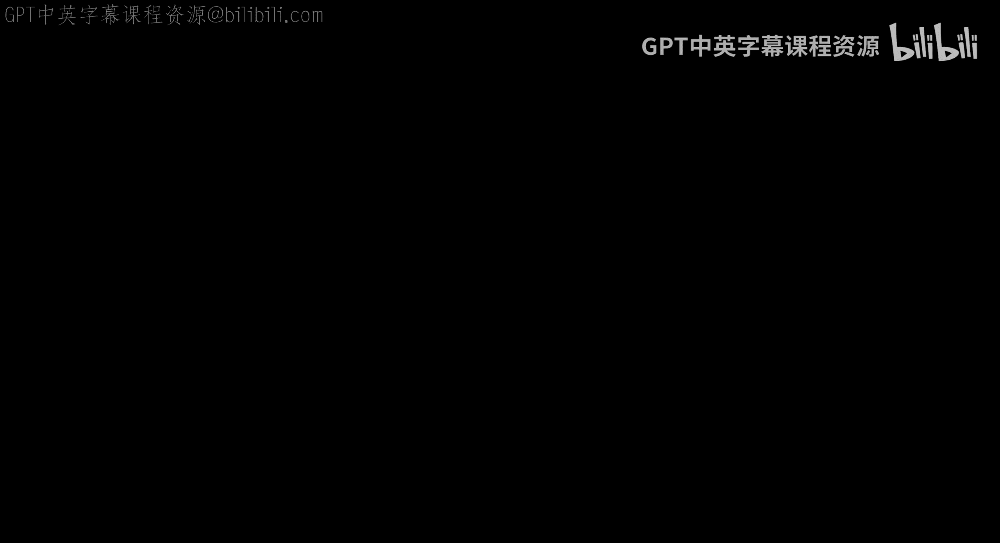
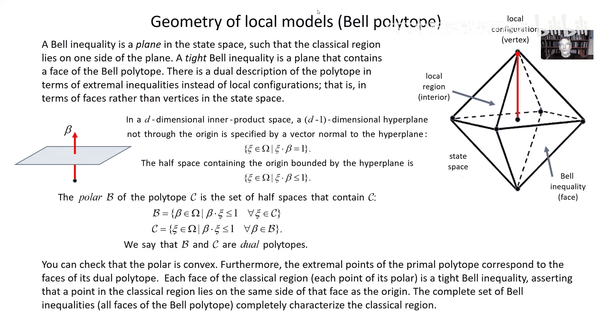

# 加州理工学院《量子计算｜Ph219⧸CS219 Quantum Computation Fall 2020》中英字幕 p09 -09-Ph CS 219A Lecture 7B Bell Polytope.zh_en -BV1KgffBoEUc_p9-

Hi， I'm back again briefly just a quick addendum to lecture seven， I not quite sure why。

 but I realize。That I skipped over half of one of the slides， slide 5。

 So I just wanted to run through that quickly。 and I also wanted to。Correct。

 incorrect statement I made。In the lecture。收啦。😔，Sre。Yeah。

 I was somewhere in the middle of this slide slide5。 and then I skipped to the next slide。

 I think it was。My fingers got itchy and I clicked too soon or something I just wanted to go over the material that's on the bottom half of this slide。

So， its。How to border。Not the way I intended to present it， but。

Maybe some of what comes later will make a little bit more sense if I go over this。

 I just wanted to explain a little bit more explicitly。The idea of a local configuration。嗯。

And here I wrote down a formula for it。So if there's a local configuration。

That means that for each one of Alice's input， there's one。

Particular output that occurs with probability 1， the rest occur with probability zero。Similarly。For。

Bobside。For each input， there's one particular output。

 So I wrote that this way for a local configuration。

P of x Y given a B is a product of delta functions that is at zero unless x is equal to some particular value of x。

 which I denoted x sub a， that's the。Value that's deterministically fixed by Alice's input a。

And it's also zero unless y is equal to y sub B， that's the output for Bob。

That's deterministically fixed by Bob's input。B， so it's equal to one for。One particular。um。Output。

 given A input。And for one particular。Output on Bob's side， given Bob's input。

 it's zero for everything else。That's what a local configuration is。

 and I just wanted to comment on how many of them there are， there are a lot of them。嗯。So remember。

 we have。V possible outcomes for each one of El's Se and the possible outcomes for each one of Bob settingstting。

So altogether together there are M possible settings for AliceLIS and M possible settings for Bob。

 so the possible ways of choosing Alice's outputs deterministically is there are V possibilities for altogether M inputs。

 so that's V to the M possibilities for AliceIS and then another V to the M possibilities for Bob。

 so altogether V to the twoM possible local configurations。

Now I wanted to make the distinction between a local configuration and a nonlocal configuration。

 if it's a nonlocal， that means that although when I speak up a configuration。

 I mean that the outputs of deterministic now Alice's output can depend on Bob's input。

 so the way I would write a general nonlocal configuration。

Is the probability of outputs X Y given inputs Ab。Is a product of Dlta functions for now。

Now a particular value of x is fixed by the pair of inputs A and B。

 so I wrote that as delta of x comma x subab B， so this particular value of x depends on both A and B and given those inputs A and B on analysis and Bob size that particular value of x occurs with probability one and likewise for those particular inputs A and B on analysis and Bobb size。

 there's one particular output so it's deter deterministic but non localal。

What Alice outputs can depend on Bob's input and what Bob outputs can depend on Alice's input。

 so now there are a lot more configurations that they're allowed to be non local。

Because now they're all together。M squared input values for which Alice。Produces an output。

Because her output can depend on a configuration on both A and B。So that means on analysis side。

 we have V possible outputs for each of m squared inputs because that output in the nonlocal configuration can depend on A and B。

 so altogether V to the m squared and the same thing on bo side。

 so the number of configurations if they're allowed to be nonlocal。Is v to the 2 m squared。

So just as an example， in the case where they're just。

Two settings for Alice and two for Bob and just two outcomes for Alice and two for Bob。

 I already pointed out that the because probability sum to one。

 we know the state space has dimension 12， the number of local configurations。Is going to be。

V to the two1， so that's two to the four。16 local configurations。

 but the number of non local configurations will now be V to the2 m square。 So that's 2 to the 8。

256 non local configurations。 a lot more non local configurations than local ones。

 And so if I consider all the complex。Sorry， not complex， convex， although they are rather complex。

If I consider all the convex combinations of the non local configurations， that's a much more。

Complicated， many faceted polytope than if only local。Configurations are allowed。

And the error that I wanted to point out， which was both on the slide and I think in what I said。

Was when I was defining what is meant by the polar。

I said that the polar of a polytope is this set of extreme half spaces that contain the polytope。

 but it should have just been the set of half spaces and then from among all the elements of the polar we're going to pick out the extremeal elements which will correspond to the faces of the polytope and that's what will define the bell andequalities so I'm sorry I didn't say that at the proper time in the lecture but I wanted to to throw it in so it wouldn't be completely missed。

And that's it， that's all I wanted to add， and I'll see you next time。

 Thank you for coming back for part B of this lecture。

See you later。