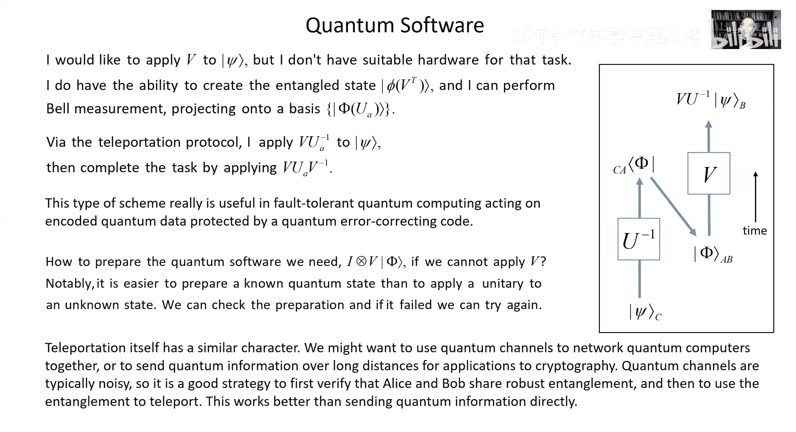

# 加州理工学院《量子计算｜Ph219⧸CS219 Quantum Computation Fall 2020》中英字幕 p10 -10-Ph CS 219A Lecture 8 Teleportation.zh_en -BV1KgffBoEUc_p10-

Hello， welcome back， Quantum friendsend。To physics， computer Science， 219 A。

We're going to have more fun with quantum entanglement today。And then finally。

 we'll be able to start talking about computation。 That will be the goal for the next lecture。

 But I do want to say a little bit more about。Quantum entanglement before we move on。

And in particular， this will be some further discussion about the things you can do with quantum entanglement。

 We've learned something about that already because we've discussed how。

With quantum entanglement shared between two or more parties。

You can win a game with a higher success probability than you could if you didn't have entanglement shared by the parties。

 that's what vin equality violation is all about。Which experiments have verified。

Today I want to talk about two related tasks， superdense coding and quantum teleportation。

Quantum teleportation is a useful。Protocol， it's used as a subrtine and a number of tasks that we need to perform。

In quantum systems， in quantum networks， and it's also kind of cool and fun to talk about and think about。

Superdense coding is very closely related， as we'll see。So that's some。Talk about。Communication。

Using a quantum channel， but where the goal is to communicate classically just to send bits。

 it's kind of a waste， really， because with a quantum channel。

You'd think we'd have more interesting things to do。

But let's suppose the only channel we have around is quantum channel， we can use it to send qubits。

And let's suppose it's a noiseless quantum channel。 That's the best kind。

 That means you can send quantum information over the channel with perfect fidelity。

So let's say Alice and Bob are connected by such a channel。

 What it means is that Alice can prepare any quantum state of her choice for her system。

 let's say it's a qubit， any state of the qubit that she pleases。

 She can send it over the channel to Bob and Bob can do whatever he wants to do with it。

 he can measure it or store it in his quantum memory or whatever， but。

Saying it's noiseless means that the state that Bob receives is exactly what Alice sent just as though she had prepared a for him right in his own laboratory。

Now。What we'd like to do or what we'd like to talk about for the moment is sending a bit or many bids。

Using the Quantum channel that's connecting Alice and Bob。Well， you can do that。To send a bit。

 you have to choose one of well， you have to choose a pair of perfectly distinguishable quantum states。

 mutually orthogonal states， and Alice can prepare。One of those basis states or the other。

 And send to Bob and Bob。By prearrange with Alice knows to measure in the proper basis to distinguish the states perfectly。

 so they agree。If Alice is sending qubits to Bob， then Alice will always use the standard basis states。

 the computational basis state zero or1。And Bob knows how to make a measurement that perfectly distinguishes between the state0 and1。

Every time Alice wants to send a bit to Bob， she prepares one of those two basis states。

Sends it through the channel and then Bob measures it and a bit is indeed conveyed from Alice to Bob that way。

Now， let's say Alice can use the channel many times。She can send all together Nqubits。

She could certainly convey n bits to Bob that way by sending the bits one at a time。

 the way I just described。A natural question is can she do better than that。

 I it possible with N uses of the channel for Alice to send more than n bits to Bob it turns out the answer is no I'm not going to prove that for you here today there is。

A proof and discussion in one of the later chapters of our lecture notes。

 but we're not going to be covering that this term。

 but there is a theorem called hilebos theorem and。

It has the consequence that we can't send more than。

N bits of classical information when we send Nqubits， and that's not such an obvious fact。

Because if you think about。Sending some alphabet of quantum states。

 which Bob then tries to distinguish or tries to get some information from Alice doesn't have to do what I say。

What I just described send one of two mutually orthogonal states。

 she can try something trickier she could choose from an alphabet of many states for a single qubit after all。

 she can prepare and send。Any pure state on the on the surface of the B sphere。

 couldn't she so she could choose from among a billion different signal states that you might。

Send to Bob， the trouble is that Bob won't have a very easy time distinguishing all those states。

And the content of Halaboos theorem is that。Because it's so hard to distinguish。Accurately。

 non orthogonal states sending that much larger alphabet doesn't really do any good。

 it doesn't help doesn't help Alice send more bits of information now another tricky thing that Alice could try to do is prepare an entangled state of many qubits and then send all of those qubits through the channel one at a time now she's using entanglement across multiple uses of the channel which sounds like a good strategy。

But as long as they don't have any shared entanglement to begin with， this theorem says that again。

 the best they can do when Alice sends Nqubits to Bob。

Is Bob receives and classical bits of information if indeed the goal is。

To send classical information。But now that's suppose we change the rules a little bit。

We'd like to know how empowering is entanglement shared by Aliison Bob in particular。

For the task of classical communication。 So we'll imagine now that Alice and Bob。

Have had the foresight to prepare some entangled pairs of qubits。

 which they have at the ready or when they need them。And now。The question is。

 can they use that entanglement to communicate more efficiently？

Let's say that they've had that entanglement in the bank for a long time。

 knowing they might use it someday， the quantum channel。

 although it's noiseless or maybe because it's noiseless。

 it's extremely expensive to use it costs a million dollars every time you want。

To send aqubit from Alice to Bob。And now it so happens that today。

 Alice desperately needs to send two bits of classical information to Bob。His life is at stake。

But she can only afford， she only has a million dollars。

 so she can only afford to use the quantum channel once。But fortunately。

 they did put some entanglement in the bank some time ago anticipating that they might need it someday。

 so how is it they're going to make use of that entanglement to communicate more efficiently。Well。

We notice the following thing。Let's say that Alice and Bob have。Some time ago。

 prepared a shared maximally entangled state of two qubits， one qubit analysis possession。

 one qubit in Bob's possession， let's say the state5 plus。

 which is just the uniform superposition of zero for Alice， zero for Bob and one for Alice。

 one for Bob。And we notice that if Alice alone with no help from Bob。Applies。呃。

Possible unitary transformations。To her half of that entangled state。

 she can change the entangled state shared by All and Bob。Specifically。

 she could apply one of the poly operatorsators， either the identity or the polyopator X or the polyopator Y or the polyopator Z。

 or what happens to that shared entangled state when she does those things。

 Well polyoperator x that's just a bit flip， it changes Alice is0 to1 and 1 to0。

 So acting on this state5 plus。0，0 plus 1，1 would become 1，0 plus0，1。If she applies why then。

Up to a phase vector v， it performs that bit flip。Changing1 to0 and0 to1。

 but also with a relative sign， it actually is going to change up to a phase0 to1 and 1 to minus0。

 So when y is applied by Alice to herqubit and the entangled pair， the state5 plus。

Becomes 10 minus01。And if she could。Instead apply the poly operatorator Z。

 which changes the relative phase of the basis state0 and one。So when Alice applies Z to her qubit。

If the initial state is 5 plus， it becomes0 oh， there's a nasty typo that should be 0，0 minus01。No。

 it shouldn't， it should be 0，0 minus11。Well， I'll have to fix that later。But anyway。

 let's notice that the four possible states that can be obtained in this way are mutually orthogonal states。

 I've given them names， phi plus， psi plus psi minus and phi minus。

They can be perfectly distinguished， it's easy to if that is if you have access to both of the qubits。

 if you have both qubits in your lab， these guys are mutually orthogonal。

 it's obvious that the states phi plus and phi minus are both orthogonal to pi plus and psi minus。

 they have different pary， the phi plus and phi minus we weren't for this typo。

Both have the property that if you take the。The or or you take the x or of the two bits。

 you always get0， it's either 00 or11 you can certainly distinguish that from odd parity when it's 10 or 01。

 but also because of these relative phases the two states with even parity are perfectly distinguishable00 plus11 and00 minus11 or orthogonal and likewise10 plus 01。

10 minus 01 are mutually orthogonal so。An orthogonal measurement can distinguish these four possibilities perfectly now that we can distinguish four possibilities perfectly for。

To qubits is not a surprise that's true of the standard basis too right we could chose we could have chosen basis state zero00110 and11 and those are perfectly distinguishable as well。

But what's special about these four is that they are all quote unquote bell states。

 They are all maximally entangled states of our pair of qubits。

 So if you have both qubits in the lab， you can do a so called bell measurement。

Projecting onto this bell basis。Of phi plus pi plus psi minus and phi minus and distinguish them perfectly。

Now we can think about it this way if。I prepareify plus and Alice comes into the room and she promises me that she's going to apply one of。

Identity X， Y or Z to。One of the qubits and she doesn't tell me which one。

When I come back into the room， I can do this bell measurement and I can distinguish those four possibilities。

 those four possible operations that Alice could have applied perfectly。Okay。

 so now we can see what to do。Remember， Alice and Bob Shaify plus there in different cities。

Alice is in Pasadena。Bob is in Waterloo when we last checked his whereabouts。

And but Alice can apply one of identity X， Y， or Z that。

Changes their shared entangled state to one of these four mutually orthogonal possibilities。

 then she just sends her qubit to Bob。And when that qubit arrives。

With perfect fidelity because the quantum channel is noiseless in Bob's lap。

 he can perform the bell measurement。 He can distinguish four possibilities that way。

 He can tell which of four things Alice did and in that way， Alice。Manaages to send。

Two classical bits of information to Bob， even though she sent just one qubit。

 so I've tried to indicate how that works here in a kind of space time diagram。I guess because I。

As a child， I learned general relativity， I like to think of time as running vertically upward sometimes。

And so we imagine that somebody prepared5 plus maybe it was Charlie。

 you know that that guy in Denver or I guess it was Donald and Denver wasn't it at any rate somebody prepared a5 plus and gave one of the qubits to Alice and one of the qubits to Bob that happened some time ago and then Alice and Bob sat around for a while until the urgent need arose today for Alice to send those two classical bits to Bob she took those two classical bits of information。

 she encoded them by applying one of the four operations IX Y and Z to her half of that entangled state。

 she sent that qubit to Bob Bob did the bell measurement and he was able to decipher those two classical bits。

Perfectly。I like to write this as a kind of inequality， sometimes called a resource inequality。

 what an inequality like this is supposed to convey。

Is that I don't know how it's kind of gotten misaligned but at any rate is supposed to say that if you have the resources which are listed on the left。

 the greater than equal sign means that you can use those resources and some suitable in some suitable protocol to simulate the resources on the right and what my symbols mean here is the Q arrow means sending a qubit from one party to the other in our case from Aliceice to Bob。

 the square bracket Qq means a shared entangled pair of qubit sometimes called an E bit or entangled bit。

It's just a bell pair perfectly maximally entangled pair of qubits and with that we can simulate。

2 bits of classical information。 C，arrow O C means sending a bit from one party to the other from Alice to Bob。

 And the S D is just my abbreviation for superdense。嗯。

This is called super denseense coding that's maybe a little bit of an exaggeration it's dense coding that would seems to be fair we've managed to send two classical bits which I called C bits here just to make it easier to write。

嗯。Just using one qubit。That's what's dense about the coding and in fact。

 we can't do better than that， even if we have shared entanglement。If we're， well。

 if we're only allowed to consume this one。EBI of entanglement and send one qubit from Alice to Bob about the most classical information we can send。

His two beds。Now， kind of an interesting thing。About this communication is that the communication。

Is perfectly encrypted。what I mean by that is， let's suppose there's some adversary。

 some eavesdroppper who's dying to know what's so important that Alice has got to send Bob these two classical bits。

And so she can't resist。Interfering with those qubits。

 maybe she takes them into her lab and measures them before sending them on their way。

Or I'm talking about the qubit that's going from Alice to Bob， maybe Eve intercepts it。

And apply some operation to it。But that's not going to do her any good at all if her goal is to know what message Alice is sending to Bob because that qubit that is in transit from Alice to Bob is half of a maximly entangled state。

It's， in other words， a maximally mixed state。 And no matter what the message is。

 it's a maxally mixed state。 So the qubit that。Eve intercepts Eve。

 the Eavesdtroper is in exactly the same state， no matter what the message is。

 And that's what I mean by perfect encryption。 it doesn't reveal anything to the eavesdtroper about the content of Alice's message。

Now there's a way of looking at this， which makes it seem a little bit less sexy。Which is。

 it might have been Alice herself， who prepared the maximally entangled state。

 Maybe she did that yesterday。And she made the five plus in her lab。And she held on to half of it。

 one of thequbits， and she sent the other half， the otherqubit to Bob。And now today。

She realizes she's got to send these two classical bits of information and so today she decides。

That the。Entangled state of two qubits she didn't really want it to be5 plus she wanted it to be one of。

She might want it to be one of these other three mutually orthogonal maximally entangled states。

 and so she takes these two C bits and she encodes it by performing the suitable operation and then she sends the secondqubit。

So really， Alice is sending。One of these four states5 plus p shi plus si minus and or phi minus in this scenario because she sent both qubits to Bob so from that point of view。

Alice used two qubits of communication。To send Bob。Two classical bits。 Well。

 she could have done that just by using the standard basis both times。

 she could have sent either a zero or one twice and accomplished that same task。

 So what's so great about superdense coding Well， you see it really is different than the scenario in which she sends the classical bits one at a time。

For one thing。She sent that first qubit。Yesterday， well maybe she sent it 100 years ago。

 I don't know， but the point is she sent it to Bob long before she knew what are the two classical bits that she wants to send to Bob today。

 so that's something they were able to do well in advance and so when the crunch came and they had to communicate right away and only had a million dollars and could only use the channel once。

 then it was still possible for Alice to send those two classical bits of information it wasn't too late even though she had sent one of the qubits。

A long time ago。Furthermore。In order to share the entangled state 5 plus it wasn't necessary for Alice to make5 plus in her lab and then send one of the qubits to Bob It could have been the other way around Bob could have made5 plus and sent one of the qubits to Alice and so then it's quantum communication from Bob to Alice to establish that entangled pair and then later quantum communication from Alice to Bob well that's a very different scenario than the classical one because the communication was from Bob to Alice first and then from Alice to Bob but somehow we managed to send two classical bits of information from Alice to Bob。

By that means， or for that matter， it didn't have to be either Alice or Bob。

 as I had said previously， it could have been Donald。

 the master of entanglement in Denver who made the entangled pair and sent one of thequbits from Alice to Bob。

嗯。And again， as I emphasize。Already。What I described as encryption of the communication。In this case。

 when they use the entangled alphabet to send two bits of classical information。

 neitherqubit by itself conveys any of the information。

 it's only the pair that does because eitherqubit by itself is just in a maxly mixed state and doesn't tell us anything that's in contrast to the scenario in which Alice just used the classical communication protocol twice or she sent either a zero or one first time。

Or a zero and one the second time， in which case， of course。

There is information in each use of the channel。So that's super denses coding。

 And now I'm going to talk about quantum teleportation， which is a related task。 in a certain sense。

 it's kind of the duel。Of super dense coding。Whatever a dual is that's a word we use a lot we want to say two things are related to one another in some way。

 but what I mean by dual in this case is I can say sort of concretely what I mean。

If we look at the superdense coding protocol depicted over here on the left side of the slide。

 well I've already described it to you， an entangled pair is created。

 it's distributed to Alice and bomb， they hold on to those entangled pairs for a while。Then one day。

 Alice receives two classical bits of information that she wants to send along。

And she performs one of four possible operations then on her half of the entangled pair。

Sends the qubit to Bob， and then Bob does bell measurement over at his end。

 and he's able to decipher the two classical bits。So here。

 Alice is applying a unitary transformation， the communication from Alice to Bob。

Is quantum communication onequbit worth， Bob does bell measurement。

 and in the end what the protocol achieves is two bits of classical communication from Alice to Bob。

What does quantum teleportation do？The task is to send quantum information。From Alice to Bob。Okay。

In fact， we can imagine a scenario。Where Alice and Bob。As usual are in different cities。

Allice in Pasadena， Bob and Waterloo say。And aqubit has arrived in Alice's lab today。

 or maybe it was created in some experiment that Alice did in her lab。

And it's of the utmost importance that that qubit be transferred to boory without being modified or damaged in any way。

 Maybe Alice has done some experiment， which created。

Exotic state of this qubit encoded in such a way that she doesn't have the apparatus in her lab to measure that qubit。

 But Bob does。 if it were only in Bob's lab， he'd be able to perform the measurement that they need to get the results of their experiment。

 So somehow Alice has got to get that qubit from。Her lab to Bob's lab but。

It's very far away and furthermore， that darn quantum channel。

 it's very unreliable some days it was working today it's not there's no quantum channel。

Connecting Alice and Bob right now。And but they， you know。

 their competitors are also doing the experiment and they're going to be reporting their results tomorrow so she better get that qubit over to Bob today。

One way or another。In fact， she can do that。And here's what she does。

 remember they have entanglement， just like in superns coding， they have entanglement。

 which was prepared some time ago， which they share。Alice receives a qubit。

Maybe she created in her experiment， she's got to send it to Bob。

 she does bell measurement on the qubit that she wants to send and her half of the entangled pair5hi plus。

When she does a bell measurement， she's measuring in that basis phi plus phi minus。

 si plus andsi minus， there are four possible outcomes she tells Bob。

What the measurement outcome is that's two classical bits of information enough to distinguish four possibilities。

 She sends those two classical bits to Bob just calls them up on the phone All they need to do is classical communication。

Now， when Bob receives that information， he takes his half of the entangled state that he shares with Dallas。

 which was created a long， long time ago， and he applies one of four possible operations identity。

Polyopator X， polyly operatorator Y， Po operatorator Z to his half of the entangled pair。

 and in so doing magically， he recovers in his lab a perfect copy of the cubit that Alice had。

In her lab。That's how quantum teleportation works。So you can see how similar it is to superded codinging。

 except it's kind of turned inside out。Here。In Superdense coding。

 we use Qua communication to send classical information that Alice has over to Bob。

Alice performs a unitary Bob does bell measurement。Here we use classical communication to Bisworth。

To send a qubit from Alice to Bob， Alice does bell measurement， Bob does a unitary transformation。

Which depends on the outcome of alysis measurement。

So I can write that as a resource in equality this time I'm abbreviating a TP for teleportation。

And again， it means that the resources on the left are adequate for achieving the resources on the right。

 that is with two bits of classical communication， C to C from Alice Ba consuming one ebit of shared entanglement be pairaired。

Prepared by Alice and Bob or distributed to them some time ago， that's sufficient to。

I'll realize onequbit's worth of communication from Alice to Bob， that's what the Q to Q means， okay。

And that's what quantum teleportation tells us oh we can do。Now， if。

They didn't have the quantum entanglement that they wouldn't have been able to do this。

If they don't have a quantum channel and they have no shared quantum entanglement。

 there just isn't a way for Alice to send that cubit to Bob。They can communicate classically， sure。

But Alice doesn't know the state of the qubit she wants Bob to measure it well let's say maybe she can measure it。

 but even if she can the point is she doesn't know the state of the qubit so maybe she does measure it and then she tells Bob the measurement outcome and then Bob can use that information about the measurement outcome to try to reconstruct the state but if she doesn't know the state of the qubit in advance she doesn't know a way of doing a measurement that won't disturb it and so typically when she measures it or handles it in some way she's going to change the state of the qubit and then there isn't going to be any way to convey the state to Bob okay。

So I got to convince you this really works。This is the teleportation protocol， I told you what it is。

Alice has a qubit， she wants to send it to Bob， they have a shared entangled pair。

 Alice does bell measurement on her half of the entangled pair and the qubit that appeared in her laboratory just now。

 she sends the result of her measurement， the outcome of her bell measurement to Bob and then Bob applies one of the poly operators to get the qubit back。

So we just need to do a calculation to see that it really works。

So what we start out with is this in shared pair。5 plus。That Allison Ba Bob have。

Haad in their labs for a while。Somebody distributed to them， or maybe they prepared themselves。

And now there's this unknown state of a qubit。In Alice's lab， I'm calling thatqubit system C。

 I want to distinguish it from Alice's half of the entangled pair A and Bob's half of the entangled pair B。

It's some。State of a single qubit， let's say it's a pure state。If it's a mixed state。

 then we'll just consider， you know applying our protocol to well。

 let's just try to send a pure state， okay？So it can be written as。Coherent superposition。

 linear combination of basis state zero and basis state1 with complex coefficients A and B。

And I've written out with5 pluses， this superposition of zero0 and11。

And so let me just expand this out now I'm using the notation IJK for the three qubits。

 the first one is system C， the second one system A， the third one system B。

And so just expanding this out， a phi for system C times pi plus gives me a000 plus a011。

And I saw have the one over square root of two here from the normalization of5 plus。

And then when I have B1 for system C tensored with a5hi plus， that's b100 plus b111 in my notation。

 but now I want to rewrite that in terms of the bell basis for C andA because Alice is going to perform her bell measurement on system CNA。

 so well I can do the algebra this way。Let's look at this state00 zero。Well，000。

 that's just the uniform superposition of phi plus and phi minus except I there's an extra one over square root of two to get the normalization right so if I combine together the one over square root of two and the normalization of phi plus and then another one over square root of2 because00 is one over square root of2 phi plus plus phi minus then I get a one half。

In front。And so a0，0 becomes a5 plus。Plus phi minus for CN tenterored with zero for B。And then for01。

 well I can write that as psi plus plus psi minus times1 over squared of2。 So that's this term。

 So it becomes a psi plus plus psi minus。Times one for Bob system。And then for 10。

 well I can take that to be the difference between psi plus and psi minus。

So that becomes b times s plus minus s minus zero for system B。And then finally，11。

 I can take as the difference of phi plus and phi minus times1 over square root of2。

 and that's going to then be tensored with one per system B。And now， let's。

Collect the terms together。Corresponding to each one of the four bell states shared by CN。

 the systems that Alice is going to perform her bell measurement on。

 so I have to combine together a5 plus0 plus B5 plus1 that gives me this term。

CNA share phi plus and now have a0 plus B1 for system B。

And the two psi plus terms are this one and this one， so that's going to give me a psi plus。

Times1 for system B， so that's this psi plus times a1。Plus。Then I also have side plus。

Whereas if here it is B psi plus0 for system B， and that's this plus b0si plus term here。

And then I had the two si minus terms， this one and this one。

 so the first one was going to give mesi minus。For CA a times1 for system B。

 but then minus B times  zero for system C。A system B， so that's a1 minus b0 here。

And then I have the two p minus terms， this one and this one that gives me P minus for C。

A 0 for system B minus B1 for system B。 So let's just clean this up a little。

 let's just clean this up a little bit。 Okay， I found this on the Web for persistent B minus B1。

 Check it out。Or Serri again going listening and I got to do something about that。

So if we have five plus for CN， this is just Psi， the original state， A zero plus B1。In system B。

If it's si plus for CN， well， this is the result of applying x to psi because you see the it became the the0 became a1 and the one became a0。

 So it's just a bit flip applied to psi。 So I'm writing that as x times psi for system B。

If it'ssi minus， then this is up to a phase， it's just y applied to psi because instead of a0 plus B1。

 I've got a1 minus b0。that flip the bit and also change the relative phase of the basis states。

And when it's  phi minus I have A0 minus b1， that's just the same as applying Z to psi for system B。

And so now。I've just rewritten the state， which is Psi。

The qubit Alice wants to send5 plus the shared entanglement。

I've rewritten it in terms of the bell basis for CN。

And now if we imagine performing the bell measurement。For。

CNA will notice that these four terms in the sum all occur with the coefficient one half。

So that means that each one of the four outcomes of the bell measurement are equally likely。

 they all occur with probability equal to the square of this amplitude。

 they all occur with probability one quarter。So Alice does her measurement gets one of the four possibilities for the bell basis。

5 plus pi plus psi minus and phi minus， they're all equally likely and then tells Bob which outcome she got when Bob knows the outcome。

He applies nothing， applies the identity of Alice's result was 5 plus。

Applies x if her result wassi plus applies y if her result wassi minus and applies z if her result was phi minus。

So you can see conditioned on Alice measurement outcome， remember x squared。

 y squared and z squared are all equal to the identity。

 how that operation applied by Bob just undoes this polyopator that had been applied to Psi。

 and so Bob recovers Psi。Exactly the state that appeared in Bob's lab today。Now。

 before Alice sends a message to Bob before he receives that message， Bob doesn't know what he has。

 and in fact， if he were to measure his qubit， well it would just be described as half of a maximally entangled state。

And。know， it's just density operator is one half the identity。

And that doesn't tell him anything about the quantum state that Alice' is trying to send him。

Once he has the message， then。The purity of the state is restored。

With the knowledge of the outcome of Alice's bell measurement。Bob knows that he has。

 he doesn't know exactly what he has， but he knows that he has to apply one of these four operations I。

 X， Y， and Z in order to get。The state that Alice was trying to send him。

 neither Alice nor Bob knows anything about whats is。 Okay， if Bob hasn't measured it yet。

He doesn't know anything about it only knows is that he has it okay now it's good that they don't know anything about it because as you know。

 if you acquire information about a quantum state if it's an unknown state。

 you're going to damage it， you're going to cause some disturbance and that hasn't happened here。

Alice doesn't know what size is， Bob doesn't know whats is。

 but the protocol has conveyed the state side perfectly from Alice's lab。

To Bob's lab now remember we talked about how you can't clone unknown quantum states I think I mentioned that back in the first lecture well this looks a little suspicious because there was a qubit in Alice's lab and suddenly it's in Bob's lab as well does that sound like cloning maybe it does but it's not。

Because Alice had to destroy her copy of the qubit when she did her bell measurement。

 she can't get it back anymore in her lab。All she can do is send the measurement outcome over to Bob。

 and now once Bob knows that classical message， Bob's got the state no it's never the case that a single copy of the state becomes two copies at the same time in order for the state Psi to magically appear in Bob's lab。

 it had to be destroyed in Alysis lab。Okay。And there had to be time for the classical message to travel from Aliceice to Bob before Bob could recover it so。

If you want to look at it from the point of view of。You know，F than light communication。

The state doesn't travel faster than light。 It doesn't appear in Bob's lab until Bob can receive that classical message。

 So the reappearance ofsi in Bob's lab， as the relativists say。

 is in the forward light cone of the event in which Alice does。

Her bell measurement and it there isn't any time， any slice through spacetime where two copies of the state are both there at once。

Now those two classical bits， what if that nosy Eve is listening in again and learns what those two classical bits are。

 is she going to know something about this secret quantum states？

That Alice is sending to Bob well no， she's not going to know anything about it because those two classical bits were uniformly random all three sorry all four possible outcomes of the bell measurement were equally likely one of them occurred that would be the case no matter what the state is so those uniformly random bits don't tell us anything about the quantum state。

So how is it， how is this working， how is it that we're able to send the quantum state from Pasadena to Waterloo？

By just sending two classical bits， I mean， there's something in a way。

Surprising about it a little bit miraculous is it is it the classical bits that are somehow sending the information from Alice de Ba。

 that can't really be it right because they're just two uniformly random bits and they're not telling us anything about the quantum state on their own。

The quantum entanglement is essentially， it wouldn't have worked without it。

 but it's not enough by itself， not enough without that classical communication。

It's the two together that really do it。And remember that entanglement。That Alice and Bob share。

 which they use in the protocol that doesn't have anything to do with the quantum state we're trying to send they could have prepared that entangled pair。

Last year。Knowing that I'd need it some day。 In fact， that's exactly what happened。

 They did do it last year。And now that qubit shows up today and of course that entangled pair doesn't know anything about what qubit is going to show up today。

 so the entanglement by itself isn't any good if Bob just has half of the entanglement he just has them actually mixed state that's not。

A very precious commodity。 It's the two together， the shared entanglement and the classical communication that make this teleportation possible。

Now I keep saying nobody knows whats is， nobody knows whats is。

 so how are we to say that the teleportation really worked？

Is there a way to verify it to validate it Well， in principle。

 we could It could be that there's another party， Charlie。

 who prepares si and he does know how he did it， he knows how he prepared it。

 he knows what the state is and so he gives it to Alice he doesn't tell Alice what the state is anything about how he prepared it。

 but Alice and Bob carry out this protocol and then Bob goes over to visit sorry。

 Charlie goes over to visit Bob's lab and when he gets there。

 he can perform a measurement which projects on two states of the qubit。Either Psi。

 the state that Charlie Nosey prepared or the orthogonal complement of Psi。

 a state orthogonal to Psi。 So if the teleportation worked perfectly。

Then when he does that measurement， he'll get the outcome ps every time he'll never get the outcome ps perp。

So Alice and Bob can try this protocol a thousand times。Each time Charlie gives them a state。

 he might as well just make it hard on them， prepare a different state every time。

But he should always successfully verify that the state decide it'll never be side perk。

 and after he's done that a thousand times， we're pretty confident that this teleportation is a real thing and the state is really being transferred with very high fidelity。

Hello， what can I do for you。Okay， so now I want to look at this in a somewhat more general way。

Just by going to higher dimensions， I think this is helpful。

For understanding how this teleportation works and it gives us a way of generalizing it。

 which is sometimes useful， so let's talk about this a little bit。

Now I'm going to suppose that Alice and Bob have n dimensional Hilbert spaces。

And they share a maximally entangled state of their n dimensional systems。

 so this is the analog of Phi plus which we talked about for qubits， I'm just calling it capital phi。

It's this standard Maximally entangled sa， the same one we talked about when we were discussing the duality between states and channels。

 Choi， Yamiowski， isomorphism。I choose a basis for alysis system。

 a basis for bobs and the state is just the uniform superposition of high tensorized summed over the。

And basis states and now there's something that's kind of useful to notice。

Let's suppose that Alice applies some unitary transformation to this maximly entangled state。

 which I called capital Phi。So I'm going to write this unitary as N by n unitary matrix。

 acting on the basis element I， it'll give me the sum over J of UJI。And so the state。Capital5。

 when Alice applies U becomes this state。The normalization factor times the sum of J matrix element。

 use of JI， tensored I for BobB system。And well， here I've just taken you and。

Moved it over and taken taken as transpose， so I wrote UjiI as the transpose of UIj。But you see。

 that's the same thing if I now think of。suming。Over。Over I。

 that's the same thing as if I had applied U transpose to the basis state J。

 and so this is the same thing as the identity for Alice tensored with U transpo for Bob acting on。

The maximally entangled state capital Phi so in other words。

 what whatever unitary transformation Alice applies to the state。

 the equivalent change in the maximally entangled state could have been achieved by Bob applying a unitary to his half of the state。

 but if Alice is applying you then Bob has to apply u transpose in order to change the maximally entangled state。

In the same way。And likewise， if they both apply unitaries。

 let's say Alice applies U and Bob applies V。 Well， I can think of that this way it's。

U tensor identity times identity tensor v and in the case of the u tensor identity。

 I can replace that by identity tensor u transpose and then apply identity tensor v and so the result is。

The product those two will be identity Tensor V U transpose。

 so having Alice apply unitary and Bob apply a unitary that can be accomplished。

 the same thing can be accomplished by just having Bob apply the appropriate unitary。And likewise。

 we can get the state that results from Alice applying U and Bob applying B。By a transformation。

 a unitary that acts only on Alice's side， so now I would take identity tensor v and I would write that as v transpose tensor A。

 and then apply u tensor identity， and I would get U v transpose tensor I， or if you like。

 I can just use what I observed here， and take U v transpose applied by Alice， tensor I。

 and then take the transpose of this， which is V u transpose applied by bo and that gives me the same effect。

So in fact， any maximally entangled stake can be obtained from any other by applying a unitary either on Alice's side or on Bob's side。

In the case of maximally entangled states， you know。

 that's the case in which the Schmidt basis is ambiguous。

 I can choose any orthonormal basis I want for Alice or for Bob as the Schchmidt basis。

 but once I fixed the orthonormal basis for Alice， if I have some particular state。

 then that's going to lock in the corresponding basis for Bob。

 which you know is related to it by the Schmidt form。But for a general entangled state。

 Alice has some more a normal basis and Bob has one and they're perfectly correlated with one another and all those states are related by applying unitaries on Alice's side and Bob's side。

 but all I'm saying is they don't both have to apply unitaries。

 it's enough for one or the other to do it to get any entangled state I want。So。

Any maximally entangled state of these two indimenal systems can be written as our standard state called capital Phi for some particular choice of bases for Alice and Bob。

And then unittary on Aide applied to that state。And just as a notation。

 I'm going to call that capital Phi of u， the result of taking capital phi and applying u on L I to get a different maximally entangled state and all the maximally entangled states can be written in that form。

So now I want to think about a protocol like this one that we talked about before for qubits。

 but wherere now there's a measurement and a maximly entangled basis。Performed by analysis lab。

 now there's some n dimensional system coming into A lab。 and there's a state like。

Capital Phi or in general， you tensored capital P， a maximly entangled state shared by Allison Bob。

And so in order to figure out what's going on there。I want to evaluate this quantity， this bra。

Associated with phi for CA， I can think of as usual as a linear operator。

 and when it acts on a state for systems A and B， the result is an operator that takes system C to system B。

And we can see。That works just by calculating it out explicitly。

So I write down the expression for the kt phi as a sum over J times 1 over square root of n。

And for the bra I as the sum over I factor of one over square root n。

 so I get one over n from those two factors of one over square root n。And now。Here you see I have。

A cat for system a and a corresponding bra for system A。 But these are an ortho normalmal basis。

 So that's an inner product， which is going to collapse。To only the terms with I equals J。

And so that now the only terms around are the ones in which I have the same index for the basis state for C and for B。

 and so I'm going to take this。Kt for。No， that's a bra。

 I'm going to take this bra for system C and move it here over to the right。

And the cut for system B and move it over here to the left and so what we have here up to the normalization with this vector of  one over n。

Looks like an identity operator， but I'm not going to call it the identity operator。

Because it's really mapping one system to another， it's not the identity acting on say system B。

 it's an operator that takes states of system C to states of system B。

 So I'm going to call it a transfer operator。But it is a transfer operator that takes a state。

For system C and transfers it to the identical state for system B。

Now weve got to be a little bit careful here but I have the same state for system C and system B。

 it's implicit at least that there's some shared reference， so I know。

How the if I say basis state I for system B， I have to have some。

Convention some means of saying what is the basis state for the other system that i'm going to identify with that that's what I mean by a reference frame or some kind of shared reference between the two systems that was already kind of implicit。

When I wrote down our expression for phi， I said basis state I for B and basis state or you know for one system basis state I perfectly correlated with basis state I for the other system and so if you can think of phi is as defining that reference which basis state for。

The one system I associate with the basis state for the other。

And this is actually important to keep in mind if we want to do an experiment to check。

That if I send a qubit from Alice to Bob the qubit that Bob gets is really the qubit that Alice sent what does that even mean I have to have some way of comparing these two Hilbert spaces that's what the reference frame does you know Alice could say okay i'm going to send a particular linear combination。

A basis state zero and basis state one you know a0 plus b1 now Bob gets this qubit。

 but how does how is he supposed to know what basis states in his system correspond to what Alice calls zero and Alice calls one they have to have some way of figuring that out so if they're good experimentalist they will have established a shared reference somehow maybe by using。

You know， theyre。The phase of of lasers in their labs or something so or maybe they have very precise clocks they were able to synchronize or something so we're sort of taking it for granted that they have some way of solving that problem when we say that this transfer operator takessi for a system C and maps it to psi for system B。

That is for some appropriate choice of shared reference between。Of the two systems。Okay， so now。

I want to look at this to this higher dimensional version of teleportation。

Some state for system C has arrived in Alice's lab for this undimensional system。

 and Alice is going to perform measurements which project on to a maximally entangled basis， okay。

So one of those basis states could be this state that I've been calling capital Phi。

Alice and Bob have prepared some time ago a maximally entangled state of systems A and B。

 which they share， and they're going to make use of that in the protocol。

And now I just told you about this transfer operator， which comes from applying this bra。

Capital 5 for C to the cat capital 5 for A B。 But now for the scenario that。

I now want to consider a teleportation protocol I want to consider the will actually I'll be a little more general than we were before the initial。

Entangled state that All and Bob shared isn't necessarily capital Phi。

 it could be any other maxly entangled state。So。I can get any such maximally entangled state shared by Alice and Bob by applying。

A unitary on one side could be on analysis side or on Bob's here I've chosen to apply V on Bob's side。

To get the maximly entangled state of interest for A and B， and according to my conventions。

 which is I label the state according to the unitary applied on analysis side。

 this is capital Phi of V transpose。Because applying V on Bob's side to Capital5。

 that's equivalent to applying V transpose analysis side。

And now when they perform their bell measurement， they're going to project out a particular maximally entangled state。

What makes me entangled state is it well I know whatever it is I can write it in the form of a unitary applied to system C。

Tenssored identity for system A acting on our standard maximally entangled state capital5。For C。

So now I want to consider to understand how information is flowing through this diagram。

 what happens when the projection corresponding to the outcome of the bell measurement。

Is not projecting on the state capital Phi for CA， but this state that I called capital Phi of U。And。

The initial prepared entangled state of All and Bob is not necessarily capital Phi。

 but some other maximally entangled state， which I've called capital Phi of V transpose。But now。

 if you look at what we already know here， that if I do have capital5 for CA and capital5 for AB。

 I just get the transfer operator。And you see that this state can be obtained by just applying V on Bob's side to capital Phi and now when I take the Hermeian conjugate of。

Phi of U for CA。This U becomes a U inverse or a U dagger。

 So I'm going to get the same transfer operator we had before。

 except there's going to be an extra U inverse， which is acting on system C。

 and there's going to be and that's coming from the fact that the bell measurement didn't project onto capital Phi。

 rather projected on phi of U。That's where the Unverse came from on system C。But furthermore。

 the initial maximally entangled state for A B wasn't capital phi。

 it was capital phi of a V transpose， and that means there's an extra V now acting on system B。

 which is this V， so I could think about it this way that the inverse of u is applied to system C。

 then C is transferred to B， and then the unitary V sub B applied to system B。

But because of the way our transfer operator is defined。

If I apply a unitary to system C and then I do the transfer。

 that's the same thing as applying the transfer first and then applying that unitary。

Because the transfer operator has the property that。

It's exactly the same state for system B as for system C when the transfer operator takes the state from C to B。

 so I could just as well say that we do the transfer first and then we apply the product of V and U inverse。

After the system has been transferred to be。Okay。So now。嗯。

I'm trying to capture that in the diagram here。That if we actually did bell measurement and the outcome of the measurement were not capital phi。

 but rather phi of U。It's as though we applied U inverse first to the incoming state。

 which Alice is trying to send over to Bob， then did bell measurement and got the outcome capital Phi。

 it's exactly the same thing。And if the。Maximally entangled state that was pre shared by Allson Baum was not capital Phi。

 but rather what I call capital Phi of oh。Capital phi of v transposed。

 well that's the same as if it were capital Phi， but then at some later time V were applied to system B。

Okay， so the upshot of all that is and that's what this equation says。

Is that when the result of the bell measurement？Is of phi of U and if the initial。

Shared entanglement of A and B were the state phi of V transpose then what is going to appear in Bob's lab。

Is not the perfectly transferred state C。To B， it's going to be modified by this extra unitary v times U inverse。

But if V is equal to U， then it's going to be a perfect transfer just like we had。

In the case where the result of the bell measurement was phi and the initial state was phi， okay？

So you could look at it this way。That whenever you do that bell measurement in this type of protocol。

You get some outcome， which is a maximally entangled state。

And if let's say the initial shared entanglement between Alice and Bob were the state capital Phi and the result of the bell measurement were also capital Phi。

 then we get a perfect transfer， we just get this transfer operator and the states。

That started out in C would be mapped to the same state for system B in Bob's lab。But。In fact。

 we got some other result of the bell measurement， not the one we wanted。And we say to ourselves， oh。

 well， chief， if only I had prepared the right maximally entangled state in the first place for Alice and Bob。

 then that bell measurement would correspond to。The one that would give me perfect transfer its just that I didn't prepare the right entangled state to begin with。

 so it didn't quite work。But you see it's not too late to fix it because if you didn't prepare。

 you didn't have the foresight to know what maximally entangled state for Alice and Bob you were going to need for the bell measurement applied to CN to give you the perfect transfer you can fix the state that All and Bob shared it's not too late and all you have to do is apply a unitary on Bob's side and it's just the same as if you had had a different shared entangled state of All and Bob to begin with and now the protocol worked perfectly and you will get a perfect transfer okay。

So another way of saying it is。That if you do the bell measurement and you get a particular。

Maximally entangled state。Whi is labeled by a U and if the initial entangled state shared by Aliison Bob was a maxly entangled state labeled by V。

And now， Allison。Bob， in particular， Bob。Knows what that initial entangled state was， so he knows V。

And once Alice tells him what the outcome of the bell measurement is， he also knows you， well。

 now he can go ahead and apply V inverse and then you and he's going to get st。So that's some。

From this point of view。The way quantum teleportation works。What do I mean by this point of view。

 I mean， the point of view that you would get perfect transfer if All and Bob had known in advance to prepare the right entangled state。

 given what the bell measurement turned out to be， but even if they didn't prepare the right entangled state to be shared between Alice and Bob to begin with。

 you can fix it。Because all you need to do is apply a unitary on Bob's side and it's not too late to do that。

 even if Alice has already done her bowel measurement on CN。

So there's kind of a nice way of looking at the way information is flowing。Through this diagram。

 in fact， I did kind of a sneaky thing without comment until now I I have this arrow of pointing backward in time。

 that isn't what I had done before。 I had said， okay， there's some state。Capital Phi。

 which someone nicely prepared， maybe it was Donald and he sent one half over to Alice and he sent the other half over to Bob。

But。There's another kind of fanciful way of thinking about what's going on here。

That information is flowing from Charlie's preparation of the state side forward in time to the bell measurement。

 performed analysis lab on CN， and then it goes backward in time back to the preparation of the entangled state of A and B。

 and then forward in time again to Bob's lab， and that helps one to understand the order of operations here。

 that you can think of the UNverse which is associated with the outcome of this bell measurement as something that was applied。

Early on to the state prepared by Charlie。And then later on。

V was applied to Bob's half of the system， and so if you you know think of the state going forward back and forward again。

 the UNverse comes first and the V comes later and that's why we wind up。

With first U inverse and then V applied to the state Psi， and that's what ends up。In Bob's lab。嗯。

You may or may not like that way of thinking about how the teleportation is working。

 but it actually can be very helpful for keeping track of。Where information is going。

 if we had a more complicated。A network of state preparations and measurements。Now。Let me。

Mention an application of this kind of scenario。Let's suppose。

That I would like to apply a particular unitary transformation。To a state side。

 I don't know what the state。Si is， as usual， it's just some state， let's say of a qubit。

 but I do know I want to apply a particular unitary transformation to it。

If I had just the right hardware in my lab， I'd be able to do that。But I don't have that hardware。

 It turns out to be too hard for me to do。And so I'd like to find some indirect way。

That still works of applying V to that unknown state psi。Well， it grant me a couple of things。

 let's suppose I do have the hardware。To make a， I guess that was supposed to be a capital Phi。

 sorry about that。To make a maxally entangled state， which is labeled by V， in other words。

 the result of applying identity tensor V to the state Phiilda。Well。

 maybe I don't have that hardware myself， but maybe I asked a vendor to ship me some copies of capital Phi of V transpose so I have some of those around。

Or maybe I was able to make them myself。And I also know how to do bell measurement and to project onto some particular basis if it's a single。

Singlequbit， it could be the same bell basis we talked about before associated with the four。嗯。

Poly operatorsators， identity， X， Y， and Z。And so now I can do this teleportation protocol myself。

I know how to make the maxly entangled state， I know how to do bell measurement。

And then the result will be because I started out with the entangled state labeled by V and the result of my bell measurement was the maximally entangled state labeled by U。

 what I'll wind up with after all that in my lab is the result of applying V U inverse to Psi。

And now to get what I want， which is to apply v to Psi， I can apply v inverse and then U and then V。

 so the V inverse cancels the V the U cancels the U inverse and I wind up which is V applied to Psi。

So you might think this is kind of silly because I'm taking it for granted that。

I can apply V U V inverse， but I claim it's hard to apply V。

 but this is a real thing that happens in quantum error correction and fault tolerant quantum computing。

That。In。In quantum error correction， I encode the data in some sophisticated， highly entangled form。

 and I can't apply just any old gate I want to the。

Quantum information when it's encoded in a certain way。

 there are only certain gates that are easy to apply。

 the other ones are too hard to do so that i'll probably wind up damaging the information and defeating the purpose the code now you see it kind of makes sense that there are only certain discrete。

Unitary transformations that you can apply to the input。That you could apply to the encoded data。

Because if you could apply any unitary you want。Who's to say that you applied exactly the right unitary you know。

 if you wanted to rotate the qubit on the B sphere by 90 degrees。

 you might wind up rotating it by 91 degrees instead and it would still。

Live in the code it would still be protected by the quantum error correction and how would I know that I applied the wrong unitary well the way it actually works is there are only discrete transformations that you can apply in a way that preserves the nice structure of the code。

And some of those you can do and some you cant too。

And the ones that you can do are typically are not enough to。Operate a universal quantum computer。

 so you have to find some way of working around that。

And a scenario like this is exactly what arises that although I might not be able to apply B。

 I might be able to apply B U B inverse。Now there's another thing that might seem kind of silly about this。

 which is I took it for granted that I could apply or I could create the maximally entangled state。

 which results from V being applied on one side to phi and if I don't have the hardware to make V。

 why should I assume I can do that？Well， actually， they see there's a difference。

Between applying a unitary transformation to an unknown state and trying to prepare a known state。

Now I know what unitary I'm trying to apply， I know it Sp and I know what capital Phi is。

 so I know I'm trying to create a particular state I tensor v applied to capital Phi。

 and if I have a way of checking that I've done it right。

 sometimes I might fail and then I can throw out the failed attempts but when I do it right。

 I can then use that entangled state with the teleportation protocol to achieve the effect of applying V to the input state psi。

the key thing is that even if you know my hardware isn't reliable enough so that I'm willing to take the risk of applying B to the unknown state because if I do that wrong。

 there won't be any way to recover because I don't know what the state was supposed to be。

I don't want to take that risk， but I am willing to take a shot at preparing some known state if there's a way of checking that I did it right of validating my quantum software。

 which I'm going to use for this protocol。So you can think of this quantum software as something I either make myself or which I buy from the vendor。

 this maximally entangled state labeled by V。And every time I want to apply V。

 I consume some of this software， I use it up just like in quantum teleportation。

 every time you want to send a qubit， you're going to consume an ebit of entanglement or every time you want to do super dense coding。

 you're going to consume an Ebit of entanglement because without consuming entanglement。

 you can't get the job done。嗯。I'm going to need a。If I want to continue applying V。

 I'm going to need a continuing supply of。The quantum software。

 I'm going to have to keep replenishing my supply of the entangled state that I use to carry out this protocol to apply V to the unknown state。

Now， you know， teleportation is a lot like that too。

 because if I'm trying to teleport a quantum state， you know。

 the type of scenario I described is we don't have any quantum channel at all。

That connects Alice to Bob， a somewhat more realistic setting might be that we have a quantum channel。

 but we don't trust it because it's too noisy。And I'd like to be able to send a quantum state from Alice to Bob。

 but I don't want to just shoot the state through the channel because I'm afraid that it'll be damaged and by the time it gets to Bob's lab it will be you know irreparably damaged I won't be able to get it back again what I can try to do instead is to establish an entangled state shared by Alice and Bob through the quantum channel and I might not succeed every time。

 but if I have some way of checking。When I get the maximally entangled state and when I don't。

 if I can somehow。You know， validate that it worked then I'll be pretty happy because I can。

Create a supply of entangled pairs and I can use them to teleport to get quantum states to go from one place to another。

There are lots of reasons why I might want to send quantum states from one place to another。

 one might just be that I want to scale up a quantum computer。

The truth is that with today's quantum hardware， there's a limit at present to how many working qubits you can have in a given processor。

For example， it might be an ion trap and you know the state of the art is you can put maybe 32 ions in a trap and control them very well but。

64 is hard， 128 is beyond what anybody has done。So if I want to scale up a quantum computer。

 perhaps what I'm going to prefer to do instead of putting lots and lots of ions in a single track。

Is to multiplex the traps， so I'll have a lot of traps， each one maybe with 32 ions or some。

 you know， relatively modest number， but I'd like to have thousands of qubits。

 And so I have to somehow wire those different processors together。

And a way that you might do it is by using quantum teleportation from one trap to another。

The way you might establish entanglement between the traps is by sending entangled pairs of photons。

 we're pretty good at making entangled pairs of photons and we could try to shoot one of those at ion traprap A and another one at ion traprap B and if we if it's heralded that。

The qubit was absorbed in trap A and in trap B that I know when it happens。

 even if it doesn't happen that often， if I know when it happens。

 then I can have some shared entanglement between the two traps。

 and then I can convey quantum information from trap A to trap B and now I can treat my assemblage of processors。

 all my different traps as one unified system because there's quantum communication。

Between the different processor。And。Whereas if I tried to send qubits directly from trap A to trap B。

 say by taking an ion and carefully shuttling it over from T A to trap B， maybe that's less reliable。

Because in some cases， the quantum information will be lost。And then I can't undo the operation。

 but if I have a way of checking that I have shared entanglement and only teleport when I think the entanglement is good。

I can do a better job and another reason why I might want to send quantum information is in cryptographic applications I'm not i'm not going to say a whole lot about that this term I mentioned it in the first lecture。

That there are ways of doing private communication。

 we're actually pretty close to being able to discuss that， but I want to move on to。

To start talking about computation next time， but at any rate。

 one reason why you might want to send quantum signals over long distances is for quantum cryptography to do private communication with quantum states。

And the state of the art now is that。Well you usually usually send photons。

 those are the qubits which travel the best if you want to send them over distances of kilometers we're pretty good at that。

To send photons usually do it either by sending them through optical fiber。

 the same kind of optical fiber that we use for telecommunication these days。

 or you can send them through free space and you know that's been done fairly successfully。

It's even possible to send photonic qubits between a station on the ground and a satellite and lower earth orbit or the other way around。

But if you want to send quantum communication， if you want to send qubits over long distances。

 that's pretty hard because there's a lot of loss in optical fiber。Quality。

 the fiber is such that if you try to send。A photon 100 kilometersm through fiber。

Chooing the wavelength of the photon to be the best possible one with the lowest loss for every 50 photons you send through 100 kilometers of five or only one gets through。

And if you tried to。Triry to send them  a thousand kilometers。

 the number the fraction that we get through is。You know。

 one over 58 to the 10th power because it's 10 times as far about 10 to the minus 17， so hardly any。

If you like to be able to sendqubit from。One point on earth to another point。

 thousands of kilometers away。Then you have to figure out some way of。Overcoming。

 mitigating those limitations in direct quantum communication and a possible way to do it is to use teleportation。

Chant， that's probably is how we'll do it。And again， we make use of the idea that。

We establish entanglement between two points and we can check whether the entanglement was successfully distributed or not。

 then we can use it for tunnelportation。And the way you would get to such long distances is through。

A kind of hierarchical。Procedure where you'd establish entanglement between point A and point B。

 which are maybe tens of kilometers apart。But then you could。You know。

 kind of leap to the next level of the hierarchy and through teleportation。

 send entanglement over longer distances and so on and eventually achieve communication on a global scale。

That hasn't been done yet， some of the technology still needs to be developed in particular we would like to have a quantum。

Memory to be able to hold on to the qubits for a while in order to carry out that type of protocol。

Okay， well， that was just a little。嗯。Information for your edification about why quantum teleportation might actually be useful for。

Quantum technology and I think I will leave it for now and next time we'll start a new topic now I know a lot of you have backgrounds in computer science in particular in complexity and algorithms with some of you do not and I don't want to assume that you do so I will try to convey the things that we would like to know。

About。Complexity theory without assuming any prior background。And。

I guess we'll start doing that next time。So meanwhile。Good to see you again。

 I know you're out there still paying rap attention to the things that i'm saying， I appreciate that。

Thank you for your attention。And until next time， be well， have fun， see you soon。

