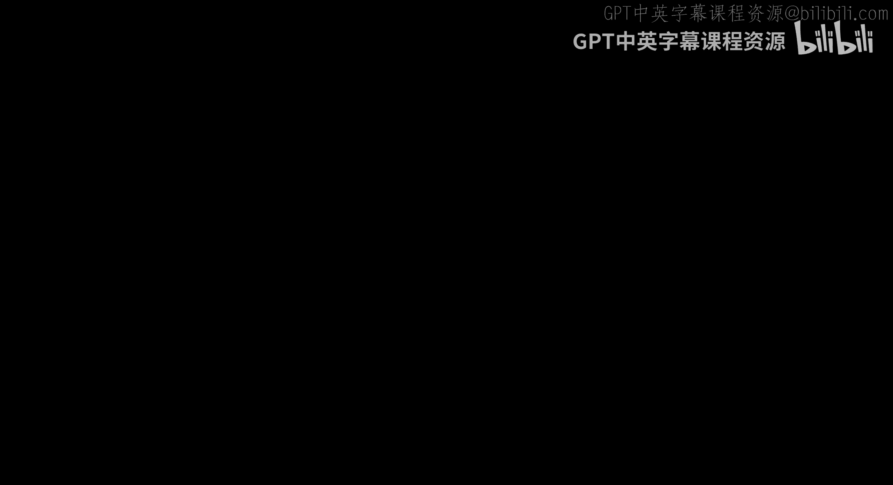
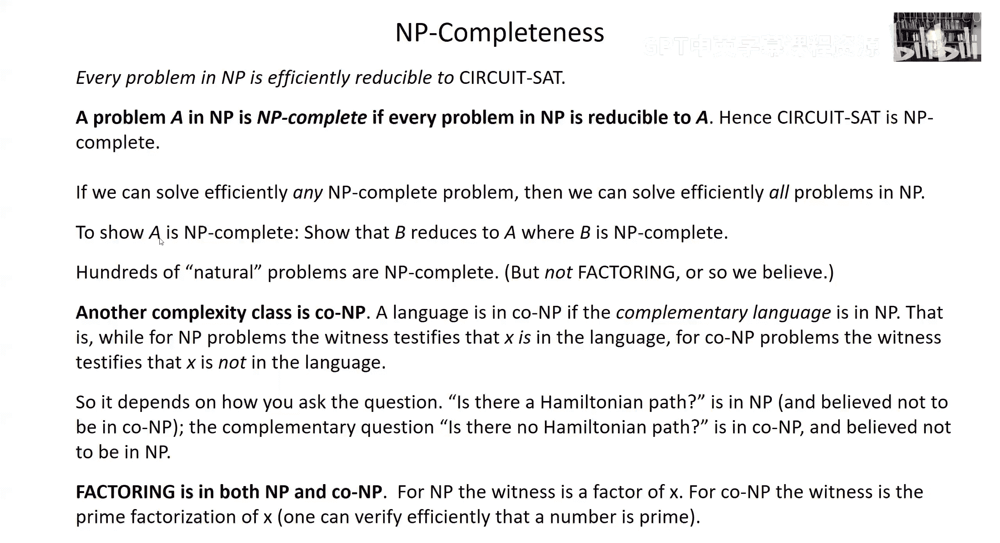

# 加州理工学院《量子计算｜Ph219⧸CS219 Quantum Computation Fall 2020》中英字幕 p11 -11-Ph CS 219A Lecture 9 Classical Circuits.zh_en -BV1KgffBoEUc_p11-

All right。 Ho there， Quantum friends。 Good to see you back again。 I hope you've been well， and。😊。

Are enjoying the course so far。What we're going to start on today is talking about computation。

 having。Take in care of various quantum preliminaries。So let's share the screen and get started。Now。

 before we actually get to quantum computing， there are some other notions of quantum computation that we're going to want to discuss。

And today we're going to review。The notion of classical computing， circuit complexity。

 universal gates in the classical context。And then， next time， we'll talk about。

Randomized computation computing when we have access to random numbers and reversible computation computations that we can run both forward and backward。

 And then that will。Be from where we'll segue into talking about quantum computing。

 So if you have a computer science background， as I guess many of you do， today's lecture。

Should be relaxing。 It might even seem superfluous。

 I'll be talking about notions that you've probably seen before。

 but it's okay that will provide a good。Jumping off point for some of the things that we want to discuss later。

 and we will want to make some。Remarks， some observations about the contrast between computing in the classical model and the quantum model。

 so talking about the classical model I think will be helpful we're on to a new chapter the lecture notes now chapter5。

What I hope won't be confusing is actually on the website。

 there's an older and the newer version of chapter five， I'm talking about the newer version。

Which is a discussion of。Quantum circuits primarily， and then in the chapter after that。

 we get into quantum algorithms。But as I said today， and actually for most of the next lecture。

 we won't be talking about the quantum model， but other models of computation。And in particular。

 I want to talk about。Circuits in the context of classical computation today。

We can build up any computation we want to do。As a circuit of。Logic gates。

 which are chosen from some universal set， universal just meaning that that set of gates is sufficiently rich。

 that we can use it to compute any function that we're interested in。

I'm going to be talking about functions today next time we'll generalize that a bit in the context of randomized computation to the case where because we have access to random numbers we don't necessarily get the same answer every run of the computation。

 but for today we're imagining a deterministic computer。

 you ask it a question and gives you a definite answer rather than some distribution of answers governed by some probability distribution。

So what our computer is doing is just computing a function， we give it an input。

Which we think of as a string of bits， and it produces an output。

 which is also expressed as a string of bit， a finite number of bits in， a finite number of bits out。

 Let's say the input is n bits long， and the output is M bits long。But actually。

 you can think of that M bit output as really consisting of M functions。

 each of which produces a single bit output。That is there's a function that takes the n bit input to the first bit of the output and another function that takes the end bit input to the second bit of the output and so on。

 So really， when I speak of n bits in and M bits out。

 I might as well say that we're talking about the evaluation of M functions。

 each of which takes an input， which is a bit string and bits long to a single output bit。

 either0 or one and functions that do that that have a single。B output are called。Bolean functions。

You can think of the zero and the one as like the answer to a question。嗯。Yes or no。

Where the question is framed by offering the input to the function。然。

One end gets to be fairly large and even when it's just a moderate size。

The number Boolean functions is really quite staggering。 There are an enormous number of them。

You can think about a Boolean function this way， if you like。

 since it produces an output bit either a 0 or one。For each of the possible endbit strings。

 which it receives as inputs。There are two to the impossible possible inputs。

To each one of those two to the n inputs， it assigns a zero or1。

 so the Boolean function is really a string of bits， which is two to the n bits long。

There's a zero or one associated with each of the two to the n possible inputs。The input。

 let's call it X， which is n bits long， can be chosen and two to the n wayss。

 And we have a0 or one for each one of those two to the n。 Now， if you have a bit string。

 which is say M bits long。The number of such bit strings is 2 to the M， right？

But the Boolean function is a bit string where the number of bits is2 to the n。

So the number of such strings， that is the number of Boolean functions is2 to the two to the N。

 It's doubly exponentially large in。 it grows really fast。As the number of bits in the input grows。

For n just equal to5。 and we're talking about two to the two to the 5，2 to the 32。

 it's over a billion possible。Boolean functions just with10 bits of input and one bit of output。

So even if you really love functions and you've spent much of your life。

Studying and using Boolean functions， you most likely only encountered a tiny fraction of all the Boolean functions which have an input that's just n bits long。

Another way about thinking about the Boolean function is it takes the set of possible strings。Of。

Length then， and it divides them up into two sets， the ones that it mapped to 0 and the one that it maps to one。

 their complementary sets。 Everything is mapped to either a 0 or one。 So whatever。Is not mapped to 0。

 is mapped to1 and vice versa。 So the function takes all the inputs and it divides them up into two bins。

So sometimes we say that the inputs for which F has the value1 are the inputs that are accepted。

By the function。And the inputs for which F produces the output 0 are said to be rejected。

 that is not accepted。 The function has a firm opinion about every string， it either accepts it。

Or rejects it。There's no waffling。And so really a Boolean function is just。If you like。

A way of choosing a subset of all of the two to the n strings， the subset of values of x。

 the n bit string。That the function accepts for which F of x is equal to1。Now。

 this idea of universal gates。Is that I can take any Boolean function。

 and I can express it as a sequence。 We say a circuit of very simple operations。 In fact。

 these operations will be。Logic gates， we say gates， but they're logical operations which。

Are themselves Boolean functions that take an input， which is either。

One or two bits and produces a one bit output and we take。A Boolean function of interest。

 and we can express it as a circuit。Decompose it into those simple operations。

 and that's very useful if I want to build a machine that computes functions。

 I just have to build the hardware to perform those simple operations。

And then wire the gates together in a suitable way to evaluate a particular function of interest。

So we can think about the decomposition of the Boolean function into those simple gates。

In the following way。Consider the set of inputs that are accepted by the function。

And there's just some list of bit strings， some subset of all the strings of length then。

And I can define for each one of those strings its characteristic function。

 a function that accepts that one particular string， let's call the string x super a。

The characteristic function for x super a accepts only x。Super a。And rejects everything else。ok。

So once I have such a characteristic function for each one of the possible strings。I can I can。

Express F of X。As the or。Of。Functions。Which are the characteristic functions of。

Each one of the bit strings that's accepted， okay？So if it accepts。X1， x2， x3。

Then I can write the function as the or of a function that accepts only x1。

That function or the function that accepts only x2 or the function that accepts only x3 and so on。

And that function will accept。All and only those bit strings， which are in the set sigma。

 the set of inputs that are accepted by the function。 So that's the first step。

We've written our function as。And exponential in N is as many as。In general。

 it could be exponential in none and might be as many as。Two to the n。

 possible functions composed together with the or connective。

The number of functions in the string is just the number of bit strings that are accepted by the function。

So then the next step is to take the characteristic function and decompose it into simple operations。

 which we could choose the different ways in which we could choose them。

 but let's say we choose the other fundamental operations in our gate set。

To be the and of two bits and the negation or not operation， which flips a bit。So let's say。

Just as an example to illustrate the idea。That I want to construct the characteristic function。

Of the four bit input 1001， so I want this function to accept that particular string。

 and I wanted to reject all other strings。So what I can do then is construct it as the and。Of。

First bit， I'm calling them。 I'm labeling the bits 3，2，1，0 in order of their significance。

 in other words， going from right to left。The bit furthest to the right is the zero bit。

The next one is the one bit， the two bit and the three bit。So in this case， x3 is equal to 1。

 x0 is equal to1， x1 and x2 are equal to zero。And so what I have here is the n of x3， not x2。

 not x1 and x0， that n is going to be happy only if x3 is equal to1。Not x2 is equal to 1。

 not x1 is equal to1 and x0 is equal to 1。And in other words。

 it'll only be happy if the input string is 1001 for。Any other input？One of the。好。

One of the variables is going to have the wrong value and the and is going to be zero。

So that means I've taken the characteristic function and I've expressed it in terms of the and and the or。

So， for any Boolean function。I've expressed it in terms of。Or， and， and not。

This is called the disjunctive normal form of the function。

 a decomposition of the Boolean function into the simple operations， not and an or。

There are other operations that we might not think of except tacitly， but maybe we should。

Point them out explicitly when we want to input a variable。

 that's an operation we're given an input string。X。

 which has n bits of input and we allowed to consult。

The bits in that string more than once if we want to。So in fact， in this disjunctive normal form。

 I might call a given bit many times， and each time that's an operation we can call it an input operation to input a particular bit。

X sub I in the string。And sometimes we might want to input constants as well， input a variable。

 well not a variable input a bit， which is either definitely a0 or definitely a1 in particular。

 if I'd like to have some scratch space for doing a computation which might allow me to do the computation more efficiently with fewer operations that would involve inputting constants。

 so let's explicitly think of those as among the elementary operations that we're going to use to compute Now there's nothing unique about this set of operations。

I could have chosen them in other ways。The important thing is they do have the property of being universal。

 They do suffice。For me to construct any Boolean function， okay？

So I'm going to have and or not input a variable and input a constant。

And so one way of describing what we've done is we build a circuit。 a circuit just means a。

Sequence of gates。Applied in some specified order。And you can think of the circuit as defining what we call a directed acyclic graph。

The graph specifies when we have an output from a gate。嗯。

How that is directed to the following gates and I've here this is just kind of a sketch of a circuit I haven't indicated whether these gates are or or and gates or that could even be something else if I had a different universal set。

The gates which I have just a single output and no input those are the input gates where we're inputting either a variable or a constant and the graph just describes how the output from all the gates is directed。

To be received as inputs for following gates。When we say it's a cyclic。Well。

 when we say it's directed， we mean that know there's a preferred direction。

 there's a distinction between the input and the output of each one of the vertices in these graphs。

 the vertex corresponding to a particular gate and acyclic means that there aren't any directed closed loops where you wind up coming back to a gate which was used previously。

You can think of the direction。Of the circuit as being like time。

The order in which things are applied， so the requirement that the graph is a cyclic。

Is the requirement that we don't have a time machine。

 we can't go back in time and revisit a gate which was already previously applied。

So you can think of that ingredient in the model that we don't allow ascyclic graphs。

As reflecting something that we think is true， at least most of the time。

Of the physics of the real world that we can go back in time and， in fact。

 models of computation always are rooted in some model of the physics of the world because we want。

Well， I mean we could dream up all kinds of things。

 but if we want the computation to correspond to computations we can really do with actual devices。

 the rules in the model of computation should reflect what's really physically possible。

And it's actually not 100% for certain that。Cloed time like curves。

 time machines are ruled out by the laws of physics， but there's。Evidence that that's the case。

 And at any rate， that's the physical assumption that we're making underlying the model of computation that we're using here。

Now。As I said， there are lots of Boolean functions， so you probably won't be shocked to hear。

That for many of those functions。When we use the disjunctive normal form to represent the function as a circuit。

 the circuit is really big。 What is big mean， big means it has lots of gates。

A measure of how complex the circuit is to execute in a machine is how many gates。

Does it need to carry out the computation？And in general， that could be quite a few。

If you remember how we constructed the disjunctive normal form。We had。

A number of ors corresponding to the number of possible characteristic functions。

And because there are two to the end possible bits， there are two to the n。

Possible characteristic functions， I guess if I take the or of all of them。

 I only need two to the n minus one or's。But I'm not going to care about the difference between two to the n and  two to the n minus one because2 to the n is so big。

And。Similarly， for each one of those of characteristic functions of which there are two to the n。

 I could have。Well， at least I know I have no more than N ans。

Because we only have n bits of input and we might need some knots on some of the input bits。

 but we won't need it more than n knots for each input string to construct its characteristic function。

 but because there are two to the end characteristic functions。

 we might need well at least we know we won't need more than。N times 2 to the n。

 ns and n times 2 to the n。I'm not。In the construction of the disjunctive normal form。

And the number of inputs， well， if we're inputting the variables。

Each time we have to input all n variables and if we wind up needing two to the n characteristic functions。

 that could be as many as n times 10 to two to the n inputs。So if we count。Inputs。Nos， oars and ans。

 all as gates。What we're saying is disjunctive normal form means we can construct any Boolean function we want with no more than 2 n plus 1 times 2 to the n gates。

 I just added up these four numbers， Okay， Now I don't mean that for every function。

 we need that many， of course， for some functions， we can get by with a lot less。

 And that's a good thing。 because to try to compute a function with a number of gates scaling like two to the n would quickly become infeasible。

Once end gets to be reasonably large。Um， but for some functions。

 there just won't be a shortcut and we really will need an exponential number of gates to construct a circuit that evaluates。

That particular function。So it's really a remarkable thing again。

 you can think of this as a statement about the physics of the world， which is captured by the model。

That any function that well ever want to compute。At least in the classical world what we can build out of these very simple operations。

 very components， and of course that's very good news to the engineer who's faced with the tax。

The task of constructing a computing machine。Now， in fact， for most functions。

 we really do need a number of gates to evaluate the function。Which grows very rapidly with。

 with N is exponential in N。 And we can see that by doing a accounting argument。

 we already know how many boolean functions there are。 I told you that it's two to the two to the n。

 if there's an input input。And then the other question we can ask is if we have a circuit of a certain size。

How many circuits are there with that size？With that number of gates。And。

Unless the number of gates is big enough， we just won't have enough circuits to match up with all the functions。

And what I'm about to show you is that we really need circuit sizes which are exponential in n in order to have enough circuits to have one circuit for each of the possible functions。

So let's see how that goes as I've already noted， we're imagining that we have n plus five types of gates。

We have not， and， and or。We can also input a constant that's two more and we can input any one of the variables。

 any one of the bits in the input string and there n possible bits in the string。

 So n plus5 things we can do at any step in the circuit of course。

 some of those namely the and and the or take two bits as input some don't need any bits as input those are the input steps themselves and the not only needs one bit is input。

But。That's some。A subtlety， which we want up to pay too much attention to in this argument。嗯。Instead。

 I'll just say this。That whenever I consider。A gate and the circuit。

 it's not going to have more than two input bits。嗯。If it's a N or or it has two otherwise。

It has fewer。But。Where did those input bits come from while they came from other gates？Right。

 except for。The case where we're inputting a variable or a constant where there wasn't any place that it came from。

 but。嗯。Otherwise， we have to consider all the possible ways in which for each one of the gates in the circuit。

 the inputs could have come from other gates。And because we are not going to have more than two inputs to each one of the gates。

If the number of gates is G， let's call G， the number of gates。

 then the number of ways of choosing a pair is certainly not going to be larger than G squared okay if the total number of gates is G then and if all the inputs to those gates with two input bits had to come from other gates。

 there aren't going to be more than G squared ways of choosing those。

So to estimate or to get an upper bound on the number of possible circuits that I can have。

With altogether G gates， I can say， well， every time I add a gate。

I have to think about how many ways in which I could add that gate。

 the number of possible gates is n plus5， as we've said。

And the number of possible bits that that gate can act on。

 weak can upper bound by G squared or G again is the number of gates。So。

It'll actually be convenient to consider the log of this number。

 the log of the number of possible circuits with altogether G gates。

So that becomes G times the log of this expression。It's a log of a product。

 so I'll write that is a sum of logs， and I'm going to take logs to the base too。

So at the log to the base 2 with the number of circuits， it's the log to the base 2 of n plus 5。

 the number of gates， and then I also have the log to the base2 of g squared。

 which is two times the log to the base 2 of g。ok。No。

Let's suppose we write the total number of gates。As2 to the n divided by2 n times some constant C that doesn't depend on n。

ok。系。want to write it that way。So that I can make a convenient comparison with the total number of functions。

And so then let's just look at this expression again。Okay， so for G。

We had C times 2 to the n divided by 2 n。So I have the c times 2 to the n in this G factor in frontier。

 and I'm pulling that in front of this expression。Now， when I took the log to the base 2 of G。

Now see， that means I'm taking the log to the base2 of c times 2 to the n divided by2 n。

But the part that it really counts is the two to the n and when I take the log to the base2。

Of two to the n， that's going to give me n。And then of course。

 I have this two in front of the log to the base2， so the leading term in two times log to the base2 of G is x going to be2 n。

 the two from here and the n from taking the log at2 to the n。Okay， but I divided that out。

By2 to the N。 And so for that leading term。The two to the n that comes from the two log to the base2 of G。

 combined with the  one over2 to the n and this expression for G is just going to give me a1。

And that's where this came from。And now what about these other terms， well。

 I've already taken out the C times2 to the N。From the factor G in front here。

But then I also had this one over two to the n and G。

 so going I'm putting that one over two to the n explicitly here。In this correction term。

 it's not in the first term because the one over two to the n canceled with the two to the n。

 that came from the two log of two to the n。And then remember when I。Took the log to the base 2 of G。

 I had to also include the log to the base2 of C minus the log to the base2 of2 n。

But there was a two in front， so I can make that the log to the base two of c squared and that takes care of the two and divided by the log to the base or inside the log to the base two。

I have in the denominator， the square of 2 n。 that is4 of n square。

 And then there's also this log to the base2 of n plus 5 over here。 and I combine that。

Into this log expression。So this is what I have for my upper bound on the log to the base2 of the total number of circuits。

 which have altogether G gates and notice that at least no matter what C is。

 it's a constant once n gets large enough。This for n squared is going to be bigger than C squared times n plus 5。

 And so this is going to be the log to the base2 of something less than one。

 So it's actually going to be negative。 And that means once n gets large enough。

 I can bound this one plus blah， blah， blah by one。

And so I bound the log of the number of circuits by C2 to the n okay now let's compare that with the number of functions well the number of functions is 2 to the two to the n so if I take the log of the number of functions that's two to the n and now consider the ratio of the total number of circuits which have G gates。

Divided by the number of functions that act on n input bits。

And so that log of the ratio is the difference of the logs。

 We bounded the log of the number of circuits by c2 to the n。

 and the log of the number of functions is 2 to the n， but it's in the denominator。

 So I can bound this by c -1 times 2 to the n。So look at what that means。As long as C is less than1。

 this expression is negative。And then if I take。Two to this exponent to get the ratio itself instead of its log。

I'm going to have the log of some negative number sorry， I'm going to have two raised to a power。

 which is a negative number times two to the n。 So that means the ratio of the number of circuits to the number of functions is going to fall off incredibly quickly like one over something that's doubly exponential in n if。

C is less than one， okay？So that means if I want to have any hope。Of covering more than a tiny。

 tiny fraction of all the possible functions with my circuits of size G。

 that the number of gates is going to have to be at least as large as 2 to the n over 2 n。So that。

Two and in the denominator isn't much of a big deal compared to the two to the n。

 the circuits really have to have exponential size。For typical functions。

 for all but a tiny fraction of all the functions we're going to need circuits of exponential size。

So again， what's going on is that they're just such a huge number of functions。

Going doubly exponentially in N。That since the number of circuits goes roughly or doesn't grow much faster than exponentially。

With the。Number of gates， unless the number of gates is exponential in end。

 then the ratio of the number of circuits so the number of functions is going to be very， very tiny。

Another way of saying what's going on is that most functions are pretty random looking。

 They don't have any special structure。 If a function has a nice structure， there might be some。

Quite efficient way of computing it。 But if it has no special structure if。It's， you know。

 the set that it accepts is something like a random subset。

 Then there just isn't going to be any good way to evaluate it。

 which is much different from a look up table of all the values that it accepts。

 And that's really what the dejunctive normal form is doing。

 It's a way of encoding into a circuit just such a look up table and a look up table when there are two to the end possible。

Strings is just going to be exponentially long。Now we want to talk about what problems are hard and what problems are easy。

So first of all， we're going to consider problems that can be phrased as decision problems。

 that is questions that have either a yes or no answer。Those are described by gloleian functions。

But I don't want to consider a Boolean function with some fixed input size， what I want to consider。

Is how the resources that I need to solve a problem depend on the size of the input。

So I want to consider not a particular function with an endB input。

 but some family of related functions。Where the input size is variable。

 and then I'd like to say something about what happens。

Or what are the resources that I need to evaluate the function as the size of the input grows？

And that's how I'm going to try to distinguish problems that are hard from problems that are easy。So。

There are plenty of examples here I've given the example factoring because that's going to play an outsized role in later discussions when we talk about quantum computing。

Now we don't usually think of the problem of finding the prime factors of a composite integer。

As a decision problem with a yes or no answer， but I can state factoring as a decision problem in several different ways。

 here's one way I could do it， I could say consider a function of two bit strings。And in fact。

 I'm going to want to consider y less than x。And the function will。Except the input。If the integer X。

 I can think of a bit string is representing an integer。 after all， in binary notation。

 If the integer X has some divisor Z， which is less than the integer Y。

 then the function will accept。And otherwise， it will reject。Okay， so that's。A question that has yes。

 no answer。 There either is such a divr or there is not that determines whether the Boolean function is unhappy or happy。

But if we knew the evaluation of that function for all the different values of y。

 which are less than x， of course， that would encode the information about what are the factors now if I want to find a factor and I had a way of evaluating this Boolean function。

 I would be able to do that with some modest number of evaluations of the function because I could do a binary search for example。

 I could。You know I could ask whether there's a divisor which is less than a number which is a little bit less than half the value of y and if there is one。

 oh okay， now I can ask if there's one which is a little bit less than a quarter of the value of y and so on and so in a number of steps which just scales like the size of the input。

 the length of the bit string， I'd be able to zero in。On what the particular factor is。

 if I were able to evaluate。This Boolean function。So for the sake of our theory of computation。

 it's nice to encode questions like。嗯。What is a prime factor or indeed， well。

 find a prime factor of a large energyx。Can be solved by repeatedly calling a boolean function。

And so I'd like to know how hard is it to evaluate that Boolean function。

 since the number of times I need to call it is relatively modest。

Whether factoring is a hard problem or not。Hinges on whether the Boolean function is hard to evaluate or not。

Now we think factoring is a hard problem， so we think this is a hard problem to solve。

 a hard Boolean function to evaluate， and our best reason for thinking that is that for reasons which we'll talk about later having to do with cryptography and also for other reasons of purely out of purely mathematical interest。

Finding efficient algorithms for factoring integers is a problem which has drawn a lot of attention in recent decades。

 and people have tried to find good algorithms for solving it but still we don't have efficient ways of solving the problem。

 and we've convinced ourselves on that basis that it's a hard problem。Now。

I want to say that in a somewhat more formal way， though I'm going to continue to use rather informal language。

It's nice to have a way of referring to all of these strings that are accepted by a family of functions。

 which have some variable input size。 That's about what the asterisk here means。 by the way。

 It just means that the input size can be a variable。Indiger number of bits。

And so if we have such a function family。And I guess in case it wasn't clear。

 maybe I should have said this better the size of the input。

For the evaluation of the Boolean function。In the case of factoring is just the number of bits that we need to specify x and Y。

Okay。So it's essentially， it goes like the number of bits and the number x whose factors we're interested in。

And。You can see how the I have a lot of functions here， which are closely related because I can。

Consider different possible numbers of bits。In the number to be factored。

 And that means I'm bearing the input size。 but I'm always asking essentially the same question。

 Can you find me a factor of the number？ So that's the sense in this case。

 where the functions in the family are related to one another。

 And so I want to consider the whole function family。

And speak of all of the inputs that are accepted， that's called a language if I consider variable input size。

 the collection of all of the inputs of whatever size that are accepted by the function family。

Is called a language。And the way we want to quantify the hardness of a decision problem of evaluating the Boolean function is what are the resources that we need to compute the function and using our circuit model of computation。

What do we mean by resources， we mean the number of gates， typically we mean the number of gates。

 which is called the circuit size that need to be evaluated to compute the function。

If there are an unreasonably large number of gates。嗯。

It'll take too long to execute that circuit and solve the problem。

Sometimes we make somewhat more refined。Measures of the resources I could consider separately。

 for example， the width and the depth of a circuit。By the depth。

 we mean loosely speaking the number of time steps。In the circuit or the。The length。Of。

A path through our acyclic circuit that goes from the input to the output。And by the width。

 we mean the maximum number of bits that we have to have in play at any time。

 it's essentially the amount of storage that we need。To execute our circuit。

 but typically a fine measure of。The resources that we need will just be the total number of gates that's what we'll usually use。

 I call that the circuit size。And if the。Size of the circuit， we need to decide the language。

 to decide what's in the language and what isn't。Increases very sharply as the size of the input increases。

 we consider that to be a hard problem， and if it increases in a manageable。

 reasonable way with the size of the input， we consider that to be a practical problem。

 which we could actually realistically solve。But we need to be a little bit careful because it wouldn't be fair to say the problem is easy。

If there's a small circuit that can solve the problem。

 but we can't figure out how to find that circuit and in particular。

 if the way the circuit had to be constructed，Was much different for different input sizes than we might have a hard time solving the problem for larger and larger inputs if we sort of have to start from scratch every time to find the circuit for every input size。

 so we would like the family of circuits that we use to evaluate the family of functions。

 the family of circuits taking different input size。

We want the circuits of varying input size to be closely related to one another。

 so it's not a hard computational problem once you've figured out how to construct the circuit that solves the problem with n bits of input。

To go from there to constructing the circuit that solves the problem for n plus1 Bs of input and so on。

 And to formalize that， we have to actually go beyond the circuit model and talk about a model of computation that builds the circuit。

 You can do that using the theory。Of universal Tring machines， but I'd rather not。

Take that digression。 Let's just stick with the circuit model and discussing computation and complexity。

 and I'll take it for granted that。We know what it means for the circuit family to be sufficiently uniform。

That circuits with varying input size are closely related to one another。

 And so it's not hard to find the circuit for larger input size once you found it for smaller input size。

So。I said。Easy means the resources are going to scale。Moestly with the input size。

 hard means the opposite is true and the way we typically formalize that is this。

 so if we have some function family。And some uniform circuit family that evaluates the functions in the family with variable input size。

 that it gives the exact evaluation of the function for any value of the input。

We'll say the circuit size is polynomial size， if the size of the circuit。

 the number gates in the circuit is growing with the input size no faster than some power of n bounded by a polynomial in n the input size。

And then the problems that we consider to be easy。By consensus。

Are the decision problems that can be solved by uniform circuit families of polynomial size？Okay。

 so these are circuit families which can decide the language。

Where the number of gates that we need grows no faster than some power of the number of bits of input。

And we call the class of problems for which that's true P。

P stands for polynomial time those are the problems we consider to be easy problems that are not in P will consider to be hard。

 that's the case in which there isn't any way of building a uniform circuit family that solves the problem where the size of the circuit。

Does not grow faster than a polynomial， those are the problems not in pain。

 we consider those to be hard。Now， the exact circuit size could depend on details like how we choose our universal gate set。

But that's not really a big deal for the purpose of distinguishing hard from easy。

 because whether the circuit size scales polynomial or not will not depend on our choice of universal gates as long as our universal gates all act on some fixed number of input bits。

Because if you have some set of universal gates that you like and I have some other set of universal gates。

 which I like better。Then I can always， since each one of your universal gates is just some circuit with some constant input size。

 I'll be able to build a circuit that evaluates your universal gates out of my gates and you'll because your gates are universal will be able to evaluate the functions that are evaluated by my gates。

 so in other words， we'll be able to simulate each other's computers efficiently。

I'll be able to make my computer emulate what yours does， you'll be able to do the same。

 and so that means with some modest overhead cost to simulate one person's gates with another person's gates。

嗯。We're going to agree on which problems are hard and which ones are easy， in particular。

 on whether there is polynomial growth in the circuit size or not as the input grows。 Now。

 this distinction between polynomial and faster than polynomial。

It's kind of nice from a theoretical point of view for some reason some of which will come to。

 but admittedly there's some arbitrariness to it， just because the circuit size grows like end to some power doesn't really mean the problem will be easy if that power is a large power。

 then it is going to be infeasible to solve the problem for large values of n if it goes like n to the thousand。

 then it's going to be way too hard to solve the problem， even for relatively modest input size。Like。

 you know， 100 bits or be completely hopeless。On the other hand， it could be that。

The circuit size grows faster than any polynomial， asymptically。But still pretty slowly。

 an example I gave was end to the log， log， log event， log。

 log log eventually gets as large as you please。But for any reasonable value of n。

 it's still pretty small， so that might not necessarily be so hard。

Even if we have a modest power of N， like if it goes linearly or quadraically an N。

 what if there's a huge constant in front， you know， like 10 to the hundred or something。 Well。

 I wouldn't consider that to be easy。嗯。But cases like that are rare， usually if there is a。

Algorithm that solves a problem in polynomial time then there are not huge constants or huge powers。

 And so it's a pretty good criterion for whether a problem is easy or not。

this growth like end of the log log end， well， that's possible in some cases。But。

It doesn't occur for a lot of problems which are。Really。Exponential or nearly exponential in N。

 and at least as far as we know。And in cases like that。

 there wouldn't be much room for disagreement about the problem being intractable for reasonably large input size。

Now， in some cases， we should make a distinction。Between how hard it is to find a solution to the problem。

And how hard it is to check that the solution is correct once we found it。

So let's take factoring as an example， as I said。We think determining whether a large integer has a prime factor。

 less than some specified value， we think that's a hard problem。

 we don't have an algorithm that runs in polynomial time for that。

But suppose somebody actually gives us a divisor of the number， which is。

 remember the problem was to， you know， is there a divisor， the number， The number is x。

 and we want the divisor to be less than y。 I' suppose I give you a divisor of X。

 which is less than y。 It's not very hard for you to check that it's really a divisor。

 but you need my help。So I had to provide a kind of certificate， sometimes we call it a witness。

 and once you have that in hand， you could easily check that the function evaluates to one， okay。

 that the input is really accepted。You couldn't do it on your own。

 but once you had the right information， you could efficiently check。That。The input is accepted。

And that's an important notion in computation as well。So we can formalize it again。

 I'm describing things kind of informally here， but。This should give you the idea。

We say a language is in a class we call NP。If there's a polynomial size verifier and the verifier is itself。

A uniform circuit family。Such that if an input value x is in the language。

 then there's some value of y， such that the verifier accepts the pair x and y。

If x is not in the language， then for any possible value of y。Then， the verifier。Rejects the pair。

 X Y。The first property we call completeness。What it means is that for any X that's in the language。

For any input for which our decision problem has the answer， yes。

Theres some witness that we can give to the verifier。

 and the verifier only needs to run a efficient computation， a polynomial size computation。

 a computation with the polynomial in N number of gates。To check the answer。

And because there's a witness for every possible input， that's what we mean by completeness。

On the other hand， if。X is not in the language。 If the answer to our decision problem is no。

 then we can't fool the verifier。 There isn't any way to give the verifier a witness that causes the verifier to incorrectly conclude。

That X is in the language， that the answer is yes， when the answer is really no。

 that's what we mean by soundness。嗯。And so I told you the example of factoring。嗯。

Maybe I should mention another example， I guess I didn't put this in the slide。嗯。

Here's another example。The problem of finding the Hamiltonian path of a graph。

Okay the a graph is just a set of points and a set of pairs of points。

 let's say it's not a directed graph， so there are pairs of points which are the edges。

They connect together the vertices。In the graph， so I can describe the graph just as a set of these edges。

Pairs of vertices。And then the Hamiltonian path through this graph。Is a path which。嗯。

Goes through the graph。Traveling along edges。And。Covers or passes。Each one of the vertices。

 just once。Okay， so it never returns to the same vertex again。

And the input to the problem is just the list of all the edges。

And it's hard to find such a path even if it exists， because there are so many possible paths。

 an explosion of the number of possible paths as the number of vertices increases。

 you can't possibly check them all any more than you could possibly check all the possible factors of a large number in a reasonable amount of time。

But if I show you， if I give you。The path， it's easy for you to check that it's a valid path。

Which connects only vertices that are。Connected by edges in the graph and hits each pers exactly one that's easy to check。

 but you needed my help， you needed the witness， the certificate， the Hamiltonian path。

 which you could then check yourself。Now what does NP mean well it stands for non deterministic polynomial time like P stands for polynomial time never mind why it's a little bit confusing just call it non deterministic because the verifier itself is a deterministic computation it just needs the。

Input X and the witness Y as its input2。To be evaluated。 but anyway， that's what we call it。

 So that's what everybody calls it。 and so should you。Now。

 an obvious fact is that the class P is contained an NP。Because for the case， P。

 we don't need the witness at all， we have a circuit family that can determine efficiently whether the input is accepted or not。

All by itself， without any help from witness， but that's a special case of NP。

Where we don't need the witness at all， so P is contained in NP。A fundamental conjecture。

 really the fundamental conjecture of computer science， is that P is not equal to NPp。

That there really are problems for which a solution once found can be efficiently checked。

 but for which finding the solution is a hard problem。 We can do the checking and polynomial time。

But we can't find the solution in polynomial time。So one way of stating what this conjecture is saying。

Is it just because there's an existence of a sinkct proof of some statement？

That's not enough to ensure that we can find that proof by any systematic procedure in a reasonable amount of time。

One of the first two。Formte this conjecture was Goodel， who was， of course。

 a famous mathematician and logician。And the way he looked at the question was。Can the。

Creativity of a mathematician who discovers theorems be automated。

 Can a machine discover all the possible theorems whose proofs can be efficiently checked。

And the conjecture is that。There isn't such a machine that can generate all of the statements that are true for which proofs exists。

嗯。Even if we can efficiently check the proofs in any reasonable amount of time。

 if you have enough time， of course you could always do it。

 but it would be exponential in the input size to do it in general。So really。

 if you could think of it， the P not equals NPp conjecture。

 which is one of the most important open questions in mathematics， not in computer science。

Not just in computer science as you know， the question of， is it possible to automate？Creativity。

I mean， there are all kinds of sort of fanciful examples you could think of like， I suppose。

 you know， you had the ability to recognize。When a great piece of music has been composed by Beethoven。

 does that mean that you can create a symphony which would be indistinguishable from the symphonies of Beethoven in terms of the genius it displays or a play by Shakespeare that you write a play if you can。

Read and appreciate the。You know， unique touch。Of Shakespeare to the author。

 Does that mean that you would be able to recreate。The genius of Shakespeare。

 by some automated procedure。Well， we think that that。Type of superhuman power。Is beyond our grasp。

 and that is formalized by the conjecture。P is not equal to NP P。

Now another quite natural example of a problem in NPP。Is called Circuitat。And it's the question。

Giveon a Boolean circuit。Described by a set of gates。Can you answer whether。And input。

Will be accepted by。The circuit I should， sorry， I didn't say that very clearly。

Is there any input that the circuit will accept or does it reject all inputs。

 That's the question okay。And you know you can describe the circuit， it has some。

 let's say polynomial number gates， so you have a polynomial length input。Size。

Describing that circuit。But。Even if the circuit has such a succinct description。

The number of possible inputs， of course， is exponential in the input size。

And finding an input that the circuit accepts or even answering whether there is any such input。

Is as far as we know， a hard problem。You could， in principle， check all the possible inputs。

 run the circuit on all possible inputs， but then you'd have to run the circuit two to the end times in general。

 and of course that wouldn't be polynomial time。Okay， but the problem is in NP。Because。

The input to the problem is the circuit。And if you're trying to figure out whether C accepts any input。

If I am so kind as to give you the gift。Of the particular value X that C accepts。

 then it's easier for you to check that it accepts you just have to run the circuit once。

 and it's a polynomial size circuit。So you can do that。So this problem is in NP。

 we don't think it's in P because we don't know of any efficient way given a circuit of determining whether there's an input that it accepts or not。

But this problem， circuit sad has。A very nice property。Namely。

Any problem in N P can be efficiently reduced to circuits at。So that means。

That if you had some magic box。That could solve circuits at。 Who knows how it works。

 but it can solve circuits at。 Then you'd be able to use that box to solve any problem in N P efficiently。

 Okay， running the box just some modest number of times in particular。Well， okay。

I have to explain what I mean by Reducible。So if we have two function families。Let's say。B and A。

 what do I mean if I say B reduces to a。But what I mean by that is that there is some efficiently computable function family。

Such that for any input， and I'm calling those functions R。For any input。

B of x is given by a of R of x。So if I want to know whether B。Excepts。

Then what I can do is use this efficiently computable。Function R。Evaluate that on the input。

 and that's going to give me some new string， which I can then input today。And so， I can。嗯。

Use a to determine whether B accepts。 Okay， so I guess that's what I'm trying to show with this picture。

I'm interested in whether the input X。Is accepted by function family B， I want to evaluate B of x。

 is it equal to1 or is it equal to zero？But if I have a magic box that evaluates a。

And I have a reduction。Then。I can answer the question by。Evaluating R of x。

 which then gives me an input I can put into the function family A and then the output that results will be B of x。

So that means if I have a machine that solves a， somehow。

 perhaps because I have an efficient circuit family that solves A。Then I can use。The a。Machine。

Together with the R machine， the reduction。To。Evaluate B of x。Now， so now。

 how can I make this statement that every problem in NP is efficiently reducible to circuits at？Well。

 here's the thing。Suppose B is N Np。 Then by the definition of Np。

 there's some polynomial size verifier。Which I called V of X， Y。Such that B accepts X。

 if and only if there's some witness y， such that the verifier accepts the pair X Y。

So for each value of x。Whether。嗯。X is accepted。Can be phrased as。

Is there a witness such that V accepts the pair。But that means for each value of x。

I'm asking for a solution to circuitat。For each value of x， v of x。

Why I can think of as a circuit that takes Y as an input。If I could solve circuit set。

Then that would answer whether there's some Y such that V of X， Y is equal to1。 You see。

 I just solve circuit S for each possible X to find whether there's a Y。

 the witness such that the circuit accepts。 and that tells me。嗯。That。If I can solve circuit set。Then。

I can solve B。Right。Because。I am。Right， because I want to know。

 does V accept x and that becomes for that fixed x， just the question circuit set for the verifier。

 okay？So if I somehow had a polynomial size circuit family that could solve circuits atd and we don't think we do。

 then I could use that to solve B。That's what I mean when I say every problem in NP is efficiently reducible to circuit set。

Now。We say that a problem which is NNP。Is N P complete if every problem in N is reducible to a。

So what I just told you。Can be rephrased as circuit Sa is an N complete problem。

If I can solve circuitsat， then I can solve anything。In N。Okay， so in that sense。

 the NP complete problems are the hardest problems in the class NP if you can solve any one of them。

Any one of the NP complete problems， circuits at being an example。

Then you can solve anything in NP efficiently。ok。Now。

 how would you show that a problem is NP complete？Well， it would suffice。To show that。

There's some NP complete problem， let's call it B that reduces to A。Okay。

So that would be enough to tell me that A is NP complete。

And so by constructing a web of such reductions， efficient ways of reducing one problem to another。

Then I can come up with a。Population of problems that are known to be NP P complete。

 and there's a long list， hundreds of problems which have been shown to be NP P complete。嗯。

One of them is the problem I mentioned a few minutes ago， the Hamiltonian path problem。Okay。嗯。

Factoring， though， is not believed to be NP complete。It's a problem in NP P。

 We don't think it's NP P， but it's not as hard as the Np complete problems。

 If I could solve the N P complete problems， then I could certainly solve factoring。

Because factoring is an NP。But because factoring is not NP complete。

 being able to solve factoring efficiently is not enough to solve。

All problems in NP in particular not enough to solve the problems that are NP complete。

Now there's another complexity class， which is sometimes convenient to discuss。

Closely related to N P， which is called co N P。Now。A language is said to be in CoP。

 if the complementary language is an NP， what does that mean complementary language？If。A language。嗯。

Contains X。Then the complementary language， or let me put it this way。

 The language is a set of a bit strings that are accepted with variable input size。

And there's a complementary set of Bi strings that are not accepted。Okay。

The complement of the language has it the other way around。Accepted strings of。

The language are rejected by its complement， the rejected strings of the language are accepted by its complement。

So another way of saying that is that for problems that are NN。What we want the witness to do。

Is to testify， to convince us。That a given input X is in the language。 But for the problems in Co P。

The witness testifies that an input is not in the language。Now， of course。

 this distinction depends on how you choose to ask the question。

If I think of the Hamiltonian path problem。The question is， here's this graph。

 is there a Hamiltonian path？And the question， is there a Hamiltonian path is N NP because？

If there is a Hamiltonian path， it can serve as a witness which we can easily verify。

But we don't think the Hamiltonian Pa problem is in CoNP。The complementary question is。

 is there no Hamiltonian path？That problem is inP because we know how to answer no by exhibiting the Hamiltonian path。

 but we don't know a way for a witness to convince us that there is no Hamiltonian path to convince us sufficiently。

Okay。So。There's a kind of。Asymmetry in that sense between the language and the complementary language。

Unless you flip the question as well as flip the。The accepted and rejected bits。Now factoring。

 it's interesting to note， has the property of being in both NP and Co NPp。

We don't think that's true of the NP complete problems。Okay。We don't think NPp complete problems。

 Hamiltonian Path is an example。Our。In Co P。I said that we think that I said factoring is is not and be complete。

 well I didn't quite mean that as strongly as I may have said it， we don't really know for sure。

But we don't think factoring is an NP complete problem。

Part of the evidence for that is that factoring is in Cohen P。That's not completely obvious。

 we talked about how。In the case of factoring， a witness can be a divisor that convinces you that a diviser exists。

What would be the witness that convinces you that no divisor exists， which meets the specified？

Criterion， advise Z less than y。Ex well， suppose I gave you the prime factorization。Of the number X。

 you'd be able to check that the product of those factors really is X。Now。

 the part that's not so obvious is that it's also possible to deterministically check。

That prime numbers really are prime。 That's actually a relatively recent discovery。

But there are efficient algorithms for testing primarilyity。

So if I gave you a prime factorization of a number。

 you could actually verify that it is the correct prime factorization。

 not just that the factors multiplied together give x， but that each one of the factors is prime。

And once you know the complete prime factorization， you know all the divisors。

 and so then it would be easy for you to answer。No， there isn't any divisor Z。

 which is less than y of x，So factoring is an NP， we can efficiently verify the yes answer。

It's also in CoP， we can efficiently verify the no answer。And it's believed that NP and CoNp。

Ourre distinct classes， they do overlap factoring as an example。 and so are all the problems in P。

 of course。Examples of problems that are in both NP P and Co and P。 But if it's true。

That NPp is not equal to co NPp， then one can show that there exist problems。Which are not in P。

Are in NP but are not NP complete。And we think factoring is a candidate for such a problem。

 a problem of intermediate difficulty， not as hard as the N complete problems， not in P。

 We don't have an efficient algorithm for solving。AFing。But。We think not NP complete。

And so it's an interesting thing。That we have a quantum algorithm that can efficiently solve factoring。

 which we'll talk about later。But we don't think that quantum computers can efficiently solve the NP complete problems。

 Okay， In fact， that would be a great shock if it turns out that they can。嗯 so啊。

Factoring has that special status and that helps us to put in context the。Discovery。

 the known fact that with a quantum computer， we can find prime factors efficiently。

 as we'll later discuss。And I think I'm going to stop here for today。

 What I want to talk about next time are some other aspects of classical computing and then start to talk about quantum computing The aspects I want to discuss are how should we describe a model of computation in which we have access to random numbers during the course of the computation randomized computing。

 and I'd also like to talk about a model in which all the gates in a classical computation have the property of being reduce sorry invertible so that you can run a computation backwards because quantum computing has the property of consisting of gates which are invertible unitary transformations。

 and so it will be instructive before we get to quantum computing to talk about reversible。

Classical computing。So I think that's it for now， thanks for listening， I know you're out there。

Enjoying the lecture， I've been enjoying giving it， so be well and I'll see you next time。拜e拜。

