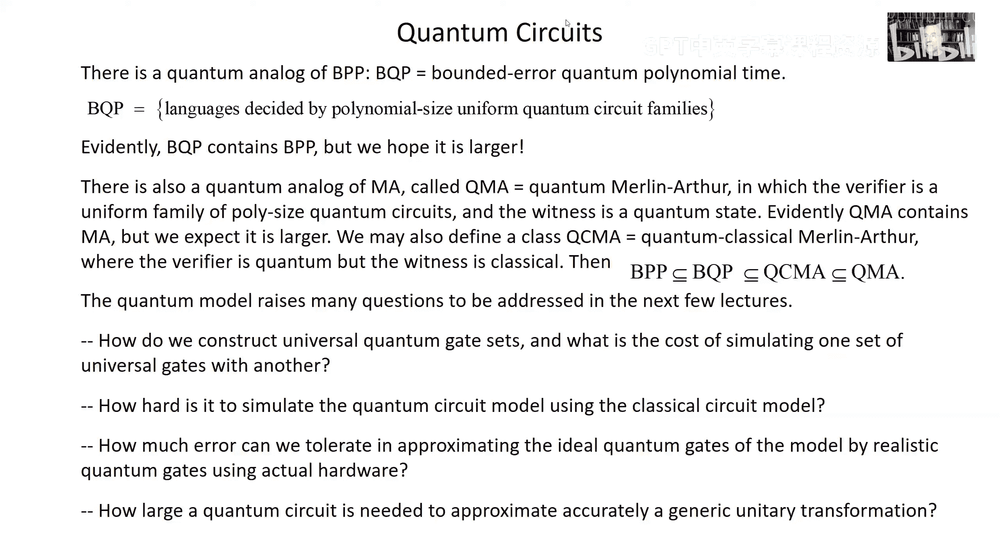

# 量子计算：第10讲：随机化与可逆计算 🧮

在本节课中，我们将继续探讨经典计算理论，为后续学习量子计算模型打下基础。我们将介绍**随机化计算**和**可逆经典计算**这两个重要概念，并最终过渡到量子计算模型的初步介绍。

---

## 随机化计算 🎲

上一节我们讨论了计算布尔函数的经典电路模型。本节中，我们来看看**随机化计算**。在这种模型中，计算机可以访问随机数生成器。在计算的每一步，我们可以根据随机抽样结果，从多个可能的门中选择一个来应用。这意味着，即使对于相同的输入，每次运行也可能得到不同的输出。然而，如果算法能以大于1/2的概率给出正确答案，我们就可以通过多次运行并取多数结果来可靠地确定答案。

以下是随机化计算的核心思想：
*   **概率放大**：假设每次运行得到正确答案的概率为 **1/2 + δ**（δ 是一个正常数）。通过运行 **N** 次独立试验并采取多数表决，得到错误答案的概率会指数级下降。
*   **切尔诺夫界限**：经过推导，多数表决出错的概率 **P_error ≤ e^{-2Nδ²}**。这意味着，为了将错误概率降至 ε，我们只需要运行 **N ≥ (1/(2δ²)) * log(1/ε)** 次。这个次数与输入规模无关，只与 δ 和 ε 有关。

基于此，我们可以定义复杂度类 **BPP**（有界错误概率多项式时间）。它包含那些可以由多项式规模、均匀的随机化电路族判定的语言。显然，**P ⊆ BPP**（确定性计算是随机化计算的特例）。BPP 是否等于 P 是一个悬而未决的问题，但普遍认为它们是相等的。

类似地，我们也有随机化版本的 **NP**，称为 **MA**（Merlin-Arthur）。在这个模型中，全能的 Merlin 提供一个见证（证明），而凡人 Arthur 使用一个随机化验证器（多项式规模电路）来高效地验证这个证明。一个语言属于 MA，当且仅当：对于语言中的输入，存在一个见证使得验证器以 ≥ 2/3 的概率接受；对于不在语言中的输入，任何见证都无法使验证器以 > 1/3 的概率接受。显然，**BPP ⊆ MA**，并且 **NP ⊆ MA**（因为 NP 是 MA 中验证器不使用随机性的特例）。

---

## 可逆计算与兰道尔原理 ⚙️

现在，让我们转向另一个对通向量子计算很有帮助的经典计算模型：**可逆计算**。首先，我们需要理解一个重要的物理原理——**兰道尔原理**。

该原理指出：在非零温度 T 下，**擦除一个比特需要做功**。所需的最小功为 **W ≥ kT ln 2**，其中 k 是玻尔兹曼常数。

为什么擦除需要耗能？考虑一个用单分子气体存储比特的记忆装置：分子在隔板的左边代表1，右边代表0。擦除意味着无论初始状态如何，最终都将系统置为标准状态（例如0）。一个方法是通过**等温压缩**将气体分子逼到右侧。根据热力学，在可逆等温过程中，压缩气体、减少其熵需要做功，其值至少为 **TΔS**。由于状态数减半，熵减少 **k ln 2**，因此所需功即为 **kT ln 2**。

兰道尔进一步指出，传统逻辑门（如 AND、OR）是**逻辑不可逆**的：它们将多个输入映射到同一个输出，丢失了信息，压缩了相空间，因此理论上也需要耗能。然而，实际计算机的功耗远高于此下限，说明当前技术浪费了大量能量。

但关键在于：**计算本身并不必须消耗能量**。我们可以构建**可逆计算机**来规避兰道尔原理所指出的热力学成本。可逆计算机计算的是**可逆函数**（即排列函数），从 n 比特到 n 比特，没有信息丢失。

---

## 通用可逆门与计算模拟 🔄

一个自然的问题是：是否存在**通用可逆门**？对于可逆函数，仅使用2比特到2比特的可逆门是不够的，因为它们都是线性操作（模2运算），无法实现如 AND 这样的非线性函数。我们需要至少3比特输入的门。

一个关键的通用可逆门是 **Toffoli 门**（或称控-控-非门）。它有三个输入比特 (x, y, z)，其功能是：如果 x 和 y 都为 1，则翻转 z；否则保持不变。用公式表示为：
`(x, y, z) → (x, y, z ⊕ (x · y))`
通过固定某些输入为常数，Toffoli 门可以模拟所有经典通用门集中的门：
*   固定 `x=1, y=1`：对第三比特 z 实现 **NOT** 操作。
*   固定 `z=0`：在输出端第三比特得到 **x AND y**。
*   结合 NOT 和 AND，即可实现 **OR** 等所有逻辑操作。

因此，使用 Toffoli 门和固定常数输入，我们可以模拟任何经典（不可逆）电路。但这是否只是推迟了热力学代价呢？因为模拟不可逆门时会产生“垃圾”比特（如原始的 x 和 y），最终仍需擦除它们。

本内特指出，我们**不需要擦除**。我们可以这样做：
1.  使用 Toffoli 门模拟原始电路进行计算，得到输出答案，但同时产生垃圾比特。
2.  将答案比特复制一份。
3.  **反向运行**整个可逆计算（应用门的逆操作）。由于计算是可逆的，这将精确地撤销所有操作，使所有工作比特（包括垃圾比特）回到初始状态（例如全0）。
4.  现在，内存被清理干净，可以重复使用。

代价是我们需要运行两次计算（一次正向，一次反向），但这只使门数量大约翻倍，并未引入不可逆擦除的热力学成本。因此，**信息处理本身在原理上可以是免费的，困难的是擦除**。

可逆计算模型与经典电路模型具有相同的计算能力，因此对问题复杂度的分类是一致的。

---

## 量子计算模型初步介绍 ⚛️

现在，让我们简要介绍我们认为比经典模型更强大的**量子计算模型**。量子算法可以在量子模型中以多项式规模电路解决一些在经典模型中无法高效解决的问题。

量子电路模型的核心要素如下：
1.  **计算空间**：计算在 **N 个量子比特的希尔伯特空间**中进行，而不是处理比特串。系统状态用纯态描述。
2.  **局域性与复杂度**：与经典模型类似，我们假设硬件易于执行仅作用于少数量子比特（如一两个）的简单操作。复杂的多比特操作需要通过组合简单操作来实现，其成本决定了计算的复杂度。
3.  **初始化**：我们假设可以轻松地将所有量子比特初始化为一个简单的乘积态，例如 |0⟩^⊗N。这相当于在物理上通过冷却等方式将系统制备到一个特定状态。
4.  **通用门集**：我们需要一组**通用量子门**。这些门是**酉变换**。仅使用单量子比特门无法产生纠缠，因此必须包含至少作用于两个量子比特的门。通用性意味着，通过组合这些门，可以以任意精度逼近作用在 N 量子比特上的任何期望的酉变换。
5.  **有限门集与经典控制**：通常我们考虑一个有限的通用门集合，而不是连续的门。设计特定量子电路的任务可以交给一台**经典计算机**，我们要求它也能高效完成此任务。
6.  **测量与输出**：最终，我们需要通过**测量**来读取经典的输出信息。我们假设对单个量子比特进行标准基测量是简单的操作。所有测量可以推迟到最后进行，这不会损失一般性。

**BQP**（有界错误量子多项式时间）复杂度类包含了那些可以由多项式规模均匀量子电路族判定的语言。显然，**BPP ⊆ BQP**，因为量子计算机可以模拟随机数生成。我们相信 **BQP** 严格大于 **BPP**，即量子计算机确实提供了更强的计算能力。

类似地，我们也可以定义量子版的 **MA**，称为 **QMA**（量子 Merlin-Arthur）。在 QMA 中，验证者 Arthur 使用高效的量子电路进行验证，并且证明者 Merlin 可以发送一个**量子态**作为见证。显然，**MA ⊆ QCMA ⊆ QMA**，其中 QCMA 要求见证是经典的。

---

## 总结与展望 🌟

本节课中我们一起学习了：
1.  **随机化计算**：介绍了 BPP 和 MA 复杂度类，以及如何通过多次运行放大成功概率。
2.  **可逆经典计算**：理解了兰道尔原理（擦除信息需要耗能），并学习了如何使用 Toffoli 门等可逆操作模拟所有经典计算，从而在原理上实现无能量耗散的计算。
3.  **量子计算模型初步**：概述了量子电路模型的基本框架，包括其与经典模型的区别、核心假设以及 BQP、QMA 等复杂度类。

这些经典计算的概念为我们理解量子计算奠定了坚实基础。在接下来的课程中，我们将深入探讨量子通用门集、量子计算的误差容限、通用量子变换的复杂度，以及具体的量子算法，领略量子计算相对于经典计算的潜在加速能力。