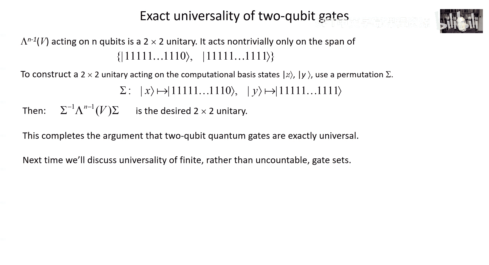

# 量子计算：11：量子电路模型深入探讨

在本节课中，我们将继续深入探讨量子电路模型。我们将讨论量子门操作的精度要求、典型酉变换的电路复杂度、量子电路的经典模拟能力，并开始介绍通用量子门集的概念。

---

## 量子电路模型回顾

上一节我们介绍了量子电路模型的基本框架。本节中，我们来看看该模型的具体构成。

量子计算在一个由N个量子比特构成的希尔伯特空间中进行，该空间由2^N个计算基态张成。模型的关键在于，我们不仅有一个巨大的希尔伯特空间，还有一个将其分解为小子系统的特定方式。这使我们能够讨论复杂度，因为电路模型中的门只作用于少量指定的量子比特。

我们假设计算机可以初始化为一个乘积态，例如所有量子比特都处于|0⟩态。模型中内置了一组有限的量子门，这组门是通用的。通用意味着通过组合这些门构建电路，我们可以任意逼近作用于N个量子比特的任何酉变换。

我们默认有一台经典计算机在幕后控制量子计算机。为了讨论电路模型中的复杂度，我们需要考虑电路族是否“均匀”，这个概念由经典图灵机能否高效构造电路来定义。最后，我们通过测量一个或多个量子比特来读取结果。由于是量子测量，最终结果是概率性的。

---

## 量子门精度要求

在理想情况下，一个量子电路可以精确解决某个问题。但在实际设备中，我们无法精确实现这些酉变换，总会存在误差。本节中，我们来看看这些误差如何累积，以及对硬件精度有何要求。

我们将有噪声的门视为酉变换。每个实际的门Ũ_t与理想的门U_t相差一个小的误差算子E_t：
`Ũ_t = U_t + E_t`
我们使用算子范数（最大奇异值）来表征误差E_t的大小。假设每个门的误差范数都以某个小常数ε为界。

当我们将T个这样的门组合起来时，实际的总酉变换Ũ与理想的U之间的总误差可以组织为一系列项的和。通过分析，总误差的范数可以以T * ε为界。

为了使最终测量结果的概率分布与理想情况足够接近（例如，总误差小于某个常数δ），我们需要每个门的误差ε满足：
`ε < δ / T`
这意味着，为了执行更长的计算（T更大），我们需要每个门具有更高的精度。对于需要数十亿个门的复杂问题，门误差可能需要低至10^-9级别，这对当前硬件是巨大挑战。

然而，量子纠错和容错量子计算理论表明，如果我们愿意付出一定的开销代价（使电路规模按理想电路大小的对数多项式增长），那么每个门的误差只需低于一个足够小的常数（例如约1%）即可。这使得大规模量子计算在理论上成为可能。

---

## 酉变换的电路复杂度

希尔伯特空间非常庞大，这意味着酉变换的空间也非常庞大。本节中，我们探讨实现典型酉变换所需的电路复杂度。

我们希望用半径为δ的小球覆盖整个酉群U(N)（其中N=2^n）。所需小球的数量大约为 (C/δ)^{N^2}，这里N^2是酉群的维度。对于n个量子比特，N=2^n，因此所需小球数量随n呈双指数增长。

另一方面，考虑我们可以用有限门集构建的电路数量。如果一个电路由T个门组成，每个门从有限集合中选取并作用于常数个量子比特，那么不同电路的数量大约是 (n的多项式)^T。

为了用电路覆盖所有小球（即逼近所有酉变换），电路数量必须大于小球数量。取对数后，这意味着T需要随n呈指数增长（约为2^{2n}）。因此，仅使用多项式规模的电路，我们只能探索希尔伯特空间中极小的一部分。大多数量子态过于复杂，无法用多项式规模的电路制备。

这一结论同样适用于物理系统演化：对于一个由局部位项组成的“物理合理”哈密顿量，要达到所有可能的酉变换，所需的演化时间也是系统大小的指数级。

---

## 量子电路的经典模拟

我们想知道模拟量子电路需要多少经典资源。本节中，我们证明，即使只有多项式大小的内存，也可以模拟量子电路。

BQP类（量子计算机能高效解决的问题）包含在PSPACE类（只需多项式内存的经典计算机能解决的问题）中。以下是模拟方法的概述。

我们希望计算在应用酉电路U到全零初态后，测得特定计算基态|x⟩的概率：
`p(x) = |⟨x|U|0⟩|^2`
其中U是由T个门组成的电路。

我们使用一种技巧，在每对酉门之间插入对所有计算基态的求和（即完备性关系）：
`⟨x|U|0⟩ = Σ_{x1} Σ_{x2} ... Σ_{x_{T-1}} ⟨x|U_T|x_{T-1}⟩ ⟨x_{T-1}|U_{T-1}|x_{T-2}⟩ ... ⟨x_1|U_1|0⟩`
这类似于量子力学中的费曼路径积分，我们求和了所有可能的中间计算路径。

每条路径的贡献是T个矩阵元的乘积。由于每个量子门只作用于常数个（如2个）量子比特，大多数矩阵元为零。非零的矩阵元可以存储在经典内存中，并在需要时调用。

虽然需要求和的路径总数是巨大的（约为2^{n(T-1)}），但我们可以用多项式大小的内存来累积这个和。关键点在于，我们不需要同时存储所有路径的信息，只需在计算每条路径的贡献后将其加到累加和上。计算每条路径的贡献只需要多项式资源，因为每个矩阵元的计算只涉及常数个量子比特。

因此，通过用大量的计算时间换取适度的内存使用，我们可以在经典计算机上模拟量子电路。

---

## 通用量子门集（上）

在我们的计算模型中，我们假设有一个有限的指令集（门集）。本节中，我们开始探讨通用门集意味着什么，并区分几种不同的通用性。

通用性意味着我们可以通过用这些门构建电路，来任意逼近作用于n个量子比特的任何酉变换。在模型中，每个门作用于常数个（如两个）量子比特，并且可以作用于任意一对量子比特。

首先，我们区分**精确通用性**和**通用性**：
*   **精确通用性**：考虑一个可能不可数的门类。通过用这些门构建电路，可以**精确**实现任何想要的酉变换（无需逼近）。例如，任何**双量子比特门**（只要是纠缠门）与任何单量子比特门组合，就是精确通用的。
*   **通用性**：对于一个**有限门集**，通过构建电路，可以**任意逼近**任何酉变换。几乎任何单个双量子比特门（除了非纠缠门等零测集）本身，如果可以作用于任意量子比特对，就是通用的。

以下是一些有限通用门集的例子：
1.  **受控S门（Λ(S)）和哈达玛门（H）**。
2.  **受控非门（Λ(X)，即CNOT）、哈达玛门（H）和T门**。
3.  **托弗里门（Λ²(X)，即CCNOT）、哈达玛门（H）和S门**。

接下来，我们论证为什么双量子比特门是**精确通用**的。论证分为两步：
1.  证明任何酉变换都可以表示为一系列“2x2酉变换”的乘积。
2.  证明每个“2x2酉变换”都可以用双量子比特门构成的电路来实现。

**第一步：任何酉变换都是2x2酉变换的乘积**
一个“2x2酉变换”在N维空间中只非平凡地作用于两个计算基态张成的子空间，在其他基态上作用为单位算子。通过一种类似Gram-Schmidt的过程，我们可以将任何酉变换U分解为最多N(N-1)/2个这样的2x2酉变换的乘积。

**第二步：2x2酉变换可以用双量子比特门实现**
关键在于利用电路恒等式来构建多控制门。例如，使用受控非门、受控U和受控U†门，可以构建一个“受控-受控U²”门。通过递归应用此方法，我们可以用双量子比特门构建任何受M个量子比特控制的V门（M最多为n-1）。

由于托弗里门（受控-受控非门）对经典可逆计算是通用的，我们可以用双量子比特门实现任何计算基态的置换。结合构建多控制门的能力，我们可以实现作用于任意一对计算基态上的任何2x2酉变换。

综合以上两步，我们得出结论：双量子比特门构成一个精确通用集。

---

## 总结

本节课我们一起学习了量子电路模型的几个核心方面。我们分析了量子门精度与电路规模的关系，认识到对于长电路，需要极高的门精度，但容错量子计算提供了理论解决方案。我们探讨了希尔伯特空间的广阔性，意识到大多数酉变换和量子态需要指数级复杂的电路才能实现或制备。我们证明了量子电路可以在仅使用多项式内存的经典计算机上模拟（尽管可能需要极长的计算时间），因此BQP ⊆ PSPACE。最后，我们开始了对通用量子门集的讨论，并详细论证了双量子比特门是精确通用的。

在下一讲中，我们将继续讨论有限通用门集的具体例子和性质。