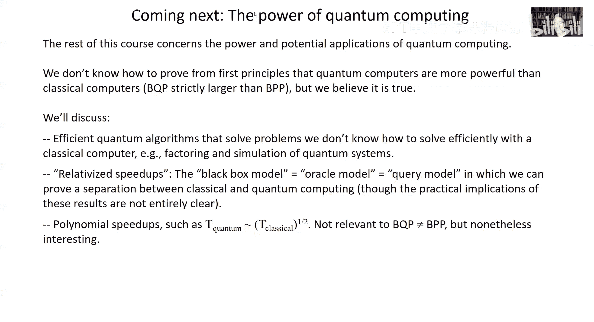

# 加州理工学院《量子计算｜Ph219⧸CS219 Quantum Computation Fall 2020》中英字幕 p14 -14-Ph CS 219A Lecture 12 Quantum Circuits II.zh_en -BV1KgffBoEUc_p14-

Okay。Welcome back。Good to see you for more Qua fun。 I hope you like quantumum circuits。

 We're going to be talking about them some more today。😊，So let's get going。

So remember last time we talked about quantum circuits and some essential facts about them。

We talked about the importance of accuracy when we consider real physical hardware to。

Simulate an ideal quantum circuit we're interested in。

 it was pointed out that it's good enough for our actual physical gates to have an accuracy that scale capital T if we want to be able to perform a useful computation with capital T gates that is the errors accumulate linearly with the circuit size。

嗯。We talked about for a typical unitary transformation in the unitary group of Nqubits。

 how large a quantum circuit is needed to accurately approximate that unitary transformation we saw。

The circuit size needed to be exponentially large and end to provide a good approximation for most unitaries。

 there's a corresponding statement about states for most states in Hilbert space if I want to closely approximate that state starting with the product state。

 we need a quantum circuit with a size which is exponential in the number of qubits。

We talked about the。Task of simulating what a quantum circuit does using a classical computer。

And although the naive simulation requires exponentially large memory because we need to keep track of a quantum state in an exponentially large hilbert space。

 how we saw that by using a kind of some over historyies trick。

We could do that simulation still with an exponential cost in terms of the time complexity of the classical calculation。

 we could do it with an amount of memory which is polynomial in the number of qubits that is。

BQP is contained in the classical complexity class P space。

The decision problems we can solve with a polynomially bounded amount of memory。

And we talked about the question of exact universality。

And we saw that if we wanted to build up exactly any unitary acting on N qubits。

 that is possible using only two qubbit gates。 So if we can get pairs of qubits to interact in a precisely controlled manner doing entangling two qubbit gates。

 that's enough to realize any unitary transformation we'd ever。One for any purpose。

Now today I want to go a little further with the general theory of quantum circuits and in particular。

Remember， in our model of quantum computation， we envisioned。

That we don't have a continuum of possible quantum gates to choose from。Rather。

 there's some finite instruction set。We build our circuits out of gates chosen from a finite alphabet。

One good reason to do that is because in the theory of fault tolerant quantum computing。

 there's just typically a finite set of gates that can be done accurately in and in a way that doesn't spread errors too badly。

 So there's a real incentive for considering that model。

 And what we'll see today is that just a generic entangling2 cubic gate， Of course。

 a generic gate isn entangling is enough for universal quantum computing It's enough for us to be able to approximate accurately if we build a circuit out of such gates。

 any twoquid unitary and that， in turn means that we can build up any uncubbit unitary。

And I also want to talk about how expensive it is to simulate one set of universal quantum gates with another。

 let's say we have a universal set of gates which are twoquid gates and at least I have such a computer and you have a different computer with a different instruction set with a different set of universal twoquid gates and if I want to simulate what your computer does。

 I would like to build circuits out of my gates that closely approximate each one of the gates in your alphabet and we'd like to see how large a circuit I need。

To do that。So let's start with this question of understanding how to get universality out of。

Out of a finite alphabet， of course。The unitary transformations form a continuum。

 so we can't hit everyone on the nose from any finite circuit of finite size。

Because there are only a finite number of such circuits。

 if the circuit size and the alphabettic gates are finite while they' are an infinite number of unitaries。

So the task we want to consider is accurately approximating any unitary， so let's say we have。

Little Nqubits we're considering transformations that are unitaries acting on the two to the undimensional Hilbert space here I said SU SU meaning determinant one。

 the point being just that I don't really care about the overall phase。

 so let's say there's some target unitary which has aminant one。

And then what I want to do is find a circuit built from my gates。

This alphabet of putatively universal gates。Which approximates in the soup norm。

Or whatever your preferred norm is， but super normalor will be good enough for us。

Approximates with an error at most epsilon that target unitary or i'd be okay if I get the target unitary with some different overall face since I don't really care about the overall face so really what we want from our universal gate set。

Is to be able to realize with。Circuits of finite size。A dense。Subset of all the unitaries， dense。

 meaning that for any element of S2 to the N。I want there to be some finite circuit。

 which gives me a unitary， the circuit provides a unitary。

 which is within distance epsilon of that specified target unitary。In the unitary group。

So let me first describe a simpler instance of such density。

 let's suppose I'm just considering a rotation on the B sphere about the z axis by an angle which is an irrational multiple of two pi。

 I wrote it as E to the two pi I alpha where alpha is an irrational number。Times Z。

 the poly operator Z。And let's consider the powers of that gate so I have this one rotation about the z axis and I can apply at any number of times I want any positive integer number of times k equals 1。

2，3 etc， So I claim that actually gives me a set which is dense in the rotations about the z axis that I can come as close as I want to any rotation by any angle about the z axis by taking some suitable power K applying my gate E to the2 pi I alpha Z altogether K times in succession you can see this is really equivalent to the following question。

Because the rotations are compact because。嗯。E to the2 pi I z is equal to the identity。

 and z has eigenvalues plus and minus1。The rotations。Are equivalent to a circle。

 you can think of that as a periodically identified。Unit interval。

 And so the points that I can realize the different rotations。Our。Multiples of alpha。

 this irrational number by the integer K but modular 1， because you know when I rotate by2 pi。

 I'm back to the identity again， and I just want to know how much additional rotation I have beyond two pi or equivalently here。

 I'm only interested in the non integer part。Of an integer。Alpha times k modulo1。And now I claim。

 first of all， that because alpha is irrational。All that the points I can get on the interval by considering multiples of。

Multiples of alpha and then subtracting away the largest signature smaller than alpha K。

 these are all distinct。How do I know that's true？Suppose it's not true。

 suppose that there are two values of k k and k prime。

 such that alpha times k and alpha times k prime modular 1 are the same， or in other words。

 alpha k is equal to alpha k prime plus some integer， well if that were true。

 then if k is not equal to k prime， then that means alpha is that integer divided by k minus k prime which is a rational number。

But that contradicts my assumption that alpha is actually irrational， so because alpha is irrational。

 we never hit the same number twice as k goes over all the positive integers。

Now that means that once K gets large enough， we're going to have to come close to a point in the unit interval we've hit before。

That is， say a capital K times epsilon is greater than1 then I claim there have to be two integers k and K prime no larger than k or less than k such that the difference between k alpha and k prime alpha mod1 is less than epsilon so why is that well just picture the unit interval and if it's not true then for every point that we've hit as k and K prime range up from1 to capital K。

Every point is always at least distance epsilon away from another point。

 so that means I can consider an interval around each point of with epsilon epsilon over two to the right and epsilon2 over two to the left and all those intervals have no intersection but they're just isn't room for all those intervals because if they're all together a capital K of them and each one of them has with epsilon and the length of the unit interval is just one they won't all fit so they have to start to overlap at some point。

 so once there must be a pair of integers。Both less than capital K。

 as long as capital K is greater than one over epsilon so that K alpha and K prime alpha modular1 are within epsilon of one another。

And now I can take k minus k prime alpha。And I can multiply that by some other integer。

And that means I'll get a set of points on the unit interval。

 which are successfully less than epsilon apart。And if as I let that integer range from。Well。

 as large as it needs to， I get a set of points which。

Ha such that the intervals around them with epsilon completely cover the unit interval， okay。

 so there won't be any gaps left。And so that means that every point in the unit interval at that point is within distance epsilon of k minus k prime alpha times some suitable integer。

 and that's what I mean by density。It means that for any point on the unit interval。

There's some integer such that the integer times alpha Mo1 is。

Less than just send epsilon away from that point。Okay。

 the multiples of epsilon mod1 are dense in the unit interval。嗯。By the way。

 it might take quite a while to get to the point we want because it might be that k minus k prime alpha modular1 is something really small like one over Google or something。

 and then we might have to go to a large value of that integer to get to the point we want of but we can always do it eventually。

Now， actually。We're sort of hampered here because we're just considering powers of one gate and they all commute with one another。

We can navigate around the unitary group and this we're just navigating around U1。

 but in the case of a non a billion unitary group。Like U2， the unitary is acting on aqubit。

 if I have a pair of noncommuting gates， then I can get where I want to go in SU2 a lot faster and the reason is that there are a lot more circuits I can construct when the gates commute then the order of the gates doesn't matter and the only thing that matters here is the integer K the number of times I applied are fundamental unitary。

But if the gates are non commuting， then the number of circuits I can build with altogether K gates becomes exponential in K because I can choose any order of those guys that I want and that means。

I have a lot more power when it comes to getting around you too， but even in the obbelian case。

 even if we're just doing rotations about the Z axis。

 as long as it's a generic rotation by an irrational angle an irrational multiple of two pi then we'll have density in the unit interval or equivalently in u1 the rotation group around a fixed axis there's a similar thing I can say about a unitary that's generic in the case of an n dimensional space so now it's an n by n unitary and I can always go to the basis in which it's diagonal and the eigenvalues are all all complex numbers of modulus one so I can write them all as。

E to the two pi I times alpha J or j equals1，2，3， et cetera up to capital n now generically remember because rational numbers are set of measures zero and all the real numbers generically all those alpha Js are going to be aration numbers and not only that all ratios of the alpha js will also be irration。

 so when I start taking powers of u for any generic Q。

 then I'm going to cover uniformly or get density in。

Each one of n unit circles associated with the powers of each one of these n eigenvalues。

 and furthermore， I can get any combination of rotations。嗯。

wasAbout the you know n different directions in the unitary group， or in other words。

 with powers of generic unitary， I can come as close as I want to any element of the unitary group which is diagonal in this same fixed basis。

 or in other words I can get as close as I want to any element of the form e to the I theta 1 e to the I theta 2。

 dot dot dot up to e to the I theta n。So a generic unitary。In the case of UN。

 the unitary is acting on a capital n dimensional space。If I start taking powers。

 I can get as close as I want to any element of U1 to the N that is any element of this form as long as that's a generic unitary and all of the angles are relatively irrational。

As is the case for generic unitary。Okay， but that's again the obbelian case。

 the non obbelian case is more interesting， we'll get to that in a minute。

Well and I guess we're getting to it now so now suppose I have two unitary transformations and remember I can always write a unitary transformation as the exponential of I times a hermeian matrix。

😊，嗯。And so the remark I just made or a special case of the remark I just made is that if those matrices are Hermeian。

 meaning all the sorry， they are Hermeian， if either the IA。

The unitary matrix has the property that all of its eigenvalues are。

Irational E to the I theta where theta is irrational。Miple of。Of2 pi。嗯。Then。And furthermore。

 the eigenvalues are relatively irrational。Then by taking powers of E to the IA。

 I can certainly get any unitary operator of the form， well here I wrote E to the ILA。

 but now I just mean alpha can be any real number。And likewise。

 I can get any operator the form e to the  beta B by taking powers of e to the oddd b。

So it's often convenient to think about the unitary transformations in terms of their corresponding the algebra。

 the hermeian matrices which so to speak generate。The unitary elements。

 which can the ones which are exponentiated to get unitaries。

 So here we're just saying that you can think of。That。

Space of generators is being like a linear space。If in the case of the things that we can reach。

 in other words， get arbitrarily close to。If E to the IA has that property or in other words。

 if a is such a generator， then so is a times a real number， hence if E to the IB。I such a unitary。

 if B is the generator of a unitary in our set， then we can get as close as we please。

To B times any real number as a generator or even to the I beta B as a unitary， and not only that。

 we can not only take these generators and multiply them by real numbers。

 we can also take linear combinations of them。So that if a is a generator of。

A unitary in our set of gates。And B is also such a generator then it's also possible for us if they're generic。

 if A and B are generic。To get as close as we want to either the eye times any linear combination of A and B。

ok。Forget about alpha and beta for a minute， well no I guess I didn't forget about them here they are okay that's fine。

So think about it this way， so we I've already told you I can get as close as we want to e to the I alpha a that's also true of many multiple of E to the I alpha a。

 so let's consider e to the I alpha a where n is a very large integer。

And E to the I beta B divided by n， I think I forgot to say divided by n E to the I alpha a divided by n where n is a large integer and e to the I beta B divided by n where n is a large integer。

 take the product of the two， and then take that product and raise it to the n power。

 and then let n get really， really big。And then we can ask。

 what unitary does that get close to in the limit of very large n？

So the I'm considering matrices A and B， which。You know， have bounded norm。

 so it's perfectly fine to expand the exponential in power series。And when I do so。

 when I expand EDI alpha over n。I'll get one plus I over n alpha a。

 that is e to the I alpha a over n。嗯。For in the leading order。

 I get one plus I over n alpha a and then higher order terms， which are of order whoops。

Which are of order1 over n squared， likewise for e to the I beta B over n， I expand that exponential。

 I get1 plus i over n beta B plus higher order terms。And then I raise that to the N power。

And now I know that。The limit of。1 plus x over n raised to the unth power is E to the x。

 That's true for matrices， just like it is for numbers。 And so when I take the limit。

 I just get the exponential。Of I。E to the I alpha a plus beta B as shown here。

So that means that once I have a unitary in my gate set that。

E to the IA or gets very close E to the IA， and the same thing for e to the IB。

 that'll also be true for e to the I alpha A and E to the I beta B if A and B are generic。

 and then by constructing circuits like this，In which A and B alternate many times。

 that means I can get as close as I want to E to the Ilf a plus B to B。

 So in the Lee algebra language， if I think of the generators of the sets of unitaries that I can reach if。

A is such a generator and B is such a generator then so is。Alpha a plus beta B。

So the generators really form a linear space， they form a vector space。

 and they're closed under more than just taking linear combinations。

 they're also closed under commutation。So I claim that it will also be the case。

 if I can reach e to the IA and E to the IB， both are generic。

 then I can reach e to the Imma commutator of a with B for any gamma。Okay。

So how do I see that that's true， Well， now I consider constructing a circuit like this。

 first of all。I guess I forgot about the I didn't bother with the alphas and betas here。

 you can imagine those are just absorbed into A and B at this point。

But the point is that if I know how to reach E to the eye， alpha I can reach。

Sorry E to the I I can reach e to the I times times any number if a is generic so in particular I can consider。

Getting as close as I want to E to the I over the square root of n and E to the IB over the square root of n from those guys。

 I construct a circuit in which I alternate E to the I over square root of n。

 E to the IB over square root of n E to the minus IA over square root of n E to the minus I be over square root of n。

嗯。if I can get any multiple of a， if I can get positive multiples， I can get negative ones too。

And then I take that and I just repeat it n times okay。

 so i'm taking the n power of this product of four unitaries now I consider again end to be very large so I can do my power series expansion。

And now we have to keep track of a lot of terms。So let's do that。First of all。

 there are terms coming from when I expand the exponential of e to the IA over squared n e to the I B over squared n where。

A hits B here。 There's a minus sign because of the two eyess。

 There's a one over n because of the two， one over a square root events。

 And so that's going to give me this term。 I have one， of course。

 which is the leading term plus in order one over n。 Oh， I look， I forgot to take it to the n power。

And that's okay。But the whole thing should be taken to the end of power。

 so I just got one over n times minus ab from this term of order one over n。And of course。

 there are terms which are higher order in one over end that I haven't indicated here。

That's where the minus A B came from。 It came from this IA hitting this Ib。Well， I can also expand。

Well， when I expand， I get the term where IA hits minus IA。

 and that's going to give me multiplied by one over N this a squared term。

And then I can have this IA hit this minus Ib and that's going to give me this plus Ab。

And I also have this IB hitting。This minus I A and that gives me the plus B and that have I b times minus Ib and that gives me plus b squared and then I guess I have one more minus IA times minus Ib and that gives me the minus AB。

But then I get additional terms from expanding each one of the exponentials to quadratic order。

 so that's going to give me when I expand E to the IA over square root of n to quadratic order。

 there's a term which is minus1 half because the I gets squared。A squared times1 over n。

 so here's the one over n， which I took out in front。

And I have such a term minus-1 half a squared from expanding this exponential plus B squared from expanding this one。

 plus a squared by expanding this one， and plus B squared by expanding this one。

 And now we notice there are a lot of nice cancellations。

Because here I have a squared and here I have a multiplying one over n。

 and here I have minus a squared， and here I have plus b squared， and here I have minus B squared。

And then。I have a minus A B， and I have a plus A B， but then I'm left with a B A minus A B。

 That's just the commutator of B A and A B。 I flipped the sign here。

 so I wrote it as minus1 over n and wrote the commutator as A B minus B。

 and then the other terms are higher order。Because they come from higher order terms and the expansions of the exponentials。

 like， for example， if I expand the exponential of e to the IA over square root of n to cubic order。

 there will be a term which is awarded order or1 over n to the three hals。And now remember。

 I'm taking this whole thing and raising it to the unth of power。And when I do so， again。

 I can use the formal limit property， the one minus x over n race to the n is e to the minus x。

 and so this becomes e to the minus the commutator of A and B。

 So what I'm saying is that we can come as close as we want to A and we can come as close as we want to B。

 we know how to construct a circuit like this， which was going to come as close as we want to the commutator of A and B or what I just said was really a shorthand for saying that the exponentials which are the unitaries of E to the IA and e to the IB are in our repertoire we can come arbitrarily close to them and then that will also be true of E to the minus the commutator of A and B。

Remember， if A and B are both hermeian， then their commutator is anti hermissionian。In other words。

 I can write this as I times something that's hermeian。

 so this is E to the I times a Hermeian operator， which is a unitary as it must and should be。

So for example。Let's suppose I have two elements of SU2 which are both generic。

 nothing special about them， there any elements aside from some set of measures zero which are special。

And generically， of course， they won't be commuting。 And just。

 just building circuits out of those guys will be enough for me to get as close as I want to any element of S U2 to get anywhere。

On the black sphere， if you like， starting from some initial state。So I can write。

One of the unitaries， if I write it in the basis in which right。

 I choose the Z basis to be the basis in which it's diagonal。

 then it's just going to be e to the IZ times some number。

So we can think of alpha Z as being a generator， the other guy doesn't commute。

 so it might have a component along the Z direction on the B sphere and then there's some component orthogonal to Z and I can line up my axie so that's actually proportional to x and so the generator of the other element is going to look like beta z plus gamma x。

And now I know I can also get as close as I want to the commutator of the two。

And the commutator of the two is going to be proportional to y generically alpha beta。

Gmma are all irrational， so is the product of alpha times gamma and so this means that from the commutator I can build up any rotation I want about the y axis and。

A general unitary in S2 can be written as the exponential of a linear combination of x。

 Y and Z because a general hermeian operator can be written as a linear combination of X Y and Z。

 so from our property of closure under addition or undertaking linear combinations and closure under multiplication。

 we see we can get as close as we want to any unitary。

 we have density in the single qubit unitary group。S you too。

Now the same kind of idea can also be applied to SUN for larger N。

 we're particularly interested in SU4。Because I want two cubic gates。

 I want to get as close as I want。To any twoqubbit gates。

 we know the two cubbit gates are exactly universal， so if I want density。

 I want to be able to get as close as I please to any element of the twoqubbitid unitary group that's S4。

The Hilbert space of two qubits is four dimensional。And if I can get as close。

 I want any element of S4， S4， because I don't care about that overall phase。

Then I can build circuits from those guys to get as close as I want to the unitary acting on Nqubits。

 right？Now that group S4 actually has 15 generators， in other words。

 the space of four by four traceless ormeian matrices traceless because I'm talking about S4。

 the determinants is one， that's the analog of x， Y and z， but for S4 instead of S2。

 and the set of three generators there are then going to be 15。嗯。

But what's going to happen is if you choose two elements of that S4 the algebra to generators。

 and then you take commutators and then you take commutators with the commutators and commutators with the commutators with the commutators and so on as you build up longer and longer strings of nested commutators。

 there's no reason why you won't fill out the whole Lee algebra。

The only way that could fail would be if somehow those nested commutators eventually close。

On some sub algebra， we don't get all of the hermeian matrices， but just some sub algebra of them。

 that's not generic that only occurs for some set。Of measure zero of the possible generators。

 so really if I have two elements of su4 and generically they won't be commuting and theyre generic elements start taking commutators。

 I can generate the whole the algebra that means that I can get as close as I want to have a unitary。

Here's another way of looking at it。 I already told you that if you just take a generic element of S4。

And you start taking powers of that。Then that's going to be dense and U1 cubed， in other words。

I'm talking about SU4， that's why it's U1 cube， not U1。To the fourth。And。

There's next door overall you want， in other words， which I'm not paying attention to now。And。

So as suppose you have two such elements， two generic elements of S4 they're not going to commute。

 they won't be diagonal in the same basis， so powers of one of them generates or you know is dense in gets as close as you want to any element in。

U1 cube and powers of the other one gets as close as you want to any element of a different U1 cube associated with a different basis。

 and there just isn't any subgroup of S4 that contains those two non commuting。

U1 cubes and so the only thing that can happen， the only group you can get by multiplying these elements together and they are a group of course。

 because you can multiply them to get new unitaries and they all have inverses the only group you can get is all the S4 once you've got those two u1 cubes okay。

So that's already enough to see that if you take two generic elements of SU4。

 circuits constructed from them are going to give you all of SU4。And you can also say this。

 suppose I just have one unitary， one generic unitary。But I'm applying it to two qubits。

And call thequbits one and two。Well， I can apply it to qubits1 and two。

 but suppose I apply it in the other order， I kind of change the names of the qubits and I apply it to qubits two and one。

Well， that's the same unitary， but it's now just being applied。The opposite order of the qubits。

If you can do one， there's no reason why you can't do the other or another way of saying it is if I swap the two qubits and then do you and then swap again。

 I get some other unitary and generically it's not going to commute with the original unitary U B and you will be non commuting。

So just by conjugating by the swap， given one generic unitary。

 I got another unitary that it doesn't commute with， and now with those two unitaries。

 I'll be able to generate everything in SU4。So in fact， just one generic two qubit unitary。

 an element of su4。If I can apply it in either one of the two orders。That's enough。

For me get density in SU4 to get as close as I want to any two cubic gate and because we already know the two cubic gates are exactly universal。

 that's enough to tell me I can get as close as I want to any unitary acting on N cubits。

So that's the story for generic gates， universality is extremely typical， it's hard to avoid it。

 only by choosing very special sets of unitaries do once you have an entangling tooquid unitary at all。

 can you avoid having a universal set of gates？Which is not to say that the gates are non generic that。

Universality can be missed can be evaded， for example， although it's true that if I have two。Generic。

Elements of SU2， that's enough to generate everything in SU2。No generic choice might for example。

 be the head of our transformation， you remember that one we've talked about it before。

 it's the one that flips the X and Z axes。And the matrix x， or rather s。

 which is a 90 degree rotation about the z axis。Which for some reason I called P on the homework。

 but most people call it S， so that's what I called it here。Those don't commute。

 so they generate not a non aveian group。😊，But it's not the whole unitary group。

 it closes on a finite subgroup of SU2， it turns out to be the symmetry group of a square。Well。

 that kind of makes sense because a 90 degree rotation is a symmetry of a square。And the heamard。

Actually you can think of as because it interchanges the X and eaxxes。

 it's a rotation about a diagonal through the cube which flicks the Xon eaxxes。

 and so those are both transformations that map a square to itself and when you compose them you'll always get transformations that map the square to the square。

 in other words the symmetries of the square。That's equivalent by the way。

 to the symmetries of the octahedron， the octahedron and the square had the same symmetry group。

 they're sometimes said to be a duall polyahedra。In fact， the finite。

No a billion subgroups of SU2 are all well known， they're the symmetries of the so called platonic solids。

 the regular solids。In three dimensions， the square in the octahedron。

We can also consider the dedeahahedron and the acoahedron， which are also a dual pair。And that's it。

 so if your gates， which are non commuting。Don't close on those nonbilian groups。

 there's also the group of the tetrahedron of course。

 but if it doesn't close on the symmetry group of one of those platonic solids。

 it's going to be dense in S2 okay。It turns out that with that hadamard and a rotation about the ZX by 45 degrees instead of 90 degrees。

 there's no platonic solid preserved by both those transformations。

 and that actually gives you density in SU2 if you build circuits out of those two noncommuting gates。

All right， so so far we've been talking about reachability， as you've seen， I've given you rather。

Rather hand waving arguments， and I'm not going to be any more precise about that today。

 but I hope I've given you a good taste of what it takes for a set of gates to achieve density in the unitary group and that that's a very generic property。

Now I want to talk about not just whether we can get。

As close as we want to some target unitary transformation。

 but also how large a circuit it takes to get there。

 what's the complexity of approximating some unitary。

 how large a circuit does it take to get a good approximation to some specified element of the unitary group。

And we're going to see that there's a nice algorithm that tells us we can do that pretty efficiently once we have a set of gates which will necessarily be non commuting。

 which form a fine enough net in the unitary group， So what a net means is that。

I'll say an epsil on that。It's a finite set of unitary matrices， elements of UN。

 unitaries acting on an ndisional space， such that every element of UN is within distance epsilon of some element of that finite set。

I called it a repertoire here and denoted it by。By scriptar。

 and now I'm going to be interested in taking such an epsilon net。And。

Making a finer net by composing circuits of the elements of the net。

So you can think about it this way， suppose I have a couple of non commuting elements。

Of unitary group， let's say S2 like the example I just gave let's say it's the hadamard and the T gate the rotation by 45 degrees about the sea axis and then I start building circuits out of them and。

Different circuits are going to generate different elements and after a while I have circuits which are not very long and I'm going to have an epsilon net because there's no reason why I wouldn't get one because of density we know we come as close as you please every element so for some epsilon which isn't terribly small I can get an epsilon net by composing rather small circuits I could just generate them randomly until I get the epsilon net it won't take long but now I want to know what it takes to get a much better net。

You know， I would like to get maybe my original epsilon nu has epsilon equal to a 10th or something。

 but I'd like to get epsilon equal to 10 to the minus8。well。

 if I just start generating random circuits， it'll take a long time。

 I'd like to have a much more efficient way of doing it and that's what I'm going to describe an algorithm do to salivve Kataya for finding such a good approximation once you have an epsilon net。

And the way the argument goes is we carry out the procedure of getting better and better approximations recursively。

And the key claim is this。So suppose I have。A repertoire， which is an epsilon net。Then I claim that。

 oh， there's another important thing I don't want to forget to say。

 and that is this repertoire has the property of being closed under inverse。

 the argument that I'm going to give is going to require that。

 so that means that if any unitary is an element of R then so is its inverse。Now， of course。

 in the case of the example I gave the Haammard and the Tgate that will be easily satisfied because the Haammard is its own inverse。

 h squared is equal to the identity， and the Tgate has the property since it's a 45 degree rotation。

About the Z axis。That if you repeat it。It's a rotation by pi over4， you repeat it eight times。

And you get a rotation by two pi， which is。Actually for a qubit that's the same thing as minus one。

 so up to an overall phase it's it's the identity。And so in other words。

 the inverse of the Tgate is just doing the Tgate seven times。

 so that's certainly in the we can include that in our repertoire once we have the Tgate and then we can start making circuits out of the H and Tgates and the inverses of all of them will be in our repertoire since the inverse of T and H are in the repertoire and now I've got R and it's an Epsilon net。

And now I want to build circuits out of the elements of our。Which give me a finer net。

 give me a better approximation to any element of the unitary group。

And so I claim the following thing。That it just takes circuits of size5。

Constructed from the gates in the original repertoire are。Those circuits。

 I'll call a new repertoire are prime。These will also be closed under inverse， if the original ones。

Or， I guess that's clear because I can take since I have inverses of all of the gates。

 I also have inverses of all of the circuits of such gates of size5。

But the key thing is that this is an epsilon primeNe。Where epsilon is of order。

 epsilon to the three/ hs。 so if epsilon is small， epsilon prime is going to be smaller。

 Well actually there's some constant C and we won't try to work out exactly what it is。

But the point is that it's a constant， so once epsilon is small enough。

Epsilon Prime will be smaller than Epsilon。And we'll have a finer net using the circuits of size five constructed from the repertoire than the net that we began with。

So I'm going to show you that in a minute that。It is possible to get an order Epsilon 35。

Net from circuits of size 5 from the original repertoire。 But let's first see what it implies。

 The important thing is that we can do it recursively。

 once we have a way of making the error smaller。We can do it again。With the new Epsilon Prime net。

 I can insert circuits of size5 out of those and I can get an epsilon prime prime net and that's going to have an even smaller error。

And I can keep doing that。Okay， so I guess that's what I was saying here I do， however。

 have to assume that the original epsilon is small enough and how small is small enough depends on the value of this constant。

So I'm going to say， all right， we're going to start our recursive procedure with an epsilon zero net and I'm going to ask epsilon zero to be less than this constant1 over C squared okay。

 so what this claim says。Is that if I construct circuits of five gates from the repertoire r0。

 that's going to give me an epsilon1 net and Epsilon1。Willll be C epsilon zero to the three hbs。

I can write that as C squared epsilon zero oh that doesn't look right okay that's right to the one half times epsilon zero So under my assumption that epsilon zero is less than one over C squared this is a number less than one multiplying epsilon n and so epsilon1 will be strictly less than epsilon0 and I have my finer net and then I just keep doing that I construct epsilon2。

As circuits of I construct R2， circuits of size5 from repertoire r1。

 and that's going to be an epsilon2 net with error C epsilon1 to the three/ hals。And so on。

 So in other words， each step of this recursive procedure。After we've done a K times。

I'll have an epsilon subcaine net。Where C squared epsilon sub K is c squared epsilon K minus1 raised to the three halves。

 this is the same thing as what I wrote here because C squared raised to the three halves is just C cubed and then if I divide by C squared。

 that's the same thing as saying epsilon K is equal to C epsilon K minus1 to three halves。

 but I like writing it this way because that makes it particularly easy to see what happens when we recursively iterate this procedure。

Multiple times because each time what happens to epsilon is that the c squared we had on the previous round gets raised to the three halves power so after I do that k times C squared epsilon zero gets raised to the3/ half power altogether k times so in other words it gets raised to the power3 halves to the K。

So the error that I have after。Applying this recursive procedure altogether k times is doubly exponentially small in K。

ok。Because I have this small number here less than one。

 and it's getting raised to a power which is exponential in K。That's really the key point。

 the air is getting doubly exponentially small in K， the circuit is also getting larger。

The recursive procedure is going to blow up the size of the circuit by a factor of 5 every time I go from level K minus1 to level K。

 right？Because I need a circuit of size five， the five。

 the next level down to get the repertoire level K。

But that circuit size is increasing only exponentially。

compared to whatever the original circuit size was that I needed to get the original Epsilon zero net。

The circuit size for level K， the hierarchy relative to that initial circuit size will just be5 to the powered K。

But look， if I take logarithms at both sides here， I have three halves to the K。

Equals the log of1 over c squared epsilon k divided by the log of1 over c squared epsilon0。Well。

 I could have written this as log of c squared epsilon K instead of1 over。

 but that's a negative number because it's the log of something less than one。

 so I just have a negative number and numerator and denominator here that I divide it out and wrote it as the log of a positive number。

So what that means is that this blow up in the circuit size when I go to level k， which is5 to the K。

Of course， that's three hvebs to the K raised to the power log five over log three hbs in whatever base logarithm you prefer。

And but now if three hals to the K is equal to this。

 then it's just the log of one over c squared epsilon k divided by the log of one over c squared epsilon zero race to a power。

 log five over log three has。So that's just a number， it's about 3。97。So what does it mean。

 it means that if I want to achieve some accuracy epsilon in my approximation。

Building circuits out of the original repertoire。The circuit size that I need is increasing only polylogarithmically with one over epsilon where epsilon is the error。

 just some power of a logarithm of one over epsilon。

Is the cost and circuit size for getting that approximation？What made that work？

Is that the approximation gets doubly exponentially better as we increase K。

 the level of the recursion， whereas the circuit size is increasing only exponentially。

So it remains to show the claim I have to convince you that I can really do this。Okay。So。

We can say the following thing。Consider any unitary in UN。That's our target。

And we want to approximate it with a very small error。Well， first of all， because we have a。

Epsilon Ne to start with。There will be some element of our repertoire。

Which is epsilon close to the target unitary。In the soup norm。

 that's the norm i'm going to consider we've seen that it's a useful norm for considering the accuracy of unitary gates in our。

Previous discussion of how errors is accumulate。Now I can equivalently write this as the soup normor of u uilda inverse minus identity is less than or equal to epsilon。

 that is u being close to utilde is the same thing as u uilda inverse being close to one。All right。

 so now what I'm going to do is here I've got something which is close to the identity。And。

I would like to find a unitary which I can construct as a circuit from my repertoire。

 which is close to this U U tilde minus1 okay now this guy is already close to the identity and deviates from the identity by only epsilon。

 so the w that I'm looking for is also small and I'm going to take advantage of the smallness of w and a u u tilde inverse to do an expansion in that small number epsilon when I consider the unitary so in other words。

 I'm going to be able to write them as the exponential of a unitary sorry。

 the unitary will be the exponential of a hermeian operator where that hermeian operator in the soup norm is epsilon small。

Because when I expand the unitary in a power series。I get one plus IA。

 one plus order epsilon plus higher order in epsilon。

And so once the unitary is close to the identity， I can write it as E to the IA where a has a small soup norm。

Okay。😊，So what I want to do is find the W we're looking for。

Which is going to give me a good approximation to U uilda inverse。And in fact。

 I'm going to construct such a W。As a circuit of gates in our repertoire。Which is。

I circuit at length four。Okay。And that'll be good enough。

Because this is the same as saying that U minus W utilda。

Is epsilon prime close to U if I was able to find W such that U uilde inverse minus W is less than or equal to epsilon prime。

 So this is my goal。 If I achieve that goal， then I have this。

 But now W utilde is something I know how to construct。 Utilda was in the original repertoire。

 W is going to be a product of four elements of the repertoire。

 So W uilde is a circuit of five elements in the reservoir。So that's what I wanted them to show。

 so what's missing is I have to show you how to find W。Which is epsilon prime close to this unitary。

 which is epsilon close to the identity， where epsilon Prime is order epsilon to the three halves。

That's where we make the improvement in the net that we are able to go from Epsilon。

 the distance this guy is from the entity to Epsilon Prime a border epsilon to the three halves。

 how close W is to this guy。Rightい。And now I just have to do some。Well， you'll see what I do。

All right。So remember， I'm trying to find a W， which is e to the IA where a is a order of epsilon。ok。

嗯。Sorry， I want to find W， which is close。What did I mean by this？Okay， all right， to find W， I see。

 to find W， here's how we find W。All right， U u inverse。

 I'm going to write as E to the IA because this is epsilon close to the identity。

 I can say a is order epsilon。All right， now one thing's for sure for any A， which is order epsilon。

 I can find maybe I have a lookup table for this or something。a。A hermeian pair。

 a pair of Hermeian operators， which are both of size epsilon to the one half。

 such that their commutator is equal to minus IA。And so。

A is something that let's say we know precisely。And so there's some B and C。

 which in principle I can know precisely。Such as that their commutator is equal to minus IAM because A is order epsilon。

And this is order BCc， I can choose B and C to be a border epsilon to the one half。Okay。Now。

 because our original repertoire is an epsilon net。That means that。E to the Ib。Is Epsilon close？

To some element of the repertoire， which I'm going to call E to the I B tilde。

E of the IC is epsilon close。To。Some E to the I see Tilde， which is in the repertoire， okay？And。

These unitaries being epsilon close if I expand the unitaries。That's the same thing。

As B minus B tilde being order epsilon and C minus C tilde being order epsilon， okay？

Now we use the important property that the repertoire is closed under inverse。

I will construct W as E to the I B Tilde。Eer the I see Tilda。See tilda。

These guys are all in our repertoire。And because it's close under inverse。

 if E to the I be be tilde isn't it， so is E the minus I be tilde， if E to the IC Tilde isn't it。

 so is E to the minus I Tilde。But here's the key point。The terms of order。嗯。

Epsilon here or the terms of order， Epsilon to the one half。Cancel。

Because B Tilde is order epsilon in1 half， but I have a minus I b tde and plus I be telde so those guys cancel one another。

And I have an IC Telde， which is order epsilon to the one half and a minus I Telde。

 which is order epsilon to the one half， and those cancel one another。

And so the leading terms which survive when I expand things out are the commutator of B Tilde with C Tilde plus terms which are higher order come from expanding the exponential to higher order and B Tilde C Tilde B Tilde and C Tilde。

This is the only term of order epsilon there is and there's no term of order epsilon to the one half。

Okay。And。What was essential was that because of closure under inverse。

 I could get an exact cancellation of the order epsilon to the1 half errors between the unitary E e to the IB tilde and the unitary e to the minus I b tilde。

Okay， even though these guys， either the I be Tilde and the IC and Tilder。Don't commute。Okay。

 so now what is W， well here I wrote it in terms of the Tildades。Which are in the repertoire。

 but now let's write it in terms of B and C， which have the property that the commutator of B with C is precisely IA。

So W is the identity minus， here's I've rewritten the commutator of B tilde with C tilde is b plus order epsilon。

 commutator with C plus order epsilon。And then the higher order terms。I get the commutator of。

B with C， which is minus I and because of this minus sign， that becomes 1 plus I。

Everything else is of order Epsilon to the three/ halves。ok。

Because I have a commutator of this order epsilon term with this order epsilon to the one half term。

And a commutator of this order epsilon to the one half term with this order Epsilon to the one half term。

 those are all of order， Epsilon to the three halves。So。W hits its target。Which was e to the IA。

 remember e to the IA is when I'm calling you uil the inverse up to an error。

 which is order epsilon to the three halves， we did it。We managed to make the order。

 although it was order epsilon and the original repertoire。

 it's now order epsilon to the three halves。In our repertoire。Constructed as well gates of size four。

From the original repertoire。That's what it took to get a good approximation to U utilda inverse。

 that took a circuit of size4， but that means we have a circuit of size5 w times utilde。

 which gives me the approximation we were looking for to the target unitary with this error which is of order epsilon to the three/ halves。

So that's how the claim works。ok。And of course， since I made this remark before but。The new。

Repertoire is also closed under inverse because in R we had in the repertoire the inverses of all the elements。

 so any circuit that we can construct。In particular， the circuits of。Size5。

 the inverses of the circuits are also in the repertoire， if I take the inverse of W for example。

 that's is going to be e to the IC E E to the IC tilde E to the IB tilde。嗯。

E to the I minus I b tde e to the minus I telde， so it's a similar string but in a different order and so since。

All four of these guys， either the IB， Tilde， either the IC Tilde， e to the minus IB Tilde。

 and e to the minus I Tilde are in the original repertoire， we can construct W。

 we can also construct W inverse。And。And that shows that it works。

So we've shown the claim and then the recursive argument shows。

Oh what I claim this sulliva cattaath algorithm。Once we found our epsilon net。

 where Epsilon is small enough， I didn't tell you what the constancy is， but。Anyway。

 you see how the idea works。Now we have a method for constructing a circuit。

Whose sizes only a power of a logarithm upon over epsilon that approximates any target unitary。

To the error epsilon。Now I didn't talk about the classical cost of finding this circuit。

 I only talked about the size of the quantum circuit。At least I didn't talk about it explicitly。

 but it was kind of implicit that it's not too hard。

Because the classical procedure is a recursive procedure。And each time。

 essentially we do the same thing every time。So we every time we。

You know we have to call a circuit of size5 to construct each one of the elements in that circuit of size5。

 we construct them as circuits of size5， the next level down and those as circuits of size5 the next level down so in other words each time we add a level to the hierarchy we're increasing the classical complexity of the procedure of finding the circuit by just a constant factor so the classical cost is exponential in K just like the quantum circuit size is exponential in K。

And that means when expressed in terms of epsilon， the classical cost of finding the circuit is a power of a log of one of Epsilon as well。

So we can find the circuit exponentially and it's an efficient circuit with a size that only grows polylaarithmically in one over epsilon。

You know， it seems like a bit of a miracle that it could work。

Because we started out with gates which had an order epsilon Air and we built circuits out of them and as we discussed in the last lecture。

 if you build a circuit out of gates， all of which have order epsilon，Then。

You would expect the error to accumulate so you'll have an error which is of order epsilon times the size of the circuit that's not what happened here。

We actually wound up with a smaller error for the circuit than for each one of the individual gates。

 How do we make that work， Well， it's because。We were able to cancel the leading order Epsilon error。

 And what made it possible to cancel it was that our gate set was closed under inverse。

 So we had a way of getting the leading errors to cancel and the non leading errors were。

Larger than Epsilon by some power of Epsilon， namely three/ halves。And so repeating that。

 we were able to get smaller and smaller errors quite rapidly at a relatively small cost in increased circuit size。

So this is a very powerful result， it's very general。😊，Let's say you want to run a quantum algorithm。

You figured out how to construct the unitaries you need for the algorithm。Out of two Cid gates。

 but now I have a machine which can only do certain hardwired unitaries。

 maybe because it's a fault tolerance machine and to get fault tolerance。

 there are only certain unitaries that I can do with good accuracy。And。

I've got to figure out how to compile your circuit using my gate set。

 but it's not so bad for each one of your twoqubit unitaries。I。

 no matter what my gate set is as long as it's universal。

I'll be able to find a circuit of my gates that approximates the unitary that you want to some specified error now if your circuit has size capital T。

 then I'm going to want the error per gate to scale like one over capital of T。

So I'm going to want to make that epsilon go like one over square root of t。

 but that only counts a polylo one over epsilon that only costs us a polylo one over epsilon factor or polylo t so T becomes t times polylog t it's not such a big deal to approximate the ideal circuit with the particular instruction set。

I have。Yeah， that number， which was。Log five over log three halves。It's about four。

 a little less than four。For some gate sets we can do better。

 the salive Kaya argument works for any gay set， which is really nice。

But for some gate sets they have a really nice structure which allows us to do better， in fact。

 there are case is known where I can get the approximation to work。下。With a number of gates。

 which is just one power of logarithm， not 3。97 powers of logarithm of one over epsilon。

And that's actually the best we can do because remember， we had that argument。

Just from counting circuits and counting the balls that we need to cover the unitary group。

If we want to could be， you know， SU4， the two Cupid gates。

 I'm trying to cover them with little balls， the number of balls that I need is going to be exponential in one over epsilon。

And。The argument。You know， essentially was the number of circuits grows exponentially with the circuit size and if we want to be able to approximate any unitary。

 then we're going to have a circuit size which goes with the error like the log of a constant over the air epsilon。

So for some fixed n， like in this case， I'm talking about n equals four to get better and better accuracy。

 I have to increase the circuit size like log one over epsilon。

If I want to get as close as you want to any unitary in the group。So that's actually necessary。

 so the fact that there actually are gate sets for which。

It's provable that log1 over Epsilon is enough， that's a very pleasing result。Okay， so。

That's pretty much what I want to say for quantum circuits。Finally。

 we will be ready to move to the discussion of applications of quantum algorithms。

 that's where we'll dig in at the next lecture。Of course。

 what we want to confront or say something about is the big zillion dollar question about quantum computing。

 is it really powerful， does it have applications in particular ones that the world cares about practical applications？

That we can run efficiently on quantum computers， by which we can't run on classical computers。

 problems we can't solve efficiently with classical algorithms。

From a complexity theory point of view， the question is， is it true that BQP。

 the decision problems we can solve with uniform quantum circuit families really is strictly larger than BPP？

The decision problems we can solve with uniform randomized classical circuit families。

Well we believe it's true， that's why I'm teaching this course， that's why I and many others are。

Eagerly pursuing quantum computing。 We think it's powerful。

 We think it can do things that we can't do otherwise。 But， you know。

 we don't really know approve that， not from first principles。

 complexityplexity theory is hard to really prove。That。

There aren't circuits that can perform certain tasks， that's not so easy。

So how do we make the case that quantum computing is powerful？Well。

 I think the best argument we have。Is， well， first of all， we don't know how to simulate。

Quantum computers。Efficiently for classical computers。

 we think it's not because we're dumb that we haven't been smart enough to figure it out。

 we think it's just because it's very hard to do the simulation in general。But apart from that。

 we do know of some quantum algorithms that solve problems efficiently。

 which we don't know how to solve efficiently with the classical computer though we can't prove it's impossible。

Finding prime factors of large composite integers is one famous example。

 the other famous example is the task of simulating quantum systems in particular。

 simulating how a many qubit quantum system evolves in time as governed by some。

Some physical Hamiltonian so we'll talk about those applications。

 we'll also talk about a model in which we can make precise statements about speedups of quantum circuits over classical ones。

These are called relativized speedups， the modelists variously called the black box model。

 the Oracle model， the query model。The idea is that we have some。Somerout we can call。

 which does something and we。Consider。The we compare。

Sort of making use of that box classically and quantumly where in the quantum case we're able to make use of it on superpositions。

And in the classical case， we're not。And then to measure complexity。

 we just ask how many times do we call that subrtine or in the lingo。

 how many times do we query the block box or query the oracle？

In order to solve the problem in that context， we can make statements。

About a separation in that query complexity， the number of calls to the subrine。

Between quantum and classical methods。And it's also interesting to make statements about polynomial speedups that's not directly relevant to the question of BQP。

 not equal to BPPP， which says that there's a super polynomial separation。

 you know that there are things we can solve。In quantum polynomial time that we can' solve in randomized classical polynomial time。

An example of a polynomial speedup is a quadratic one。

 applications for which the quantum computer runs in a time。

 which is the square root of the classical time。Although it's not directly relevant to separating BQP from BPP。

 it's interesting and something worth discussing， so we'll get to that too。

So I think that's enough for today next time we will start talking about quantum computing。

Maybe this lecture was a little short， maybe I didn't give you your money's worth。

 but actually I'm I think we're a little bit ahead of the game we're at the end of lecture 12。

And I've gone further than I had originally intended in the first 12 lecture lectures。

 maybe that's because I go a little too fast when I'm using these slides。Although。

I'm trying to mitigate that。But anyway， I think we've done enough for now and it'll be nice to start on a new topic fresh。

Next time， so let let's stop it here and I hope I'll see you again soon next time。

Thanks for coming again and listening to me， thrown on and on， I appreciate it。

 I hope you're having fun in the class。Be well and I'll see you again soon， bye bye。

