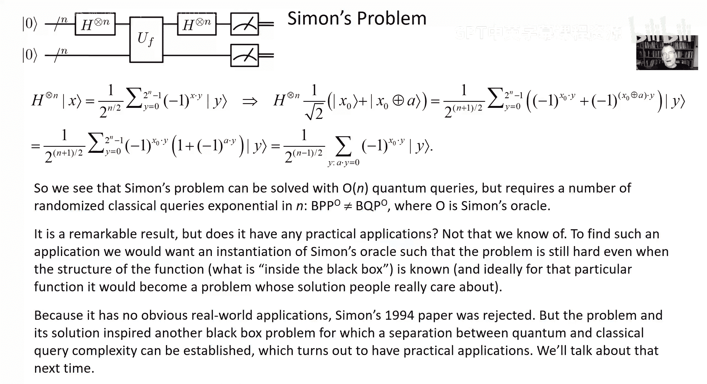

# 量子计算：13：黑盒模型 🧮

在本节课中，我们将要学习量子计算中的一个重要概念：**黑盒模型**。我们将探讨如何通过量子查询来解决某些问题，并展示量子计算相对于经典计算的优势。我们将从简单的例子开始，逐步深入到更复杂的算法，最终理解量子查询如何实现指数级加速。

---

## 黑盒模型概述

上一节我们介绍了量子计算的基本概念，本节中我们来看看**黑盒模型**。黑盒模型是一种理论框架，用于比较量子算法和经典算法的效率。在这个模型中，我们有一个“黑盒”（或称为“预言机”），它可以计算某个函数 `f(x)`，但我们不知道这个函数的具体实现细节。我们的任务是通过查询这个黑盒来了解函数的某些性质。

在复杂度分析中，我们只关心**查询次数**，即我们需要调用黑盒多少次才能解决问题。这忽略了黑盒内部的计算复杂度和我们处理查询结果所需的额外计算。这种模型有助于我们理解量子查询（即允许以叠加态进行查询）是否比经典查询更强大。

---

## 简单示例：Deutsch问题

首先，我们来看一个简单的例子：**Deutsch问题**。这个问题涉及一个函数 `f: {0,1} → {0,1}`，即输入和输出都是1比特。我们的目标是判断这个函数是**常数函数**（`f(0) = f(1)`）还是**平衡函数**（`f(0) ≠ f(1)`）。

在经典查询模型中，我们需要查询两次（分别输入 `0` 和 `1`）才能确定答案。然而，在量子查询模型中，我们只需要**一次查询**。

### 量子算法步骤

以下是解决Deutsch问题的量子算法步骤：

1.  **初始化**：准备两个量子比特，第一个量子比特（查询寄存器）初始化为 `|0⟩`，第二个量子比特（答案寄存器）初始化为 `|1⟩`。
2.  **应用Hadamard门**：对两个量子比特分别应用Hadamard门，得到状态：
    \[
    \frac{1}{\sqrt{2}} (|0\rangle + |1\rangle) \otimes \frac{1}{\sqrt{2}} (|0\rangle - |1\rangle)
    \]
3.  **查询黑盒**：应用黑盒的酉算子 `U_f`，它根据 `f(x)` 的值翻转答案寄存器的相位。这导致查询寄存器的状态变为：
    \[
    \frac{1}{\sqrt{2}} ((-1)^{f(0)}|0\rangle + (-1)^{f(1)}|1\rangle) \otimes \frac{1}{\sqrt{2}} (|0\rangle - |1\rangle)
    \]
4.  **再次应用Hadamard门**：对查询寄存器应用Hadamard门，然后测量。如果函数是常数函数，测量结果将为 `|0⟩`；如果函数是平衡函数，测量结果将为 `|1⟩`。

通过这个算法，我们仅用一次量子查询就解决了问题，而经典查询需要两次。

---

## 扩展问题：Deutsch-Jozsa问题

上一节我们介绍了Deutsch问题，本节中我们来看看它的扩展：**Deutsch-Jozsa问题**。在这个问题中，函数 `f: {0,1}^n → {0,1}` 被承诺要么是常数函数，要么是平衡函数（即一半输入映射到0，另一半映射到1）。我们的目标是判断函数属于哪一类。

在经典查询模型中，最坏情况下可能需要指数级数量的查询（最多 `2^{n-1} + 1` 次）。然而，在量子查询模型中，我们仍然只需要**一次查询**。

### 量子算法步骤

以下是解决Deutsch-Jozsa问题的量子算法步骤：

1.  **初始化**：准备 `n+1` 个量子比特，前 `n` 个量子比特（查询寄存器）初始化为 `|0⟩^{\otimes n}`，最后一个量子比特（答案寄存器）初始化为 `|1⟩`。
2.  **应用Hadamard门**：对所有量子比特应用Hadamard门，得到状态：
    \[
    \frac{1}{\sqrt{2^n}} \sum_{x=0}^{2^n-1} |x\rangle \otimes \frac{1}{\sqrt{2}} (|0\rangle - |1\rangle)
    \]
3.  **查询黑盒**：应用黑盒的酉算子 `U_f`，得到状态：
    \[
    \frac{1}{\sqrt{2^n}} \sum_{x=0}^{2^n-1} (-1)^{f(x)} |x\rangle \otimes \frac{1}{\sqrt{2}} (|0\rangle - |1\rangle)
    \]
4.  **再次应用Hadamard门**：对查询寄存器应用Hadamard门，然后测量所有量子比特。如果函数是常数函数，测量结果将为全 `0`；如果函数是平衡函数，测量结果不会全 `0`。

通过这个算法，我们仅用一次量子查询就解决了问题，而经典查询在最坏情况下需要指数级次数。

---

## Simon问题：指数级加速

上一节我们看到了量子查询在线性问题上的优势，本节中我们来看看一个更强大的例子：**Simon问题**。这个问题展示了量子查询如何实现指数级加速。Simon问题涉及一个函数 `f: {0,1}^n → {0,1}^n`，它被承诺满足以下条件：存在一个非零字符串 `a ∈ {0,1}^n`，使得对于所有 `x, y`，有 `f(x) = f(y)` 当且仅当 `x ⊕ y ∈ {0, a}`。我们的目标是找到这个字符串 `a`。

在经典查询模型中，解决Simon问题需要指数级数量的查询（约 `2^{n/2}` 次）。然而，在量子查询模型中，我们只需要**线性数量**的查询（约 `O(n)` 次）。

### 量子算法步骤

以下是解决Simon问题的量子算法步骤：

1.  **初始化**：准备两个 `n` 量子比特的寄存器，查询寄存器初始化为 `|0⟩^{\otimes n}`，答案寄存器初始化为 `|0⟩^{\otimes n}`。
2.  **应用Hadamard门**：对查询寄存器应用Hadamard门，得到状态：
    \[
    \frac{1}{\sqrt{2^n}} \sum_{x=0}^{2^n-1} |x\rangle \otimes |0\rangle^{\otimes n}
    \]
3.  **查询黑盒**：应用黑盒的酉算子 `U_f`，得到状态：
    \[
    \frac{1}{\sqrt{2^n}} \sum_{x=0}^{2^n-1} |x\rangle \otimes |f(x)\rangle
    \]
4.  **测量答案寄存器**：测量答案寄存器，得到某个值 `f(x_0)`。此时查询寄存器的状态坍缩为：
    \[
    \frac{1}{\sqrt{2}} (|x_0\rangle + |x_0 \oplus a\rangle)
    \]
5.  **应用Hadamard门并测量**：对查询寄存器应用Hadamard门，然后测量。测量结果 `y` 满足 `a · y = 0`（点积模2）。
6.  **重复查询**：重复上述步骤多次，收集多个线性独立的 `y` 值，然后通过线性代数求解 `a`。

通过这个算法，我们仅用线性数量的量子查询就解决了Simon问题，而经典查询需要指数级数量。

---

## 总结

本节课中我们一起学习了**黑盒模型**及其在量子计算中的应用。我们通过Deutsch问题、Deutsch-Jozsa问题和Simon问题，展示了量子查询如何在某些问题上实现指数级加速。这些例子不仅帮助我们理解量子计算的优势，还为未来更复杂的量子算法奠定了基础。

下一节课中，我们将探讨另一个重要的黑盒问题：**Shor算法**，它进一步展示了量子计算在因数分解等实际问题中的巨大潜力。