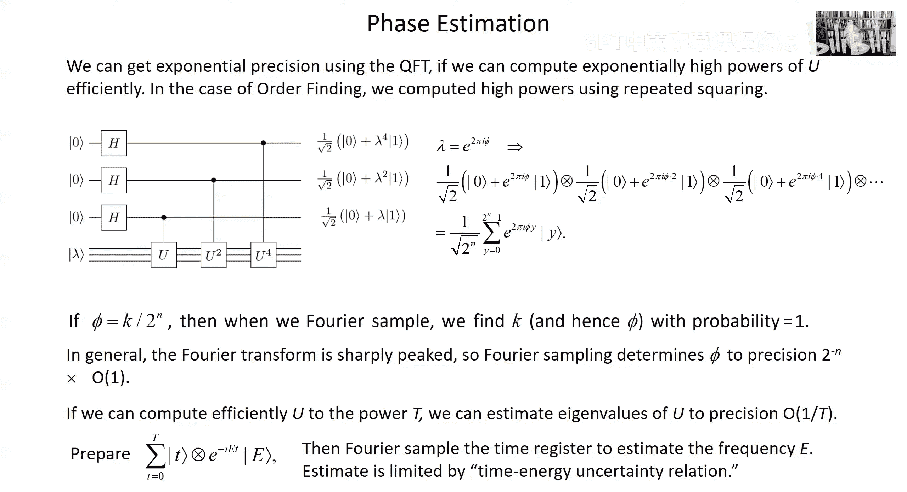
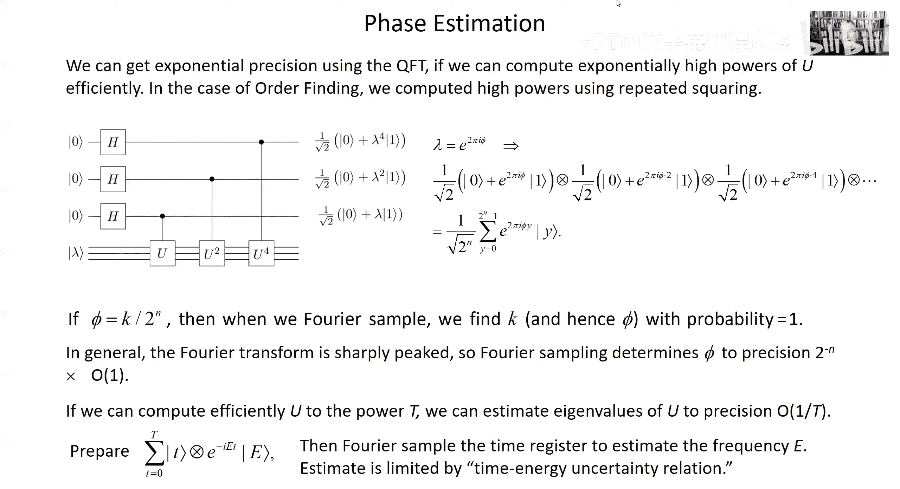

# 量子计算：第15讲：整数分解算法

在本节课中，我们将学习量子计算中一个具有重要历史意义的算法——肖尔算法。该算法展示了量子计算机如何高效地分解大整数，并深刻影响了现代密码学。我们将从周期寻找算法出发，逐步理解其与整数分解问题的联系，并探讨其深远影响。

## 从周期寻找到整数分解

上一节我们介绍了量子傅里叶变换及其在“黑盒”设置下解决周期寻找问题的应用。本节中，我们将看到，这个周期寻找算法正是肖尔整数分解算法的核心引擎。

肖尔在1994年发现，一旦我们有了周期寻找算法，结合一些数论知识，就可以将其应用于整数分解。具体来说，我们需要找到一个函数，其周期性与整数的因子有关。

## 模幂运算与阶

我们考虑模N的乘法群。这个群由所有小于N且与N互质的正整数组成，记作 \( Z_N^* \)。对于群中的任意元素 \( a \)，我们定义其**阶** \( r \) 为满足 \( a^r \equiv 1 \pmod{N} \) 的最小正整数。

考虑函数 \( f(x) = a^x \mod N \)。这个函数的周期恰好就是元素 \( a \) 的阶 \( r \)。因为：
*   当 \( x < r \) 时，\( a^x \) 的值互不相同。
*   \( a^{x+r} = a^x \cdot a^r \equiv a^x \pmod{N} \)，函数值开始重复。

因此，寻找函数 \( f(x) \) 的周期，就等价于寻找元素 \( a \) 的阶。这个过程称为**阶寻找**。

### 高效计算模幂运算

为了在量子计算机上运行周期寻找算法，我们需要能够高效计算函数 \( f(x) = a^x \mod N \)，即使 \( x \) 是指数级大的数。这里的关键技术是**重复平方**。

假设 \( x \) 的二进制表示为 \( x_{m-1}x_{m-2}...x_0 \)，那么：
\[
a^x = a^{x_{m-1}2^{m-1}} \cdot a^{x_{m-2}2^{m-2}} \cdot ... \cdot a^{x_0}
\]
我们可以预先计算 \( a, a^2, a^4, a^8, ... \) 模 \( N \) 的值（通过反复平方得到）。然后，根据 \( x \) 的每个二进制位是0还是1，决定是否乘以对应的预计算值。这样，我们只需要 \( O(\log x) \) 次模乘运算就能计算出 \( a^x \mod N \)。

在量子电路中，我们可以通过一系列**受控乘法门**来实现这个计算。每个门根据输入寄存器中一个量子比特的值，决定是否将输出寄存器乘以一个预计算的幂（如 \( a, a^2, a^4, ... \)）。

## 肖尔分解算法

现在，我们来看如何利用阶寻找算法来分解一个合数 \( N \)。算法是随机化的，步骤如下：

1.  **随机选择**：随机选择一个整数 \( a \)，满足 \( 1 < a < N \)。
2.  **检查公因数**：计算 \( \gcd(a, N) \)。如果结果不为1，那么我们已经找到了 \( N \) 的一个非平凡因子，算法结束。
3.  **寻找阶**：使用量子周期寻找算法，计算 \( a \) 模 \( N \) 的阶 \( r \)。即，找到最小的 \( r \) 使得 \( a^r \equiv 1 \pmod{N} \)。
4.  **检查阶的奇偶性**：如果 \( r \) 是奇数，则回到步骤1，重新选择 \( a \)。
5.  **因子分解**：如果 \( r \) 是偶数，我们计算 \( \gcd(a^{r/2} - 1, N) \) 和 \( \gcd(a^{r/2} + 1, N) \)。根据数论知识，这两个最大公约数中至少有一个是 \( N \) 的非平凡因子（以高概率成立）。

**算法原理简述**：
因为 \( a^r \equiv 1 \pmod{N} \)，所以 \( N \) 整除 \( (a^r - 1) \)。
由于 \( r \) 是偶数，我们可以将其分解为：
\[
a^r - 1 = (a^{r/2} - 1)(a^{r/2} + 1)
\]
\( N \) 整除这个乘积。因为 \( r \) 是使 \( a^r \equiv 1 \) 的最小正整数，所以 \( N \) 不整除 \( (a^{r/2} - 1) \)。因此，\( N \) 必然与 \( (a^{r/2} - 1) \) 或 \( (a^{r/2} + 1) \) 有非1的公因数，这个公因数就是 \( N \) 的因子。

通过多次随机尝试 \( a \)，该算法能以高概率成功分解 \( N \)。

## 对密码学的影响

肖尔算法的发现之所以轰动，是因为整数分解的困难性是**公钥密码学**（如广泛使用的RSA加密体系）的基石。

### 公钥密码学简介

公钥密码学依赖于**陷门单向函数**。这是一种容易计算但难以逆向的函数，除非你拥有一个特殊的“陷门”信息（私钥）。
*   **加密**：任何人可以使用公钥轻松加密信息。
*   **解密**：只有拥有对应私钥的人才能解密信息。
*   **数字签名**：拥有私钥的人可以生成签名，任何人可以使用公钥验证该签名。

RSA加密体系正是基于大整数分解的困难性。破解RSA等价于分解其使用的巨大合数 \( N \)。由于肖尔算法为量子计算机提供了高效分解整数的途径，这意味着当大规模量子计算机实现时，当前的RSA加密将不再安全。

### 后量子密码学

面对量子计算的威胁，密码学界正在积极寻找解决方案：
1.  **后量子密码学**：设计新的经典加密算法，其安全性基于量子计算机也难以解决的问题。
2.  **量子密码学**：利用量子力学原理（如量子不可克隆定理）实现信息论安全的密钥分发。

目前，各国标准机构（如美国NIST）正在评估和标准化后量子密码算法，以应对未来的挑战。

## 相位估计：更广阔的视角

让我们从更一般的视角重新审视周期寻找算法。它可以被看作是**相位估计**算法的一个特例。

假设我们有一个酉算子 \( U \)（例如，乘以 \( a \) 模 \( N \) 的运算），并且我们有一个它的本征态 \( |\psi\rangle \)，满足 \( U|\psi\rangle = e^{2\pi i \phi}|\psi\rangle \)。我们的目标是估计本征值中的相位 \( \phi \)。

相位估计算法的核心思想是：
1.  制备一个“时间”寄存器，处于 \( |0\rangle + |1\rangle + |2\rangle + ... + |T-1\rangle \) 的叠加态。
2.  执行一系列**受控 \( U^j \)** 操作：如果时间寄存器的状态是 \( |j\rangle \)，则对目标态 \( |\psi\rangle \) 应用 \( U^j \)。
3.  由于 \( U^j|\psi\rangle = e^{2\pi i j \phi}|\psi\rangle \，最终状态中，时间寄存器与相位因子 \( e^{2\pi i j \phi} \) 纠缠在一起。
4.  对时间寄存器执行**逆量子傅里叶变换**并测量。测量结果以高概率给出 \( \phi \) 的一个良好有理数近似。

在阶寻找问题中，\( U \) 是乘以 \( a \) 的运算，\( \phi = k/r \)（\( r \) 是阶）。通过相位估计得到 \( \phi \) 后，我们就能推导出 \( r \)。这个框架非常强大，未来还将用于量子模拟中估计哈密顿量的能谱。

## 总结

本节课中我们一起学习了：
1.  **肖尔整数分解算法**的核心是将分解问题转化为寻找模幂函数周期（即元素的阶）的问题。
2.  通过**重复平方**技术，可以高效计算模幂运算，从而在量子计算机上实现周期寻找。
3.  该算法对基于整数分解困难性的**现代密码学**（如RSA）构成了潜在威胁，推动了**后量子密码学**的发展。
4.  周期寻找算法可以置于**相位估计**这一更一般的框架下理解，后者是估计酉算子本征值的强大工具。

肖尔算法的发现不仅是量子计算能力的一个惊人例证，也深刻地连接了物理学、计算机科学和密码学，持续影响着我们对计算本质和安全通信的思考。