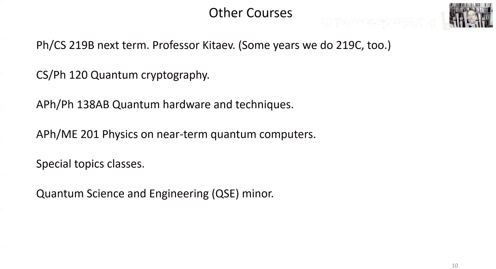

# 量子计算：第18讲：局域哈密顿量问题

在本节课中，我们将探讨为何寻找某些量子系统的基态能量会成为一个困难问题。我们将从经典的NP完全问题出发，理解其困难性，然后将其推广到量子领域，解释为何局域哈密顿量的基态问题属于QMA完全问题，这甚至比经典的NP完全问题更难。

## 概述：为何某些量子问题难以求解

上一节我们介绍了如何使用量子计算机（特别是相位估计算法）来测量由局域哈密顿量描述的系统的能量。该方法要求我们能够制备一个与目标能量本征态有足够大重叠（不小于1/poly(n)）的量子态。然而，我们将会看到，对于某些哈密顿量，制备这样的态本身就是极其困难的，这意味着即使使用量子计算机，我们也无法高效地解决这些问题。

## 从经典问题到量子困难性

为了理解量子问题的困难性，我们首先回顾一个经典的类比：可满足性问题（SAT）。

### 经典困难性：NP完全问题与SAT

以下是几个关键概念：
*   **NP类问题**：如果存在一个“证明”（或“见证”），我们可以在多项式时间内验证该证明是否正确。
*   **电路可满足性问题（Circuit SAT）**：给定一个经典电路的描述，问是否存在一个输入使得电路输出1（接受）。这是一个NP完全问题。
*   **3-SAT问题**：给定一组子句，每个子句涉及最多3个布尔变量，问是否存在对所有变量的赋值，使得所有子句同时为真。3-SAT也是一个NP完全问题。

我们可以将Circuit SAT归约到3-SAT。思路是为电路中的每个逻辑门创建一个子句，该子句检查该门的输入输出关系是否正确。整个3-SAT公式的满足赋值，就对应了电路的一个有效计算历史。因此，如果能解决3-SAT，就能解决任何NP问题。

### 从SAT到经典哈密顿量

我们可以将3-SAT公式视为一个经典“哈密顿量”的能量函数：
`H = Σ_i h_i`
其中，每个项 `h_i` 对应一个子句。如果该子句被满足，则 `h_i = 0`；否则 `h_i = 1`。因此，该哈密顿量的基态能量为0，当且仅当存在一个满足所有子句的赋值（即3-SAT答案为“是”）。因此，**精确求解此类经典局域哈密顿量的基态能量是一个NP难问题**。

在物理学中，类似的问题出现在**自旋玻璃**等无序系统中。其哈密顿量形式如：
`H = -Σ_{<i,j>} J_{ij} Z_i Z_j - Σ_i h_i Z_i`
其中 `J_{ij}` 和 `h_i` 可正可负，导致系统存在“阻挫”。寻找这类系统的基态即使在二维空间中也通常是NP难的，这解释了为何自然界中的自旋玻璃很难弛豫到其基态。

## 量子困难性：QMA完全问题

现在，我们将视野转向量子世界。在量子情况下，哈密顿量的各项可能不对易，这引入了额外的复杂性。

### k-局域哈密顿量问题

**问题定义**：给定一个k-局域哈密顿量 `H = Σ_i H_i`（每个 `H_i` 作用在不超过k个量子比特上，且算符范数有界），以及两个数 `E_low` 和 `E_high`（`E_high - E_low ≥ 1/poly(n)`）。我们承诺该哈密顿量的基态能量要么 `≤ E_low`，要么 `≥ E_high`。问题是判断属于哪一种情况。

如果我们可以高效地（以多项式大小的量子电路）制备一个与基态重叠不小于 `1/poly(n)` 的态，那么通过相位估计就能以高概率解决此问题。因此，如果局域哈密顿量问题是困难的，就意味着制备这样的态也是困难的。

### 5-局域哈密顿量是QMA完全的

Kitaev证明了5-局域哈密顿量问题是QMA完全的。这意味着：
1.  **该问题属于QMA**：如果基态能量低（`≤ E_low`），那么验证者（Arthur）可以从证明者（Merlin）那里获得基态作为“见证”，并用相位估计来验证其能量确实低。
2.  **任何QMA问题都可以归约到它**：这是证明的核心。我们需要为任意QMA验证电路构造一个对应的5-局域哈密顿量，使得其低能态对应于验证电路以高概率接受某个见证。

#### 构造历史态

归约的关键是构造一个**历史态**，它编码了量子验证电路计算的整个过程：
`|η⟩ = (1/√(T+1)) Σ_{t=0}^{T} |t⟩_{clock} ⊗ |ψ_t⟩_{comp}`
其中：
*   `|t⟩_{clock}` 是“时钟寄存器”的状态，表示计算进行到第t步。
*   `|ψ_t⟩_{comp}` 是计算寄存器在应用了前t个门 `U_t...U_1` 后的状态。

#### 构造哈密顿量

我们构造的哈密顿量 `H` 由四部分组成，旨在惩罚无效的计算历史：
`H = H_in + H_out + H_prop + H_clock`

以下是各部分的作用：
*   **`H_in`**：检查所有辅助（草稿）量子比特是否被正确初始化为 `|0⟩`。
*   **`H_out`**：在计算的最终时刻（`t=T`），检查输出比特是否为 `|1⟩`（接受）。如果不是，则施加能量惩罚。
*   **`H_prop`**：确保计算过程中的每一步都正确应用了指定的量子门 `U_t`。其形式为：
    `H_prop = Σ_{t=1}^{T} H_{prop,t}`
    其中 `H_{prop,t} = ½ (|t⟩⟨t| + |t-1⟩⟨t-1| - |t⟩⟨t-1| ⊗ U_t - |t-1⟩⟨t| ⊗ U_t†)`
    可以验证，对于有效的历史态 `|η⟩`，有 `H_prop |η⟩ = 0`。
*   **`H_clock`**：确保时钟寄存器被有效编码，使得哈密顿量是局部的。

#### 时钟编码与k-局域性

为了使 `H_prop` 中的项是局部的，我们需要一种特殊的时钟编码。一种简单的方法是**一元编码**：
*   时间 `t` 编码为：前 `t` 个比特为 `1`，后续比特为 `0`。
*   `H_clock` 惩罚无效的时钟状态（如模式 `01`）。
*   在这种编码下，投影到特定时间 `t` 的算符是2-局域的（检查模式 `10`），而推进时间（如将 `100` 变为 `110`）或回退时间的算符是3-局域的。

假设验证电路使用作用在2个量子比特上的通用门集。那么，`H_prop` 中的每一项需要作用于：
*   2个量子比特（用于门操作 `U_t`）
*   3个量子比特（用于改变时钟寄存器）
总共5个量子比特。因此，整个哈密顿量 `H` 是5-局域的。

#### 能量分离与归约完成

通过分析，可以证明：
*   如果存在一个见证使得验证电路以高概率 `(1-ε)` 接受，那么对应的历史态 `|η⟩` 将是 `H` 的一个低能态，其能量期望值约正比于 `ε`（通过放大技术可使 `ε` 非常小）。
*   如果对于所有见证，验证电路都以高概率拒绝（接受概率 ≤ `ε‘`），那么 `H` 的所有态的能量期望值都将高于一个 `1/poly(n)` 的阈值。

因此，通过解决这个5-局域哈密顿量问题（判断基态能量低于 `E_low` 还是高于 `E_high`），我们就能判断原始的QMA问题的答案。这就完成了从任意QMA问题到5-局域哈密顿量问题的归约。

> **后续发展**：该结果可以被加强。事实上，即使在二维晶格上的2-局域哈密顿量问题，甚至是具有足够大局部希尔伯特空间的一维链上的最近邻哈密顿量问题，都被证明是QMA难的。更有甚者，对于一类平移不变的哈密顿量，判断其能隙在热力学极限下是否关闭（即系统是否有能隙）甚至是一个不可判定问题。

## 总结与课程展望

本节课我们一起学习了计算复杂性理论如何揭示物理问题的内在难度。我们看到：
1.  经典的局域哈密顿量基态问题通常是NP难的。
2.  量子的局域哈密顿量基态问题则是QMA完全的，这被认为是更困难的问题类。
3.  Kitaev的构造展示了如何将任意量子验证电路的历史编码到一个5-局域哈密顿量中，从而证明了后者的QMA完全性。

这些结果表明，某些量子系统的性质（如基态能量）在理论上就是难以计算的，这不仅对量子计算设定了界限，也加深了我们对自然界复杂量子多体系统的理解。

本学期的课程到此结束。我们涵盖了量子计算的基础，包括量子力学形式体系、量子算法（如Deutsch-Jozsa、Simon、Shor、Grover、相位估计）以及量子复杂性理论的基本概念。量子计算领域仍在飞速发展，特别是在**量子纠错**、**近含噪声中等规模量子设备**的应用以及**量子密码学**等方面。希望本课程为你未来的探索奠定了坚实的基础。