# 电影史与冷战文化：第21讲：重温《核战爆发令》🎬

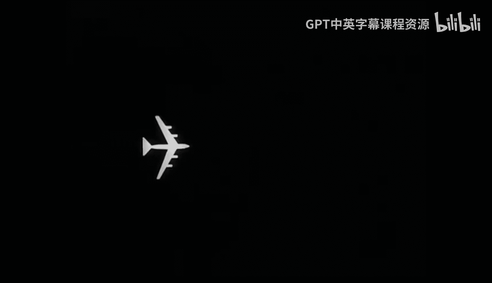

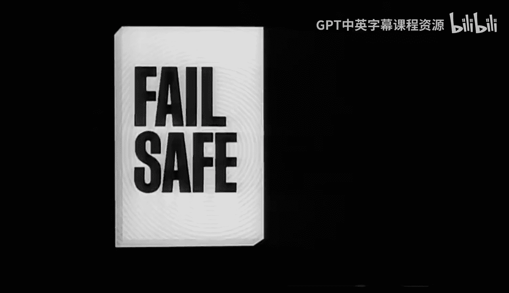

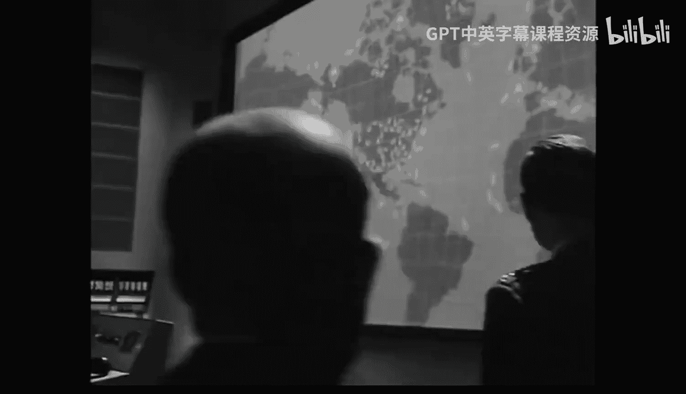

在本节课中，我们将通过分析1964年的电影《核战爆发令》，探讨冷战时期的核恐惧、电影制作背后的故事，以及影片所传达的核心警示。我们将了解这部电影的创作背景、关键角色、拍摄挑战及其与同期电影《奇爱博士》的对比。

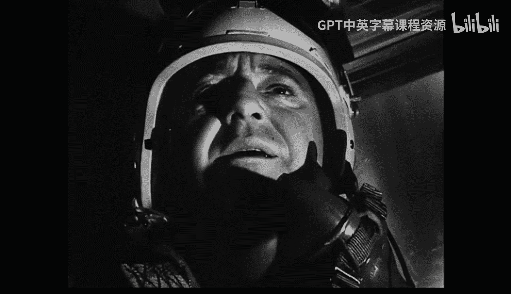

---

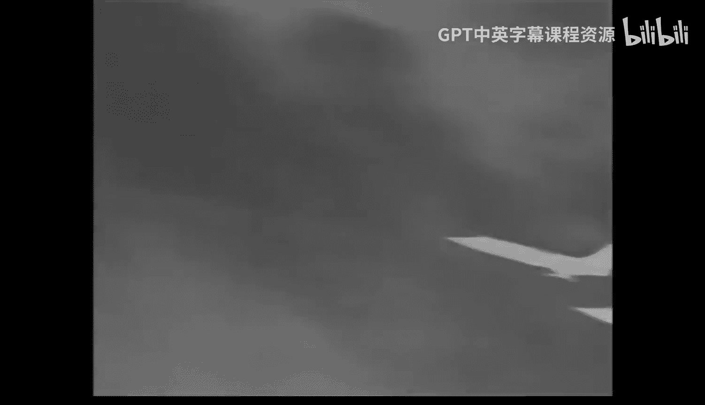

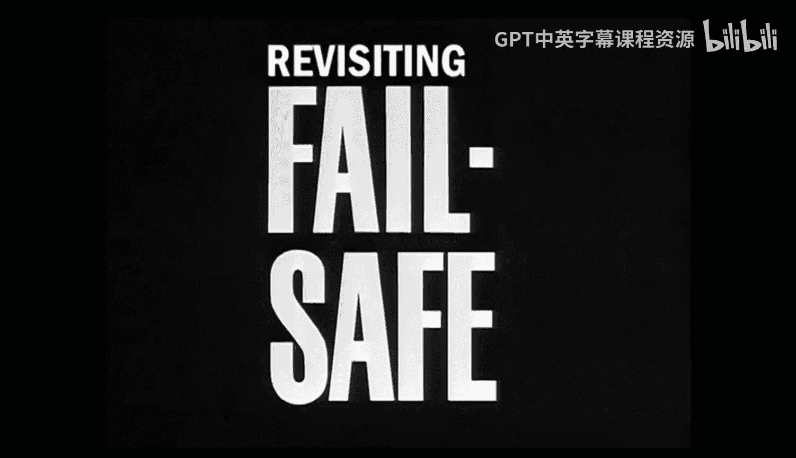

## 概述：冷战阴影下的电影

上一节我们讨论了冷战的政治背景。本节中，我们来看看电影《核战爆发令》如何成为那个时代恐惧与反思的载体。影片描绘了一个因机械故障而意外触发核战争的灾难性故事，其核心主题是呼吁人们“停下来思考”。

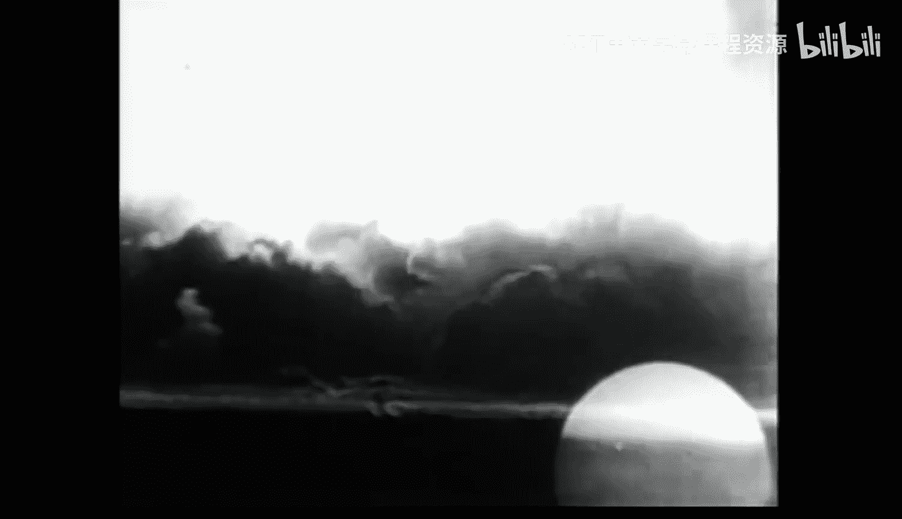

机器一旦启动，便不会停止。我们不断制造核武器，将它们装上飞机，飞往各地。我告诉过你，人们当时非常恐惧。每个人都在履行职责，做着自己认为正确的事。

结果将是千万人丧生。我们该怎么办，主席先生？我们该如何向死者交代？《核战爆发令》的创作必须快速推进，相对而言，人类的情感和想法已不重要。一旦这个机制启动，无论你如何阻止，它都会持续运行，最终导向一个可怕的、你认为绝不会发生的结局。

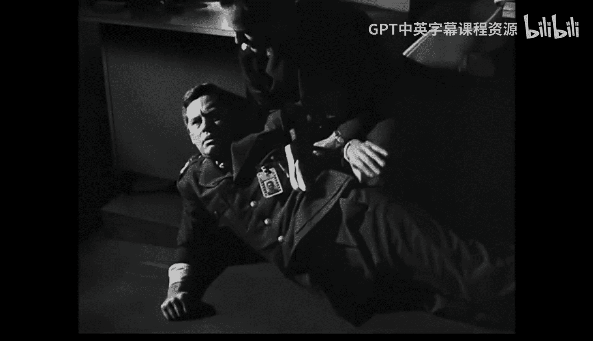

按照计划投下你的炸弹。你创造了这些致命的玩具，它们将脱离我们的控制。

影片的主题是：**停下来思考**。

---

## 历史背景：恐惧的时代

上一部分我们提到了影片的主题。现在，我们回顾一下其诞生的历史背景。1964年，年轻一代在50年代曾被教导躲在桌子底下进行“蹲下掩护”演练。当时人们对核弹怀有巨大的恐惧和焦虑。

林登·约翰逊在1964年竞选总统时，凭借一则令人难以置信的广告锁定胜局。这些就是赌注：是创造一个所有上帝子民都能生存的世界，还是走向黑暗。我们必须彼此相爱，否则就必须死亡。1964年的大选，约翰逊的核心主张是戈德华特不仅是个鹰派，而且是个完全不负责任的鹰派。当时的氛围充满了恐惧。

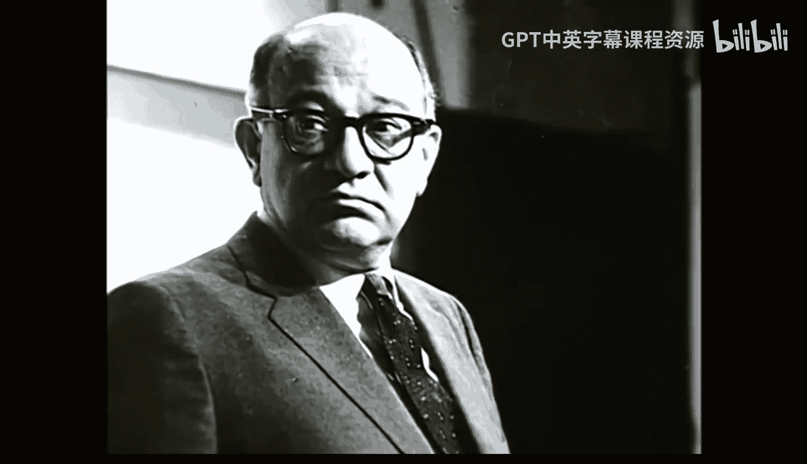

以下是当时社会心态的几个关键点：
*   人们寻找指责对象和敌人，认为苏联的目标是统治世界。
*   麦卡锡时期是冷战的重要附属产物，导致了黑名单事件。
*   许多创作者，如编剧，因被列入黑名单而只能使用化名工作。

---

## 创作动机与时机

了解了时代背景后，我们来看看创作团队的动机。古巴导弹危机发生在1962年，这重新点燃了所有人的恐惧。当时存在反战运动和反核运动。我认为这是制作《核战爆发令》的正确时机。

制片人马克斯·扬斯坦找到我，他非常勇敢且富有同情心，在市场营销和宣传方面经验丰富。他觉得有责任制作这部电影，我们都感到有同样的义务。西德尼·吕美特导演也有同感。

---

## 叙事结构与核心角色

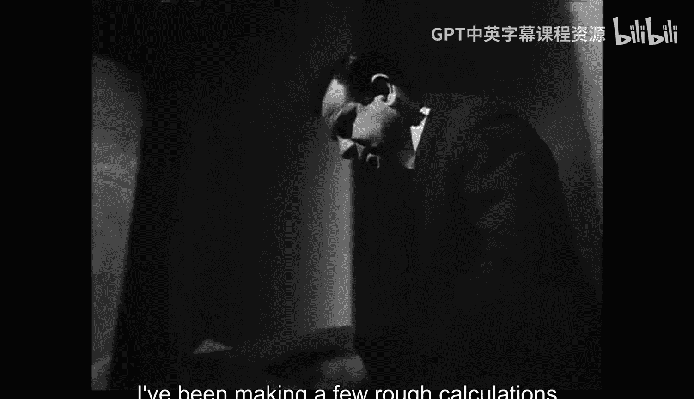

影片的叙事在四个真实的地点展开，每个地点都是一个非常个人化的故事。

以下是四个主要叙事场景：
1.  **战争指挥室**：高层决策的中心。
2.  **五角大楼**：军事指挥的中枢。
3.  **总统座机**：总统的空中指挥所。
4.  **轰炸机驾驶舱**：执行最终命令的飞行员所在。

《核战爆发令》中的角色都表达了一种观点。布莱克将军是一个正直但现实的人，他说我们必须慢下来，事情发展太快，正在失控。他是那个开始对发生的一切产生疑虑的勇敢、诚实的军人。

格罗特斯教授这个角色明显以赫尔曼·卡恩为原型。卡恩写过一本书，本质上探讨了核战争是否可幸存，关键在于哪种文化能存活下来。沃尔特·马索的表演非常可信，他严肃地阐述如何赢得战争，这恰恰使其显得邪恶。

选角中最难的是找到一位能扮演总统的演员，他必须让观众相信其饱经世故，并值得信任。亨利·方达带来了完全的真诚，他让观众相信这就是美国总统。

---

## 拍摄挑战与创新

在有限的预算和资源下，制作团队面临诸多挑战。主要资金都花在了主场景上。那些大型计算机是巨大的盒子，上面有可以转动的磁盘。

我们无法获得“赛其”防空系统的内部画面。我们也无法从政府获得任何炸弹的素材，随后去找资料库也一无所获。电影中你看到的飞机，其实只有一个镜头。你看到的五架起飞飞机都是同一架。

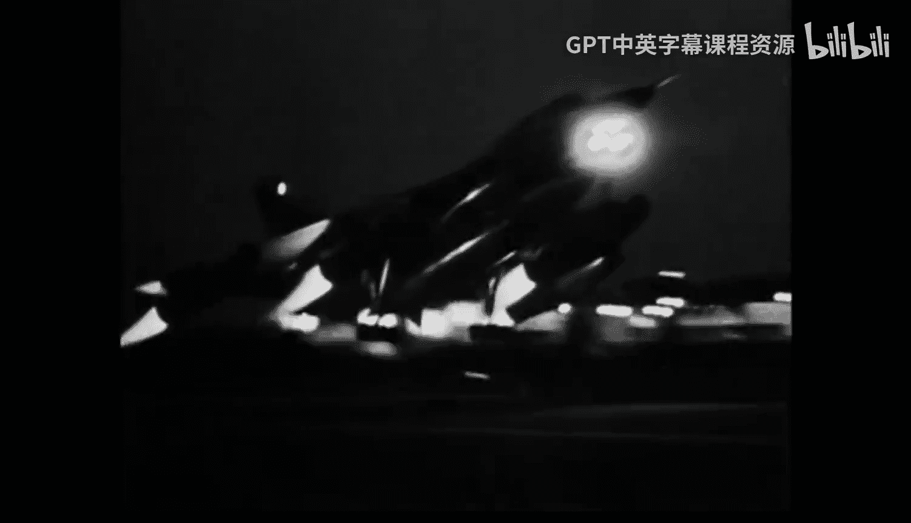

以下是团队遇到的主要障碍与解决方案：
*   **政府封锁**：政府不仅拒绝合作，还切断了资料库的素材供应。
*   **视觉呈现**：这反而促使我们采用一种非常简单、近乎简化的方式来描绘入侵苏联领空的过程。
*   **动画制作**：约翰和费斯·哈布利两位伟大的动画师为我们手绘了那段素材，用小白云代表被击落的飞机，这是最简单且最经济的方式。

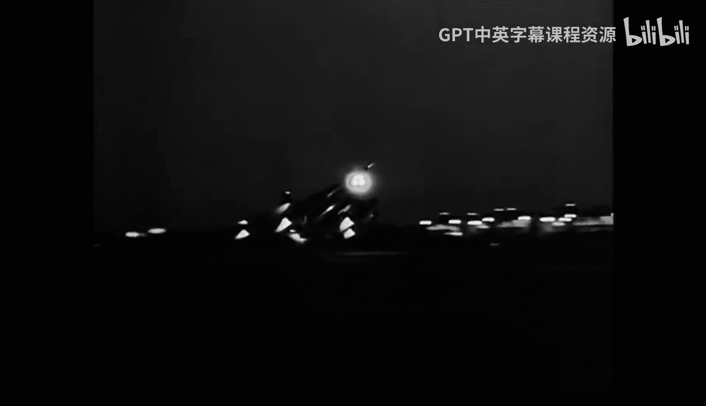

---

## 法律纠纷与同期作品

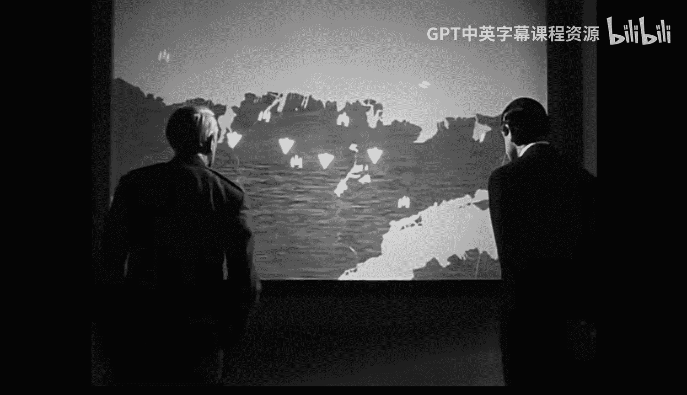

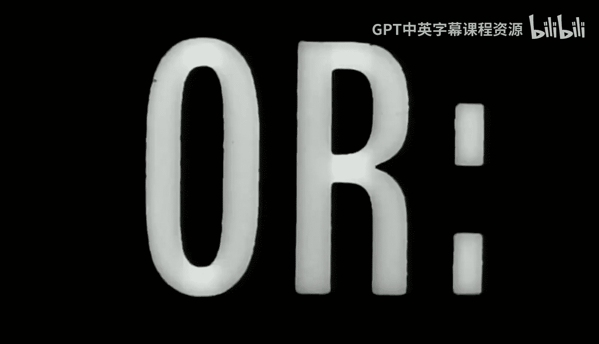

突然，一场诉讼到来。斯坦利·库布里克正在制作《奇爱博士》，其原著是《红色警报》。《红色警报》的作者、库布里克和哥伦比亚电影公司起诉了《核战爆发令》的两位作者教授，指控其剽窃。

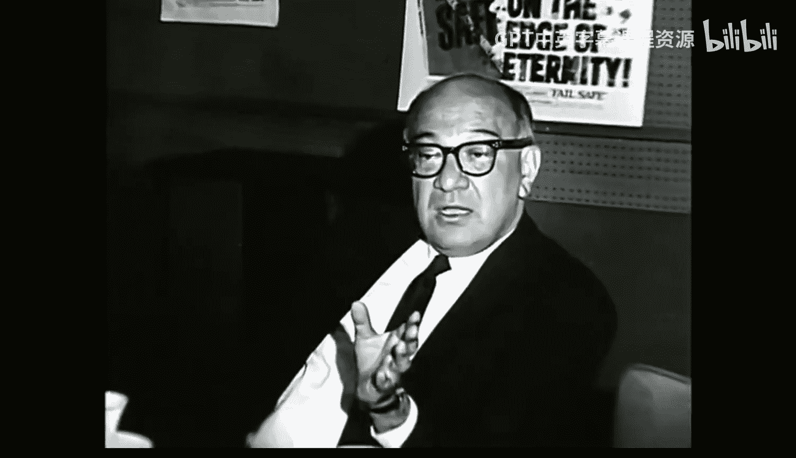

马克斯在一次新闻发布会上说，你不能告诉我两位教授会犯剽窃罪。他们以讽刺手法处理，我们则以严肃手法处理。这两部电影在线情节上拥有一切共同点，但在角色、意图或风格上毫无共同之处。

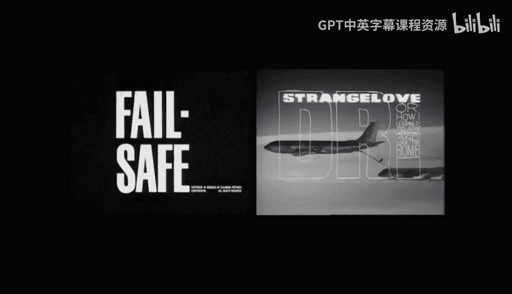

哥伦比亚电影公司买下《核战爆发令》是为了阻止其发行。他们不希望一部严肃电影在一部讽刺电影之后上映。但讽刺电影先上映，然后才是严肃电影，这伤害了我们。我们上映时几乎没有观众。在喜剧版本出来后，严肃题材会显得很傻。

---

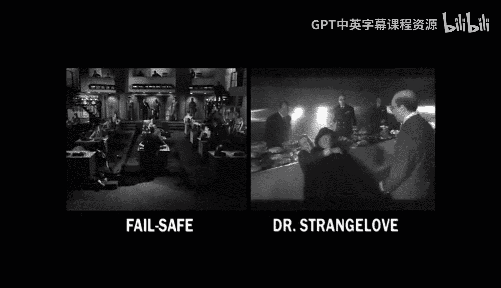

## 影片高潮与警示

电影的高潮在于，当飞行员决定将炸弹投向他妻儿所在的纽约时，影片展示了十个纽约街头最普通的生活场景特写。重要的是看到，那十个我们呈现的生活片段，在那一刻终结了。它摧毁了一切，而你无法相信他们真的这么做了。

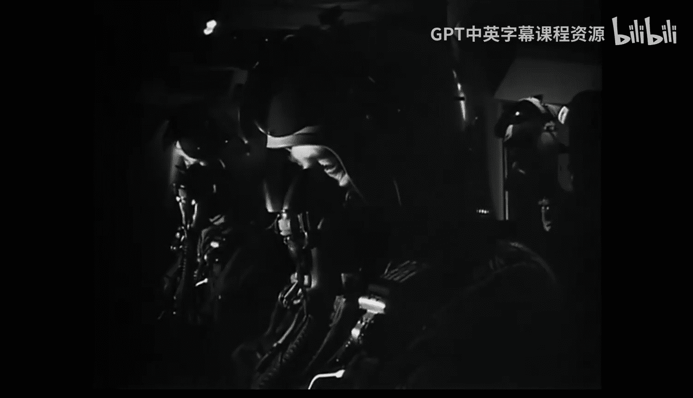

片尾的免责声明是哥伦比亚电影公司加上的。我问过哥伦比亚的人，为什么不在斯坦利（库布里克）的电影上也加上？当然，电影公司总会加上一段结语，向观众保证这绝不会发生，以求稳妥。

---

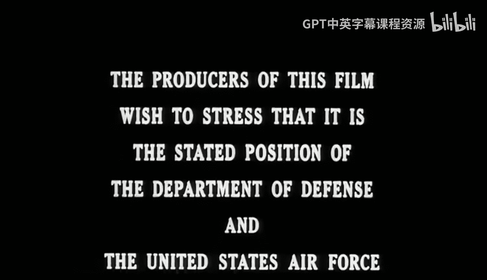

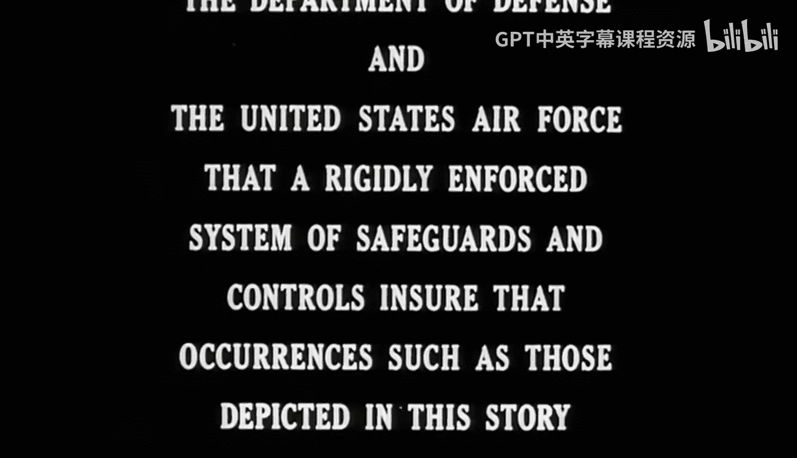

## 当代意义与总结

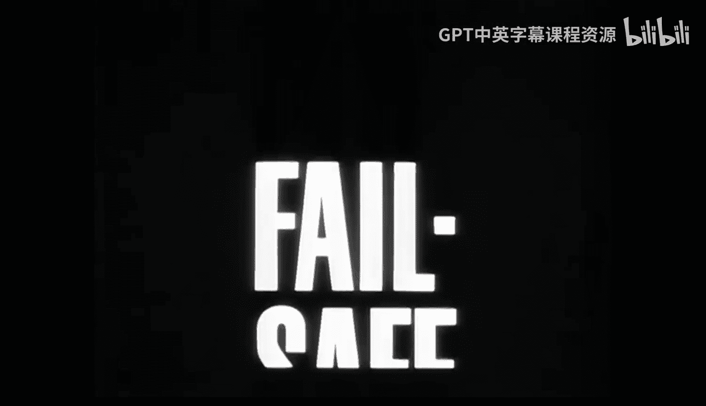

为什么今天要重提《核战爆发令》？我们试图讲述一个我们认为首先是非常出色、睿智的故事，并且它至今仍不过时。你告诉我的事，我必须明确执行。按下按钮，下达命令。这个故事是永恒的，因为关于核对抗的问题依然存在。

以下是影片历久弥新的核心原因：
*   **技术风险**：基于计算机的整个“过度杀伤”政策没有意义，我们都知道计算机并非万无一失。
*   **失控隐喻**：技术的本质是，为应对某种情况而开发的机器，最终会接管并开始自主创造。
*   **人类责任**“我们放置了它（核武器），主席先生，我们并非无能为力。我们置于彼此之间的东西，我们可以移除。”

爱默生有一句精彩的话：“事物骑在鞍上，驾驭着人类。”我一直记得这正是当时发生的事，现在依然在发生。

本节课中，我们一起学习了电影《核战爆发令》如何作为冷战核恐惧的文化产物。我们回顾了其创作背景、叙事手法、拍摄中遇到的挑战，以及它与《奇爱博士》的对比。影片的核心警示——技术可能失控，人类必须保持警惕并承担起责任——至今仍具有深刻的现实意义。它提醒我们，在复杂的系统与巨大的风险面前，“停下来思考”永远是必要的。