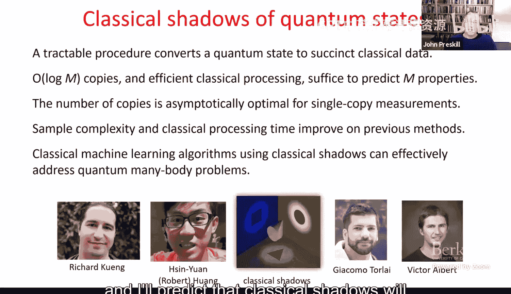
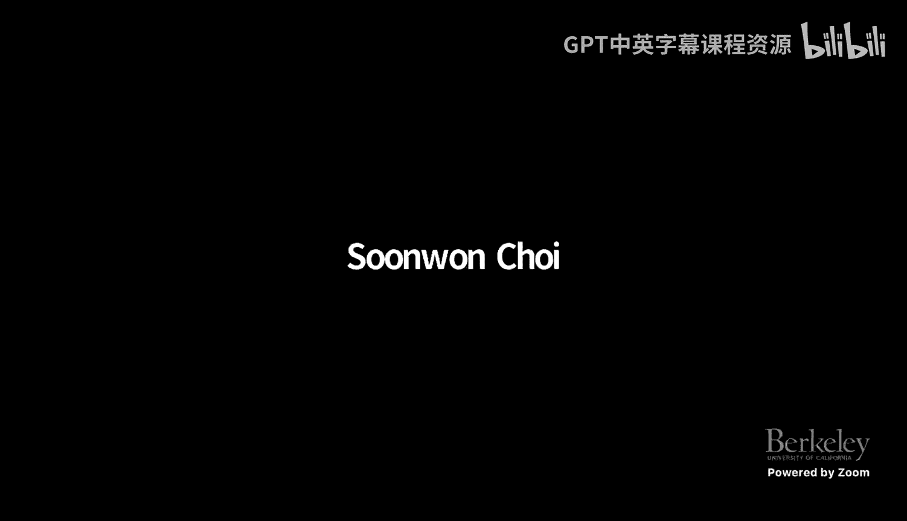

# 量子计算：第23讲：量子态的经典影与量子研讨会

## 概述
在本节课中，我们将学习一种称为“量子态的经典影”的技术。这是一种高效且实验上可行的方法，用于将复杂的量子多体态转化为简洁的经典描述，同时保留预测该量子态多种有用性质的能力。这对于利用近期量子平台解决实际问题至关重要。

---

## 演讲者介绍
演讲者是该领域的巨人之一，一位理论物理学家。他的工作广泛涉及物理学基础以及更实用的量子计算领域，包括纠错、量子引力、NISQ设备等。值得注意的是，该领域有相当大一部分物理学家曾受他指导。

---

## 为什么需要经典影？
在NISQ时代，我们追求量子优势。实现这一目标的最佳希望之一是通过混合量子-经典算法，即尽可能使用经典计算机，并用量子设备作为协处理器来增强其能力。因此，如果能在不损害应用能力的前提下，用经典资源替代量子资源，那么这样做很可能是有益的。

经典影技术可以提升变分法解决优化问题的效率。通过将量子信息转化为经典语言，我们可以利用经典的机器学习工具来处理量子问题。

我们的目标是找到一种可处理的方式，将量子数据转化为经典数据。具体来说，我们希望：
*   能够通过少量易于实验的测量，从量子设备中的量子多体态获得经典描述。
*   该经典描述简洁且易于存储。
*   我们的预测可以通过经典计算轻松完成。
*   我们能严格保证预测结果具有高概率的小误差。

我们可能想要预测的性质包括：与目标态的保真度、局域可观测量或少数点关联函数的期望值、纠缠熵等。我们关心的资源包括：在量子平台上进行这种转化的难度、需要多少份量子态副本才能进行准确预测、需要多少经典存储和经典处理。

---

## 现有方法的局限性
上一节我们介绍了经典影的目标，本节我们来看看现有方法的不足。

**1. 完全量子态层析**
这是将量子态转化为经典语言的标准程序，然后可以用该经典描述推导量子态的性质。然而，对于多体系统，完全层析非常低效：
*   描述本身随系统大小（量子比特数）指数增长。
*   提取准确预测所需的样本数量也随系统大小指数增长。
*   计算预测所需的经典存储和处理也是指数级的。

因此，对于多量子比特系统，这不是一个实用的程序。

**2. 影层析**
这是Scott Aaronson提出和分析的巧妙想法，其目标不是学习量子态的完整描述，而是对一组算符的期望值进行准确预测。值得注意的是，在这种情况下，进行预测所需的样本数量随系统大小多项式增长。此外，为了预测M个性质，只需要`polylog(M)`份态副本。

然而，这仍然不是一个实用的程序，因为它需要非常昂贵的量子处理（包括跨多个态副本的量子计算）以及大量的存储和后处理来进行预测。

**3. 启发式方法**
例如神经网络量子态层析，可以通过一组测量来训练神经网络，然后用它来预测态的额外性质。在实践中，这在某些情况下可能效果很好，并且训练神经网络所需的量子实验是可行的。

但我们并没有神经网络量子态层析的严格理论，它是一个启发式过程。因此，我们无法一般性地说明，对于某个输入量子态，需要多少样本、多少存储和处理才能以高成功概率获得良好的预测。

---

## 经典影协议
我们想要的是一个程序，可以证明其在所需的量子处理、经典存储和经典处理方面都是高效的。该程序能让我们通过少量测量，学习未知输入态的某种经典表示，然后用它来预测态的多种性质。

我们大约一年前证明的结果表明，在某些条件下这是可能的。如果我们想预测一组可观测量列表的期望值，并以高成功概率实现小的恒定误差，那么我们需要的态副本数量（实验重复次数）仅与待预测性质数量的对数成正比。

但有一个前提：这里有一个取决于所谓“影范数”的预因子。我们要求所有算符都具有足够小的影范数。稍后会解释影范数的含义。事实证明，在一些感兴趣的情况下，影范数实际上是独立于系统大小的常数。因此，在这种情况下，我们可以用`O(log M)`次测量来预测M个性质，并且所需的样本复杂度完全与系统大小无关。量子平台上的实验是高效的，经典存储和处理也是合理的。

如果我想简单地逐个测量M个不同的可观测量，我将需要`O(M)`份态副本。但我们说，我们只需要`O(log M)`份态副本就能以高成功概率获得准确预测，这是一个巨大的改进。

---

## 协议如何运作？
让我们看看这个程序如何运作。假设我们有N份态副本，我们以下列方式重复对态进行实验。该程序有多种变体，但它们都有一个共同点：它是一个随机化协议。

以下是协议步骤：
1.  我们有一个可以选择的幺正算符系综。我们希望这个幺正算符是我们在实验室中真正可以实现的，并且我们希望它能够用经典数据简洁地描述。
2.  在每次实验运行中，我们从该系综中选择一个幺正算符`U`。
3.  我们将该幺正算符应用于系统，然后在计算基下进行测量。对于一个n量子比特态，我们收集n比特数据。
4.  我们获得态的一个“快照”，这是将幺正算符的逆`U†`应用于该测量结果得到的。这是在经典数据上进行的操作，幺正算符`U`可以高效描述和求逆，因此我可以将该幺正算符应用于比特串以获得这个快照。
5.  所有N个快照的完整集合就是我所说的“经典影”。

需要注意的是，如果我对系综中的所有幺正算符以及测量结果进行平均，那就定义了一个作用于输入量子态的通道（一个CPTP映射）。

**具体例子**
假设我有一个位于布洛赫球赤道上的量子态。我们的幺正算符系综是：恒等算符和绕Z轴的90度旋转。根据幺正算符的选择，我要么在计算基（|0>, |1>）下测量，要么在X基（|+>, |->）下测量。对于这个特定态，当我在Z基下测量时，更可能得到0；在X基下测量时，更可能得到+。快照根据测量结果是0、+、1或-。如果对测量选择和结果进行平均，则定义了一个通道，它只是一个退极化通道，以某个非零概率保留态，并以互补概率用完全混合态替换它。这个通道使态向布洛赫球的原点收缩，但不会完全收缩到原点。

---

## 如何进行预测？
我们有了所有这些快照，该如何使用它们？我们将快照简洁地存储在经典内存中。

如前所述，对幺正算符系综和测量结果进行平均定义了一个通道`M`。如果我们的测量是层析完备的，那么该通道将是一个可逆矩阵（尽管在实验室中无法通过物理映射进行逆操作，并且它将快照映射到一个非物理密度算符的对象，但这没关系，因为我们不想在实验室中反转这个通道，只想通过经典处理在经典内存中反转它，而我们可以做到这一点）。

然后，如果我们对测量选择和结果进行平均，并对每个快照应用通道的逆`M^{-1}`，其期望值将是输入密度算符本身。因此，如果我们重复测量多次，我们就有了态的一个良好无偏估计量。

但为了确保我们能做出好的预测，我们必须了解估计量的方差。

**预测方法**
我有一组算符，假设我可以经典地简洁描述它们。然后，对于每个算符，我计算其在应用了通道逆`M^{-1}`的快照结果上的期望值。

**处理大偏差的技巧**
即使我知道方差，如果我对分布一无所知，我也必须担心预测被罕见的、与均值的大偏差所破坏。有一个处理这个问题的技巧，称为“均值中位数估计”。我可以将我们的估计分成许多组，计算每组中估计值的平均值。每个平均值都给出了可观测量期望值的一个估计，但可能存在大偏差。然后，我取所有估计值的中位数。为了使该中位数严重偏离均值，必须在半数组中都出现大偏差，而随着组数的增加，这种情况发生的概率呈指数级下降。因此，一旦我们有了足够大的样本，我们就可以控制大偏差的概率。事实上，这使我们能够保证，以高成功概率，我们可以预测的性质数量是实验重复次数的指数级。

**影范数的作用**
当我们试图估计估计量的方差时，影范数就出现了。到目前为止，我只是抽象地描述了这个过程。为了更具体，我们应该考虑特定的幺正算符系综。

---

## 具体系综：随机Clifford测量
假设我们从Clifford群中均匀采样幺正算符。那么过程是：我选择一个随机Clifford变换，然后在计算基下测量所有量子比特。这等价于同时测量一组随机选择的交换泡利算符。我重复多次。

当我们对Clifford变换和结果进行平均时，生成的通道`M`看起来是这样的。Clifford群具有成为幺正2-design的绝妙性质，因此我可以用对幺正群的均匀平均（Haar测度）来替换对Clifford变换的平均。对幺正群的平均很容易计算，因为唯一存活下来的是幺正不变量，我们可以明确地表征和计算它们。

事实证明，对于这种Clifford测量场景，相应的通道是一个退极化通道，具有一定的保留态的概率和用最大混合态替换它的概率。这是一个我们知道如何求逆的通道。

现在我想计算估计量的方差。我可以利用通道的逆`M^{-1}`是自伴算符这一性质，将作用于快照的`M^{-1}`转化为作用于算符的`M^{-1}`。对于方差，我得到了一个这样的表达式，其中现在有这一项的平方，所以表达式中有三个`U`和三个`U†`，我需要对Clifford群进行平均。但Clifford群也具有成为幺正3-design的绝妙性质，因此在这种情况下，我们也可以用对幺正群的平均来替换对Clifford群的平均，并得到方差（我们称之为影范数）的明确表达式。然后我们可以对所有可能的输入状态进行优化或最大化，这就是我们估计影范数的方法。在这种情况下，它只是常数乘以希尔伯特-施密特范数。

希尔伯特-施密特范数为常数的可观测量例子是：与某个目标纯态的保真度。我们感兴趣的是可以简洁描述该目标纯态的情况。

因此，在保真度估计的情况下，我的意思是：我可以总共重复实验N次，然后我可以以小的误差和高成功概率，计算与指数级于N个目标态的保真度，并且我需要的副本数量完全与系统大小无关。

---

## 更简单的系综：随机泡利测量
问题是，尽管Clifford变换很好，但在当前的量子平台上仍然有点难以实现，因为它们需要足够深度的电路（电路规模接近`O(n^2)`）。我们想要一些更简单、真正可以在实验上实现的东西。

有什么比这更简单呢？我们只需取每个量子比特，并以均匀随机的方式决定测量泡利算符X、Y或Z中的一个。我称之为泡利测量。在这种情况下，也很容易看出通道是什么，因为这实际上等价于做单量子比特Clifford群然后执行计算基测量。同样，对Clifford群的平均等同于对幺正群的平均。

现在我们有一个作用于N个量子比特的退极化通道的张量积，这很容易求逆。然后我们可以估计方差（即我们的影范数），利用单量子比特Clifford群是3-design的性质来得到我们的估计。在这种情况下，我们发现可以将影范数与我们要预测的可观测量的算符范数联系起来，但它也指数依赖于可观测量的权重（即它非平凡作用的量子比特数）。

但是，如果我们对具有恒定权重的可观测量感兴趣，我们可以高效地进行良好预测。例如，如果我们计算局域可观测量、局域可观测量的和、两点关联函数等。

**直观理解**
这个程序适用于估计恒定权重的任意可观测量，但为了直观理解为什么成本随权重指数增长，我们可以考虑一个更简单的特殊情况：仅预测泡利算符的期望值。

假设我们有一个泡利算符列表，我们希望能够预测它们，它们的权重都不大于W。我们进行随机化程序，我们有一定的非零概率击中正确的泡利算符（在这个例子中，是我们具有非平凡作用的四个算符）。击中正确泡利算符的概率大约为`3^{-W}`（权重为W时）。在这种情况下，我们不必费心进行均值中位数估计，因为我们可以直接表征估计量的方差。但事实证明，为了预测权重不大于W的算符，我们需要重复实验的次数大约为`3^W`，但我们可以预测的泡利算符数量是实验重复次数的指数级。

---

## 改进：去随机化泡利测量
上述程序适用于任意的泡利算符列表，但通常考虑具有我们可以利用的特殊结构的泡利算符是很有趣的，然后我们可能能够通过确定性程序做得更好。

我们可以通过去随机化这个随机泡利测量程序来得到这样一个程序。假设我们有一个泡利算符列表，每个作用于N个量子比特。随机化协议以高概率在我们想要预测的具体泡利算符列表上给出一些保证的性能。

我们可以考虑固定其中一个泡利测量为X、Y或Z，然后看看当我们在其余算符上随机化测量时程序的性能如何。我们可以为那个特定泡利算符中的那个特定量子比特选择能给出最佳性能的测量选择（X、Y或Z）。我们可以迭代地这样做，因为我们可以高效地计算性能界限。我们可以高效地遍历我们的泡利算符列表，一次一个量子比特，每次用某个固定的泡利测量替换随机化的泡利测量，并继续对其余部分进行随机化。当我们遍历完整个列表时，我们就完全去随机化了该程序。

**实验案例**
这是一个受实际实验启发的例子。几年前，因斯布鲁克小组用20个离子的离子阱进行了一项实验。他们专门研究一维电动力学。这是一个自旋系统（量子比特集合），其中哈密顿量是两量子比特算符的和，但没有几何局域性约束，因此哈密顿量具有`O(N^2)`项。

他们在这个实验中做了一件非常聪明的事情：他们进行了变分搜索，以寻找具有低能量的态，但他们也搜索具有低哈密顿量方差的态。当该方差很小时，意味着我们接近拥有哈密顿量的一个本征态。因此，从某个初始态开始并执行这个变分过程，我们不仅可以找到基态（最低能量态），还可以找到其他低激发能量本征态。他们做到了这一点。

但这是一个相当昂贵的过程。哈密顿量有`O(N^2)`项，哈密顿量的平方有`O(N^4)`项。这是我们需要预测的大量泡利算符。在实验中，他们手工设计了一个程序来提取他们需要的泡利算符的期望值，以找到哈密顿量的方差。

实际上，他们的程序在中等系统尺寸下比经典影程序表现得更好。但随着系统尺寸的增长，在经典影协议的情况下，我们试图估计`O(N^4)`个泡利算符，但我们需要的实验数量仅随该数量对数增长，而他们的程序实际上具有线性依赖于系统尺寸的依赖性。因此，对于大系统尺寸，经典影表现得相当好。

但在这种情况下，泡利算符有足够的结构，我们可以通过去随机化获得巨大收益。如果我们按照我描述的方式去随机化泡利测量，我们可以将获得所需误差所需进行的实验数量大幅减少一个数量级。

---

## 应用：量子化学
我们还研究了一些在量子化学中的应用。这是一个经典影方法可能受到挑战的情况，因为量子化学问题是电子结构问题，它是费米子系统的哈密顿量，我们必须将其编码到量子比特中。当我们这样做时，出现的一些泡利算符具有相对较高的权重，这可能对随机化协议不利。

下图显示了经典影方法的性能，指示了某个特定基准分子（其可以用足够少的量子比特描述，以便我们可以进行精确对角化，因此我们知道正确答案，并且我们可以为该基准示例测试我们的程序）的基态能量估计误差。IBM小组指出，实际上可以做得更好，因为可以在经典影协议中引入一些偏差：出现的泡利算符更可能支持在X上而不是Y和Z上。因此，通过偏置分布而不是使用X、Y和Z上的均匀分布，我们更有机会击中我们感兴趣的泡利算符。

但是，如果我们采用经典影协议并对其进行去随机化，那么我们可以做得更好，并且用更少的实验次数达到所需的误差。

---

## 估计非线性函数
我一直在讨论预测算符的期望值（密度算符的线性函数）。但我应该强调，我们也可以估计非线性函数。事实上，如果我想计算一个在密度算符中是二次的函数，我们可以将其视为可观测量在态`ρ ⊗ ρ`（两个`ρ`副本的张量积）中的期望值。我们可以使用经典影通过取成对的快照来估计该量，用第一个快照替换第一个`ρ`副本，用另一个不同的快照替换第二个`ρ`副本，然后对所有选择快照对的方式进行平均以获得我们的估计。

同样，在这种情况下，我们可以对估计量的方差进行估计，并获得对我们预测的性能保证。

例如，我们可以用它来估计子系统的纠缠熵。在与因斯布鲁克小组的合作中，我们将其应用于研究离子阱实验中淬火后的纠缠动力学。估计子系统熵的成本仍然随着子系统中量子比特的数量指数增长，我们无法绕过这一点，但经典影程序确实提供了一种比先前使用的随机测量协议更有效的估计纠缠熵的方法。

---

## 机器学习在量子问题中的应用
现在我想谈谈我们最近一直在思考的事情：将机器学习应用于量子问题。这是过去几年引起大量关注的事情，并且有 promising 的结果，但大多数已做的工作是启发式的。我们感兴趣的是，是否存在我们可以证明用于解决量子问题的机器学习确实能高效工作的情况。我们发现了几个这样的场景。

**场景一：学习量子基态的性质**
假设有一个哈密顿量族，它们都是某个有限维中的局域哈密顿量。我们保证在所有哈密顿量中，基态和第一激发态之间存在一个能隙（常数隙）。它们由一组实参数平滑参数化，可能有很多实参数，可以生活在高维参数空间中。

我们想做的是预测不同x值下基态的性质。在训练阶段，我们假设为我们提供了我们想要从中采样的某个x值的基态样本（当然，这必须以某种方式在量子平台上制备）。我们的目标是在训练后，预测训练期间未遇到的新的x值的基态性质。例如，我们可能想学习在该新x值的基态中某些局域算符和的期望值。

我们研究的想法是将训练态转换为其经典影，并在经典影上进行训练。然后在预测阶段，我们根本不使用量子平台，而是给定某个x值和局域哈密顿量的描述，然后我们想使用我们的经典学习算法来预测新x值的经典影，然后该经典影可用于预测该新x值的基态的许多性质。

事实证明，这种学习确实是高效的。如果我们要预测的性质在参数空间中作为函数变化不太快，我们可以用与系统大小和参数空间维度合理缩放的数据量进行训练。我们实际上可以证明这是真的。对于有限维有隙局域哈密顿量的基态中局域算符的期望值情况，或者实际上对于在整个参数范围内与其他本征态谱隔离的任何作为x函数的态，都是如此。保证函数变化缓慢是使用称为“绝热延拓”或“谱流”的方法获得的。

但一旦我们知道这是真的，那么我们就可以确信这个预测程序确实是高效的。所有的学习都是经典的。我们使用经典影作为输入进行学习，并预测新x值的经典影。但我们仍然需要量子平台来以某种方式制备训练期间遇到的x值的基态，并通过测量基态来提取经典影。

**数值实验**
我们做了一些数值实验来看看这效果如何。这是一个例子，选择它是因为它对应于真实实验中研究的系统。这是一个里德堡原子阵列，总共有51个原子被囚禁在一维光镊阵列中。你可以把它看作一个具有51个量子比特的系统，其哈密顿量除了整体尺度外，由两个实参数参数化。

当我们改变这些参数时，增加其中一个参数有利于量子比特取1而不是0，但增加另一个参数则不利于在链中相邻或附近位置出现1。因此，这两种效应之间存在竞争，从而产生有趣的相结构。

我们所做的是：在这个参数空间中选择一些点作为我们的训练数据（总共20个点）。训练后，我们想要预测参数新值的性质。在这种情况下，它是51个量子比特，但它是一维链，因此可以使用DMRG准确计算系统的精确性质，并特别使用DMRG估计局域可观测量的期望值，所以我们知道正确答案，并且我们想测试我们的训练程序表现如何。

我们可以使用训练后的经典影来预测各种不同的局域算符。为了了解其工作原理，假设我们想逐点预测泡利算符Z在菱形指示点处的期望值。实线是来自DMRG计算的正确答案，菱形是来自我们预测模型的预测结果，可以看到它们与DMRG结果匹配得很好。如果我们做更简单的事情，试图仅使用训练空间中最邻近的点来预测菱形点，那么我们根本做不好。

同样，我们可以查看由十字指示的点。这实际上在系统的相中，其中基态中1和0希望交替出现（101010...）。因此，当我们查看Z的期望值时，我们看到这些振荡。同样，实线是DMRG的结果，十字是预测模型的结果。如果我们只使用这个邻近点来尝试预测，我们根本做不好。因此，预测模型确实利用了来自训练样本的结果，而不仅仅是最近的点。

需要说明的是，在这种情况下，我们的严格理论并不直接适用，它不保证我们会得到好的预测。原因是这个参数空间中存在相变。该理论适用于我们从其采样的整个参数区域具有恒定谱隙的情况，但这里不是这种情况，因为实际上存在三个相。但我们发现，即使一些训练数据来自其他相，预测效果仍然相当好。这并没有保证会成功，但效果相当好。

**场景二：识别量子物相**
这里的想法是，在训练期间，我们获得量子态的样本，这些样本代表两个可能相（比如A和B）中的某一个。我们在训练期间拥有的这些样本被标记，所以我们知道哪些来自相A，哪些来自相B。训练后，我们的目标是，当我们遇到一个没有标签的新量子态时，我们应该以良好的准确性预测其相标签。

同样，想法是：获取我们在训练期间遇到的量子态，在我们的实验平台上高效地将其转换为经典影，然后学习对影进行分类。然后在预测时，当我们有一个新的量子态时，我们将其转换为其经典影，然后尝试为影分配正确的标签。

我们在这里应用的学习程序是学习理论中的一种标准场景。我们获取训练期间的输入数据（这里是经典影，而不是量子态本身），并将其映射到高维特征空间。然后在这个更高维的特征空间中，我们尝试找到一个线性分类函数（特征空间中的一个超平面），该函数将两个相的数据分开，相A的点在超平面的一侧，相B的点在另一侧。如果来自任一相的点不太接近超平面，那么学习那个将相分类的线性函数就相对容易。

为了证明这确实有效，我们需要一个物理上 motivated 的假设：存在一个可用于识别相的分类函数，该函数是少数体约化密度算符的多项式。我们不必事先知道那个函数，我们将学习它。但为了保证这个程序有效，我们需要知道它存在。

我可能感兴趣的是区分平凡相和拓扑相。人们常说，为了识别拓扑相，我需要某种非局域序参量。然而，实际上发生的是，只要在拓扑或平凡相中关联长度是有限的，那么我们就可以观察一个可能比关联体积稍大的体积，这已经足以区分这两个相。

一个例子是，在拓扑相的情况下，我们可以计算称为“拓扑纠缠熵”的东西，其标度与平凡相中的熵有些不同。因此，当我们考虑尺寸大于关联长度的子系统时，这种标度差异就已经开始显现了。

因此，我们必须假设这样的分类函数存在。但如果它存在，我们就可以构建我们的特征映射，以保证学习是高效的，即所需的训练数据量和经典处理量是系统大小的多项式。

当我们接近相边界时，我们预期会发生的是，为了区分相，我们必须观察越来越大的子系统，然后学习变得越来越困难。但对于固定的关联长度，我们可以高效地学习区分平凡相和拓扑相。

**数值实验**
同样，我们做了一些数值实验。特别是，尝试区分平凡相和环面码拓扑有序相的情况。

定义拓扑序的一种方式是：不可能从一个平凡态（乘积态）开始，通过具有恒定深度的局域电路，在拓扑有序相中创建一个态。当然，这里我们考虑的是某个有限系统尺寸，所以“恒定深度”的确切含义在数值实验中有点模糊。我们考虑了10x10晶格上的环面码，因此码距是10，有200个量子比特。我们可以将精确可解的Kitaev模型作为拓扑非平凡相的代表，然后我们可以考虑对其应用某个低深度电路以获得拓扑相的其他代表。同样，我们可以从平凡相的代表（乘积态）开始，并对其应用某个局域低深度电路。然后我们预期，如果电路深度足够低，我们将能够对这些态进行分类，以区分拓扑态和平凡态。

左图显示的是：我们将经典影映射到的特征空间，并将该特征空间的几何投影到几个维度（本例中为两个维度）。你可以看到，拓扑相的代表与平凡相的代表很好地分开了，因此学习一个线性函数来找到一个有效分离它们的超平面并不困难。

右图显示的是：随着我们增加电路深度，两个相之间的可区分性如何受到损害。这实际上只是投影到一维，但数据的排列方式让你可以可视化数据在该一维上的分布情况。

请记住，我讨论的是码距为10的情况。应用零深度电路的情况意味着我只有Kitaev环面码和乘积态，当获取它们的经典影时，很容易区分。但是，随着我们对拓扑态和平凡态应用深度递增的电路，区分能力变得越来越差。这里显示的数据实际上是针对所应用电路深度为3的情况，我们仍然可以很好地将两者分开。但当我们达到大约一半码距的深度时，我们的预测能力就受到了严重损害。

---

## 主要结果总结
我们研究机器学习在量子问题中应用的主要结果总结如下：

**定理一：学习基态性质**
对于任何光滑的哈密顿量族（在有限空间维度中，是局域哈密顿量），其中存在恒定谱隙，存在一个经典机器学习算法，可以学习预测基态的高效经典表示。该表示可用于以常数误差近似少数体约化密度算符。我们所需的训练数据量和计算量是参数空间维度的多项式，并且是系统大小的线性函数。

该过程是：在训练期间，我们获取输入态，将其转换为经典影，我们实际上在经典影上进行训练。在预测阶段，我们根本不使用量子平台，而是预测新x值的经典影是什么，然后我们可以用它来预测性质。

**定理二：识别量子物相**
如果存在一个少数体约化密度算符的多项式函数可以对相进行分类，那么存在一个经典机器学习算法可以学习该函数并准确预测相。所需的训练数据量和计算时间是系统大小的多项式。

该过程是：在训练或预测期间获取输入态，将其转换为经典影，在训练期间学习对经典影进行分类，然后在预测阶段当我们获得新的输入经典影时，我们可以预测正确的标签。

---

## 问答环节摘要
*   **关于基态与张量网络的关系**：我们学习的是基态的性质，这利用了训练数据。如果我们只有哈密顿量描述并试图构造基态的近似来预测性质，那可能是一个非常困难的问题。但我们学到的是，如果我们有一个量子平台为我们提供量子态样本，那么通过测量这些样本（这些测量对于真实的量子平台来说并不那么困难），我们就可以继续对这个参数化族中的哈密顿量性质进行预测，尽管如果不利用量子平台，我们无法直接做到这一点。事实上，我们做了以下事情来说明这一点：你可以在量子态中编码一个因数分解问题的解，并选择它作为某个合适局域哈密顿量的基态。此外，因为我们可以使用Shor算法，该态可以在量子平台上容易地制备。现在我们获得了这个容易制备的量子态的样本，通过测量它们然后在经典影上训练，我们实际上可以解决因数分解问题。我们之所以能做到这一点，是因为它被编码在量子态本身中。这说明了通过在这种经典数据上训练，我们可以做一些如果我们根本无法访问量子平台就无法做到的事情。
*   **关于在参数空间中的平滑插值**：我们需要预测的性质（经典影）作为标记哈密顿量族的参数的函数具有某个有界梯度。知道了梯度的界限，我们可以进行傅里叶分析，重建经典影的光滑版本，丢弃非常高波数的傅里叶分量。因此，我们实际需要学习的傅里叶分量数量是合理的，这就是为什么没有大量训练数据，我们也能学习到足够好的经典影近似来进行预测。
*   **关于由随机过程（如带测量的量子电路）生成的波函数**：如果每个波函数你只能获得一次测量机会（一个影），但状态集合仍然可以参数化，并且如果存在一个多项式分类函数，你仍然可以学习它，即使你只能从每个态采样一次。但需要注意的是，对于每个样本，为了从经典影获得足够好的表示，你必须重复测量足够次数。在两种情况下，每个副本需要重复的次数和所需的总样本数量都是系统大小的多项式。
*   **关于噪声鲁棒性**：这是一个重要点。如果有噪声，我们的估计量将不再是无偏的。因此，我们必须在通道的逆中包括对噪声效应的某种逆。在其他作者（不是我们）的工作中，在关于噪声足够好的假设下（例如独立噪声），我们可以很好地表征噪声以进行逆操作，并获得相当好的预测鲁棒性。对于分类相的鲁棒性，我们目前的工作尚未就此做出任何声明。如果噪声不是高度相关的，它可能与我描述的没有太大不同（我们只是对态应用了一些随机局域电路，我们仍然可以识别它处于哪个相）。但这超出了我们目前所做的范围。
*   **关于主成分是否对应拓扑序**：在定理的背景下，这源于假设存在一个成功分类相的多项式函数。我们的特征映射是这样设计的：如果这样的函数存在，我们就可以学习它。主成分分析只是为了说明这个想法，我们在证明中并不使用它。我们只是利用具有某些性质的分类函数的存在性，并设计特征映射，以便如果它存在，我们就可以学习它。我展示主成分分析只是作为一种很好的方式来直观显示，当我们试图用越来越多的局域随机电路模拟它们时，相的可区分性会发生什么。
*   **关于完全经典地获取经典影**：如果我们可以经典地描述某些态，那么我们可能不一定需要经典影来预测其性质。问题可能涉及是否存在我们可以高效经典获取经典影的态子集，从而超越我们所描述的保证。

---

## 总结
本节课中，我们一起学习了量子态的经典影技术。

这是一个实际上在实验室中可行的程序，用于将态从量子语言转化为简洁的经典语言。该经典数据可以轻松存储，并通过高效处理，如果我们考虑满足适当标准的性质列表，那么我们可以仅用`O(log M)`次测量就以高成功概率准确预测M个性质。我实际上没有谈到这一点，但我们可以证明，如果我们仅限于一次测量一个态，那么副本数量实际上是渐近最优的；如果我们能跨多个副本进行纠缠测量，我们可以做得更好，但这对于量子平台来说要困难得多。

进行预测的样本复杂度和经典处理时间可以改进以前使用的方法。结合经典影和经典机器学习，我们可以有效地解决一些量子多体问题。

本次讲座是关于进行预测的，我预测经典影将在未来几年被富有成效地用于开发近期量子平台的进一步应用。