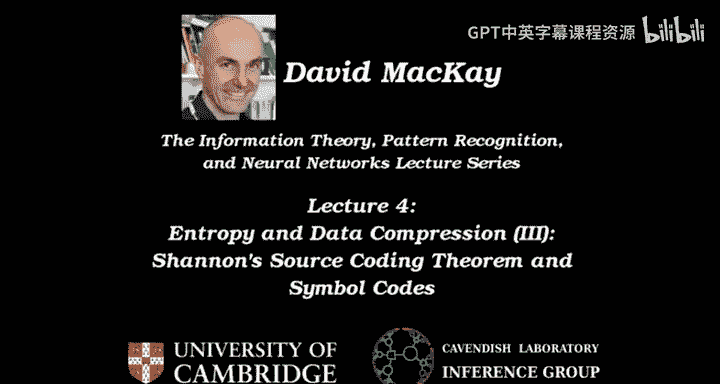
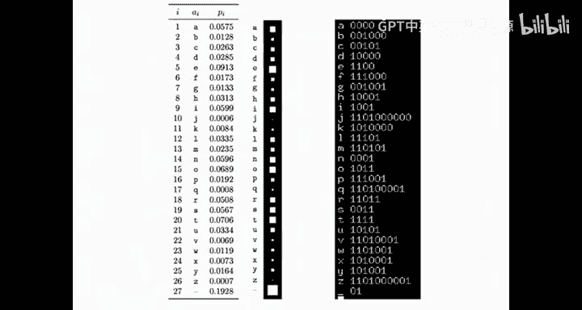
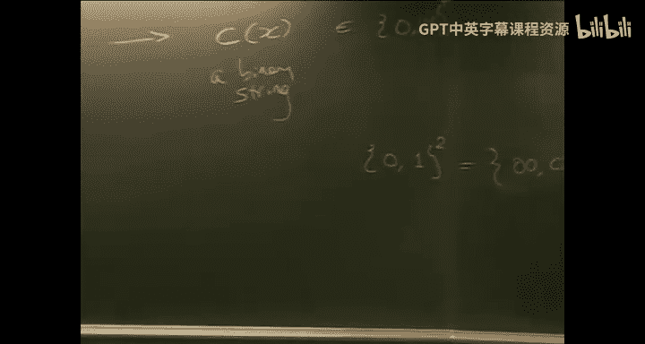
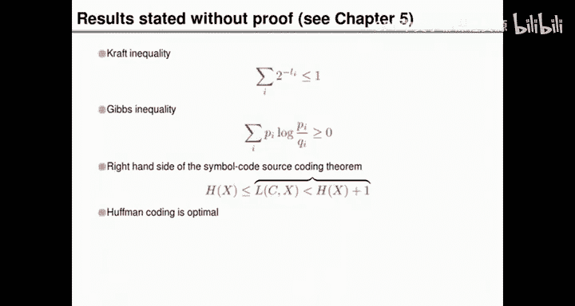
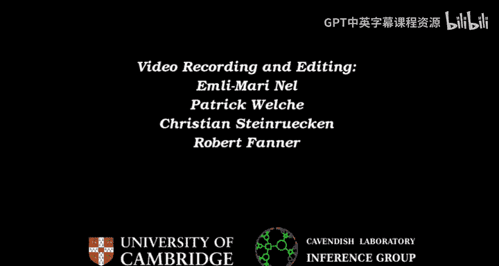

# 004：熵与数据压缩（三）——香农信源编码定理

在本节课中，我们将要学习信源编码（也称为数据压缩）的进一步内容，特别是符号码的理论与实践。我们将探讨符号码如何工作，如何衡量其性能，以及如何构造最优的符号码。

上一节我们介绍了通过典型集来证明信源编码定理的粗略思路。本节中我们来看看一种更实用的压缩方法：符号码。

## 符号码简介

符号码是一种压缩方法，适用于由字母表构成的信源，例如英语。其核心思想是为字母表中的每个符号分配一个二进制码字。

一个符号码是一个映射：
`C: X -> {0, 1}^+`
其中 `X` 是符号的字母表，`{0, 1}^+` 表示所有由0和1组成的非空字符串的集合。

编码过程很简单：将源文件中的每个符号替换为其对应的码字，并将这些码字不加任何标点地连接起来。接收方需要从连续的比特流中解析出原始的符号序列。

以下是使用符号码的一个例子：
假设我们为符号 `a` 分配码字 `0000`，为符号 `z` 分配码字 `1101001`，为空格分配码字 `01`。那么，要编码的字符串 `cab` 将被转换为这些码字的连接。

## 符号码的性能衡量

我们主要关心符号码的压缩效率，即其**期望长度**。期望长度 `L(C, X)` 定义为每个符号的码字长度乘以其出现概率后的加权平均：
`L(C, X) = Σ_i p_i * l_i`
其中 `p_i` 是第 `i` 个符号的概率，`l_i` 是分配给它的码字的长度（比特数）。

我们的目标是设计一个**唯一可解码**的符号码，并使其期望长度尽可能小。“唯一可解码”意味着任何编码后的比特串都只能对应唯一的原始符号序列。

## 符号码设计实例与分析

让我们通过一个具体的概率分布来探索符号码的设计。考虑一个包含四个符号 `{a, b, c, d}` 的字母表，其概率分布为：
`P(a) = 1/2, P(b) = 1/4, P(c) = 1/8, P(d) = 1/8`
这个信源的熵 `H(X)` 计算为 `(1/2)*1 + (1/4)*2 + (1/8)*3 + (1/8)*3 = 1.75` 比特。

以下是几个为该信源设计的符号码示例：

1.  **等长码**：所有码字长度相同（例如，均为4比特）。期望长度固定为4，效率不高。
2.  **变长码尝试一**：尝试为大概率符号分配短码字。例如：`a: 1, b: 01, c: 001, d: 000`。这个码的期望长度为 `1.875` 比特，优于等长码。
3.  **变长码尝试二**：另一个设计：`a: 0, b: 10, c: 110, d: 111`。这个码的期望长度恰好等于熵 `1.75` 比特。

我们需要判断这些码是否**唯一可解码**。第二个尝试 `(a:0, b:10, c:110, d:111)` 具有一个非常好的性质：**没有任何一个码字是另一个码字的前缀**。这种码称为**前缀码**。前缀码非常容易解码，因为接收方可以即时地、无歧义地识别出码字的结束。

相反，第一个变长码尝试 `(a:1, b:01, c:001, d:000)` 虽然也是唯一可解码的，但它不是前缀码，解码起来可能更复杂（例如，需要从后向前解码或使用其他方法）。

## 克拉夫特不等式与码的完备性

唯一可解码性对码字长度施加了一个根本性的约束，即**克拉夫特不等式**：
对于任何唯一可解码的码，其码字长度 `l_i` 必须满足：
`Σ_i 2^{-l_i} ≤ 1`
这个不等式可以理解为一种“预算”：每个长度为 `l` 的码字“消耗”了 `2^{-l}` 的预算，总预算不能超过1。

如果一个码恰好使不等式取等号，即 `Σ_i 2^{-l_i} = 1`，则称该码是**完备的**。完备码意味着没有浪费任何“编码空间”，通常（但不总是）意味着它是高效的。

## 符号码的性能极限

利用克拉夫特不等式和吉布斯不等式，我们可以推导出符号码期望长度的理论下界。

令 `l_i` 为实际分配的码字长度。我们可以定义一组“隐含概率” `q_i = 2^{-l_i} / Z`，其中 `Z = Σ_i 2^{-l_i}`（`Z ≤ 1`）。经过推导，期望长度 `L` 满足：
`L = H(X) + D_{KL}(P||Q) - log_2 Z`
其中 `D_{KL}(P||Q)` 是概率分布 `P` 和 `Q` 之间的KL散度（总是 ≥ 0），`-log_2 Z` 也总是 ≥ 0。

由此我们得到重要结论：
1.  **下界**：对于任何唯一可解码的符号码，其期望长度 `L` 满足 `L ≥ H(X)`。你无法做得比信源的熵更好。
2.  **达到下界的条件**：当且仅当码是完备的（`Z=1`）且码字长度恰好等于香农信息量（即 `l_i = log_2(1/p_i)`）时，等号成立，此时 `L = H(X)`。

然而，由于 `log_2(1/p_i)` 通常不是整数，而码字长度必须是整数，我们通常无法精确达到熵。但有一个保证：**总可以找到一个前缀码，使其期望长度满足 `H(X) ≤ L < H(X) + 1`**。即，最坏情况也不会比熵多出超过1比特。

## 构造最优符号码：霍夫曼算法

在实践中，我们如何为一个给定的概率分布构造最优（期望长度最短）的前缀码呢？答案是使用**霍夫曼算法**。

霍夫曼算法通过自底向上构建一棵二叉树来工作：

以下是霍夫曼算法的步骤：
1.  将每个符号视为一棵只有一个节点的树，其权重为该符号的概率。
2.  找出当前森林中权重最小的两棵树。
3.  将它们合并成一棵新的树，新树的根节点权重为两棵子树权重之和。为合并产生的分支任意分配0和1（例如，左分支0，右分支1）。
4.  重复步骤2和3，直到只剩下一棵树。这棵树就是霍夫曼编码树。
5.  从根节点到每个叶子节点（原始符号）的路径上，将经过的分支标签（0或1）连接起来，就得到了该符号的霍夫曼码字。

霍夫曼算法产生的码是最优前缀码，即它的期望长度在所有前缀码中是最小的。

## 总结与下节预告

本节课中我们一起学习了符号码，这是一种实用的数据压缩方法。
*   我们定义了符号码及其期望长度。
*   我们了解了唯一可解码性和前缀码的概念，以及它们带来的解码便利性。
*   我们引入了克拉夫特不等式，它描述了唯一可解码码字长度必须满足的条件。
*   我们证明了符号码的期望长度不可能低于信源的熵 `H(X)`，并且最多比熵大1比特。
*   我们介绍了霍夫曼算法，这是一种可以构造最优前缀码的优雅算法。

虽然符号码可以接近熵，但“最多1比特”的冗余对于某些应用可能仍然太多。在下节课中，我们将探讨如何突破这个限制，使用更强大的方法（如算术编码）来接近香农信源编码定理所指出的极限——`nH(X)` 比特。

