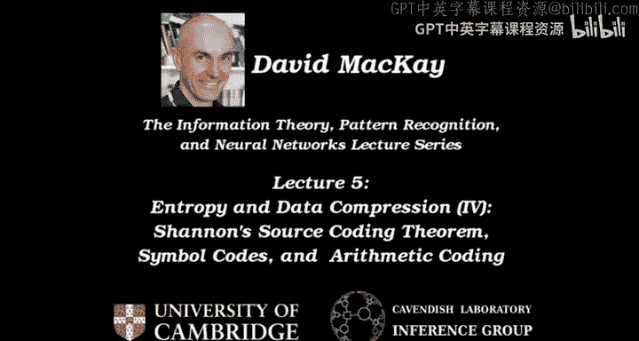
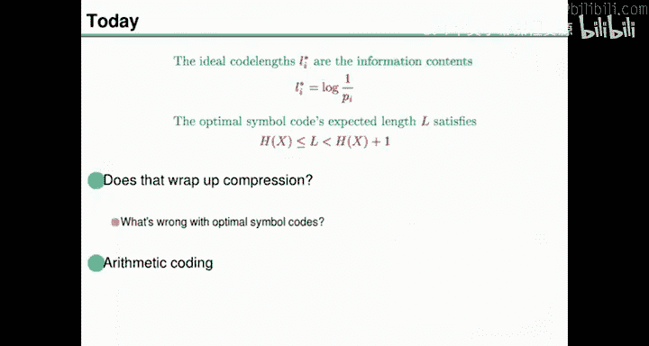
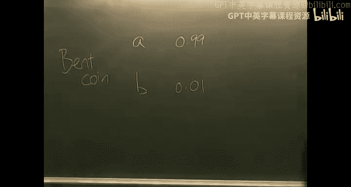
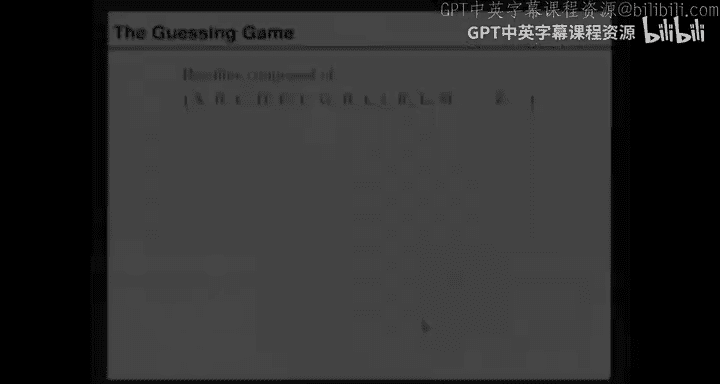
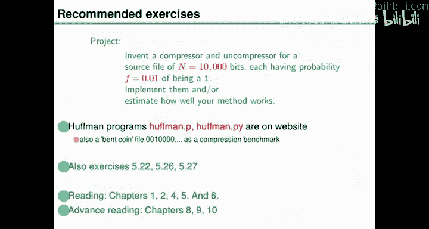
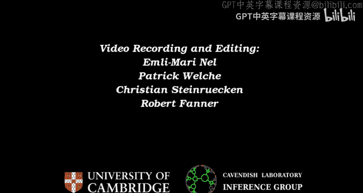

# 005：熵与数据压缩（IV）香农信源编码定理

在本节课中，我们将学习如何超越简单的符号编码，实现更高效的数据压缩。我们将探讨符号编码的局限性，并引入一种强大的压缩方法——算术编码。通过算术编码，我们可以处理上下文相关、自适应的概率模型，并接近香农理论所预测的压缩极限。

## 回顾符号编码

上一节我们介绍了符号编码，并探讨了其理论和实践问题。这为我们之前提出的主张提供了更多证据，这些主张现在已被充分证明。我们将它们视为正确的。

主张是：衡量信息内容的正确方法是使用结果概率倒数的以2为底的对数，即 `log₂(1/P)`。这不仅是衡量信息内容的合理方法，而且如果你使用好的压缩方法，它也是你期望能够将该结果编码成的比特数。

熵是信息内容的平均值。信源编码定理指出：如果一个信源的熵为 `H`，你可以将 `N` 个结果压缩成 `N * H` 比特。

我们研究了符号编码，即在没有标点的情况下，为字母表中的每个字母分配由0和1组成的二进制字符串。我们建立了一些关于它们的理论结果，其中一些没有证明。

因此，我们理解了唯一可解码性如何约束码长。你不能让所有码长都很短。如果你让某些码长变短，就必须让其他码长变长。我们引入了前缀码的概念，前缀码是与二叉树相关联的易于解码的编码。我们注意到，如果码长等于信息内容，那么你就得到了可能的最佳压缩，每个符号的平均长度就是熵。

我们未经证明地指出，使用最优符号编码，你可以达到熵值的一比特以内。最后，我们看到了霍夫曼算法，这是一个用于生成最优符号编码的极其简单的算法。

让我们用这些例子来回顾一下。

如果概率是 `[1/5, 1/5, 1/5, 1/5, 1/5]`。霍夫曼算法说：合并两个概率最小的符号，你可以任选。得到 `2/5`。再次合并两个概率最小的符号。然后再次合并两个概率最小的符号，任选。然后合并这些，得到 `1`。然后通过在边上分配0和1，我们可以定义编码。这个编码是 `00`，这个是 `01`，这个是 `100`，这个是 `101`，这个是 `11`。

让我们做另一个例子。如果概率与 `[1, 2, 3, 4, 5, 6, 7, 8, 9, 10]` 成比例。霍夫曼算法说：合并这些，合并这些得到 `6`，合并这些得到 `9`。然后取两个 `6`，得到 `12`。然后，`7` 和 `8` 合并得到 `15`。然后呢？仔细看，我们取两个 `9`，得到 `18`。然后 `10` 和谁合并？`10` 和 `12` 合并得到 `22`。然后两个最小的是 `15` 和 `18`，合并得到 `33`。然后合并得到 `55`。然后我们在任何地方加上0和1，就得到了最优符号编码。

一个问题：霍夫曼算法能确保我们得到前缀码吗？答案是肯定的，因为当我们加上标签时，我们正在构建一棵二叉树。我们从树的根节点向外定义码字。如果码字是根据二叉树定义的，那么一个码字不可能是另一个码字的前缀。因此，霍夫曼算法总是给出一个前缀码，并且它是最优的，你无法做出更好的符号编码。

你可能会认为，这就解决了压缩问题。关于前缀码，你可能会问的另一个问题是：制作前缀码就足够了吗？如果有人声称有一个非常巧妙的想法，要制作一个非前缀码，并且会更好。我们能证明这是不真实的吗？答案是肯定的，我们可以通过以下相当简单的论证来证明它是不真实的。

想象一下，有人制作了一个符号编码，他们声称它很棒，而且它不是前缀码。你说，好的，请告诉我你所有符号码的长度，从最短长度开始，一直到最长长度。按长度排序给我。然后我将去我们上次介绍的符号编码超市，从一边走到另一边。我将首先购买最短的码字。然后买了一些短的之后，我将根据你给我的购物清单，移动到下一个通道购买下一个长度的码字，依此类推。只要你给我的购物清单没有超过总预算 `1`，我就能够购买你的码字长度。

因为我是一步一步地移动，从不与自己重叠，所以我最终会得到一个前缀码。违反前缀性质的唯一方式是你购买了两个在超市中具有相同垂直坐标的码字。

所以霍夫曼算法已经是最优的。它生成前缀码。我们不需要担心这个。但万一有人声称，我想做一些聪明的事情，不使用前缀码。那么，无论他们用非前缀码能得到什么期望长度，我们都可以匹配它，我们只需用前缀码替换他们的编码。

这里展示的英语编码确实是使用霍夫曼算法制作的编码，它是一个前缀码。

那么，我们是否通过说明如何制作符号编码和最优符号编码来完成了压缩？不，在今天的剩余时间里，我想论证我们还没有完成压缩。原因在于不等式中的那个 `+1`。

让我们用一个非常简单的例子来证明这一点。

## 符号编码的局限性

例子是我们开始时提到的偏置硬币。假设我们有一个偏置硬币，它的两个面称为 `A` 和 `B`。假设它们的概率是 `0.99` 和 `0.01`。

现在我说，我将使用霍夫曼算法来压缩它，因为它能生成最优符号编码。你仔细找到两个概率最小的符号。你将它们合并成一个，然后在这里加上标签，你说，我将把 `A` 编码为 `0`，`B` 编码为 `1`。这不是很棒吗？这是一个最优符号编码。它的期望长度是 `1` 比特。

这确实接近熵值，熵是 `0.08` 比特。它在熵的一比特以内，但实际上比熵大约大了12倍。它根本没有压缩，只是直接使用二进制字母表，没有进行编码。

这是一个简单的例子，说明简单的编码显然没有达到我们真正想要的目标。香农说我们应该能够实现超过十倍的压缩。

现在我想和你玩一个游戏，帮助我们理解可能对不等式中的 `+1` 感到不满的情况。

## 猜词游戏

游戏叫做猜词游戏。现在我要做的是在黑板上写下一个报纸标题。标题已经写在这里了。我将借助你们的帮助来写它。

因为你们将依次猜出标题的每个字母。如果你们猜对了第一个字母，我会写下来，告诉你们猜对了。然后我们可以继续猜标题的第二个字母。这个标题的合法字符字母表是 `A` 到 `Z` 和空格。

当我们完成标题时，我会让你们知道。我会在标题末尾加上句号。

你们可以开始猜第一个字母，我将在这一行下面写下你们所有不正确的猜测。当我在上面一行写字时，就告诉你们猜对了正确的字母。开始猜吧。

（游戏过程省略...）

所以有一个标题，它涉及到你们作为英语专家，利用你们对英语的知识来进行预测。

我希望你们注意一些关于你们所做预测的事情。第一件事是，我认为你们很清楚，你们的预测分布，即你们在特定时刻会做出的预测，会根据上下文而变化。

例如，第二个字母，你们所有的预测都是元音。因为你们在努力思考在 `N` 之后可能出现的非元音字母。可能是一个 `N` 或其他奇怪的字母。这是一个例子。这里有一个上下文，你们预测 `K` 作为首选，而在一般位置，你们会说像 `T`、`A`、`B` 等。所以你们的预测依赖于上下文。

这是因为普通英语中字母之间存在相关性。你们知道单词和语法等等。

所以，问题是：符号编码有什么问题？如果我们只使用一次霍夫曼算法，并为英语字母表制作最优霍夫曼码，它将不对应于变化的概率分布。我们如何解决这个问题？原则上，你可以通过说，哦，让我们每次都运行霍夫曼算法来解决。所以我们将有某种过程来模拟你们的专业知识。当我们到达特定上下文时，我们可以使用对该上下文最优的概率分布来压缩下一个字符，制作最优符号编码，然后发送相应的下几个比特（三个、两个或一个比特），接收端的人也可以模拟这个过程，找出你为每个字符将要使用的霍夫曼码（符号编码）。

你可以这样做，但这听起来有点麻烦。还有一个问题，如果预测非常精确，你仍然需要为每个字符花费至少一比特。我马上会写下来。

我的第二个问题是，上下文相关的预测也会随着你对正在压缩的文档风格的学习而改变。我们在标题中没有真正看到这一点，因为它不是一个很长的文档。但如果我说，这里有一个标题。如果我开始写，在你们做了很多猜测之后，我开始写 `Nime Fer andweiwe`，你们可能已经意识到这不是一个英语标题。因此，你们会开始学习适用于斯瓦希里语的预测分布。

所以，早期，你们可能不太懂斯瓦希里语。当你们到达一个非常长的文档的末尾时，你们会开始学习斯瓦希里语的短语和单词。所以你们的预测会演变。你们会回头看，哦，他又在重复这个长单词了。让我们尝试用它来进行预测。

所以预测会改变，意思是它们变得更加精确和细化，随着你获得数据。然后是第三件事，就是我刚才说的。通常，你们做出的预测非常有信心。这是最重要的事实。通常，你们的预测分布非常确定。

我们可以通过记录你们第一次猜对字母的次数来证实这一点。让我们数一下你们在猜对之前做了多少次猜测。这里你们猜了5次，这里猜了2次，5次，1次，2次，3次，4次，5次。所以在一个单词的开头和一个短语的开头，很难预测会发生什么。有很多不确定性。然后我们稳定下来：3次猜测，1次，1次，1次，3次（又是一个单词的开头），1次，2次，3次，4次，5次，6次，7次，8次，因为我们还在单词的开头，哦，对不起，8，9，10，11次才得到 `F`。3次得到 `U`。然后变得容易了：1次，1次，1次，1次，1次，1次，1次，2次，3次，4次，5次猜测，1次，1次，1次，1次，`M` 用了1，2，3，4，5，6，7，8次。1，2，3，4次和2次猜测，然后1，1，1。4，3，1，1，1。如果你们实际上对那些特定的预测不是相当确定的话，你们在那里有这么多一次猜中的情况是相当不寻常的。我没有从你们那里引出你们到底有多确定，但我们可以通过某种过程来弄清楚你们的几率，如果我提供金钱奖励之类的。

所以，通常情况是，下一个字母是高度可预测的。那么我在说什么？我说的是一个典型的上下文相关预测，然后我们可以将其输入霍夫曼算法。例如，它看起来像这样。会有一些字母不太可能出现。有一个字母你非常确定会出现，它可能占有99%的概率质量，还会有许多其他字母，它们的概率非常小。所以你的预测分布可能看起来像这样。

这是一个预测分布的示意图。有10个字母是可能的，但可能性不大。其中一个占有99%的质量。让我们在这个分布上运行霍夫曼算法。你合并，合并。最后，你把这个和所有其他的合并。像那样。

这就得到了你的最优符号编码。如果我们坚持使用符号编码，你得到的长度必须大于1比特。期望长度，因为符号编码中的每个码字至少有一比特长。然而，这个分布的熵，有点像我们之前提到的偏置硬币，是 `0.11` 比特。

所以符号编码的根本问题是什么？如果你使用符号编码，你被迫为每个源字符使用至少一比特。这很糟糕，因为熵可能经常远小于每字符一比特。

即使熵远小于一，你也必须这样做。现在，处理这种情况的一个想法是说，哦，我确实喜欢霍夫曼码。我并不是要马上否定它。对不起，让我们把它放回去。

与其以这种愚蠢的方式使用霍夫曼码，我可以尝试更聪明一点。你可以说，让我们一起编码字符块。所以你可以一次取 `n` 个字符，并说，我可以通过一次处理比如6个或16个字符的块来消除单个符号概率很高的问题。然后我列出所有可能的16个字符的块，并询问观众所有 `50^16` 个长度为16的字符序列的概率（假设字母表大小为50）。然后我们可以使用霍夫曼算法来编码这些块。

或者你可以说，让我们从游程的角度思考。我们可以说这里有多少个连续的 `1`。我们可以请观众预测在你出错之前，你认为你会连续得到多少个 `1`。我可以请你押注那个数字，即游程的长度。这会给出一个整数，比如从5次猜测中得到0。然后有一个长度为3的游程。然后有三次猜测，等等。所以我们可以编码到一个不同的字母表，在那里我们讨论游程长度。然后使用霍夫曼算法，那里会说很少。哦，是的，我们仍然可以使用霍夫曼，但也许我们发现这一切有点复杂。也许我们想继续前进，说有一种比简单编码更好的方法。这就是本讲座的信息。

所以，如果你要做我刚才描述的事情，例如编码字符块，你将不得不计算更多的联合概率。如果我们到达这一点，我会说，好的，`R E F`，现在，告诉我，你认为接下来的五个字符可能是什么？猜接下来的五个字符。好的，再猜，再猜。是的。我会隐含地遍历接下来五个字符的大量可能性列表，即使实际上只有一个五字符序列会发生。所以你将不得不考虑更多的可能性。

总之，我们想要的是一个数据压缩的解决方案，其中我们可以使用上下文相关、自适应、概率模型。所以我们希望允许上下文依赖性。我们希望允许适应性。并且我们希望能够处理非常集中的概率分布。

这是我的总结。我们想要一个能够处理上下文相关、自适应、概率模型的方法。我们想要使用它。并且我们希望通过很好地处理强确定性分布来消除 `L` 和 `H` 之间的符号编码差距。

好的。我即将告诉你如何解决这个问题。但首先，让我们在擦掉黑板之前想想我们可以用它做什么。

## 算术编码原理

这里有一个我们可以玩的游戏。我将在一张纸上写下绿色的整数。你们猜第一个字符需要多少次？5次。下一个5次，下一个5次，3次，1次，1次，1次，3次，1次，11次，3次，1次，1次，1次，1次，等等。我可以把这些整数写在一张纸上。现在，这些整数包含了足够的信息来重建标题。某种程度上。

想象一下，通过这堵墙，有另一个完全相同的演讲厅。完全相同的意思是前面有一个讲师，是我的双胞胎。你们在演讲厅里的所有人也以你们完全相同的双胞胎的形式在那里，有着完全相同的想法、信念和预测。我们把这个通过墙传到另一个演讲厅。

现在我进来说，好的，我们刚刚讨论了符号编码，现在我们要玩一个猜词游戏。我要告诉你们我有一个写在纸上的标题。好的，我有一个标题，它使用这里的字母表，请开始猜。然后你们开始猜，你们说 `T`，我说不，你们说 `A`，我说不，你们说 `S`，你们说... 然后当我们到达第五次猜测时，因为纸上写着 `5`，有人说 `M`，我说，是的，纸上就是这么写的。好的，我们得到了 `M`。然后我们继续。通过我在你们猜对数字时停止你们。并且因为我们是隔壁演讲厅的完美双胞胎，我们最终会在黑板上写下完全相同的字母集，我们会经历相同的推理过程，最终得到标题。

好的。这是一个有趣的想法，我们无法完全实现，因为我们没有双胞胎。但它是所有最先进压缩算法的核心，你在两端安排相同的双胞胎，这些相同的双胞胎为我们运行这个上下文相关、自适应、概率建模的软件。

是的，问题。问题是：我们是否假设这是一个确定性的宇宙？所以双胞胎会完全复制我们？是的，为了今天的目的，宇宙实际上是确定性的，你的双胞胎会表现得和你完全一样。这是我假设的类比。

好的，为了让这在现实生活中工作，我们需要确保我们有确定性的计算机。所以我所说的自适应概率模型将是一个计算机程序，试图模拟像你们这样的专家听众。我们将在编码计算机上有一个该程序的副本，并且在另一台计算机上有一个完全相同的、确定性的副本，它将以完全相同的方式工作，这样我们就可以复制你们的猜测和预测。

好的，那么我们怎么做呢？首先，我将介绍一种称为算术编码的编码方法。我将使用几个玩具例子向你们介绍它。其中一个将是整个双胞胎场景，但我们将从稍微简单的例子开始。

让我们给自己三个任务。这些任务比我们这边黑板上的一般愿望更简单。它们更简单，但具有我们正在努力解决的问题的本质。

第一个例子将是偏置硬币。我们可能有一个偏置硬币，概率 `P(A)=0.99`, `P(B)=0.01`。我们已经知道符号编码在这方面很吃力。我们必须对符号编码做一些笨拙的处理才能为这个偏置硬币文件获得任何压缩。

我们将讨论的第二个例子是未知的偏置硬币。我可以告诉你们，看，我口袋里有一个偏置硬币。它被用来生成一个巨大的 `A` 和 `B` 文件。这就是我告诉你们的全部。我不知道偏差是多少，但你们知道它是一个有偏的硬币。你们只是还不知道 `P(A)` 和 `P(B)` 是多少。然而，在运行中，我希望你们开始预测，就像标题一样，你们不知道是什么语言，不知道它是关于什么的。随着我们进行，你们开始弄清楚它是什么类型的主题。

所以是一个未知的偏置硬币。因此，一个典型的结果可能是很多 `A` 和很少的 `B`，或者很多 `B` 和很少的 `A`。你们事先不知道哪种情况会发生。

我们将讨论的第三个任务是通用情况，其中有一个预言机可用。预言机的工作是，给定任何上下文 `X1, X2, X3, ..., X_{T-1}`，预言机将提供下一个字符的概率，你应该假设这是下一个字符的正确分布。在另一端会有一个完全相同的双胞胎预言机，它将对相同的上下文产生完全相同的分布。

所以这是任何上下文。那么问题是，当你拥有那个预言机时，你应该如何压缩？现在，预言机实际上是压缩问题的一个完全通用的陈述，因为偏置硬币可以由预言机产生，它只是忽略上下文。它说 `A` 的概率是99%，`B` 的概率是1%。所以预言机也包含平凡的情况。预言机处理偏置硬币的方式是，给定上下文，它会查看发生了多少 `A` 和 `B`，它会推断出它认为 `P(A)` 和 `P(B)` 可能是什么，并在预测下一个是 `A` 还是 `B` 时考虑到关于 `P(A)` 和 `P(B)` 的不确定性。所以它在完全没有上下文时的第一个猜测会是，嗯，50/50。我不知道，可能偏向 `A` 或 `B`，我不知道。所以会是50/50。然后当它看到一个 `A` 时，它可能会说，嗯，这是偏向 `A` 的微弱证据。它会给 `A` 一个稍大的概率。它的双胞胎会以完全相同的方式行事。

好的，这就是我们想要解决的三个任务。现在，我们将定义算术编码。我应该顺便提一下，算术编码并不是除了符号编码之外做数据压缩的唯一其他方法。但在我看来，它是唯一值得用一节课来专门介绍的其他方法。还有许多其他算法，其中一些相当优雅。但对我来说，算术编码是压缩之王。所以请随意离开，阅读教科书和文献，了解其他压缩方法。

以下是算术编码的工作原理。算术编码基于这样一个想法：你可以将二进制字母表中的任何传输视为定义实数轴上的一个区间。例如，`01` 是一个小二进制字符串。你可以将其视为对应于十进制中从 `0.25` 到 `0.5` 的区间。`100` 我们可以关联到从 `0.5` 到 `0.625` 的区间。

我们所做的是，我们正在使用符号编码超市。将超市的顶部视为实数 `0`，超市的底部视为实数 `1`。任何特定的区间，你可以看到 `01` 在那里。它从超市的四分之一处到一半处。好的，所以我们只是字面上把超市当作一条实线。

关于超市，你可以注意到，当你向右移动时，如果你将一个字符串从，比如 `01` 延长到 `010`，与该延长字符串关联的区间是你开始时的区间的子区间。所以当你延长一个二进制字符串时，你总是在定义一个子区间。你要么这样减半，要么那样减半，你总是减半、减半、减半，最终总是落在你之前所在的位置内。

所以我们在说什么？我们在说，你可以想象任何二进制文件前面都有一个小点，称为小数点或二进制点。然后剩下的字符是实数的二进制展开。例如，任何以 `01000...` 开头并持续 `8` 百万比特（因为一兆字节就是那么大）的一兆字节文件。任何一兆字节文件都定义了一个具有大约8百万二进制数字或2百万十进制位精度的单个实数。任何一兆字节文件都定义了一个实数，精度大约为2百万个小数位。如果你向它添加另一兆字节的二进制数据，你就将它定义到了另外2百万个十进制位。

好的，所以整个文件只是发送一个数字。那么我们接下来需要做什么？我们将使用我们的模型产生的概率。模型可以是偏置硬币、未知偏置硬币或预言机。我们将使用来自我们的自适应、上下文相关、概率模型的概率来细分当前区间。最初，当前区间将是 `0` 到 `1` 的区间。所以我们将询问我们的概率模型，`A`、`B`、`C` 的概率是多少？它可能会说 `42.5%`、`42.5%` 和 `15%`。希望它们加起来是 `100%`。然后你说非常感谢。我现在要问你，假设文件中的第一个字符实际上是 `B`，请告诉我在该上下文中可能字符的概率。然后我们将使用来自我们的专家（来自我们的预言机）的概率递归地细分那个区间。

现在让我们展示给你看。好的。这里我们有一个小工具，里面有两个实数区间，它们是相同的实数区间，我们可以用二进制细分它们。

所以出现了一个符号编码超市。我们可以选择任何你想要的概率模型（至少在合理范围内），并使用它根据这里的概率（`A` 42.5%，`B` 42.5%，`C` 15%）来细分这个世界。如果我们处理的是固定的偏置硬币或固定的概率分布，你可以保持固定的概率，并使用相同的概率 `A`、`B`、`C` 来细分 `A` 的区间，递归地这样做。`B` 以相同的方式细分。`C` 以相同的方式细分。依此类推。

所以，在左侧，如果有人给了你一个文件，你可以询问预言机概率。然后你可以识别与实际发生的文件相关联的区间。

类似地，在右侧，你可以四处寻找，找到一个二进制字符串，它与左侧的区间几乎完全对齐。

然后编码的方法将是：我们编码整个文件，而不仅仅是一个字符，整个文件 `X`，即第一个字符，第二个，第三个，直到 `N`，长度可能为数百万字符。我们通过传输一个二进制字符串来编码整个文件，该字符串的区间位于源字符串的区间内。

所以，在整个字符串只是 `B` 后跟 `C` 的非常简单的情况下，我们会在这里找到那个二进制字符串。我们会细分，再细分，然后再细分（这样或那样），我们会寻找，我们会找到一个二进制字符串。那个怎么样？那个二进制字符串完全位于那个区间内，所以我们可以将 `B, C` 编码为，让我们给自己一些 `0`、`1`、`0` 和 `1`、`0` 和 `1`。所以它被编码为一个 `1`、`0`、`0`、`0`。

我强调，我们对整个文件都这样做。当你得到整个文件时，你找到二进制区间。所以你找到一个很长的二进制字符串，其区间位于这里对应的区间内。

让我们为偏置硬币做这个。让我们给自己一个偏置硬币。让我们将字母表大小减少到 `2`。假设概率固定为，比如 `0.9` 和 `0.1`。所以我定义了我的语言模型为第一个任务，偏置硬币。我们重新审视这个。

现在怎么样？啊。所以现在我正在使用偏置硬币。假设发生的是 `AAAABAA`。我们稍后会讨论如何准确终止文件的细节，我现在只想向你展示我们在哪里找到那个区间。所以在左侧，我们使用了 `A`、`B` 来细分，我们可以继续使用那个。在右侧，我们有普通的二进制世界，我们想要4个 `A` 后跟一个 `B` 和两个 `A`。所以 `A`、`A`、`A`、`A`，然后我们想要 `B`。所以我们进入这里，我们快速移动，在这里，我们给自己又加了两个 `A`。所以这里是区间。它从那里到那里。在右侧，这里是二进制世界。我们已经以完全相同的方式放大到二进制世界。

所以这里的这个字符串就是我们想要的。如果我们继续下去，只是继续得到更多的 `A` 和 `B`，你可以看到左侧的字符串变长了。现在大约有100个字符。嗯，嗯。好的，最多92个字符。在右侧，我们有相应的二进制字符串，只有大约48个字符。它很长。我们实现了什么？两倍的压缩。`0.9`、`0.1` 的熵是多少？大约是 `0.5`。所以我们实现了香农说我们应该能够实现的压缩。我们为这个偏置硬币将二进制字符的数量减少了大约一半。

好的，那么具有未知偏差的偏置硬币呢？我们可以说我们不知道概率。所以我按下了称为自适应的按钮。自适应是做什么的？它说，我们开始时应该猜什么？嗯，是50/50，因为我们不知道偏置硬币的偏差。但是一旦我们看到了一个 `A`，那么下一个结果是 `A` 的可能性就稍微大一点，因为它可能是一个强烈偏向 `A` 的硬币，或者它仍然可能偏向 `B`，但这是一个不太可能的命题。所以假设发生了 `A A A A B A A`。

所以当我们在这里继续时，这是一个 `A`，两个 `A`，连续三个 `A`，连续四个 `A`。然后我们得到一个 `B`。让我们放大一点。太多了。好的，所以这里是三个 `A` 和一个 `B`。我想你是说四个 `A` 和一个 `B`，好的。

所以这是我们的自适应模型，使用依赖于上下文的概率。假设我们输入了4个 `A` 和一个 `B`，所以看起来 `A` 是赢家，你继续下去。结果 `A` 实际上是不太可能出现的字符是一个巨大的侥幸。所以你继续下去。你得到了很多 `B`，然后又一个 `B`，然后又一个 `B`。看，预测分布发生了什么变化？它又变得偏向 `B` 了。

所以即使早期看起来 `A` 是赢家。我们得到了很多 `B`，最终我们为 `B` 分配了更多的实数线。这意味着二进制字符串变得比我们开始时更短。

好的，所以我们可以处理未知的偏置硬币，我们也可以处理预言机。让我们倒回去。

让我们给自己一个英语语言模型。那么第一个字符会是什么？嗯，是 `A` 到 `Z` 或空格。所以我们进入盒子。这里是 `A` 到 `Z`。右边是普通的二进制世界。假设我们有 "the quick brown fox jumps over the lazy dog"。所以我们进入这里，`t`、`h`、`e`、空格、`q`、`u`、`i`、`c`、`k`... 注意在 `Q` 之后，语言模型说，哦，我刚刚看到了一个 `Q`，所以 `u` 必须非常可能。它把大约一半的概率分布分配给了 `u`。这就是我们拥有的预言机类型。它查看上下文并相应地修改预测。在 `Q` 之后，它也给空格分配了相当多的概率质量，因为我是在一个Linux常见问题解答上训练的这个模型。它里面有很多单词 "faq"，后面跟着一个空格。所以这就是为什么空格是第二可能的字符。

所以我们可以继续 "the quick..." 嗯。它去哪了？"quick brown fox"，等等。所以我们在左侧放大。在右侧，与之相连的是一个二进制世界。如果你现在把那个二进制字符串发送给另一端的人，他们以完全相同的工具、完全相同的状态开始。他们只需要记住 `1,1,0,0,1,1,1` 等等。我记不住，哎呀。

所以我们以完全相同的状态初始化工具，我们进入这里，我们说消息是什么？是 `1,1,0,0,1,1,1`。我们进入那个 `1,1,0,0,1,1,1`，等等。在右侧，你可以看到 "the quick brown fox" 确实应该出现，因为我们在两端有相同的双胞胎软件。

所以，这就是算术编码。

## 算术编码的优势

让我们强调算术编码有多么出色。首先，我们应该给出证据证明这确实几乎是最优的。让我为你写下一个定理。

我刚才几分钟前提到的那个二进制字符串的长度，我们发送的那个，那个二进制字符串的长度满足这个不等式。我称它为 `X1` 到 `XN` 的编码长度。它小于或等于香农信息内容，即 `log₂(1/P(X))`，这是香农所说的绝对完美压缩应该达到的长度，小于或等于那个值加上 `2`。

所以整个压缩文件的长度只比香农希望你拥有的最优长度长 `2` 比特。这里要真正强调的是，当你将其与符号编码可以做的进行比较时，对于符号编码，你得到的每个字符的长度是在熵的一比特以内。这意味着对于一个有 `N` 个字符的文件，可能的开销可能高达 `N`，这是一个巨大的开销。而这里整个文件的开销只有 `2` 比特。所以它比符号编码的开销小 `N` 倍。

为什么会这样？为什么我们最终得到最优长度？嗯，如果你只是想想我们正在经历的细分过程。第一个区间的大小等于第一个字符的概率（给定你的模型）。然后你按照第二个字符（给定第一个字符）的概率比例来细分它。这里是可能性的字母表，这两个的乘积等于 `X1` 和 `X2` 的联合概率，只是简单的概率论，是的。然后当你再次细分时，你取那个大小为 `P(X1, X2)` 的区间，我把它复制到这里，然后你细分。你说，这是 `X3` 的概率（给定 `X1` 和 `X2`）。如果你用这个长度乘以那个分数，你就得到了 `X1`、`X2` 和 `X3` 的概率，依此类推。所以你在左侧字母表世界中得到的区间的大小正是字符串的概率。

现在，当你找到一个与该区间对齐并紧密贴合在里面的二进制区间时，如果它完美地贴合，那么你需要多少比特来表示那个二进制字符串？嗯，每次你从 `1` 开始，然后得到一半，四分之一，等等。所以你经历的减半次数是你最终得到的二进制区间大小的以 `2` 为底的对数。所以如果它完全贴合，那么二进制字符串的长度将恰好等于这个数字（概率的倒数）小于 `1` 的以 `2` 为底的对数，即 `log₂(1/P)`。所以，对于紧密贴合，你最终会得到恰好最优长度的二进制字符串。

实际上，你不会完全紧密贴合，但书里有一个练习。你可以做这个练习并证明，在最坏的情况下，最坏的非紧密贴合情况可能是二进制字符串比字母表字符串小 `4` 倍。所以你只需要额外 `2` 比特就能保证你找到了一个位于内部的二进制字符串。

好的，这是第一个事实。这太棒了。注意第二点。

我想让你注意的另一件事是，做所有这些需要多少工作？我们需要做什么？我们需要考虑所有可能发生的字符串吗？不，我们只需要考虑第一个字符的概率，然后考虑第二个字符在第一个字符实际发生的情况下的概率，然后我们需要考虑第三个字符在实际发生的上下文下的概率。所以所需的工作只是这个：我们只需要计算 `N` 个条件概率向量，或者用实际概率来描述，如果 `I` 是字母表大小，我们只需要计算 `N * I` 个条件概率。然后我们只需要做大量的缩放和位移来跟踪算术运算。

所以这比我们想象中可能必须使用符号编码来处理偏置硬币的方法要少得多，当我们说，哦，让我们把它们分成块，你可以有10个可能结果的块。那么每次你读入另外10个字符时，你需要考虑 `2^10` 个字符串。所以这里可能有非常大的前置因子，我们只需要考虑 `N * I` 个东西，`N * I` 个条件概率。怎么可能比这更少呢？嗯，不能。这是你必须做的相当少量的工作。

注意第三点，关于算术编码，我想让你注意的另一件美妙的事情是，它与任何源字母表和任何传输字母表兼容。

在我们经历的例子中，我给了你一个三元字母表 `ABC`。然后我切换到偏置硬币 `A` 和 `B`。然后我切换到英语，`A` 到 `Z` 和空格。你可以使用任何源字母表。在编码端，在右侧，我们不必使用二进制。我们可以使用三元，所以从现在开始，这里有一个三元文件出来，里面有一些 `0`、`1` 和 `2`。所以你也可以编码到你想要的任何字母表。这是一个做压缩的非常漂亮的框架。

算术编码被广泛使用。它不是超级知名。但它存在于许多最先进的压缩标准中。例如，算术编码用于 `JBIG`，这是一个二进制图像压缩标准。它在一个叫做 `PPM` 的语言模型中，该模型在文本压缩中非常广泛地使用。它在一个叫做 `Deja Vu` 的文档压缩标准中。

关于算术编码，最后要注意的一点是，它完全将概率建模与编码分离开来。有许多压缩算法是某种计算机技巧。它们说，好的，查看源文件，做这个，做这个，做这个，列出东西，按字母顺序排列它们，等等。然后有一些规则将其转换为二进制。

在这里，概率建模的任务是预言机的任务。所以你应该做人工智能，制作真正好的预言机。然后当你制作了一个真正好的预言机，它理解如何预测你的语言时，算术编码介入并告诉你如何将其转换为二进制。所以人工智能的任务与输出二进制字符串的任务完全分离。这对我来说感觉比许多其他压缩方法更优雅，其他方法可能具有某种渐近最优性，但它们往往把这两个问题混在一起。它们把概率建模和编码任务混在一起。

## 总结与展望

下次我们将继续下一个主题，即通过噪声信道进行通信。但我会告诉你关于算术编码的更多想法。我将从一个你无疑在这次讲座中已经注意到的事情开始，那就是你可以用这个算术编码的概念做其他事情。

所以我刚才做的，嗯，刚才我演示了一个算术编码器，但它看起来也像我在用鼠标写字，确实，我是。所以我们可以采用算术编码的概念，制作一个书写工具，用我称为手指的实数生成设备，我只需上下移动鼠标就可以生成一个实数。我可以用英语写，我可以用任何语言写任何我想要的字符串。我会用英语为你写。选一个句子。让我们谈谈从集合中高效生成样本。所以我们开始。`I`、`F`... 哎呀，我迷路了。忘了字母顺序。这是一个糟糕的演示。好的，我们继续，不，`efficient generation`。所以我只是上下移动鼠标。仅仅通过移动我的手指，我就可以写出文本。这是一种可以由任何肌肉驱动的书写方法，任何能产生实值信号的肌肉，所以我可以用我的肌肉上下移动鼠标，并在顶部输出英语文本。这是一种创纪录的用非常少的肌肉（只用鼠标）交流英语的方法。有些人可以每分钟写40个单词。所以每分钟40个单词，只用一根手指。用眼动仪也可以完全不用手，只需用眼睛看你想去的这个世界。同样，仅通过凝视，每分钟写大约30个单词也是可能的，这要归功于算术编码的奇迹，它允许你从残疾人士可能做起来相当痛苦的手势中获得最大的信息内容。

所以这叫做 `Dasher`。`Dasher` 本质上是颠倒过来的算术编码。`Dasher` 是免费软件。可以从 `Dasher` 网站获得。我鼓励你告诉所有人。

下次我会问你的一个关于数据压缩的最终问题是：如果我们有一个字母表 `A`、`B`、`C`、`D`，概率为 `1/2`、`1/4`、`1/8`、`1/8`。如果我们使用这个符号编码，那么从编码流中随机抽取的一个比特是 `1` 的概率是多少？我们将在下次首先讨论这个问题。和上次一样，我会提醒你们，这张幻灯片上有一个练习列表，我也鼓励你们作为本课程的一部分来完成这些练习。

非常感谢大家来听讲。对不起，我超时了。

---

**本节课总结**：在本节课中，我们一起学习了算术编码，这是一种强大的数据压缩技术。我们首先回顾了符号编码（如霍夫曼编码）的局限性，特别是当面对高度确定的概率分布时，每个符号至少需要一比特的开销。然后，我们通过猜词游戏引入了上下文相关和自适应概率模型的概念。接着，我们详细介绍了算术编码的原理：它将整个消息映射到 `[0,1)` 区间内的一个子区间，该区间的大小等于消息的概率。通过传输一个位于该区间内的二进制数，我们可以用接近香农信息理论极限的长度来表示消息。算术编码的优点是开销极小（整个文件仅额外增加约2比特），计算高效（只需顺序计算条件概率），并且完全分离了概率建模（人工智能任务）和编码任务，兼容任意大小的字母表。最后，我们提到了算术编码的变体 `Dasher` 作为一种高效的辅助输入设备。通过算术编码，我们能够实现接近最优的压缩，克服了简单符号编码的主要缺点。