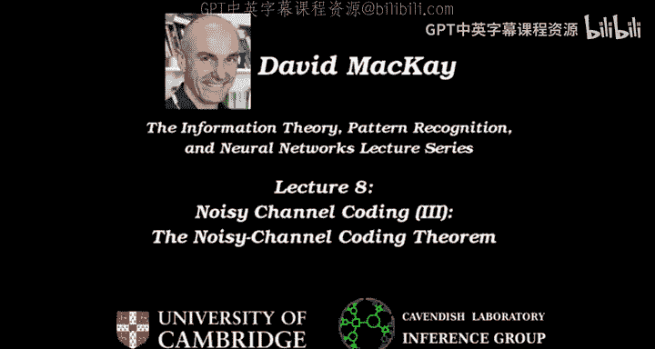
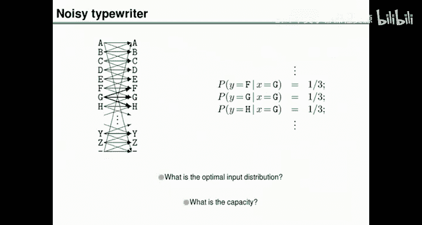
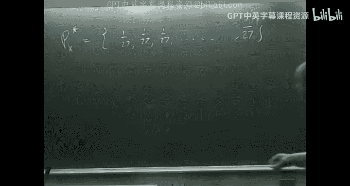
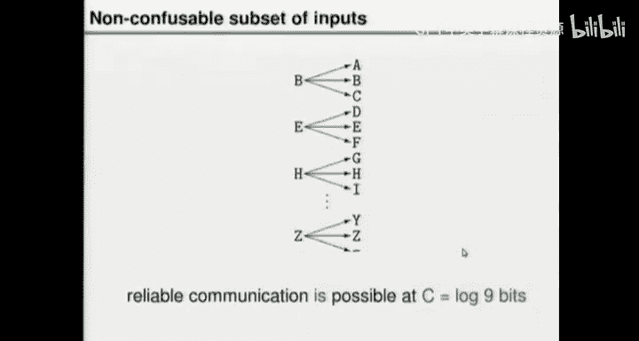
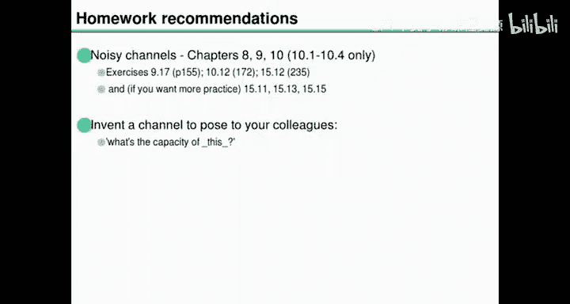
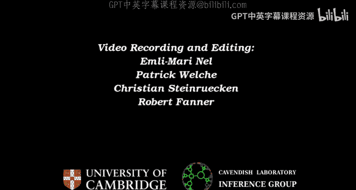

# 008：有噪信道编码定理

在本节课中，我们将学习信息论的一个核心成就：香农的有噪信道编码定理。我们将理解信道容量的定义，并通过一个具体的例子（二进制对称信道）来证明这个定理。该定理表明，只要通信速率低于信道容量，就存在编码方案可以实现任意小的错误概率。

## 信道容量回顾

上一节我们定义了信道的容量。一个信道由一组输入和对应的输出概率分布组成。信道的容量是通过对输入选择一个概率分布，计算输入与输出之间的互信息，然后对所有可能的输入分布最大化这个互信息得到的。这是一个理论值，称为容量 \( C \)。

我们将要证明的是，这个容量 \( C \) 不仅仅是理论上的一个有趣数字，它实际上代表了在该信道上可以实现几乎无差错通信的最大速率。这是一个非常了不起的结论，意味着你可以在非零的速率下实现任意可靠的通信，这个速率的上限就是容量 \( C \)。

## 打字机信道示例

上一节我们定义了容量，并开始看一些简单的信道例子，比如“有噪打字机”信道。这个信道有27个输入（A到Z和空格），每个输入有1/3的概率输出自身，1/3的概率输出前一个字母，1/3的概率输出后一个字母。

以下是计算其容量的步骤：
1.  互信息 \( I(X;Y) \) 可以写为 \( H(Y) - H(Y|X) \)。
2.  条件熵 \( H(Y|X) \) 是固定的：对于任何输入，输出都有三个等概率的可能，所以 \( H(Y|X) = \log_2 3 \)。
3.  输出熵 \( H(Y) \) 取决于输入分布。为了最大化互信息，我们需要最大化 \( H(Y) \)。
4.  当输出分布是均匀分布时，\( H(Y) \) 最大，为 \( \log_2 27 \)。
5.  因此，最大互信息（容量）为 \( \log_2 27 - \log_2 3 = \log_2 9 \)。
6.  实现这一最大值的输入分布之一是均匀分布（每个输入概率为 1/27）。

这个例子还提示了一种可靠的通信方法：只使用互不混淆的输入子集（例如 B, E, H, ..., Z），这样每次信道使用可以传输 \( \log_2 9 \) 比特。这证明了对于这个信道，有噪信道编码定理是成立的。

## 有噪信道编码定理

现在，我们来正式阐述香农的有噪信道编码定理。

**定理**：对于任何信道，存在编码方案，每个方案有一个速率 \( R \) 和一个错误率。该定理指出，在速率 \( R \) 小于信道容量 \( C \) 的区域内，可以找到编码方案，使其错误概率任意接近于零。而速率高于容量的区域是不可实现的。

这个定理最激动人心的部分在于，你可以在无限接近容量的速率下，实现无限接近零的错误概率。

## 定理的直观理解

为什么这个定理对于一般信道可能是正确的？我们可以引入“扩展信道”的概念，即连续使用原始信道 \( N \) 次所构成的新信道。

对于二进制对称信道，扩展信道的输入和输出都是长度为 \( N \) 的二进制串。当 \( N \) 很大时，每个输入会对应一个典型的输出集合。如果我们从最优输入分布中随机选择输入序列，那么所有典型输出集合的总大小约为 \( 2^{N H(Y)} \)，而每个典型集合的大小约为 \( 2^{N H(Y|X)} \)。

类似于有噪打字机的例子，我们可以设想在扩展信道中找到一组互不混淆的输入。这组输入的数量大约是总典型输出集大小除以每个典型集合的大小：
\[
\frac{2^{N H(Y)}}{2^{N H(Y|X)}} = 2^{N [H(Y) - H(Y|X)]} = 2^{N I(X;Y)}
\]
当我们使用最优输入分布时，\( I(X;Y) \) 达到最大值，即容量 \( C \)。因此，互不混淆的输入数量为 \( 2^{N C} \)。

这意味着，每使用 \( N \) 次原始信道（即一次扩展信道），我们可以传输 \( N C \) 比特的信息。因此，每信道使用的通信速率就是容量 \( C \)。这只是一个直观的论证，帮助我们理解定理的可能性。

## 针对二进制对称信道的证明

接下来，我们将针对二进制对称信道这个特例来严格证明该定理。

**定理（二进制对称信道特例）**：对于具有翻转概率 \( f \) 的二进制对称信道，其容量为 \( C = 1 - H_2(f) \)，其中 \( H_2 \) 是二进制熵函数。对于任意小的 \( \epsilon > 0 \) 和任意速率 \( R < C \)，只要 \( N \) 足够大，就存在一个长度为 \( N \)、速率 \( \ge R \) 的编码，以及一个解码器，使得块错误概率小于 \( \epsilon \)。

### 证明思路

我们将采用非构造性证明，即不给出具体的编码构造方法，而是证明“平均”来看，随机选择的编码性能很好，因此必然存在好的编码。

1.  **选择编码**：我们考虑线性分组码，用一个随机的 \( M \times N \) 奇偶校验矩阵 \( H \) 来定义。码率 \( R \approx (N-M)/N = 1 - M/N \)。
2.  **定义解码器**：我们使用一种基于“彩票”的解码器。首先，我们购买所有典型的噪声向量（即那些包含大约 \( Nf \) 个1的 \( N \) 长序列）作为“彩票”。每张彩票正面是噪声向量 \( n \)，背面是其对应的伴随式 \( z = H n \)。
3.  **编解码过程**：
    *   **编码**：用户选择 \( K \) 个信息位，根据奇偶校验矩阵 \( H \) 的约束计算出 \( M \) 个校验位，组成发送的码字 \( t \)。
    *   **传输**：接收到的向量为 \( r = t + n \)（模2加）。
    *   **解码**：计算接收向量的伴随式 \( z = H r = H n \)。然后在彩票袋中寻找背面伴随式等于 \( z \) 的彩票。找到后，将其正面的噪声向量 \( \hat{n} \) 作为对真实噪声的估计。最后恢复发送的码字 \( \hat{t} = r - \hat{n} \)。
4.  **错误分析**：解码可能失败有两种情况：
    *   **P1**：真实的噪声向量 \( n \) 不在我们的彩票袋中（即不是典型的）。通过选择足够大的 \( N \)，我们可以使这个概率任意小。
    *   **P2**：真实的噪声向量 \( n \) 在袋中，但袋中存在另一个不同的噪声向量 \( n' \)，其伴随式 \( H n' \) 与 \( H n \) 相同（即发生“碰撞”）。
5.  **分析 P2**：我们对所有可能的随机奇偶校验矩阵 \( H \) 求 \( P2 \) 的平均值。通过计算可以证明，当 \( M/N > H_2(f) \)，即 \( 1 - M/N < 1 - H_2(f) = C \) 时，平均碰撞概率 \( \overline{P2} \) 会变得非常小。由于平均错误概率很小，必然存在一些特定的 \( H \) 使得其 \( P2 \) 很小。
6.  **结论**：因此，只要码率 \( R = 1 - M/N < C \)，我们就可以通过选择足够大的 \( N \) 和对应的好码，使得总错误概率 \( P1 + P2 < \epsilon \)。证毕。

这个证明巧妙地运用了典型集和随机编码的思想，展示了即使不构造具体的码，也能从理论上保证好码的存在性。

## 总结

本节课我们一起学习了香农有噪信道编码定理，这是信息论的基石之一。我们回顾了信道容量的概念，通过有噪打字机的例子获得了直观理解，并针对二进制对称信道完成了定理的证明。该定理表明，对于任何信道，只要通信速率低于其容量，就存在编码方法可以实现任意可靠的通信。这为现代通信系统奠定了理论基础。