# 009：噪声信道编码的瑰宝与贝叶斯推断入门

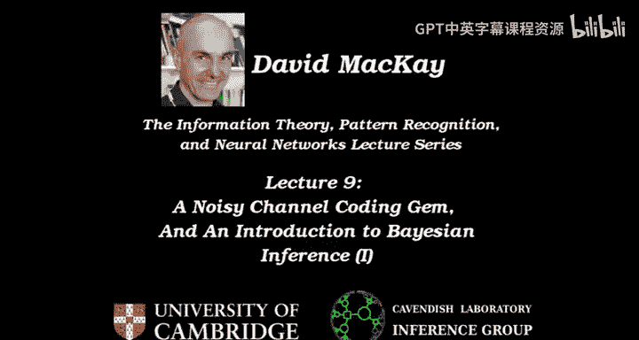

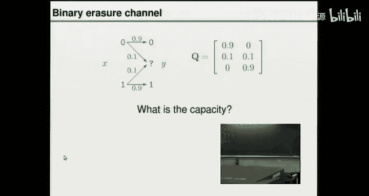

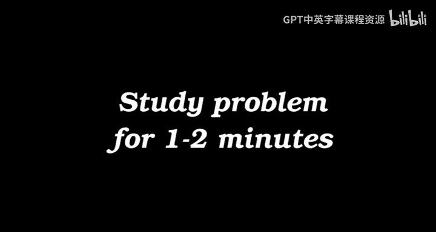

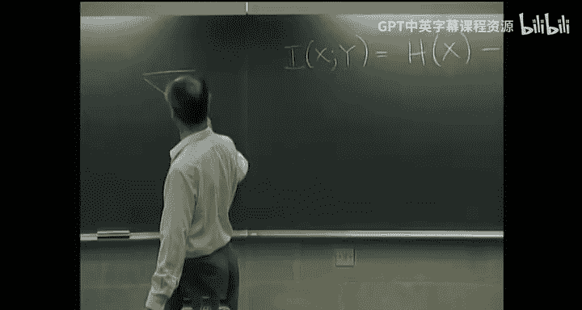

## 概述

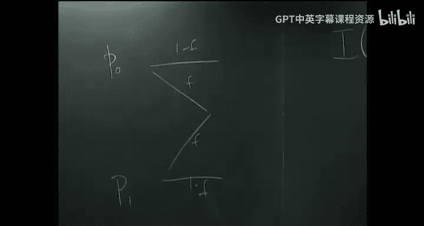

在本节课中，我们将要学习两个核心主题。首先，我们将探讨信息论中一个关于反馈信道的有趣结论。随后，我们将正式进入贝叶斯推断的世界，学习如何从观测数据中推断未知参数，并以高斯分布为例进行详细说明。

## 第一部分：噪声信道编码的一个瑰宝

上一讲我们介绍了香农的噪声信道编码定理，它指出对于任何信道，我们都可以通过最大化互信息来求得其容量，并且可以构建编码器和解码器，以任意接近零的错误概率，在低于容量的任何速率下实现可靠通信。

现在，让我们思考一个具体信道：二进制擦除信道。

其输入X为0或1，输出Y有三种可能：0、1或一个表示“擦除”的问号（？）。每个输入比特以概率 `f` 被擦除，以概率 `1-f` 被正确传输。

### 计算二进制擦除信道的容量

计算信道容量 `C` 需要找到最大化输入X和输出Y之间互信息 `I(X;Y)` 的输入分布 `P(X)`。

互信息可以按两种方式计算：
*   `I(X;Y) = H(X) - H(X|Y)`
*   `I(X;Y) = H(Y) - H(Y|X)`

对于这个信道，第一种方法更简单。假设输入分布为 `P(X=0)=p`， `P(X=1)=1-p`。
*   `H(X) = H₂(p)`，即关于 `p` 的二进制熵。
*   条件熵 `H(X|Y)` 的计算需要考虑三种输出情况：
    *   若输出 `Y=0`，则确定 `X=0`，熵为0。
    *   若输出 `Y=1`，则确定 `X=1`，熵为0。
    *   若输出 `Y=?`，我们完全不知道输入是什么，后验分布与先验分布相同，因此 `H(X|Y=?) = H₂(p)`。
*   输出为问号的概率是 `f`。因此，`H(X|Y) = f * H₂(p)`。

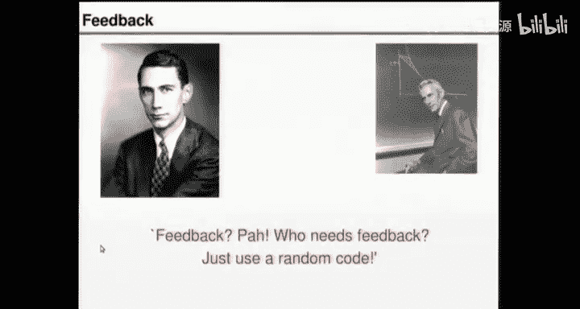

所以，互信息为：
`I(X;Y) = H₂(p) - f * H₂(p) = (1-f) * H₂(p)`

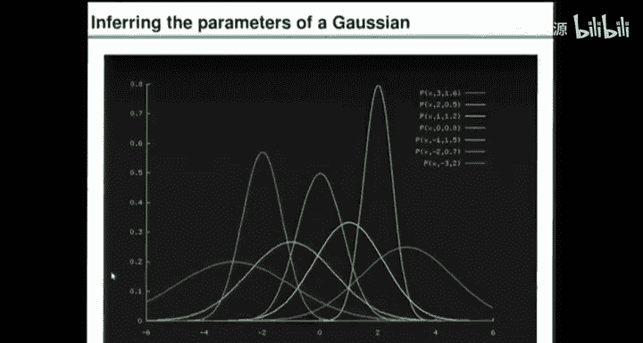

为了最大化互信息，我们需要最大化 `H₂(p)`，其最大值在 `p=0.5` 时取得，值为1比特。因此，二进制擦除信道的容量为：
`C = 1 - f` 比特/信道使用。

### 引入反馈链路

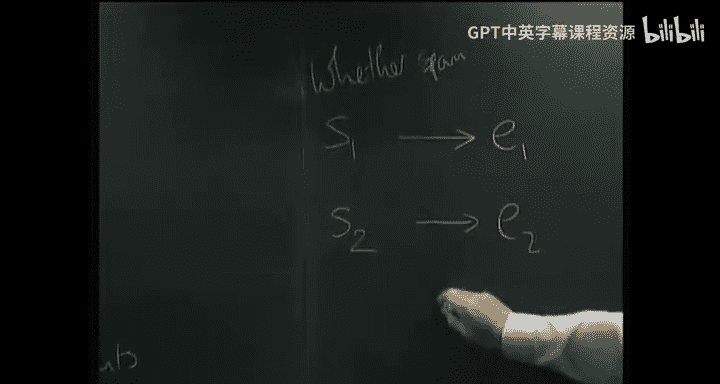

现在，我们考虑一个不同的场景：**带有完美反馈的噪声信道编码**。

此时，编码器可以即时知道信道输出端发生了什么（例如，是否产生了擦除）。一个直观的编码策略是：**重复发送当前比特，直到它被正确接收（即输出不是问号），然后再发送下一个源比特**。

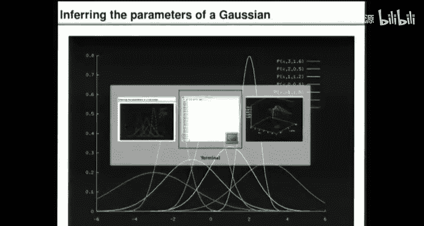

让我们分析这种策略的通信速率。
*   平均而言，每次发送一个比特，成功传输（无擦除）的概率是 `1-f`。
*   每当发生擦除（概率为 `f`），我们需要重传，这段时间没有新的信息比特被成功传递。
*   因此，长期平均下来，成功传输信息比特的速率正是 `1-f` 比特/信道使用。

**结论是**：即使利用了完美的反馈，我们所能达到的最高可靠通信速率仍然是 `C = 1 - f`。

**这就是信息论的瑰宝**：对于像二进制擦除信道这样的信道，反馈并不能提高信道容量。香农的随机编码理论已经告诉我们，无需反馈，仅通过精巧的编码（如喷泉码）就能达到容量 `1-f`。反馈可能使编码和解码更简单，但无法突破容量的极限。

## 第二部分：贝叶斯推断入门

本节我们将目光转向**推断**——即从观测到的数据中推测其背后的未知参数。这是科学实验、数据分析、机器学习（如垃圾邮件过滤、图像识别）的核心。

推断问题的通用模式是：存在我们关心的**底层参数或状态**（如宇宙学常数、邮件是否为垃圾邮件），这些参数生成了我们观测到的**数据**。我们的目标是根据数据“反转箭头”，推断出那些未知的参数。

### 一个简单例子：推断高斯分布的参数

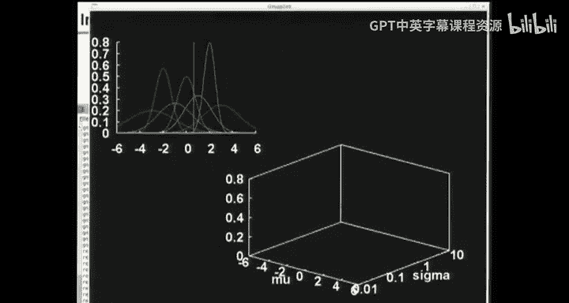

我们从一个经典的简单问题开始：假设我们观测到 `N` 个数据点 `{x₁, x₂, ..., x_N}`，并且我们假设它们独立地来自一个均值为 `μ`、标准差为 `σ` 的高斯（正态）分布。

**我们的任务是**：在给定数据 `D = {x₁, ..., x_N}` 的情况下，推断 `μ` 和 `σ`。

根据贝叶斯定理，参数的后验概率分布为：
`P(μ, σ | D, H) = [ P(D | μ, σ, H) * P(μ, σ | H) ] / P(D | H)`

其中：
*   `H` 代表我们的假设（即数据来自高斯分布）。
*   `P(μ, σ | H)` 是参数的**先验概率**，代表我们在看到数据前的信念。
*   `P(D | μ, σ, H)` 是**似然函数**，表示在给定特定参数值时，观测到当前数据的可能性。
*   `P(D | H)` 是**证据**（或边际似然），是似然函数对所有可能参数的加权平均，在此充当归一化常数。
*   `P(μ, σ | D, H)` 是**后验概率**，代表在看到数据后，我们对参数的更新信念。

#### 似然函数

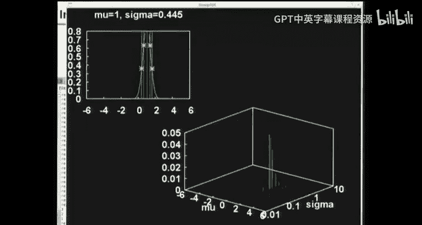

对于独立同分布的高斯数据，似然函数是每个数据点概率密度的乘积：
`P(D | μ, σ, H) = ∏_{n=1}^{N} (1 / √(2πσ²)) * exp( - (x_n - μ)² / (2σ²) )`

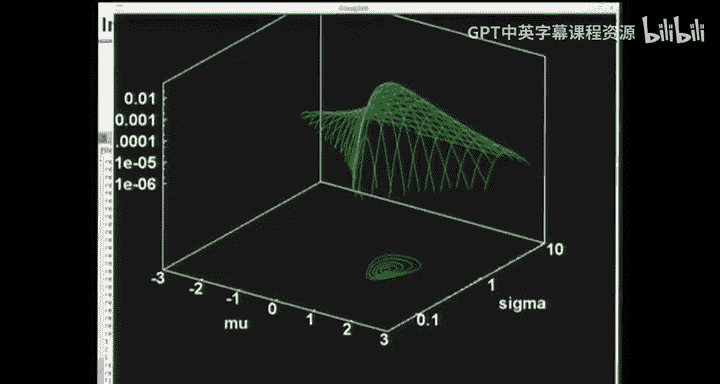

我们可以可视化似然函数。在只有1个数据点 `x*` 时，`P(x* | μ, σ)` 在 `(μ, σ)` 参数空间像一个倾斜的山脊：对于固定的 `σ`，它在 `μ = x*` 处取得最大值；`σ` 越小，峰值越高。

当有多个数据点时，我们将每个数据点对应的似然值相乘。乘积结果在 `(μ, σ)` 空间形成一个单峰曲面。

#### 最大似然估计

人们常寻找使似然函数最大化的参数值，称为**最大似然估计**。
*   对于高斯分布，`μ` 的 MLE 是样本均值：`μ_MLE = (1/N) ∑ x_n`
*   `σ` 的 MLE 是样本标准差（使用 `N` 而非 `N-1` 作为分母）：`σ_MLE = √( (1/N) ∑ (x_n - μ_MLE)² )`

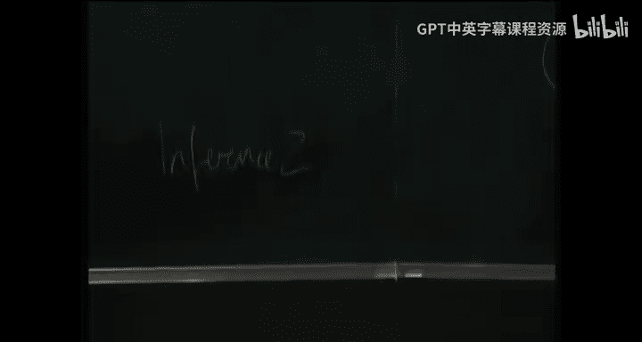

这对应计算器上的 `x̄` 按钮和 `σ_N` 按钮。然而，MLE 只是后验分布的一个点估计，并非推断的全部。完整的贝叶斯推断关注的是整个后验分布。

#### 边际推断与“证据”

有时我们只关心部分参数。例如，我们可能只想推断噪声水平 `σ`，而对均值 `μ` 毫无先验知识也不感兴趣。这时，我们需要对 `μ` 进行**边际化**：
`P(σ | D, H) = ∫ P(μ, σ | D, H) dμ ∝ P(D | σ, H) * P(σ | H)`

这里的 `P(D | σ, H)` 称为 `σ` 的**边际似然**。计算它需要对 `μ` 积分。在高斯例子中，这个积分结果是：
`P(D | σ, H) ∝ (1/σ^{N-1}) * exp( - N * s² / (2σ²) )`，其中 `s²` 是样本方差。

这个函数的峰值出现在 `σ` 等于**样本标准差（使用 `N-1` 作为分母）** 的位置，即计算器上的 `σ_{N-1}` 按钮。从自由度理解，因为我们估计了 `μ`，损失了一个自由度，所以对 `σ` 的估计更保守。

最后，公式中的归一化常数 `P(D | H)`，即**证据**，具有特别重要的意义。它衡量了模型 `H`（此处指“数据来自高斯分布”这个假设家族）整体上对观测数据的预测能力。在下一讲比较不同模型时，证据将起到关键作用。

## 总结与下节预告

本节课中我们一起学习了：
1.  **信息论的瑰宝**：以二进制擦除信道为例，证明了即使存在完美反馈，也无法提高信道容量。香农的无反馈随机编码理论已臻完备。
2.  **贝叶斯推断基础**：介绍了从数据推断参数的贝叶斯框架，包括似然函数、先验、后验和证据等核心概念。我们以高斯分布参数推断为例，展示了计算过程，并解释了最大似然估计与边际推断的联系。

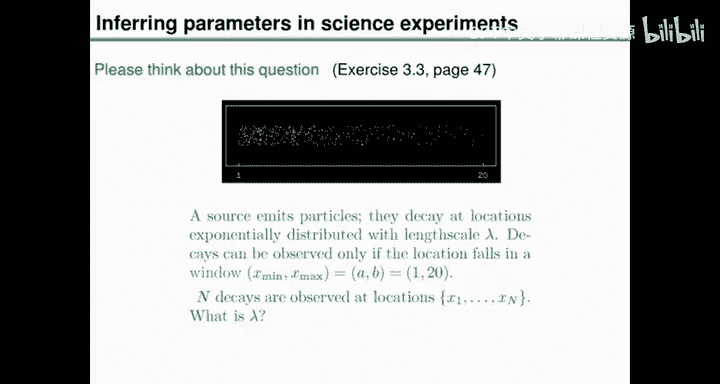

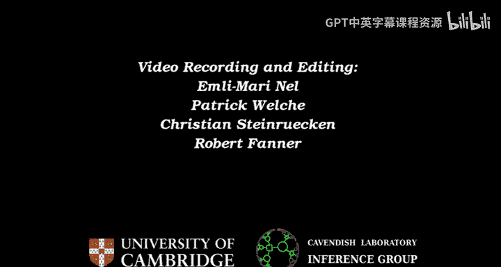

在下一讲中，我们将应用贝叶斯推断解决一个更富挑战性的问题：如何从截断窗口内观测到的粒子衰变位置，推断其指数分布的长度尺度 `λ`。这将生动展示贝叶斯方法的简洁与强大。