# 011：聚类作为推理问题

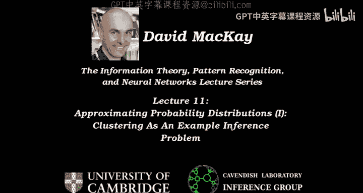

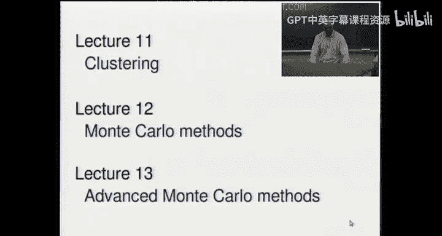

在本节课中，我们将学习如何将聚类问题视为一种概率推理问题。我们将从简单的K均值算法开始，逐步引入更复杂的“软”K均值算法，并探讨其背后的概率模型假设。通过理解这些算法与高斯混合模型推理之间的联系，我们可以更好地掌握聚类技术的原理与局限。

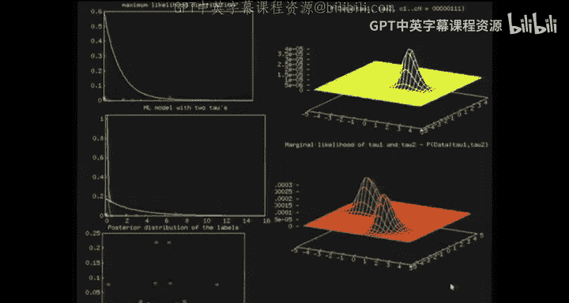

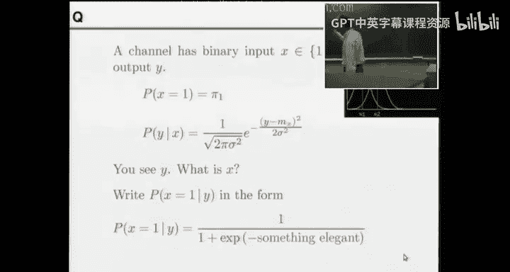

---

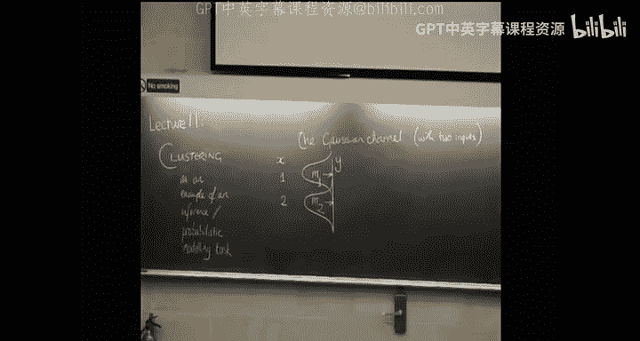

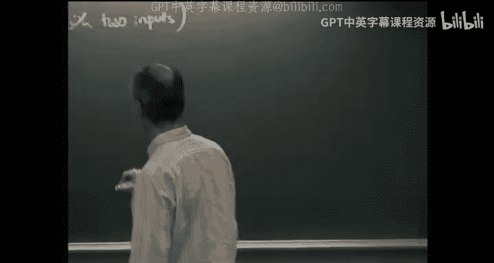

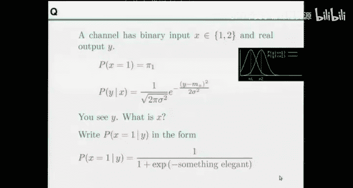

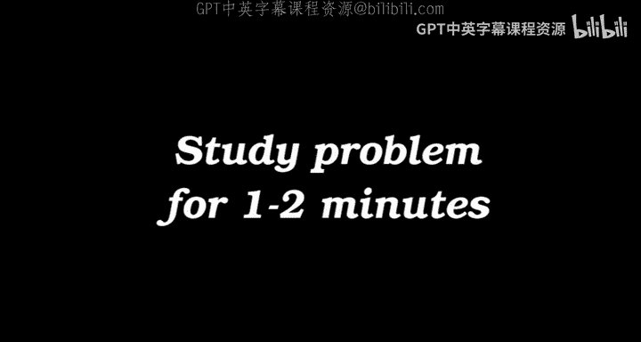

## 从推理问题到聚类

上一讲我们讨论了参数推理问题，例如从衰变数据中推断指数分布参数。本节中，我们来看看一个更复杂的推理问题：聚类。

聚类可以被视为一种推理问题。我们假设观测数据点来自多个不同的潜在类别或“簇”，我们的目标是推断每个数据点属于哪个簇，以及每个簇的特性（如中心位置、形状等）。

---

## 一个简单的信道推理问题

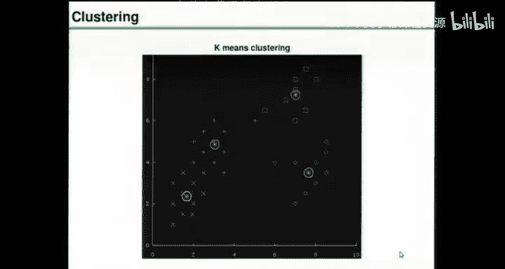

在深入聚类之前，我们先通过一个简单的信道问题来热身，这有助于理解后续的软分配概念。

考虑一个信道，其输入 \( x \) 可以是1或2。输出 \( y \) 是一个实数，其概率分布是以输入值为均值的高斯分布：
\[
P(y | x) = \mathcal{N}(y; \mu_x, \sigma^2)
\]
假设输入的先验概率为 \( \pi_1 \) 和 \( \pi_2 \)。当我们观测到一个输出值 \( y \) 时，其后验概率 \( P(x=1 | y) \) 是多少？

根据贝叶斯定理：
\[
P(x=1 | y) = \frac{\pi_1 P(y | x=1)}{\pi_1 P(y | x=1) + \pi_2 P(y | x=2)}
\]
代入高斯分布密度函数并整理，可以得到一个Sigmoid函数形式：
\[
P(x=1 | y) = \frac{1}{1 + e^{-a(y)}}
\]
其中：
\[
a(y) = \ln\frac{\pi_1}{\pi_2} + \frac{1}{2\sigma^2} \left[ (y - \mu_2)^2 - (y - \mu_1)^2 \right]
\]
这个线性函数 \( a(y) \) 决定了后验概率的形态。当两个高斯分布方差相同且先验相等时，决策边界位于两个均值的中间点。

这个问题的输出 \( y \) 的边际分布 \( P(y) \) 正是两个高斯分布的混合。这直接引出了我们对混合模型和聚类的兴趣。

---

## K均值聚类算法

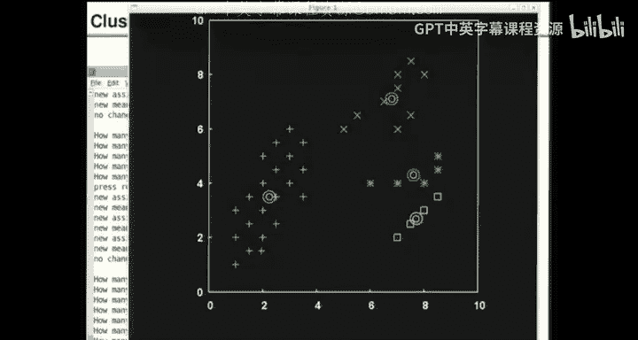

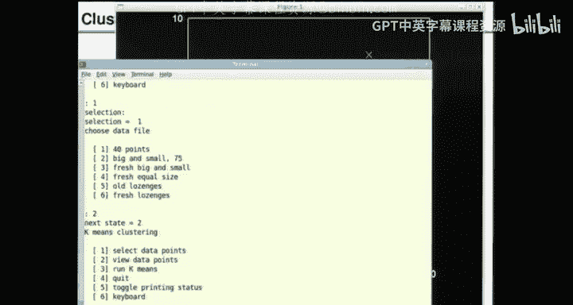

现在，让我们正式进入聚类。一个经典且广泛使用的算法是K均值聚类。

K均值算法假设数据由K个簇组成，每个簇由其“均值”（中心点）定义。算法通过迭代优化来寻找这些均值。

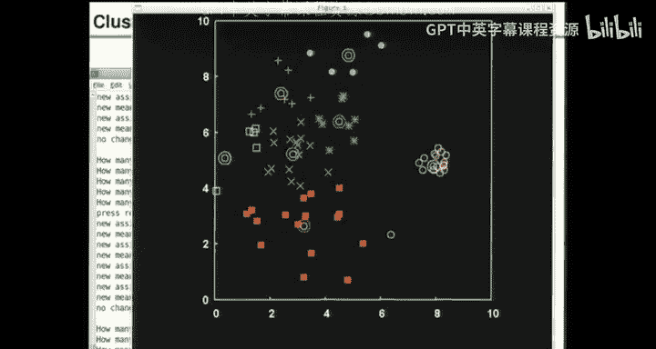

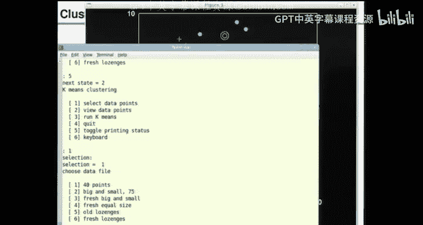

以下是K均值算法的步骤：

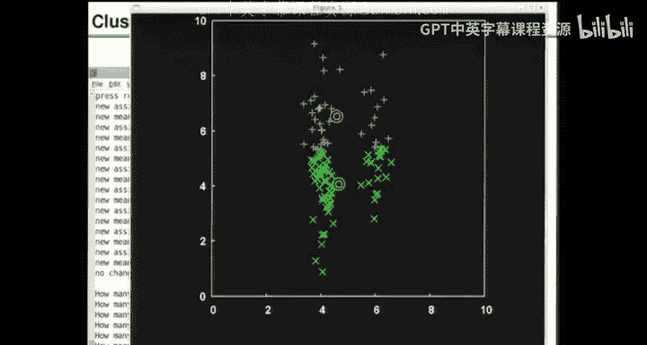

1.  **初始化**：随机选择K个点作为初始簇均值 \( \mathbf{m}_k \)。
2.  **分配步骤**：对于每个数据点 \( \mathbf{x}_n \)，将其分配给距离最近的簇均值。距离通常定义为平方欧氏距离：
    \[
    d_{nk} = \frac{1}{2} ||\mathbf{x}_n - \mathbf{m}_k||^2
    \]
    我们可以引入“责任” \( r_{nk} \) 的概念，它是一个硬分配：
    \[
    r_{nk} = \begin{cases}
    1 & \text{如果 } k = \arg\min_j d_{nj} \\
    0 & \text{否则}
    \end{cases}
    \]
3.  **更新步骤**：重新计算每个簇的均值，将其设置为分配给该簇的所有数据点的平均值：
    \[
    \mathbf{m}_k = \frac{\sum_n r_{nk} \mathbf{x}_n}{\sum_n r_{nk}}
    \]
4.  **迭代**：重复步骤2和3，直到分配不再发生变化（算法收敛）。

K均值算法简单高效，但它有一些明显的缺点：
*   它对初始值敏感，可能收敛到局部最优解。
*   它假设簇是球形的且大小相似，因为使用了欧氏距离。
*   它进行“硬”分配，每个点只属于一个簇。

---

## 软K均值算法（版本1）

为了改进K均值，我们引入“软”分配的概念，这直接关联到之前信道问题中的后验概率。

软K均值算法版本1的修改如下：

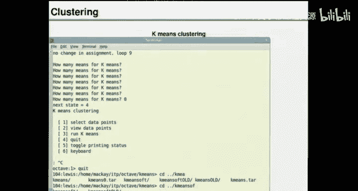

*   **分配步骤（软）**：责任 \( r_{nk} \) 不再是0或1，而是根据一个软最小函数计算：
    \[
    r_{nk} = \frac{e^{-\beta d_{nk}}}{\sum_{k'} e^{-\beta d_{nk'}}}
    \]
    其中 \( \beta \) 是一个控制“硬度”的参数。当 \( \beta \to \infty \) 时，恢复为硬K均值。这里的 \( \beta \) 可以理解为 \( 1/\sigma^2 \)，与高斯分布的精度相关。
*   **更新步骤**：均值的更新方式不变，但现在是加权平均，权重就是责任：
    \[
    \mathbf{m}_k = \frac{\sum_n r_{nk} \mathbf{x}_n}{\sum_n r_{nk}}
    \]

这个算法有了一个概率解释：它相当于在假设数据来自K个具有相同方差 \( \sigma^2 = 1/\beta \) 的球形高斯混合模型下，进行的一种近似推理。软分配 \( r_{nk} \) 可以看作是点 \( n \) 属于簇 \( k \) 的后验概率。

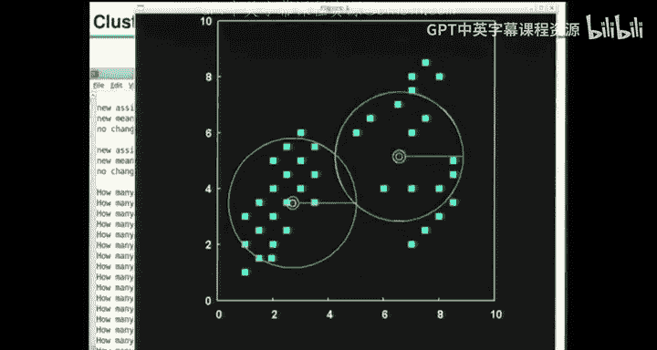

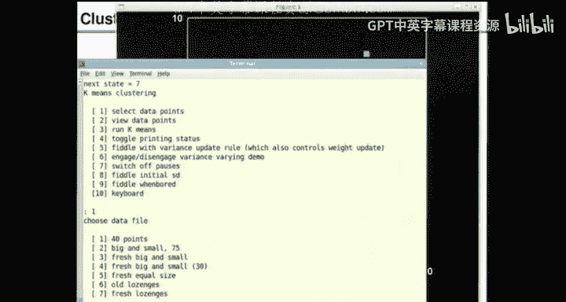

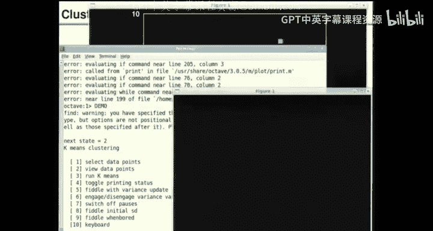

通过逐渐调整 \( \beta \) 参数（例如从大到小，即方差从大到小），算法可以模拟一个“退火”过程，有时能帮助找到更好的聚类结构。

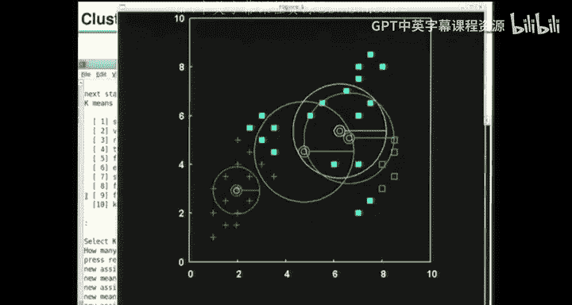

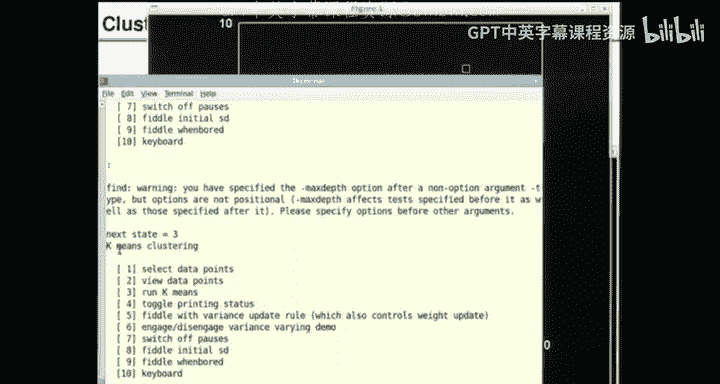

---

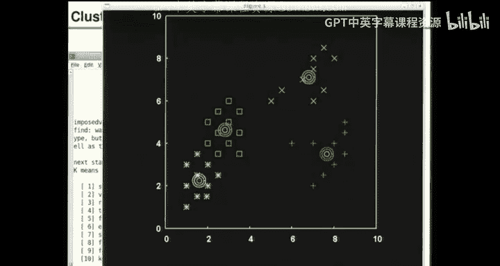

## 软K均值算法（版本2）

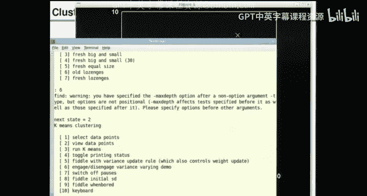

版本1仍然假设所有簇的球形高斯具有相同的方差。为了处理更复杂的簇形状（例如椭圆形），我们引入版本2。

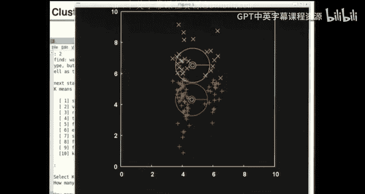

软K均值算法版本2进一步扩展，允许每个簇在每个维度上有不同的方差，并且允许簇有不同的权重（先验概率 \( \pi_k \)）。

以下是算法的组成部分：

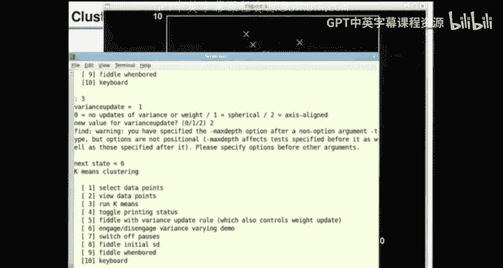

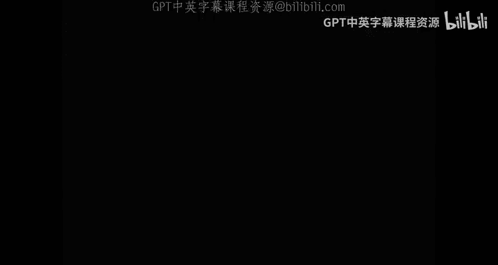

*   **参数**：对于每个簇 \( k \)，我们有：
    *   均值 \( \mathbf{m}_k \)
    *   每个维度 \( i \) 上的方差 \( \sigma_{ki}^2 \)
    *   混合权重 \( \pi_k \)（满足 \( \sum_k \pi_k = 1 \)）
*   **分配步骤**：责任计算现在包含了权重和维度特定的方差：
    \[
    r_{nk} = \frac{\pi_k \prod_i \left( \frac{1}{\sqrt{2\pi\sigma_{ki}^2}} e^{-\frac{(x_{ni} - m_{ki})^2}{2\sigma_{ki}^2}} \right)}{\sum_{k'} \pi_{k'} \prod_i \left( \frac{1}{\sqrt{2\pi\sigma_{k'i}^2}} e^{-\frac{(x_{ni} - m_{k'i})^2}{2\sigma_{k'i}^2}} \right)}
    \]
    为了数值稳定性，通常计算对数。
*   **更新步骤**：所有参数都根据当前的责任进行更新：
    *   **更新权重**：\( \pi_k = \frac{\sum_n r_{nk}}{N} \)
    *   **更新均值**：\( m_{ki} = \frac{\sum_n r_{nk} x_{ni}}{\sum_n r_{nk}} \)
    *   **更新方差**：\( \sigma_{ki}^2 = \frac{\sum_n r_{nk} (x_{ni} - m_{ki})^2}{\sum_n r_{nk}} \)

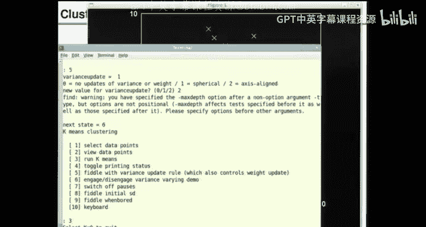

这个算法具有更坚实的概率基础：它是在拟合一个轴对齐的高斯混合模型。实际上，它是期望最大化（EM）算法的一种变体，用于最大化数据的边际似然。算法迭代地执行E步（计算责任 \( r_{nk} \)）和M步（更新参数 \( \pi_k, \mathbf{m}_k, \sigma_{ki}^2 \)）。

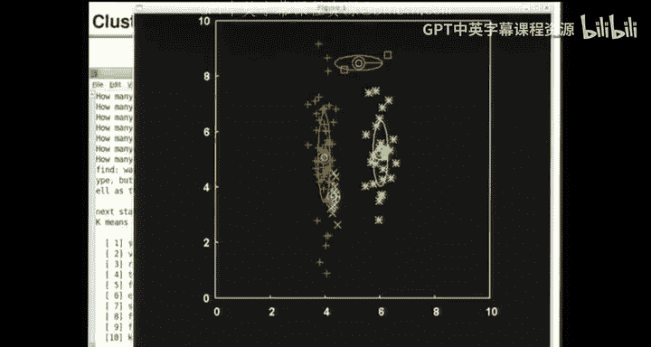

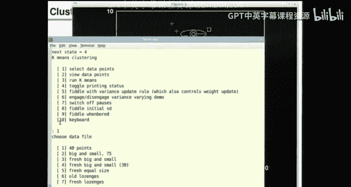

尽管这个算法更强大，但它仍然可能遇到问题，例如当一个簇坍缩到单个数据点上导致方差为零（过拟合）。在实际应用中，通常需要添加正则化或使用更复杂的模型。

---

## 总结与展望

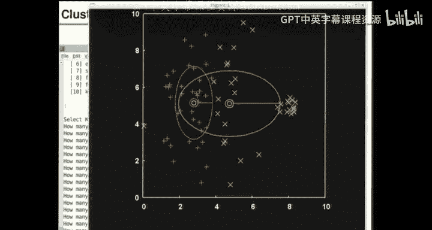

本节课中，我们一起学习了如何将聚类问题构建为概率推理问题。

1.  我们从简单的K均值算法开始，看到了其“硬分配”和“球形簇”的局限性。
2.  通过引入软分配，我们得到了软K均值版本1，它对应于具有相同方差的球形高斯混合模型。
3.  进一步，我们扩展模型，允许每个簇具有不同的轴对齐方差和权重，得到了软K均值版本2，这实际上是拟合高斯混合模型的一种EM算法。

这些算法展示了如何通过明确的概率假设来推导出聚类方法。软K均值版本2等算法在实践中被成功用于许多领域的数据探索和模式发现。

然而，这些方法仍然要求我们指定簇的数量K，并且其基本假设（高斯分布）可能不适用于所有数据类型（例如环形分布）。在后续课程中，我们将探讨蒙特卡洛方法，它能以更灵活的方式处理复杂的概率分布和推理问题，为克服这些限制提供工具。我们还将讨论如何自动发现数据中的低维结构，这是更高级的模型学习目标。

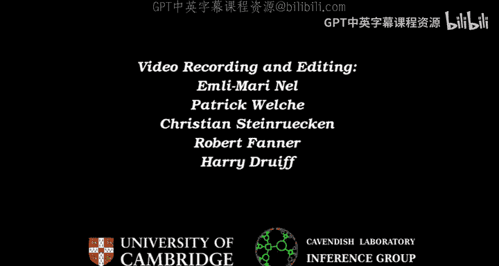

---
**本节课中我们一起学习了：**
*   聚类作为推理问题的视角。
*   K均值算法及其硬分配的局限性。
*   软K均值算法（版本1和版本2）的推导，及其与高斯混合模型推理的联系。
*   这些算法背后的概率假设和近似优化本质。