# 012：近似概率分布（II）- 蒙特卡洛方法 🎲

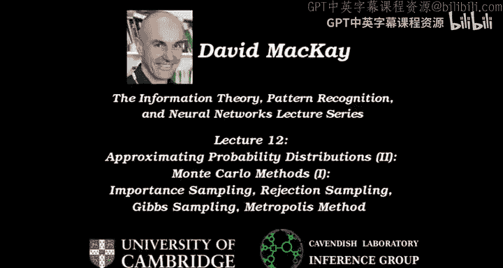


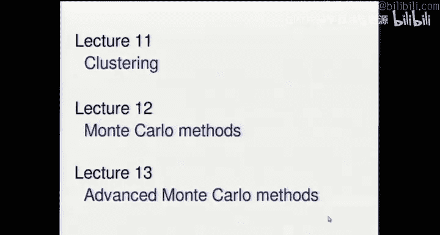

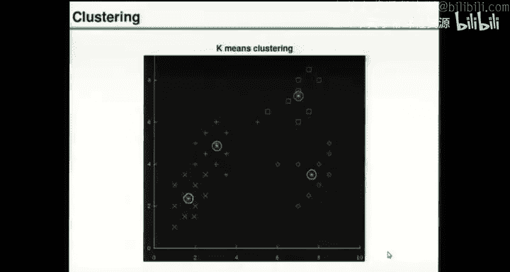

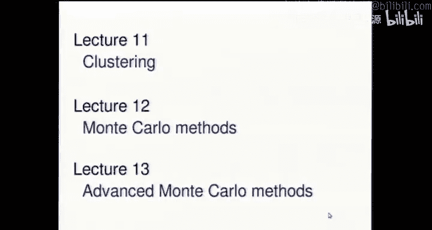

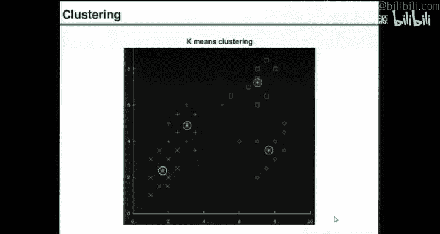

在本节课中，我们将要学习蒙特卡洛方法。这是一种处理复杂概率分布的工具，尤其适用于当我们无法通过穷举枚举来解决问题时。我们将从简单的蒙特卡洛方法开始，逐步深入到更高级的技术。

上一节我们介绍了聚类问题，并引出了一个复杂的后验概率分布。本节中，我们来看看如何利用随机数来近似处理这类分布。

## 蒙特卡洛方法概述

蒙特卡洛方法的核心思想是利用随机数来近似复杂的概率分布。我们通常面对一个“红色”的、难以处理的分布 `P(x)`，它可以表示为：
```
P(x) = P*(x) / Z
```
其中 `P*(x)` 是我们可以计算的未归一化概率，而 `Z` 是未知的归一化常数。

我们的目标有两个：
1.  **问题一**：从分布 `P(x)` 中抽取样本。
2.  **问题二**：计算函数 `φ(x)` 在分布 `P(x)` 下的期望值 `E[φ(x)]`。

解决第二个问题的一种方式是，如果我们能解决第一个问题（即抽取到来自 `P(x)` 的样本），那么我们可以通过计算样本的平均值来估计期望值。

## 重要性采样

重要性采样是一种解决“问题二”的方法。它不直接从目标分布 `P` 中采样，而是从一个我们易于采样的“绿色”提议分布 `Q` 中抽取样本，然后通过重新加权来修正偏差。

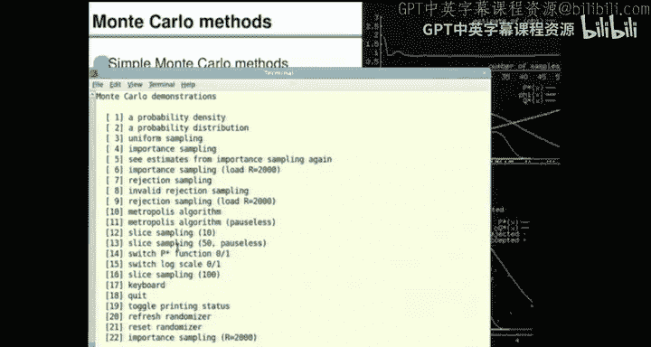

以下是重要性采样的步骤：
1.  从提议分布 `Q(x)` 中抽取 `R` 个样本 `{x^(1), x^(2), ..., x^(R)}`。
2.  对于每个样本，计算其重要性权重 `w^(r) = P*(x^(r)) / Q(x^(r))`。
3.  函数 `φ(x)` 的期望值估计为：
    ```
    φ_hat = (Σ_{r=1}^{R} w^(r) φ(x^(r))) / (Σ_{r=1}^{R} w^(r))
    ```

重要性采样的有效性高度依赖于提议分布 `Q` 与目标分布 `P` 的相似程度。如果 `Q` 选择不当（例如过于狭窄或偏离目标区域），权重可能会变得极不稳定，导致估计值收敛缓慢甚至错误，且难以在有限样本内察觉。

## 拒绝采样

拒绝采样是一种可以同时解决“问题一”和“问题二”的方法。它也需要一个易于采样的提议分布 `Q`，但要求存在一个常数 `C`，使得对于所有 `x`，都有 `C * Q(x) >= P*(x)`。

以下是拒绝采样的步骤：
1.  从提议分布 `Q(x)` 中抽取一个候选样本 `x`。
2.  从均匀分布 `Uniform(0, C*Q(x))` 中抽取一个数 `u`。
3.  如果 `u < P*(x)`，则接受样本 `x`；否则，拒绝该样本。

被接受的样本恰好来自目标分布 `P(x)`。然而，拒绝采法的关键在于必须确保 `C*Q(x) >= P*(x)` 处处成立，这在实际中往往难以证明或实现。此外，如果 `C*Q(x)` 远大于 `P*(x)`，拒绝率会非常高，效率低下。

## Metropolis 方法

Metropolis 方法是一种马尔可夫链蒙特卡洛方法。与之前独立采样不同，它通过一个依赖于当前位置的随机游走来生成样本序列。该方法仅需计算概率的比值，因此无需知道归一化常数 `Z`。

算法步骤如下，假设当前时刻 `t` 的状态为 `x_t`：
1.  根据一个提议分布 `Q(x' | x_t)` 生成一个新候选状态 `x'`。`Q` 通常设计为以 `x_t` 为中心的简单分布（如高斯分布）。
2.  计算接受率 `a`：
    ```
    a = (P*(x') * Q(x_t | x')) / (P*(x_t) * Q(x' | x_t))
    ```
    如果 `Q` 是对称的（即 `Q(x|y) = Q(y|x)`），则接受率简化为 `a = P*(x') / P*(x_t)`。
3.  以概率 `min(1, a)` 接受提议：若接受，则设 `x_{t+1} = x'`；若拒绝，则设 `x_{t+1} = x_t`（即停留在原地）。

理论保证，当链运行足够长时间后（达到平稳分布），所访问的状态 `x_t` 的分布将逼近目标分布 `P(x)`。然而，该方法存在收敛速度未知、对提议分布步长敏感等问题。

## Gibbs 采样

Gibbs 采样是另一种 MCMC 方法，特别适用于多变量问题。它基于一个强假设：即使联合分布 `P(x1, x2, ..., xK)` 很复杂，但给定所有其他变量时，每个单一变量的条件分布 `P(x_k | {x_{j≠k}})` 是易于采样的。

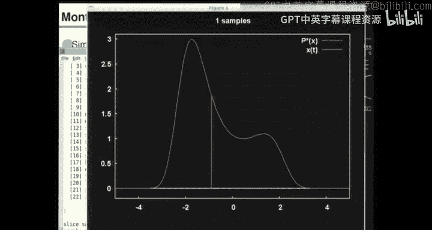

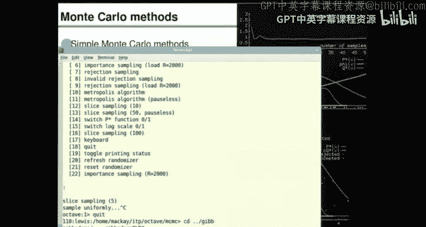

算法步骤如下，以两个变量 `(x1, x2)` 为例：
1.  初始化 `x1^(0)`, `x2^(0)`。
2.  对于 `t = 0, 1, 2, ...`：
    a.  从条件分布 `P(x1 | x2^(t))` 中采样得到 `x1^(t+1)`。
    b.  从条件分布 `P(x2 | x1^(t+1))` 中采样得到 `x2^(t+1)`。

对于更多变量，只需依次对每个变量进行上述条件采样并循环。Gibbs 采样可以有效地应用于许多模型，例如高斯混合模型聚类。在聚类中，我们可以交替采样更新：1) 给定当前参数，为每个数据点分配聚类标签；2) 给定当前标签分配，更新每个聚类的参数（均值和方差）。这种方法能渐进地探索后验分布。

## 当前方法的局限与展望

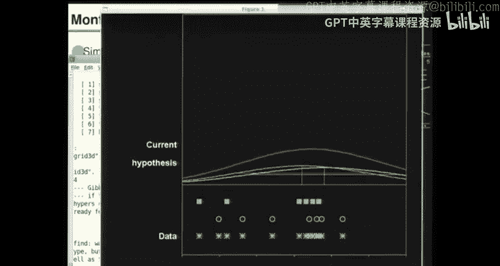

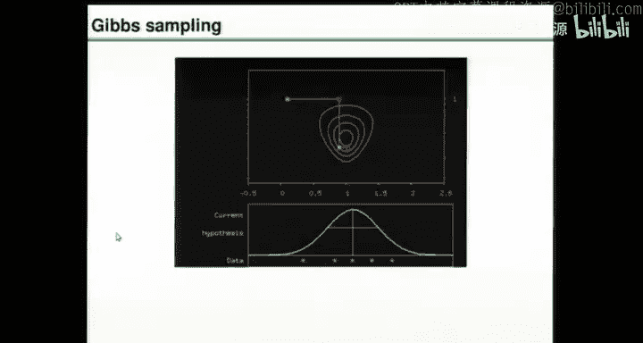

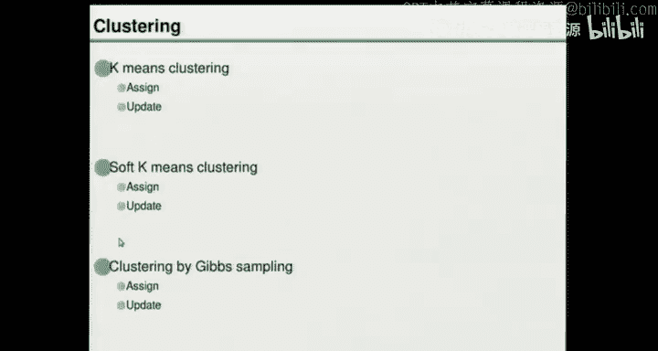

本节课介绍的蒙特卡洛方法（特别是 MCMC）存在几个主要挑战：
1.  **随机游走行为导致收敛慢**。
2.  **对步长等参数敏感**。
3.  **无法判断何时收敛（何时达到平稳分布）**。
4.  **难以直接计算归一化常数 `Z`，因此无法进行模型比较**（例如，确定数据中最佳聚类数量）。

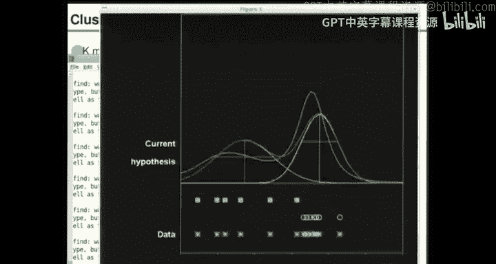

在下一讲中，我们将探讨更高效的蒙特卡洛方法，如切片采样和精确采样，它们能部分解决上述问题，提供更强大、更可靠的推断工具。

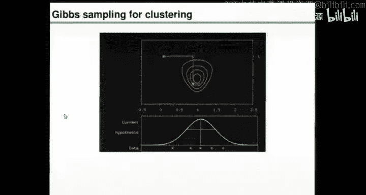

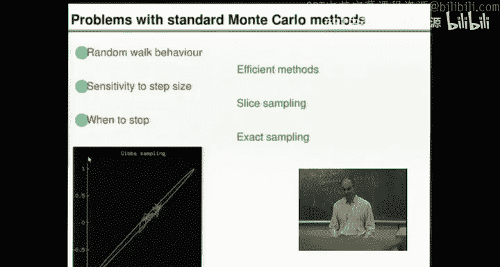

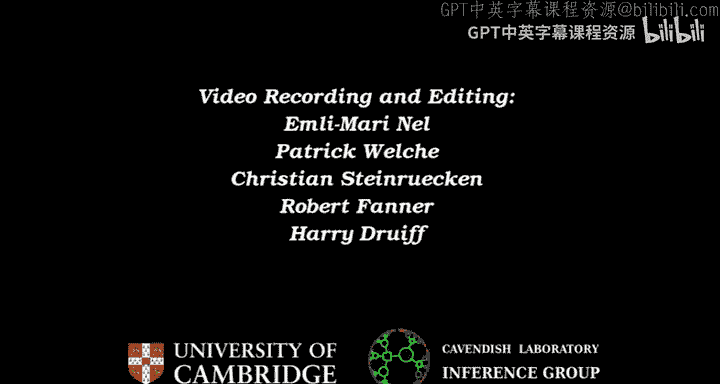

本节课中我们一起学习了蒙特卡洛方法的基础，包括重要性采样、拒绝采样、Metropolis 方法和 Gibbs 采样。我们了解了它们如何利用随机数来近似复杂的概率分布，以进行抽样和期望估计，同时也认识了这些初步方法的局限性。