# 013：近似概率分布（三）蒙特卡洛方法进阶 🚀

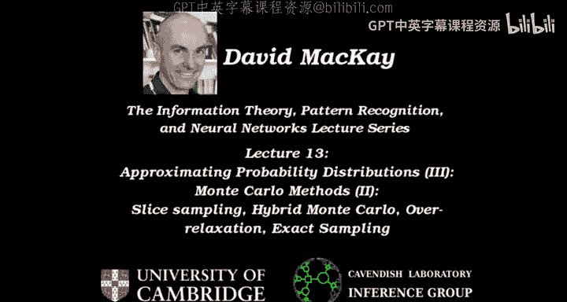

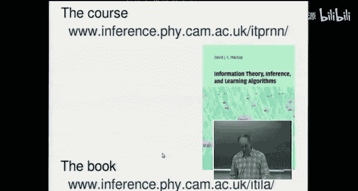

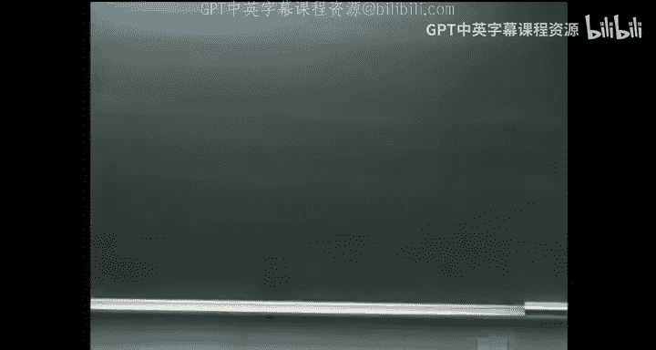

在本节课中，我们将学习如何改进基础的蒙特卡洛方法，以解决其效率低下、参数敏感和收敛性难以判断等问题。我们将探讨几种高级技术，包括哈密顿蒙特卡洛、过松弛采样、切片采样和精确采样。

---

## 课程回顾与相关阅读 📚

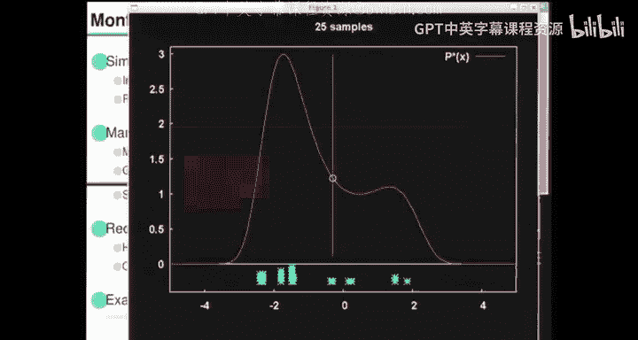

上一节我们介绍了基本的蒙特卡洛方法。本节中，我们将深入探讨更高效的方法。

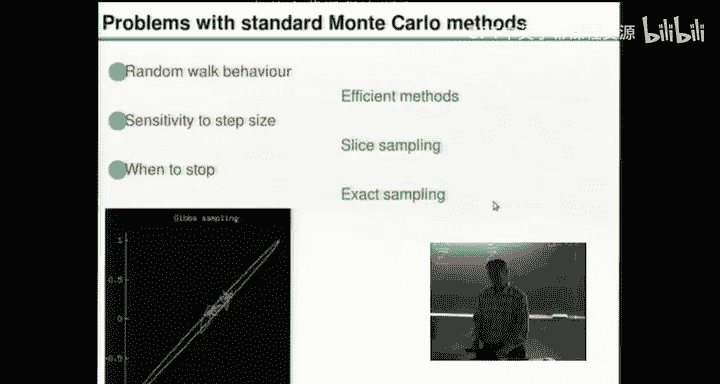

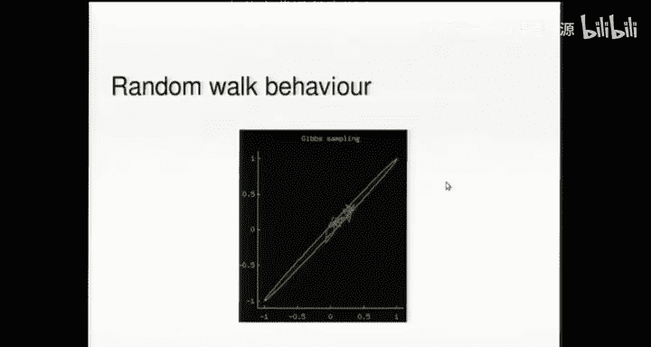

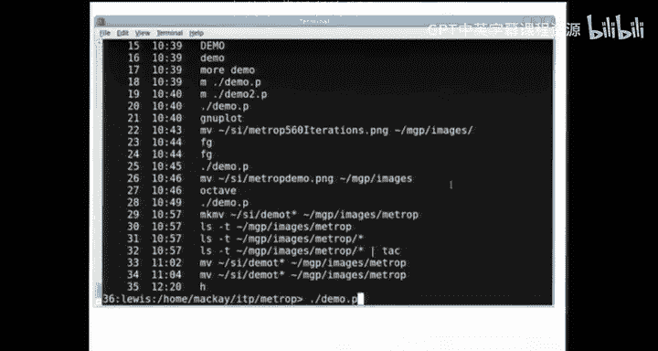

课程目前处于推理与数据建模部分。相关教材章节包括：
*   第20章和第25章：聚类与蒙特卡洛方法。
*   第29、30、32章：变分方法（将在下一讲介绍）。
*   第33章：相关主题。

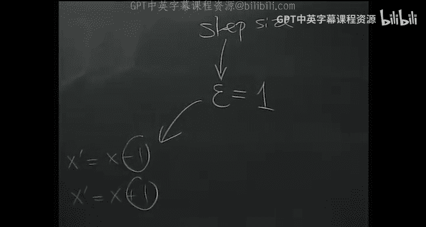

建议额外阅读：
*   第27章：F方法（简短章节）。
*   第31章：冰模型（有助于理解本讲及下一讲内容）。

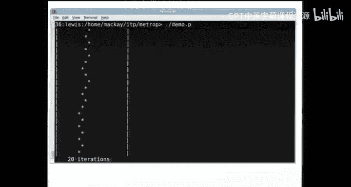

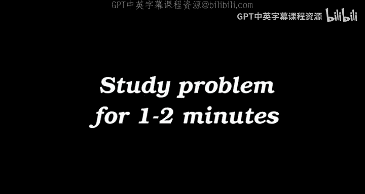

完成网站上的推荐练习对深入理解材料至关重要。

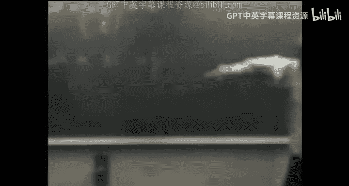

---

## 蒙特卡洛方法的核心问题与目标 🎯

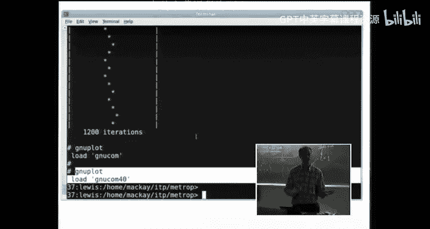

我们关注一个“棘手”的目标分布 **P(x)**。其规则是：我们可以计算未归一化的概率 **P*(x) = e^{-E(x)}**，但不知道归一化常数 **Z**。我们的目标是：
1.  **采样问题**：从分布 **P** 中获取样本 **{x^(r)}**。
2.  **期望估计问题**：计算函数 **φ(x)** 在分布 **P** 下的期望值 **⟨φ⟩_P**。

我们可以用问题1的样本来估计问题2：**⟨φ⟩_P ≈ (1/R) Σ_{r=1}^{R} φ(x^(r))**。

一个典型例子是纳米磁体的自旋系统，其能量为 **E(x) = -Σ_{<i,j>} J_{ij} x_i x_j - Σ_i h_i x_i**，其中 **x** 是n维二元向量。我们可能关心其平均能量、磁化强度、熵等性质，这些都可以通过蒙特卡洛采样来估计。

---

## 标准方法的缺陷：随机游走行为 🐌

上一节我们介绍了重要采样、拒绝采样、吉布斯采样和Metropolis方法。Metropolis方法虽然通用，但存在几个关键问题：
1.  **随机游走行为导致收敛缓慢**。
2.  **步长参数需要精细调整**，结果对此非常敏感。
3.  **缺乏收敛的可靠判据**。

我们通过一个简单例子来理解随机游走问题。假设目标分布 **P*** 在整数集 {0, 1, ..., 20} 上为1，其余为0。我们使用Metropolis方法，提议分布为：以50%概率向左或向右移动1个单位（步长 **ε = 1**）。分布的典型长度尺度 **L ≈ 20**。

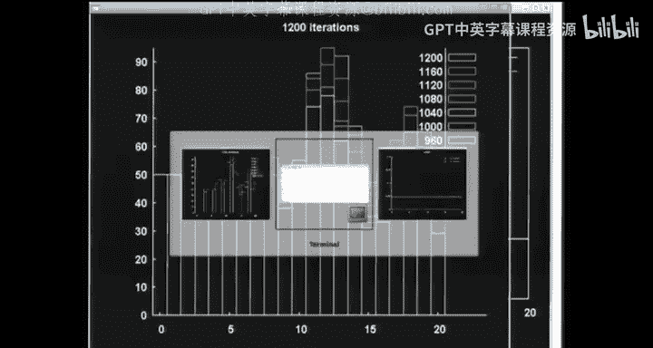

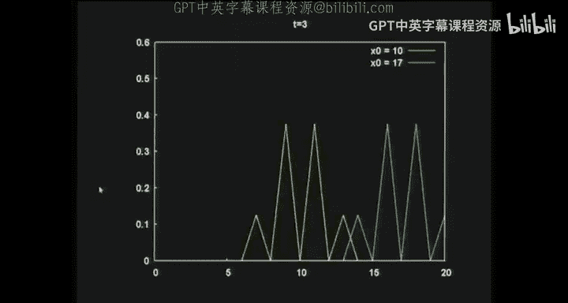

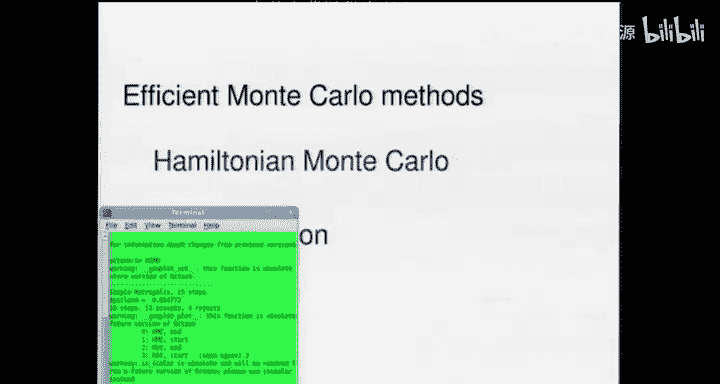

**核心问题**：从一个典型点移动到另一个独立点需要多长时间？

分析表明，对于随机游走，经过 **T** 步后移动距离的方差为 **Var(Δx) = T ε^2**。要使典型移动距离达到长度尺度 **L**，需要 **T ≈ (L/ε)^2** 步。在本例中，**T ≈ 400** 步才能获得一个较好的独立样本。模拟演示证实了这一点，链需要数百步才能充分探索整个支撑集并“忘记”初始状态。

在高维问题中，情况更复杂。分布可能在某些维度上被很好地确定（尺度小 **l**），在其他维度上确定较差（尺度大 **L**）。步长 **ε** 的选择面临两难：
*   如果 **ε** 太大（> **l**），接受率会急剧下降，约为 **(l/ε)^{γ}**，其中 **γ** 是确定良好的维度数。
*   如果 **ε** 太小，随机游走会非常缓慢。
实践中，最优 **ε** 通常接近最小长度尺度 **l**，此时接受率约为50%。

---

## 高效方法一：哈密顿蒙特卡洛 ⚛️

为了解决随机游走问题，我们引入**哈密顿蒙特卡洛**（又称混合蒙特卡洛）。其核心思想是引入辅助的“动量”变量 **p**，将采样空间加倍，定义联合分布：
**P(x, p) = (1/Z) e^{-E(x)} * e^{-p^2/(2m)}**

这可以解释为一个物理系统的玻尔兹曼分布，其中 **E(x)** 是势能，**p^2/(2m)** 是动能。算法步骤如下：
1.  **随机化动量**：从高斯分布 **N(0, m)** 中抽取新的动量 **p**。
2.  **模拟动力学**：使用近似方法（如蛙跳法）模拟哈密顿动力学方程一段时间，使系统在近似恒定总能量下演化。这会产生一个从 **(x, p)** 到 **(x*, p*)** 的确定性提议。
3.  **Metropolis-Hastings 校正**：以概率 **min(1, exp(-H(x*, p*) + H(x, p)))** 接受该提议，其中 **H(x, p) = E(x) + p^2/(2m)** 是总能量。

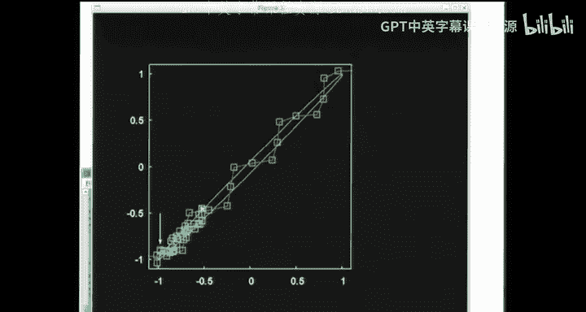

**优势**：动力学模拟允许系统持续运动很长的距离，显著减少了随机游走行为。演示显示，在相同计算成本下，HMC 能比标准 Metropolis 方法更快速地探索分布。
**劣势**：仍需要调整模拟步长和步数等参数。

---

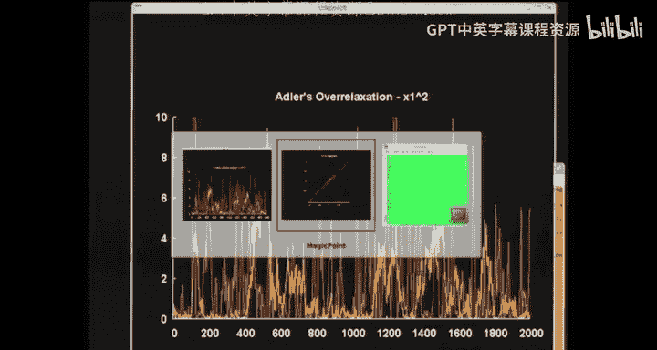

## 高效方法二：过松弛采样 🔄

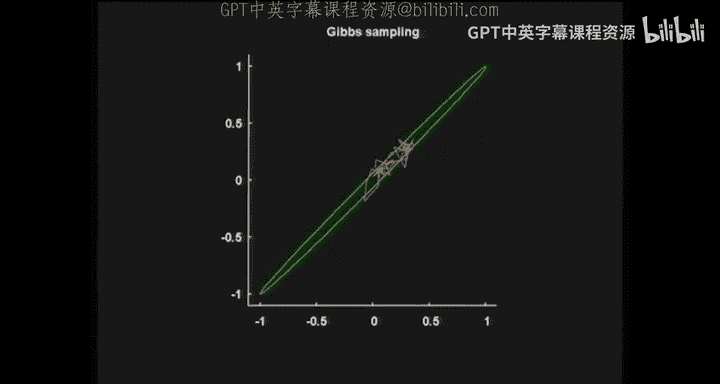

过松弛采样旨在加速**吉布斯采样**。标准吉布斯采样依次从每个变量的条件分布中抽取新值，没有参数，但可能产生随机游走行为。

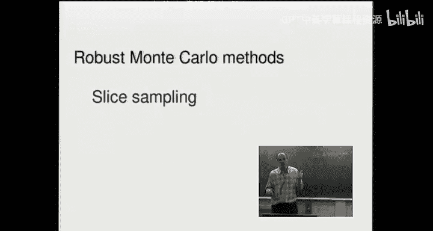

以下是两种过松弛方法：
1.  **Adler 过松弛（针对高斯条件分布）**：如果当前变量值为 **x_old**，条件分布为 **N(μ, σ^2)**，则新值 **x_new** 按以下规则抽取：
    **x_new = μ + α (x_old - μ) + σ √(1 - α^2) ξ**
    其中 **ξ ~ N(0, 1)**，**α** 是负参数（如 -0.9）。这会使新值倾向于落在均值的另一侧，从而产生沿分布轮廓的持续运动。
2.  **有序过松弛（Neal 提出）**：适用于任何实值变量。从当前变量的条件分布中抽取 **K** 个样本（例如 K=20）。将当前值和新抽取的 **K-1** 个值一起排序。然后选择与当前值排序位置对称的那个值作为新值。如果当前值是列表中的第 **r** 个最小值，则新值选为第 **(K+1-r)** 个最小值。

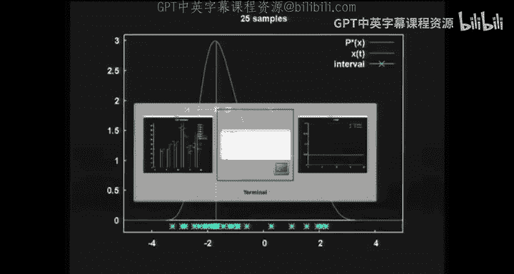

**优势**：通常能减少自相关时间，且对于自适应拒绝采样等情况，额外抽取 **K-1** 个样本的成本很低。

---

## 鲁棒方法：切片采样 🔪

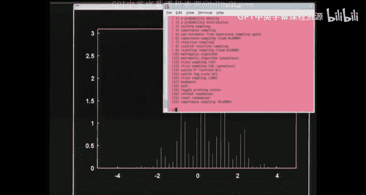

切片采样是一种几乎无需参数调优的MCMC方法。它通过引入一个辅助的均匀随机变量来避免拒绝整个提议。

**算法步骤（单变量）**：
1.  在当前位置 **x_t**，计算 **y ~ Uniform(0, P*(x_t))**。这定义了一个“切片” **S = {x: P*(x) > y}**。
2.  **步出阶段**：以当前点为中心，初始设定一个宽度为 **w** 的区间。检查区间端点是否在切片 **S** 内（即 **P*** 是否大于 **y**）。如果不在，则将该方向区间扩展 **w**，重复直到两端点都在切片外。这样就得到了一个包含切片 **S** 的区间 **I**。
3.  **采样阶段**：从区间 **I** 中均匀抽取一个候选点 **x*`**。
4.  **收缩检查**：如果 **P*(x*`) < y**（即点不在切片内），则拒绝该候选点，并将区间 **I** 从该端点向当前点 **x_t** 方向收缩，然后返回步骤3。重复直到找到一个满足 **P*(x*) > y** 的点 **x***。
5.  令 **x_{t+1} = x***。

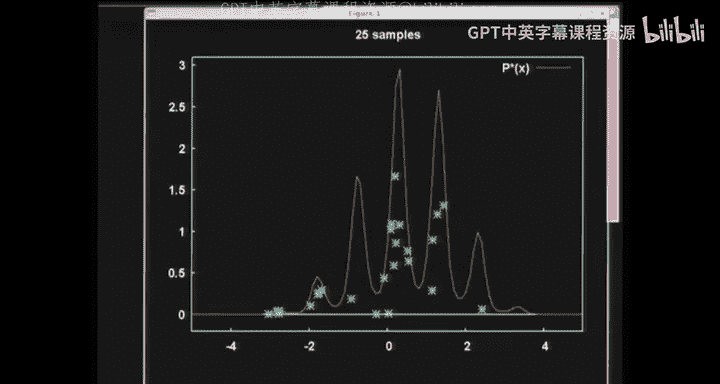

**优势**：
*   **自动适应尺度**：步长 **w** 不是关键参数。如果 **w** 太小，步出阶段会线性扩展区间；如果 **w** 太大，收缩阶段会快速缩小区间。算法能自动找到合适的尺度。
*   **永不整体拒绝**：它通过局部收缩总是能找到一个新点，避免了计算资源的完全浪费。
*   **能跨越能垒**：演示显示，切片采样可以有效地在多峰分布的不同峰之间跳跃。

---

## 收敛性突破：精确采样 ✅

精确采样（完美采样）提供了一种判断MCMC链何时收敛的确定性方法。其核心思想是：运行链“无限长”时间，但通过巧妙的“从过去耦合”技术，用有限计算确定无限时间运行的结果。

**核心思想**：
1.  考虑从所有可能状态开始，在时间 **-T** 运行无限多条链，但使用**相同的随机数序列**。
2.  向前模拟所有这些链到时间0。
3.  如果所有这些链在时间0都**合并（coalesce）** 到同一个状态，那么无论起点如何，从无限过去运行到现在的链都必然处于这个状态。这个状态就是一个来自平稳分布的**精确样本**。
4.  如果未合并，则增加 **T**（向更远的过去回溯），使用相同的随机数前缀，重复此过程。

**关键技巧**：通常不需要模拟所有起始状态。如果状态空间存在偏序，并且链具有“随机单调性”，则只需模拟“最大”和“最小”状态。如果它们合并了，那么所有中间状态也必然合并。

**应用示例**：
*   **六边形随机铺砖**：演示展示了如何通过模拟“全空”和“全满”两种极端铺砖的链，来确定一个完美的随机铺砖样本。
*   **伊辛模型**：在临界温度附近，传统方法面临严重的“临界慢化”。精确采样方法（如耦合从过去算法）能够为大规模伊辛模型生成完美的临界构型样本，并由此发现了“北极圈”等现象。

---

## 总结与展望 📝

本节课我们一起学习了多种高级蒙特卡洛方法：
*   **哈密顿蒙特卡洛**利用物理动力学实现持续移动，大幅提升效率。
*   **过松弛采样**改进了吉布斯采样，通过有偏提议减少自相关。
*   **切片采样**提供了一种鲁棒、几乎无需调参的采样方法，能自动适应目标分布的尺度。
*   **精确采样**通过“从过去耦合”的思想，为判断链的收敛提供了革命性的解决方案，并能生成完美样本。

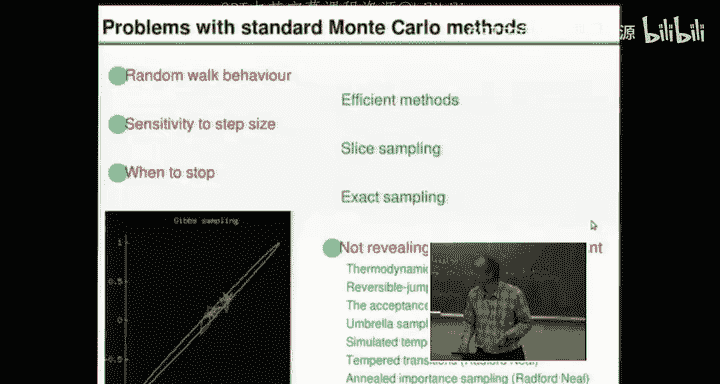

蒙特卡洛方法领域仍有其他挑战，例如计算归一化常数 **Z**。这通常需要更复杂的技术，如热力学积分、桥式采样、退火重要采样等。这些方法通过连接已知分布与目标分布来估计 **Z**。

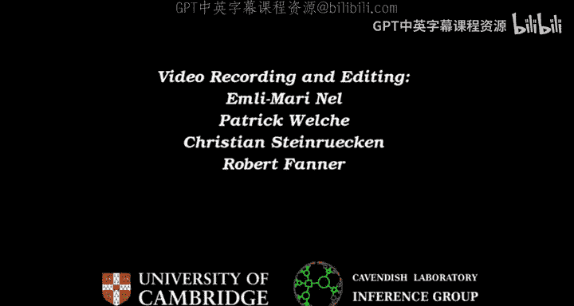

总之，通过使用这些先进技术，我们可以更高效、更可靠地从复杂的概率分布中进行采样和推断。