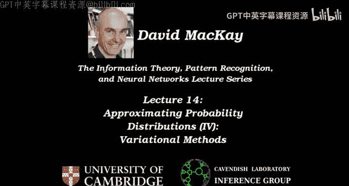
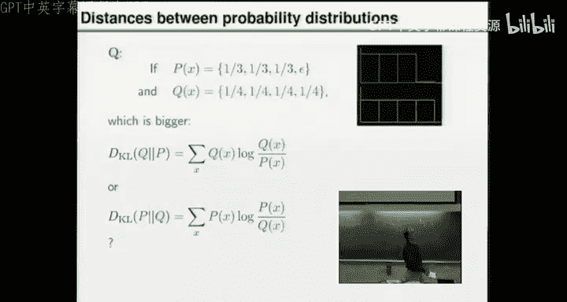
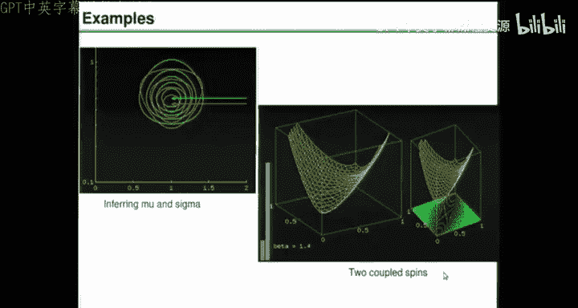
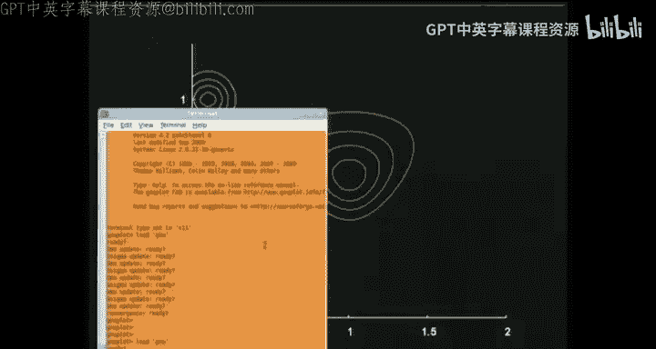
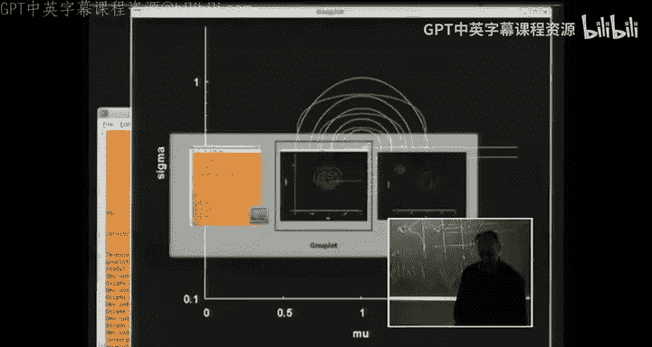
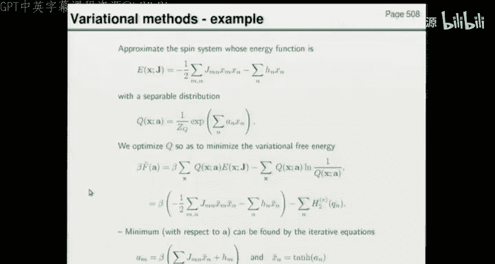
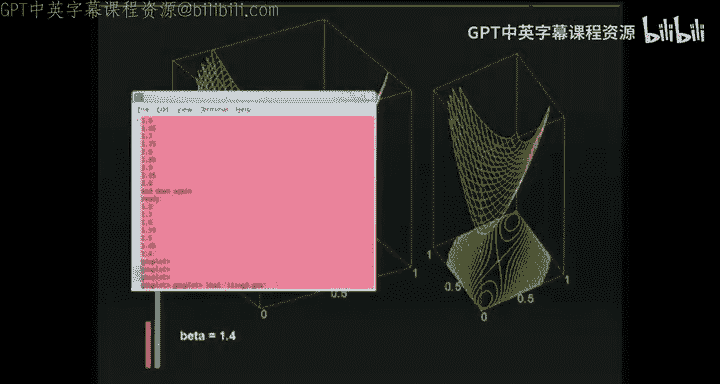
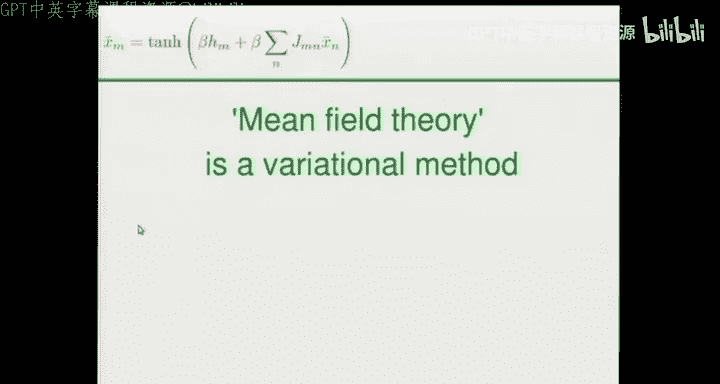

# 014：近似概率分布（四）——变分方法 🧮

在本节课中，我们将学习如何使用变分方法来处理复杂的概率分布。我们将了解其核心思想、目标函数，并通过具体例子来展示其应用。

---

## 概述

我们一直在讨论处理复杂概率分布的方法。这些分布可能因为进行推断（如后验分布复杂）或其他原因（如物理问题）而难以处理。之前我们讨论了蒙特卡洛方法，本节课我们将探讨另一种方法——变分方法。这两种方法都是处理复杂但某种程度上可处理的分布的可能途径。

## 变分方法的核心思想

变分方法的基本假设与蒙特卡洛方法类似：存在一个复杂的“红色”分布 **P**。该分布可以写成一个归一化常数的形式：**P(x) = e^{-E(x)} / Z**，其中我们可以计算能量函数 **E(x)**。

变分方法的核心思想是引入一个更简单的“绿色”分布 **Q**。我们通过某种方式参数化这个简单分布，使其足够简单，以便我们能够在 **Q** 下计算期望值和其他感兴趣的统计量。然后，我们调整 **Q** 的参数 **θ**，使其在某种度量下尽可能接近 **P**。一旦找到最佳近似参数 **θ***，我们就可以用 **Q** 下的期望值来近似我们感兴趣的函数 **φ** 在 **P** 下的期望值。

## 如何衡量“接近”程度？

我们需要一个目标函数来衡量 **Q** 与 **P** 的接近程度。衡量分布间距离的常用指标是Kullback-Leibler (KL) 散度，它有两种写法：

1.  **D_KL(Q || P) = Σ_x Q(x) log [Q(x)/P(x)]**
2.  **D_KL(P || Q) = Σ_x P(x) log [P(x)/Q(x)]**

这两种写法都是 **P** 和 **Q** 之间距离的度量。当 **P** 和 **Q** 相等时，KL散度为0，且不可能更小。因此，如果 **Q** 能完美匹配 **P**，这两种KL散度都会最小化。

然而，由于 **x** 通常是高维的，直接计算这些求和（即期望值）非常困难。我们之前已经同意 **P** 是复杂的，那么为什么我们会认为可以处理这些KL散度呢？

让我们通过一个简单的例子来理解这两种KL散度的不同行为。

### KL散度行为示例

假设有一个简单的离散分布 **P**，在四个点上的概率分别为：`[1/3, 1/3, 1/3, ε]`，其中 **ε** 是一个非常小的数。我们用一个均匀分布 **Q** 来近似它，即每个点的概率都是 `1/4`。

*   计算 **D_KL(Q || P)** 时，**Q** 会将 `1/4` 的概率质量放在 **P** 概率极小（**ε**）的点上，这会受到强烈的惩罚，导致KL散度值非常大（约 `log(1/(4ε))`）。
*   计算 **D_KL(P || Q)** 时，惩罚来自于 **P** 在某些点上有概率质量而 **Q** 未能充分覆盖。其值约为 `log(4/3)`，要小得多。

这个例子说明：
*   使用 **D_KL(Q || P)** 作为目标函数时，优化过程会驱使 **Q** 避免在 **P** 概率为零或极小的区域放置概率质量，可能导致“保守”的近似。
*   使用 **D_KL(P || Q)** 作为目标函数时，优化过程会驱使 **Q** 必须覆盖 **P** 所有有概率质量的区域，可能导致“宽泛”的近似。

## 选择可行的目标函数

现在回到实际问题。计算 **D_KL(P || Q)** 需要在复杂分布 **P** 下求期望，这很可能无法实现。因此，我们放弃这个选项。

让我们看看 **D_KL(Q || P)**：
`D_KL(Q || P) = Σ_x Q(x) log [Q(x)/P(x)]`

将其展开，并代入 **P(x) = e^{-E(x)} / Z**：
`D_KL(Q || P) = Σ_x Q(x) [log Q(x) + E(x) + log Z]`

整理后得到：
`D_KL(Q || P) = Σ_x Q(x) E(x) - [-Σ_x Q(x) log Q(x)] + log Z`

其中：
*   `Σ_x Q(x) E(x)` 是能量函数 **E(x)** 在 **Q** 下的期望值。由于我们假设可以计算 **E(x)**，并且 **Q** 是我们选择的简单分布，这个期望值**可能**可以计算。
*   `-Σ_x Q(x) log Q(x)` 是分布 **Q** 的熵，记作 **H_Q**。由于 **Q** 是我们设计的简单分布，其熵通常也可以计算。
*   `log Z` 是一个与 **Q** 无关的常数。

因此，我们定义一个新的目标函数，称为**变分自由能 (Variational Free Energy)**：
`F̃(θ) = <E(x)>_Q - H_Q`

其中 **θ** 是 **Q** 的可调参数。由于 `D_KL(Q || P) = F̃(θ) - (-log Z)`，且 KL 散度非负，我们得到：
`F̃(θ) ≥ -log Z`

这是一个非常重要的关系：**变分自由能是负对数归一化常数的一个上界**。通过最小化 `F̃(θ)`，我们不仅让 **Q** 尽可能接近 **P**，同时还能获得 **log Z** 的一个估计（即边界值）。

上一节我们介绍了变分方法的核心思想和目标函数。接下来，我们将通过两个具体例子来看如何应用它。

## 示例一：高斯分布的推断

第一个例子是熟悉的高斯分布参数推断问题。假设数据 **X** 来自一个正态分布 `N(μ, σ²)`。我们想推断参数 **μ** 和 **σ²**。其后验分布 **P(μ, σ² | X)** 是一个“复杂”的红色分布。

我们将用变分近似 **Q** 来近似这个后验。我们施加一个简单的约束：**Q** 必须是可分离的，即 `Q(μ, σ²) = Q_μ(μ) * Q_σ(σ²)`。这就是我们对 **Q** 形式的全部约束。

然后，我们写出变分自由能 `F̃` 并对其进行最小化。我们可以采用交替优化的策略：
1.  固定 `Q_σ`，优化 `F̃` 更新 `Q_μ`。
2.  固定更新后的 `Q_μ`，优化 `F̃` 更新 `Q_σ`。
3.  重复迭代直至收敛。

在这个具体问题中，优化过程会得到：
*   `Q_μ` 最优形式是一个高斯分布，其均值等于样本均值 `x̄`，但其方差比真实后验中对应切片的方差要稍大。
*   `Q_σ` 最优形式是一个伽马分布，其众数在 `σ_{N-1}` 处，而不是真实后验众数 `σ_N`。

这个可分离的近似虽然无法完美还原真实后验（例如，真实的 **μ** 边缘分布是学生t分布），但它抓住了分布的主要特征，如均值和大致宽度。

## 示例二：自旋系统

第二个例子是自旋系统。系统由多个二值自旋变量 **x_n ∈ {-1, +1}** 组成，能量函数为：
`E(x) = - (1/2) Σ_{m,n} J_{mn} x_m x_n - Σ_n h_n x_n`

由于自旋间的耦合项 `J_{mn}`，分布 `P(x) ∝ e^{-βE(x)}` 非常复杂。我们希望用一个简单的分布 **Q** 来近似它。

我们选择 **Q** 为可分离分布：
`Q(x) = Π_n Q_n(x_n) = Π_n (e^{a_n x_n} / (e^{a_n} + e^{-a_n}))`

这里可调参数 **θ** 就是每个自旋的偏置场 **{a_n}**。在这个简单的 **Q** 下，我们可以计算变分自由能：
`βF̃({a_n}) = β <E(x)>_Q - Σ_n H[Q_n]`

由于 **Q** 可分离，耦合项的期望变得容易计算：`<x_m x_n>_Q = <x_m>_Q <x_n>_Q`。每个自旋的均值 `<x_n>_Q` 与参数 `a_n` 通过双曲正切函数相关：`<x_n>_Q = tanh(a_n)`。

通过对 `F̃` 关于 `{a_n}` 求导并令导数为零，我们得到一组自洽方程，可以通过迭代求解：
`a_n = β (h_n + Σ_{m≠n} J_{mn} <x_m>_Q)`
`<x_n>_Q = tanh(a_n)`

这组方程有一个著名的名字。

以下是其物理含义：每个自旋的等效场 `a_n` 由其外部场 `h_n` 加上所有邻居自旋平均状态的加权和决定。然后该自旋的平均状态 `tanh(a_n)` 是对这个总场的响应。

### 简单双自旋系统分析

考虑一个最简单的双自旋系统，耦合强度 `J=1`，无外场。真实分布 `P` 倾向于两个自旋同号。我们使用可分离的变分近似 `Q`，它有两个参数：`q1` 和 `q2`（各自旋取+1的概率）。

我们可以画出变分自由能 `F̃(q1, q2)` 随温度参数 **β** 变化的图像：
*   在高温（**β** 小）下，`F̃` 只有一个最小值在 `(0.5, 0.5)`，对应均匀近似。
*   当 **β** 增大到1时，发生分岔，出现两个最小值，分别对应两个自旋倾向于同时为正或同时为负。
*   在低温（**β** 大）下，这两个最小值变得非常显著。

需要强调的是，**这个分岔是近似方法本身引入的，而不是原始系统具有的相变**。原始的双自旋系统随温度变化是连续、平滑的，没有相变。这个例子提醒我们，要谨慎看待变分近似中出现的“相变”现象。

## 总结与拓展

本节课我们一起学习了变分方法。我们了解到：

1.  **核心思想**：用参数化的简单分布 **Q** 去近似复杂分布 **P**，通过最小化两者间的KL散度（具体是 `D_KL(Q||P)`）来优化参数。
2.  **目标函数**：引入了**变分自由能** `F̃(θ) = <E>_Q - H_Q`，其最小值提供了 `-log Z` 的一个上界。
3.  **方法步骤**：选择 **Q** 的形式 -> 写出 `F̃` -> 优化参数 **θ**。
4.  **实例应用**：我们看到了在高斯推断和自旋系统中的应用。在自旋系统中，这种方法推导出的方程就是著名的**平均场理论**。

变分方法的优点在于：
*   目标函数清晰，推导严谨。
*   不需要像蒙特卡洛方法那样引入随机数。
*   自然地提供了归一化常数 **Z** 的边界估计。
*   可以推广到更复杂的近似分布 **Q**。

平均场理论在物理和机器学习中广泛应用，而变分自由能的视角为其提供了一个统一而清晰的理论框架。在接下来的课程中，我们将开始学习神经网络。