# 信息论、模式识别和神经网络The Information Theory Pattern Recognition and Neural Networks 2014 - P10：-10-Lecture 10_ An Introduction To Bayesian Inference (II)_ Inference Of Paramet - GPT中英字幕课程资源 - BV1er421M7Br

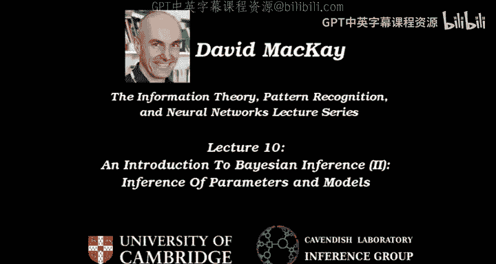

Okay， welcome to lecture 10。When I came to Cambridge and studied physics。

 I had the privilege of being taught by Steve Goll， and I asked him how to solve this exam question。

 which I suspect he was the examiner for when it was originally set。

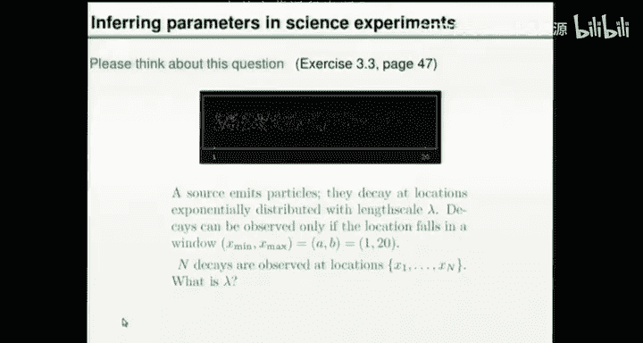

We've got。Events with an exponential distribution， we don't know Lambda。

 We can only see the events if they happen in a window that goes from 1 cimem to 20 cimem。

 We've got all the ex coordinates of these points。 We want to infer Lambda。

 I'd like to start off by asking the audience。Before you heard about Bayesian inference。

 how would you have gone about solving this problem using。

classicalical statistics methods that you got taught during a physics course or at high school or whatever or any seat of the pants method。

 So would you like to tell me。Approaches you might have used in general or specific approaches you would use to。

 to solve this task。Yeah。Syrian。Grading descent in what。

 So you're gonna to maximize or minimize something。So the idea is， optimize。Something。

 and what's the something that you would optimize by a gradient descent。Okay， so optimize a measure。

Of。Discrrepancy。Between。Where the data actually arrived。Which might look like that， and。

The probability density。That you get， if you pick a particular value。Of lambmbda， okay。

So that sounds a reasonable idea。 You， you've got some data。 You have some summary of the data。

 and then you adjust your model so as to get a good fit。 So let's go into a bit more detail。

 How are we actually going to get a measure of discrepancy。 What if there are three data points。

 for example， we've observed for an hour and we've got three points。 or there might be 100。 What。

 what did you have in mind And。Okay， so you've got a window， some width。So we call it Delta x。

And do you chop up your data world into little windows of sized deel X and count how many points there are in each window grand。

 Okay， so we have windows， or I I often call them bins。 So you put data into bins。

So this is an example of how we get a measure of discrepancy。First。

 we've got to invent a measure of discrepancy。 And to do that， we're going to put the data in bins。

Which might look like。This where this is now the count。And each bin。

 Or if we only got three data points， it might look like。Yes。Okay。

And notice something you had to choose was this deelta X。 So this。Had to be chosen。

In order for this approach to work。Okay， so we've got some counts。 Let， let's call them F1， F2。

 F3 are the counts in each of these B bins。That we've got。

So you compare that with what the model with parameter Lada would have predicted。 I'm guessing。 So。

Let me check if you agree with this。You could work out given Lambda。What the expected value。

Of F in a particular bin would be。And。That would give you。An expected number here。Like that。

When you talked about some sort of measure of how far apart they are。

 was it the distance between the actual count and the expected count that you had in mind。

Some sort of inner product。 Okay， so we've got a choice here of。One measure of goodness of fit。

Which I was suggesting。Is we sum over all the bins。

 the distance between F B and the expected value of F B。Given Lambda。And。

We'd better sort of take an absolute value or square or something like that。 So some of the squares。

 maybe is a measure of how close they are all to each other。

So that was the sort of thing I was guessing， but we had another idea。How about a do product。

 goodness of fit，2 is a measure of how similar these two vectors are to each other。

 So we take the inner product of F B with。SB。All right。Let's just have a quick think about that。

If we expand the square here。We get some of FB。We get some of F B squared。Minus。2， sum of F B。

FB average。Plus， some over be。However of F be。Squared。So， if I。Minimize this thing。

With respect to Lada。 And if you maximize this thing with respect to Lada。

We're going to get pretty similar answers， aren't we， Because actually。

 this is just a constant as long as we use the same bin sizes as each other。 that's a constant。

Once the bins have been chosen and this lot here， okay， we're not quite sure what that'll be。

 But there's a lion share it。 It's got， it's got a factor of two in front of it。

It's the inner product。 So these two things are actually quite similar to each other。

 but they're not exactly identical because of this slight difference here。 Okay。

 so we've got two measures of goodness of it。 And something you might have at the back of your mind is all these questions that we have to answer。

 Question  one。 How did you choose Delta E。 we， let's imagine that we've。

 we've solved that in a sensible way。 Question2 is。😊，How you choose。

Between different measures of goodness of fit。And I'm。

 I'm not saying either of these is a good measure。 They're just the first ones we thought of。

Has anyone got another approach to， to this， The actual method to to optimize was gradient in descent was suggested。

 but it's not too important how we optimize as long as we find the optimum。

 When we've done that optimization， it'll spit out a guess for lambda。

 Itll spit out the best fit value of Lambda。Does anyone have another approach because there are many approaches you get taught when you're being taught ad hoc statistical methods。

And I I'm sure some of you thought of methods that don't look like this or this。Gauussians。

Product of Gaussians， do you say， So what's the product of Gaussian's approach to answering the question。

 what is Lada。Okay， so。What Gaussians do you have in mind for this， this problem。Okay。

 the data points， they， theyre X coordinates。Okay， the X coordinates of these guys are exponentially distributed。

 Maybe I need to make clear what the assumption is P of X N。

Givenn Lambda and the window edges A and B。Is。When I say exponential， it's one of these。This thing。

 a to the minus。X。On。兰得。哎。X is。Between A and B。And it's 0。Otherwise。Sorry。

 I've got them in the wrong order。Alright， where Z is the normalizing constant。

 Z is integral from a to B P to the minus x on lambda。 So the actual probability density of each x。

 if we knew lambda is an exponential。There are possibly some Gaussians running around in this。

 For example， if I define a bin and if we measure the count of how many points arrived in that bin。

It may be true that the probability distribution of that count。

 which is actually a distribution over integers。 It may be reasonably well approximated as a Gaussian。

 So that that's a possible direction you could go in that， that definitely does involve Gaussians。

But does anyone else have a， a completely different approach to this problem。What know。

 did anyone study physics。Okay。No one else。 Yeah， O， we've got another physicist over there。

 Isn't it the case that when。Little young physicists are taught to do stuff with their data。

They're told， get the data， rearrange the equation that predicts the data given the parameters in such a way that you get a straight line graph。

 then fit a straight line。 Isn't that one of the rules of how to do statistical inference。Okay。

 so let me run with that idea。Soir。This was P of X， N。Given Lambda， A and B。嗯。

It's E to minus x on Lada。Divided by Z。Z depends on lambmbda A and big。

And if we get a load of points， X， how can we turn this lot into some sort of straight line， Well。

 let's。First， multiply by a little window， as we had before。 So we'll have a bin size P of X， N。

 given Lada A and B times deelta X。That's now。The probability that the next point will fall in this particular bin located at X。

 Okay， let's get rid of the N on this。 let's think of this as a function of X。

This is the probability that that the next point will fall in a bin of size x plus minus。

A bin of with Delta X located at x， approximately， alright。

So if I multiply that by the total number of data points we got， which is N。That's the expected。

Number。In a bin。And that is equal to an onz。E to minus x on Lada。

We want some way of turning this expected number， which will relate to the actual measured number into some sort of straight line。

 Well， where's the thing that we're measuring。 Here's X， So that's。

A variable that changes as we move the bin around。 And there's a divided by lambda。

 And it's got an exponential。 And that's horrible。 But were a physicists。

 we know how to get rid of exponentials。 We take the log。And。So we can have the log。

Of the expected count。In。And been。At X with with Delta X。The log of the expected count is。

Log of an on Z， which is some sort of constant。Minus x。啊。Lambda。Oh。

That's now a straight line with an interdecept of something other and a slope of。-1 on lambda。

All right。So if you've been subjected to the physics training that says。

 and it's a sort of high school thing to do， I't it take the data， mun it around。

 get a straight line， because then everyone knows how to fit straight lines， don't they， so。Ida。

 number one， was。Let's。Put the data into bins and get a histogram。 That doesn't solve the problem。

 We now need to do something with a histogram。 Things we could do with the histogram。

 Not I've done it twice here。 I did it with fat bins once。

 I did it with thin bins the second time to just to emphasize the answer we end up with may depend on the size of the bins。

So。Here's the physics education idea。 Take the log of your histogram， then fit a straight line。 Okay。

 so the suggestion is， take the actual data。The thing that is true is that the log of the expected number is some constant minus x on lambda。

 What we're now going to do is take the actual data。F， B。We'm gonna take the log of that。

And plot that against X。我我我我我我。But and then we're gonna fit a straight line。

 And we there's a lot of extra questions getting raised by this approach when we say fit。

A straight line。 How do we fit a straight line。 Do we just use the straight line fitting thing that comes on your computer。

 That's probably what most people would leap to do。

 But something that could very easily be the case is when you define your bins。

 if you define them before you actually get the data。

 which is the sort of correct way to do classical statistics。

 You shouldn't sort of change your estimateator after looking at the data。

It could well be the case that one bin might have zero counts in it。Now， when you take the log of 0。

You're gonna have in that bin。Log of 0， you'll have an infinitely negative value to put into your straight line fitting method。

So it all sounds pretty good。 and it looks fairly good。 if you get lucky。

 So up on the screen here with nice fat bins and lots of data。

 you can see a straight line is definitely gonna。 Yeah， it's gonna give you the right sort of answer。

 But I'd like have a universal method for answering problems。😊，Soir。So just use two bins。 Okay。

 so here's another suggestion。

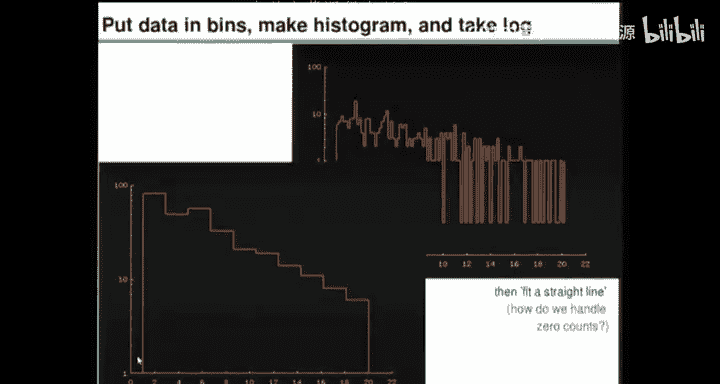

Take the data， put it in only two bins。And are we going fix the bins beforehand。

 or will we sort of adaptively move the boundary between the bins。What you。

 you're wanting to do is make sure we get some points in each bin。 Yeah， and then do something。 Okay。

 that's a nice idea。 So I， this was， this was idea number 3。 you fit a straight line。

Idea number 4 is just use two bins， but be smart about where you put the bin boundary。 Okay。

 so if you've got three points。What are the two bins gonna be。

 we could put here or here or here or here or here or here。

 There's actually quite a lot of latitude of where you put the bin boundary。

 And you'll either have two in one bin and one in the other or one in one and two in the other， so。

It's a nice idea。 It's probably， there's probably something in it， but it's still got pitfalls。

 namely， if you actually end up with only three data points， you kind of struggle。

Because there's a lot of arbitrinness now about where you put your bin boundaries。Okay。

Are there any other suggestions， We've sort of perhaps exhausted a whole bunch of different ways of making bins。

 putting the data into bins。And then doing something with those histograms。Other other ideas。Okay。

 so another suggestion， suggestion number 5 is， could we look at the cumulative distribution。So。

Here's idea， number 5。If I give you some data。Like that。

 you can deduce from it the cumulative distribution， which is nothing， one third， two third。3 thirds。

So， that's the cumulative。Distribution function from the data。

 And for any particular hypothesis that says what Lada is， which defines the probability density。

There's also a CF。see点。For that value of lambda， which will be。Something like that。Okay。

And now we've got a thing that has little steps in it wherever the data points happen to come。

 and we've got a nice smooth thing。 And we could repeat now the conversation we had a moment ago where we say。

 oh， let's have a measure of how close this is to this。

And now we need to decide what's our measure of closeness。And where do we measure it。

 So we could measure it here and here and here and here and here and here and here and here and here and add up all of these distances between these two。

CDfs。And we need to have a way of measuring distances between the two differences of some sort。

 And we need to have a decision about what's the density of the points at which we measure the difference。

We could say， well， I only care about the CDF in this region。 And someone might say， well， why。

 But if we out to here， why did we go to here， So there's。There's an issue of， how do we measure。

And you could come up with a whole load of answers。 I'm not saying it's， it's impossible。 There are。

 there's an infinite number of ways of measuring how close two C D Fs are to each other。

And I view that as a problem because it now means there's an infinite number of ways of answering the question。

 how do we fit Lambda to this data。 What do we think Lada is。Okay， so we could do things with C D S。

 That would get rid of bi widths， but it still leaves some interesting questions left over， yes。

We take the effort。Brilliant， okay， so idea number 6。

 How do we find the mean of a Gaussian distribution？ Well， we just take all the data points， X N。

 and we sum up and be ride by N。😊，And that gives us a number。 And we call that the data meeting。

 And then we can use that to construct an estimator， and for Gaussians。

New hat equals X bar actually turned out to be a really sensible idea。

 So that's something we can do with no bins at all。 We can take all of these data points。

 We can take some of X N over N。😊，Because the windows got a left hand side。 Remember。

 the left hand side of the window is at a。 so you can't have any points to the left of A。

 Maybe it would be sensible to subtract off a。Thank you。It's not essential。Now。

 that's an interesting thing。 That's the me of all the distances from the left hand side of the window。

And that clearly has。An expected dependence on Lada， the bigger that value Lada has。

 the more the points all surge to the right hand side。 And eventually， they don't go to the right。

 They go to the middle。 On average of this window。 If you have a really large value of Lada。

 then you get a uniform distribution。 So this isn't precisely related to Lambda。But in the case。

 B goes goes to infinity， if the window is infinitely wide on the right hand side。

 Then something you might remember about exponential distributions is the mean of this guy here of X given Lambda is e to the minus x on Lambda now with no window。

Divided by that。The mean of this distribution is lambmbda。Okay， expected value X。Heres Lambda。

 So I think that's a really good idea to say， maybe there's something in the idea of computing the me。

Okay we just。Absolutely， we can。 So you're now saying。

 let's have a measure of discrepancy between the data mean。And that predicted me。

And let's imagine doing that。 it's not a very difficult calculation to do。

So we'll just sketch it out。And we'll keep asking questions， as well。3。

The expected value of x for the real distribution is the integral from a to B。E to minus x on lambda。

X。Divided by that。And you can solve that。 And it's a function of A B and Lambda。

 So this is some sort of。Let's call it mu of A， B and Lada。And。If this is a， and this is B。

And this is Lada。 What muu actually looks like is it's roughly linear down here。

 and then it flattens out like that。Okay， so that's what mu of。A B and lambda actually looks like。

And now the suggestion is， take all the data， take your 1000 points that you've measured to enormous precision and throw away all of the precision of that and just add them up。

 okay。😊，And people might say， oh， why did you compute the mean and you've thrown a lot away a lot of information there。

 And you might worry， Yeah， have I thrown away information。But you could do it。

 And then you've got to do something with this curve here， yeah。So。

 you work out what the actual data mean is。 So you bring along X bar。You find the actual mean。

 What did we call a X bar。Which I'm now defining to be the sum of X1。Everyone。

You bring it along and you zap it through this line here， and you plop it downstairs and you say。

 okay， there is an estimator for Lada。What you had in mind。I like that idea。Cause that， you know。

 that's doesn't have any bins in it。But it did involve a very big step of saying。

 I'm going to compute the mean。 And you could have said I'm going to compute the variance。

 or I'm going compute the fifth moment， Or you could have invented a whole load of other things to measure。

 And then you could have plotted them。As a function of lamber。 So another thing。

Could have been plotted as a function of Lada。 And it might go。

And then you get your data and you come down and you say， oh， it could be any of those three。

 So there's。Now， an infinite family of things that you could do。 I think this is a brilliant idea。

 And you'll see why in a moment。😊，But there's an infinite number of things you could invent。

 which depend on Lambda。And you could pick one of those and then measure it and use it to come back and get an estimate of lambda。

Okay， so that's another thing that is done in classical statistics。And it can often be done well。

And you can also get in trouble， because what if the three data points， here's a， here's B。

 What if they were。是对。That could happen， right， You get only three points。

And theyre all to the right of。The midpoint。So now you work out the mean。

 and it's above the midpoint of A B。And now you don't know what to do because your method said。

 come across from the data value and read down。 And now you haven't got an answer anymore。Okay。So。

There's lots of ways to solve problems the wrong way。

 I'm reminded of a pen and tell video where Penn and tellella are sort of studying a controversial topic。

 and it's nuclear power。And they interview a guy who has all sort of reasons for being antinulear。

 And they say， we believe in balance on our show。 So we give a chance to every point of view to be expressed。

 You've heard from the idiot。 Now， let's hear from a guy who's right。

So let's now solve this inference problem using base theorem。 And there will be a unique answer。

 There will be one answer to the problem， And it will work in any case with any case with any amount of data。

3 data points，3000 data points。 And you don't actually need to think。😊，You get the right answer。

 You don't need to choose bin sizes。 You don't need to invent measures of goodness of fit。

You don't need to invent interesting functions like the mean of the data。

 which in this case is a brilliant idea。But in other problems。

You might struggle to think of the brilliant idea。And with base theorem。

 you don't actually need to think。 You need to know what you're doing。You need to get it right。

But it is actually mechanical。And it does take years to get used to doing things the ba way。

So how does it work。Alright。Oh， here's a list of other ideas that people might have came up。

 come up with。 And I think we've gone through them。Often， when I ask the question。

 how would you solve this problem， people say chi squared。And that goes back to the bin story。

 have the count in the bin。 And then you measure the difference between the count and the expected count using a thing called chi squared。

So thats， we already had that roughly in methods 1 and 2。

Measures of error between the theory and the data。 Look at the denamine。

And see how that varies with Lada or pick some other quantity and see how that varies with Lambda and use that。

 Okay， so that's all the ideas that are out there。 And now we'll do it using base theorem。😊。

So let's write down again what the probability of the data is。For a single data point。

 given Lada and assuming that there is one exponential。And this distribution is E to minus。

Pex on lambmbda。Divided by that。Z is the integral。E to the minus x。On蓝的。And you can do that integral。

It's not hard。 It is lambda。E to the minus a on lambda， minus E to the minus B on lambda。

I really want to emphasize how easy and straightforward and simple this is。

And it's just a few lines of computer code， because all you need to now put into your computer is this statement here。

 which defines P of X given Lada。And it depends on Z。 And then you put in this one。

 which defines how Z depends on Lada。And now you're done because bass theorem says that you can infer lambmbda given。

有 data。By just multiplying together。All these things here。 So you have。A whole load of one on Zs。

 N of them， and a load of E to minus x Ns。On lambda。And Z is a function of lambda and A and B。

 And this here is a function of lambda。 And it depends on x。 So we there's lambda dependence in here。

 There's lambda dependence in here。 And you just multiply them together。

 And that there is your likelihood。 So this is P of all the xs。Given Lambda an 8。

 And you multiply that by whatever you knew about Lambda beforehand。And enormousize。

And this is the uninteresting normalizing constant that you don't care about。

 If all you want to do is compare alternative theories about Lambda。

So let's look at the meat of this， the data dependent bit。

 And this is where it you the first time you see this， it。

I find it just thrilling to observe what just automatically happens。 You take this function。😊。

Let's stick with the slides。Here's the code you need to write down。 So I've written it in new plot。

 which is a language that you can use to define functions and plot them。

 So I've defined a function P of X and L， which is。This function here。

 X and Lambda Lambdas turn into L on the board。 So the top line defines P。 The second line defines Z。

I've defined Z slightly differently。 I'll put the one over L into the P， but its it's equivalent。

We define A， We define B， and then we can plot these as a function of X。

 which is the normal way of plotting these things。 So you fix lambda。

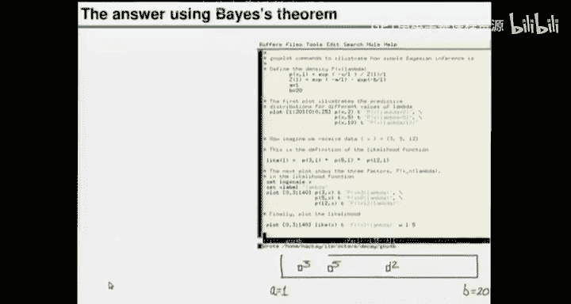

Any plot。P of X given lambda as a function of X。 And it looks like that。 And that's all very normal。

So that's what it looks like for three different values of Lambda。

And if you have a very small value of land limits。All con on left。 You have a big value of lambda。

You got a more uniform distribution。And every one of these probability densities over x integrates to one。

 And it's all very normal。 So the area under this is one and the area under the green curve。对。你肉晒光了。

So that's all very standard and very simple。 And they're just exponentials。

 And then base theorem says， okay， now you want to know lambda given X。

 will you just plot the same function， but look at it as a function of lambda。

 So you take these innocent exponential functions and look at them the other way around。😊。

And this is what they look like。 So this is the probability of x。Given。Lambda。Sorry， it's not。

 This is， okay。And obviously， to do this， we need to fix x to a particular value。

 So I'm showing you three different outcomes for three different possible x's。 So X could be。

 for example，3， or it could be 5， or it could be 12。

And this is what P of X7 and Lada looks like for three， it's the light blue curve for 5。

 it's the blue1。 and for 12， it's the purple 1。And the amazing thing is just one of those functions。

😊，Take the one If we fix x to 3 and then plot P of X given Lada as a function of Lada。

I'm showing Lada on the horizontal axisxus here。 and I put it on a log scale。It's got a peak。

So a single data point is now giving you this nice picky function and saying。That。

Just one data point that happened to arrive at x equals 3。That one data point now tells you。Is。

Tells you some opinions you ought to have about different values of Lambda and。

Extremely small values of Lambda， close to 0。Are essentially ruled out by it。

Values of Lambda near to2 or so are perfectly happy。 They did a good job of predicting it。

 And then larger values are slightly ruled out， but not very much。

 They're just slightly penalized compared to Lambda is2 or so。😊。

So just one data point can tell you something about what Lada should be。

 And as you pile in more and more data points， you multiply these functions by each other。

 The special case of a data point that's out beyond the midpoint。😊，Gives you this purple line here。

 which is saying， okay， we can definitely rule out tiny values of Lada。

 There's no way Lada could be 01 or 。3 or something like that and get a point at at 12。 That's crazy。

 So that's ruled out。 But all values of lambda from 102030，100。

 They're all equally probable or rather， they predicted this data point equally well。😊。

Because they all predict essentially uniform distributions。

 So they're all equally unsurprised by seeing a value out at 12。Okay， so we multiply these together。

 And when you multiply those functions together here， I've multiplied the functions。

 imagining that there are just  three data points at 3，5 and 12。 You multiply them together。

 and the likelihood function has a nice peak。😊，And。😡。

We can think a bit more about what this function actually is。

 How does the function depend on the data。Well， this particular function depends on the data in this way。

 It's got a Z。At lambda， A And B。N， And it's got E to the minus。

 Let's take this product here and so suck it upstairs。 E to the minus sum of X， N。On London。

So it's the meme is all you need to know， in fact。So here， I'm rewriting the likelihood。

So the brilliant intuition that said， why don't you just compute the mean of the data is exactly right。

 If all you are trying to do is infer Lada， assuming there is one exponential。

 then the only thing you need to know is the sum of X N。

 And then you can work out the likelihood function。

 So you don't actually need to know all the data points to 20 decimal places。

 You just need the sum of them。😊，Because of this particular form。Of the probability density。

If the model didn't look like this， it wouldn't have been the mean that is the thing you need to know。

 So the， the， the lesson to draw from this is not。 Oh。

 so now all I need to do is compute the mean of my data， and I can solve any problem。 No。

 what you need to do is work out the likelihood function and the likelihood function will tell you what you ought to do with your data。

 And in this case， the answer is find the mean。 And then。Pt the likelihood function。

 And on the screen， we have a likelihood function there。And。

I can recreate these curves we're just looking at。Again。So。Here are。

 I'll just repeat the sequence I did。Here are three probability denities over data space over x for three different values of Lada。

 You could imagine getting data at points such as 3 or 5 or 12。Now。

 the predictions of these different models with different values of lambda are simple exponentials。

 But something you can notice about them is there are places， for example。

 the left hand blue line where the red is above the orange is above the yellow。 So the red winds。

 It predicted better。 There are places where the yellow is above the orange is above the red。

 and there are places where the orange is top。😊，So， there are outcomes。

Such that any of those three can be the winner in terms of having predicted better than the other two。

 And that's another way of saying when we plot the likelihood function。

 there may well be a peak as a function of lambmbda。 So now we do that。

 we plot the likelihood function。😊，And this is the likelihood multiplying together those three。

Numbers。And I've shown in red， orange and yellow here the three values of Lambda that we were considering a moment here。

 We looked at Lambdas 2，5 and 10。 This is when you get data。嗯。At the three。

 at the three points that I mentioned before。Okay。Let's do it one more time。

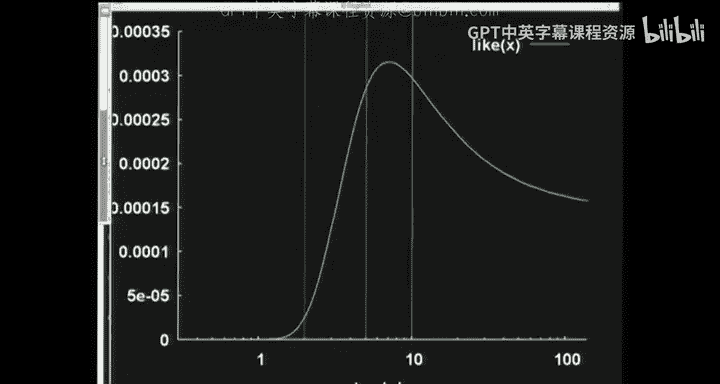

What's going on。wrong。

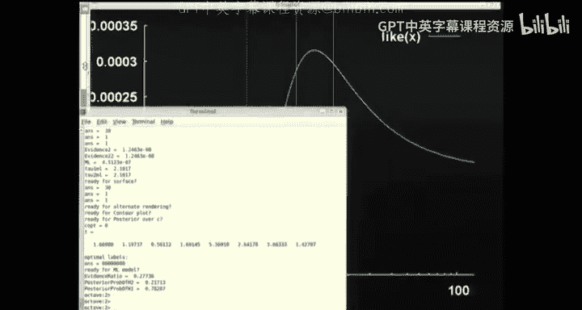

嗯嗯嗯。Okay。Try again。😔，Okay。So just going through the sequence again。

 here's three places you could get data。The left end point points to the red hypothesis being the most probable。

The data point at 5 prefers the hypothesis that Lambda is something like 5。

 and data points out at the right hand side prefer the hypothesis that Lada might be 10 or so to the hypothesis that Lada is 2 or 5。

 So this is what the likelihoods look like。 If you get just one data point that is respectively at 3 or 5 or 12。

And this is the product of those。Okay。So， that's based theorem。

For finding a single parameter lambda and wasn't that easy because all you had to do was write。

 essentially， 1，2。

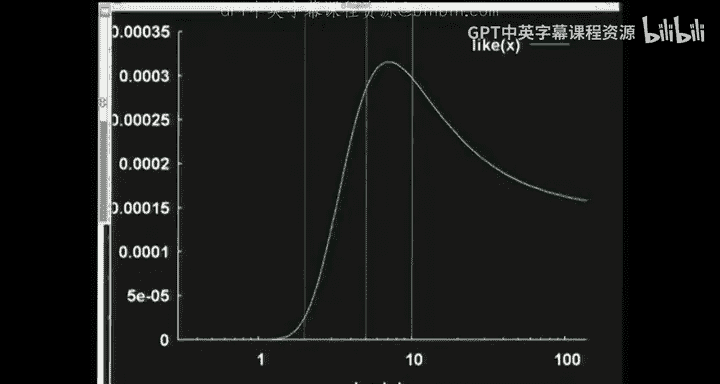

3 lines of little blue plot to define the function。 And now we've got this bump that tells us。

The answer。It tells us what， how well those alternative values of Lada predicted the data that actually happened。

 And it works for 3 data points， and itll work for 3000 data points as well。 Yeah。

 so we haven actually。Okay， who said anything about picking Lambda？ The question said。

 what is Lambda？ And I think the correct way to answer that is either。

 do you really want me to pick Lada。 If so， tell me how， But if someone says what is Lada。

 I think the correct way to answer that question is， well， it's roughly this or plus or minus this。

 So I think the way to answer a question。 You know， how heavy is this book。

 I don't want you to give give me a number， I want you to say， well， it could be200 G plus or -100。

 I'm not very good at estimating weights of books。So。the exam question said， what is Lada。

 It didn't say provide a single point estimate of Lambda。 If you want a point estimate， guess what。

 I might maximize the likelihood。But。I'm not addicted to maximizing the likelihood because you could get silly answers。

 Remember a moment ago， we were looking at the Gaussian distribution。And Mr。 Gaussian。

 with a single data point， had infinitely big likelihood。Down here， this wasve。This was。Lg sigma。

 And you can actually get infinite likelihood down here。

 So maximizing the likelihood doesn't have any fundamental status。

It may well be better than a whole load of other ways of， of doing things。

 It's a fairly coherent principle， but it can be dangerous。So what would I say is the answer。

 I would return the likelihood。 And if someone wants a quick summary of roughly what the likelihood looks like。

 I would see if I can find a peak， and I'd give some description of how broad the peak is。

So a very common thing you can do with data like this is if you've got more than three data points。

 you can probably make a Gaussian fit to that blue curve on the screen。 And you can say， well。

 the likelihood function。 Here's the formula for it。

 And here's a a function that will compute the likelihood。

 And here is a Gaussian approximation to that。 It's got this mean and this standard deviation。

So that's the general method I'd， I'd suggest that often works well。

 You take your likelihood function。And you approximate。The likelihood。But Augustian， maybe。

So this isn't the rule。But it's a， a suggestion。When you approximate it by a Gaussian。

 you need to describe what the， you need to decide what the variable on the horizontal axis is here I've chosen to have log Lada beyond this axis。

 You could also have lambda beyond on whole graph looks。

 but were lopsided and a Gaussian approximation in one space may not be as good as a Gaussian in another。

Sorry， does the yellow curve？对。Does't take。Okay， the question is。

Looking at these three likelihoods for single data points on the top of the screen。Does the yellow 1。

 which is the probability probability of x equals 12 as a function of lambda。

 Does it have a peak at all as Lada goes to infinity。 And the answer is no。

 all those values of lambda give identical predictions。 So it just asymptootes to。The value。

1 over 19。Because the window is 19 white。And so all of those in the limit put their probability density uniformly over 19 space。

19 centms wide。外。 yes， if you change the width of the window from being 19 centtres wide to。

 to being say a hundred and 90 centimetres wide， then it would have a peak again。

 just as for 3 and 5 and any point to the left hand side of the midpoint， you get a peak。

that's the rough rule of thumb。 I think I'm right。 in what I said that if the point is to the right of the mid。

 midpoint of the window， you don't get a peakak。 And if it's the left， you do。Yes。😊。

Could the likelihood function have multiple peaks， Defite， in general， It could for this problem。

 It can't。 It's unimmodal for this problem。 But in general。

 likelihood functions can go all over the place。 and we will come up with many examples of that in future lectures。

Okay， what I want to do now is I want to move on。 Oh you can do this for any dataset。

 So here's another dataset with just 3 points。 And there are 1。7，1。5 and 2。

 So it's still only  three data points。 But now you see the likelihood is much more sharply peaked。

 So it depends on what the data actually turn out to be how sharp your likelihood will be。

 And it's possible with three points all to the cluster to the left hand side that you can get quite a good estimate of of Lada just from three data points。

An approach that used bins of a fixed size that was fixed before the data arrived would probably be hopeless at this sort of thing。

 But the likelihood function does the right thing for you。

 when you can get a very precise answer for Lada， even given only three data points。

 it gives you that。 So we hate putting data into bins and hurrah for the likelihood function。

 because you'll never need to use bins ever again。

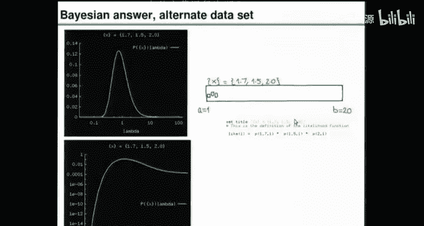

Okay。I want to finish in the next 15 minutes。With another question。The topic for today。

 it's lecture 10。The topic for today is inference of parameters and models。

And if I gave you some data like this。 And if I didn't just say they come from one exponential。

 tell me Lambda。 if I said， I'm not actually sure if it's from one Lambda， warm exponential。

 Maybe there's a mixture of exponentials。Please tell me what I should think about that。

 Is it credible given this data that it comes from two Gaussians rather than， sorry。

 two exponentials rather than just one。How do we solve that problem？ Well， let's write down。

Basedace theorem again。是。Have a chat to your neighbor about how to solve this problem while I wipe the board。

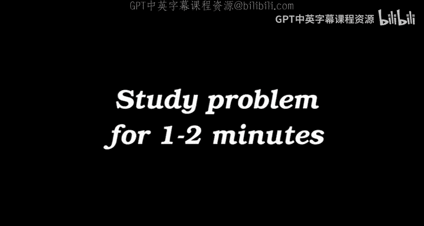

Okay， so what we're gonna do now is we're going to introduce two hypotheses。 One is hypothesisesis 1。

 which we've just been working on。 Hypothesis 1， which is named after the number of parameters it's got。

The number of exponentials。So here it is。And this is how we fit H1 to the data。 Fitting involves。

Thinking what its Lambda， It's one parameter Lambda might be。And there we。 That's what we do。

And the prior， I was， I didn't even specify what it was。 the sort of thing you might do。In this。

 if it were a real life problem， you might think a little bit about if you know anything about Lambda already。

 you know， if it were shorter than something rather than the universe would explode。

 And if it were bigger than we'd all be dead or something like that。

 So there might be a range of values that you're pretty sure Lambda must be within。

 And if you really don't know anything about Lambda apart from that。

 you might be tempted to have some sort of uniformish prior between those values。

 it actually depends what the problem is， what you should do about this thing， it is subjective。

 And that's the way I think it has to be。 and。So the sort of thing that the prior might be is some uniformish distribution over some broad range of。

 perhaps。A use of log lambda。Okay， so I'm not saying it has to be that way。

 That's just the way I often work。 If I have real inference problems。

 If I've got a positive quantity Lambda a decay length。

 I'll tend to think of the log of that variable as a natural way to work with it and then maybe put prior on the log of it rather than directly on Lada itself。

😊，What this implies for the priorry on Lada is that it may be a bit of a sort of。Lopsided prior。

 looking a bit like。This， because this prior is saying that values， such as 。

1 and 1 and 10 and 100 are all just as likely as as each other。 And that means we've got a a bias。

 if you like， to small values。2。O。So I haven't obsessed about this prim。

 but it's going become slightly more important in a moment。When I were introducing。

 a second hypothesis。And the second hypothesis says that the probability density of x。

 if you knew Lada 1 and Lada 2。And if you knew。Quantities， let's call them pi 1 and pi 2。

 which are the weights of the two exponentials。 So these are the length scales。

 And these are how much probability mass in each of them。The probability X。

Given those parameters and H 2 is。E to the minus x。On Lambda 1。嗯。Plus E to minus x and Lada 2。

m two multiplied by weight high1。Hi to。And for simplicity。

We could pretend that the left hand side of the window， is it。0 from now on at。

Maybe I didn't need to say that。 So， that is。A mixture of two。Exponentials。And。Yeah。

 let's retract what I just said。 This is true for all X between A and B。And it's0， otherwise。Okay。

 so H2 has got two interesting parameters， Lambda 1 and Lada 2。

 and it's got another couple of parameters， pi 1 and pi 2， which are probabilities that sum to warm。

 and they're positive。😊，And。To get on with it， I'm going to declare that they're both a half。

 So I'll just simplify life and say that half of the mass is in one exponential half is in the other。

And。I didn't have to do that。 It'll just make it a bit easier to do what we we're about to do。

 So the model will only have two parameters， rather than 3。Okay。

 so we've got a one parameter model and a two parameter model。

 and we can do inference with both of them。So we can infer Lada 1 and Lada 2。Given。A load of data。

And H。And that involves working out the probability of。X。Given Lada 1 and Lada 2。

Which is the product of all of these things。I'm now suppressing the pi is because I've just arbitrarily decided that pi 1 is is a half。

And we have a prior on the two lambmbdas。And。We have an normalizing constant。

 which is the probability of the data。Given an H2。So， that's how we。To put a crudely fit model to。

 to the data。Or rather， it's how we infer Lada 1 and Lada 2， given the data。

 And it's got a normalizing constant that we don't care about because it's just a normal constant。

 If all we're doing is thinking what we believe Lada 1 and Lada 2 should be。However。

 if we now want to do model comparison。Then what we want to do is say。

 how probable is H1 given the data。And how pro is H2 given the data。

And the answer to this question can also be found by base theorem。

 by writing down the rules of prove。Starting from our assumptions。

And that's B of data given H1 times whatever your prior belief in H1 was。

Divided by an normalizing constant。And this one is the probability of the data。Givenive H2。

Multiplily by the probability of H2。Divided by the same normal constant。And if you like。

 I'm suppressing here some further assumptions that this all depends on。Wch we could call。

Let's put it I for other assumptions。 So those are all lurking here。

A key assumption here is the assumption that either there's two exponentials or there's one exponential。

 And there's the assumptions about the priors on the the parameters。So all of these things depend on。

Those remaining assumptions。AndI'm not wanting to。Hide those at all。

So the beautiful thing to notice here is if you have carefully solved problem 1， which was。

 please fit Model 1 to the data。😊，And if you have carefully solved model problem， too。

Infer Lada 1 and Lada 2。 And if you have done that in a way that spat out。A piece of chalk。

 Let's spa out。This normalizing constant。 So if you didn't just ignore it。

 but you computed it when you were solving this inference here。 So this is parameter inference。

If you got the normalizing constant， that is exactly what you need。In order to do this。

Asian inference here。 It's the data dependent term， and the other one。Which we have over here。

Ive lost my green。So let's color this f red。This normalizing constant。In freely ra。Is this one here。

So， we have。Too little tasks to do parameter inference。

 And then you're done because if you did your parameter inference properly and you've got the normalizing constant。

 you've already done model comparison as well。 You've got the number that you need in order to do model comparison。

So let me step you through this。 And I'm going to。Do it in a slightly different way from what I wrote down here。

 What I described here would work just fine。 We've got a function of X， Lada 1 and Lada 2 here。Oh。

 I forgot to divide it by Z。 Allright， Z of。A， B Lada 1 and Lada 2。So we've got a function here of x。

 Lada 1， Lada 2。And you can just multiply it all together， and then normalize。

But there's another way of thinking about what's going on here。Which is。

 if you believe that there's two exponentials and you get a load of data。You could imagine。

That those data came out and some of them were colored white。And some of them were colored。Red。

And the color could be telling you which exponential they came from。So， white was。Lambda 1。In red。

Theres Lada 2， for example。And then。Someone was cruel to you。

 and they rubbed out all the colors and just told you the X coordinates。

But you could imagine trying to infer what those missing colors were。

 And we could do an inference that involves naming those missing colorss。So I'm gonna rewrite now。

 Model 2。And I'm going to say that my world has in it。A Lada 1 under Lada 2， which we don't know。And。

It's got coordinates。X， n。And it's got colors， K， N。With N going from1。And。And now。

 the way that we get all of the data， if we knew Lada 1 and Lada 2， is we first pick a color。

 and then we draw the point from that。We draw the， the next point。From。

The distribution conditioned on the colour。So。We can write this as probability of colour。

Lada 1 and Lada 2。And the probability of x。Given the color。Ler one。And lamna two。And。

We could put a product out here。Product from one to n。Pick the colour， and then pick X。Okay。

Then we can do a variety of inferences。 We can still work out the probability of Lada 1 and Lada 2 if we want。

 but we can also work out other things。 We could work out。

 how probable is it that the correct coloring of all these points is。K， N from one to N， given。

The data。And assuming that H2 is true。We can ask questions like that。

And we can ask questions like this。 What do we think Lambda 1 and Lambda 2 are given the data from assuming H2 is true。

 which is the question we just asked a moment ago。 So there's a range of， of questions we can ask。

 and I'm gonna enumerate。This entire hypothesis space of different hypotheses about Lada 1 and Lambda 2 and K。

 N。So what I'm going to show you now。Is I'll ask the computer。To show us。

How well the data are predicted as a function of Lada 1， Lada 2 and。The colors。

So I'll plot that likelihood function。 So I'm now increasing the number of parameters into my problem from 2 to 1 to。

 whatever n is。 So if n is 8， I'm giving myself a total of 10 parameters，2 real numbers。 and then10。

 sorry，8 categorical variables， which are each either red or white。

And we can look at the likelihood function as a function of all of those。 And I'm going imagine that。

Set of possible values of Lambda1。And Lambda 2， and。Hey。Which is K1 through K N。

 Theres living in a stack of pancakes here。So。Every one of these pancakes has a Lada 1 axis and a Lada 2 axis。

 and there's discrete pancakes。 And the number of pancakes is 2 to the power N。

So the bottom pancake is the one that says that K1 through K N is 1，1，1，1，1，1，1。

 So they all come from。One of the。Exentials， and here's the top of the pancake。

 which is K1 through K N。Is all zeros。 I'm gonna call them0 and1。

 because I'm working on the computer now。Instead of。1 and two。And in between。

 we have all the other possible labellings of the points。

 And for every hypothesis about what the labeling is and what Lada 1 and Lada 2 is。

 we can then work out what the value of。P of。A particular date point is。Given。

Lambda and all the case。In fact， we can work out the probability of all of them by multiplying those and quantities together。

Right。So， let's do that。Right， so here are some data points。

 I'm going repeat this exercise for four different data sets。

And what I'm gonna do is show you the inference of what we think Lada 1 and Lada 2 and K R。

 So I'm gonna show you the the， the stack of pancakes。

And I'm also going to run the inference for the simple model that says that there is only one exponential。

 So I'll go back to the， to Model 1， and I'll show you the inference for Model 1。

And here's what I'm actually gonna do。 I'm gonna start just by doing the inferences for Model 1 again。

 And then we'll move on to doing model 1 and Model 2。

 So here's a super simple dataset set with just four points in it。

That's what the likelihood function looks like as a function of Lada or as a function of log Lada。

So that's what we did a moment ago。 So I'm just showing you again perhaps on a slightly different scale。

 the things you're familiar with。This is what you get if you take the maximum likelihood value of Lada。

 So you take a point estimate of Lada and you show its density in data space alongside those four points。

Alright， so I'm introducing you to the sequence of things I show you。 I show you the， the data。

 I show you a likelihood function， and then I show you the best fit distribution， the。

 the fit that maximizes the likelihood。😊，And then just for the sake of argument。

 I show you what might have happened if we had chosen some bins to put the points in and counted how many were in each bin。

 So there's two blue bins showing a little histogram， which may be food for thought。Okay。

 here's more data。 So about 20 data points or so。 And you can work out the likelihood function。

 And because you've got a lot of data， the Lada is quite well determined。

It's characteristic in this sort of problem that typically the width of the peak shrinks as the square root。

 Ss as one over the square root of the， the number of data points you've got。

 So that's a useful rule of thumb to， to have for this sort of problem。And that is the best fitting。

いです？Sorry。That's the green curve that maximizes the likelihood for the model that says there is only one lambda。

But if you have very careful eyes and a sal mindset。

 you might look at this clumping of points that left unai and say， I'm not too sure about that。

So you might be a skeptic about the one lambda hypothesis。That's what the data looks like。

 If you shove it into bins。Of a particular with that I just invented。 You could say， oh。

 you should have used smaller bins， but then you'd have a lot of zero counts running around。

 And we know zero counts might cause trouble for some methods。 So data in bins。

Not that we care about bins。 but just to remind you the methods that we're not using。 Okay。

 let's move on to data set number 3。 I've slightly reduced the amount of data because I want 2 to the n to be manageable。

 So I've got a data set here that I've deliberately chosen to have size 8 points。

 So 2 to the n is 256。 There's 256 hypotheses about how these points were actually colored in red and white before the colours were eraed to make them all blue。

So there's some data。 And now we're going to fit Model 1 in the same way as before。

 And we're also going to look at Model 2。 So here's the likelihood function for Model 1。

Showing it has a function of Lada。And here it is， as a function of log lambda。

And that is the best fit green curve， the best single exponential that you get by maximizing the likelihood。

Now。There's the histogram using a particular bin size。Just for people who are interested in bins。

 Now what we're doing is we're gonna rattle through the pancakes。

 So there's 256 of them and I've rattttle down to pancake number 7， the labeling there。

 K1 through K N is in binary。 So you see，0，000，1，11。

 It's the seventh pancake and the likelihood function for any particular labeling K is beautifully simple because if you knew K。

 then you would know that the last three data points all came from Lada 2。

 And the first five points all came from Lada 1。😊，And the likelihood function。

 probability as a function of Lada 1。Is just the simple function that we had before for model。

 for Model 1。 and the likelihood as a function of Lada 2 is the same function that we had again for Model 1。

 If you know which points go with which cluster with which exponential。

So this is a super simple thing。 It's just a product of two of the two functions that we are already familiar with。

 we plotted them when we are dealing with Model 1。 And as we ratttle through the pancake， that blob。

 which is a simple， separable function， just moves around because different labelings put。😊。

The best guess for Lambda 1 and Lambda 2 in different places。 The final stack of the pancake。

 The final layer is is one that says they're all from Lambda1， in fact。

 is the way round I've got the， so。😊，The all ones hypothesis says they all belong to Lambda 1。

 which means Lambda1 is quite well determined。 And we have got a clue about Lada 2。

Because none of the points actually came from the second cluster。 Okay。

 so some of the pancake surface plots look like this， and many of them look like little blobs。

 and they're all in different locations， so。Got。Blob， blob， blob， b， blab， blob and。

And this one up here will be a hump， just the same hump， but rotd 90 degrees。Right。

 what can we do with all this information that we've accumulated。

 We've run through a total number of hypotheses to the tune of 256 times the number of points I looked at in each pancake。

 The number of points I looked at was 32 times 32。 So 1000 points in every pancake。 So I've computed。

256000 numbers here， which are for every one of those sub hypotheses，256000 sub hypotheses。

 for every one of those， How well did did that sub hypothesis predict the data that actually happened。

When we know that， we can then read out anything we're interested in。 For example， we can read out。

How probable are alternative values of Lada 1 and Lada 2， You get that essentially。

 by summing all of the pancakes on top of each other。And that's what that looks like。So two bumps。1。

 what that's saying is， yes， this data， which someone with a keen eye might have thought liked。

Some with a keen eye may have thought that there's evidence for two exponentials in there。

 This is saying， oh， yes， you can get a much better fit to this data by giving yourself to lambdas。

 And what that surface plot looks like with pretty colors is shown here And what it looks like is a con plot as a function of lambda 1 and Lada 2 is shown here。

 So two very distinct bumps， saying， yes， you can either fix Lada 1 to a small value and Lada 2 to a big value or vice versa。

 And those are by far more probable than other values of lambda 1 and Lada 2， for example。

 that they're equal to each other， which would lie along the diagonal here。😊。

We can also ask the question， what's the posterior distribution of the labels。

 What do we think call the Ks R And there's 256 hypotheses。 And this is the sum。

 It's essentially the sum of everything in the pan。

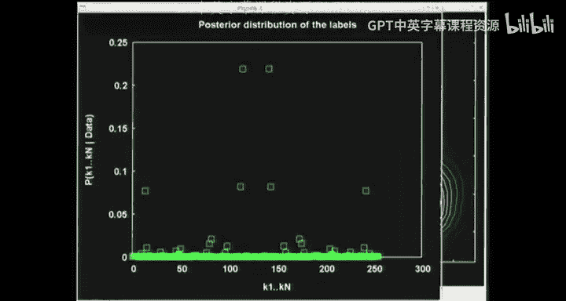

All right。And you sum that up， and。You find that the different labellings have different probabilities。

 And there are two labellings there that are the most probable labellings。

 which correspond to one possible assignment， Reds and whites and the other opposite assignment。

 It's got symmetry about the middle。 because the binary representations have the property。

 that if you take one labelling and you reverse all the ones and zeros。

 You switch between integers that sum to 255。 So that's why it it looks why it has that mirror symmetrym。

😊，Okay， so we can now read out if we're interested in in it。

 the maximum likelihood value for Lada 1 and Lada 2。And that's shown here。

And the purple line is showing one of the exponentials。

 and the gray line is showing the other exponential。 And the green line is the sum of those。

 those two exponentials。And。The green line sits on top of the gray line， most of the way。 So you。

 you， you can only see a little bit of the gray line。Okay。

 so that's the maximum likelihood hypothesis using two lambdas。Then。

We can repeat this for another data。 And what I wanted to show you before we do that is let's answer the final question。

 the model comparison question。 You compare the models by summing up and getting the normalizing constant。

 And the code I just ran as we went through these examples did that。

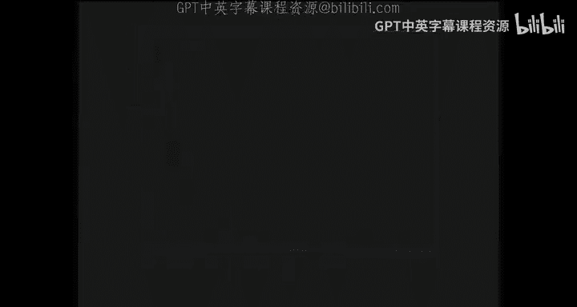

And for this third data set。This is what happened。The third thing。

 evidenced  one is this quantity here。Have。4 model one。There's that guy。And evidence， too。

Is this guy。 So evidence 1 came out 5。4 times cent -7。

 an extremely small number because what we're talking about is predicting a with a probability density over an8 dimensional space where those8 data points will be。

 So it's not surprising to have an extremely small number for the evidence because we're predicting in a largest space。

A real valued。8 real value quantities。 evidence number 2。When you tot it up comes to 1。

4 times 10 to -5。And what that means is the evidence ratio， which is what you need。

 if you want to know the probability ratio between these two numbers here。

 evidence ratio is 26 to 1 to actually work out that evidence ratio。

 I did need to make an assumption about what the prior on Lada was。

 And I've gone forgotten what prior on Lada I actually chose。

 But it was uniform over log Lada in some range。 I forget from。

 from what to what four orders of magnitude or something like that。

These answers do depend on that prior， but not in a super sensitive way， so。Obviously。

 it has to depend on your assumptions， but you shouldn't worry about that particular assumption being a terrible。

So a game breaker。If it is a game breaker， you can find out you can explore the sensitivity of the answers to these questions to those assumptions。

 If you're worried about whether you've thought carefully enough about your assumptions。

And in this case here， this particular data set gives you an evidence ratio of 26 to 1 in favor of model 2。

 So if they had equal prior probabilities， you get this data and you end up saying it's 96% to 4% or so in favor of model 2。

Now， the final thing to emphasize is that it didn't have to come out that way。

 There are many ways of fitting models。 For example。

 if someone does a maximum likelihood fit and you say， now， how do I tell which model best？ Well。

 let's pick the model with the biggest likelihood。 If you do that。

 you'll end up always choosing model 2， Because trivially。

 Model 2 with its extra parameters can achieve a better A bigger likelihood。嗯。

But that isn't how Bayesian model comparison works。 It involves doing this summation。 we。

 we do a comparison based on the normalizing constants。

 So we don't look at what was your maximum likelihood。 We look at what's the。

Agregate of how well you predicted the data summing over all the possible values for your hypotheses。

 And it's not necessarily the case that Model 2 will always win。 Indeed。

 there are data sets for which Model 1 wins。 And that's the final thing I'll now show you。

 So this final data set。

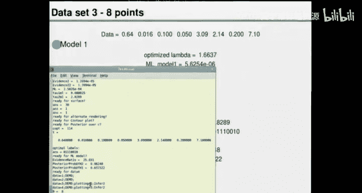

Shown here is the data that that really did come from a single exponential。

 So I drew 8 points from an exponential。 And off we go with the likelihood function for Model 1 on log scale。

 the maximum likelihood fit and some bins。😊，And then we do Model 2。

 and we run through all the pancakes。And it looks just the same as before to a casual observer。

 have these bumps wobbling around as we run through the 256 assignments。And now， when we say。

 what's the marginal likelihood of Lada 1 and Lada 2， you find it's actually。

It looks fairly unimmodal。 It's not exactly unimmodal。 If you make a counter plot。

 And if you go and zoom into the peak of this and look super， super， super carefully。

 you can't see it on the screen now， but you can do this。

 You actually find that you can get a slightly bigger likelihood。😊，Bye。Having Lambda 1。

 not quite equal to Lada 2， but theyre very， very similar to each other。Alright。

 so that's the likelihood of Lada 1 and Lambda 2。And this is the posterior distribution of the labels。

 just as last time， some labelings are more probable than others。

And we can work out the evidence ratio。 and the answer for the evidence ratio is shown。

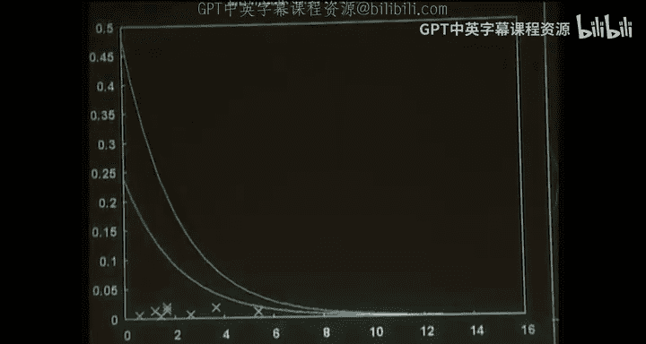

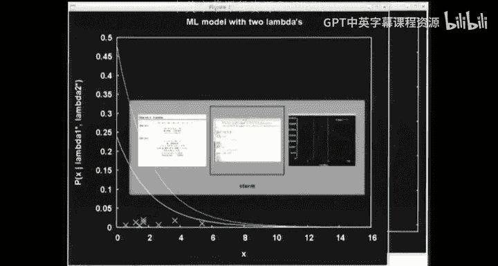

Here， it's  point27 the other way。 So now the the more probable model in this case here is Model 1。

 which comes out 78% to 22% if they are equally probable in the beginning。

So that is how model comparison works。 And what I take away from this is。

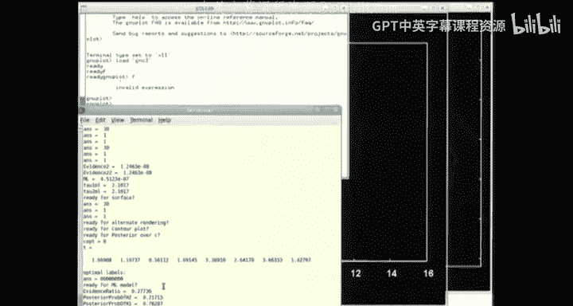

Given that standard ways of fitting even a model with just one parameter can run up against problems unless you use base theorem。

 I find this quite a compelling argument for saying， yes。

 let's use base theorem for more complicated problems where we might have as many as two parameters running around。

So that was an introduction to inference of parameters and model comparison。

 What we're going to do next time。Is。We will move on to the topic of clustering。

And I'll discuss some quite popular algorithms for doing clustering。

 which can be used for things like。

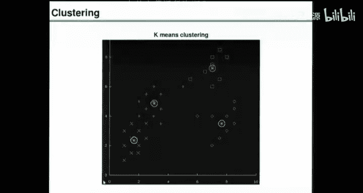

啊。Maybe character recognition and speech recognition problems。 Here's an example from speech。

 You could take a single word utterance and take its spectrogram and the all the objects on the left。

 at the top。 are people saying the word which is it， one of thems one and one of thems 0，0，0。

 I guess the right hand ones of the zeros and the left hand ones or the ones。

 And then you train up on all of those training examples。 Then someone gives you some more words。

 And you need to recognize which they are。 And you could imagine that as a clustering problem。Yeah。

 so the ones were on the left and the zeros are on the right。So we'll talk about clustering。

 and I'll describe a popular method for doing clustering。

 Then we'll give it a Bayesian interpretation and discuss how to make it better using that Bayesian interpretation。

 So that's the first thing we'll do next time。😊，Are there any questions。Okay， thanks very much， yeah。

Okay， the question is， have Bayesian methods not been used frequently because they're computer intensive。

 I think that's not really the answer。 It certainly makes it easier to use Bayesian methods If you've got a computer。

 but I think it's a sort of strange accident of history， really， because it's perfectly possible。

 You know， take a problem like this one we did here。With a single exponential。

 iss perfectly straightforward to work out a likelihood function and sketch it by a variety of of of methods。

 So we didn't need a computer to do it。嗯。And。So I think it's。

 it's more an accident of sort of personalities and。

 and political fights between academics that these other schools doing things other ways grew up and。

There， there's this urge to have a a so called objective method。

 and Bayesian methods got labelled subjective。 And people deluded themselves into thinking that these other methods weren't actually subjective as well。

So。Yeah， having computers definitely makes it straightforward to use a lot of Bayesian methods。

 And we， we're going to discuss a whole bunch of ways of doing practical Bayesian methods on computers。

 But way back before computers were even thought of。

The earliest work on inference was perhaps being done by Laplace。And Laplace。

 the correct name for Bay theorem， In is Laplace's theorem。

 because Laplace used it in anger on real data。 He got data on the orbit of Saturn。

 and there were things to be inferred， and he used。Base theorem， the pla theorem to。

 to do those inferences。 So， he knew that it was the right way to do things and。

That was the the birth of， of Bayesian inference。So it's not for lack of computers。

 There are other explanation explanations， perhaps partly social explanations。Okay。

 thanks See you next week。

