# 信息论、模式识别和神经网络The Information Theory Pattern Recognition and Neural Networks 2014 - P15：-15-Lecture 15_ Data Modelling With Neural Networks (I)_ Feedforward Networks_ T - GPT中英字幕课程资源 - BV1er421M7Br

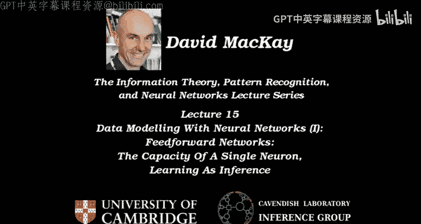

Welcome to Leture 15。 We're going to start talking about a completely new topic now。

 namely neural networks。And。I want to kick off by first mentioning where in the book we are。

 We're going to be looking at chapters 38，39 and 42。 And there some other chapters mentioned there。

 which you could take a look at too。And。I want to motivate why we should be interested in neural networks at all。

 And I'll start by talking about brains， which is one of the motivations。

 We don't understand how brains work。 And so it's interesting to look at theoretical models of them。

Neural networks do have engineering applications as well。

 And so even if you don't care about neuroscience， you might be interested in solving machine learning problems。

 using neural net approaches。But let's talk a little bit about brains。

The first amazing thing about brains， which we will come to in the second lecture on neural networks。

😊，Is our amazing ability to do content addressable memory。

 And this is quite a remarkable thing that we take for granted because we do it all the time。

 Let me just remind you of what I mean by content addressable memory。

 So I can give you images that are noisy and blurry and only have a small number of pixels And maybe they make you think of things。

 And we get at the content。 we get the memory that you recall when you see the image by me showing you a fragment an incomplete partial content of that memory。

 And that's so different from the way standard computers work。 a standard computer， you know。

 the memory is in a draw in the filing cabinet and get the memory you need to know which filing cabinet number and which card it's on。

 And then you go and find it there Here we're saying， well。

 there's a card in there that has these holes in it。 And you sort of magically out the card。😊。

Are you with me。 Can you see what I'm on about。 Let's give you just a single word or two and another black and white image。

 not full color。 something with number 0，4，9。 I don't know why。 but you sort of。

 you generalize a bit。 And you say， well I have heard of that。 I've of 0，07。 And that's just00。

7 squared。 So I give you little cues。 And you actually come up with the entire memory from the cues。

 And that's an amazing thing that brains do。 for me， it's really。😊。

The most exciting thing about neural networks is that brains can do this。

 And we have some models that have a little bit of this sort of capability。

 which we'll come to in the next lecture。😊，Let me give you another example。

 I will tell you about an Oscar nominated actress， but I won't reveal her whole name。

 and she acted as senator in an， in an amazingly good George Lucas film。😊。

Even though one of the pieces of information that I've just given you is incorrect， Nevertheless。

 you are thinking of Natalie Portman， I'd predict。So here's another example。

 I'm gonna show you the cover of a book， and the title has several words in it。

 And I'm gonna to blank out all of the title， except for two letters in the title。

 And I'm going to blank out almost all of the， the cover。

 And I'm gonna put that black patch over the eyes of the author。 the author is on， on the cover。

 because when you put a black patch over someone's eyes， then they're very hard to recognize。

 But nevertheless， what's the title of the book。😊，A brief history of time。 Well done。 So there it is。

 So that's content addressable memory。😊，How do we do it， Can we get machines to do it。

 How do brains do it， For me， that's a really compelling， interesting and exciting problem。😊。

We won't discuss that today， but it's one of the motivations for looking at neural networks。

 So well today， we'll do some basic stuff with neural networks and maybe look at some engineering applications of them。

 And this is going be the sort of pinnacle of the neural net bit。 We'll come back to this question。

 How can we do content addressable memory。 And I'll show you a solution using neural networks。😊。

Let me give you just one more motivation for being excited about brains and neural nets in general。

 This is based on some experiments that worked as follows。 The experiments were conducted in 1989。

 The subjects in the experiments were shown 725 images。

 and four of the example images are shown on the screen there。😊。

100 of them were labeled as positive images， and 625 of them were labeled negative images。

 So the subject was instructed to memorize the label plus， plus or minus。

 All the images were fairly similar in character to each other。Several months later。

 the subjects could remember all of the positive and negative examples and could distinguish them from other images that had not been seen earlier in the experiment。

 And even 12 months later， they could still correctly recall all the positive and negative labels。

And this is impressive to me because the subjects were pigeons。And。

Pigons can learn random binary labels， completely arbitrary binary labels associated with images。

 They can also learn to identify a particular person。 So actually， the four images there。

 the two on the right both have the same girl with the long hair and and boots。

 And so that's how some of the images work in some of these experiments。

 So whether it's random labels or meaningful labels， Pieons can learn them。

 And they can respond within a fraction of a second and correctly say， you know。

 have I seen this image before。😊，And that ability to recognize something familiar is something that we still struggle to do with modern computers。

 So I'm going to just spend a little bit more motivational time saying。

 what is the difference between a pigeon and a supercomputer。So。First， let's just talk about。

The hardware difference， my， my basic case here is that pigeons thrash supercomputers。

 Pigeons are much better than crazes at this sort of task of recognizing and responding to images extremely quickly。

😊，嗯。So is it because pigeons actually have access to more hardware。Let's count。

The number of devices in a pigeon brain is about 10 to 11 neurons。

The number of synapses per neuron might be 10 to the 3 or so。 So maybe there's 10 to the 14 synapses。

 And you could think of either the neurons or the synapses as being elementary devices。

 a little bit like transistors。The number of devices in a cr。I don't know。Shall we say，10 to the 10。

Bits of memory。That's if you've got one gig of memory， of course， they have far more。

But I don't want to be unnecessarily unfair because all that memories just sitting there being completely unused。

 What about in the CPU itself， the CPU。Maybe is， I don't know， A million or so devices in a single。

CPU。So you could say， yeah， the pigeon is beats the cr because it's got more devices。

 but the pigeon's devices are slow。 So we'd better take into account the clock rate。And。For a cray。

I'd say。The clock rate is something like 1000 MHz。Which means that we're in a ballpark of having 10 of 15 or 10th of 19。

Devicice。Operations。P second。I just checked what the latest news on supercomputers is in that's supercomputers with lots and lots of CPUs and tons of memory。

 And they can do 10 to this 16。😊，Floating point operations。Per second。

So this is two different ways of， of quantifying how much you've got in a cr。

 So this is in terms of the， the hardware。嗯。How many hardware device operations you've got per second。

 And then this is in terms of the output， what an entire。Supercomputer。 This isn't a single。

Cray anymore。This is。Today's top super supercomputer。

Can crank her 10 to 16 floating point operations per second。What about the pigeon， Well。

 the clock rate corresponds to 10 milliseconds。Clock time。

 I'd say roughly'cause a single neuron can fire 100 times a second。 if you push it。嗯。

You could argue that some bits of the hardware maybe have a， a faster clock time。 Maybe， you know， I。

 I'm an advocate of the idea that synapses can do some very rapid， interesting things。

 But let's just run with this number anyway。That means you've got 10 to the 13 operations。Per second。

If you take the neurons as your operating devices。Or10 to the 16。Operations per second。

If you view the elementary transistor like。我，唔知。As being， sorry， the synapses。

So in terms of operations per second。Devicice operations per second。

 The cray has got more going for it。Than the， the pigeon。

 in terms of actual output floating operations per second。

 if you take the synapses as doing floating point operations。嗯。They' are at the same level as a。

 a supercomputer in a single pigeon brain。 So there's an an amazing computational ability in a pigeon brain。

 but it's not actually bigger in terms of these numbers than a cray， yes。😊，Okay， the question is。

 what's the size of the words， So you're saying for these floating point operations。

 how Uy is a floating point operation in a cray。 So probably that's some sort of operation along lines of a 32 B。

Integer getting multiplied by another 32 bit integer or something like that and doing it absolutely perfectly。

Whereas a signapse。If you're lucky is probably doing。And maybe2 or4 bits。嗯。Per operation。

 I would guess I'd be surprised ifm on a time scale just 10 milliseconds。

 whether you'd be getting anything more than 2 or 4 Bs because it's all dominated by plus on noise。

 whether channels are open or not。 And you've only got small integer numbers of channels。Okay。So。

 yes， the word sizes or the， the precision of these operations is bigger for the cray。

Or for today's supercomputer than for， for the pigeon。 They're in the same ballpark。

And it's not the case that the pigeon has far more resources at its disposal。嗯。

Maybe the pigeon is far better at this image recognizing task because it organizes its hardware differently。

So。Supercomputers are essentially just standard serial computers wired up in a slightly different way。

 They have a CPU。Or lots of CPUs。And if you want to store a new memory。

Without losing any of your old memories in a standard computer。

 you have to have some new virgin hardware。So there's no connection at all between old memories and new memories。

 You just put them in another place。 And you need to know where they are。Meanwhile。

 pigeon brains have。They're parallel。 They have high connectivity。So。

A typical neuron is probably connected to about 1000。Other neurons。

 whereas a typical transistor in a cray is probably connected to。Roughly 3 or 10 other transistors。

Typically。And the computation， however， it's being done。

Not that we understand it is definitely distributed。When a。Pigeon learns some new memory。

The new memories go in the same hardware that it's using for everything else。We don't know how。

But they're stored in the same hardware。And， importantly。Pigeon brains are robust to hardware。Damage。

 so you can take a pigeon brain， or you can take your brain。

 and you can damage many thousands of your neurons。

 And you still the following day carry on functioning。 Okay， you do this whenever you drink alcohol。

 You， you kill off some neurons， but you still keep going。And the cray， in contrast。

 if you reach into it and say， oh， well go and destroy 1% of the transistence in this cr。

 It's gonna be fine， isn't it， You find that it is not fine。So here's the hypothesis。

 The hypothesis is。Maybe。The difference in the performance of the pigeon and the cray on this sort of realistic real world image recognition task is。

Because of the difference in style of computation。So maybe the style of computation。Is the key。

So maybe we should be getting away from serial if we're excited about being able to solve problems that computers are still useless at。

 and maybe we should be going to genuinely parallel。😊。

Maybe we should be looking at wages of using hardware that you have high connectivity that are distributed and work in a completely different way。

So in the next lecture， we will come back to the， the task of storing and recalling memories and we show a way of doing it。

With a simple neural network model。So。I've just given you a。

15 minute motivation for why we should be interested in parallel distributed processing。

 which is the name of one of the old Bibles of neural networks。

And the sort of parallel distributed processing I'm going to talk about is。

Paraleel to subject processing， using。Elementary devices that we'll call neurons。

So we're gonna have a single neuron。Which is gonna be a thing that has some inputs。And an output。

And then we're going to wire them up in a variety of ways。One way of wiring them up is feed forward。

Which looks like this。 You have some inputs going in。Some neurons。

And then they connect to in more neurons。 And we can put arrows on these edges to show which way things go。

And then maybe have another neuron， and then something comes out。So that's a feed For network。

It's simple to describe because it's sort of deterministic。 you just put in an input。

 These guys can compute。 These can， can compute。 These can compute。 and then you're done。

Another way of wiring these things up would be a feedback network， where you say。Let's allow。

Everyone's outputs。To be。Everyone else's inputs。Like that。

And then the dynamics depend on exactly how you define the way all the neurons interact。

 and maybe something more exciting happens。So。Let's tell you a bit more about the single neuron。

 And then for today's lecture， I'll talk to you about。Feed forward networks。

And the next lecture will look at feedback networks。Okay。So， here's how a。Single neuron works。

The single the neurons got inputs。an output。And it's got some parameters。

And the parameters are commonly called。无畏。And the parameters lurk here between the inputs and the body of the neuron。

And here's how it works。 It's very simple。If the weights are W 1， W 2， dot， dot， dot， W。Okay。

 and if the inputs are X 1。2。Okay。What the neuron does is it adds up the weighted sum of its inputs。

Using its own weights。And it adds one more number called the W 0。

Which you can think of as a little dangling extra。Weight here connected to a virtual input that's always set at one。

 And this weight here is also。Sometimes called the bias。Of the neuron， which is what it activation。

A will equal if all of the inputs。啊0。Then， having computed its activation。It computes its output。

Also sometimes called the activity。Of the neuron， by shoving it through a function。And that function。

Could be。1 over one plus E to the minus a。Which looks like that。Or it could be。

Hyperbolic tangent of me。Which looks almost exactly the same。Or it could be a step function。

Like that。And something we could note in passing is that we have come across neurons already without knowing it。

They came up。In the previous lecture， when we discussed variational methods for spin systems there。

 we had quantities called a， which were the weighted sum of average activities of spins。

 So X was how much a spin was pointing up。 And a was the activation。

 And then we slapped that through a tant to determine how much we were pointing up。

 So we have actually seen this。😊，In the variational free energy。Minmization。For a spin system。

We've also seen this。A little before。One of the questions。That I may have asked in the lecture。

 and it's certainly in the book， is if there are two Gaussian distributions。

And you don't know which of those a data point comes from。And it comes along。And x 1。X2 space。

And let's say that this Gaussian is labeled class 1， and this one is labeled class 2。

If I give you a data point X that came from this mixture of two Gasians， please tell me。

 what do you think is the probability that C equals 1。 The answer to that question is。F of a。嗯。

Where F is this thing and a is indeed of precisely this form， some of W K X， K plus W 0。

 So it's exactly this form。 And that's the answer to the question。

What's the inference of what class I'm in， And the answer is， well， there's 50% chance。

're in class 1， if you're on this line and the higher chance on this line and the lower chance on this line and so forth。

 So the answer to the question varies。With contours that are linear in X1 and X 2。

 assuming that these two Gaussians have identical covariance matrices。

 So I think we did that exercise when we were talking about clustering earlier。So。

We've already encountered neurons。 We just didn't call them neurons at the time。

 We called them simple mathematical functions， which is what they are。

So let's just familiar familiarize ourselves with the new language that we're using here。

And let's have a play with one neuron。

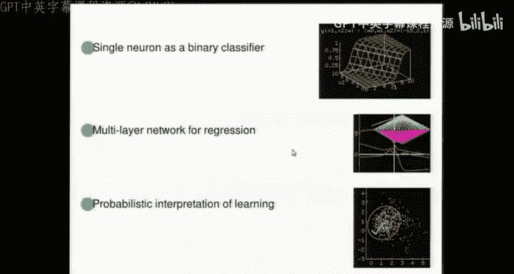

So。Here is。A picture of the output of one neuron。And the title at the top of it。

 we can turn the lights down。The title tells you what the three weights of this neuron are。 Y 3。

 Well， it's because this predicted neuron。That we're playing with here has got two。Inputs。是。

We're going to play for a while with。The feed For network， which consists of just one neuron。

With two inputs。1 output。 And there is， as usual， a little bias hanging off here。

 which you can think of。As being a weight， W 0 connected to an input that's always one。

 So W 1 looks here。 W 2 looks here。Right。As a function of x 1 and x 2。

 this is what the output of the neuron looks like。对。The weights are set to -15，2 and1 in the order。

 bias， weight 1 and weight 2。And the function that I'm using is the one over one plus E to the minus a。

 which is sometimes called the logistic function。Okay， now let's play with the weights。

 So let's change the weights for the bias。 So as weve change the bias of the neuron。

 the function just trundles to and fro。 The orientation of the contours doesn't change， but。the。

Function slides around。 Now， let's change weight 2。 What does that do。Well。

 it doesn't change where the function interss the x 2 equals 0 axis。

 but it did make the function swivel around that point。Now， let's change weight 1。

That's gonna make it swivel around the place where that red curve intersects the X1 equals 0 axis。

 So now you can maybe think of it at all swiveling around a point that's off the screen。😊。

This is the surface plot view。 Let's redo what I just did with conour plots。

 Here's the con plot  for。嗯。Let's make this look the right size。嗯嗯。It's better。

I'm showing a contour plot of exactly the same function that we had a moment ago with the weight set to -15。

2 and 1。Here is the 0。5 contour。 Here are the contours that I forget。

 point2 and  point8 or something like that。And the white line is a representation of the normal to the red contour。

So that's and if you like， it's pointing in the direction of the weight vector， so。

This is the X1 axis still。 This is the X 2 axis。 And I'm showing a vector。

That's proportional to two in this direction and one in this direction。

 So it's proportional to the weight vector。All right。Strictly， these vectors， input space。

 X 1 X 2 and weights， W1 W Who theyre in dual spaces to each other。

 So we shouldn't necessarily go plotting them on the same， same screen。

 But that's why I stretch the axis to make， make it look like it's perpendicular。嗯。Okay。

 so let's go through the three weight twiddling things we just did。 I'm gonna twiddle weight 0。

 The bias that makes the contours trundle around like this。Next， we'll weigh very W2。

 the third of those weights。That makes the contours wander around like this。And finally。

 our very weight 1， which will make the whole thing pivot around the place where the red line intertexs the vertical axis there。

Alright。Okay， and what I'm going to do next is vary all three of them。

 So I'm going to scale all the weights up or down by a factor。

 And I want to check that you're with me What's gonna happen if I double all three of the weights of this neuron。

 What's gonna happen to the contour plot。

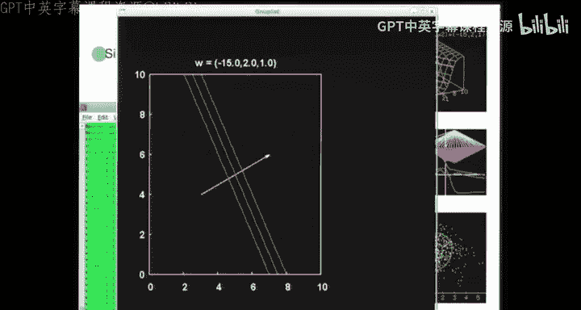

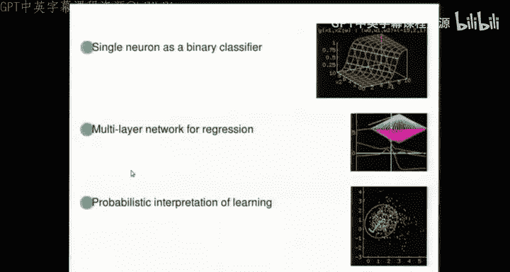

Chapt your neighbor。Hopefully， this is all。Very straightforward。Okay。

 any prediction of what happens to the counter plot if I take all three weights and double them。

Anyone。Seaper， and where does the red line go， Where does the middle contour go。Moves， stay still。

 Okay， bit hard to figure out。 It stays still。 It just becomes steeper。 Okay。

 so let's go back to the。

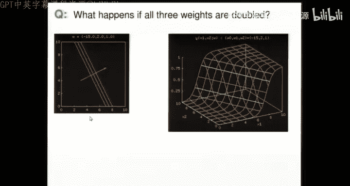

Demo。So scaling up and down the weight doesn't change the place where the activation is 0。

Which is where the red line。Yes。Okay， so that was playing with a single neuron。Now。

 what we're gonna do next is we're gonna talk about learning with a neural network consisting of just one neuron。

 And learning means that you get yourself some data。And the data takes a form of a set of input。

Target。Pas。So the target specifies roughly what you want the neuron to say or the neural network to say。

In response to the input。And I'll have a label called N that runs through these。Data。

 and the idea of learning is that we adjust。Learning is just a silly name for adjusting。

The parameters。我 wait。Such that。The output of your neural network， Y， when you shove in X N。Is close。

就这样。Fural n。Obviously， when someone says， make something like that happen。

 What you would say to them is， well， hang on， just tell me the the objective function， please。

 and then I'll minimize it。 So I'll do it that way。 The objective function。

 which measures how good the weights are。A口 G。And to start off with G is gonna have n terms。

 each of which measures how close T is to y。 And my measure of closeness is gonna be a relative entropy。

Okay， where。Why， and is my shorthand for。Y when you shove in X n and have the weight set to W。Okay。

 so the W dependence lurks in y here。And in this way。And。This objective function is a sum of terms。

Each of which either looks like this。Or it looks like this， depending whether the target。Is 0。

For the target。Is one。 So if y matches the target， the objective function gives you 0。

And if y doesn't match the target， you get a penalty that's increasingly big。

 the further off you are。You could think of G as being。The information content of the data。

From the point of view of the neuron， who views his output Y as being the correct probability distribution for the data。

So it's the information content。Of the data， or equivalently， it is the description length。

Of the data。Assuming。That you view why as being。The correct。Probility。40。Now， when I said the data。

 I'm being a bit imprecise。 What I mean is。Set of teas。So if you。

 if you've already been told where the data inputs are， what the x's are。 And then someone says， now。

 I'm gonna tell you the T's。 This is what the description length would be if you used a perfect arithmetic coder。

Or other compression methods to encode them using this neuron。Okay， so。Let's show an example of this。

So here's our single neuron。 And here's some data。 The sort of data we could be talking about might be we are trying to run a vegetable sorting factory。

 The pigeons have gone on strike because they've realized how good they are compared with supercomputer and they w to be paid the same wages as supercomputers。

 So now we're trying to get a a simple neuron to replace the pigeon。

 The job of the pigeon is to sort the potatoes from the carrots or the raisins from the pebbles or whatever we're doing。

 And we've got some label data。 So we've measured X 1 and X 2 for 10 objects。😊。

5 of them were raisins and five were pedals。 Okay， so the classes are colored there。

 And so we know what class each of the 10 things is in。 We've got X 1。 We've got X 2。

 And what I just showed you in this input space， X1 X 2 is how a neuron can produce a function that is a ramp a soft sigmoid ramp。

😊，So what is learning， Learn is minimizing an objective function like this with respect to W。

So what does that involve， Well， if you're at all sensible at minimizing things， you'll say。

 is it easy to compute the gradient。And the answer is， yes， it's easy to compute the gradient。

 So you get the gradient， and we'll call that G， which is D G。啊DW。

And then you do some sensible downhill thing based on the gradient。

 The very simplest thing you could do with the gradient is called gradient descent。

 That's not a sensible thing to do， because it doesn't。

Satisfy the sort of covariance that you'd like， the appropriate treatment of。

vectorectctor spaces and their duals。 So this mixes up vector spaces and their dues。

 which is a crime， But lots of people do it。So you just work out the gradient， and then you say。

 let's make a step in the direction of the gradient。So， that's gradient in descent。

And this parameter here。Is by neural network， people called the learning rate。

And that's an ad hoc parameter that you have to set somehow。It's fairly easy to show。

 And this is left as a homework exercise that the gradient can be written as a sum overall of the examples of T minus y times X。

You can think of this as the error that the neuron is currently making on the n example multiplied by the input。

 So to work out the gradient， you put each input in。

 you look at the error between the output and the target。

 Then you multiply the error by the input to get the gradient and you tot it up。

 And that simple operation。Which we got by differentiation is sometimes called back propagation。

 So back propagation is the neural networks community。The neural network community's name for。

Differentiation。Back propagation is a particular algorithm for doing differentiation in feed forward。

Networks and doing it efficiently。Okay， so what happens if we do that？ We start off the neuron。

With some randomly chosen weights and the weights change。

 So here is gradient descent doing its thing。 And I'm showing you the three weight values。

 and they all blow up。 What was happening in W 1 W2 space looks like this。

 The weights wandered off in one direction。 And then they wandered off in another direction。

 So as they went downhill， the direction of a downhill changed。 what was going on。 Well。

 here's the data。 Here's the initial weight vector that I， I picked at random。

 So it's not doing a very good job of separating the blue from the yellow。

 And you do gradient descent。 And the weights change。 And where the red line is changes。

 and it rotates round。 and then it changes， and it rotates。Rund some more。

 And the weight are getting bigger and bigger。And after 40000 iterations。

 that's where the weights have got to。Alright。So， that's learning。And you might say， well。

I'm not happy。 Maybe I could do better than that， because。A moment ago。

 before we got to this final optimized setting of the weights where we've gone。

 we've managed to find a place where we can put a cliff that completely separates the yellow points from the blue points。

A moment before， when we were sort of halfway there， the answer looked a bit more reasonable。 This。

 this is， this is now saying， okay， you give me another example。 I will classify it for you。

 And wherever it arrives， you'll say，'m 99。999%。 Sure it's a blue or that it's a yellow because we've got this incredibly steep cliff。

 And you might say that that's stupid。 We don't like this outcome。

 it has managed to minimize the objective function， but maybe we picked the wrong objective function。

😊，So。If we don't like this， what do we do， Well sensible people change the objective function。

So now what we're going to do is learning。With。The regularization， which。

Says I don't like these enormous， steep， sharp changes changes in function。

 or in neural network language， we call it weight decay because you get steep functions。

When the weights are big。So we add in an extra term， and the objective function gets changed。

 So it's not just G。The new objective function of M。And that is G plus an extra term。Rich says。

I don't like big Ws。So the objective has changed from。

 please fit the data as well as possible to please fit the data。

 but add on a penalty if for having big weights， So E W。

Is going be defined to be half sum of W K squared。Alright。Right， so we do that。

And now here's what happens。 I've set this parameter alpha。Which is either called。The regularizer。

 if you are from the statistics world。Oruth， the regularization constant。

E W is called the regularizer。Or if you're in neural networks， Al is called the weight decay rate。

When you add that on， what happens to your gradient。 Well， it's just an extra term now。

 So the gradient of G plus alpha E W is this lot plus alpha times your weights。

So going downhill on that means you've got a minus alpha W term n。

 And what happens when you do the minimization is shown here in terms of what the weights do。

 They used to blow up。 But now they settle down and they don't。

 we don't have an ever steepening function。 So all the weights have settled down。

 And here's what used to happen。 Then we didn't have the regularizer。

 The orange curves show everything blowing up。Here's what happens in W 1， W2 space。

 We go downhill downhill and sort of stop along the trajectory effectively is what happens。

 So we follow almost the same trajectory in weight space。

 But we stop at an optimum of this new objective function。

 This is where we used to be going after 40000 iterations of steepest descents。 Now。

 when we switch on the weight decay， we go downhill and we end up in this place here。😊。

How shall I resize this again， So it looks。Sensible。Alright， only might look at that and say， good。

 that's better。嗯。Because now it's not making completely unreasonable， overconfident answers。

 For example， if you say， for another point arriving at this location here。

 what's the chance that this is in the blue class， It'll say about 90%， instead of saying。

 I'm  hundred00% sure。And if you get another one at this yellow point here， it'll say 5050。

 And you might say， yeah， that's， that's not a bad answer based on the data we've got here on pebbles and raisins。

You might still be dissatisfied。 And if you are， hold that thought。

 We will come back to this in a moment。

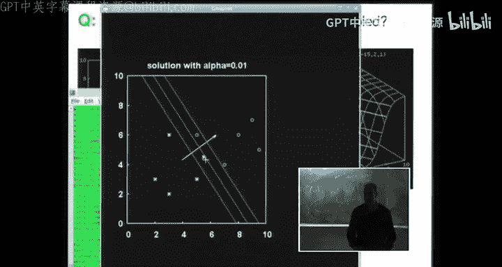

Now， we're going to switch to。Larger networks。 And then we'll come back to the the。

 the single neuron when we've got some more ideas。

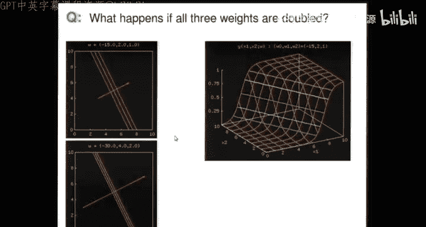

Let me just tell you a couple more things about the single neuron。

 And then we'll come back to the this learning business。First。

 I can give you an example of using a single neuron to actually do a real problem。

 So I talk about pebbles and raisins。 Well here instead is a handwriting problem。

 You can get yourself a data set of handwritten digits that have been digitized into black and white dots。

In 256 dimensions。 So you can get yourself a few thousand examples of twos and threes。

And use the algorithm I've just described to come up with a single neuron， which has 256 inputs。

 It has 257 weights， and its output can be viewed as the probability that this thing I'm looking at is a two or a3。

 And when you do that， this is what the weights optimized look like。

 And the error rate of the classifier that you have made is about 10%。

 So on this database of handwritten digits。 It gets 90% of them right。

 So it's not completely useless。 So even a single neuron can be a an interesting。

 quick and dirty weight to solve some simple。Inference problems。

A question you could ask about a single neuron。Is you could view it as a communication channel。So。

This is just a little aside。 And there's a whole chapter on this in the book， if you're interested。

One way of thinking about what's going on here is， oh。

 I don't really believe that the output of the neuron is the correct probability distribution。

 So forget that idea。 But I do believe that the neuron is a helpful way to package up the contents of the data。

So。If you give me a data set。With lots and lots of examples of handwritten digits。

 I can package all of that up into 257 little numbers。Which are， say， a single neuron。

 And then I can send the the neuron to someone So I can send the weight to W。

And then someone else could try and reconstruct what all the labels were。By。

 I'm assuming they can get the same inputs。When they get those inputs。

 they can use the neuron to reconstruct。What the output was。🤧哼。

So this is a sort of information theory， view of。A single neuron。And you could ask the question。

If I view the neuron as a channel。What's the capacity of that channel。

 How many bits can an your onle。And you can formalize that question。

 And the chapter in the book does this。And there's a rather interesting， nontri answer。

Which comes out like this， assuming that these Xs are in random， are in general position。

 So they're either randomly distributed or at least they're not nationalally coline with each other。

 If the X's are in general position， then there's a good chance that。

You can correctly learn with your neuron。Any random labeling。That the world comes up with。

There's a good chance。 You can learn that。As long as the number of labels N。

Is less than or equal to twice the number of inputs。Which is twice the number of parameters。

So what did I just say， I said a single neuron with K inputs can almost certainly memorize 2 K。

Random binary labels。That means that the capacity of a neuron in terms of how many bits you can store in its weights。

 Each of the weights， W 1 up to W。 K， Each of them is a real number。But effectively。

 if you're using the neuron in this way as a way of just sort learning the labels on some examples and then reproducing them。

You can reliably communicate with that channel 2 B per connection。

 So that's a really handy rule of thumb for many neural net style applications that if you're using a neural net。

😊，Then maybe the effective number of bits you can learn in that net is something like twice the number of parameters you've got in。

 in the network。This is precisely true for a single neuron。

 and it may be true for other types of neural network as well。 But you。

 you need to use that idea with care。Right， so that's learning as communication and the。

 the capacity result for a single neuron。What I want to do now is move to slightly more realistic networks that are bigger。

And。I'm going show you a neural network， which has。A load of。What we call hidden neurons。And。

For simplicity， I'll show you。A network with just one input。

 which is where the mouse is pointing now。This is the bias unit， if you like。And this is the output。

 So it's a multi layer network with one hidden layer。 You go from the input。Where are we。

You go from the input， which here is just。One dimensional。We lots of neurons。

And then you get to your output here， having gone through all of these guys here。

So if H is the number of hidden neurons， the number of parameters in this thing。Is roughly three。H。

Because there's two inputs for each one。 And then this guy here。

Has got roughly H parameter going going into him。 It's probably more accurately，3 H plus  one。Okay。

 so I want to explore a bit more what functions look like for a neural network like this。

 This is the simplest example of a multi layer preceptron。With one hidden layer。

And these sort of multileceptrons are still quite widely used。

 So it's interesting to understand them。 So let's switch to the other demo。

And。What I'm doing here is I'm gonna show you the case H equals 3， and I'm gonna make。

A random network。 And Im， I'm setting all of the weights， How many other 6，10。

 I'm setting the 10 weights of this network to a random values drawn from a Gaussian distribution。

 And then I'll update those weights。 and we'll see what happens to the， the random function。

 So there's a whole bunch of functions you can get。There are functions of the input variable。

 which is shown here。 So I'm showing you the input variable X 1 on the horizontal axis。

 And the vertical axis is the output Y that's coming out of this multi layerer network。 alright。

So that was a little movie of a bunch of functions。 What are we doing。

 We're just adding up three tanches。 It's the sum of three hyperbolic tangents。

And that's what the blue thing is。 It's an example of what you get when you make a weighted sum of three arbitrary hyperbolic tangent functions。

So another name for most neural networks that are used out in the real world is weighted sums of hyperbolic tangs。

ButThat doesn't sound quite so sexy。Okay， here's one with 10 hidden neurons。

 And the blue line is a sum of those 10 hyperbolic tangents。

 The all of those things that go between -1 and plus 1 are hyperbolic tangent functions themselves that the 10 neurons are computing。

Okay， and we randomize the weights， and it goes bily，ly，ly rub。

 And that shows you the sort of thing that you get for a single input， single output neural network。

 That's increase to 25。 And here's a whole bunch of random functions。😊，So what does it look like。

 it looked like a French curve。 And so another way of thinking about a neural network is these feed forward multilay networks are just French curves。

 And when you then bring along some data and say， please fit this neural network to the data。

 You're just saying， please put a French curve through the data。

 You know what I mean by a French curve。 It's one of those bendy thing。

 So you you you buy something that that's bendy and rubberery and it sort of gives you a smooth curve Who things I don't know。

 maybe they don't sell them anymore。 But they used to be popular in in in high school so that you could make a bendy smooth。

 smooth curve。😊，Right， so what can we do next。The demo I just showed you with 25 odd hidden units。

 I drew the weights at random from a Gasian distribution。

 I didn't tell you what the standard deviations were。 Now。

 I'm going to show you those standard deviations。 They were all equal a moment ago。

 And this screen is now showing you for equal standard deviations for the input weights the bias weights and the outputs。

 which are colored now red。😊，Purple。And grayray。The three blue curves are showing you three random draws from。

The Gaussian distribution。 right， So you can see those three functions。

 And now what I'm gonna do is crank up and down the standard deviations。

 just so you can see what effect scaling the weights are about the random weights。

 making them bigger or smaller has on the random functions。 So first。

 let's crank up the input weight， standard deviation。

 And you see the functions have got more wiggly and they've sort of shrunk in because we've taken all the hyperbolic tangents and made them all steeper。

😊，Okay， if we take sigma in the standard deviation of all the input weights down。

 you get much broader functions that locally look just like straight lines。Okay。

 now let's tweak the biases。 Bies， we can have big standard deviation for them。

 Now we've got lots of wiggles， or we can have small standard deviation。

 And now we get something that looks like it's a sum of about 3 or4 hyperbolic tangents。

 even though it's a function， a sum of 25。😊，So the standard deviation of the biases is determining how many wiggles you get。

But it doesn't affect the characteristic length scale of the wiggles。

 That was being controlled by the standard deviation of the inputs。Finally。

 if we crank up and down understand deviation of the outputs， this is trivial。

 The functions just become higher， vertically or lower， alright。

So that's the role of those three standard deviations。So what should we do next。

 Let's give ourselves some data。So just as with the single neuron。We computed the gradient。

 and we did steepest disscents on that gradient， and we ended up。

Being able to perfectly separate the five yellow pebbles from the five blue raisins。

We can do the same thing with a dataset set that looks like this。 Here are five data points。

And we can define a new objective function， which instead of。Being this G here。

It's going to be a measure for real numbers。Of how close。The outputs aren't our target。 So we have。

A neural net function like this called Y。 You have some target values like this。These are the errors。

Here's T， N。 Here's Y N。 And we can define E， D to equal sum of half。T， N minus Y， N。Squared。

What other measure of error could you possibly have， Well， obviously， other ones。

 But this is a standard thing。 People often sum squares。And that depends on W， on the weights。

Through the Y Ns， which are all。Wight dependent。Alright。So what do we do with that。

 We say this is our objective function。 Please make the output as close as possible to all the targets。

 You compute the gradient G， which， by definition is D E， D by D W。

 and many people do steepest disscent on that objective function。

 So they follow the gradient downhill。Alright， lights down， please。

And here's what happens after one iteration of steepest descent。

 I started off with a 25 hidden unit neural network shown by the blue line。

And we start going downhill。 And after one iteration， it's already looking quite promising。

 And then you do another iteration。 and you do 2000，3000，8009000 iterations。

 And you end up with this screen thing， which perfectly goes through all five data points。

 When you say， hra， brilliant。 I have learnt the function。😊，From the five data points， or maybe say。

 no， rubbish。 That's stupid because maybe you're dealing with a noisy problem where actually。

 what you really think is going on is that there is a true underlying function and the data points。

Differ from it by some。Additive noise。 And then you would be rather irritated to have a green curve that perfectly goes through every single detail of the noise。

And if you are dissatisfied in that way， what do you then say， Well， you say。

 I want to do learning with regularization。 And so you change the objective function again。

And you say， I need some sort of regularization。Because I don't like this wigly function。

 because it's a bit wglier than I was expecting。The expectation of it not being super duper wiggly。

Can be expressed， perhaps with a regularizer。 And you can go back to the good old regularizer that we had a moment ago。

 E W。And。You can add alpha times it， or maybe you're a bit more sophisticated。 And you say， actually。

 I should divide the weights into classes because remember a moment ago， the wiggss。😊。

Of this typical function， it had。A length scale that was determined by the standard deviationlevation of the input weights。

It had a number of wiggles that was related to the standard deviation of the biases。

So it's actually a number of wiggles in a typical function with sigma bias over sigma n。Roughly。

 and it had a vertical length scale that was something to do with sigma out。

 perhaps time square root of。H。So， since the。Input weights， magnitude。

 and the biases and the outputs are affecting things in such different ways。

 It might make sense to have three regularizers， one for each of these things。And you could define。

EW 1 to be the sum of squares。Of the weights。Summing over the biases。EW2。To be。

Some of squares with weights。Over the input weights， only。And E W 3。Could be half sum of WK squared。

Summing over the output weight。Only， and that would be a more dimensionally valid thing to do。

 And then you can say my regularizer is sum overea goes from 1 to 3。Al for C， E W C。

 And then you're doing something dimensionally valid。

Rather than just pretending that they all have the same regularization， constant。So when you do that。

 light sound， please。Instead of the data error going ever smaller as you manage to perfectly fit the data and the weights blowowing up。

 which is what just happened with no regularizer。You can add on， you can set all the alphas， say to1。

 just to start off with。 So Al 1， Alpha 2 and alpha 3 are all set to1。 And now you go downhill。

 And the first iteration looks just like last time。 But you keep on going downhill。

 and it just sits still。 and you go for 10000 iterations。

 And it hasn't blown up and gone terribly wgggly to fit every detail of all the noise。ra。

 you might say， maybe that's better。But you might still be a bit dissatisfied because， you。

 is that really the answer to a question， What was the question。嗯。Anyway。

 the objective function that we are now minimizing called M。M is equal to a multiple of E D。Plus。

 sum of Alphaacy E W。That's what we're now minimizing。

 That objective function has gone down and settled down。 and we found an optimum of it。

 And the weights haven't blown up。Okay， what's next。

 I suspect what's next is an interpretation of what we're just doing。 So let's see。 yeah， okay。

 let's go back to。The single neuron。So， the single neuron。Looked like that。And I want to。

Encourage you to feel dissatisfied with this and to feel dissatisfied with。

This thing as well that we just had a moment ago。 and then we'll fix your dissatisfaction。

So why should you feel dissatisfied with this outcome of having trained a single neuron as a replacement for the pigeon that discriminates。

Pebbles from raisins。 Well， have a think about， well。

 one source of dissatisfaction might just be hang on。 It all depends on the value of alpha。

 And as you set alpha to a different value， you get a different answer。

 So here I've set alpha to 01 and you get a different solution and here you set alpha to1 and you get a different solution again。

 So one issue is， how do you set the da regularization constant。But another issue。

 even if you were happy， with some magic that was used to set it to this value， you might say。嗯。

I'm willing to believe that the predictions here about are quite well calibrated to this data。

 I think it， you know， it looked readable to say， yeah， yeah sort of 20% is share and 80% a share。

 Yeah， that's okay。 But I don't believe this extrapolation over here。 So if you look at points。😊。

Called A And B。Are you happy with the idea that we're just as confident that A is sort of 90% certain to be in the yellow class。

 And B is also 90% certain to be in the yellow class。 Is that reasonable。If you are dissatisfied。

 you might be interested in。The view of learning as inference。

So we discussed learning as communication。And now we're going to discuss learning with regularization and weight decay as。

Inference。So if someone minimizes something， I tend to fine。

I will exponentiate the thing youre minimizing， and I'm going to interpret it as a probability whether you like it or not。

 So if someone takes M of W， which is G of W。Plus， alphapha E W。Minimizes it。I will say， al right。

I'm going interpret， interpret that in the following way。The posterior probability of the weights。

 given the implicit assumptions you're making。Is e to the minus M of W。On Z。

And that is equal to the product of。The probability of the data。Given W。

And the prior probability of W， given all your assumptions。So this is your posterior distribution。

 given the data and your other assumptions。 And that needs normalizing with something。Implicitly。

 if you minimize this thing， you are finding the most probable W， given these assumptions。

 The probability of the data given W is E to the G。Of W。And the probability of W。

 the prior probability is E to the minus alpha。EW。On something。

So this is an interpretation of what people are already doing。 It doesn't change anything。

 but it may add some useful perspectives。 So if someone minimizes this objective function。

 they are implicitly assuming that。It really is the case that there's an underlying function。

 Y that generated the data by flipping bent coins with a bias of y。 So that's the interpretation of。

 of this， so。Data。Came from why， using a bentco。Of bias。Why， that's what this means。And。

The regularizer that's being used to penalize enormous weights。

 because we decided we didn't like enormous weights。

Is interpreted as a prior belief about the weights that says， if E W is。Half w squared， for example。

 it's saying that the prior probability of W is a normal distribution。With mean 0。

And with standard deviation， sigma squared。W。That is equal to one over alpha。

 So this parameter alpha， which a moment， a moment ago was a pain in the neck。

 arbitrary regularization confidentant， is now interpreted as being the variance of a prior distribution。

And。This interpretation can be。Ignoed， or it can be exploited。The exportation says， okay。

 let's take this literally。 and then we can do a whole load of new things。 For example。

 we can actually ask。What's the right way to turn the inference into a prediction。

If someone asks for a prediction， what should you do。Well。

 if you believe this model is correct and you're asked to predict what's the probability that the next thing that we've just observed at location X plus N X n plus1。

Is in class 1。 What's the probability that this new point on the screen， say， A or B or wherever。

 What's the probability that it's a potato or a carrot or raisin or pebble。

Given the data that we've seen so far and all the other assumptions。Well。

 the answer to that question isn't found by saying。

 please work out the W that minimizes this and then use that to make predictions。

 The answer is done by marginalizing。 So the correct answer。

 if you believe all the assumptions is you should marginalize over W posterior probability of W given data。

Multiplied by the prediction， which is why。Evaluated at。X， n plus one。Using the parameters， W。

 So that's what you actually ought to do。 If you believe the assumptions that you've implicitly been making。

That's an example of an average value of a simple function under a nasty red distribution。

And we know， three ways。To catch that elephant。We can use Monte Carlo methods。

We can use variational methods。Or。We can use。The place method。So， let's do that。

So just to make clear what's red， the nasty red distribution is this。

 the posterior probability of the weights， given the data and that。Is this thing here？

It's a nasty red thing， but we can compute it。 It has the form E the minus M of W And M we have got a formula for。

So we can attack this in a variety of ways。And the first way I will use is called Monte Carlo。

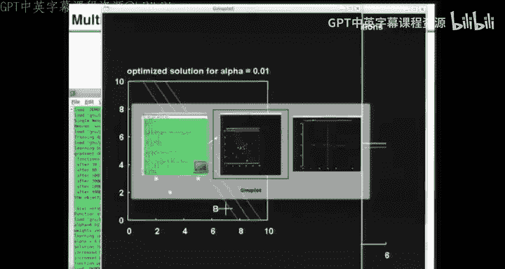

So we can take our handbook of Monte Carlo methods。And we can say。Oh， goodness me。 we can say。

 hop forward 5 slides。

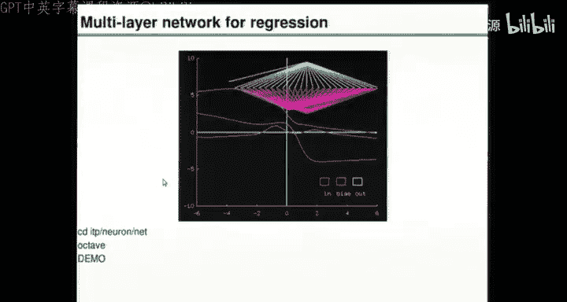

。Right， we can say， let's give ourselves a Monte Carlo method。And。Use Monte Carlo。

To evaluate this quantity here。How different is that， Well， if we use Hamiltonian Monte Carlo。

 do you remember Hamiltonian Montelo a few lectures ago。

 that involved computing the gradient and then going downhill with the momentum and randomizing the momentum from time to time。

A very simple version of the Hamiltonian Monte Carlo method is called the La Tra method。

 which involves。Going downhill a little bit and adding some noise。

So how does that differ differ from steepest disscent。It differs by adding a bit of noise。

 So as steep as thes just goes downhill。 What we're going to do now is do steepest diss with a bit of noise。

And with an accept project decision in there as well。So we can use the Larvanne method。

 And if we go back to this thing。

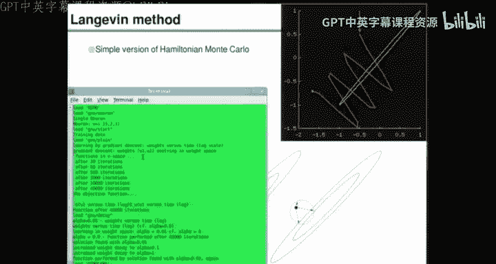

What we will now see is。The lo of our method， starting from this place at the origin。

 where we used to just go downhill。 and here's where we ended up having gone downhill。

 We're going use just the same amount of computer time。

 All we have to do is go downhill and add some noise。

 So it's actually not a huge cost to do this fancy Bayesian inference method。

 You just add some noise。 Add the right amount of noise。

 putting some putting in accepts and rejects to make sure it's all correct。And here's what happens。

 I'm gonna zoom in on the first elbow of the optimization。 So there's the first elbow。

 And during the same amount of computer time， here's where we get to with the launch of our method。

 So it goesbuumbleoobuumled rumble and goes sort of generally downhill。

 but it's adding noise in an interesting way。😊，Pctorially。

 what you can think of happening is we used to go in W space， W 1， W 2。

 and it's actually three dimensional for this toy problem。 We used to go downhill to an optimum。 Now。

 we're viewing that as the minimum of a red。Function， which。Ha some。Strange shape like this。

And we're going downhill and adding noise in such a way as to sample from that entire red distribution。

Okay， here's what happens after 40000 iterations。 We've gone buumbly buumly buly。

 and we've sampled from that entire red distribution。And we can take those sample points， and add up。

The predictions， why for each of those， so we can approximate。This。

 using the standard Monte Carlo idea。By this is approximately one over R。Song。R is one to R。Why。

Of X N plus  one。Using weight。Where these weights W R come from。P。Through。The miracle of Monte Carlo。

Through Hamiltonian。Montic Carlo。Alright， that's the plan。 So we just need to sum up our of them。

And I'll do that right now。So I'm not gonna use all 40000。 I'll just pick。100 or so samples。

 Here's what the weights were doing with time wandering up and down in an auto correlated way。

That's what they would have done if we'd just optimized。

 They would have settled down and stayed still。 So we're doing something more interesting。

 boubbling around， looking at plausible outcomes。And this is what it looks like If we take those hundred samples and I'll now visualize some of them for you in input space。

 So I'm gonna show you 30 of those functions，30 of these functions， why。Of X， N。

For the 30 different values of W。So I'm gonna show you the X dependence now。Alright。

 and the concept is， these are 30 typical plausible ideas about how to explain the data。 off we go。

 Here's one of them。2，3，4，5，6，7。 And as we run through these。

 notice that the classification of B sometimes changes。 Look， it's on the blue side now。

It's still on the blue side。 Now it's on the yellow side。

And the classification of a doesn't change so much。 It's on the yellow side， yellow。

 just a little bit blue， yellow， yellow， yellow， yellow。 So when we add all of these together。

 you can anticipate that the answer for a is not going to be the same as the answer for B anymore。

 whereas when we approximated this integral here in a really stupid way by saying。

Let's approximate this。As。Ineg D W。Delta function at W set to W star。Times y of x。W。

That's a really stupid approximation that says， let's replace the whole distribution by a spike at the optimum。

When we did that， A got the same answer as B。So now let's do it right。And when you do it right。

 given the assumptions we've just made。You get not this。

 which is the answer with the optimized parameters， but this。And you might say， I prefer that。

 in which case you might like viewing learning as inference。Okay， so that was one method。

Another method is to say， I don't want to do Monte Carlo。

 I want to use something a bit more deterministic。So you could say， I'm going to approximate this。By。

Inegral D W。A nice distribution， Q。Of W given data。Or rather given theta。Times y。So， you could say。

I can't cope with this Monte Carlo integration approach。 But if Q had some simple form， for example。

 a normal distribution。Then maybe I could come compute this fairly quickly and simply。

So the approach that I'll show you now says， let's use theplace's method。

To come up with a normal approximation， and then we'll plop it into that formula and do the last step numerically。

 which can be done very easily。So， lights down again。

Just show you these a few more times'cause you get a nice sort of。Ilusion of nonpar this。Okay， this。

 here's a few more la of arm pictures before we， we do the Laplace。 This shows。

 in contrast to the objective function that went down when we minimized it under the La arm method。

 it goes down and all over the place because we're not asking the optimizer to optimize it anymore。

 We didn't actually want to optimize it because we yeah， we're not interested in the best parameters。

 We're actually interested in what plausible settings of the parameters are。😊，Okay。嗯。So what's next。

 Laplace's method。 Here is the Gaussian approximation。It， it's as a function of W 1， W 2 and W 3。

 which you can't see the three weights or。And it's a Gaussian distribution that I've projected down onto this W 1 W 2 space for this particular figure here。

And when you。Integrate out the weights and then compute the numerical integral that you're left with。

 You can notice that the Gaussian approximation isn't necessarily a very good one instantly。

 because that's the yellow samples from the posterior with the lo of our method。

 And that doesn't look at all like samples from the green Gaussian。

 So it's not a very good approximation。 But nevertheless， it's better than not bothering at all。

 And here was the predictions with the optimized parameters。

 Here's the predictions we got from the lo of our method。

 And here's what you get from the Gaussian approximation。

 So it's got the same sort of bananaary shape。 But in numerical detail。 It's a bit different。😊，Okay。

 I think that's the end of the learning as inference for the single neuron。

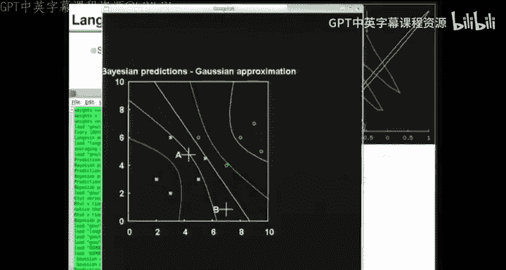

We can now go through the same process for。The feed For network as well。 So let's go back。2。Shop。

Okay。

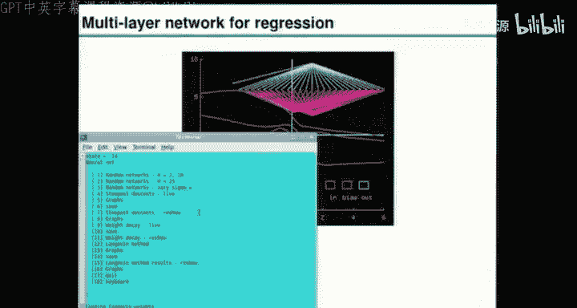

So a moment ago， we were， I hope， dissatisfied because the green line went perfectly through all the red points。

 which is what we had to ask it to do。 And now we're gonna say， alright， we don't like that。

 Let's use the long round method to sample from the posterior。

 So we give exactly the same interpretation， the two terms。

 the data term and the weight terms are the likelihood on logtail and the prior of a Bayesian distribution and we use the longvan method in just the same way。

 So instead of computing the gradient going downhill。 You compute the gradient。

 go downhill and add some noise。 and。😊，That means that the first few steps look just the same as before。

 But now you gobu instead of just settling down and going to a boring optimum and you can pick from those 30000 iterations。

 A few representative samples。 For example， a dozen is probably enough for many problems and those dozen samples can be used to predict things like what's your mean。

 What's your variance and so forth。 So I can extract from these 12 samples which show 12 credible hypotheses of what the underlying function is assuming that it was made by a sum of hyperbolic tangents。

That's 12 hypotheses， and。Here is the mean and standard deviation that you get from those 12 samples。

 Notice the standard deviation is small where you've got data。 It's small over here。

 and it gets wider when you start extrapolating。 and it's also wider when you interpolating over here。

So that's， again， showing the benefit of using a Bayesian view of this sort of learning process。

 And there are many other benefits that I won't go into now。 For example。

 you can get automatic complexity control。 The values of Alpha 1， Alpha 2。

 Al 3 become increasingly important， the more dimensions you' you're working in。

And you can use Bayesian methods to automatically infer what should Alpha 1， Al 2 and Alpha 3 be。

 given the data that I've got。 so you can get rid of that headache as well with the Bayesian approach。

Right， is there any more in that？ Here's a graph showing what happened to the objective function。

 and that is that。

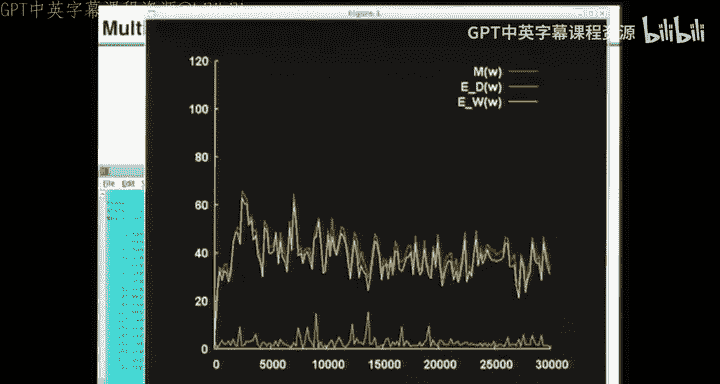

Okay， so I've shown you the。Interpretation of learning as inference。

 And I want to wrap up now by just telling you a few applications of these sort of feed forward neural network methods。

 So these are all quite old now because I wrote the slides while ago。

 and they were some interesting examples at the time。

 And there are more have come in in the intervening years。😊。

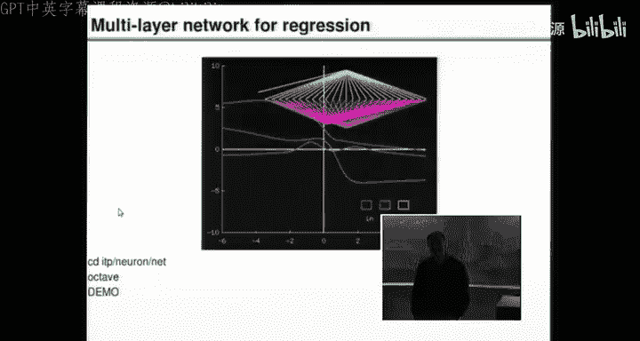

，Very earliest application that I came across of using feed for neural networks to solve interesting problems was the task of getting a neural network to read aloud in quotes。

 The way that worked was the input represented 7 successive letters in a piece of text。

 The hidden units got to see all seven letters， do some nonlinear stuff and spit out an output。

 which was not just one number， but rather a multidimensional representation of a phoneme。

 So there was a binary encoding of the input and a binary encoding of phonemes and the training algorithm said。

 okay， let's take a load of text and correct pronunciations and see if we can learn and generalize。

 So that was an early success of neural networks because it didn't work too badly。

Another very significant success， which I think still has not really been significantly beaten。

Is the use of multilayer food for networks to do genuine handwriting recognition。

 This was done by Yan Lacoun and colleagues at AT and T。

And here's an example of an input to the network， which is a 3 and a4 with some scribbles on it。

 And it's got zillions of hidden units。 And then the output pops out at the top。

 And it says there's a3 and a 4。 And it's very impressive thing。 I。

 I was meaning to get in my browser， a web page showing you。A demonstration of this thing。 You can。

 you can hunt for it， hunt for lunette on the Internet and see the range of things that it could correctly classify。

Another example that I was involved in was the modeling of weld toughness。

 weld toughness is a function of cookery。Essential。

 you cook the weld by putting in various impurities and picking and kneeling temperatures and so forth。

 and out pops a weld with a whole range of properties。 It has a toughness。

 It has a strength yield yield strength and ultimate tensile strength and so forth。

 And if you're going to use a weld in a particular component。 For example， these things on the floor。

 power station components。 and they need to be weded together。

You want the weld to have correct properties。 And there are many ways of trying to model weld properties like toughness。

 But if it's a really complicated thing and toughness is。

 maybe it's a good idea just to get data and train a neural network on it。

 and that's what Harry Boishia and I did。 And this is a real photo of boxes of welding。

 This is a photo of the real thing that was made with the help of the neural network。

 these components are about to be welded together with the stuff that was designed using the neural network。

 And here's the man whose job it is to do the welding。

 He's just having a practice before he actually welds the real components。

 So this is used for real at Siemmenens。 And it's estimated that the neural network approach save significant resources of compared with the alternative。

 which would be to make a weld to test it and then make another weld and test it and keep on changing the cookery by by hand。

😊，So that's a success。 And we've written probably two dozen papers on modeling various properties of welds and other types of metal。

Another example that I got excited about at the time was a nature paper by Roger Angel。

 which described how you could focus multiple mirror telescopes using neural networks。

 The input to the neural network was the slightly fuzzy， slightly out of focus image coming from the。

 the multiple mirror telescope。 And the output is the action that you should apply right now to your telescope to。

 to clean up the， the the fuzziness and non focusedcusness of the multiple mirror image is very ill pose and tricky problem to solve by other methods。

 But neural networks were able to， do a grand job。😊。

So we've talked through the probabilistic interpretation of learning。 And you might say， oh。

 so all these neural networks， it's just high dimensional curve fitting， isn't it。

 And that is exactly correct for the ones I've just been telling you about these multileceptron networks。

That our feed forward networks really are just doing high dimensional curve fitting。

 And if it's expedient to use a neural network fine。

 But if you have other methods of doing high dimensional curve fitting that you are content with and don don't get on your nerves。

 then you could use those as well。 And a concrete example of another way of doing high dimensional curve fitting。

 is Gaussian processes， which are described in the book。 So you don't have to use neural networks。

 You could just use a Gaussian process， which is a high dimensional curve fitting model。

Does the brain only do high dimensional curve fitting？ Well， I suspect the answer is no。

 we don't know how brains work， but I do think that brains are more exciting things。

 Here's the thing your brain can do。 I don't know if you've seen this picture before。

 It's a picture of an animal and。😊，Can you see what it is， Hands up， if you can recognize it。 Okay。

 so it's a dog， and it's facing that way。 And it's it's sort of facing away from us。It's a dalmatian。

And。That's its ear。Can everyone see it now， hands up， you can see it。Okay， so。I。

 I find it hard to imagine that this is just a feed forward multidimensional curve fittingtting exercise。

 And when I look at an image like this， I find it sort of exciting and it feels like my brain is coming up with hypotheses and is an active participant maybe coming up with explanations for the world and so forth。

 So I think brains aren't just feed forward neural networks and there's anatomical evidence that they aren't just feed forward neural networks as well。

 So in the next lecture， we'll come back to for me， one of the most exciting questions。

 which is how can we make content addressable memories and describe a very simple neural network that can solve a content addressable memory challenge。

 Here is the challenge。 The challenge is to make a dynamical system。

 It should be a system with 25 degrees of freedom，25 variables that change with time。😊。

The dynamical system can have 300 tunable parameters。And those parameters have 4 bits of precision。

The challenge is。You are going to be given some desired memories。

 and those memories should be fixed points of the dynamics。 So the memories might look like this。

 Here are 3，25 dimensional patterns。 They look like a D A J N to C。😊。

And you've got to come up with a way of instantly saying， okay。

 I will set the 300 parameters in the following way。

 and I will now have fixed points at those so that if you set off from a noisy version of one of those desired memories like this。

 which is actually a noisy D， the dynamics of your dynamical system should take you to this。

 which is a clean up D， If I give you this， It's a noisy C， you should end up with this。

 And if I give you this， which is a noisy DJ。 you should end up with this。😊。

That's the challenge to come up with a way of making a dynamical system and setting its parameters so that for any choice or almost any choice of the fixed points。

You can set the parameters and create those fixed points so that it will do content addressable memory。

 Itll do cleaning up of a noisy memory。😊，Moreover。Your dynamical system should have the following properties。

 It should be possible if I give you an extra memory。 I say， oh， here's a fourth 1 I just thought of。

 you should be able to make just a little tweak to the parameters so that the three memories that were already there are still there。

 Just like I tell you something new and you don't forget everything that you already learn。

 The old memories should be preserved。 but you should learn the new memory， too。

 You should have a new fixed point。 So just a little tweak to the parameters should magically create a new fixed point。

 And I want to be able to drink alcohol and still work。

 So your dynamical system should be robust to corrupting more than half of the parameters。

 and it should still work and still have fixed points at those three places。 Okay。

 that's the challenge。 And I encourage you to try and solve this challenge before the next lecture。

 And in the next lecture。 I'll show you a solution to this problem。😊。

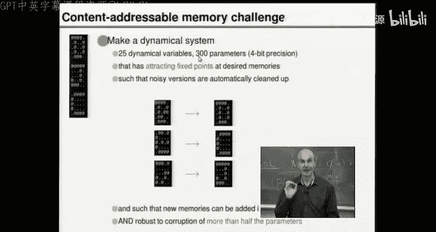

Thanks for listening。

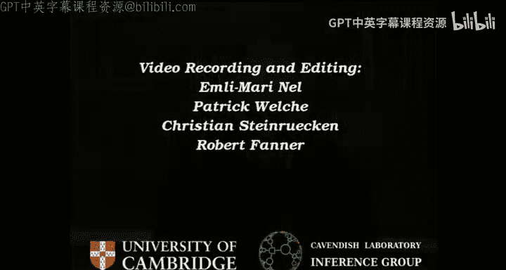

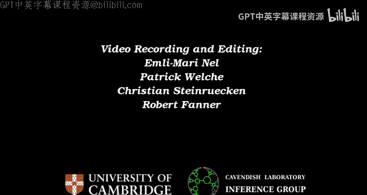