# 信息论、模式识别和神经网络The Information Theory Pattern Recognition and Neural Networks 2014 - P16：-16-Lecture 16_ Data Modelling With Neural Networks (II)_ Content-Addressable Me - GPT中英字幕课程资源 - BV1er421M7Br

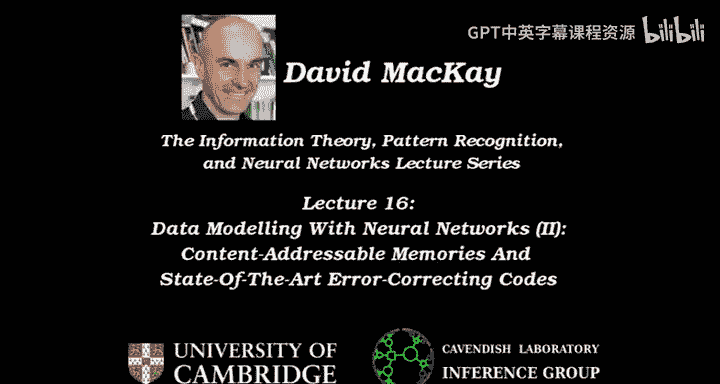

Welcome to Leture 16。 This is the final lecture of this course。😊，Today。

 we're going to carry on talking about neural networks。

 and we're going to discuss the content addressable memory challenge that I set in the last lecture。

And as a little finale will have a little chat about how that idea of how we solve the content addressable memory challenge。

 how that relates to state of the art error correcting codes that were discovered in the late 90s。

So we'll come full， full circle back to the topic of the original first lecture when we talked about。

Air correcting codes for noisy channels。So I've highlighted in red here the two things we're doing today。

And。I'd like to just remind you what the content addressable memory challenge is。

 This is gonna be the main thing we'll look at today。

The challenge is to understand how un earth brains do content addressable memory。

 How do we fill in the gaps， How do we recognize things based on their contents。

 even when some of the cues are noisy and a precise way of saying this challenge is。

Try and make a model of it。 Make a dynamical system。That can do content addressable memory， and。

I'll show you today a solution to this problem。 The task is to have a dynamical system with 25 variables。

 Each memory is a 25 B。State， and the dynamical system should have 25 variables that change in such a way that you've got fixed points of the dynamics at these。

 say， three desired memories， whatever memories you're， you're given。

 you should be able to make fixed points at those memories。

And the dynamical system should have parameters that determine the dynamics。

 And it's by adjusting those， say，300 parameters that you should be able to make the fixed points at the right places。

And those fixed points should be attracting fixed points。

 So if you're near to one of the desired memories， the dynamics should take you to that memory。

So if you've added some noise to a memory， the noise gets cleaned up。

That in itself would already be an exciting thing to solve。 And it would look like this。 if you flip。

 say 3 Bs of a D， then you'd like the dynamics of the dynamical system to take you back to a cleaned up D。

 A noisy C should turn in， be turned into a C and this thing。😊，Is an noisy J。

 and it should be turned into that。 That's this， this sort of goal。Of this problem。

And that sounds already hard enough。 An additional constraint is when your brain encounters a new memory。

 you don't go out and buy some extra neurons from Dixon's。

You just carry on using the same brain and make some minor changes to it。 We don't know how。

 but by those instantaneous changes that can be made very rapidly。

 possibly with a little bit of sleep required， you get your new memories added to the existing hardware。

And in addition to being able to add extra memories incrementally with small changes。

 we would like to have the property that your dynamical system can go out for a drink and suffer brain damage and still carry on working pretty well。

 So we'd like a dynamical system where。A nasty person can come along and randomly delete half of the parameters that you've learned。

 and the dynamic should still actually work。 It should still have attracting fixed points that should still be roughly at the original memories。

Okay， so that's what we're going to do。 And I just want to emphasize how different this is from the sort of standard solution。

 Well， is there a standard solution to contentable memory。 Let。

 let's just invent an orthodox approach， Write it out just to emphasize how different our solution is going to be。

So what would an orthodox approach be， Well， you could have a piece of。Memory。That it contains。

The different memoriess。They have a little label saying here's memory number one， number two。

 and number three。And then your dynamical system could take a state。Let's call it X。

And we could create little comparators。Which。Measure how far。X， the state is from memoryory1。So。

 you have a sort of。Subtraction operation that。Compares those bits or a distance operation。

 And you have another piece of hardware that does a distance operation。Comparing。

The second memory to X。And you have another piece of hardware。That compares。The third memory to X。

And then you could have a piece of hardware that measures。How big those differences are。

And we're interested in which one of these is the closest。

And so we compute all of these differences these distances， sorry。And then， we。Compare。And。

Find the minimum。Of these。So we need some sort of。Argmin machine。

Whose output is my identification of which of those three。Here's the winner。

And let's say that X is actually closest to the J in this case。 Then it could。

 you could imagine a little light coming on here that says this one's the closest。 And then finally。

 we need a pi of hardware that responds to that light and says， okay， let's overrite。😊，X。By。

Copying in the contents of。Jy。And to。X， if I'm the winner and the similar lines from this guy saying。

 if I'm the winner， then I get to overrite X with。This and so forth。 Are you with me。

 the sort of logic of what you could do。 You could write a computer program that does this as well。

 that could have a loop， And it could say4 memory number runs from one to M。 the number of memories。

😊，Do a comparison。 Keep a list of how far away we are。

 then go and figure out which was the closest one。 then go back。

 look up that memory and overwrite it。 Okay， so you could write a program or you could have a piece of hardware with all these different bits。

 So you'd have a memory area。😊，You'd have a。Distance。Vectctor。Or a difference。

 a difference vector computation area。These would be your distances。And so forth。 Okay。

 does that have any of the attributes we just wanted， Well， if you want to add an extra memory。

 you have to get some more hardware。And you have to add more comparison。

Hardware that measures how far away things are。 You have to add this。

 You have to upgrade your argument so that now it takes four things to see which is the。

 the smallest。 And so you have to do a whole load of rewiring to。

 to augment this and add in another memory。 And if someone comes along and says。

 here are some of your adjustable parameters。 I'm going to whoops accidentally spt a few of these。

 Then this whole dynamical system。 is going to compute how far。X is from messed upy。

 And if messed up C is the winner， then you'll end up recalling messed up C。

 So it has the property that if you mess any of this， these parameters up。

 you will have messed up the recall。 So it doesn't have robustness to the slightest bit of damage。

 And if you come in and sort tinker with the subtraction operation hardware Similarlyly。

 you will be in trouble。So this would be an orthodox way of saying， which is the closest memory。

 Okay， And now let's write that one into X。And it's， it is a content addressable memory。

 but it doesn't have any of the robustness we want， nor the extensibility。

I described it as a one step。Orthodox solution here， where you just see which are we closest to。

 then go all the way。 Another way of making it a bit more sort of dynamic and gradual would be to say。

 if you are the winner， then you get to tug X a little bit towards you。😊。

And so it could X could step a little bit in the direction of the winning one。

 And then as this thing iterates and settles， it would end up being tugged continuously towards whichever one it was closest to in the first place。

 So you could make it a little bit more sort of。Naturalistic， but still useless for our purposes。

 It doesn't have any of the properties we were after。

Something I'd like you to notice about this orthodox approach to contentreable recall is what I've just drawn on the board here is exactly the same as a perfect root force decoder for an error correcting code whose code words are the lists of words in here。

 assuming that this distance measurement that you end up with here is the correct distance measurement for the log likelihood。

😊，For your channel model。So if， if this is measuring how many bits are flipped between D and X。

 then this would be the correct decoder assuming we're dealing with a binary symmetric channel。

So there's a connection brewing here that this， this may remind you a bit of decoding error correcting codes。

Deding an error correcting code is indeed sort of an example of content addressable memory。

 though when we made error correcting codes， we didn't think of the code words as being memories that we wanted to recall。

Okay， so that's how you would do it orthodoxically。

 And I gave you a homework challenge to come up with a solution。

 And I will now show you a solution that was invented by John Hoopfield to this problem， so。

Hot field solution is to use a neural network， which is a feedback network。

 That means it's built out of neurons。

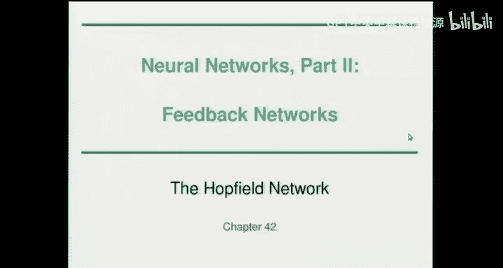

Just like the neurons we had before。Neuronss that。Add up weighted inputs， and send out outputs。

But the wiring of。The Ho field network。We'll have connections。Both ways。Between。All pairs of neurons。

So every neurons's output gets broadcast to every other。Youre on。

 Another way of drawing this would be to say， here's all the outputs。Of all the neurons。

And they all come around。A little racetrack like this。日不出去。うう。

And then this is where they gather their inputs，1，2。3。For。1，2。Rui。For and so forth。

And these places here，1，2，3， for these 16 places here are where the weights exist。

Which you can think of if I've got eye neurons。Then there's an I times I。Weight matrix。

 connecting them。So let's go through how a hot field network works。 I've， in fact。

 told you everything you need to know。 It's made of neurons。 They're wired up and。

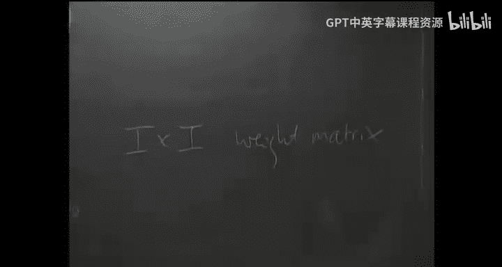

So here are the relevant equations。The architecture of the network is， is a feedback network。

A rule for the standard hot field network is the weights are actually symmetric。

 So the weight between neuron 1。And neuron 3 is actually equal to the weight going from neuron 3 to neuron1。

The activity rule is each of the neurons computes its activation。

 AI is some of a W I J X J plus theta I。 So every neuron can have a little bias dangling of it as well called theta for here theta 1。

 The to 2。😊，83。M'm3 to4。And then having computed that activation。

 you've got a choice of two ways of doing it。 One is that X， I， the output。Which comes along here。

 X1， x2。three， next four。Xi is the hyperbolic congenent of your activation。Which looks like that。

Or another option is the extreme， if you like low temperature limit of the hyperbolic tandon function。

 where you just have a step。And that's called the binary hot field network。

 where each neuron just sets itself to up or down， depending whether， whether it's local field。

 itss activation is positive or negative。Okay， and here's John Hotfield。

 who now works at Princeton in his retirement。Okay。That's the Hotfield network。

 I haven't actually told you how to do content addressable memory。

 to do content content addressable memory， We need a rule for setting all of these weights。

 So in the example problem。😊，With 25 dimensional binary patterns to learn。

 the number of neurons'll have is 25。The number of weights is 25。Times 24。

 There's no self connections in this network。And they're symmetric。 So it's 25 times 24 over 2。

Is the。Number parameters。Parameter， and those are called WIJ。

And what we need is a rule for setting them。And the extremely simple rule。

 there are other ways of doing this， but the simplest one to go with in order to solve this contentable memory challenge is to say。

 let's set the weights， which are roughly 300 in number。In this way， using a heb rule。

 So the He rule says。You。Set the connection between I and J by seeing how correlated X， I and X。

 J are with each other in all of the patterns that you want to learn。 So N is the number。Of patterns。

To learn。Which in my DJ C example would be 3， or once you add an M。And N will have become4。

This is called the Heral because it's a very simple idea from biology named after a cha called Donald Hebb。

 The idea is， if you've got a pair of neurons and they're responding to something。

 And if there's a connection between them。Then maybe that connection strengthens in proportion to how correlated the activities of the neurons are。

 So if this is a neuron that tends to respond to yellow coloured things being in the scene。

 And if this is a neuron that responds to。The smell of banana。And if those two things。

Happen in a correlated way in the world。 So these neurons fire in a correlated way。

 Then the synapse between them will get strengthened。Which then， means that。If in the world。

 a yellow thing comes along， you may actually start smelling the smell of banana。

 even though there isn't a banana smell there。 That's the idea of heavy and learning。

And just to emphasize those sort of associations。 That's the sort of thing that content arere memory is all about。

 And there are many other examples of strong associative mechanisms in brains and in the brains of animals。

1 I'd like to just mention as an aside， is the amazing Mugrk effect。

 which is an illusion where you see a video of someone speaking some phonemes like Barpar Darar。😊。

And the audio track has their voice saying some phonemes。 But actually sneakily。

 they've switched up what the video is doing and what the soundtrack is doing。

 And if you ignore the video， you hear the phonemes perfectly clearly。

 But when you see the visual image of them saying different phonemes， you get a complete override。

 you， you don't hear the correct phoneme anymore because of this strong association of the visual image of them saying par or bar or far when you see that image。

 it it can actually override what your ears are telling your brain。 It's an amazing phenomenon。😊。

Okay， so we have got ourselves a learning rule。 It's called the He rule。

 and we're now ready to go ahead and demonstrate。

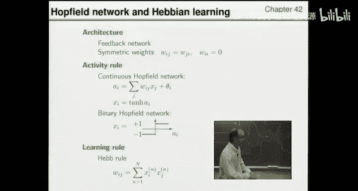

，Hot field network。So。What I'm going to do。Is train up a hot field network with it's 25 times 24 over two weights using these three patterns。

 DJ C。

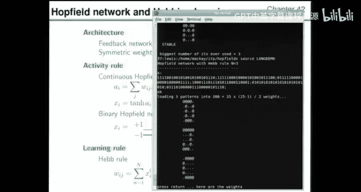

And here are the weights that you get when you run the He rule。

 Let's just hop back and explain where these weights came from。So， I'll use the mouse showinging。

Here's the first weight。 It's the weight between neurons 1 and 2， and it's equal to 1。 Well。

 why is that。 Here's neuron 1。 Here's neuron 2。Or in this pattern，1 and 2， Or in this one，1 and 2。

Now， you take a he rule。 It says， what's the correlation。

 We're calling each of these patterns plus or -1， depending whether it's a sp or a dot。

So two splops give you a plus one and two dots gives you a plus one when you run your He rule and a splo and a dot give you a-1。

 So we get plus1 when we work out x 1 times x 2 in this case。

 that So our He rule first looks at that pattern and you get a plus one for that weight。

 Then you look at this pattern and you get another plus 1。 So the weight goes up to2。

 and then you look at the third pattern and you get-1。 because they're anti correlated。

 So it goes back down to1。 And that's why this weight is one。Now。

 let's look at the weight between neurons 2 and 3。 They are in the same state here。 Slops， slop。

 slops， slop， Okay， and all of those。 And here's row 2， column 3 or row 3， column 2， if you like。

 And we've got plus 3。 So in every case， youve got a plus 1 because they're in the same state of each other。

 neurons 3 and 4。 That's this three here。 again， if you look at the patterns， they're all the same。

 And。So logically， neurons 2 and 4 have to be the same in all states as well。

 And you've got another plus three there。 Okay， so I've made all the weights just by running through all the patterns。

 looking at every pair of neurons and either adding one or subtracting one as you look at a pattern。

 Notice this rule is incremental。 You can learn the first two patterns if you want。

 And then having learn them， you can go through and add the third pattern。

 and that will just involve taking all the weights and shoving some of them up by one and some of them down by one。

😊。

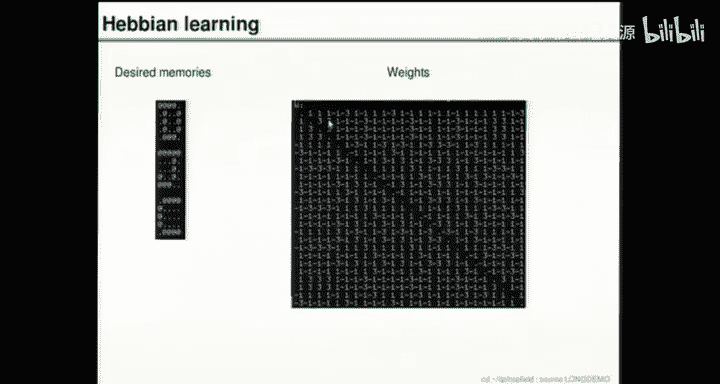

Alright。Now， off we go， we're going to run the dynamics。

 And I'm just going to run the binary hot field network that where each neuron is either up or down and。

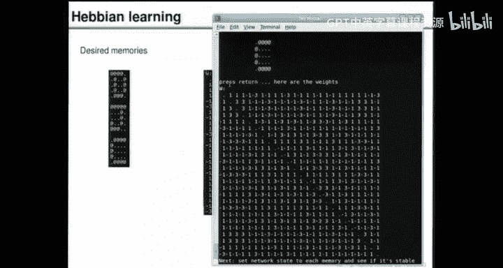

On or off。And I'll run through the neurons in sequence。

 So the dynamics I told you on the the earlier slide when we said， what's the hot field network do。

 I said the activity rule is you compute your activation， then you set X I using a step function。

 And I didn't tell you how you do that precisely。 I'm actually going to run through them one at a time in sequence updating them。

 And then I'll go back to the top， and I'll run through a second time。

 andll run through a third time， and I get bored。 Allright。😊。

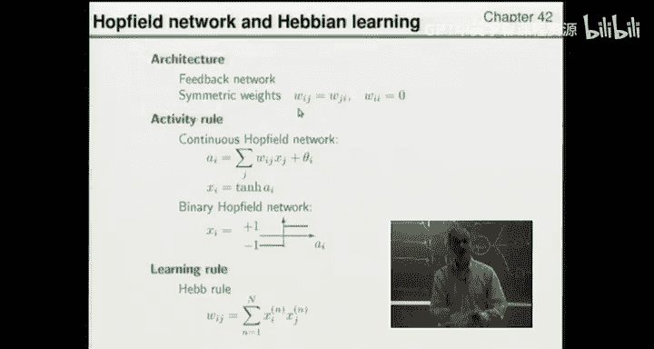

So that's the particular way of implementing the dynamics。

 You could imagine also synchronously updating all of them， but I'm， I'm not doing that。

 It wouldn't make much difference， in fact。Okay， so let's start by actually initiating the dynamical system at one of the desired memories。

 So let's wipe the silly old， Ordox way of doing things。😊，And。

Make ourselves a little diagram to keep track。Of what happens。So once we've learned the memories。

 we completely throw away DJ and C。 There's no such thing in there。

 We've just got the weights connecting the neurons to each other。

 And what I'm going to do is make a little diagram。😊，Where we see if we set off。The network。

In the state。D， J and C。 Do we actually have a fixed point at all？

 So you can think of the state space of this dynamical system as。Having a D location in it。

A J location and a C location。 And what we're going to do is test。 Okay。

 if I set off this dynamic system at a D， where does it go。

 Because you could easily imagine the dynamics could take it somewhere else。

 It might sort of wander off and go， Who knows where。 So we're gonna find out what happens。

 And here's what happened。😊，After one iteration， which means every neuron got the chance to update itself in accordance with rules。

 Nothing happened。 So it is a stable point。 That doesn't say it's an attracting fixed point。

 but it is a fixed point， so。First column here is going to say no noise。

AndI'm gonna put a little tick that says the D was a fixed point。 That's pretty cool。😊，Next。

 we set it off in the J。We find that the J is a fixed point as well。 Then we go for the C。

 and the C is also a fixed point。 So we get tick tick tick。😊。

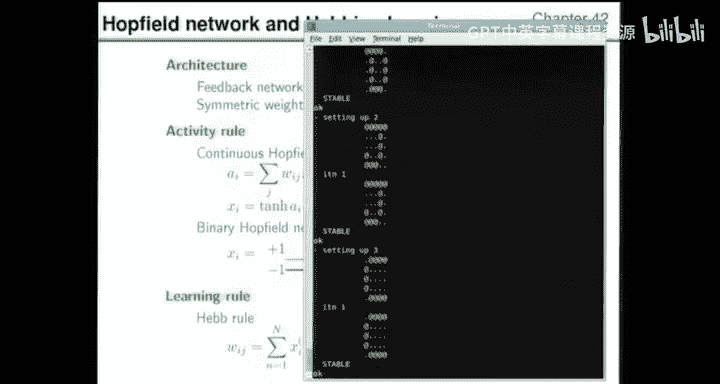

If there's no noise， there's a fixed point。Now， the content addressable memory challenge says we want it to be an attracting fixed point。

 If we flip a few bits， we want the dynamics to take us back to those fixed points。

 So let's start doing that。 We're now going to flip a single bit of the D。

 and then we run the dynamics。 And all the neurons get a chance to change themselves。

 And what you find is the one that would flipped。 un fliplips itself。 and we get back to the D。

 and it's stable。😊。

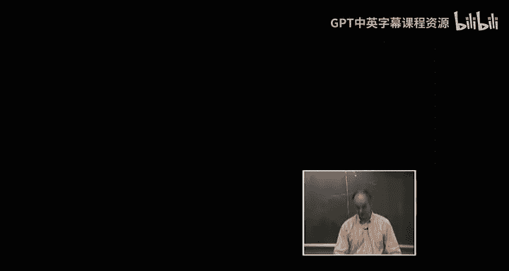

Okay， so this is。Approximately 4%。Noise， because we're flipping warm。Out of。25。So the 4% nice level。

 the D came to O， J。C。Right， so single flips have all been。Discovered， corrected。

 And we have a working， context memory that seems on the basis of this tiny amount of evidence。

 I'm not exhaustively looking at all single flips， but it has corrected all those single flips next。

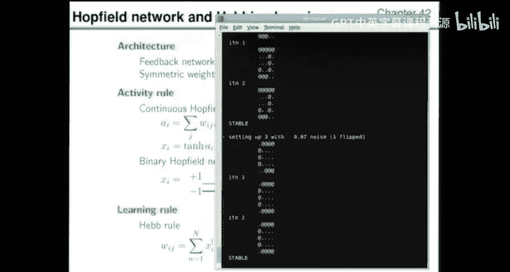

Let's flip some more single bits， D， J， C， all of those got corrected。 And that third one。

 it actually， there were two flips。 both neurons 1 and 2 got flipped。

 And then the dynamics of clean that up。 So it can correct two flips as well。 So we're up to。

10% also。And it's still working。There's a J with three flips。 Okay， so we're up to 13%。

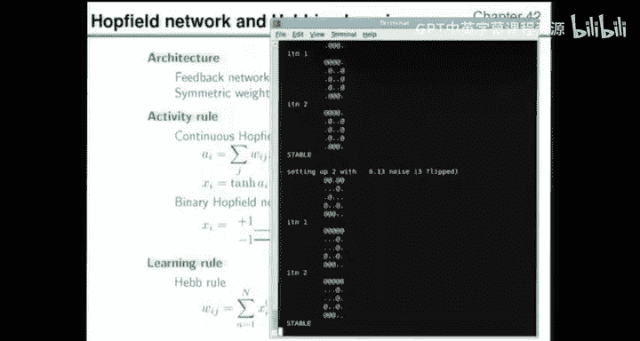

And。Things are still working。

There's a C with three flips。And that got cleaned up。Second。Okay。

So the way my software works is it always rotates through them。 DJ C， DJ， C， DJ， C。

 and tests and flips。 So when it says setting up 3 with 0。14 noise， it's picking memory number 3。

 and it makes three flips。 And so you can check that it was actually three flips away。😊。

Now your question is a very good question， because I'm just gonna keep on cranking up the noise level until it stops working。

 And you would very much expect it not to work if we're flipping， say，50% of the bits。

 because if you take any pattern and flip 50% of the bits， it's just pure random noise。 Yeah。

 so at this point， we definitely expect。😊，DJ and C all not to be recalled。

 It would be completely bizarre if it worked there。 So it's gonna stop working。

But I'm just gonna rotate through them， adding more and more noise。 Okay。

 so that starting pattern there is， you， for human， maybe it looks a little bit difficult。 You know。

 I that A C， Yes， you think about it。 You said， yeah， okay， it's a C。

Here's a noisy D with three flips， corrected。A J。And I see， now we're flipping 4。 So up to 18%。

And we're still getting ticks。 What was that one， That was a C corrected， A D with four flips。A J。

And I see。 Okay， so。Full house there。 And the noise level is up to 22%。Flipping 5 bits。第一。

J is taking more iterations sometime to， to do the cleanup。So that's apparently a noisy J。

 though it's quite hard for us to tell now。 So 6 Bs have been flipped up to 24%。And that's a noisy J。

 which got cleaned up。That's a noisy C。But you might struggle to recognize it， but。

Is getting the right answer， Okay， so。Pretty good， hey。What's next， That's a noisy D，6 flips。

That's a noisy J。Absolent， as you see。I think you might struggle to look at that and say it's a noisy C。

 but it's still working。 So're up to 29% nice。And that was a seat。Still working。Noisy D with 7 flips。

Noisy J。And there was a noisy sea。And what happened， it got turned into a J。 Allright。

 And that was with 33% noise。So that was our first failure in this little sequence of experiments。

 So tick。Okay， so something bad has started happening。 but we could just double check。 Okay。

 when we made that noisy C， we added a load of noise。😊，The number of flips was 8 flips。

And we could just do a quick computation now。 How far away was that initial state that we got ourselves to here。

From。The J， because， if， in fact， it's equally close to the J。

 then we shouldn't really complain about this dynamical system giving us a J。 So let's just check。

 So I'll count across here。So we're looking at comparing these two with each other。 So one flip。

2 flips，3，4。5。6。7。eight。9。So it's 9 flips away。From the J。And 8 flips away from the sea。

 So you could complain。 but， hey， the difference was only one flip between how far it was from the J and from the sea。

 So it， it's almost reasonable if， if all you wanted was a basin of attraction around here。

 And you've got a basin of attraction around here。 and this one just happens to be a little bit bigger。

You can hardly complain。Okay， let's keep going。 let's add more noise。 eventually。

 because we'll just be adding loads of noise。 What we're doing is not。

Adding a bit of noise and seeing if we get home， we're just picking completely random starting points and saying what happens now to this dynamical system。

 And there's quite a lot of behaviors that we haven't yet seen。 So let's keep going。

 This is a noisy D。 And it gave us a C。 Allright， so that's another failure。😊，But again。

 it's probably justifiable。This is a noisy J， and it gives us a J， okay。

So we're still getting some successes。Here's a noisy C， and it gave it a C， Okay， so。Still。

 some successes。Noisy D。Success。Noisy J。啊，哈。What's happened there。What's that。

The dynamics have gone somewhere Every other time we ran the dynamics， we ended up in a D A J or a C。

 And now we've run the dynamics。 and we've got into what do you want to call that。

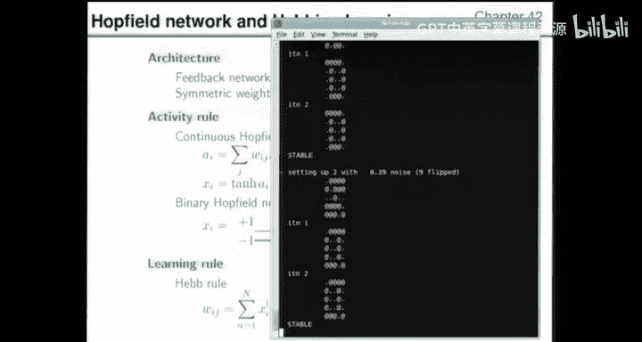

Q， alright， so it's discovered a letter Q。 So we added some noise to A J。

 we've got ourselves to a place where we then went downhill。 I say downhill。

 and we haven't proven that there's any hill at all。 We've gone into a。

 We've got through some dynamics。 and we've ended up in a stable state。

 which has been named Q by the audience。😊，Allright， and we can just make a note of what a Q。

Means it's sort of this。嗯哼哼哼。Looks a bit like that。 Yeah， sort of Dish and Jsh at the same time。

Though it's not actually a D。 It's that left hand side isn't the way D look。 So， yeah。

 I think Q is a good name。

Right， so that， that was a new， exciting thing。 the。

 the dynamical system we've made has got fixed points that are attracting fixed points at D and JN C。

 But it's got some other fixed points as well， which of just who， who knows why they're there。

 but they're there。😊，Here's a noisy， see。What's happened now？We flipped 10 B of a C。

 and then we ran the dynamics。 And what state are we in now。Somewhere between a DN C。

 remember what D's looked like。Ds look like that。 So how is this thing related to a D。It's anti D。

 Okay， so over here in state space is anti D where everything is perfectly flipped。😊。

And here's antiJ。 And here's anti C。So states exist called anti D， antiJ and NC。

 And it looks like anti D is a stable， attracting fixed point that we've somehow got into by flipping a C。

 So we did some flips。And we've gone downhill。 Or sorry， we've run the dynamics。

 and we've ended up in anti D。And again， we could check， you know， we're flipping 10 B now。

 which is almost 50%。 So we're definitely just exploring random starting pointss。 Now。

 It's completely irrelevant that we started from C。 We're just saying。😊。

What other fixed points does this system have， And does it only end up in fixed points or could it do chaotic things。

 Okay， so it goes totally internally， and it's in anti D。And when you reflect on it。

 it's actually quite obvious that。The learning rule that we had。

Is completely insensitive to flipping all elements of X。 So if you。Told the learning rule。

 please learn N D， J and C。 Instead， it would learn exactly the same weights because you just have a -1 times -1。

 which is plus 1。All right。So， the learning rule。Is completely agnostic。 and the dynamic。

 dynamics are agongnostic to that complete change of sign of a single pattern。

 And that means if there is a fixed point at D， there must be a fixed point at anti D as well。 Okay。

 so it's actually not a surprise in retrospect that there is this fixed point here。

 Let's add some more noise。 What's that。And T C， alright。Let's add some noise to J。 and we get J。

 Okay， so that's we're still getting even here， we could call this a sort of success。

 But we're just exploring random conditions。 Okay， theres a random initial condition。

11 flips over sea。 And it gives us what's that。😊，Say。It's part of a J， but it's not a J。

 So it's sort of yeah， a strange J with is missing its bottom corner。 It's missing the upright。

 So we need a name for that。 Should we call it AlF or something like that。

 So we've discovered another。Point， Ill， I'll draw it。There it is， chip chip。

So there's a thing that looks like that。 And that's a fixed point， too。So we've got a queue。

 which was an unintended fixed point。That attracts。

 And we have an attracting fixed point at this Ly thing。Okay， and there it is again， okay。

There's a C。And there's a J。 So J seems very good at attracting the dynamics。

 So J has a strong basin。 Here's antiJ。 So antiJ obviously， must， by symmetry。

 have equally as big a basin of attraction as J has got。 So these are both got huge basins that。😊。

Get lots of random initial conditions sucking into them。Okay。So what have we learned？

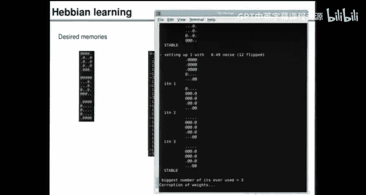

It worked。 It's a content addressable memory， and it's got some spurious fixed points at places we didn't intend。

 but that doesn't really matter。😊，What I'm now going do is part 2 of the challenge was。

 will this thing still work when you take it for a drink and damage its neurons。Okay。

 so you have a drink。 Yes， question。Okay， so the question was， how do you read things out。

 is generating false memories？ Well， it's only generating。

 what do you mean by generating false memory。 If you mean you might accidentally learn some things from your own dynamics that don't exist。

 then the。Second。I never showed it a Q， but it has a fixed point at Q。

 But was that in the rules of how a content addressable memory should work。

 the definition of a content addressable memory is if you show it a noisy version of a memory。

 it should restore to the original memory。 And this does that。😊，There wasn't a rule that said。

If I give you completely random inputs， you should only ever produce a correct memory。

 That wasn't part of the， the job specification。All right。Nevertheless， if。

 if you want to add that for the job specific， we can do that and we can make neural net learning algorithms that will essentially fantasize。

 come up with random ideas and check that their fantasies are still consistent with reality。

 So there is an enormous literature on interesting learning algorithms for neural nets。

 and your your idea that you should make sure you don't have spurious fantasies。

 That's essentially what many of these algorithms are about they involve exposing the brain to reality and then having a dreaming phase when at night you go and dream。

 And then you make sure that the statistics of your dreams are consistent with the statistics of reality。

's that's one of the themes。😊，Okay。So， yeah， the way the learning works is you just expose it to the training examples。

 And you show learn this， learn this， learn this， run the He， but， but， b。

 And then we have a dynamical system。 So you can call these false memories， if you want。

 I don't know。 They're just sp states of a dynamical system。 Yep。

 false memories is also a fair enough name。😊，What we're going to do now is corrupt the weights。

So' going to take the weight matrix that we learned with the Heb rule。

 But then I'm going leap in and destroy some of the weights。 So all of the weights were either。

Plus 1， plus 3，-1 or -3。 But I'm just gonna take。A fraction of those weights at random。

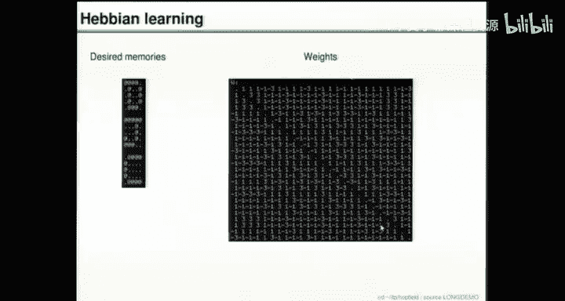

And set them to 0。And then we'll rerun the dynamics。 So here's some randomly corrupted weights。

 The fraction corrupted is。79 out of。300。And now we're going to rerun the whole game that we just played。

 We're gonna say。Is there a fixed point at the letter D， So we put in a D， and we run the dynamics。

 and we find， yes， there's a fixed point。 In fact， what I've done is I've flipped 3 Bs。 So I'm。

 I'm taking。I'm going all the way to here， sort of 13 percentage。And I'm saying。

 is there an attracting fixed point at D， So not only is there fixed point。

 but it is an attracting fixed point。And the。Okay， see。

 the D is okay for this example of flipping 3 Bs。Let's take a J and flip 3 Bs。

 And there's a fixed point at J。Let's take a C flip3 Bs。 And there is a fixed point at C。

So that is weak evidence that there's sort of ticks all over here as well。 But let's not waste time。

 And we could go to higher noise levels and see how big these attracting fixed points are。

 and we could explore and see is there still a spurious one at Q and1 at LF and all that sort of thing as well。

 But I'm not gonna do that。 I'm just gonna corrupt some more weights。

 So now we're gonna destroy more than half。 So1 hundred58。😊。

Of the 300 weights have now been set to 0。And we rerun the dynamics， and we say。

 if I take a D and add some noise， where do I go， And the answer is。To a fixed point。

 that isn't quite exactly the D， but it's only different by 1 B。

 which I think is a pretty good situation， given that we've destroyed more than half of the parameters in the network。

 so。那啊。We're almost right。 So I'll give it a tick with a twiddle that just says1 B is off in this fixed point。

Noisy J。Gets cleaned up。 And that's a day。So that's a success。Noisy C gets turned into。A see。

So we've destroyed more than half the weights， and it's still working。 And if we had time。

 we could explore what's happened to this boundary here of where it stops working。

 So it was somewhere here about。Presumably， there's some boundary。

 And maybe it comes through sort of hereabouts。 And eventually， if I destroy enough weights。

 presumably， the whole thing is gonna stop working down here。 So there's some sort of boundary。

 And we've just got a vague indication that it might look something like that green line。

 Let's destroy some more weights just to check。 Okay， so here we destroy 237。Of the weights。

At random。And the question is， what's happened to the D。The J and the sea。

 which side of the green line have we， we gone。So we put in a noisy D。

 and we get something that is now two flips away from a D。Alright， so。Okay。

 it's not really that great。Put in a noisy J。 And we get mumbo jumbo， rubbish。

So that's not very good。 It's still got a fixed point。 So the dynamics have fixed points。

 but that's not what we wanted。And there's an all you see， which is one flip away。Okay。

 so given that。None of those are being correctly stored。 I think it's fair enough to say the。

 the green line is perhaps somewhere on that that side and。Maybe little something like that。Okay。

 there's a huge literature on Heals for hot film networks。

 If you want to actually know where that boundary goes and clever physicists have got。

Explicit close form solutions for， for this diagram that we've just sketched。Now， what shall we do。

What was the other definition of a content addressable memory。

 You should be able to add some extra memories to it by a small change， a small incremental change。

 And it should still have all the old memories and the new one。 So what we're now going to do is。😊。

Make another diagram。喂。We vary the noise level again。From zero。To say。15%。我摸。

And we just found that DJ and C can be learn。 And now we're going to say， let's add one more memory。

 So we've got N is 4。😊，Or maybe even five， or maybe even 6。But at some point。

We imagine this thing might not work。And what we've established。So far。

Is that this worked out to sort of 29 percentage。系啊。So this was all ticks。Up to here。

 probably maybe not sure we didn't actually look at every single noise pattern。

 but lots of ticks happened up to 29%。 And now we're going to add another。Memory called M。

 So there is the M pattern。And what does that mean we do with the weights。 Well。

 every weight either goes up by one or down by one。

 because you just look at the correlation within the M pattern of the spins with each other。 So。

 for example， this one， which used to be what was it plus  one was the connection between these two。

 Now in the M， you can see there in opposite states。 So it's gone back down to 0。

So that's why that weight has become 0 when it was plus  one。Alright， and this weight。

Has gone up to 4。 That's the weight between 2 and 3。 And they are both in the dot state here。

 So that's why we've got an extra plus one。 and that weight has gone up to 4。

So all the weights have just been tweaked the time a little bit。 The。

 the least significant bit of every weight has just been nudged a little bit up or down。

And that tiny change， we hope， has created a completely new fixed point that didn't exist before。

 You can take， take it from me。 I can prove it if you， if you want。

 the previous dynamical system did not have a fixed point at M。

 And now we make this tiny change to it。And we put in a D， and it's still a fixed point。

 We put in a J。 It's a fixed point。 put in a C。 It's a fixed point。 And you put in an M。

 and it's a fixed point， too。So。We have fixed points。Are they attracting fixed points。

 Let's add a little bit of noise and find out。 So one bit flipped is corrected for the D， the J。

The C and the M。 Okay， so that was alright。1 flip corresponding to 5%。Noise。Alright。Next。

 let's try flipping a bit more。 Here's another one flip。 I'm going a bit more slowly now， cause I。

 I want to be honest with you about when this thing stops working。 So that's one flip corrected。

 A noisy J， A noisy C with one flip。 And that's allll fine， too。😊，Is a noisy M。 And that was fine。

 too。 Okay， so we've had two runs through。All at 5% noise。1 flip。Okay， here's another on D， J， C。

 and M， Okay， those were all。 okay， so it seems pretty good at cleaning up single bit flips。😊。

Noisy D， J， C and M， all。 okay， so we had four run throughs。All with single flips。Alright。

 now we're flipping 2。 So the noise level got up to 8%。And the D is okay。Noisy D， J， C，M。Alright。

 so that's correcting two flips。To tick tick。Noisy D。Jy。死。And M， all of those work， so。4 more ticks。

Again， those were all two bits being flippeded。Noisy D， J， C。And M， okay， did anyone notice anything。

That isn't a name， yeah。What is it， It's 2 bits away from an M。Yeah。

 because what does an M look like， We can't see it anymore， but iss。

Second row and fourth row have both got blocks when they should have dots。 right。

 So that's a failure。 It's 2 Bs away。So it's not working absolutely perfectly that it's got another fixed point。

 but we didn't ask for。 And sometimes when we flip  two bits， it finds that fixed point。n is d j c。M。

 okay， so that was a success。 Again， this is still flipping 2 Bs，1，2，3，4。

 So we've just had one failure out of 16 in the two flip territory。Now we're flipping 3 bits， D， J。

 Okay， that ain't right， is it。So。What's wrong with that？ It differs by 2。3 B from a J， doesn't it。

 because theres top left。And there's this one。 and there's this bottom left hand corner。So。

 those are。3 Bs away。 I'll put three twiddleles next to that。So it looks a bit like a J。

 but it isn't the J memory。J， noisy C， That's okay。 Noisy M。 That's okay。D， J， C，M。第一。J C。

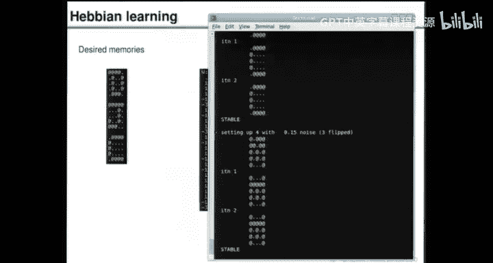

Noisy M， okay， so what happened there，1，2，3，4，1，2，3， and a failure。

 So still quite a lot of successes， D with three flips， J， C and M。 that was another four successes。

😊。

Okay， so it's not working， but it's only failing in two out of 16 cases at this noise level。Noisy D。

 J， C， that's Al or something like it， isn't it， And M， Alright， so when we're flipping 4 bits。

Which is irish，17 percentageish。We're getting some failures for sure。 Where did， Where I go， Sorry。

 where。So this is four flips。And we're getting some failures。Alright。

 so I've got weak evidence that things are sort of getting bad。Hereabout。 So it still works。

 but the basins of attraction aren't quite so big。What should we do next，5 memories。 Okay。

 so the memories are now called D，J， C， M and X is a checkboard pattern that I picked。😊，Alright。

 so all the weights， which were -4，-2，0，2， or 4， are now changed by plus 1 or -1。

 and they're all odd numbers。 alright。😊，Do we have fixed points， Let's try the D。 Yes。

 there's a fixed point。D， J， C M and X。 So the fixed point at D。

 there is a fixed point at J at C and M and X。 Okay， so we still have。A fixed point。

Is it an attracting fixed point。 Can we flip some bits to cut things short。

 I'm gonna go to 15% noise level。 So I'm gonna flip 3 Bs and see what happens。Hairabouts。

And the answer is， noisy D gets turned into。Anti M。Okay， so that's not very good。

Noisy J turns it to J。 Noisy C is okay。Noisy M is okay， and noisy X has got turned into。

 I don't know what that is。 So that was sort of bad， O， okay， okay， and bad。

 which isn't looking very good。 So probably this green line is somewhere like Gat。Okay。

 so it's not really working anymore。 We added a fifth memory and the basins of attraction。

 If there are， if there is a basin at all， theyre， they're really quite small。

Let's try again with the noisy D， noisy J， noisy C， noisy M。And I the X， okay。

 all of those actually worked。 So we had five more successes。Right，6 memories， so。

We're probably pushing our luck now， DJC M X。 And thens another one， which I call S。

 And they look like this。 Okay， so that's the six patterns。

 The weights now will all be even numbers because we tweak them all up or down by one。

 And we put in D to check， is it a fixed point。 And the answer is no。

We get something that looks a bit like S， but it's off by 1 B。J is a fixed point。

 C is not a fixed point。That turned into。Something that looks like S， but is off by one bit。

M is not a fixed point。 It's turned into anti S with 1 B flipped。 So that's not very good。X。

Turns into S with 1 bit flipped， and S turns into S with 1 B flipped。 So that's bad。

 And this is okay with a little twiddle。Right， so it's really not working anymore， is it？

 So this green boundary。Comes in here about at 6 memories。 And if we。Ask the question。

 could you have made a hot field network that did have fixed points at all of these。

 if only you had used a different learning algorithm instead of the He rule， Well。

 how could we do that。Well， one way to think about it is every one of these neurons is a single neuron that gets inputs from somewhere。

And we already have a learning algorithm for training single neurons。

 Remember when we are training pigeons， sorry， pigeon replacements。

To distinguish pe raisins from pebbles。 So we could use the learning algorithm for a single neuron to train each neuron。

To classify。The D pattern as a plus 1 or -1， depending whether that neuron should be in state plus 1 or or -1 when it's in a D。

And train this one similarly， with。Every possible input， DJCM and so forth。

 with the correct label being blue or yellow， plus 1 or -1。

 depending on whether this one should be up or down in each of those states。

 So each of them has its own lookup table of what it should do in those， those， those states。

 And you can run individual learning algorithms for each of them。 In fact。

 they're coupled to each other because the weights have to be symmetric。 So you run。

 you sort of add up all the objective functions and say， let's minimize that objective function。

 And it is actually possible to come up with a setting of weights。😊，Which are here。

Here are a set of weights that were found by training the algorithm on those six examples with each neuron being told whether it should try to be up or down。

And now， when you run the dynamics starting from a D， you get a D and from a J， you get a J from a C。

 you get got a C M goes to M X goes to X and S goes to S。 So you can still tweak the weights。

 You just don't use the He rule anymore。 You， you do something a bit smarter that says， well。

 what is the objective。 And let's check that it's working。

And you tweak the weights just a little bit。 And we've got fixed points in all the right places。

 So it was possible to get the Hotfield network to have fixed points here。

If we use a different learning algorithm， anyway， the main part of the show was the He rule。

 which is so fantastically simple and clearly biologically plausible。

 It's a very easy algorithm to learn。 You to implement。 You just have to see。

 are the neurons in a correlated state or not， and you tweak your synapse strength up or down accordingly。

😊，Does this thing have attracting fixed points？ Well， no。

 if you add a significant amount of noise to a D， you get S。 J works。 C goes to S。 M goes to N S。And。

X with flips goes to S and S with some flips goes to S。 So it's still not working very well。

 but at least it did have some fixed points in the right place。 And I think that might be。

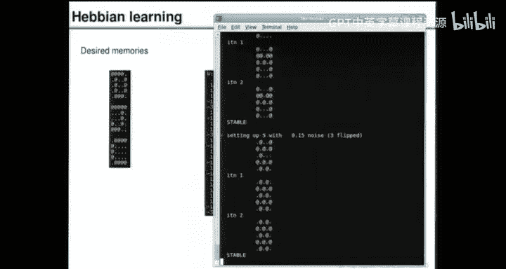

The end of that show。So there is the Hotfield network。 And in my view。

 it's a pretty exciting solution to the content addressable memory challenge。😊。

So we've got a candidate solution to contentreal memories。

 and the Hofield network is itself an interesting thing。😊。

It is a dynamical system that has got fixed points。 Well， why is it even got fixed points。

 Why does it have stable states， How many memories can it learn， What is its capacity。

 I showed you a tiny example with just three or six memories with 25 neurons。

 What if you have N much bigger And if all the neurons are connected to each other。

 How many bits can you store， How many random patterns can you train this thing on using， say。

 the the Heal。And this is an interesting system we've started to study。 What else can we do with it。

 What ideas are inspired by the hott field network， I'm going spend the final 20 minutes or so。

 answering a few of these questions。 So first， why does the hott field network have some stable states。

 Well， I wouldn't be surprised if you recognize what we've just been doing。

 So have you seen these equations before， activation is a linear sum of X's and then the Xs obtained by putting the A's。

 the activations through a attached function。 Have you seen that before， Yes， you've seen it before。

 because two lectures ago， we discussed variational methods。 We said。

 imagine if you had a spin system with couplings called JM N。😊。

Then you want to approximate the nasty， complicated， coupled system by a variational approximation。

Out poppedpped these equations， which are exactly the same。

 except J is now called W because their weights in a neural network and the H is。

 which were applied fields， local fields in the physics problem。 And the thes， the biases of neurons。

 Okay， so the equations are identical。 We've seen this before。

 And here was the page of text that we had in the textbook。

 and in the lecture where we derived These are equations as a variation approximation to something。😊。

That spits out a possible idea about the hot fill network。 Well。

 since it's an approximation to something， maybe it would be interesting to actually implement the something instead of implementing the approximation。

 And that idea is called the Boltzman machine， so。😊，A little spin out I'll just mention。Is。

Hot field network。Heres a variational free energy。Minimization， approximation。To。

 a prove distribution。P of X， which is the same old thing that we had for the spin system E to the sum over I and J。

 X， I， W， I， J， X， J， something like that。 Give or take a possible sign error。

And so it's a an approximation that we could call Q。And that motivates the idea， hey。

 maybe we could make a neural network that actually implements P。

 and we could have a whole world of neural networks that actually do P。

 And that's called the Baltimore machine。😊，So。The Bolzman machine。

Is the neural net community's name for。The stochastic neural network that samples from this distribution。

And there's a whole bunch of games you can play with those。

 You can have learning algorithms where you say let's train the probability distribution of the bulk machine to have some properties we want。

 like。To assign high probability to some memories that we want to learn。

 or you could have other things that you want to do。 other， say， associative memory tasks。

So there's a literature on both machines。And if you want them to do learning。

 you need to have learning algorithms for them。And。Just to complete this aside。

If you write down what the learning algorithm is。For the bolt machine。

If what you want it to do is assign high probability to a set of memories。

Then what you find is the very first step of that learning algorithm is。The He rule。That we had。

A moment ago。 So if you wondered， where did the He rule come from， Well。

 here's one way of deriving it。 We write down the real probability distribution。

 write down the learning algorithm， make one step of steepest descents。

 And you find you've got the He rule， so。That's a little aside。Now。

The fact that the hott field network is associated with the variation of free energy means that its dynamics have a li on a function。

 So that's why the dynamics do have stable states。 The dynamics take you downhill on the variation of free energy。

 And because that is a function that。Is lower bounded by something。 It can't go arbitrarily negative。

 The dynamics have to reach a fixed point。 So by observing that we've already seen this thing and it came out of an objective function。

We get a， an instant proof of the fact that the hot field net networks。Dynamics。

Do minimize and reject function， and therefore， there exist。Fixed points。

Of of the net dynamics minimize a variational free energy， therefore。There exists， fixed points。

And the dynamics。Always go into one of these fixed points and stop。And it didn't have to be that way。

 You can easily write down dynamical systems that don't have objective functions that decrease。

 It's easy to make chaotic systems that just go buumumbble buum buumbly and randomly wander around and end up in limit cycles and so forth。

Now， another question on the list of questions was。

 what is the capacity of the hot Hot field network。

 And this has been studied by the physics community that got attracted into neural networks。

 and they have established that if N is very large。And if I is very large。

 So I is the number of neurons。And N is the number of patterns。Inscently， the number of parameters。

Then。In the hot build network is roughly I squared over 2。If you make both I and N large。

 then what you find is。That the hot field network works for N over I less than a critical value。

 and it doesn't work at all for N over I above that critical value。

 So these two graphs here are showing you how good the overlap is between the desired memory that you're trying to recall and the nearest stable state。

 the nearest fixed point。And you can see if N over I is less than 014 or so。

 then you get very big overlap， which is wonderful。 But you go above 。

14 and you get this catastrophic failure。😊，That means that you can learn。

Theyre not learn perfectly instantly。 They notice how the black line isn't quite equal to one for any value of n over I。

 So there is a fixed point， but it's not quite in the right place。

 So that the Heral almost gets it right， but not quite。There's this critical value N is 0。138 I。

That means the number of random bits that you're able to learn。And store in these。Parameters。

 the number of bits learned if you're just below that critical point is roughly。Ncr times I。

 because each of the ncr patterns you've learn has I randomly chosen bits in it。

 So that's roughly I squared times 0 。138。And if you take the ratio of this number of bits you've learned to this number of parameters。

The ratio is about 024 Bs per weight。So that's the nice sort of rule of thumb again。

In the last lecture， we talked about training a single neuron。

 and we observed that a single neuron can learn。Random patterns， random labels for patterns。

 And it can learn up to 2 B per weight。The hopop network with the Hereral can learn 0。

24 B per weight。 And then it stops workingBeyond that。 This is a result for random patterns。

 and for the Hebriral。My final question was， what else can we do with these hot field network ideas。

Well， one idea that John Hotfield himself had was since the Hotfield network does minimize things。

 How about we go out into the community of people who try to minimize things because that's their job and try and solve their problems for them with a Hotfield network。

 So we say you want to minimize something。 Well， try this brain like thing。

 It'll do a minimization for you。So let's give you an example。嗯。

Let's discuss the traveling salesman problem。The travelling salesman problem。

Is the task of picking a tour that visits some cities。 And you want to minimize the distance。

 the length of the tour。So。Where should we go now， let's wipe a bit of board。

And I'm gonna show you first， the travelling sales and problem with four cities。

And I'll describe how you can map that onto a hotfield network。

So you go to the back page of the road Atlas， and it often has a thing that looks like this， yeah。

Which has a list of names of cities on all the roads and cities on here。

 And these are the distances between the city。 Yeah。

 so you have the distance between cities A and B here。 distance between A and C here。

 distance between A and D here， distance between B and C and so forth。

And you look at that triangle of distances， and then you're told。

Here are all the cities you must visit， A，B，C。And D。

 you can look up in that triangle what the distances all are。 And you have to pick a tour。

 which is a。Sequence of。Maybe A first， B， second。D， third， C， fourth， and then back to a。

 So closed tour。 and the task is to find a tour which minimizes the total distance。

This task is an N complete problem。 That means it's hard。I could give a more precise definition。

 but for our purposes， it just means it's an interesting thing if you can do anything on it at all。

 And we don't expect to have a perfect solutionca it N P complete means sufficiently hard that you would。

Get an award if you could actually do it perfectly。Okay， so youve got to pick a permutation。

And you want to minimize the total distance。 So the goal is。Find a permutation。Of。ABC， D。

 such at the tour。Minims。The total。Distance。Okay， you can think of this as being a problem with two objectives。

 The real objective is is we want to minimize the total distance。

 But there's another objective lurking in there， which is we do want， please。A permutation。

And John Hoofffield's approach to this problem， which he did with David Tank， was to。

Make a network which minimizes a single objective function。 That is a sum of you， if you like。

 of these two things， the objective of minimizing interence。

 plus the objective of being a permutation。So how do you do that？Well。You make a network。

Representation。Of。A tour like object that may or may not actually be a tour across the top。

 We have place in tour。 Does a city come first， second， third or fourth。

 And on the left hand side will have cities， A， B， C， D。 And if A comes first， So if the tour is。

 say A，DB。C comes second。D comes third， and B comes fourth。

Then you could imagine switching on these four neurons and switching all the other 12 neurons off。😊。

And that would be a way with 16 neurons of representing this particular permutation。

 There's actually several ways of doing it because you can slide， you can wrap around in this way。

 And there's four different ways of representing the same ordered tour。Okay。

 so that's the network representation。 Now， we need to wire up。

The neurons to each other in a way that enforces these two objectives of please make a permutation and please have small total distance。

 So we need things that enforce permutationness。And。

We could explicitly have some Uber computation that says， is this thing a permutation or not。

 but that would not be local and it would not be distributed， and it wouldn't be a hot film network。

 The way to do it in a hot film network anyway， is you say， well， if it's a permutation。

 then there's only one，1 in a row。 And if there were two ones in in a row or a column。

 that would be bad。 So something we can do is we can say。Let's have negative weights。

From one neuron to everyone who is in his row。 And let's have negative weights。

To everyone who's in his column， I'm sorry。 I said that back to front， but it doesn't matter。

So you have negative weights。From you to everyone in your row and everyone in your column。

And you repeat that for all neurons。Then we need to have away off。Actually。

 making a thing care about minimizing a distance， as well as just。Creating a permutation。

So how do we do that？Well。哎。This neuron is on here。And if this neuron is on。

 then that means that B came second and D。Came third。And now。

 something in this network had better be aware of that and care about the distance between B and D。

 because B has been put next to D。 So we're gonna have a weight。Color green。Or minimizing total list。

Between these that will be minus the distance between B and D。Similarly。

There'll be a minus DVD between those two。A minus DBC between those and a minus D B A between those。

Et cetera， were replicated all the way across。Alright， so if you're in the same row as each other。

 you' gonna have a red weight connecting you and the same columns。 Likewise。

 if you're in adjacent columns， but different rows。

 you will have one of these green weights connecting you。 And if you're not in adjacent columns。

 then you won't have any weight。 So if you're in different columns and rows， the weight will be 0。

So I've gone ahead and done that here。 So here is the the network with some red squares。

 So here are the neurons。 There's 16 of them。 And if I put the mouse on a neuron。

 you can see all the weights connected to that neuron。 And some of them are。

 these are all the negative weights。 Some of them are -7。 Some of them are -5， Some of them -1。

-4 and so forth。 why， well， let's go and look at some of these。 So why is this weight-7。

 It's because those two neurons are in the same row as each other。 The purple and green1。 Allright。

 So all of these  sevens are for neurons that are in the same row as each other。

 So I just picked 7 to be a distinctive number。 That's the negative weight for being in the same row。

 here's some more 7s。😊，And then here's some more sevens for ones that are in the bottom row。

 which is the same row as each other。 And these sevens are all for neurons in the top row。Okay。Now。

 why is this a5？ Well， that's because those two are in the same column as each other。

 And all the fives are for neurons that are in the same column as each other。Alright， click， click。

 click， click， click。Now， why is this a w， Well， that's a one， because that's A and B。

 And they're in adjacent columns。 So we need to know about the distance between them。

 I'll just put the mouse on this w。All of those red weights are one， because those are neurons that。

If both of them are on， A comes next to B in the tour。

These ones are one because the distance from B to C is one。 And if those pairs of neurons are on。

 then B is coming next to C。These are one because the distance between C and D is one， etc cea。

 So my actual distance table says。A to B is one。B2 C is one。And C to D is a distance of one。

Meanwhile， A2 D is in is inexplicably far。 You can only get there on a direct road of length 6。

And we've got fours between A and C。And between B and D， so。That's my assumed。

Length for this example。So this is the little triangular thing in the back of the the8 A Z map。Okay。

 have I explained all the weights， We've got fours， We've got6es。

 We've got fours and all of those I've now explained。 So we've looked at every single weight。

 and we know why it's there。They're all either 1，4，6 or 5 or 7 or 0。

 So you've met every single weight in here。 And now we can run the dynamics。 I've also got a bias。

 and I've set the bias to-8。 And， but I've got a- sign convention here。 I think that means plus 8。

 So that's encouraging neurons， please switch on。 if we didn't have that。

 none of them would want to switch on at all。 So I just pick the bias of 8。

 And when now we can go through the neurons and say， do you want to switch on。 And a1 says， yes。

 I want to switch on， please， my activation is plus 8。 So you go ahead and switch them on。😊。

And then he asked， A2， do you want to switch on。 And he says， my activation is plus 1。 Yes。

 I want to switch on as well。 that's actually not very good news。

 because it's not gonna be a permutation yet。 but we keep going。 Do A 3， do you want to switch on。

 He says， no way my activation is -6。A 4， all these activations are up in this orange square here。

 A 4， do you want to switch on， No， my activation is -6。 Leave me alone。 Does B1 want to switch on。

 his activation is plus 2。 He says， yes， switch me on， please。😊，B2 says， no， leave me alone。B 3。

 he's got an activation of  zero。 So we could toss the coin and decide whether to turn turn him on or not。

 Anyone got a coin。Okay， let's flip。Tos coin， someone say heads or tails。Okay。

 that means that we don't turn it on。 Alright， that was a tails。 B4， do you want to switch on。

 He's got an activation of 0。 Alright， let's have the opposite outcome。 Someone say heads， heads。

 and that one goes on。Right， C 1， does it want to to go on， No， it's stable。

 Does C 2 know it's stable。 There' C 3， It's unstable。 It wants to， to go on。

 It's got positive activation。 so there it goes。C 4 is stable，3 Li alone。 D1 is stable。 D2 is stable。

 D3 is stable。 D4 is stable。 And now we keep on running the dynamics。 A 1， what do you want to do。

 Oh， it wants to change。 Oh， make your mind up， mate it wants to change back。 A2。 that's stable。

 stable， stable。Be unstable， okay。Stable， stable， stable。 C is stable。C 2， C 3， C 4， D， stable。

 unstable。 Okay， and that one's stable before is stable back up to the top。 A 1 stable， A 2 unstable。

 Alright， make your mind up。Think stable4 B， stable， stable， stable。

You can be assured we're not gonna be here forever because this thing is minimizing in a objective function。

 So eventually we'll reach a fixed point。 That's stable， stable， stable， stable， D， stable， stable。

 stable， stable。 Okay， A1， What do you think is gonna happen when we look at this one。 It's unstable。

 Pop， Okay， and now they are all stable， happy bunnies。😊，So what's happened。It has settled down。

 and it's in a state that does implement a permutation， And that might actually be the optimal tour。

 I can't remember。 You can check。Okay， so that's a hot field network being used to solve an opt problem an MP complete problem。

 Okay， don't， don't be impressed by people who sometimes solve MP P complete problems。

 They can never do it reliably。But that's an interesting thing to do with a neural network。And3 Ayya。

 who was a student in the engineering department here back in 91 for his PhD said， well。

 let's take this hot field network idea is actually a bit broken to have an objective function。

 that's a sum of a rule plus the thing you want to minimize。

 So let's update the way Hofield networks work in such a way that we don't have a competition between trying to minimize the distance and obeying the rule。

 So he， he tweaked things a little bit。 And came up with a much better version of this hot field network optimization algorithm。

 It involved continuous neurons that gradually gets switched on。

 It's like starting in a high temperature state and reducing the temperature。

 and here's a picture of his network solving the traveling scholar problem。

 which is the task of visiting all the Cambridge Colleges。😊，So， that was fun。

The final thing I want to say is， and this is a personal story of。

 of how my understanding of neural networks evolved into something useful。Here's a question for you。

 I've been talking a lot。 I want you to talk to each other for a minute and say。

 what is this probability distribution。Okay， so have a chat to each other and see what you think it might be。

You're allowed to make hubub。Indeed， I would really like you to make hub up。1，3，4，7。

To give you a possible hint， I've grown on the board just now a graph associated with the function I've written down there。

 The graph contains a square node。😊，If the sum includes。A term。

That connects together that multiplies the variables that are on the that are connected to that。

 So for each term in the sum， there's a black blob or sorry， a white blob。

 And that white blob is connected to the terms that are coupled together。So。Okay。

 answer is it's the graph of the 7，4 hamming code。So this probability distribution has what property。

 If beta is a big positive number， what happens， That means we favor states where x 1 times x2 times x 3 times x 5 is equal to plus 1。

 Remember， all these x is are plus -1 now。So what happens if you were to perfectly simulate this probability distribution。

 And if beta is quite large， which states would keep on coming up。Yeah。Okay。

 what would keep on coming up would be states in which the parity of these four guys is even。

And where the parity of these four is even and states where the parity of these four is even。

 because then all four terms would be plus one。Yeah。And what's another name we give to states X 1。

 X 2， x，3 up to x 7 that have the property that the parity of these four is even。

 And the priority of these is even。 And these is even。Those states are。

They are the code words of the 7，4 hammon code。 So this is the graph of the 7，4 hammon code。

 and the probability distribution on the board is the probability distribution that sits with lots of mass on all of the code words symmetrically。

😊，And it assigns very little mass to noncode words。Okay， so this hasn't got us anywhere。

 It's just still an observation。 that probability distribution。Which is a sum of simple terms。

That probability distribution is the probability distribution of the setable code words of the heming code。

So question 2， what is this。Do make hubub again。I'm drawing the graph of this function for you。

And the question is， what's the probability distribution？

The graph of the function just involves simple terms。 Each term is B。

 N times X where B is some constant that I haven't told you。

 So that corresponds to adding an extra node to each of these。Variables。Okay， so what is this？

That's connected to 3。 And that's connected to 2。 We you saying。都本。I've got two fives。 Yes。

 well done。 Thank you。Good， well done。 sorry about the saying。 So what。

 what is this probability distribution， What could it be。Okay， so we've added a bias to each bit。

 And in one， what context might you get such biases and say， yes。

 this is an interesting probability distribution。Okay， let me help。

 So let's imagine that someone is sending code words。Using a 74 hamming code。 So they spit out T。

 and it goes over a channel， which is the binary symmetric channel。 and outcomes comes R。

 which is the received thing that differs by some flips using a bentco。And you receive R。

 And now you want to solve the problem of saying， given R， what do I think the code word was。

 And therefore， what was S。Okay， so the encoding operation was they picked a T from the first distribution。

 So we call that P n。 So they used。P n。Because we haven't got a clue which S they chose。 Therefore。

 they picked at random。From our point of view， one of the code words。 So they drew T from Pot。

Then we got an observation。 We get to see R。And R is a noisy version of T。

 So in terms of graphical model， R gives you biases on each of the bits。So。

 the posterior probability。Which is what you want for decoding。Is。

Posstate probability of T given R is the product of p of R given T times the prior probability of T normalized。

This term here。Is Pn of t？And this one is a product of terms， one for each of the bits。

 product from one to n of the probability of R N， given that T N。

 which you can write if you want as E to the B。And。Times T， N。Give or take some， some factor。

All right。So the answer to question， too is this probability distribution here is the posterior probability of the code word。

 given the output of a binary symmetric channel。Or， in fact， not just a binary symmetric channel。

 Any channel where each bit is independently communicated。

 So binary symmetric channel would be the special case where all the B Ns are say plus 2。7 or-2。7。

 And they'd all be the same value，2。7， repeated lots of times with pluses or minuses。

 depending whether the output bit is 1 or a 0。😊，If it's another channel like a Gaussian channel or something like that。

 then all the B， Ns would be different from each other。

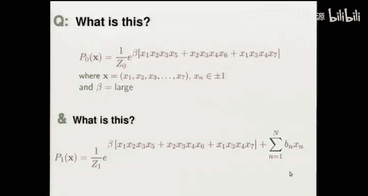

Apologies for the technical problem。 I'm going to have to respeak the lecture from here onwards。

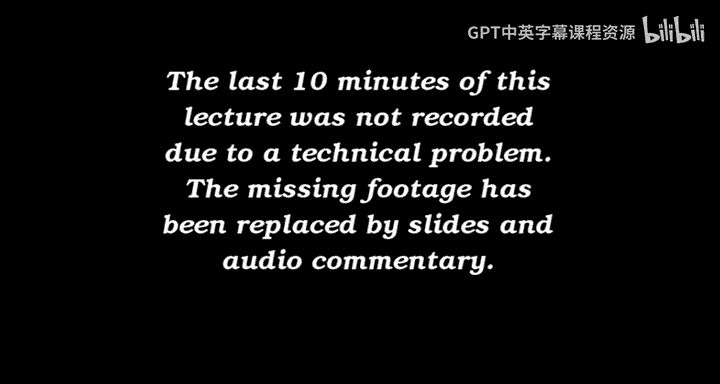

So this observation that the。Eero correcting code decoding problem can be expressed in terms of a probability distribution。

 which upstairs in the exponent is a sum of simple factors。

And the observation that the Hot field network can be viewed as an approximation。

To a probability distribution that is the exponential of a sum of simple factors。

In the case of the hot fill network， these factors are just quadratic with terms like W I J， X， I。

 X J。This observation motivates the idea。Maybe we could take the decoding problem of an error correcting code。

And solve it using approximate methods 2。So I'm not just talking about the 74 having code。

 but the idea is to generalize， take other error correcting codes。

 express their decoding problems in the terms of in terms of E to the power of a sum of simple factors。

And then use， for example， a variational method。To approximate that distribution and hopefully find the maximum of the posterory distribution。

And in 1995， that's what I did。 I wrote a paper called Free Energy minimization Alrithm for decoding and cryp Analysis。

And I made some random， simple error correcting codes。And I decoded them。Using variational methods。

 very similar to the hop field network we've been looking at。The error correct in codes I made。

Had the form of an identity matrix on the right hand side and on the left hand side。

 just some sparse random oneands。These are called low density generator matrix codes。And。

When that work looked quite promising that there were no record breaking results from it。

 but it was promising enough that I carried on looking at this topic and discussed with Radford Neal。

The questions。First。Can we do better than variational free energy minimization as a decoding algorithm。

For codes like these。 And secondly。For what error correcting codes do these sort of sparse。

Graph based。Message passing， decoding algorithms work the best。

Which error correcting codes are best suited to these sort of algorithms。

And what we found was that we could， in fact， do better than variational free energy minimization。

We rediscovered the idea of using an algorithm called the sum product algorithm。

 which is also a message passing algorithm on a sparse graph。

And it also has a variational interpretation， but it was a better algorithm than variational free energy minimization。

The second thing we did was we tried to invent new error correcting codes。

 and we invented a range of error correcting codes。

All of which were better than these low density generator matrix codes。

 and some of them were quite exotic。And the very best ones that we came up with were actually first invented in 1962。

Bob Gallagher， who was one of the founding fathers of information theory。

 along with Shannon and others。Invented low density part check codes for his Ph D thesis。And in 1996。

 Raford Neil and I wrote a paper showing that you could actually achieve near Shannon limit performance with these error correcting codes。

You'll remember back in lecture 1， we discussed。Diagram of performance of error correcting codes with rate along the horizontal axis and error probability on the vertical axis。

 We had repetition codes that weren't very good。 We had some other codes like the 7。

4 Hamming code that were better。 And we had this remarkable result from Shannon。

Which is that there exist error correcting codes then that can achieve rates anywhere up to the capacity with error probability arbitrarily small。

And we made low density parity check codes， which。而。

Very similar to low density de generator matrix codes， but they look like this， instead of having。

Part of the matrix。The sparse and part of it， an identity matrix。

 the whole matrix is sparse with three ones per column，3 ones per column all the way across。

 or it could be some other number like 4 or 5。 But the results I'm about to show you are for three ones per column。

And so here on the screen， you can see a parishche matrix with 20000 columns and 10000 rows。

 And if you look very closely， you'll see that there are three ones in every single one of those 20000 columns。

The picture on the top right shows you。A transmitted vector。

 which consists of 10000 B set by the user。 That's the top half of that transmitted image。

And then the 10000 bits that follow it are the parity check bits。

 which are set in such a way that all the 10000 constraints in the parity check matrix。The 10。

000 constraints defined by the parache matrix are satisfied。And when you send that。Over a channel。

Received。Vca。Looked like what we see in this next slide here。

 This is a binary symmetric channel that flippeds 7。5 per of the bits。

And the animated G that we will insert here somehow。Shows the decoding。

Of this particular received noisy vector， it takes about 30 iterations for the some product algorithm to figure out what the correct state was。

And the animated GIif loops through a few times showing the decoding process。B。

Performance of this particular error correcting code， which has rate one half。

For the binary symmetric channel with a flip probability of 7。5 per cent。

 is shown in the right hand side of this slide。It has an error probability。

 a little bit smaller than one in 10 of the five。And that's quite close to the Shannon limit。

 which is a bit bigger than。A rate of one half。 And it's much closer to the Shannon limit than any of these textbook codes。

 which are shown by the pluses。figureが。And this rediscovery of Shannon's low density parishche codes had a significant effect on the field of information theory and coding theory。

In 1997。There was。At the International Symposium on Information theory。

 the big Information theory conference， there was just a single paper on low density parity check codes。

 namely the one by me and Raford Neil。Five years later。

 the same conference had six entire sessions devoted to low density parity check codes alone and a total of 10 sessions full of papers all on the topic of sparse graph codes。

 which are。A codes like these low density fire check codes definedying in terms of sparse graph codes。

 once it was established that you could get good performance from message passing algorithms on sparse graphs。

 a whole industry was created， inventing different sorts of sparse graph codes that could take advantage of message passing。

So my intention here is to show you how。If you look out for connections。

 you can discover that everything is connected。I'd like to thank you very much for watching these lectures。

 If you've watched all 16， you get a special prize in addition to a free electronic copy of the textbook on information theory。

 In and learning algorithms， you are also welcome to download now a free copy of my other book Sustainable Energy without the hot hair。

 Here are the two websites for you to download your prizes from。

So thank you again for watching these lectures and a big thank you to Emily Marie Nell for doing all the hard work of putting these video lectures together。

Thank you。

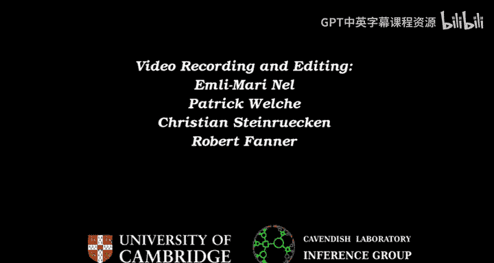