# 信息论、模式识别和神经网络：1：信息论导论 🎯

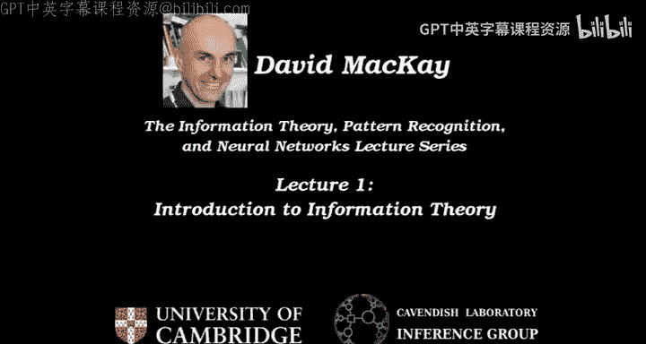

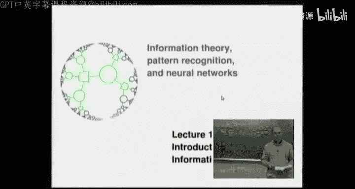

在本节课中，我们将要学习信息论的基础概念。信息论由克劳德·香农创立，旨在解决通信中的核心问题。我们将探讨可靠通信的基本挑战，并通过简单的模型来理解编码和解码如何帮助我们克服不可靠信道带来的噪声。

## 概述：可靠通信的基本问题

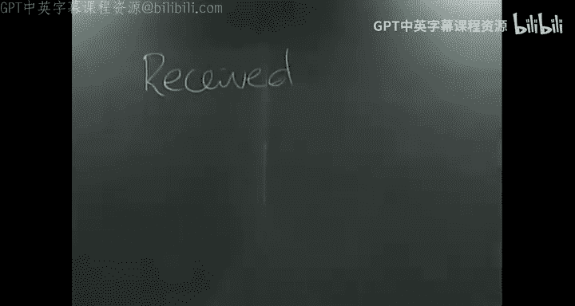

香农定义的根本问题是：如何在一个不可靠的信道上实现可靠通信。所有信道都有一个共同特性：接收到的信号与发送的信号并不完全相同。这可能是由于噪声或其他干扰过程造成的。

上一节我们介绍了可靠通信的基本目标，本节中我们来看看一些具体的信道例子。

以下是几个常见的信道例子：
*   **声音信道**：从我的声音到你的耳朵，介质是空气。
*   **视觉信道**：从眼睛到部分神经系统，介质是细胞质和电脉冲。
*   **DNA信道**：我们体内约有10^13个细胞，每个都携带一份基因组副本。细胞分裂时，信息被复制并传递。
*   **航天器通信**：例如火星车，使用真空作为传输介质发送和接收信号。
*   **电话线**：使用铜线连接两部电话。
*   **磁盘驱动器**：介质是磁化薄膜，信息被存储并在之后读取。

许多信道是从一个地点到另一个地点，但也存在从同一地点但不同时间“发送”信息的信道（如存储）。所有这些信道都面临噪声问题，导致接收信号 **R** 只是发送信号 **T** 的近似：`R ≈ T + 噪声`。

## 解决方案：物理方案与系统方案

我们渴望实现可靠通信，即希望接收消息 **R** 等于原始发送消息 **S**。为了实现这个目标，我们可以采用两种方案。

上一节我们了解了通信中的噪声问题，本节中我们来看看两种主要的解决方案。

**物理解决方案**：通过改进物理硬件来降低噪声。例如，更换更好的磁盘驱动器、为铜线添加更好的绝缘层、使用更稳定的磁性薄膜或增加冷却系统。

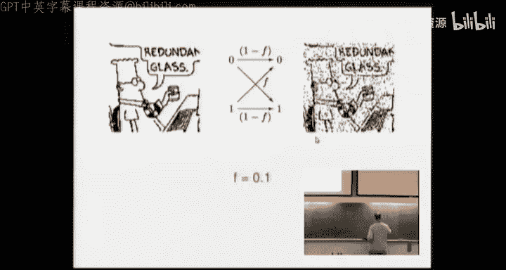

**系统解决方案**：接受信道本身的不可靠性，通过在信道两端添加编码器和解码器系统，将其转变为可靠信道。这正是信息论所关注的方法。其系统框图如下：

```
源消息 S -> 编码器 -> 传输信号 T -> [不可靠信道 + 噪声] -> 接收信号 R -> 解码器 -> 估计消息 Ŝ
```

编码器的作用是向原始消息中添加**冗余**。解码器则利用这种已知的冗余模式，尝试推断出原始的 **S** 和噪声情况。

## 玩具模型：二进制对称信道

为了具体分析，我们引入一个简单的玩具模型——**二进制对称信道**。

上一节我们介绍了系统解决方案的框架，本节中我们用一个具体的信道模型来展开讨论。

该信道的输入 **X** 和输出 **Y** 均为二进制数（0或1）。其特性是：正确传输的概率为 **1 - f**，发生比特翻转的错误概率为 **f**。公式描述如下：
`P(Y=0 | X=0) = P(Y=1 | X=1) = 1 - f`
`P(Y=1 | X=0) = P(Y=0 | X=1) = f`

假设 `f = 0.1`。这可以看作是一个原型磁盘驱动器的模型，它有10%的比特翻转概率。

**问题一**：一个10,000比特的文件存储在该驱动器上，假设每个比特独立翻转，大约有多少比特会发生翻转？方差是多少？

根据二项分布，均值 `E = n * p = 10000 * 0.1 = 1000`。方差 `Var = n * p * (1-p) = 10000 * 0.1 * 0.9 = 900`。标准差约为30。因此，答案大约是 **1000 ± 30** 个比特被翻转。

**问题二**：要使一个1GB的磁盘驱动器具有商业可行性（假设客户高强度使用5年，约处理10^13比特），其比特错误概率 **f** 需要多小？

考虑到客户满意度和极低的故障率要求，行业标准通常指向 **10^{-15}** 甚至 **10^{-18}** 量级的错误概率。我们以 **10^{-15}** 作为初步目标。

## 编码实践：重复码

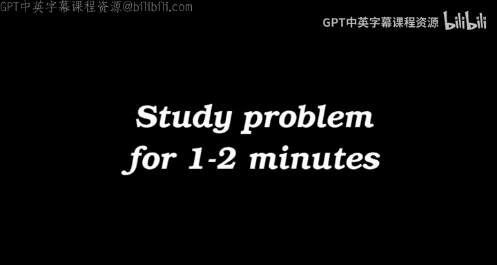

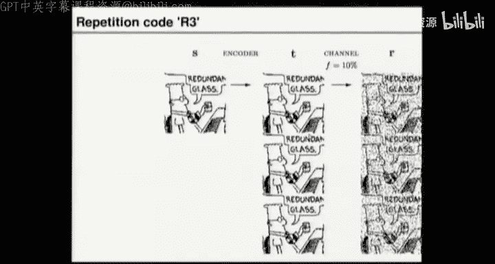

现在，我们回到编码器-解码器框架，探讨添加冗余的具体方法。一种最简单的编码是**重复码**。

以下是重复码 `R3` 的一个编码示例：
*   源消息 `S`: `0 1 1 0 1`
*   编码后传输 `T`: `000 111 111 000 111`

假设信道噪声向量为 `N`: `001 000 010 000 000`（1表示该位置发生翻转）。那么接收信号 `R = T ⊕ N`（模2加）为：`001 111 101 000 111`。

解码器应采用何种策略？合理的解码器是**多数表决解码器**（或“最佳三取一”解码器）。即，将接收到的每三个比特视为一组，并输出该组中占多数的比特值。

应用此解码器后，我们得到的估计消息 `Ŝ` 为：`0 1 1 0 1`。可以看到，它纠正了第一组中的单个错误，但未能纠正第三组中的两个错误。

为什么多数表决解码器是“正确”的解码器？这源于**概率推断**。根据贝叶斯定理，在给定接收信号 **R** 的条件下，我们应选择后验概率 `P(S | R)` 最大的 **S** 作为估计值。对于BSC信道，这等价于选择与 **R** 差异最小的有效码字（即需要最少比特翻转的假设），而多数表决恰好实现了这一准则。

## 评估性能：重复码的误差概率

现在我们来评估重复码 `R3` 的性能。

上一节我们看到了重复码如何工作，本节中我们定量分析它能将错误概率降低多少。

对于 `R3` 码，一个源比特块（3个传输比特）在经过多数表决解码后仍发生错误的概率 `P_b` 是：当块中出现**两个或三个**翻转时。根据二项分布：
`P_b = C(3,2) * f^2 * (1-f) + C(3,3) * f^3 = 3f^2(1-f) + f^3 ≈ 3f^2` （当 `f` 较小时）。

因此：
*   **无编码** (`R=1`)：错误概率 `P_b = f` (例如 0.1)。
*   **重复码R3** (`R=1/3`)：错误概率 `P_b ≈ 3f^2` (例如 3*0.01=0.03)。

重复码以降低传输效率（**码率 R**，即每信道使用所传输的源比特数）为代价，降低了错误概率。

**思考**：要达到 `P_b = 10^{-15}` 的目标，需要重复多少次？计算表明，大约需要 **61** 次重复。这意味着需要一个由61个物理磁盘驱动器组成的庞大系统来模拟一个1GB的可靠驱动器，成本高昂。

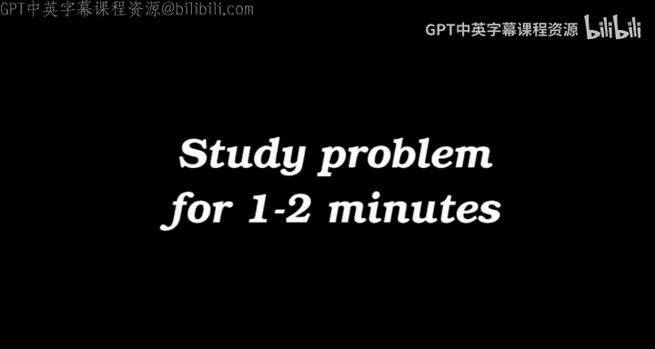

## 更高效的编码：汉明码

是否存在更高效的编码？是的，例如使用奇偶校验位的**（7，4）汉明码**。

上一节我们看到简单重复码效率较低，本节中我们介绍一种更精巧的编码。

该码将4个源比特 (`s1, s2, s3, s4`) 编码为7个传输比特。它通过在三个重叠的“圆圈”（奇偶校验组）中设置校验位，使得每个圆圈内的比特和为偶数（偶校验）。

**编码示例**：
1.  源消息 `1 0 0 0` -> 传输码字 `1 0 0 0 1 0 1`
2.  源消息 `1 1 1 0` -> 传输码字 `1 1 1 0 1 0 0`

**解码**：解码器将接收到的7个比特填入相同的圆圈图中，检查每个圆圈的奇偶性。不满足偶校验的圆圈标记为“悲伤”（红色）。解码规则是：找出那个**位于所有悲伤圆圈内、且不在任何快乐圆圈内**的比特，假设它被翻转，并将其纠正。然后取前4位作为源消息的估计。

该编码器/解码器可以**检测并纠正任何单个比特翻转**。如果发生两个或更多翻转，则解码可能失败。

（7，4）汉明码的性能如何？其码率 `R = 4/7`。经过计算，其**比特错误概率**约为 `9f^2`，**块错误概率**约为 `21f^2`（主导项）。它比重复码 `R3` (`R=1/3≈0.333`) 在更高的码率 (`R=4/7≈0.571`) 下实现了相似量级 (`∝ f^2`) 的错误抑制。

## 香农的突破：信道容量

香农提出了一个根本性问题：在错误概率-码率平面上，**可达区域**和**不可达区域**的边界在哪里？

在汉明码的例子中，我们看到了在中等码率下获得较低错误概率的可能性。香农的革命性结论彻底改变了人们的认知。

传统观点认为，要达到任意小的错误概率，码率必须趋近于零（如图中一条穿过原点的边界线）。但香农证明，**存在一条非零的边界线**，在此线以下的区域都是可达的。这条线与码率轴的交点称为信道的**容量 C**。

对于二进制对称信道，其容量公式为：
`C = 1 - H_2(f)`
其中 `H_2(f)` 是二进制熵函数：`H_2(f) = -f * log2(f) - (1-f) * log2(1-f)`。

**香农噪声信道编码定理**指出：对于任何信道，只要码率 **R < C**，就存在编码和解码方案，可以使错误概率任意小（甚至达到 `10^{-15}`、`10^{-18}` 或更低）。

回到我们的磁盘驱动器例子，对于 `f=0.1` 的BSC信道，容量 `C ≈ 0.53`。这意味着理论上，我们只需要 **2** 个物理磁盘驱动器（码率 `R ≈ 0.5 < 0.53`），通过设计巧妙的编码方案，就能实现任意低的错误概率，而不是之前重复码所需的61个驱动器！

## 课程安排与下节预告

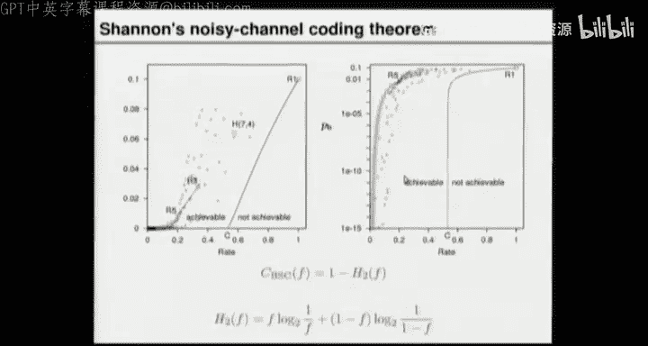

本节课的讲义对应教材《Information Theory, Inference, and Learning Algorithms》的第1章，该书可免费在线获取。

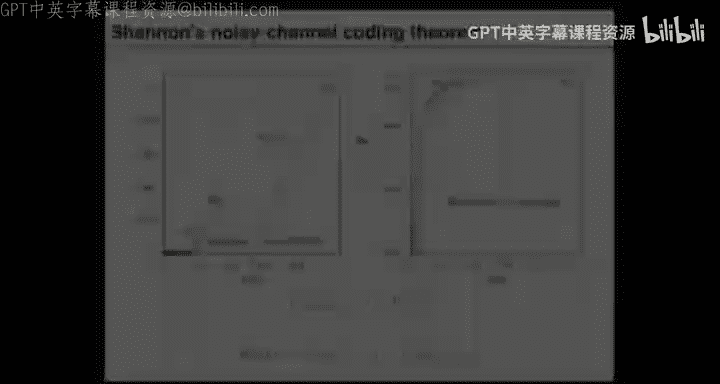

接下来的课程将涵盖：
1.  **信息论**：继续深入讨论噪声信道编码定理，并首先探讨相关的**数据压缩**问题（如何使文件更小）。
2.  **数据建模、模式识别、学习与记忆**。
3.  **各种推断方法**（近似推断方法）和**神经网络**。

**下节课思考题（称重谜题）**：
你有12个外观相同的球，其中11个重量相同，1个重量不同（可能轻也可能重）。你还有一个天平。目标是用最少的称重次数，找出那个特殊的球并确定它是轻还是重。我们将在下节课首先讨论这个问题。

## 总结

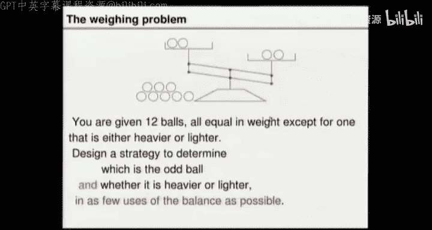

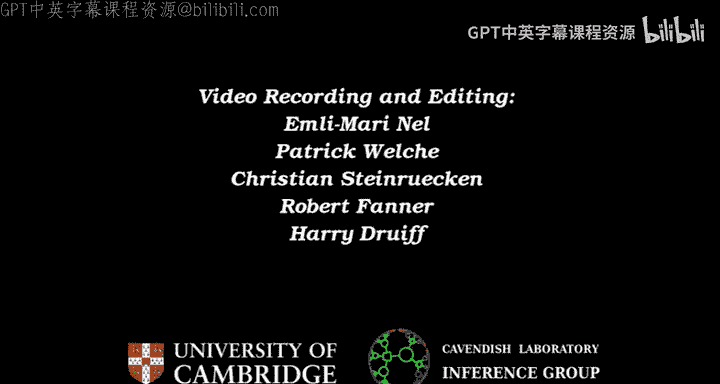

本节课中我们一起学习了：
1.  信息论的核心问题：在不可靠信道上实现可靠通信。
2.  提出了**系统解决方案**，即通过编码（添加冗余）和解码（概率推断）来对抗噪声。
3.  引入了**二进制对称信道**作为分析模型。
4.  分析了简单**重复码**的原理和性能，其错误概率 `P_b ≈ 3f^2`，但码率较低。
5.  介绍了更高效的**（7，4）汉明码**，它利用奇偶校验位，能以更高码率纠正单比特错误。
6.  理解了香农里程碑式的**噪声信道编码定理**，它定义了信道**容量 C**，并证明只要码率低于容量，就能实现任意可靠的通信。这为现代通信系统奠定了理论基础。