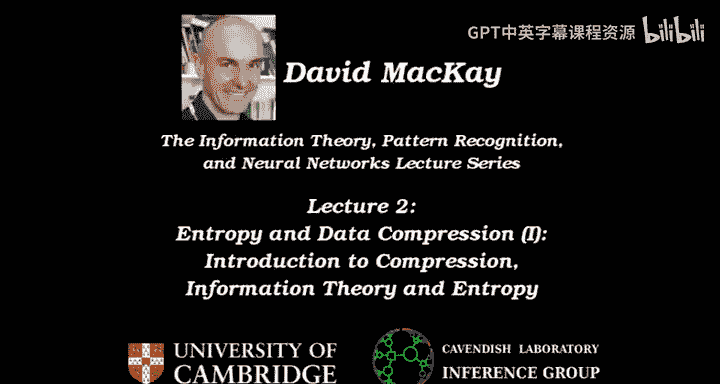
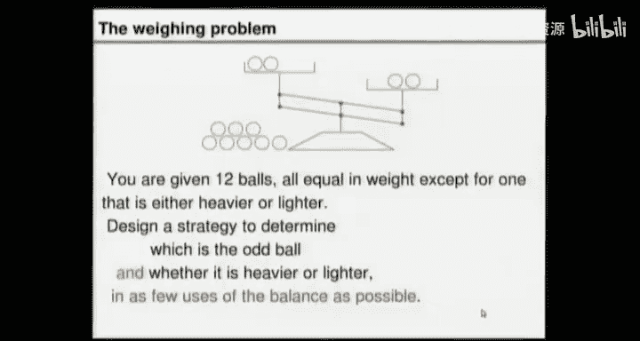
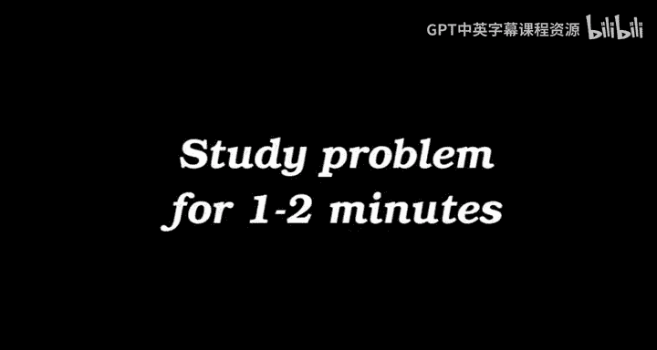
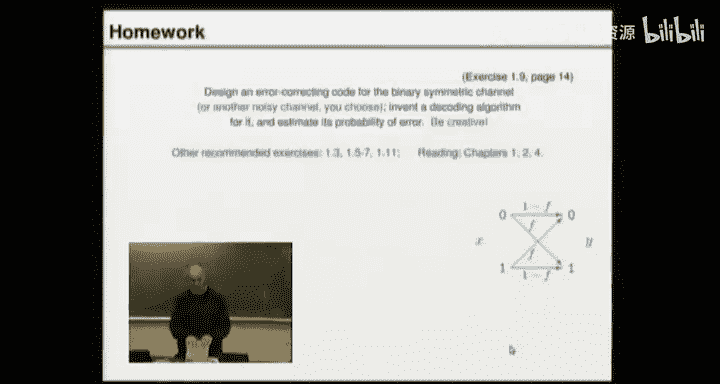
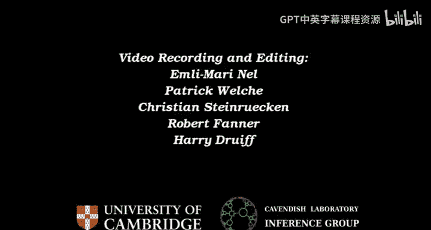

# 信息论、模式识别和神经网络The Information Theory Pattern Recognition and Neural Networks 2014 - P2：-02-Lecture 2_ Entropy and Data Compression (I)_ Introduction to Compression, In - GPT中英字幕课程资源 - BV1er421M7Br

Coming last time， we discussed reliable communication over unreliable channels。😊。

And the idea was that we were taking noisy channels， and imagining。

Fixing up those unreliable channels by putting an encoding system in front and a decoding system after the channel。

And。We discussed。A toy example of a noisy channel， namely the binary symmetric channel。

 which flips a fraction F of the bits。 And we discussed a couple of simple ways of encoding。

 a couple of simple ways of adding redundancy， namely repetition codes。And then the 74 Haming code。

 which has a more sophisticated way of adding redundancy。And we discussed how to decode those。

And so the idea is the encoders adding redundancy。 And then the decoder is using inference to try and figure out what happened and clean up the errors。

And I introduce you to a result that we will prove in due course， which is， I think。

 one of the most remarkable pieces of mathematics of the last century。

 Naly Shannon's noisy channel coding theorem， which says that。😊。

If you add redundancy in a cunning way， you don't actually need to add very much redundancy to be able to achieve arbitrarily low probability of error。

 So for the。Binary symmetric channel that's flipping 10% of the bits。

 The boundary between achievable and non achiieevable places on this diagram of rate and final error probability meets the axis at this rate。

 See the capacity， which is about 0。53。 And that's saying you only need to use a rate  one half code。

 You only need to add 100% redundancy。😊，And then you can have a small and error probability as you want。

 So that's amazing。 And we'll prove it in a few lectures time。😊，But first。

 let's discuss where this fits into the， the big picture。

Real data sources are usually redundant themselves。 So this picture that I showed you last time。

 where we take the source and we add some redundancy。😊。

May not be quite the right thing to do if the source we started with already had some redundancy。So。

 for example， in English text， if what we're compressing is English vowels and consonants occur with particular frequencies that are context dependent。

 and that's something that we could learn about and exploit。And let me show you an example of this。

 Here's a piece of English with progressively increasing fractions of it erased and a volunteer perhaps could help us read this。

 And if anyone can read it successfully， then that's evidence that we can cope with some erassure。

 So it's evidence that the original text had redundancy in it。 So it's from Jane Austen。

 would anyone like to have a goat reading it for us。😊，Come on， David shy。Yes。😊，And。Thank。嗰方。

This position。Unite some of the best blessings of existence。It lived nearly 21 years。very little。

I stress or back。She was the youngest of the two daughters of a。Most affectionate。

 indulge father and had in consequence。Her sister's marriage in the mistress of his house from a Bar。

No early period。Her mother had died two weeks long ago。To have。呃。Yes， maybe well done。 Thank you。

 So what erasure rate will we up to there， About one third of the characters are raised in this row。

 So very early period， her mother had died too long ago for her to have more than an indistinct remembrance of her caresses。

😊，And。And then it's getting a bit hard。 So that is an illustration just using a human expert of the redundancy that you can cope with some erascious。

 So real English text has redundancy。 So how does that fit in the， the big picture。下。Ohoops。

Here's the correct decoding。So well done。The big picture in a standard communication system。

 what we want to do is exploit that redundancy that already exists in a real source and get rid of it and shrink the file so we compress it first。

😊，And make an idealized source that we can then put into the channel coding method that we were discussing last time。

 So we'll add the right sort of redundancy for the channel with our encoder。

How that we discussed last time。 But we're going to wrap that whole thing inside a compressor and then an uncompressor。

So we're going to talk about data compression， and we'll spend a few lectures on this topic。

 So this is the conventional way of doing things。 It's not essential that you have to do channel coding。

 Those are upside down。 So coding and channel coding。 Okay， ignore， ignore that slide。

 Let's draw it in the right。So， it should say。Soce coding。And channel coding right。

So we have a compressor。And uncompressor。And then， we'll have the。Channel code。

 the encoder that's designed to add the right sort of redundancy to help us communicate over the noisy channel。

And then we have a decocode it up of a channel。And as long as that does a perfect job， then。

We have what's coming out of here being the same as what went in。对。So that's the game plan。

So we call this source coding or data compression。 And we want to understand how to do that。

In order to discuss compression， it may be helpful to think about idealized sources of redundant data。

 So you can think about compressing things that are idealized and and simple。

And the first example I'm going to talk about is the bent coin。And the bent coin is going to have。

An outcome。 And we're going to get lots of outcomes。And the outcome lives in an alphabet。

 and the alphabet has two。Characters in it， one called pales， one called heads。And the probabilities。

Of those two outcomes are。90% chance of a tail and a 10% chance。Of a head。And。My notation is。

 I'll call the random variable X。And the probability at X's tails is 0 。9。

 So this is the sort of notation I use in the book。4。Random variables。

And the sort of question we want to ask about this redundant source is redundant because it's got a hell of a lot of zeros and not very many ones。

 We want to understand better if we get a file made up of， say 1000 outcomes from this source。

 So we toss the Bitcoinco1000 times。How much information does that string of outcomes have。

 and how should we go about compressing that string of outcomes。And finally。

What is the smallest possible compressed file size that we should be aiming for。

And we'd like to answer this question for any random variable， which is just。

 a simple example in general。I'll use this notation， an ensemble。Which will have a capital letter。

 sayy X is three things。It's a random variable， an alphabet， and a probability distribution。So。

A random variable。Which I'll show with a lowercase letter。A set of possible outcomes。

Which we'll call the alphabet。A 1， a 2， a 3。A I where I is the number of things in the alphabet。And。

A set of priorities。P， Cas。Made up of P1， P2。诶。I， such that。Pro say that。X is a I。Is P I。

 and these probabilities have the property that the sum of all of them is well。

And they're all positive。Or0。So that's a general source of random outcomes。

 of which the Benco is one example。And。We're going to discuss。The Benco and some other examples。

And as we discuss them， we're going to examine a claim。 This is Shannon's claim。

That the right way to measure information content and the right way to say。

 how much should we expect to be able to compress things is as follows。

We're going to define a thing called the Shannon information content。

The sound information content of an outcome。And here。

 I'll talk about just a single outcome for this general ensemble。Where we get the random variable。

 it turns out to be AI。 The channel information content of that outcome is H of the outcome。

Equals low waste2。我哪个。The快他 say音。OfThat outcome。And we measure that。And bits。Okay， log1 over P。

 Shannon says that's the right way。To measure information content， when something happens。

 you can say， aha， I have gained this much information。

 and you get that measure of information content by looking at the probability and taking log。😊。

1 over it。 What does that look like。Well， if you tell me what the probability of your outcome was， P。

 Shannon is saying。the information content is。Biggest for the really improbable outcomes and smallest for things that we're certain about。

 In fact， if something was definitely going to happen， if it had probability  one。

 then it's got 0 information content。 If it had a probability of a half。Fant Scott。

An information content of one bit。If something happens that has a probability of。N。9。Like。

 for example， getting a tail from our bentco。That， Scott。

That's got an information content of log basease 21 over not 。9。Which is0。15。 So Shannon says。

 whenever you got a tail from the rent kind， you've gained。15 hundredth of a bit。

Whereas when the exciting things happen， the rarer events。Over here。We get log base21 over 0。1。Bits。

 which is 3。3。Yes。Okay， so he says every head every in this file on the screen。

He's giving you 3 and a bit bits of information content。

So he's claiming this is the right way to measure information content。 And moreover。

 it's the compressed file length that we should aspire to。 So when we invent compression systems。

H of x。Is。Compressed。F length。To which we should aspire。Okay， so that's Shannon's claim。

 And I'll carry on calling this the Shannon information content。Until you're convinced of that。

 And then I'll stop using that name。 I'll just call it the information content。

 because we will have established that it really is。The right way to measure information。Okay。

Let's now give ourselves。What should we do？Let's just make some observations about the。

Shannon information content。Notice。Fact1。This channel information content is additive。

For independent random variables。もた。Okay， so。You're asking， what do I mean by this。 Okay。

 this was really shorthand for an outcome。 So I put an outcome in there。

So that should have said H equals。上朋友吧。Okay。I'll try and be fairly thorough with notation。

 But if you get too bogged down in notation， then it's not fun anymore。

 So I I'm gonna hope that we're clear enough without being too obsessive。Okay， so。

The information content， the channel information content。

 is additive for independent random variables。For example。If I've got an ensemble that I'll call X。

 Y， where the outcome from a single draw is a pair。Of random variables， X。

 Y with the probability distribution， P of X， Y is P of x。Times P of y。For all X and Y。

 that's the definition of independent。If we take that ensemble， then。

The sharing information content of the random variables taking on particular values。

 And I'll use a shorthand here H of X and Y， that means the outcome X being whatever X is and Y being whatever it is is。

Lo to one over the probability。Of that outcome。Which is log based too。One of P of x plus。All page do。

On of appeal why substituting。This independence property in here and using the way logs work。Okay。So。

For example， if I get out my bentco and toss it and that's X。 And if y is。

 I open the door and find out if it's raining or not。 And I tell you the pair X， Y。

 I tell you state of the coin and whether it's raining。

Those are two variables that you probably believe are independent。

 and it sort of makes sense that the amount of information I am giving you。

 if I tell you them simultaneously for it。Ts on it's not raining。

Is the same as the information you would have got if separately。

 I'd told you about one random variable and the other random variable， okay。

The other thing to notice， which Ive already sketched over there， is that the information content。

 the Shannon information content， is biggest for improbable outcomes。Okay， let's now define。

An our quantity。We haven't proved this is the right way to measure information yet。

We'll give some examples in a moment。 But let's just assume what it is。And we。

 we can then define another， another quantity。Which is going to be called the entropy。

And this is the property of the ensemble。The interview of an ensemble is the average Shannon information content。

And we'll write it like this。 careful H。Of capital X。

And we get it by summing over all possible values of the random variable， X， P of X。Loob base2。

On over P ofx。And。Like percent information content， we call the units。 This is measured in bits。Okay。

So。Let's have a think about an example to think about these assertions that this is a good good idea that these quantities are。

 are sensible quantities。Let's look at。The weighing problem。

 which I gave you last time to think about。And。Let's think about。Strategies for solving。

The weighing problem。 So please turn to your neighbor now and have a chat about your solutions to the weighing problem。

Okay， so the goal is given 12 ball。😊，One of which is known to be odd， either heavy or light。

 but we don't know which to use this balance as few times as possible and guarantee that we're gonna find the odd ball and whether it's heavy or light。

So who's got a strategy that willll do just hands up。

 if you've got a strategy for solving this problem。 Okay， quite a few people go。

I'd like you to answer this question。 My method needs at most。 How many weighings。

 Have a think about your method。 If you're sure that after you've used the balance seven times。

 then definitely you will have you， you can guarantee you will have identified the odd ball。

 then please answer 7， etc cetera。 Okay， so hands up。

 if your method needs at most13 or a bigger number and weighings。 Okay，12。11。10。9。He， oh。

 this is impressive，7。Okay， couple that。6。5。Can anyone do it in four。Okay。😊，For on and for。

Can anyone do it in three？Okay。Apologies， we had a technical glitch at this point。

 The number of people who could do this weighing problem in three weighings was three。

What I then moved on to was I asked everyone what their strategy was for the first weighing。

And the choices are that you can weigh six against six， leaving none of the balls on the table。

 one person chose that as their first weighing， or you could have five against five leaving two on the table。

 that wasn't a popular choice。Third， you could weigh four balls against4， leaving four on the table。

20 people chose that as their first way。Also you could have three against three and leave six on the table。

 one person chose that， two against two leaving eight balls on the table or one ball against one。

 leaving 10 balls on the table， those options weren't popular。

Having identified those possible options as the first weighing， I then asked the question。

 what would Shannon advise you to do， Well， Shannon would say。

 if you want to get the most information on average out of your first weighing。

 maybe you should put pick the first weighing。Such that the outcome of that weighing has the biggest possible entropy。

 And what we're about to do now is go through each of those six possible cases and work out what the entropy is of the outcome。

 If you choose to， for example， way 6 against 6。 and that's the first case we now discuss。

Let's backtrack。 And let's imagine that we weigh 6 against 6。

 Then the possible outcomes when we're weighing 6 against 6 are。This。Yes。And this。

So that's our alphabet。 And what are the probabilities of these three outcomes， anyone。好，这 right好。😊。

Okay。And what's the entropy of that probability distribution。Entropy is the enpy of a half a half。

 Tot it up， and you get。1。Great。Okay， so let's make a little note of that somewhere。

 If we do 6 against 6， then the first outcome。Heres this。1 bit。Okay。5 versus 5 wasn't very popular。

But if we had gone with 5 against 5。Then what's the probability that it would have balanced。

Put 5 against 5 and leave two on the table。What's the probability of that outcome。1，6。One safe。

 Why one safe。Okay， so it will balance if one of these balls on the table is the odd ball and that's two of the balls out of a total of 12。

 So it's a 2，12th chance， which is one6。And by symmetrymetertry。

 the remaining probability is shared out。 The remaining 1012s is equally between these。 So 5。

12th for this，512 for that。And the en of the outcome， in this case。If we weigh 5 against 5。

I have worked that for you in advance is 1。48 B。 So Sharon says that gives you more information。

s curious that no one went for that。But。What else could we do， Well。

 we could weigh 4 against 4 if we weigh 4 against 4。Then what's the probability that it will balance。

Someone else。OneOne third， Okay， so there's one third chance， which is 412。

 because it'll balance if one of the four balls on the table is the odd ball。

 And then the remaining 812s is split between this。Al'。Okay， so four of us is four。😊。

Gives you the entropy of。A third or third， a third， which is log base 2 or 3， which is 1。58。Bs。

If we weigh3 against 3。Then what's the probability that it balances。 We've left 6 on the table。

What's the probability of this outcome， someone else。Ha okay。

 And so there must be a quarter chance of each of these。When you work out the entropy。

You get a half time two。Less than half times 1。Which is 1。5。Bits。And so on。

 let me fill in the remaining possibilities。 If you weigh 2 against 2， then the entropy is 1。25 B。

 If you weigh 1 against1， the entropy is 0。82。So something we could have done。

If we believed in Shannon was just say， well， what's the entropy for these different possible actions we could take。

Let's just go with， with the one that maximizes the information content。

 And that would have sent us to。This choice， which may be after some thought。

 many of you have arrived at。Good。Alright， let's go ahead and go with that choice。

And so we've got some balls now， which we could say possibly light， possibly light。

 possibly we light。Or possibly heavy。 if this outcome here occurs。And what should we call these。

 These are good bulls， geeep。Okay。So that's one possible thing that could happen。 A possible outcome。

 assuming we weigh4 against 4。Is the left side goes up， The right side goes down。

 and we've got four balls on the table， which we now know are good balls。

So who'd like to make a suggestion。 Let's get a bunch of suggestions of what we would do next。

 if this。Here， worthy outcome。 Have a chat to your neighbor。And。

Let's get some suggestions on what we do next。Okay， who'd like to suggest something。高诉。超えるけんです。

The other group， and then you get one bit of information。We weigh what against the the other group。

よく。Okay。Okay， so you could weigh four goods against。The four。Possibly lights。系 from the line。Okay。

 suggestion number two。Tll me again， what's your suggestion now。Okay。You know。Okay。

 let's not leap to to all the reasoning we're gonna have to work with。

 But that's a nice suggestion as well。 Any other suggestions。 And then we'll。

 we'll have a think about probabilities in dueos。Yeah。y生新嗰啲咁话。How many。Maybe。呃。哇这个。2 heavyavies。

 one light。On one side。 and then。对， make other too。Two more heavyavies and what and a light， okay。

Alright， so in this case， we are leaving on the table a possibly light and for possibly heavy dudes。

Here you're suggesting leaving both lights on the table， along with the， the goods。Okay。

 that's some nice suggestions。 Let's now have a think about them and think about the possible things that could happen。

 serve。😊，If we were to go through this strategy as our second way。

 all the goods on one side and all the possibly lights on the other， then what could happen。

Could it look like that？Could that happen。Could the right hand side go down。No。Why not。

So these ones are all possibly light。And the only way that that cycle could go down。

 given that the left hand balls are all good， is if one of these four was the oddball and heavy。

 but we already know that's not possible。 These are guys can only be the odd ball if they're light。

 So this has probability 0。Is it possible they could balance。呃，你。It's one of the heavy。

 the possibly heavy guys。 What's the probability of that being the case。Half， okay。

 and what's the probability of。That happening。啊，好。Okay， so that's a probability distribution。

 Who entropy is。网 we。Okay， let's talk through this one here。Okay， it's a nice symmetric situation。

 isn't it， let's。Talk about the symmetric outcome。 What's the probability of it balancing。A quarter。

Or two8s。Because if the odd ball is one of these two， then it'll balance。Okay。So by symmetry。

 the remaining probability has to be split between the others。

 Are we happy with the symmetry argument。Re8。3，8。For example。This could happen， if。

This guy is the elbow and is therefore lighter than normal or。

If one of the either of those is the odd ball。And heavy。Okay。So， that's another。

Possible action and its probability distribution。 And here's another action， so。

We could weigh three goods against three lights。So what's the probability that this will。Balance。5位。

Because there's five pot odd balls。That we've left on the table。 And if any of them is the old ball。

 then it's going to balance。What's the probability that。It will do。This。

Down on left and up on the right。好。What's half block 58。😊，Okay， it's 3。

8 and 0 is the probability of getting this。Come here。Ber costs。

 There's no way that the possibly light guys could be heavier than the good guys。Right。

 so we've got a whole bunch of possible things we can do。

 And every one of them is leading to a different probability distribution。

Here's one probability distribution， here is another。Here's another。

 And this one has an entropy that is actually a little less than1 bit。😊，嗯。This one has an entropy。

 It's gonna be bigger than1 bit。And I wonder if I can dig out。What it is。嗯。

I've mislaid the actual value of it， but it's actually a little bit bigger than 1。5。Bits。

Do we have any other suggestions of possible things we could do at this stage。

 given that this was the first outcome of the first way。Any other suggestions。Yeah。Okay。All good。

Again。Re light I'm unhappy heavy。3。That could balance it could。So that way it could go。This way。

Right， we've left on the table， a light dude and three possibly heavy dudes。

So what's the probability that it's going to balance。Can不 shot。啊。

Because if any of these four possibly odd guys is the odd guy and it's gonna balance。All right。

What's the probability that it'll do this？The right hand side， down。Right， down， left and side up。1。

8。Because the only way that could happen is if the odd ball is this particular H that we put in and what's left over 3。

 H。So there's yet another probability distribution。Let's have another suggestion。Do。

 do you think this has got。The biggest entropy， so far。Of all these options。

 So we could just imagine trusting Shannon。 if I give you an alphabet of size I。And I ask you， P1。

 P2 up to P， you get a free choice。Of those probabilities。And your goal is to maximize。H of X。What。😮。

Proorative a。Maximizes。The end。I've attached your neighbor。Okay， so that's a little math problem。

 What's the answer， How do we maximize some of P log basedase 2。One of P I。

 with respect to the probability vector B。What to do with P？Anyone？Gusss。Uniform。

 so you set all of the equal to one over。I。Okay， so if I give you some cake。😊，And I say。

 this cake consists of8。Pieces。And you've got three children。

And you've got to share out the cake as fairly as you possibly can between the three children。

 but you can't cut up the pieces。嗯。What's the best way to do that， You give 0 to one child。

4 pieces to one and4 to another， which is what we'll be doing here。You have to give them all again。

Yeah， well， that's the rule。 actually， you do have to give all the cake to the children。😊。

So is that the most uniform way of showing the K cat， no。3，2， and 3。 That's looking quite uniform。

 isn't it。What do we got here，1 piece for one，4 for another and3 for another。

And no one suggested a strategy， but it's a very common thing for people to suggest that you weigh something against something that gives rise to the probabilities。

4，8s，2，8 and 28。 That's a very。Popular thing to do。 And my guess would be。嗯。

Quite a few of you who chose4 against4 as your first weigh。Maybe your next step had。

A choice of weighing that actually gives rise to this sort of distribution。

 Shouldll I give an example。 What's an example， Maybe I should have asked for another volunteer to suggest something。

Someone want to suggest them will'll just see if it works。To other。H HLL。2 H's on one side。

2 Ls on the other。Brilliant。Sa again。You get four8s to， to， but the four agest。Okay。

So I'm gonna slightly change your suggestion， actually。

Becauseuse I think if we put all the possibly heavs on one side and all the possibly lights on the other side。

 then one outcome definitely can't happen。 namely that。 But if I do it。Like that。 An H and L。

 and H And L。 Alright， I've left two Hs and 2 Ls on the table。 So balancing。Has a probability of 48s。

And then by symmetry， the other outcomes。Have a probability of a quarter each。 Okay。

 so that's a way of getting two pieces of cake for one child，4 for another and two for another。

 And that's very fair， isn't it， that's got an entropy of 1。5 B。😊，So here's the neat idea。

 How about we trust Shannon。 And we say， okay， we're not gonna do that because that's not as uniform。

 And Shannon says you should go for a uniform probability distribution。 Okay。

 so this is short circuiting， having to think hard。 You just say， let's use the entropy。

 And the entropy tells you， hey， do this。😊，So do any weighing that maximizes the entropy。

 This one doesn't perfectly maximize the entropy because you can't exactly get a uniform distribution when things come in8。

 And there's gonna be three of them。But Sharon says， go for that。 All right。

And if you go go ahead and do that and then use the same method at your next weighing to pick a an action that still gives you the most possible expected information。

 you'll be done in three weighings。Okay。So。This is our first success of using。Shannon's idea。

I won't prove it to you， but feel free to go ahead and try， and you can try and break it。

 And we've only done it for this outcome here。 If you want。

 you can go through this this possible outcome as well and think， okay。

 what would Shannon have you do in this case。 What you'll find is Shannon will get you there in three ways。

😊，All right， questions， yes。I havenn't considered whether the information is relevant。こいうよ。哎呀。だとと。这の。

受けど。对对。我。Good。Good， so the comment is。You could imagine a world in which you could do an experiment that tells you all about the colors of the balls。

 And that's irrelevant to finding which one is the the， the heavy one。

And so this strategy isn't necessarily going to work because in that sort of world where you say， oh。

 choose the action that gives you maximum information content。 What are you gonna do。

 You're gonna grab one of those old televisions and switch it on and stare at all the black and white stuff fitting away on the screen because that has lots of information content。

 So you're right。 It's got to be relevant information content。 And in this particular case here。

 the only information you can generate is relevant information content。 So we， we were lucky。😊，So。

 yes， this is a strategy for solving problems， puzzles like this。

 You really do need information about what's relevant。 And that's， that's the real， the real message。

 Okay， any other questions， yes。😊，です theい。Efficial situation。几费。It's one which name。Ex晒。第次所以。Is it。

安装。But just basically。S。当。Okay， that's a very good question。

 So you could imagine choosing a first weighing that Shannon set is brilliant。

 You got lots of information from that， but it gets you into some sort of dead end。

 So you have a greedy strategy。 So isn't the best overall strategy because your。

 your first choice may have been nice and informative， but then you， you're sort of stuck。😊，Yes。

 there exist puzzles that I like that so。I'm not telling you to always use a greedy strategy。

 I'm not saying always make your first measurement。

 definitely be one with maximum information content。

 It's just an interesting rule of thumb to follow。 And for this puzzle。

 it gets you there in three ways。 just like that。 So a beautiful thing about information theory is it can make your life much easy。

 Just have a well definedfin objective function that can be a very helpful guide to what you do。

 But you're absolutely right。 in general， problems like this can have difficulties。

 If you go for a greedy strategy So do take care。😊，Alright， Any other questions。So。

Let's now go back to our idealized source that we talked about at the beginning。

 namely the bent coin。 So the bent coin comes up， heads 10% of the time and tails 90% of the time。

And I'm going give you a。Puzzled to think about。For next time。So。It's called the Bentcoin lottery。

 And here's the way the Bencoin lottery works。 It's rather like the national lottery。

But to get the winning ticket instead of using a load of balls。And drawings and all that。

 We just take a single bent coin， and we toss it1 thousand times。Okay。

 so the outcome of that thousand long sequence of tosses is a string， X 1， x 2， the room up to X， N。

😊，And so here's an example of a possible outcome that might happen in 0，0，0，1，0，0， Now。

 before they draw that outcome by tossing the coin， you can go to the lottery h and buy tickets。

 And each ticket， they're all available to you。 Each ticket is a great long string of zeros and ones ordered。

😊，Okay， so you can buy the all zeros ticket if you want。

 you can buy any of the two to the n possible tickets and。One。

 once everyone has decided which tickets they're buying。If you own the ticket that has X on it。

 where X is the outcome that actually happened， then you win a million pounds。 Sorry。

 a billion pounds。 That's inflation。You get a billion pounds。

 And anyone who has that ticket gets a billion pounds。 Allright， so it's not shared。

 You don't need to worry about sharing with other people。So。

The question I'd like you to think about for next time is。If a mafia boss says， haha。

 we are going to take advantage of this lottery。 We are going to ensure that we get a large amount of money。

 We're going to get a billion pounds。 I will give you mafia funds。

 and you must go and buy a lot of tickets to ensure that we win a billion。😊。

Which tickets would you buy？ So the rule from your mafia boss is to have a 99% chance of winning。

The lottery and minimizing the cost to the mafia boss because you don't want to rip him off。

 Which tickets would you buy from the ticket selling hut。Okay， that's question  one。

 Which tickets do you buy to get a 9 9% chance of winning。 And secondly。

 how many tickets would you then have bought。Alright。

 please express your answer in the form 2 to the power， something。

So that's a task for you to do before the next lecture。And。

I'd also like to mention possible homework you could be doing if this were a course for real with supervisions and exams and so forth。

 I would be recommending the following exercises。 and I hope you'll find them fun。😊。

The first exercise we would do for a supervision is。

 please invent your own error correcting code for the binary symmetric channel。

 This is going back to the previous lecture。 Now。 Remember the binary symmetric channel。

 We looked at repetitive codes。 We looked at the hammoning code。

 I'd like you to invent another code for the binary symmetric channel。

 Invent your own code and invented decoding algorithm for your code。😊。

And estimate the probability of error of the decoding and encoding system that you've defined there。

And if you don't like the binary symmetric channel。

 feel free to invent your own channel and invent a code for that channel。

 So make a problem and be creative and come up with some solutions。😊，And in the book。

 there are some more exercises which you might want to do， which are listed up there。 And finally。

 I'd like you to read not only Chapter 1， which was last week's lecture notes， but Chapts 2 and 4。😊。

Next time we'll look at a few more examples， and we will try and ram home the view that the Shannon information content really is the right way to measure information content。

Thanks for coming。 See you next week。

