# 信息论、模式识别和神经网络The Information Theory Pattern Recognition and Neural Networks 2014 - P3：-03-Lecture 3_ Entropy and Data Compression (II)_ Shannons Source Coding Theorem - GPT中英字幕课程资源 - BV1er421M7Br

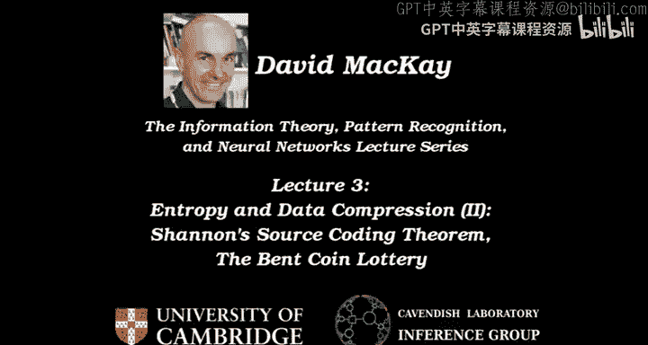

Welcome to lecture 3。 We're talking about source coding， also known as data compression。

 The big picture is in lecture 1， I introduced you to the middle of the course。 Noisy channel coding。

 Now， we're taking a step back and thinking about how to measure information content and how that relates to doing data compression。

😊，And the two topics for today are we're going to continue examining the evidence for the assertion that the Shannon information content。

 which I've written down here， is the right way to measure information content。And secondly。

 we will prove the source coding theorem that actually proves that。

The shown information content is the， is the right thing。 So we'll， we'll get evidence。 Then we'll。

 we'll sketch proof。 The details are in the。Book。So we're discussing how to compress redundant files and as a toy example of a redundant file。

You could imagine。An alphabet with just two possible characters in it。

0 and 1 generated by tossing a bent coin that has a 90% chance of coming up 0 and a 10% chance of coming up one。

 So that's an example of a very simple toy， redundant file。 And we'll talk more about that in Yukus。

The general claim is that the channel information content of an outcome is a sensible way to measure how much information that outcome gives you。

And if you take the average of the Shannon information content， you get the entropy。

 And the second claim is that the entropy is a sensible measure of expected or average information content。

We discussed last time， a first。Thought experiment。

 if you like a first case study for testing these claims about the Sha information content。

 We looked at the weighing problem。 And most people， when they try and solve the weighing problem。

 struggle a bit and think about it quite a lot。 And maybe after a couple of days struggling。

 they still haven't got the answer。And the Shannon information content gives you an idea。 It says。

 if you want informative weighings， why not choose ones with with maximum entropy。

When you follow that principle， you get a solution that gets you done in three weighings。

 It finds out of the 12 balls。 Which one is the odd one and whether it's heavy or light in three weighings。

 And that's all it needs。 And that's the best you can do。 And so it's a。

 it's a little piece of evidence that， hey， maybe this entropy thing is useful。

If you don't choose the weighing at each step that has the maximum possible entropy。

 then you are going for a strategy that does not guarantee to get you done in three， so。

It's a good idea。In that problem to think about entropy。

The third claim we're going to discuss is the source coding theorem that says that if you get get a big string of n outcomes from a source。

 then they can be compressed into roughly n times the entropy bits。So。

I asked you last time to have a think about this bent coin lottery puzzle。

We'll come back to this very soon。 The Bentco lottery involves。

Tossing the Ben coin a thousand times to determine which is the winning ticket。

 And if you own the winning ticket， you win a gazillion。And the question I asked you was。

 if the Mafia bosss tells you that you must buy enough tickets from the shop to guarantee a 99% chance of winning the prize。

 Which tickets would you buy， assuming that you try to minimize the cost of the tickets。

 They cost you a quid each。And how many tickets would that add up to。Okay。

 so we'll come back to that in a moment。 I first want to look at two slightly simpler examples。

 Two more little games to think about these claims about the Shannon information content。

 The first game is called 63， and it works like this。😊，In 63。

 I think of a number and the number is drawn from the set，0，1， dot dot dot dot 63。

 So I pick a number。 And then you ask me questions， and I say yes or no to your questions。

 And when you know what it is， you say， I know X。Thanks fun。Habitat your neighbor。

 Think for a moment。 What strategy would you use to try and identify the number I'm thinking of。

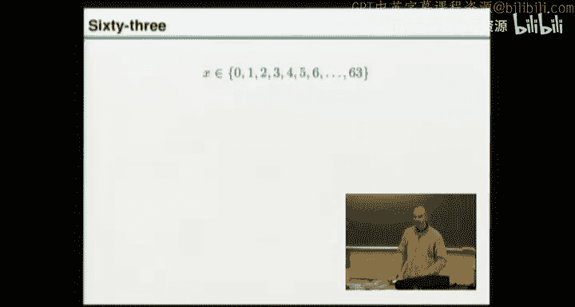

As rapidly as possible， using as few guesses as possible。

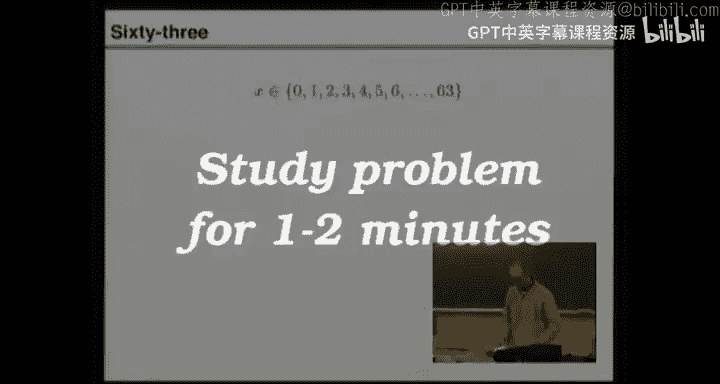

Okay， who'd like to suggest a way of。Asking asking questions to play this game。And oneish I。

You ask if nobodys in top of it。Okay， so your first question could be。

 is x bigger than or equal to 32？😊，Now。That's your first question。 And I could say。Yes。😊。

And then your next question would be。After what I was like。Okay， is it in the range 48？To 63。

 And I could say no。And you keep on halving and you're going for a simple way of halving。

 You just pick contiguous ones。 Okay， let me ask your second question for you in a general way。

 You could ask for X modo 32。That number bigger than or equal to 16。Okay， and that。

X mod of 32 means throw away 32 if it's bigger than 32。 And this is telling you。

 is it in the top half of what's left。 Alright， so the answer to the first question was yes。

 which I could call1。 the second question was 0。Third question is going to be， is X。Modully 16。

 bigger than or equal to 8。I could say。Yes。And then he'd ask。Is x modulo 8。B governor equal to4。

And I might say， no。Okay， and you keep on going and going and you ask this one。I'm going to say yes。

When you put X modular 4， it's bigger than equal to 2。 Then youre ask me about X modulular 2。

 which is the same as asking， is it an even or an odd number yeah。And I might tell you， no。

 and now what you do。Yeah。Okay。And we're done。 And the answer is x is 42。

 because what you've noticed here is 1，0，1，0，1，0 is 42 in binary。😊，Okay， anyone got any comments。

 questions， is everyone with me。Okay， so we've got a solution to the game of 63。

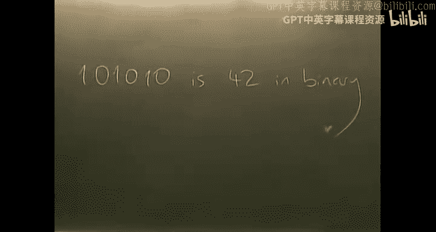

And an observation we can make is that。If you want to be sure of identifying an outcome in this alphabet here。

Then it will take you six binary questions to be sure of identifying it。

We could also have a think about these claims about。 What's the Shannon information content。

 Let's call the answer to the first question。 C 1， C 2， C 3， C 4 and so on。

 Are the answers to each of these questions。What was the Shannon information content of each of these answers。

Well， each time you ask the question， the I question。You didn't know what I was thinking of。

 So it was 50，50。What the answer would be。So the Shannon information content of that outcome was log based to one over the probability of the outcome。

 which was a half， whatever happened。So that's log 2。is one big。So the total information content。

 according to Shannon， that you got total。Shannon。Information。Content。That you gained。

Throughout the whole。Trilling game。With 6 bits。And。The string of answers that you got。See，1，2，3，6。

Is an encoding of x。And we could give that a name。 We could call it C of X， if we wanted。

 So that's the the string of 6 bit。 So C of 42。Was 1，0，1，0，1，0， so。We're making a connection to。

pression because if you get an outcome， you can compress it into 6 B and 6 B is the shown information content。

 And it's all making sense。 There's nothing very surprising happening here。Okay。

 so this is very weak evidence for the idea。 Yep， sharing information content is looking promising。啱。

Why was it a good strategy to split it in 2， split everything in2。 Some people say， oh。

 why don't you ask first， is it a prime number。Why is it a good idea to split exactly in 2。

It's got maximum information content， maximum expected information content。

 If you asked any other question， the probabilities wouldn't be half half And Shannon would say， hey。

 you're not getting as much expected information as you could。

 There's a chance The answer might be in the big set out of the two that you're creating。 In fact。

 it's better than 5050 chance。 Itll be in that set。

 And then you're gonna need more than the remaining， whatever it would have been five questions。Okay。

Let's ask you one more question based on this game and then do another game。Alright。

 so here's the question。If I've got a set with S possible outcomes in it。

 how many bits long must each name be if every outcome is gonna have a unique name。 Okay。

 so the question here is， I have got a draw full of。

Underwear at home。

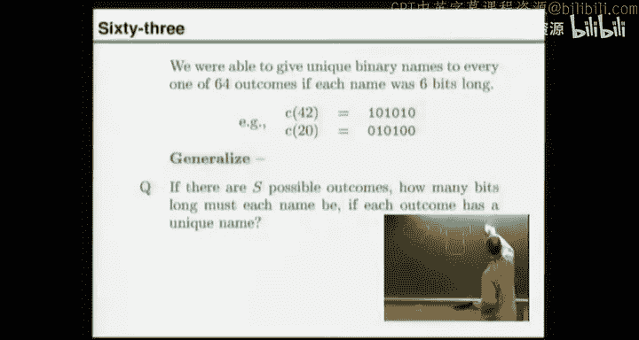

And I want to be thorough and systematic and give every one of these a unique name so I can record on Facebook。

 which clothing I'm wearing today。So I'm going to write little names on them。 And the question is。

If I'm going to post on Facebook， the。

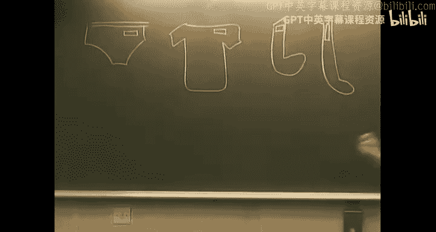

Binary name of each of these items。 And if there are。Capital S， different pieces of underwear。

 How long does each of these binary names have to be。

 assuming I give them all binary names of the same length。Have a chat your neighbor。Okay。

How long do my labels need to be to label my underwear。An outcome from the set can be encoded。

 can be communicated in how many bits。Yeah。No face too。Logway 2 of S。 any advance on that。

 Any alternative answer。That paused a bit。 We've got to round it up a bit in case this isn't an integer。

 Lo of 64 was 6， which was nice and convenient。 In general， log of sort of 67 or something。😊。

We'll have to round it up a bit。 So maybe you need to go up by almost one。 And we call that ceiling。

 So this simple hair means ceiling。Which means take this number and round it up to the nearest integer。

Okay， so log S is definitely the spirit of the answer we're after。 And if we're being obsessive。

 we ceilinging log S just to make sure that we're。😊，We've got the right integer。Okay。

So an outcome from a set of size S， if you give them all names of the same， same binary length。

This outcome can be communicated in log base 2 S。Bits。Brell。Okay， time for another game。

This is a game based on battleships， but a slightly more boring game have。

 I have to admit than battleships。And it's called submarine。And submarine。

 one submarine is hidden somewhere in the ocean， and then you have to start firing at it。

 just like in battleships to try and find the warm submarine， okay。

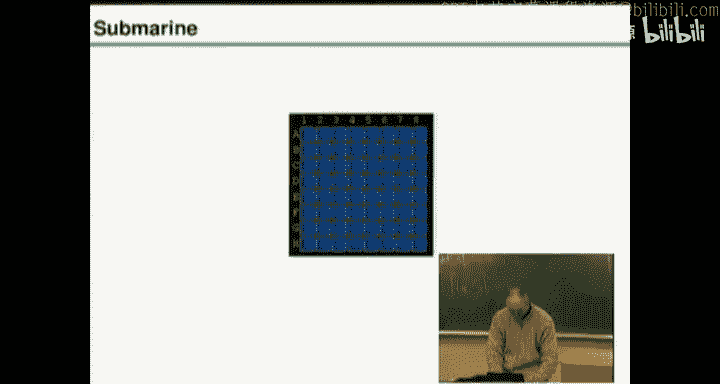

So， let's run submarine。Here it is。So let's have a game， shall we？

 And I've built in some Shannon advice so that we can see for every possible thing we could do here。

 You can fire at any square。 it tells you what the probability of getting a yes is that you've hit the submarine。

 The submarine is just one square out of 64。 and the probability of no is 63 over 64 for that square。

 And it's 63 over 64 for this square。 and it's 63 over 64 for this one。 Alright。

 so they're all the same because we don't know where the submarine is。 Okay， So off we go。

 shall we fire at the square bomb。 and it were keeping track what was the probability of the outcome that happened。

 I fired。 and I got green， which is no， no submarine。 The answer for that first outcome is。😊。

The probability that response number one was no。Withs 63 over 64。😊。

So the Shannon information content of that first。Now come is log base 2 of one over that。

 which is log base 2，64 over 63。Alright。And that's this slightly bizarre。Number here，0 point。0，2，2，7。

So what's going on， We've looked at sort of trivial examples， weighing problems where， of course。

 you want it to be a third or third or third。 Once you think about it。

 We looked at identifying underwear with binary strings or a game of 63 we keep on coming up to 550。

 And now I'm saying， what about a world where probabilities are uneven。😊，Shannon says。

 when you fired at that square and got， no。You got this much information， point0227 B。And。

It's not obvious that that's right。 Is it， Okay， so let's carry on playing and see what happens。

we go。 So far at this square。 Now， the probability of getting a yes is one over 63， yeah。

And the probability of a no is 62 over 63。 Sha we fire， boom， What happened。

The probability of getting a no， which is what happened。Was。62 over 63。😊。

The shaman information content was logged based to of that，63 52， which was。Slightly more。😔，No point。

 no，4，5。 sorry， no point。Not。2。3， and the right hand column is keeping track of the total information we've gained so far。

 let's。Write that down。嗯，是哦。So total information gained so far is log B 2，64 over 63。😊。

Last look me too。63 over。62。We carry on playing。Okay。So I write down all of these。

 Maybe it would be quick if I just to keep going for a little while。

 We could go back and try and fire at this square， but the probability of getting a no is one。

 and the probability of yes is0。 and that would give us no information content。

 so we can try and nothing happens。😊，Okay。But we can carry on。But。Okay， what's happened？ I' fired at。

Half of the squares。And what's happened to the Shannon information content when you add it all up so far。

 I've got lots and lots of no。 And then the final one that I've just asked was Lo 33 over 32。

 the amount of Shannon information content we just got。 And the total so far。

 we still haven't found the thing。 but it adds up to one。😊，Bit， oh， that's interesting。1 bit。

 So what's going on。Well。It's a bit like playing 63。And choosing to ask as your first question。

 is the number one， sorry， I it 0， Is it 1。 Is it 2， Is it 3。

 So we're going for a very silly strategy in 63， and we get all the way through。 Is it。

 is is it up to 31。😊，And the answer is， no， it's not 31。And you've got the great string of answers。

 And that's just the same as asking， is it less or equal to 31。😊，Which gave us one bit。

So this is consistent with what we already thought was completely obvious。Alright。

 so that's promising。 This lot has added up to。1 bit of very painfully acquired information content。

 but it makes complete sense。Okay， shall we carry on。T。Oh， we hit it。That was a surprise， okay？😊。

And what happened？Last log。32 over 31 plus up。 And what attempt was did this actually happen at？Well。

 we would just about to expect another no， which would have had a probability of 19 over 20。

The latest thing we just did that got to know was had an information content that log 21 over 20。

But then amazingly， we got a sudden enormous slew of bits， according to Shanon。 We got 4。

3 B of information content， all of a sudden。😊，That seems a lot of bits。😊，And whats it all add up to。

 Ohh， look。So experts。It adds up to 6 B。 We've found the submarine。 We found which number out of 63。

The computer was thinking of。 and why did it come to such a beautiful round number， as that。

Some special coincidence。 Or does it always happen。 Well， let's just。Check our arithmetic here。

 You can cancel this and this and this and this and this and this。And。

This and this and this and this and this them and this and this and this。

 And so the answer is always gonna come out once you found。The submarine put a lot place， too。食屎科。

Which is6 bits。Okay， that's no proof。 But it's a nice little bit of evidence that maybe this log of one over P thing。

 which looked a bit strange at the beginning。 Maybe that is the right way to measure how much information you get when something happens。

Do you want to play again。Maybe not。 I think we've got the message。 Any questions。Okay。

So that's submarine。 Now， let's do the Benco lottery。So the question is， the Mafiw bosss tells you。

To buy tickets。The outcome is going to be the string that is obtained when the coin is tossed 1000 times。

 It's the bent coin。Rare heads and common tails， lots of zeroes， very few ones。

You can buy any of the tickets you want from the box office。If you own the winning ticket。

 then you get a gazillion pounds。And the Mafio boss forces you to buy。

Lots of tickets in order to have a 99% chance。 And here are the questions I'm gonna ask you now。

 first， if instead， the rule was you're just being forced to buy one ticket。

 So you've got a pound and you're forced to go and spend it。

 Which ticket would you buy to have the best chance of winning。

 Then question 2 is gonna be to have a 99% chance of winning。

 Which tickets would you buy and how many tickets is that。

 And please express your form in your answer in the form 2 to the power of something。 Okay。

 so that's three questions for you。 Please have a chat with your neighbor and answer all of these questions。

😊，I'll wipe the board。

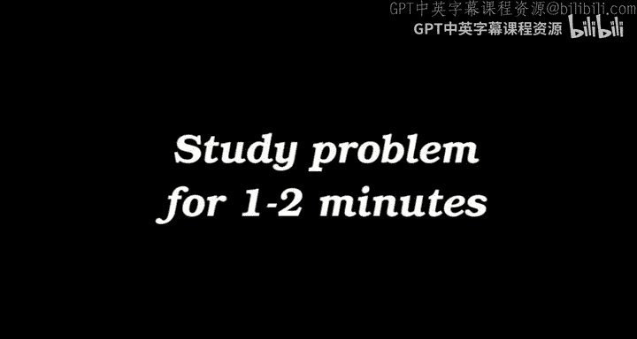

Okay， let's start with the simple question。 You're forced to buy one ticket from the shop。

Which ticket would you buy？Anyway on。The all zeros ticket。Is one answer。

Anyone want a different ticket。Really？Yeah。One with 900 zeros。And 100 ones。Okay， so。

This the old zeros ticket。And which one would you， would you buy。Which of these？ランドもね。You don't mind。

 Okay， so I'll pick one for you。 I'll pick this one。Okay。

Are you happy with this choice or would you like a different one？It's up to you。Yeah。

 just probably one that has。Was。You'd let the most spread out， okay？Okay。

 I'll give you one where they most put out。Okay， we could sort out the details。

But we would come up with a particular answer where they're spread out until you say you're happy。

 And then we sell it to you for a pound， okay。Good。

 let's run the lottery now and see which of these tickets wins。 So we've got a choice of three。

 We could call this ticket A。 This is B， and this is tickets C。😊，So I've got a computer here。

 and computers are great at running lotteries。😊，So。No more submarine。

Here's the source code for running a lottery。You pick N。

 you set F and you do a loop n times spitting out zeros and ones。 Okay， trust me。

 it's the includess right。 And then we're gonna run it。

 run the lottery a thousand times to see who wins。And to make it a little bit faster。

 because you might anticipate that it would take a long time to actually run this lottery。

 might have to do many thousands of simulations before we got any winners。 I'm gonna change N。

 I'm gonna change N to 20。😊，And， I'm gonna use the same bent coin。 Alright。

 I'm gonna take the liberty of updating the answers you've given me。 So group A。

 who like the all zeros ticket。😊，Are choosing the zeros ticket still。

Group B are voting for the one that has two ones， immediately followed by。18 zeros。Okay。And group C。

 this is your chance to say what you want。 You can read it out to me， if you want。

I'll make it up for you， and then you can say if you want a different one。Squeak， sak， sak。

Is that al right。That won。H okay， it's got two ones in itca you wanted 10% ones and you wanted them spread out。

 Do you want a different one。 We're about to run the lottery。 This is your chance。 Okay。

 and the winner gets a chocolate biscuit。😊，But you're not allowed to eat it in the lecture theatre。

Okay。I'm going to keep running it， in fact， because if we just had a winner， you'd say。

 that was the luck of the draw。 So I'm gonna run it until someone has won 10 times。 Allright。

 And then we'll see how everyone else did。So， yeah， let's see。 you wanted a， right。

 So this group cheers for A， this group we cheers for B。

 and you can cheer for C whenever they happen。 Okay。

 and we'll keep count until someone has won 10 times。 Are you ready。😊，嗯哼哼。So we run the demo。

 we get a warning about variable names。 And then off， we go。 So there's the first one。Alright。

 no one chairs because no one got it right， okay。Second loy ticket。 Oh，31s。 Goodness me。😊，Okay。O。

 one， long。 That was the first one。Okay。Mh。Oho， what a lot of ones。Re， okay， so keep count。

 You're keeping count。 Alright， you've had one win for， for ticket A。😊，There's one with two ones。

 That one's got two ones。Lo of ones。 That was two ones， but it's not that ticket。One's got two ones。

Reay， second win。😊，That one's got 1，1。 This has got 3。 This has got 2。 This has got 3。 That's got 2。

2，1，1，1，1，1。嗯，能。3 ones，4 ones。To。R， how many of you want so far， Group A。3 wins。 Well done。

But you're just lucky on you。Great cheer。 You've got four。 Okay。

 they're hardly ever winning aren are they， It's very improbable。 The one they chose。

 but they seem to be in the lead。😊，Okay。Oh， that was so close。1，1。 Did you see that， Oh。

 but it had an extra1。 Oh， no。Okay， that was six。7。And to the。How many have you got now？9。嗯哼哼嗯哼。😊，对。

Okay， so what happened？ We've had 10 wins for this ticket。

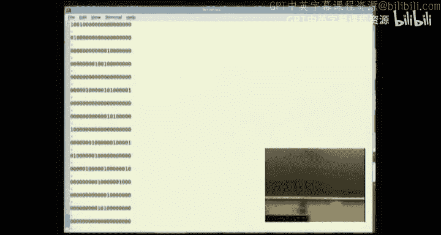

No wins for this one and no wins for that one。All right， so what was the right answer。

Looks like a was a good choice， right， The all0 ticket is the most probable ticket， there's。

A much higher chance of two ones coming up than this very improbable thing， having no ones at all。

 So that intuition is absolutely right， that you're not expecting the all zero ticket。

 You are expecting typically two ones plus minus something。

 But the most probable ticket is the all zeros ticket。 Alright， So what was question。2。

 if you want to have a 99% chance of winning at lowest possible cost， which tickets would you buy。

 Have another chat to your neighbor。And we're going with n is 1000 again。Okay， are we ready。

Here are the chocolate biscuits。 These are an incentive for talking。

 So whoever suggested deal0 ticket gets one at the end。And now。To have a 99% chance of winning。

Which tickets would you buy， Speak up。对。关。Okay， so you'd buy the all zero ticket。Oway。1，0 tickets，1。

0。T kids。汪旺。Well， then all the one， one tickets， all the。2，1。Tickets。And。Okay。

 which is where how I already said you've got to have a 99% chance of winning。

So give me a bit more information。Okay， so're going to add up the sum。

 And what do you anticipate is going to be。Let's call it all the R max。1。Tickets。

 so I'm introducing a variable name now。 I'm gonna call R the number ones that happens when the lottery actually runs and。

You're going to buy all the RX1 tickets， all the tickets that have RX。😡，Ones on them。 Roughly。

 what do you think R max needs to be if you do that calculation you described involving a sum of。

Probabilities from what distribution。B name of distribution， again。Good。Roughly what Ammex。

Something like two to the 100， the baby。Okay， so you're telling me the number of tickets that you'd need to buy。

 I'm asking， what does Rax need to be， sorry。Hundred and 20 is。Okay， so。Why 120 is。あてビ。Of R。

 the standard deviation of R， the number of ones that we get。 Okay，And the two。Yes。Okay。

 so you went for two standard deviations。Around the mean， the mean number of ones is 100。

And the variance。Is N。F 1 minus F。Which is 1000。Times0。1。Times4。9， which is roughly 100。But。

 it's actually 90。And you take the square root of that， which is roughly 10。 So sigma。

 the standard deviation is 10。 And so if you have two standard deviations。

You need to go 20 either side。 So you're making a bet that where the probability of 95% or so the number of ones is going to be。

100。Give or take 20。 So it's gonna be between 80 and 120。

And we already know that you ought to buy the old zeros ticket， even though it's very unlikely。

 So buy everything down there as well， because that's good value for money。

 But you stop once you get up to hundred and 20。And that'll give you a chance of winning of roughly。

 what's the probability that a normal variable。Is within two standard deviations。

Of the mean is one sigma。Here's two sigma。The probability there is。95%。So there's 95% in there。

 And we've already bought this tail out here as well。

 because it is the the freaky lots of zero tickets that are the best value for money。

 So the probability thats。😊，And。This tail is 2。5%。 And so the total probability you've got there is 97。

5%。Roughly， if you buy all of these tickets， all the。Suggesting all the 120 one。Tickets， alright。

 to have a 99% chance， you need to go a little bit further， but we're in the right ballp。

 It's 100 plus a small number， compared with 100。Okay。So we've got a strategy。

 And I think we're understanding why it's a good strategy。

 And now we need to know how many tickets is that。 So if you buy this many tickets。

 how many all zero tickets are there There's one， How many one。1， tickets are there。

There's1 thousand， right？How many21 tickets are there。Thousand， choose two。

Which is more than 1000 by quite a large factor。And so for how many hundred and21 tickets are there。

 the number of them is。1000。Choose 120， yeah。So， the number of tickets。B。Is  one plus 1000， plus 100。

 choose 2 plus dot dot dot dot dot plus 1000。 choose 120。 And in the middle here。

Was the most probable value of R， which is 100。Okay， and the question is。

 is that something like 2 to the power 100 or not。Okay， there's a big question mark here。

 because this may be wrong。Have another chat to each other。

Which of these terms in this sum is the biggest。And what's a good approximation for it。

 Is it 2 to the hundred or is it something else。

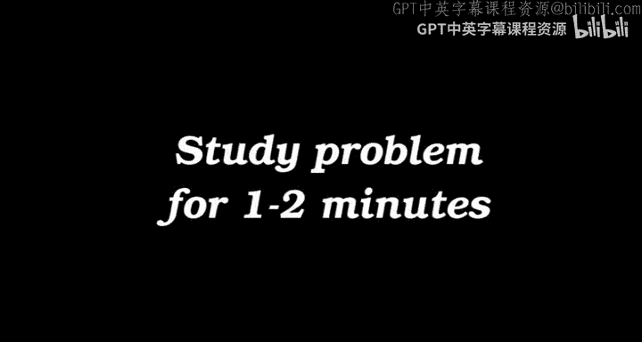

Okay。I've slightly corrected the answer we had a moment ago， because remember。

 buying everything up to the 1 hundred 21s tickets only got you a 97% chance of winning。

 And the rule was you've got to have a 99% chance。 So I've gone up to。

All the tickets that have 1 hundred 23 ones on them。 Okay， because I've done the sal and that's 2。

3 standard deviations。 And that's what you need。 So in this series here， this sum of terms。

 which is the biggest。😊，And roughly， how big is it。First， which is the biggest。The right one。

Any alternative answer， Anyone think it's not。Who thinks it is。Okay， and other people are not sure。

 Okay， so this is the right answer。 If you plot a graph of n choose R。

 which is that first factor in a binomial distribution as R goes from 0 to n。

 it goes and becomes extremely big and then comes back down again and it's biggest at n over 2。😊。

And we're talking about the first two terms up to here。

 and they're getting steadily bigger and bigger and bigger。

 But you can hardly see them on this graph。 But anyway， yeah， they。

 the last one we just bought was here。 If we zoom in， they're going up like that。😊。

And that's the last one。 It's the biggest。 Okay， how big is。This one roughly。

 this is roughly2 to the power of something。 and how big。Heres this in the form。To to this something。

 And since this is the biggest， we don't really care about any of these。

 We just want to know what's that number。 But let's start with this one first， because that's。

Perhaps a little bit more familiar。Roughly， what's 1000。 Choose 100。Anyone。退出拍啊。800 and something。

Where did you get that from。Approxmating。Okay， so you approximated n factorial over。N minus R。

Tactctorial。A factorial。Okay。It's quite tricky the first time you do it。

 maybe to approximate factorials and get things right。 So this ain't actually right。

 but you're doing exactly the right thing。 Any other answer for。😊，What。

What happens when we approximate。Yes dude。Okay。500 is。 Where do you get 500 from。Okay。

 so you're saying it's two to the n times the entropy。Of the distribution。t1， comma， note 。9。

Is that why you wish。 Okay， so good。Let's check the book。Which I have encouraged you to read。

And we go all the way into the book to page 1。And page 1 says。The binomial distribution。

 And it talks about how to approximate the binomial distribution。

And it has the approximation for N choose R。 Okay， and it is indeed。

And this is a homework problem for you。To confirm that log of this thing。

Is well approximated by and times we call it the binary entropy function of R over N。All right。Good。

S。What we have here。This one was about 2 to the 500。 It's actually more like 2 to the 4，70。

 This one's a little bit bigger than 2 to the 500。 It comes to 2 to the 530。And in general， if it。

 if this had been the general。Length n lottery， rather than the 1000 lottery， then。

The number of tickets you would have had to buy。To have a 99% chance for general N and F。系。Is。

To have a 99% chance， you would buy one plus dot dot plus and choose。F N plus a little bit。

And the little bit is something along the lines of F times 1 minus f。

Times n square rooted with some factor out front， like 2。

3 to make sure you've got enough standard deviations。That many tickets。

 which is approximately2 to the par and。Times。The binary entropy of。哎。Plus， something small。

That's something。That scales as the square root。All right。S。We've done some counting。 Yes， question。

Okay， the mafia boss gave you instructions。 The question is。

 why do you want to have the lowest possible cost。 That's because it's the rules given you by the mafia boss。

 He's paying for the tickets。 He wants to minimize the cost。 Every ticket costs 1。 And he says。

 spend the smallest amount of my money， or I will kill you。 And we must win the lottery。

 or at least haven't proved to me that we have a 99% chance of winning， or I will kill you。 Okay。

 so that was the rules of the game。 And now having followed his instructions。You get home。

 and you have bought。WithWith many tickets，2 to the power，530。Tickets。Okay。And now。

 now we're going to use that result of how many tickets you've bought to give a sort of quasi proof of the source coding theorem。

😊，Okay。When you take those tickets home， let me draw a picture of what you've got。

You've got yourself。A big bag。For the tickets。And every ticket has a great long string of ones and zeros on it。

 and most of them have about 10% ones。😊，Okay。And it's a very large bag full of tickets。

 And being a methodical sort of person， you decide to give every one of these tickets a shorter name。

So you take every ticket and you turn it over。 And on the reverse side of that ticket。

You write a shorter name。😡，Which are're going to write in binary。 So the first one you might call 0。

0，0，0。 And once you've numbered all of them， you turn over a ticket and you've got its new replacement name。

 which will be a shorter name。😊，Of some length。How。You're with me。

 This is just because you're methodical。 It's like me and my underwear。 You take all your tickets。

 You turn them all over and on the back， you're gonna to write a unique name for each ticket。😊。

So that when the winning ticket comes along， you have a nice short name。

 and you can post on Facebook。 The winning ticket had this name written on its reverse。Okay。

If you do that。How long is each of these short names going to be on the reverse of the ticket。两。

500 taken。Okay， so because there's about to to the 500 tickets in your bag。

The length that this needs to have is in a set of size 2 to the 500。

 The length it needs to have is the ceiling of 2 to the 500， which is 500。So this is roughly 500。

 Actually， we had to buy。D to 530 tickets。So in this particular case， it's 530 bits。Long。

 so what's the situation。 The front of the ticket has X on it。 The outcome that might happen。

And that's 1000。Thats long。The reverse has got a short name，530 B long。And now， what have you got。

 You've got yourself a practical compression。System for the bent coin。

You've got a compressor and you've got an un compresspressor。😊，How does it work， Well。

 the compressor works like this After you've won the lottery for the the Mafia boss。

 you pay him the zillion pounds， and then you keep the bag because the bag is your compressor。

 And the way it works is whenever someone creates a file using an bank coin。也未经出版。

And you find in the bag the winning ticket， which you're almost certain to have in there，99% chance。

 yeah。You find the winning ticket， you turn it over and you write the short name and store that on the diskri。

And then when someone says。Tell me that file that you compressed for me。

And they give you the zip file。 They are telling you the short name on the back of the ticket。

 And you say， okay， yeah， give me the file and you look in the bag and you look at the back of every ticket until you find the one with that compressed name on it。

 And you turn it back over and you say， here's your uncompressed file for you。 And you read it out。😊。

Okay。So what we have shown is we can make a compressor and an uncompressor。

 It's got a 99% chance of working。😊，Which isn't perfect。So that's pretty good。

 And we could have made it 99。9， just by fattening that standard deviation a little bit。

 And the compressed length still would have been 500 plus a little bit。 Yeah。

 because it's the little bit is just scaling as the square root of n。 And that's relatively small。😊。

So what have we shown， We've shown that N outcomes from the bent coin。

Can be compressed into roughly N times the entropy of0 。9，0 。1。Bits。We can compress。Now come。

With very high probability into。This many bits。 And there's a little sort of star here that says batteries is not included。

 Con apply。 You've got to deal with the square root of n bit。 But roughly it's n times the entropy。

 which is the source coding theorem。 And as N gets big。

 it becomes an increasingly accurate statement。 Okay， so there's the source coding theorem。😊。

We can compress N outcomes into roughly N H bits， And we prove this by counting the typical set。

 The book contains the general rigorous proof of the source coding theorem for a general source。

 not just the bent coin。 So have a look at Chapter 4。 If you want to see the full proof。

 And the general definition of what we call typicality。 I've introduced this term the typical set。

 the typical set for the bent coin， is all these outcomes hereabout which we expect to see most of the time。

 So it goes down a couple of standard deviations and up a couple of standard deviations。😊，So。

This is the typical set， and the proof of the source coding theorem depends on defining typicality and showing that when n is very big。

 what usually happens is almost always typical。Next lecture。We're going to discuss。

More practically how to do compression， Because you may be aware of the fact that 2 to the power 500 is substantially bigger than the number of electrons in the universe。

 So this， I call this a practical compressor。 Well， it's not really practical。

 And in the next lecture， we're going to start talking about real practical compression systems for trying to get close to what the source coding theorem proved is possible。

😊，And I'd like to give you a project。 So you're thinking about this task already before I tell you the answer。

Or the answers。The project is， please invent a compressor and an un compresspressor。

Which is a practical pair of systems， assuming that we've got a source file now of length 10000。

 So a little bit longer。 And let's assume it's a bentco with the probability of 1% of coming out1。

 Alright， and I'd like you to implement your compressor and your uncompressor on a computer。

 And or estimate how well your method works。 I think this is a valuable exercise for you to do as we move on to discussing practical compressors。

 Here are some recommended exercises and reading from the book。😊，Thank you very much for coming。

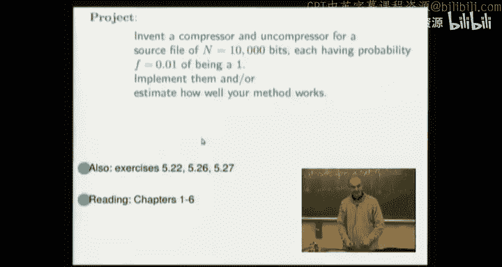

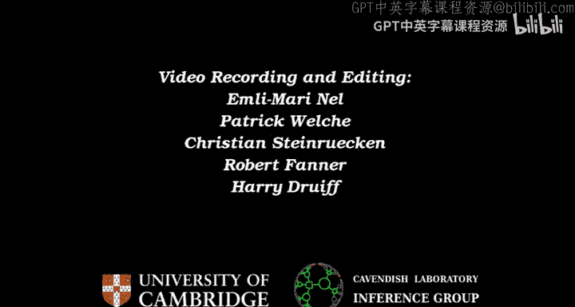