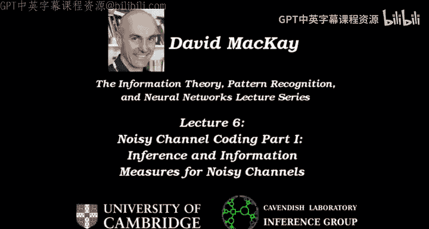
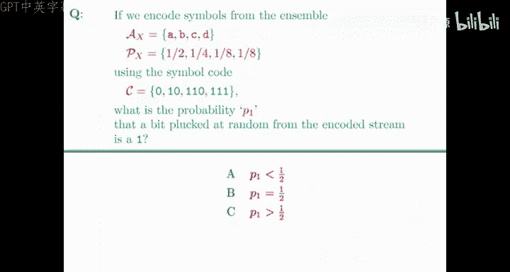
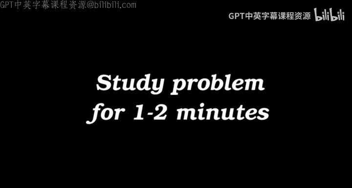
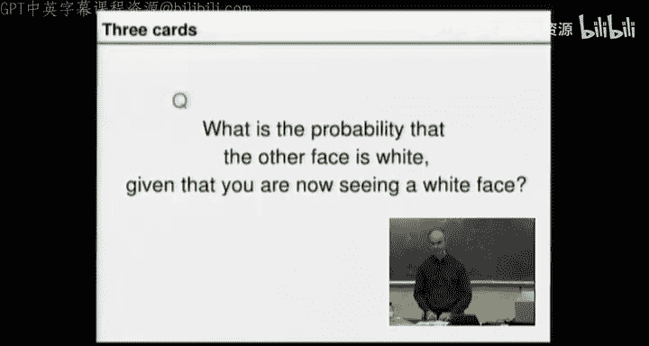

# 信息论、模式识别和神经网络：06：有噪信道编码（一）：推断与信息度量

在本节课中，我们将首先回顾数据压缩的内容，然后回归信息论课程的核心主题——有噪信道编码。我们将从信道编码的基本问题出发，探讨如何通过推断来理解输入与输出的关系，并学习如何为联合概率分布定义关键的信息度量。

---

## 数据压缩回顾

上一节我们介绍了符号码和算术编码。符号码（如霍夫曼编码）的期望长度在熵的1比特范围内，但对于熵值很小的信源（如英语），这种开销可能过大。

算术编码提供了一种更优的解决方案。它将整个文件视为0到1区间上的一个实数，其编码长度可以逼近整个文件的信息量，通常开销仅为2比特，远优于符号码。

在实践中，像PPM这样的先进压缩器通过统计上下文（如前几个字符）来预测下一个字符，从而实现高效压缩。它仅基于已见文本来动态学习统计规律。

算术编码还有另一个重要应用：高效生成随机样本。例如，要模拟一个偏置硬币（正面概率为0.01），传统方法使用32位随机数生成一个样本，效率低下。而算术编码解码器可以将随机比特流（视为0到1区间上的随机点）解码为服从目标分布的样本序列，所需平均比特数仅为该分布的二进制熵，效率显著提升。随机比特是有价值的资源，因此这种高效方法很重要。

---

## 推断问题引入

处理有噪信道时，核心任务之一是**推断**：根据观测到的输出来推测可能的输入。为了建立对推断的直觉，我们先看一个简单的概率问题。

### 三张卡片的谜题

有三张卡片：
1.  两面都是白色（W/W）。
2.  两面都是棕色（B/B）。
3.  一面白色，一面棕色（W/B）。

随机抽取一张卡片并随机放置，你看到朝上一面是白色。问题是：**另一面也是白色的概率是多少？**

以下是推理方法：
*   **错误直觉**：可能抽到的是W/W卡或W/B卡，两者似乎等可能，因此概率为1/2。
*   **正确分析**：需要写出所有变量的联合概率。定义“正面”和“背面”颜色。在抽卡前，联合概率为：
    *   P(正面=W， 背面=W) = 1/3 （对应W/W卡）
    *   P(正面=B， 背面=B) = 1/3 （对应B/B卡）
    *   P(正面=W， 背面=B) = 1/6 （对应W/B卡，且白面朝上）
    *   P(正面=B， 背面=W) = 1/6 （对应W/B卡，且棕面朝上）
*   给定观测数据“正面=白色”后，我们在这个条件下重新归一化概率。可能的世界只剩下第一项和第三项：
    *   P(背面=W | 正面=W) = (1/3) / (1/3 + 1/6) = (1/3) / (1/2) = 2/3。

因此，另一面也是白色的概率是 **2/3**。一个更直观的理解是：在多次游戏中，当你看到白色正面时，有2/3的情况卡片两面同色（即W/W卡），因此背面也是白色。

这个例子表明，即使对于简单问题，直觉也可能出错。可靠的方法是：**写出所有变量的联合概率，然后根据观测数据进行条件化**。

---

## 联合概率分布的信息度量

为了分析有噪信道，我们需要处理输入X和输出Y的联合概率分布。本节我们以一个具体的联合分布为例，定义并计算各种信息度量。

假设两个随机变量X和Y，取值范围均为{1， 2， 3， 4}。其联合概率分布如下表所示（括号内为概率值）：

| X\Y | 1         | 2         | 3         | 4     | **P(X)** |
| :--- | :-------- | :-------- | :-------- | :---- | :------- |
| 1    | 1/8       | 1/16      | 1/32      | 1/32  | **1/4**  |
| 2    | 1/16      | 1/8       | 1/32      | 1/32  | **1/4**  |
| 3    | 1/16      | 1/16      | 1/16      | 1/16  | **1/4**  |
| 4    | 1/4       | 0         | 0         | 0     | **1/4**  |
| **P(Y)** | **1/2**   | **1/4**   | **1/8**   | **1/8** | 1        |

### 边际熵

首先，我们可以计算单个变量的熵，称为**边际熵**。
*   X的边际熵 H(X) 是其边际分布 P(X) 的熵：`H(X) = Σ_x P(x) log₂(1/P(x)) = 7/4 比特`。
*   Y的边际熵 H(Y) 是其边际分布 P(Y) 的熵：`H(Y) = 2 比特`。

### 联合熵

将配对(X， Y)视为一个随机变量，其**联合熵** H(X， Y) 为：
`H(X， Y) = Σ_{x，y} P(x， y) log₂(1/P(x， y)) = 27/8 比特`。

### 条件熵

我们可以计算在给定Y取某个特定值y时，X的条件分布熵，记为 H(X | Y=y)。例如：
*   给定 Y=1， P(X|Y=1) = (1/2， 1/4， 1/8， 1/8)， H(X|Y=1) = 7/4 比特。
*   给定 Y=4， P(X|Y=4) = (1， 0， 0， 0)， H(X|Y=4) = 0 比特。

**条件熵** H(X | Y) 是这些特定条件熵在Y分布上的平均值：
`H(X | Y) = Σ_y P(y) H(X | Y=y) = 11/8 比特`。
同理，可以计算 H(Y | X) = 13/8 比特。

一个重要定理是：条件熵永远不会大于边际熵，即 `H(X | Y) ≤ H(X)`。获得关于Y的信息，平均而言不会增加我们对X的不确定性。

### 互信息

**互信息** I(X; Y) 衡量了X和Y之间的依赖程度，即通过观测Y所能获得的关于X的信息量（反之亦然）。它可以通过几种方式计算：
*   `I(X; Y) = H(X) - H(X | Y)`
*   `I(X; Y) = H(Y) - H(Y | X)`
*   `I(X; Y) = H(X) + H(Y) - H(X， Y)`

对于本例，`I(X; Y) = H(X) - H(X|Y) = (7/4) - (11/8) = 3/8 比特`。

### 信息关系图

这些信息量之间的关系可以用一个清晰的韦恩图来表示：
*   整个椭圆区域表示联合熵 H(X， Y)。
*   左侧圆圈表示 H(X)，右侧圆圈表示 H(Y)。
*   重叠部分即为互信息 I(X; Y)。
*   左侧非重叠部分是条件熵 H(X | Y)，右侧非重叠部分是条件熵 H(Y | X)。

它们满足链式法则：`H(X， Y) = H(X) + H(Y | X) = H(Y) + H(X | Y)`。

---

## 连接到有噪信道

上一节我们定义了联合分布的信息度量。对于有噪信道，其本身只定义了一组**条件概率分布** P(Y | X)，即给定输入时输出的概率。

为了应用上述信息度量，我们需要在输入上引入一个概率分布 P(X)，从而与信道条件概率共同构成一个联合分布 P(X， Y) = P(X) P(Y | X)。

一旦定义了联合分布，我们就可以计算其互信息 I(X; Y)。这个量至关重要，因为它表征了**在特定输入分布下，信道能够可靠传输的平均信息速率**。

在接下来的课程中，我们将利用这些工具，探讨如何通过信道编码来逼近这个最大可能速率，从而实现可靠通信。

---

本节课中，我们一起学习了如何通过概率论进行基本推断，并深入探讨了联合概率分布的各种信息度量——边际熵、联合熵、条件熵和互信息。理解这些概念是分析有噪信道容量和设计信道编码方案的基石。