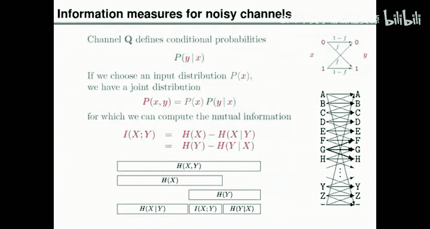
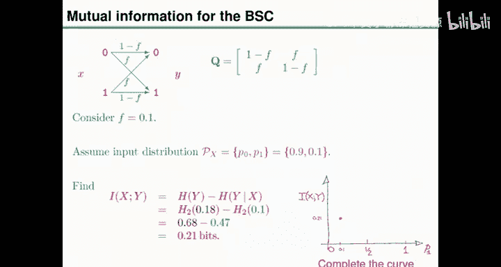
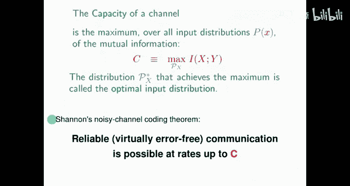
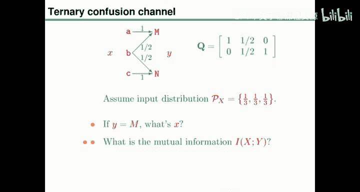
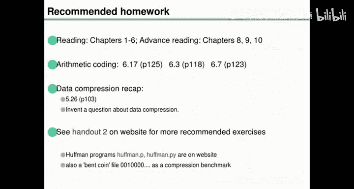

# 信息论、模式识别和神经网络：07：有噪信道编码（二）—— 有噪信道的容量 🧠


在本节课中，我们将学习如何对有噪信道进行推断，计算其信息度量，并最终引出信道容量的核心概念。我们将通过具体的信道例子，如二进制对称信道，来理解这些理论如何应用。

---

## 回顾：推断与信息度量

上一节我们介绍了如何对一对相关的随机变量进行推断和计算信息度量。推断的通用规则是：写下所有事件的联合概率，然后根据已知信息进行条件化。这通常表现为贝叶斯定理的形式。

以下是应用贝叶斯定理的通用步骤：
1.  写出假设的先验概率。
2.  写出在给定假设下观测到数据的似然概率。
3.  将先验与似然相乘，并除以观测数据的概率（归一化常数），得到假设的后验概率。

在信息度量方面，我们定义了联合熵、边际熵、条件熵以及互信息。互信息是衡量两个随机变量之间依赖关系的关键指标。

---

## 有噪信道模型

现在，我们将这些概念应用到有噪信道上。一个信道本身只定义了一组条件概率。为了得到联合分布，我们需要引入一个输入分布。这样，我们就可以讨论输入和输出的联合分布，并进行推断与信息度量计算。

以下是几个典型的有噪信道模型：
*   **二进制对称信道**：以概率 `F` 翻转比特。其转移概率矩阵为：
    ```
    P(Y=0|X=0) = 1-F, P(Y=1|X=0) = F
    P(Y=1|X=1) = 1-F, P(Y=0|X=1) = F
    ```
*   **二进制擦除信道**：以概率 `F` 将输出变为一个表示“未知”的特殊符号（如问号）。
*   **Z信道**：发送0时总能正确接收；发送1时可能出错。
*   **有噪打字机**：输入为27个字母键，每个键的输出可能是其本身或相邻的两个字母（循环对称）。



---


## 信道推断示例

让我们以翻转概率 `F=0.1` 的二进制对称信道为例。假设我们选择的输入分布为 `P(X=1)=0.1`，即我们发送的大多是0。

当我们观测到输出 `Y=1` 时，可以利用贝叶斯定理推断输入 `X` 的概率：
*   后验概率 `P(X=1|Y=1) = 0.5`
*   后验概率 `P(X=0|Y=1) = 0.5`

当我们观测到输出 `Y=0` 时：
*   后验概率 `P(X=1|Y=0) ≈ 0.012`
*   后验概率 `P(X=0|Y=0) ≈ 0.988`

这个推断过程表明，看到输出为0时，输入几乎不可能是1。

---

## 信道的信息度量

接下来，我们计算该信道在给定输入分布下的互信息 `I(X;Y)`，它衡量了输出 `Y` 所携带的关于输入 `X` 的平均信息量。互信息有两种等价的计算方式：
*   `I(X;Y) = H(X) - H(X|Y)`
*   `I(X;Y) = H(Y) - H(Y|X)`

对于我们的例子，使用第二种方法计算更为简便：
1.  计算输出 `Y` 的熵 `H(Y)`。`Y` 的概率分布为 `P(Y=1)=0.18, P(Y=0)=0.82`，因此 `H(Y) = H2(0.18)`，其中 `H2` 是二进制熵函数。
2.  计算条件熵 `H(Y|X)`。已知输入 `X` 时，输出 `Y` 的分布熵恒为 `H2(F) = H2(0.1)`。
3.  互信息 `I(X;Y) = H(Y) - H(Y|X) ≈ 0.21` 比特。

我们也可以使用第一种方法验证，结果相同，但计算过程稍复杂。




---

## 信道容量

我们之前自由选择了输入分布 `P(X=1)=0.1`。一个自然的问题是：在所有可能的输入分布中，哪一个能使互信息 `I(X;Y)` 最大化？这个最大化的互信息值被定义为**信道容量**。

对于二进制对称信道，其容量公式为：
`C = 1 - H2(F)`

其中 `H2(F)` 是二进制熵函数。当翻转概率 `F=0.1` 时，容量 `C ≈ 0.53` 比特。达到此容量的最优输入分布是均匀分布，即 `P(X=0)=P(X=1)=0.5`。



信道容量的深刻意义在于，它标定了在该信道上进行**可靠通信**所能达到的最高速率。香农的有噪信道编码定理指出，只要通信速率低于信道容量，就存在某种编码和解码方案，可以实现任意接近零错误的可靠通信。


---



## 更多信道容量示例

为了加深理解，我们再看几个例子：

以下是几个信道的容量分析：
*   **四输入四输出确定信道**：每个输入唯一对应一个输出。使用均匀输入分布时，互信息为2比特，这也是其容量。可靠通信很容易实现，只需直接映射即可。
*   **三元混淆信道**：输入为A、B、C。输出规则为：A→M，C→N，B→随机输出M或N。
    *   若使用均匀输入分布 `(1/3, 1/3, 1/3)`，互信息为 `log2(3) - H2(1/3)` 比特。
    *   其最优输入分布是放弃无用的B，只以等概率使用A和C，此时容量为1比特。

---

## 总结与预告


本节课中我们一起学习了：
1.  如何对有噪信道进行贝叶斯推断。
2.  如何计算信道的互信息。
3.  信道容量的定义及其重要性——它代表了可靠通信的速率上限。
4.  通过二进制对称信道等例子，具体计算了容量。




下一讲，我们将从有噪打字机信道入手，进一步探讨容量计算，并开始阐述香农有噪信道编码定理的证明思路，揭示为何在容量以下可以实现可靠通信这一反直觉的深刻结论。