# CCNA综合实战案例：1：课程内容介绍 🎯

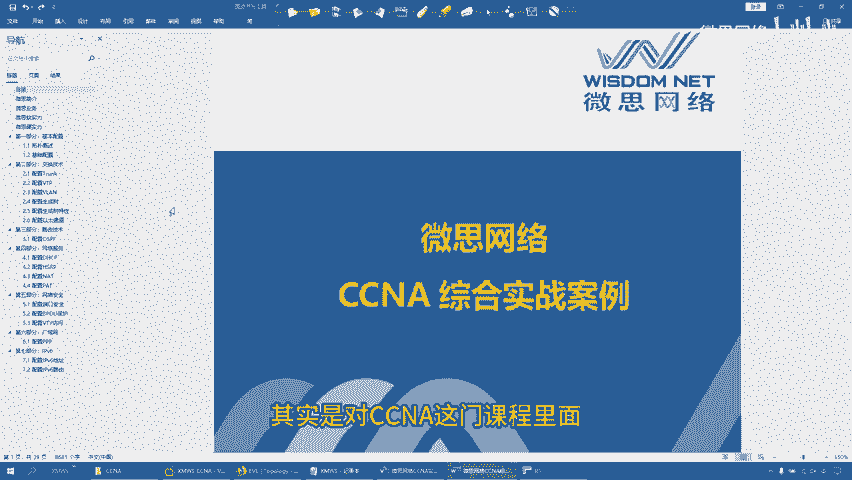

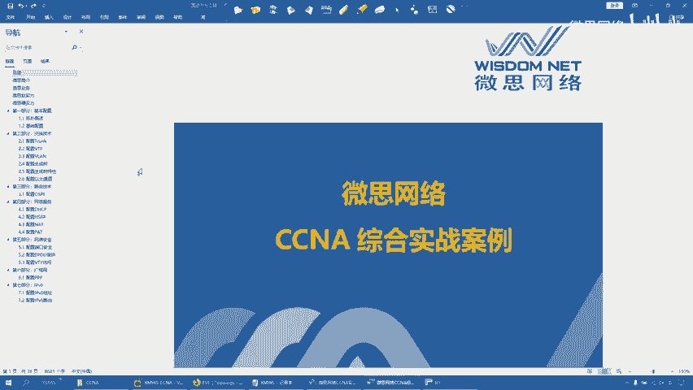

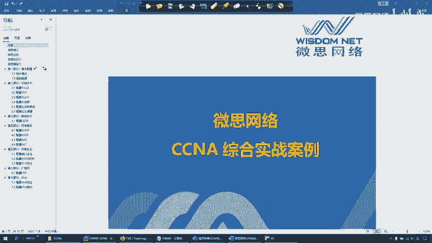

在本节课中，我们将要学习CCNA综合实战案例的整体内容框架。这个实战案例是对CCNA课程中各个知识点的综合考察与应用。

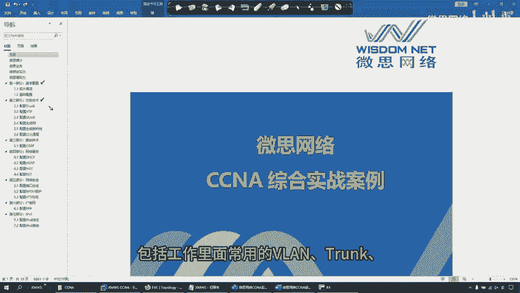

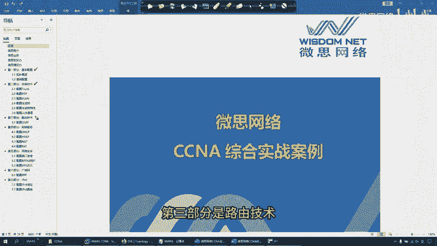

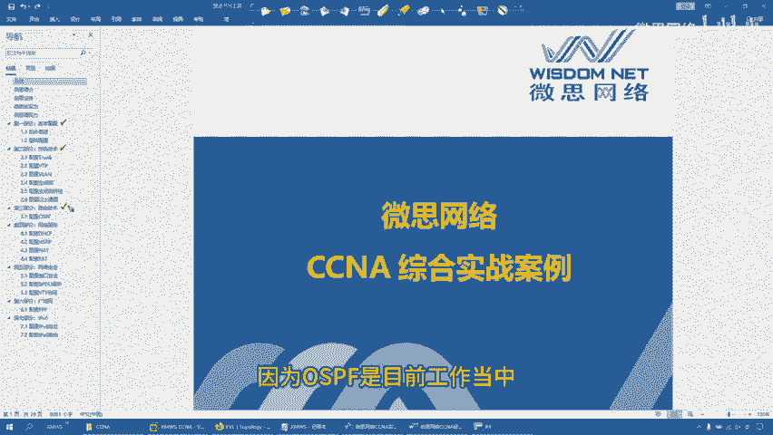

整个实战案例被划分为七个主要部分，每一部分都聚焦于网络技术中的一个核心领域。

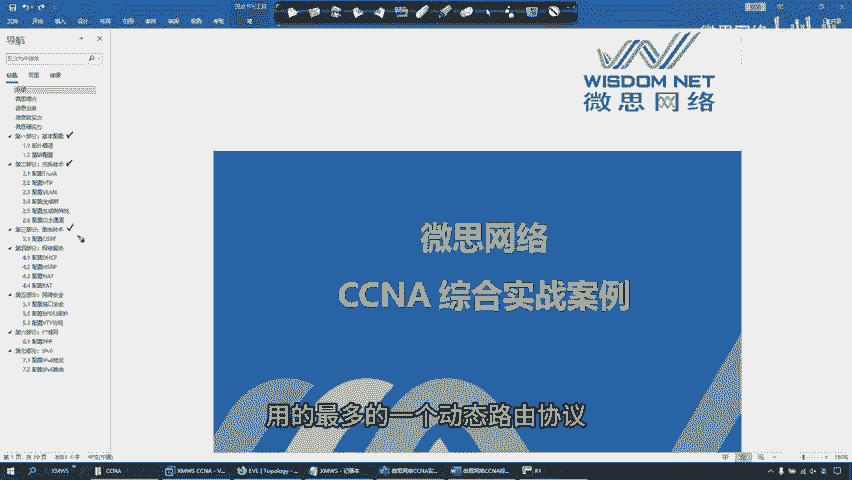

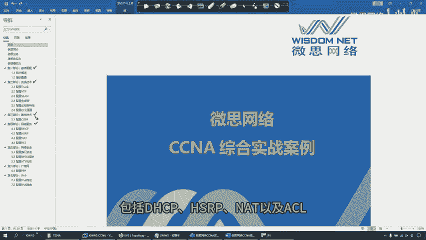

以下是这七个部分的详细介绍：

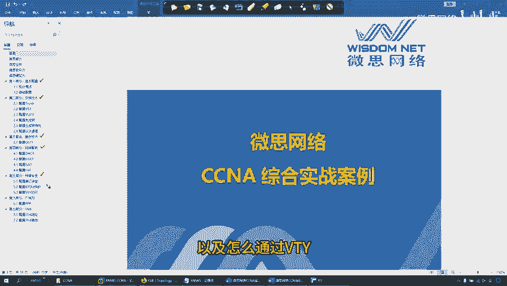

*   **第一部分：基本配置**。这部分内容涉及网络设备的基础设置，为后续复杂技术的实施打下基础。
*   **第二部分：交换技术**。这部分将涵盖工作中常用的交换技术，包括VLAN、Trunk、VTP、生成树协议以及以太通道。
*   **第三部分：路由技术**。这部分主要考察OSPF动态路由协议。因为OSPF是目前工作和项目中使用最广泛的动态路由协议。
*   **第四部分：网络服务**。这部分内容包括DHCP、HSRP、NAT以及ACL等关键网络服务。
*   **第五部分：网络安全**。这部分将介绍网络安全技术，例如端口安全、BPDU防护，以及如何通过VTY线路限制对设备的远程访问。
*   **第六部分：广域网**。这部分主要考察PPP协议的CHAP认证。
*   **第七部分：IPv6**。这部分内容涉及下一代互联网协议IPv6的相关配置。

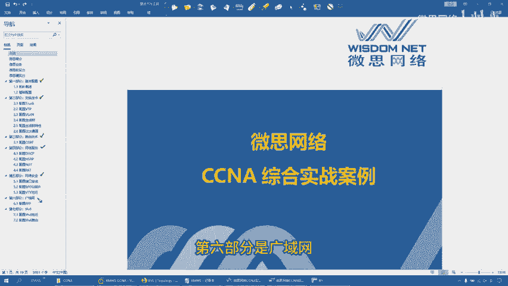

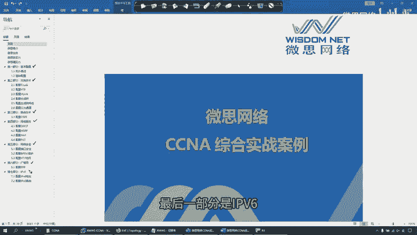

本节课中，我们一起学习了CCNA综合实战案例的七个核心组成部分。从基础配置到高级的交换、路由、安全及广域网技术，这个案例系统地串联了CCNA的关键知识点，为实际网络工程操作提供了完整的练习框架。