# CCNA教程合集：12：静态路由与RIP协议详解

在本节课中，我们将学习网络工程中的两个核心概念：静态路由和动态路由选择协议RIP。我们将了解静态路由的配置方法、适用场景，以及RIP协议的工作原理和基本配置。通过结合实战案例，我们将掌握如何在一个典型的中小型企业网络中同时运用静态路由和RIP协议，实现内网到外网的互联互通。

## 静态路由配置详解

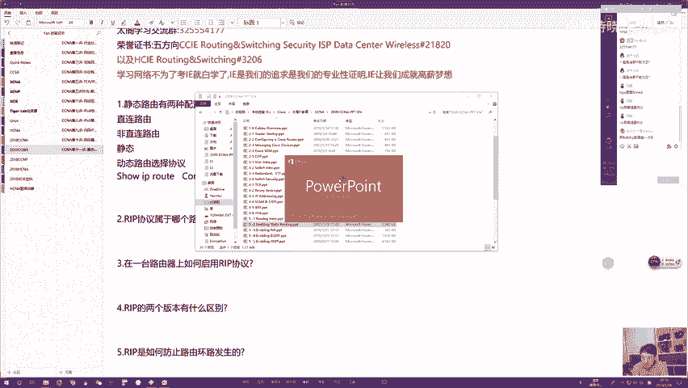

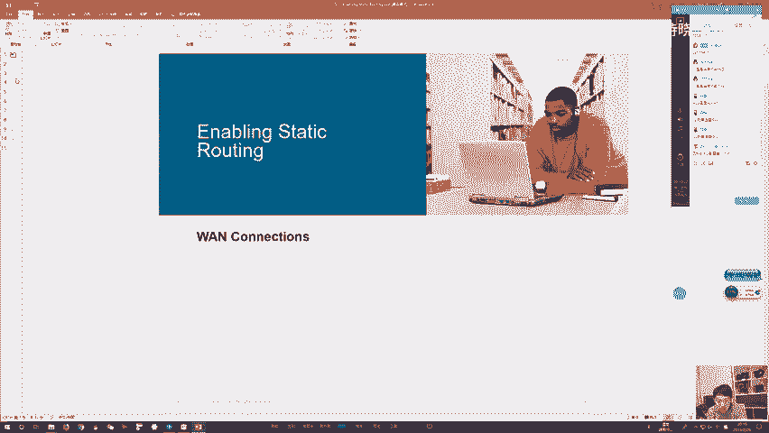

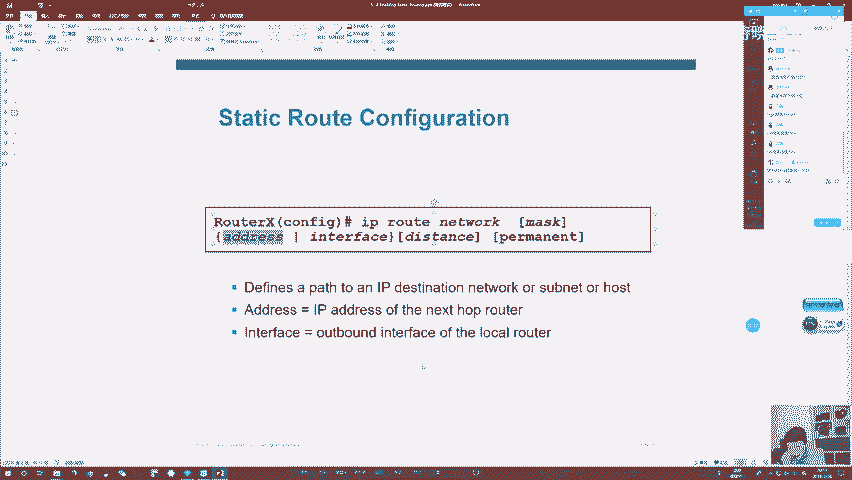

上一节我们介绍了路由器的控制层面和数据层面，以及直连路由与非直连路由的区别。本节中，我们来看看如何通过配置静态路由，让路由器学习到去往非直连网络的路径信息。

静态路由是指管理员通过手动输入命令，明确告知路由器去往某个特定网络的路径。其配置命令格式如下：

```
ip route [目的网络前缀] [目的网络掩码] {出站接口 | 下一跳地址}
```

在配置静态路由时，有两种写法：
1.  **关联出站接口**：指定数据包从路由器的哪个物理接口发出。
2.  **关联下一跳地址**：指定数据包应该发送给路径上的下一台路由器的接口地址。

选择哪种写法，取决于路由器去往目的网络的**出站接口所连接的网络类型**。

以下是两种网络类型的核心区别：
*   **点到点网络**：网络中只有两个节点。例如，串行链路。在这种网络中，数据包从接口发出后，唯一的接收者就是链路对端的设备。**此时，配置静态路由关联出站接口是更高效的选择**，因为路由器无需递归查询路由表来确定下一跳，转发延迟更低。
*   **多路访问网络**：网络中可以有多个节点。例如，以太网。在这种网络中，数据包从接口发出后，可能有多台设备可以接收。**此时，配置静态路由必须关联下一跳地址**。如果只关联出站接口，路由器无法确定应该将数据包发送给网络中的哪一台设备，可能导致通信失败或效率低下。

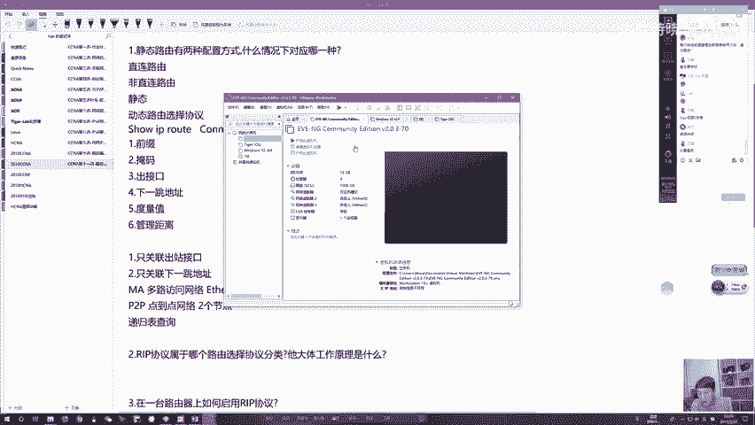


### 静态路由配置实验

为了加深理解，我们通过一个实验来演示静态路由的配置和端到端通信的概念。

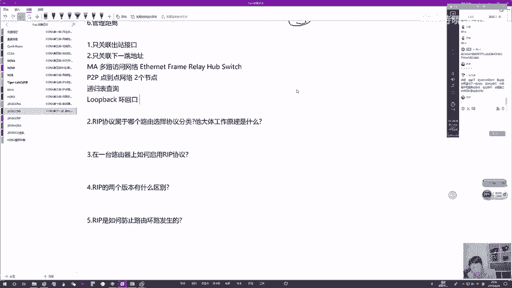

实验拓扑：三台路由器（R1， R2， R3）两两互联，每台路由器上配置一个环回接口模拟所连接的主机。

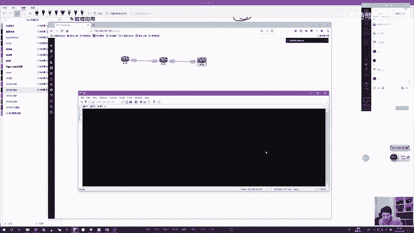

**实验目标**：通过配置静态路由，实现三台路由器环回接口之间的互通。

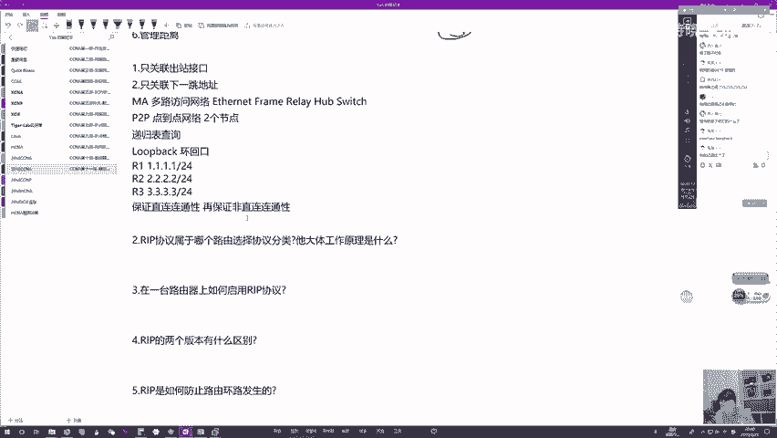

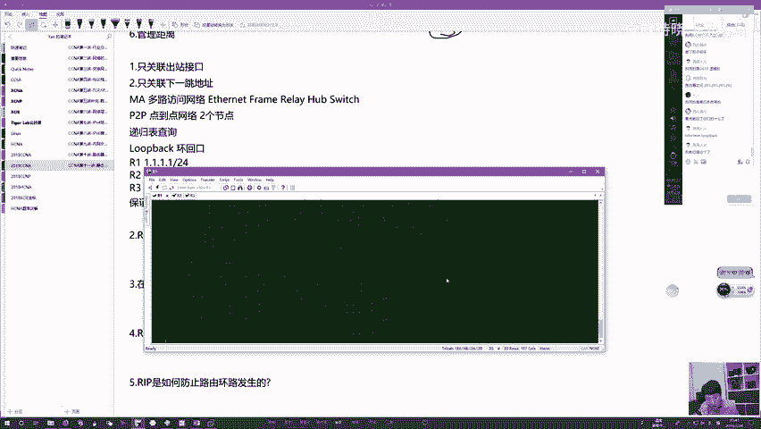

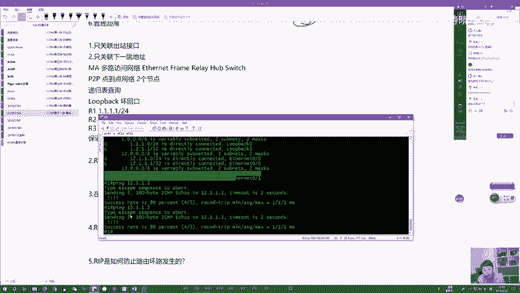

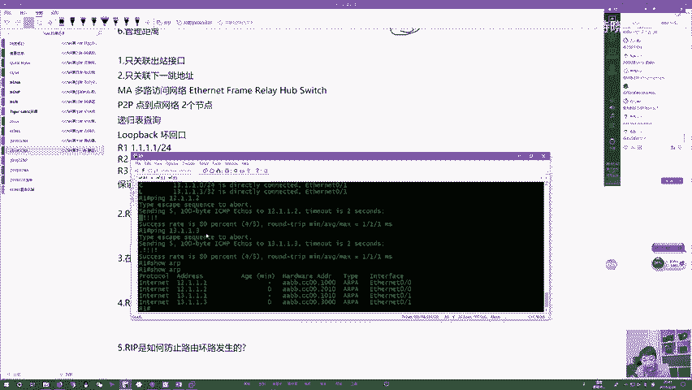

**配置步骤**：
1.  为每台路由器的物理接口和环回接口配置IP地址。
2.  在每台路由器上查看直连路由，并使用 `ping` 命令测试直连链路的连通性。**这是网络排错的第一步，必须保证直连通信正常**。
3.  在R2上配置去往R1环回口网络的静态路由，下一跳指向R1的接口地址。
4.  在R1上配置去往R2环回口网络的静态路由，下一跳指向R2的接口地址。此时，使用 **`ping [目标地址] source [源地址]`** 命令（即带源ping）测试，R2的环回口才能ping通R1的环回口。这说明了通信是双向的，必须保证去程和回程都有正确的路由。
5.  依此类推，为R2访问R3、R3访问R2等路径配置相应的静态路由。

**实验总结**：通过这个实验，我们验证了静态路由的配置方法，并深刻理解了网络连通性需要双向路径都可达。静态路由在企业网中常用于边界路由器，配置一条默认路由指向运营商，以实现内网访问互联网。

然而，静态路由也有其局限性：配置工作量大、不能自动适应网络拓扑变化。因此，在复杂的企业内网中，通常会运行动态路由选择协议。

## 动态路由协议RIP入门

上一节我们手动配置了静态路由，本节中我们来看看如何通过动态路由协议RIP，让路由器自动学习并交换路由信息。

RIP是一种早期的内部网关协议，属于距离矢量协议。它通过周期性地广播或组播路由更新报文，与邻居路由器交换路由表信息。RIP使用**跳数**作为度量值来衡量路径好坏，最大跳数为15，超过15跳则认为网络不可达，因此RIP只适用于中小型网络。

RIP有两个版本：
*   **RIPv1**：有类路由协议，不支持VLSM，以广播形式发送更新。
*   **RIPv2**：无类路由协议，支持VLSM，以组播地址`224.0.0.9`发送更新，并支持路由认证。**在实际应用中，我们通常使用RIPv2**。

### RIPv2基本配置

在思科路由器上启用RIPv2的基本步骤如下：

```
Router(config)# router rip // 启用RIP进程
Router(config-router)# version 2 // 指定版本为2
Router(config-router)# no auto-summary // 关闭自动汇总（重要！）
Router(config-router)# network [主类网络号] // 宣告接口
```

**配置说明**：
*   `no auto-summary`：关闭自动汇总后，RIP在发送更新时会携带精确的子网掩码，从而支持不连续子网和VLSM。
*   `network`：此命令的作用是“宣告”接口。被宣告的接口将启用RIP进程，可以收发RIP报文，并且该接口的直连网络路由会被放入RIP更新中发送给邻居。

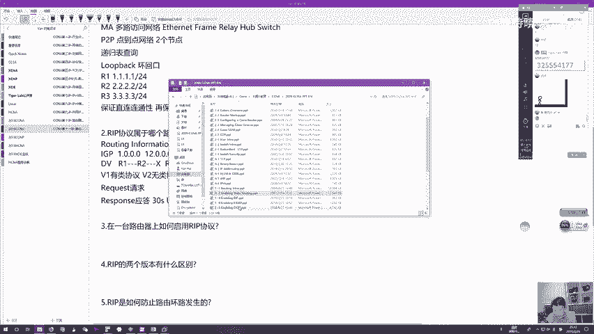

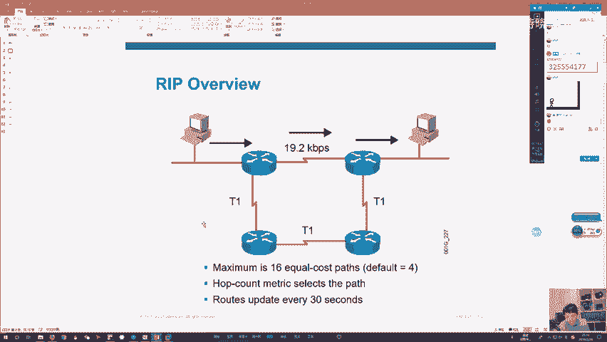

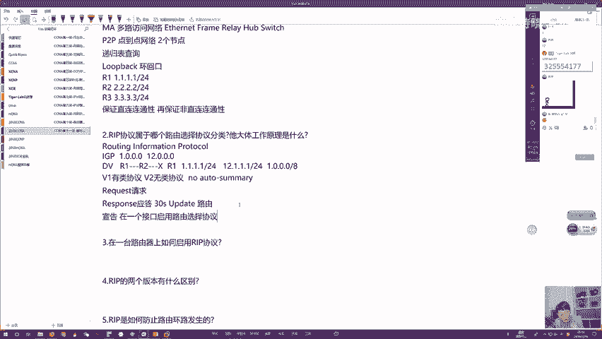

以下是RIPv2与RIPv1的核心特性对比：

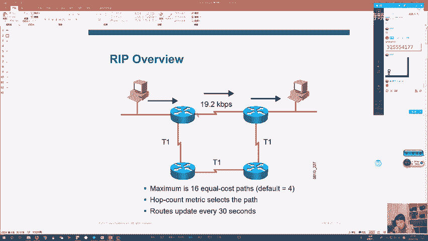


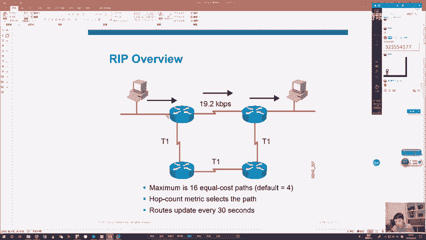

| 特性 | RIPv1 | RIPv2 |
| :--- | :--- | :--- |
| **路由协议类型** | 有类 | 无类 |
| **支持VLSM** | 否 | 是 |
| **更新发送方式** | 广播 | 组播 (`224.0.0.9`) |
| **更新中携带掩码** | 否 | 是 |
| **支持认证** | 否 | 是 |

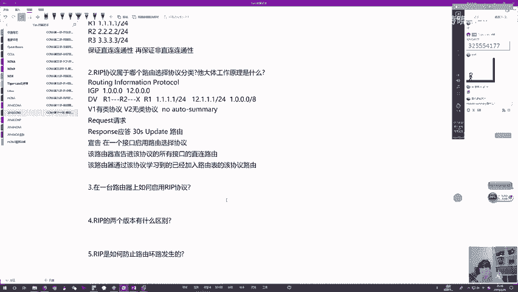

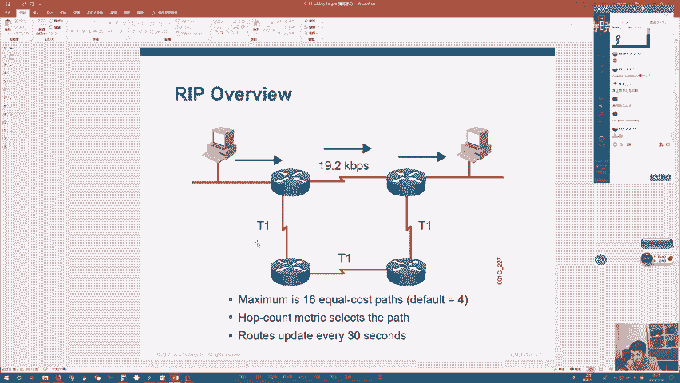

### 静态路由与RIP的协同：默认路由下发

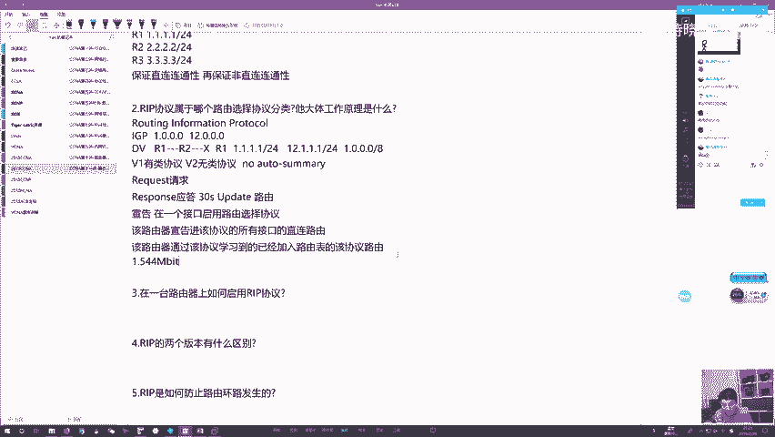

在企业网络的实际部署中，通常采用“内网动，外网静”的策略：
*   **内网**：运行RIP等动态路由协议，实现内网路由的自动学习和收敛。
*   **边界**：在连接互联网的边界路由器上配置静态默认路由。


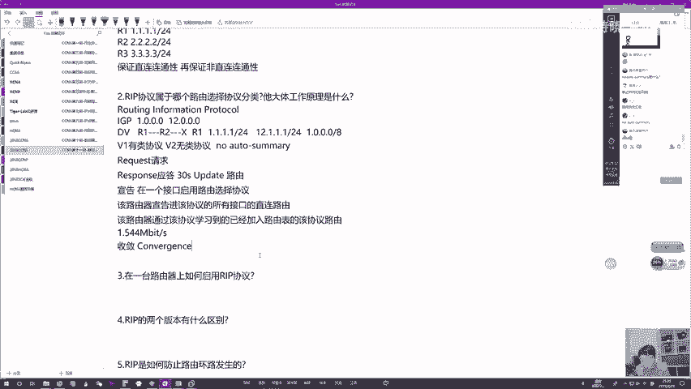

但内网的其他设备如何访问互联网呢？这就需要边界路由器将默认路由“下发”到内网的RIP域中。这可以通过**重分发**实现：

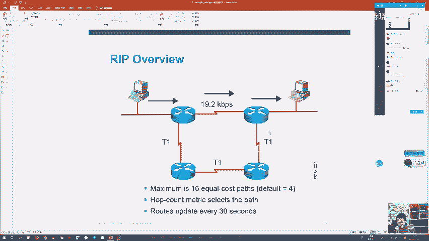


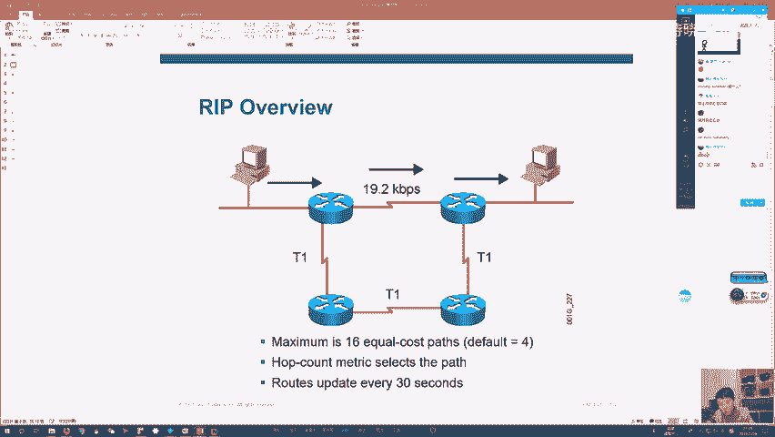

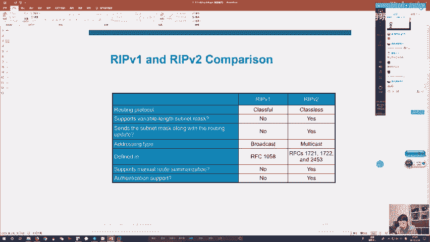

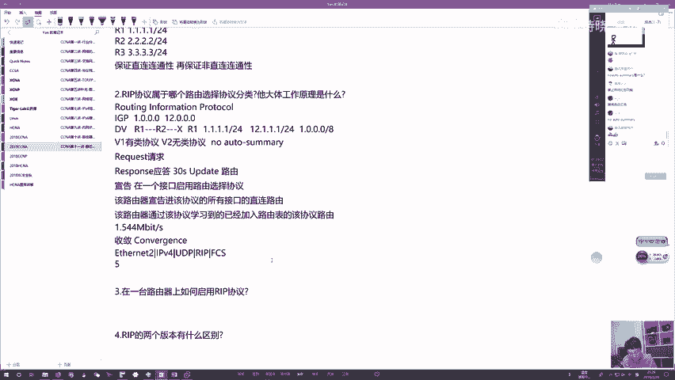

```
边界路由器(config)# router rip
边界路由器(config-router)# default-information originate // 将默认路由重分发进RIP
```

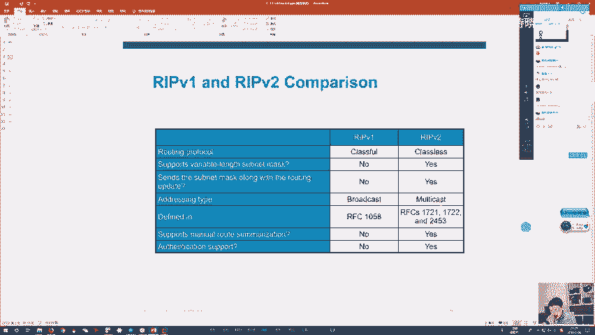

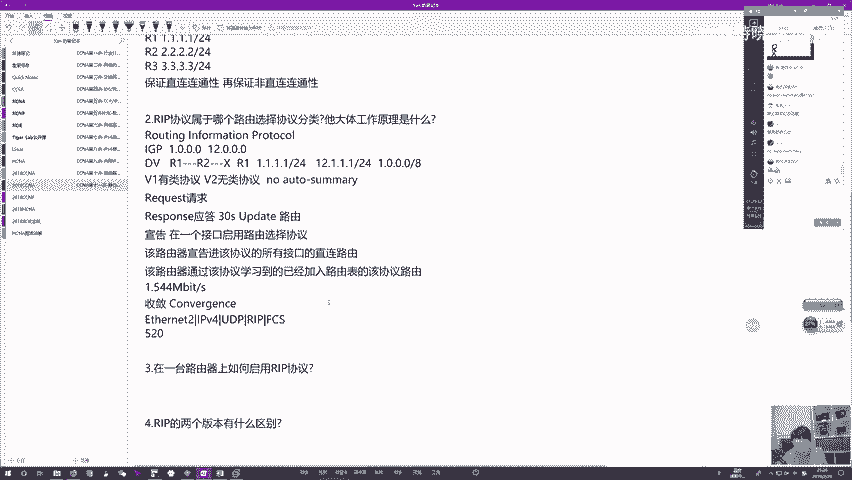


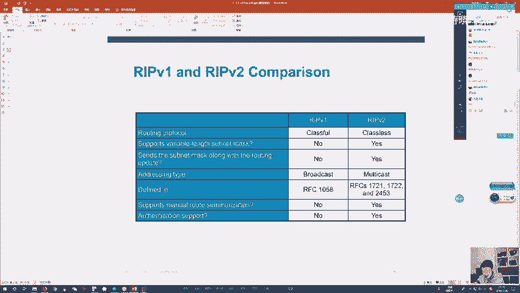


配置此命令后，边界路由器会通过RIP更新，将自身的默认路由通告给内网的所有RIP邻居。内网设备收到后，就会生成一条指向边界路由器的默认路由，从而实现整个内网对外网的访问。

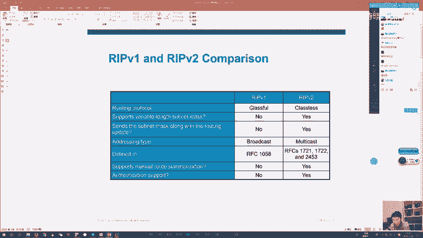


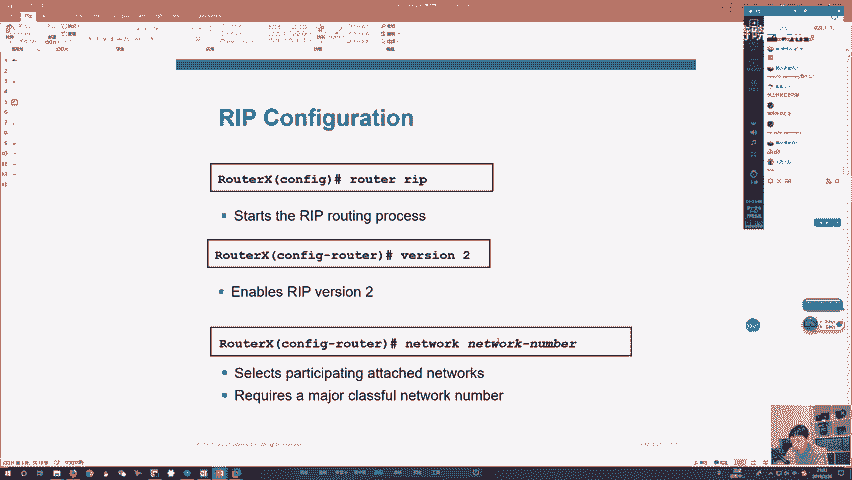

## 课程总结

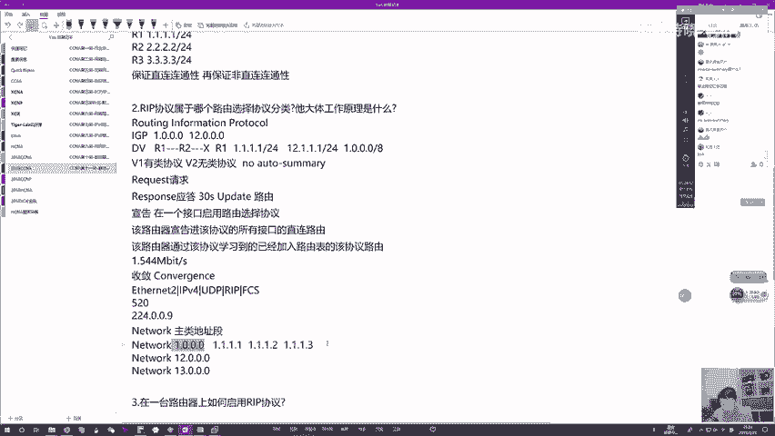

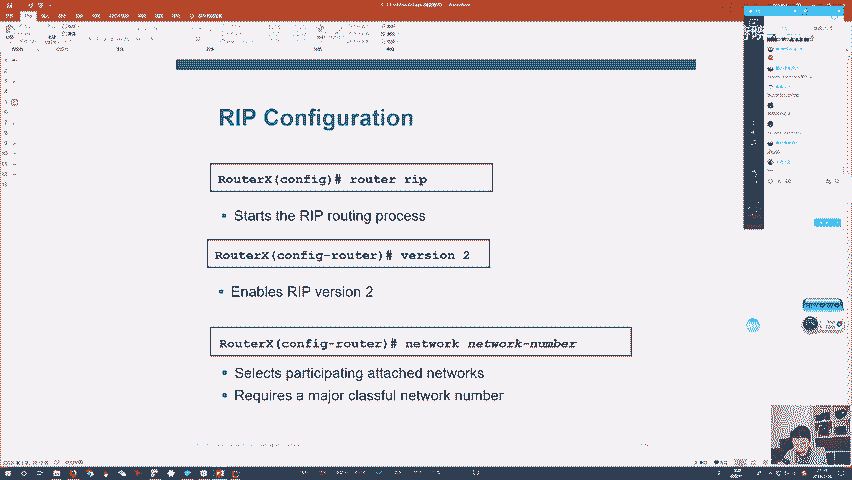

本节课中我们一起学习了网络路由的核心知识：
1.  **静态路由**：我们掌握了其配置命令的两种写法（出接口/下一跳），并理解了根据网络类型（点到点/MA）选择配置方式的原则。通过实验，我们验证了静态路由的配置和双向通信的必要性。
2.  **动态路由协议RIP**：我们了解了RIP作为距离矢量协议的工作原理，学习了RIPv2的优越性和基本配置命令（启用进程、设定版本、关闭自动汇总、宣告网络）。
3.  **综合应用**：我们探讨了在企业网中，如何在边界使用静态默认路由访问外网，并通过RIP的`default-information originate`命令，将默认路由下发到内网，实现全网互联互通的典型方案。

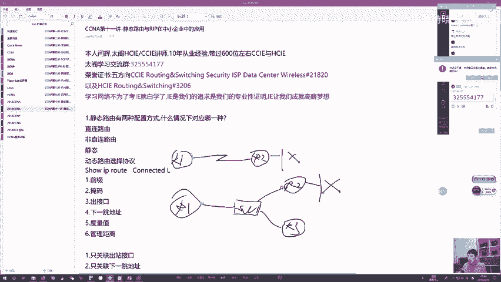

这些内容是构建中小型企业网络的基础，理解并掌握它们对于网络工程师至关重要。